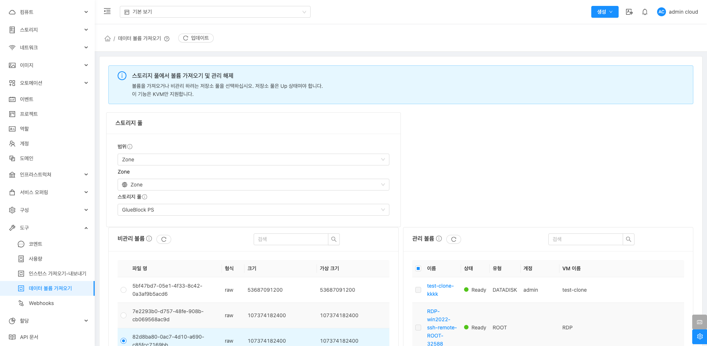
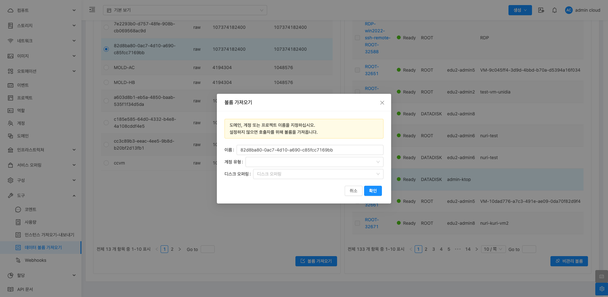
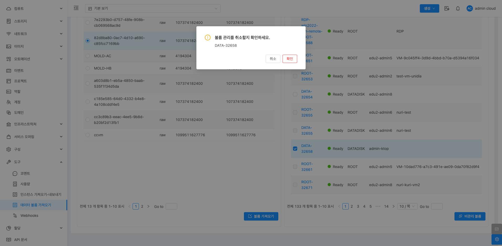

# 데이터 볼륨 가져오기

## 개요
데이터 볼륨 가져오기 메뉴는 ABLESTACK 클라우드 환경에서 외부에 있는 비관리 데이터 볼륨을 관리형 데이터 볼륨으로 전환하거나 반대로 관리 볼륨을 비관리 볼륨으로 전환하기 위해 제공되는 기능입니다.

!!! note "NOTE"
    * 저장소 풀은 Up 상태여야 합니다.
    * 이 기능은 KVM만 지원합니다.

{ .imgCenter .imgBorder }

## 기능 및 사용 방법
1. 스토리지 풀 선택 및 비관리 볼륨 조회
    * 화면 상단에서 Zone과 스토리지 풀을 선택하여 가져올 비관리 볼륨을 조회합니다.
    * 선택한 스토리지 풀에 있는 비관리 데이터 볼륨이 목록으로 표시됩니다.

2. 비관리 볼륨 선택
    * ABLESTACK에 의해 제어되지 않는 볼륨입니다.
    * 조회된 비관리 볼륨 목록 중에서 필요한 볼륨을 선택할 수 있습니다.
    * 각 볼륨의 파일명, 형식, 크기, 가상 크기 등의 정보를 확인하고 선택합니다.

3. 볼륨 가져오기: 비관리 볼륨 섹션에서 볼륨 가져오기는 외부 환경에서 사용하던 디스크를 클라우드 관리형 볼륨으로 전환하여 중앙 집중적으로 관리할 수 있도록 해주는 기능입니다.
     { .imgCenter .imgBorder }
     * 선택이 완료되면 우측 하단의 볼륨 가져오기 버튼을 클릭하여 가져오기 작업을 시작합니다.
     * 필드 값을 입력 또는 선택합니다.
        * 이름: 가져올 볼륨의 식별자입니다. 비관리 볼륨 목록에서 선택한 볼륨의 이름이 자동으로 표시됩니다.
        * 계정 유형: 가져온 볼륨을 소속시킬 계정을 지정합니다. 도메인 또는 프로젝트 이름을 설정하지 않으면 호출자를 위해 볼륨을 가져옵니다.
        * 디스크 오퍼링: 볼륨에 할당할 디스크 오퍼링을 선택합니다. 가져온 볼륨의 크기와 요구 사항에 맞는 디스크 오퍼링을 지정해야 합니다.
    * 가져오기가 완료되면 해당 볼륨은 ABLESTACK에 의해 제어되는 관리 볼륨 목록으로 전환됩니다.

4. 비관리 볼륨: 관리 볼륨 섹션에서 비관리 볼륨 기능은 Mold에서의 관리 볼륨을 비관리 볼륨으로 전환할 수 있는 기능입니다.
    { .imgCenter .imgBorder }
    * 가상머신과 연결되지 않은 볼륨을 선택합니다.
    * 비관리 인스턴스 버튼을 클릭하여 관리 상태를 해제합니다.

