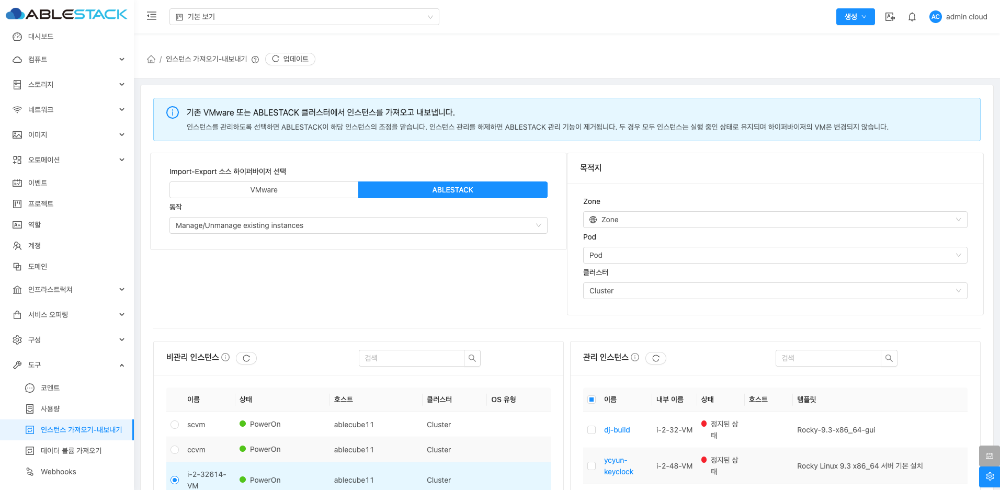
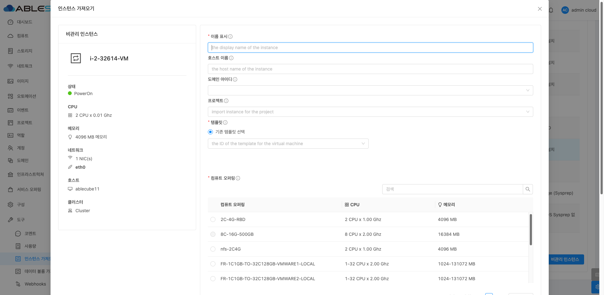
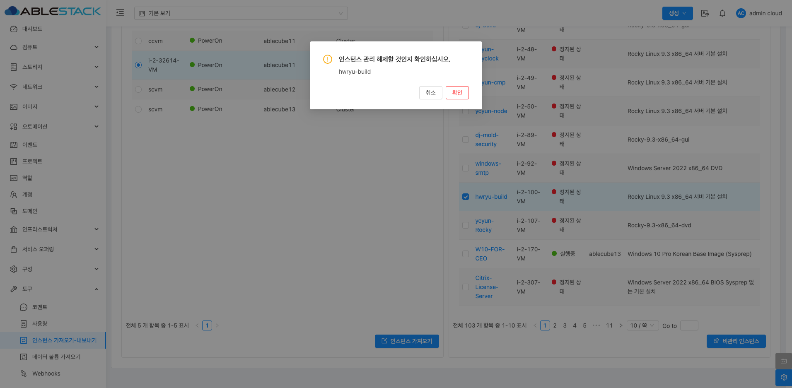

# 인스턴스 가져오기-내보내기

## 개요
인스턴스 가져오기-내보내기 메뉴는 기존 VMware 또는 ABLESTACK 클러스터에서 인스턴스를 가져오거나 내보낼 수 있는 기능을 제공합니다. 이를 통해 이미 사용 중인 인스턴스를 관리하거나, 관리 해제하여 ABLESTACK 관리 기능을 제거할 수 있습니다.
관리 해제된 인스턴스는 실행 상태를 그대로 유지하며, 하이퍼바이저의 VM 자체에는 영향을 주지 않습니다.

{ .imgCenter .imgBorder }

## 기능 및 사용 방법
1. 소스 하이퍼바이저 선택
   * VMware 또는 ABLESTACK 중 가져오거나 내보낼 소스를 선택합니다.
   * 선택된 하이퍼바이저에 따라 관리 또는 관리 해제 동작을 수행할 수 있습니다.
   * 동작 옵션:
      * VMware
           * Manage/Unmanage existing instances: VMware에서 이미 관리 중인 인스턴스를 ABLESTACK 관리로 가져오거나 해제합니다.
           * Migrate existing instances to ABLESTACK: VMware에서 실행 중인 인스턴스를 ABLESTACK 환경으로 마이그레이션합니다.
      * ABLESTACK
           * Manage/Unmanage existing instances: ABLESTACK에서 이미 관리 중인 인스턴스를 관리하거나 해제합니다.
           * Import Instance from remote KVM host: 원격 KVM 호스트에서 인스턴스를 가져옵니다.
           * Import QCOW2 image from Local Storage: 로컬 스토리지에서 QCOW2 이미지를 가져옵니다.
           * Import QCOW2 image from Shared Storage: 공유 스토리지에서 QCOW2 이미지를 가져옵니다.

2. 목적지 설정
    * Zone, Pod, 클러스터를 설정하여 인스턴스가 배치될 위치를 지정합니다.

3. 인스턴스 목록 관리
    * 비관리 인스턴스 목록:
        * 비관리 인스턴스: 현재 VMware 또는 ABLESTACK에서 관리하고 있지 않은 인스턴스 목록을 보여줍니다.
    * 관리 인스턴스 목록:
        * 관리 인스턴스: 현재 VMware 또는 ABLESTACK에서 관리 중인 인스턴스 목록을 보여줍니다.

4. 작업 수행
    * 인스턴스 선택:
        * 비관리 인스턴스 목록에서 가져오려는 인스턴스를 선택합니다.
    * 작업 버튼 클릭:
        * 비관리 인스턴스 우측 하단에 있는 "인스턴스 가져오기" 버튼을 클릭합니다.
        * 선택한 인스턴스가 관리 인스턴스 목록으로 이동합니다.
    * 가져오기 확인:
        * 인스턴스를 가져오면 ABLESTACK에서 해당 인스턴스를 관리할 수 있습니다.
        * 비관리 인스턴스 목록에 나열된 인스턴스 중 "PowerOn" 상태의 인스턴스를 가져오는 경우, 가져오기 완료 후 상태를 확인하여 정상적으로 관리되는지 확인해야 합니다.

## 인스턴스 가져오기
비관리 인스턴스 우측 하단에 있는 "인스턴스 가져오기" 버튼을 클릭하면 선택한 인스턴스의 상세 정보를 확인하고 설정할 수 있는 화면이 나타납니다.

{ .imgCenter .imgBorder }

* 기본 정보
    * 상태: 인스턴스의 현재 상태 (예: PowerOn)
    * CPU: 할당된 CPU 정보
    * 메모리: 할당된 메모리 크기
    * 네트워크: NIC 및 IP 정보
    * 호스트: 인스턴스가 속한 호스트
    * 클러스터: 인스턴스가 속한 클러스터
* 이름 표시
    * 가져올 인스턴스의 이름을 설정할 수 있습니다.
* 호스트 이름
    * 가져올 인스턴스가 속한 호스트의 이름을 입력합니다.
* 도메인 아이디
    * 인스턴스가 속한 도메인 ID를 지정합니다.
* 프로젝트 선택
    * 인스턴스를 특정 프로젝트에 포함시킬 수 있습니다.
* 템플릿 선택
    * 가져올 인스턴스의 OS 템플릿을 선택합니다.
    * 기존 템플릿을 선택하거나 새로운 템플릿을 지정할 수 있습니다.
* 컴퓨트 오퍼링
    * 인스턴스에 할당할 CPU와 메모리 리소스를 선택할 수 있습니다.
    * 다양한 컴퓨트 오퍼링 중 선택 가능합니다.
* 네트워크 선택
    * 가져올 인스턴스의 IP 주소를 지정할 네트워크를 선택합니다.
    * IP 주소를 자동 할당하거나 수동으로 설정할 수 있습니다.
    * VM nic to network id 매핑: 키 값으로 NIC와 네트워크를 사용하여 매핑합니다.
* 마이그레이션 허용
    * 체크 시 인스턴스와 볼륨이 서로 다른 호스트 또는 풀로 마이그레이션할 수 있습니다.
    * 비호환성 문제 해결: 현재 호스트 또는 풀과 호환되지 않는 오퍼링이 전달될 경우에도 마이그레이션이 허용됩니다.
* 강제
    * 체크 시 가져오는 VM의 일부 NIC의 MAC 주소가 이미 존재하더라도 인스턴스를 가져옵니다.
    * MAC 주소 중복 처리: 중복된 MAC 주소가 있을 경우 새로운 MAC 주소가 자동으로 생성됩니다.

!!! note "NOTE"
    * 마이그레이션 허용을 설정할 경우 리소스 관리에 유의해야 합니다.
    * MAC 주소 중복 문제가 발생할 수 있으므로 강제 가져오기 옵션 사용 시 신중해야 합니다.
    * 설정한 네트워크와 컴퓨트 오퍼링이 클라우드 환경에 적합한지 사전에 검토가 필요합니다

## 비관리 인스턴스
관리 인스턴스의 우측 하단에 있는 비관리 인스턴스 버튼을 클릭하면 ABLESTACK 클라우드에서 관리 중인 해당 인스턴스를 다시 외부 관리 상태로 되돌리는 작업을 수행합니다.

{ .imgCenter .imgBorder }

## 용어사전

* QCOW2 이미지 (QEMU Copy-On-Write Version 2)
    * 클라우드 인프라
    * QEMU(Quick EMUlator)에서 사용하는 디스크 이미지 파일 형식으로, 가상 머신(VM)의 디스크 저장소로 널리 사용됩니다.
    * Copy-On-Write(COW) 메커니즘을 사용하여 효율적인 디스크 공간 관리와 스냅샷 기능을 제공합니다.
    * Mold에서도 KVM 기반 가상 머신의 기본 디스크 포맷으로 사용됩니다.
