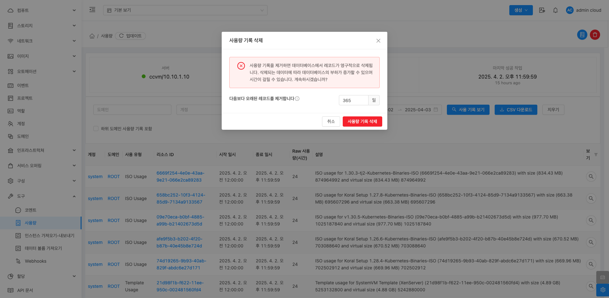

# 사용량

## 개요
Mold에서 클라우드 자원의 사용 이력을 관리하는 도구입니다. 사용량을 시간 단위로 확인하고, 관리 목적으로 다운로드할 수 있습니다.

{ .imgCenter .imgBorder }
## 사용량 메뉴 화면 구성
* 상단 정보 패널
    - 서버 상태: 현재 사용량 서버의 상태를 표시합니다.
    - 마지막 Heartbeat: 사용량 서버의 마지막 Heartbeat 시간을 표시합니다.
    - 마지막 성공 작업: 사용량 수집이 마지막으로 성공한 시간을 표시합니다.
* 검색 및 필터 기능
    - 도메인: 특정 도메인에 대한 사용량을 필터링할 수 있습니다.
    - 계정: 특정 계정으로 필터링하여 사용량을 확인할 수 있습니다.
    - 사용 유형: 가상머신, 네트워크, 스토리지 등 다양한 자원 유형을 선택하여 필터링할 수 있습니다.
    - 리소스 ID: 특정 자원의 ID로 검색할 수 있습니다.
    - 기간 필터: 시작일과 종료일을 지정하여 해당 기간의 사용량을 확인할 수 있습니다.
    - 하위 도메인 사용량 기록 포함:
        - 체크 시, 선택한 도메인의 하위 도메인 사용 기록까지 포함하여 조회할 수 있습니다.
* 작업 버튼
    - 사용 기록 보기: 설정한 조건으로 사용량을 조회합니다.
    - CSV 다운로드: 조회한 사용량을 CSV 파일로 다운로드할 수 있습니다.
    - 지우기: 검색 조건을 초기화합니다.
* 사용량 목록
조회 결과가 표 형태로 나타나며, 다음 정보를 포함합니다.
    - 계정: 사용량이 집계된 계정
    - 도메인: 계정이 속한 도메인
    - 사용 유형: 자원 유형 (CPU, 메모리 등)
    - 리소스 ID: 사용량이 집계된 자원의 ID
    - 시작 일시: 사용량 집계 시작 시간
    - 종료 일시: 사용량 집계 종료 시간
    - Raw 사용량(시간): 사용 시간 단위로 계산된 사용량
    - 설명: 사용 유형에 대한 간단한 설명
    - 보기: 상세 정보 보기 버튼

## 사용량 기록 생성
사용량 메뉴 화면 오른쪽 상단의 사용량 기록 생성 버튼을 클릭하여 특정 시간 범위 내 클라우드 자원의 사용량 데이터를 수집하여 기록을 생성합니다. 이 기능은 예약된 사용 작업이 실행되지 않았거나 실패한 경우에 수동으로 사용량 기록을 생성할 때 유용합니다.

{ .imgCenter .imgBorder }
{ .imgCenter .imgBorder }

## 사용량 기록 삭제
사용량 메뉴 화면 오른쪽 상단의 사용량 기록 삭제 버튼을 클릭합니다. 이 기능은 데이터베이스에 저장된 사용량 기록을 영구적으로 제거하여 데이터베이스의 부하를 줄이기 위해 사용됩니다.

{ .imgCenter .imgBorder }
{ .imgCenter .imgBorder }

## 용어사전

* Heartbeat (하트비트)
    * 클라우드 인프라와 분산 시스템에서 서버나 노드 간의 상태를 주기적으로 확인하기 위해 사용하는 신호 패킷입니다.
    * 노드가 정상적으로 동작하고 있는지 확인하기 위해 일정 주기로 신호를 보내고, 응답이 없으면 장애 발생으로 간주합니다.
    * 클러스터 환경에서 가용성(HA)을 확보하기 위한 핵심 요소로 사용됩니다.

