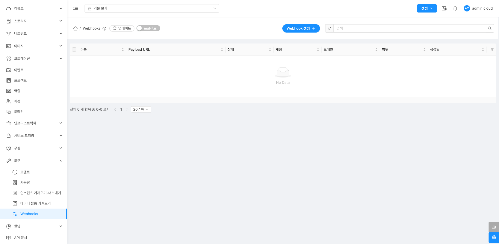
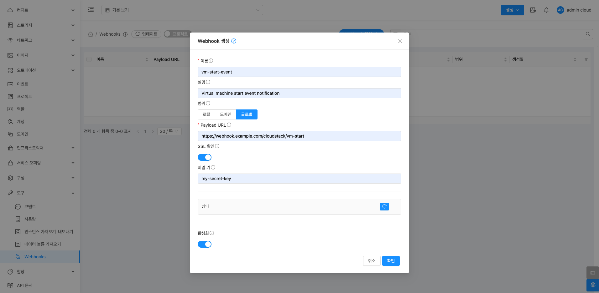

# Webhooks

## 개요
Webhooks 기능을 활용하여 Mold 이벤트에 대한 실시간 알림을 외부 시스템과 연동하여 자동화된 워크플로우를 구축할 수 있습니다.

{ .imgCenter .imgBorder }

## Webhook 메뉴 화면 구성

## Webhook 생성
Webhook 생성 버튼을 클릭하여 다음 정보를 입력합니다.

{ .imgCenter .imgBorder }

* 이름: Webhook의 이름
* 설명: Webhook에 대한 설명
* 범위: Webhook의 범위. Root 관리자 또는 도메인 관리자에게만 표시되며, 선택 가능한 값은 Local, Domain, Global입니다. Local은 소유 계정의 이벤트만, Domain은 해당 도메인의 이벤트, Global은 모든 이벤트를 의미합니다. 일반 사용자는 Local 범위만 설정할 수 있습니다.
* 도메인 아이디: 선택 사항으로, Webhook이 적용될 도메인을 지정합니다. 계정을 지정할 경우 도메인도 함께 지정해야 합니다.
* Payload URL: 이벤트 발생 시 알림을 전송할 URL
* SSL 확인: HTTPS Payload URL 사용 시, SSL 인증서 검증 여부를 설정합니다.
* 비밀키 : 선택 사항으로 HTTP POST 요청을 서명할 때 사용하는 비밀 키
* 활성화: Webhook의 활성화 여부를 설정합니다.

