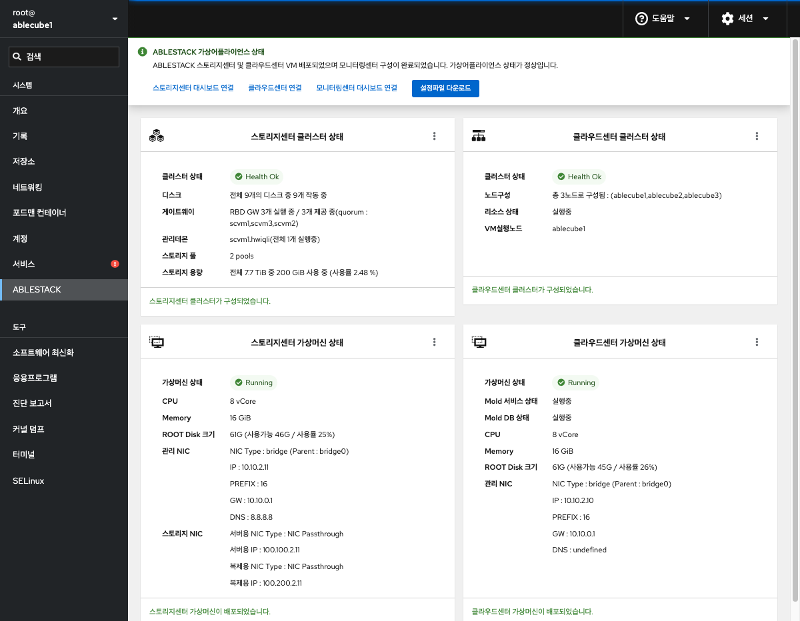
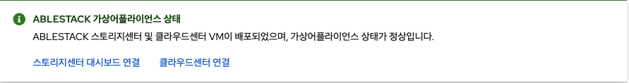
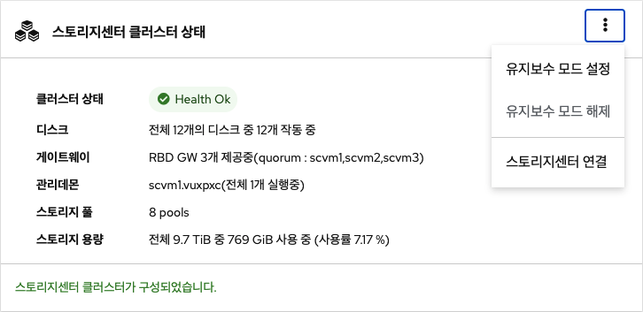
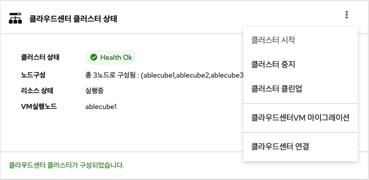
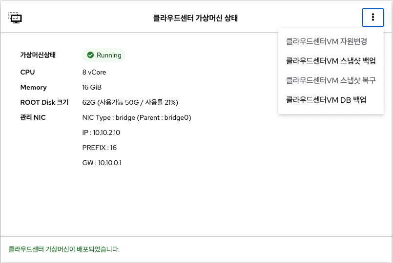

# ABLESTACK
Cube 웹 콘솔의 ABLESTACK 메뉴에서는 스토리지센터 가상머신, 클라우스센터 가상머신 배포와 클러스터를 구성하여 ABLESTACK 가상어플라이언스 관리 및 상태 모니터링을 제공합니다.

## ABLESTACK 메뉴의 인터페이스 구성

* ABLESTACK 요약 리본
* 스토리지센터 클러스터 상태
* 클라우드센터 클러스터 상태
* 스토리지센터 가상머신 상태
* 클라우드센터 가상머신 상태

## ABLESTACK 요약 리본
스토리지 가상머신, 클라우스센터 가상머신의 배포 및 클러스터 구성여부에 따라 현 상태를 메시지로 표현해 줍니다. 각 단계별 수행해야 되는 필수 구성 정보를 확인하여 설치 마법사 및 대시보드 링크를 제공하며 ABLESTACK 가상 어플라이언스 구성에 편의를 제공합니다.

**클러스터 구성 준비**

클러스터 구성 준비를 위한 마법사를 제공합니다.

* 모든 호스트, 가상머신 IP 세팅을 위한 Hosts 파일 생성
* SSH Key 생성
* 시간서버 등록  

**스토리지센터 VM 배포**

스토리지센터 가상머신(SCVM) 배포를 위한 마법사를 제공합니다.

* 자원 설정(컴퓨트, 디스크, 네트워크, NIC)
* Hosts 파일 세팅
* SSH Key 설정

**클라우드센터 VM 배포**

클라우드센터 가상머신(CCVM) 배포를 위한 마법사를 제공합니다.

* 자원 설정(컴퓨트, 디스크, 네트워크, NIC)
* Hosts 파일 세팅
* SSH Key 설정
  

**스토리지센터 대시보드 연결**

스토리지센터 대시보드(Glue)로 이동하는 URL 링크를 제공합니다.

**클라우드센터 연결**

클라우드센터VM의 가상화 관리 플랫폼(Mold)으로 이동하는 URL 링크를 제공합니다.

**모니링센터 구성**

모니터링센터 관리 대시보드 Wall 구성을 위한 마법사를 제공합니다.

**모터링센터 연결**

모니터링센터 관리 대시보드(Wall)로 이동하는 URL 링크를 제공합니다.

## 스토리지센터 클러스터 상태 조회
스토리지센터 클러스터의 현재 상태와 스토리지 자원의 정보를 확인할 수 있습니다.

**유지보수 모드 설정**

스토리지센터 클러스터 유지보수모드 설정을 할 수 있도록 실행하는 버튼입니다.

!!! info    
    * 현 상태가 유지보수모드일 경우 버튼이 비활성화됩니다.    

**유지보수 모드 해제**

스토리지센터 클러스터를 유지보수모드 해제 할 수 있도록 실행하는 버튼입니다.

!!! info    
    * 현 상태가 유지보수모드 해제된 경우 버튼이 비활성화됩니다.

**스토리지센터 연결**

스토리지 클러스터의 구성이 완료된 후 스토리지센터 대시보드(Glue)로 이동하는 버튼입니다.

!!! info
    * Bootstrap 실행 버튼이 활성화 중일 때 버튼이 숨겨집니다.
    * Bootstrap 실행 후 버튼이 활성화됩니다. 
    
**Bootstrap 실행**

스토리지센터 가상머신(SCVM)이 모든 호스트에 설치되고 스토리지 클러스터 자동구성을 위해 실행하는 버튼입니다.

!!! info
    * 호스트 한 곳에서만 실행하면 됩니다.
    * Bootstrap 실행 버튼 클릭 후 정상적으로 종료될 때까지 약 5분이 소요됩니다.
    * Bootstrap 실행 버튼은 초기 활성화 되어있지만 SCVM에 cloudinit 세팅이 완전히 끝나지 않은 경우 실행되지 않습니다.

**전체 시스템 종료**

ABLESTACK 전체 시스템을 종료하기 위한 프로세스 중, CUBE에서 실행되는 절차를 통합하여 자동으로 실행하도록 하는 기능입니다.

!!! info
    * 모든 호스트에서 실행 가능합니다.
    * 클라우드센터 클러스터 상태가 "HEALTH_OK"일 경우 버튼이 활성화됩니다.

!!! warning
    * **Mold에서의 재기동 절차** 중, "호스트 유지보수 모드 설정"까지 관리자가 수동으로 모두 완료한 후 실행해야 합니다.
    * 호스트에 Mount된 볼륨을 Umount한 후 해당 기능을 실행해야 합니다.

!!! note
    [Mold 재기동 절차] 

    1.	클라우드센터 HA 비활성화
    2.	모든 가상머신 종료
        1.	HA 용도의 가상머신 종료
        2.	사용자 가상머신 종료
    3.	Zone 비활성화
    4.	시스템 VM 종료
    5.	기본스토리지 유지보수 모드 설정
        1.	기본 스토리지 (ha) 유지보수 모드 설정
    6.	호스트 유지보수 모드 설정
        1.	호스트가 유지보수 모드로 변경 되었을 때 다음 호스트 유지보수 모드 설정 진행
    
## 클라우드센터 클러스터 상태 조회
Mold(클라우드 관리) 제품의 클러스터 현재 상태와 Cloud Center VM이 실행중인 호스트를 확인 할 수 있습니다.

**클라우드센터VM 시작**

클라우드센터VM을 시작 상태로 변경하기 위한 버튼입니다.

!!! info
    * 클라우드센터VM이 시작 중인 경우 버튼이 비활성화됩니다.

**클라우드센터VM 정지**

클라우드센터VM을 정지 상태로 변경하기 위한 버튼입니다.

!!! info
    * 클라우드센터VM이 정지 중인 경우 버튼이 비활성화 됩니다.

**클라우드센터 클러스터 클린업**

클라우드센터 클러스터 리소스 모니터링 재시작 하기 위한 버튼입니다.

**클라우드센터VM 마이그레이션**

클라우드센터 가상머신(CCVM)을 특정 호스트로 마이그레이션 하기 위한 버튼입니다.

**클라우드센터 연결**

클라우드센터 가상머신(CCVM)의 가상화 관리 플랫폼(Mold)로 연결되는 링크를 제공하는 버튼입니다.

**Bootstrap 실행**

클라우드센터 가상머신(CCVM)이 설치되고 클라우드센터 클러스터 자동구성을 위해 실행하는 버튼입니다.

!!! info
    * 호스트 한 곳에서만 실행하면 됩니다.
    * Bootstrap 실행 버튼 클릭 후 정상적으로 종료될 때까지 약 5분이 소요됩니다.
    * Bootstrap 실행 버튼은 초기 활성화 되어있지만 CCVM에 cloudinit 세팅이 완전히 끝나지 않은 경우 실행되지 않습니다.

**모니터링센터 구성**

모니터링센터 구성 마법사를 실행하기 위한 버튼입니다.

**모니터링센터 대시보드 연결**

모니터링센터 관리 대시보드(Wall)로 이동하는 URL 링크를 제공합니다.

## 스토리지센터 가상머신 상태 조회
스토리지센터 가상머신(Storage Center VM)의 현재 상태와 자원, 네트워크 정보를 확인 할 수 있습니다.

**스토리지센터VM 시작**

스토리지센터 가상머신(SCVM)의 시작하기 위한 버튼입니다.

!!! info
    * 스토리지센터 가상머신(SCVM)가 정지 상태일 경우 활성화됩니다.

**스토리지센터VM 정지**

스토리지센터 가상머신(SCVM)의 정지하기 위한 버튼입니다.

!!! info
    * 스토리지 클러스터가 유지보수모드 상태이면서 SCVM이 시작 상태일 경우 버튼이 활성화됩니다.

**스토리지센터VM 삭제**

스토리지센터 가상머신(SCVM)의 삭제하기 위한 버튼입니다.

!!! info
    * 스토리지 클러스터가 구성전일 때와 SCVM이 정지 상태일 때 버튼이 활성화됩니다.
    * 스토리지 클러스터가 구성된 경우 삭제 하실 수 없습니다.

**스토리지센터VM 자원변경**

스토리지센터 가상머신(SCVM)의 자원변경(CPU, Memory)을 하기 위한 버튼입니다.

!!! info
    * SCVM이 정지 상태일 때 버튼이 활성화됩니다.
    * SCVM 시작시 반영됩니다.

**스토리지센터 연결**

스토리지센터 가상머신(SCVM)의 Cube 웹 콘솔을 접속하기 위한 링크 버튼입니다.

!!! info
    * SCVM이 Running 상태일 때 버튼이 활성화됩니다.

## 클라우드센터 가상머신 상태 조회
클라우드센터 가상머신(Cloud Center VM)의 현재 상태와 자원, 네트워크 정보를 확인 할 수 있습니다.

**클라우드센터VM 자원변경**

클라우드센터 가상머신(CCVM)의 자원변경(CPU, Memory)을 하기 위한 버튼입니다.

!!! info
    * CCVM이 Running 상태일 때 버튼이 활성화됩니다.
    * CCVM 재시작시 반영됩니다.

**클라우드센터VM 스냅샷 백업**

클라우드센터VM 이미지를 수동으로 스냅샷 백업하기 위한 버튼입니다.

**클라우드센터VM 스냅샷 복구**

클라우드센터VM 이미지를 수동으로 복구하기 위한 버튼입니다.

!!! info
    * CCVM이 정지 상태일 때 버튼이 활성화됩니다.

**클라우드센터VM DB 백업**

클라우드센터VM Mold DB를 로컬로 다운로드 받는 기능입니다.