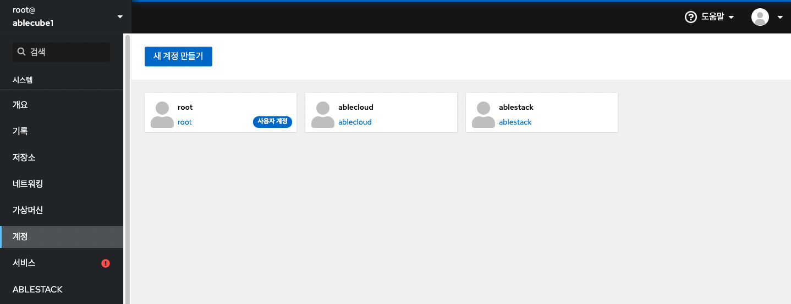
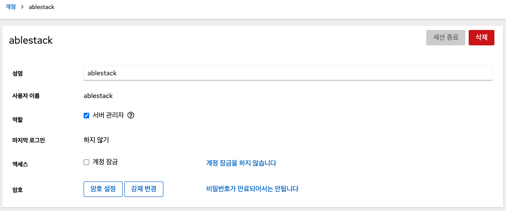
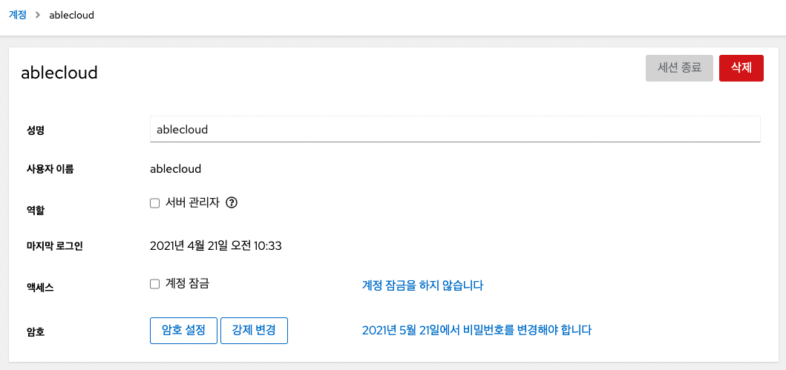

Cube의 웹 콘솔은 시스템 사용자 계정을 추가, 편집 및 제거하기 위한 인터페이스를 제공합니다.

## 시스템 사용자 계정
Cube의 웹 콘솔에서 표시된 사용자 계정으로 시스템에 액세스 할 때 사용자를 인증하고, 시스템에 대한 액세스 권한을 설정하고 시스템에 있는 모든 사용자 계정을 표시합니다.

관리자 권한이 할당된 계정으로 로그인 한 후 계정 메뉴에서 다음 작업을 수행 할 수 있습니다.

- 새 사용자 계정 추가 및 삭제
- 계정 잠금
- 사용자 세션 종료
- 암호 설정 및 강제 변경
- 승인된 공개 SSH 키 추가

!!! info 
    관리 권한이 없는 사용자 계정의 경우 해당 계정에 대한 암호 설정 및 SSH 키 추가 작업만 수행할 수 있습니다.

## 새 계정 추가
시스템에 사용자 계정을 추가하고 계정에 대한 관리 권한을 설정합니다.

관리 권한을 가진 새 계정을 추가하려면 : 

1. 관리자 권한으로 Cube의 웹 콘솔에 로그인합니다.
2. 계정 메뉴를 클릭합니다.
3. **새 계정을 만들기** 버튼을 클릭합니다.
4. 성명과 사용자 이름을 입력합니다.
    - 성명 항목에 입력된 문자는 사용자 이름 항목에 자동으로 입력됩니다. 
5. 암호 항목에 암호를 입력하면 확인 항목에 암호가 올바른지 확인을 위해 다시 입력합니다.
    - 필드 아래에 있는 색상 막대는 입력한 비밀번호의 보안 수준을 보여 주므로 취약한 비밀번호로 사용자를 생성 할 수 없습니다.
6. 생성 버튼을 클릭합니다.
7. 새로 생성된 계정을 클릭합니다.
8. 역할에서 **서버 관리자** 를 선택합니다.

    

## 비밀번호 만료 설정
기본적으로 사용자 계정은 암호가 만료되지 않도록 설정되어 있습니다. 정의된 날짜 후에 만료되도록 시스템 암호를 설정할 수 있습니다. 암호가 만료되면 다음 로그인 시도에서 암호를 변경하라는 메시지가 표시됩니다.

비밀번호 만료 설정하려면 : 

1. 계정 메뉴를 클릭합니다.
2. 암호 만료를 적용할 사용자 계정을 선택합니다.
3. 사용자 계정 설정에서 **비밀번호가 만료되어서는 안됩니다** 버튼을 클릭합니다.
4. 암호 만료 화면에서 **_____일 마다 비밀번호를 변경해야 합니다** 버튼을 선택하고, 암호가 만료되는 일 수를 나타내는 양의 정수를 입력합니다.
5. **변경** 버튼을 클릭합니다.

비밀번호 만료 적용한 경우 Cube의 웹 콘솔에서 계정 메뉴에 사용자를 선택하면 만료 날짜가 포함된 링크가 표시됩니다.

## 사용자 세션 종료
사용자는 시스템에 로그인 할 때 사용자 세션을 생성합니다. 사용자 세션 종료는 시스템에서 사용자를 로그아웃하는 것을 의미합니다. 구성 변경에 민감한 관리 작업 (예 : 시스템 업그레이드)을 수행해야하는 경우 유용 할 수 있습니다.

Cube의 웹 콘솔의 각 사용자 계정에서 현재 사용중인 웹 콘솔 세션을 제외한 계정에 대한 모든 세션을 종료 할 수 있습니다. 이것은 시스템에 대한 액세스를 잃어버리는 것을 방지합니다.

사용자 세션 종료하려면 : 

1. 계정 메뉴를 클릭합니다.
2. 세션을 종료 할 사용자 계정을 클릭합니다.
3. **세션 종료** 버튼을 클릭합니다.
    - 세션 종료 버튼이 비활성화 되어 있으면 사용자가 시스템에 로그인 되어 있지 않습니다.
