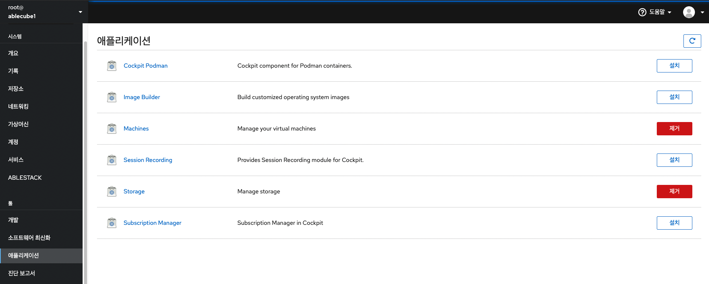

# 애플리케이션

!!! danger
    이 문서는 기술지원 용도의 문서입니다. 기술지원 엔지니어가 아닌 사용자가 조작할 때 시스템에 문제가 발생할 수 있습니다.

Cube의 웹 콘솔에서 현재 사용중인 애플리케이션과 사용할 수 있는 애플리케이션 목록을 확인할 수 있고, 각 애플리케이션을 설치 및 제거 할 수 있습니다.



## 애드온 설치

애드온 애플리케이션을 사용하려면 아래의 명령어를 실행하여 별도로 설치해야합니다.

```
# dnf install <애드온>
```

## 애드온 기능

| 기능 이름                | 패키지 이름                      | 사용                         |
| -----------------------| ------------------------------| ----------------------------|
| Podman                 | cockpit-podman                | podman 컨테이너 관리            |
| Image Builder          | cockpit-composer              | 커스텀 OS 이미지 빌드            |
| Machines               | cockpit-machines              | 가상머신 관리 (기본적으로 설치됨)   |
| Session Recording      | cockpit-session-recording     | 사용자 세션 기록 및 관리          |
| Storage                | cockpit-storaged              | 스토리지 관리 (기본적으로 설치됨)   |
| Subscription Manager   | subscription-manager-cockpit  | 시스템 구독 관리                |

