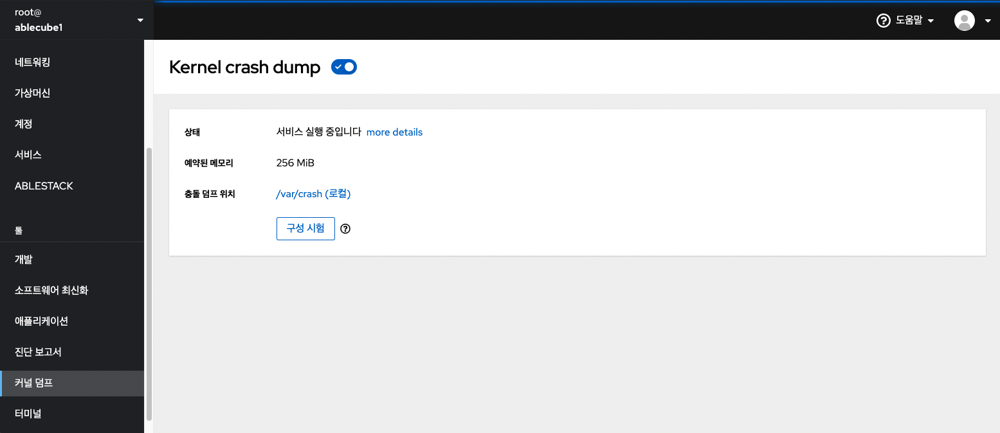
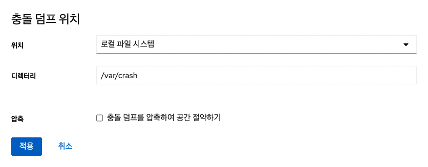

Cube의 웹콘솔에서 kdump 상태 및 구성을 표시하고, kdump 서비스를 활성화 또는 비활성화하며 커널을 크래시하여 kdump를 테스트 할 수 있습니다.

## 커널 덤프 설정 및 테스트

kdump 설정 및 테스트를 실행하려면 : 

1. 커널 덤프 메뉴를 클릭합니다.
2. kdump 서비스를 시작합니다.
3. kdump 명령줄을 통해 메모리 사용량을 구성합니다.
4. 충돌 덤프 위치 항목 옆에 있는 링크를 클릭합니다.
5. 충돌 덤프 위치 화면에서 위치에 옵션을 선택하고 **적용** 버튼을 클릭합니다.

    

    - 로컬 파일 시스템 옵션을 선택한 경우 덤프를 저장할 디렉토리를 입력합니다.
    - SSH를 통한 원격 연결 옵션을 선택한 경우 SSH 프로토콜을 사용하여 원격 시스템으로 덤프를 저장할 원격 시스템 주소, ssh 키 위치 및 대상 디렉토리를 입력합니다.
    - NFS를 통한 원격 연결 옵션을 선택한 경우 NFS 프로토콜을 사용하여 마운트하고 원격 시스템으로 보내는 경로를 입력합니다.

    !!! info 
        vmcore 파일의 크기를 줄이려면 충돌 덤프를 압축하여 공간 절약하기 항목을 체크합니다.

6. **구성 시험** 버튼을 클릭합니다.
7. kdump 설정 테스트 화면에서 **충돌 시스템** 버튼을 클릭하여 커널을 충돌하여 시험합니다.

    !!! warning 
        커널 실행을 방해하고 시스템 충돌 및 데이터 손실을 초래할 수 있으며 시험이 완료된 후 시스템이 자동으로 재시작됩니다.