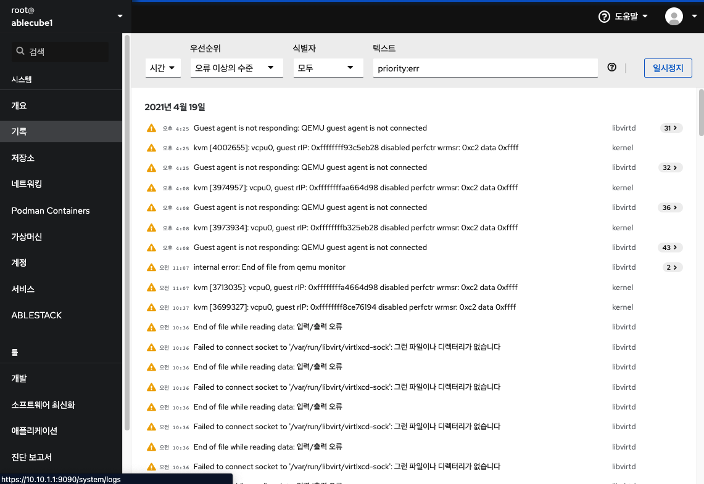
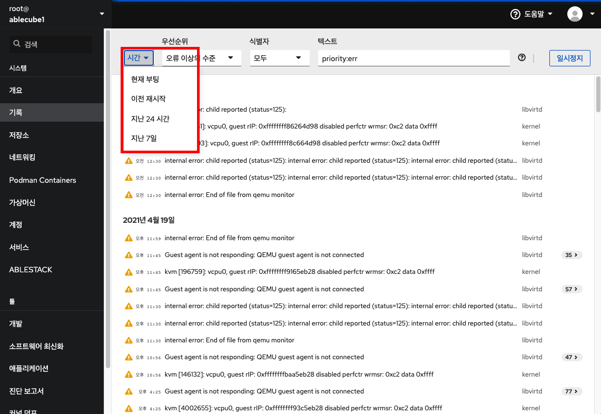
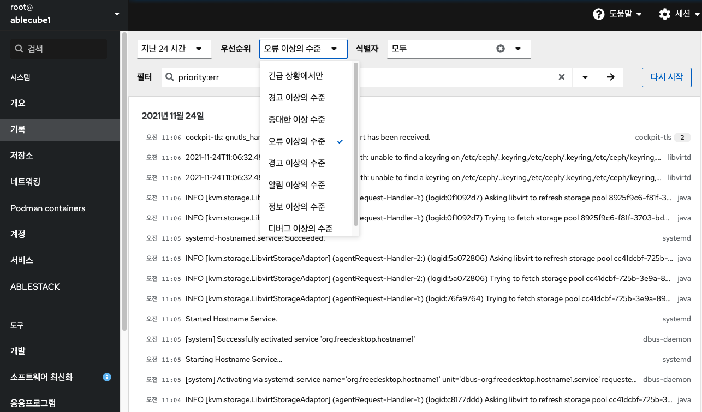
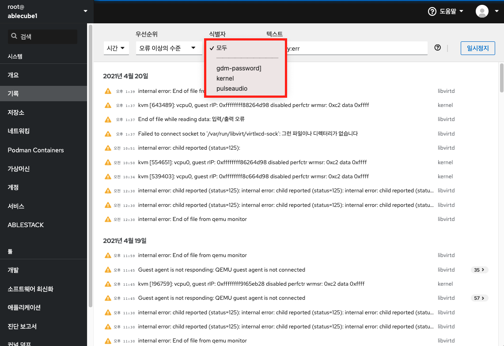
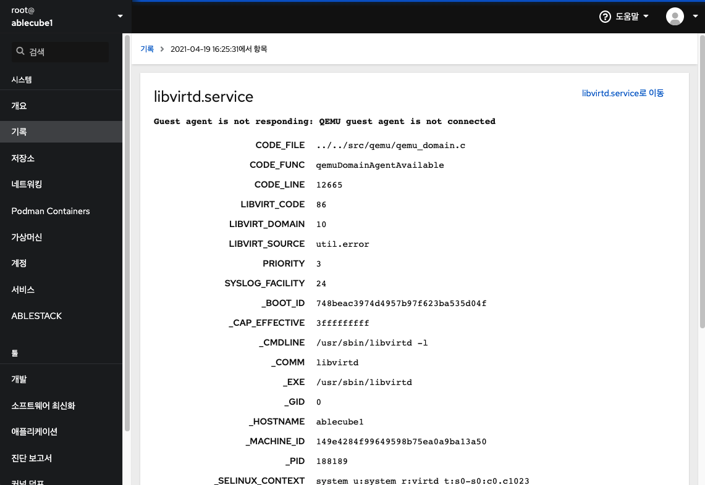
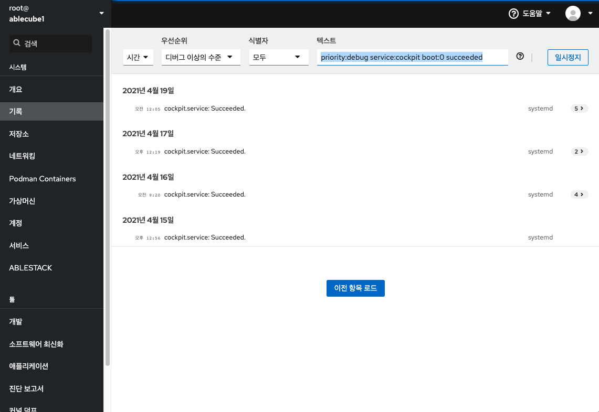

# 기록
Cube 웹 콘솔의 기록메뉴는 시스템에 발생하는 로그정보에 접근하여 검토 및 필터링하여 필요한 정보 확인할 수 있는 방법을 제공합니다.

## 기록 관리
Cube 웹 콘솔 기록 메뉴는 journalctl 유틸리티의 UI입니다. Cube 웹 콘솔 인터페이스에서 시스템 로그에 액세스하는 다양한 방법에 대해 설명합니다.

**로그 필터링**

* 웹 콘솔에서 최신 로그 항목을 기본적으로 표시됩니다. 특정 시간 범위로 필터링하려면 시간 드롭다운 메뉴를 클릭하고 원하는 옵션을 선택합니다.

* '오류 이상의 수준' 목록이 기본적으로 표시됩니다. 다른 '우선 순위'로 필터링하려면 드롭다운 메뉴를 클릭하고 선호하는 우선순위를 선택합니다.

* '모두' 식별자를 기본적으로 표시됩니다. 특정 '식별자'에 대한 로그를 필터링하려면 드롭다운 메뉴를 클릭하고 식별자를 선택합니다.

* 상세 로그 정보를 확인하려면 로그 목록을 클릭하세요.

**로그 필터링을 위한 텍스트 검색**

텍스트 검색을 사용하여 로그를 필터링할 경우 세 개의 드롭 다운 메뉴에 정의 된 미리 정의 된 옵션을 사용하거나 전체 검색을 직접 입력 할 수 있습니다

* 드롭 다운 메뉴 : 검색의 주요 매개 변수를 지정하는 데 사용할 수있는 세 가지 드롭 다운 메뉴가 있습니다.
    * 시간 : 검색의 다양한 시간 범위에 대한 사전 정의 된 검색이 포함되어 있습니다.
    * 우선 순위 : 다양한 우선 순위 수준에 대한 옵션을 제공합니다. journalctl --priority 옵션에 해당합니다. 기본 우선 순위 값은 오류 이상의 수준 입니다. 다른 우선 순위를 지정하지 않을 때마다 설정됩니다.
    * 식별자 : 필터링 할 식별자를 선택할 수 있습니다. journalctl --identifier 옵션에 해당합니다.
* Quantifiers : 검색을 지정하는 데 사용할 수있는 6개의 옵션이 있습니다. 로그 필터링 옵션 표에서 다룹니다.
* 로그 필드 : 특정 로그 필드를 검색하려는 경우 필드 내용과 함께 필드를 지정할 수 있습니다.
* 로그 메시지에서 자유 형식 텍스트 검색 : 로그 메시지에서 원하는 텍스트 문자열을 필터링 할 수 있습니다. 문자열은 정규식 형식 일 수도 있습니다.

!!! example
    * 2021 년 04 월 20 일 이후 발생한 'systemd'로 식별 된 모든 로그 메시지를 필터링하고 'JOB_TYPE'은 'start'또는 'restart'인 경우를 필터링합니다.
        * `identifier:systemd since:2021-04-20 JOB_TYPE=start,restart` 검색필드에 입력
        * 결과 값을 확인합니다.
        

!!! example
    * 'service'가 'cockpit'이면서 'succeeded'가 포함된 경우를 필터링합니다.    
        * `service:cockpit boot:0 succeeded` 검색필드에 입력
        * 결과 값을 확인합니다.    
        

**로그 필터링 옵션**

로그 필터링에 사용할 수 있는 journalctl 옵션이 몇 가지 있습니다. 이 중 일부는 Cube 웹 콘솔 인터페이스의 드롭다운 메뉴의 일부로 이미 포함되어 있습니다.

Option name|Usage
------------|----- 
priority| 메시지 우선 순위별로 출력을 필터링합니다. 단일 숫자 또는 텍스트 로그 수준을 사용합니다. 로그 수준은 일반적인 syslog 로그 수준입니다. 단일 로그 수준이 지정되면이 로그 수준 또는 더 낮은 (따라서 더 중요한) 로그 수준의 모든 메시지가 표시됩니다. (우선 순위 드롭다운 메뉴에 포함되어 있습니다.)
identifier| 지정된 syslog 식별자 SYSLOG_IDENTIFIER에 대한 메시지를 표시합니다. 여러 번 지정할 수 있습니다. (식별자 드롭다운 메뉴에 포함되어 있습니다.)
follow| 가장 최근의 저널 항목만 표시하고 저널에 추가 될 때 새 항목을 계속 인쇄합니다. (드롭다운에 포함되지 않습니다.)
service| 지정된 systemd 장치에 대한 메시지를 표시합니다. 여러번 지정할 수 있습니다. (드롭다운에 포함되지 않습니다. journalctl --unit매개 변수에 해당합니다.)
boot| 특정 부팅의 메시지를 표시합니다. 양의 정수는 저널의 시작부터 부팅를 조회하고 0보다 같거나 작은 정수는 저널의 끝에서 시작하는 부팅를 조회합니다. 따라서 1은 시간순으로 저널에서 찾은 첫 번째 부팅을 의미하고, 2는 두 번째 등의 순서로 검색됩니다. -0은 마지막 부팅이고, -1은 마지막 부팅 이전 부팅입니다. (시간 드롭 다운 메뉴 에서 현재 부팅 또는 이전 부팅 으로 만 적용됩니다. 다른 옵션은 수동으로 작성해야합니다.)
since| 날짜 포맷은 '2021-04-20 18:17:16'형식이어야합니다. 시간 부분을 생략하면 "00:00:00"으로 간주됩니다. 초 구성 요소 만 생략하면 ": 00"으로 간주됩니다. 날짜 구성 요소를 생략하면 현재 날짜로 간주됩니다. 대안으로, "yesterday", "today", "tomorrow"문자열이 이해되며, 이는 각각 현재 날짜 전날, 현재 날짜 또는 오늘 다음날의 00:00:00을 나타냅니다. "now"은 현재 시간을 나타냅니다. 마지막으로, 각각 현재 시간 이전 또는 이후의 시간을 나타내는 "-"또는 "+"접두사가 붙은상대 시간을 지정할 수 있습니다.  (드롭다운에 포함되지 않습니다.)