## 네트워크 본드 구성
Cube의 웹 콘솔에서 네트워크 본딩을 구성하는 기능을 제공합니다.

### 네트워크 본딩

네트워크 본딩은 네트워크 인터페이스를 결합하거나 집계하여 더 높은 처리량 또는 중복성을 가진 논리적 인터페이스를 제공하는 방법입니다.

활성 백업, 적응형 전송 로드 밸런싱 및 적응형 로드 밸런싱 모드는 네트워크 스위치의 특정 구성이 필요하지 않습니다. 그러나 다른 본딩 모드에서는 링크를 집계하도록 스위치를 구성해야 합니다. 예를 들어 Cisco 스위치에는 모드 0, 2, 3을 위한 EtherChannel이 필요하지만 모드 4의 경우 LACP(Link Aggregation Control Protocol) 와 EtherChannel이 필요합니다.

!!! info 
    장애 조치 메커니즘과 같은 특정 네트워크 본딩 기능은 네트워크 스위치없이 직접 케이블 연결을 지원하지 않습니다.

### 본드 모드

본드 모드 옵션은 특정 로드 밸런싱 및 내결함성을 특징을 가지며, 결합된 인터페이스의 동작은 모드에 따라 다릅니다. 본딩 모드는 내결함성, 로드 밸런싱 또는 둘 다 제공합니다.

- 로드 밸런싱 모드
    - 라운드 로빈 : 사용 가능한 첫번째 인터페이스에서 마지막 인터페이스로 패킷을 순차적으로 전송합니다.

- 내결함성 모드
    - 활성 백업 : 기본 인터페이스가 실패한 경우에만 백업 인터페이스 중 하나가 이를 대체합니다. 활성 인터페이스에서 사용하는 MAC 주소만 표시됩니다.
    - 브로드 캐스트 : 모든 전송이 모든 인터페이스에서 전송됩니다.

    !!! info 
        브로드 캐스트는 연결된 모든 인터페이스에서 네트워크 트래픽을 크게 증가시킵니다.

- 내결함성 및 로드 밸런싱 모드
    - XOR : 대상 MAC 주소가 모듈로 해시를 사용하여 인터페이스간에 균등하게 분산됩니다. 그런 다음 각 인터페이스는 동일한 MAC 주소 그룹을 제공합니다.
    - 802.3ad : IEEE 802.3ad 동적 링크 집계 정책을 설정합니다. 동일한 속도 및 이중 설정을 공유하는 집계 그룹을 만듭니다. 활성 애그리 게이터의 모든 인터페이스에서 송수신합니다.

    !!! info 
        이 모드에는 802.3ad와 호환되는 스위치가 필요합니다.

    - 적응형 전송 로드 밸런싱 : 각 인터페이스의 현재 부하에 따라 나가는 트래픽이 분산됩니다. 수신 트래픽은 현재 인터페이스에서 수신됩니다. 수신 인터페이스가 실패하면 다른 인터페이스가 실패한 인터페이스의 MAC 주소를 인수합니다.
    - 적응형 로드 밸런싱 : IPv4 트래픽에 대한 전송 및 수신 로드 밸런싱을 포함합니다.

    수신로드 밸런싱은 ARP(Address Resolution Protocol) 협상을 통해 이루어지므로 본드 구성에서 Link Monitoring 을 ARP 로 설정해야 합니다.

### 본드 추가

Cube의 웹 콘솔에서 둘 이상의 네트워크 인터페이스에서 활성 백업 본드를 구성합니다.

!!! info "전제 조건"
        - 서버에 두 개 이상의 네트워크 카드가 있습니다.
        - 네트워크 카드는 스위치에 연결됩니다.  

본드를 추가하려면 : 

1. 네트워킹 메뉴를 클릭합니다.
2. **본드 추가** 버튼을 클릭합니다.
3. 이름 항목에 새 본드의 이름을 입력합니다.
4. 인터페이스 항목에 본드를 구성할 인터페이스를 선택합니다.
5. [선택 사항] MAC 선택 목록에서 이 인터페이스에 사용할 MAC 주소를 선택합니다. 만약, MAC 항목를 비워두면 본드가 목록에 나열된 주소 중 하나를 가져옵니다.
6. 모드 선택 목록에서 모드를 선택합니다.
7. 활성 백업을 선택하면, 주 인터페이스를 선택합니다. 

    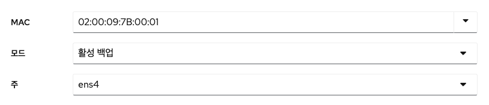

8. 링크 모니터링 선택 목록에는 MII의 옵션을 선택합니다. 적응형 로드 밸런싱 모드에서만 이 옵션을 ARP 로 전환해야 합니다.
9. 밀리 초 단위의 값을 포함하는 모니터링 주기, 링크 업 딜레이 및 링크 다운 딜레이 항목은 그대로 둡니다. 해당 항목은 문제 해결 목적으로만 변경해야 합니다.
10. **적용** 버튼을 클릭합니다.

    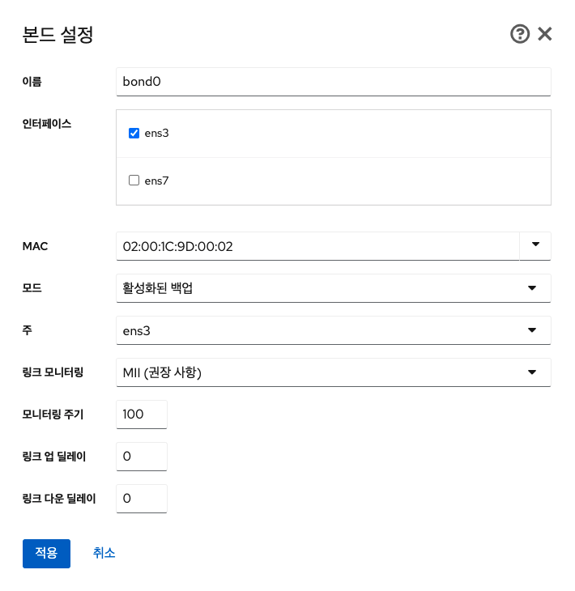

본드가 올바르게 작동하는지 확인하려면 네트워킹 메뉴로 이동하여 인터페이스 테이블의 전송 및 수신 항목에 네트워크 활동이 표시되는지 확인합니다.

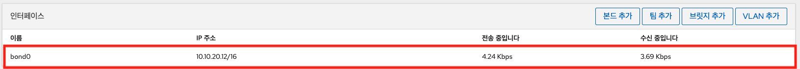

### 인터페이스 추가

네트워크 본드는 여러 인터페이스를 포함 할 수 있으며 언제든지 추가하거나 제거 할 수 있습니다. Cube의 웹 콘솔에서 기존 본드에 네트워크 인터페이스를 추가합니다.

본드에 인터페이스를 추가하려면 : 

1. 네트워킹 메뉴를 클릭합니다.
2. 인터페이스 테이블에서 구성할 본드를 선택합니다.
3. 본드 설정 화면에서 인터페이스 항목의 '**+**' 아이콘을 클릭합니다.
4. 선택 목록에서 추가할 인터페이스를 클릭합니다.

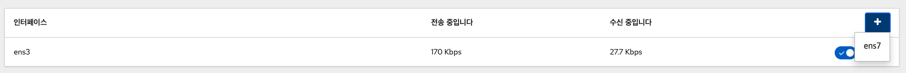

### 인터페이스 제거 또는 비활성화

네트워크 본드는 여러 인터페이스를 포함 할 수 있습니다. 장치를 변경해야하는 경우 본드에서 특정 인터페이스를 제거하거나 비활성화 할 수 있습니다. 

본드에 인터페이스를 제거하거나 비활성화 하려면 : 

1. 네트워킹 메뉴를 클릭합니다.
2. 인터페이스 테이블에서 구성할 본드를 선택합니다.
3. 본드 설정 화면에서 인터페이스를 선택하고 제거하거나 비활성화합니다.
    - 인터페이스 항목의 '**-**' 아이콘을 클릭합니다.
    - **ON/OFF** 스위치를 비활성화된 위치로 전환합니다.

    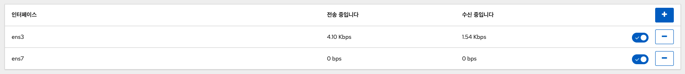

### 본드 제거 또는 비활성화

Cube의 웹 콘솔을 사용하여 네트워크 본드를 제거하거나 비활성화합니다. 본드를 비활성화하면 인터페이스는 본드에 남아있지만 본드는 네트워크 트래픽에 사용되지 않습니다.

본드를 제거하거나 비활성화 하려면 : 

1. 네트워킹 메뉴를 클릭합니다.
2. 제거할 본드를 클릭하십시오.
3. 본드 설정 화면에서 **ON/OFF** 스위치로 본드를 비활성화 하거나 **삭제** 버튼을 클릭하여 본드를 영구적으로 제거 할 수 있습니다.

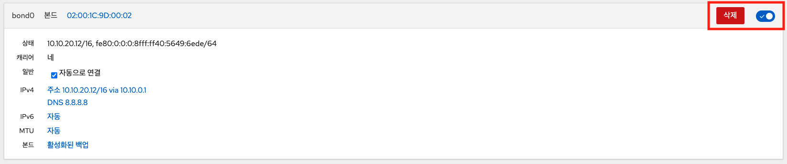


## 네트워크 팀 구성
네트워크 본딩이 작동하는 방식, 네트워크 팀과 네트워크 본드의 차이점 등에 대한 내용을 제공하며, 다음에 대한 지침을 찾을 수 있습니다.

- 새로운 네트워크 팀 추가
- 기존 네트워크 팀에 새 인터페이스 추가
- 기존 네트워크 팀에서 인터페이스 제거
- 네트워크 팀 제거

### 네트워크 팀 구성

네트워크 팀 구성은 네트워크 인터페이스를 결합하거나 집계하여 더 높은 처리량 또는 중복성을 가진 논리적 인터페이스를 제공하고, 커널 드라이버를 사용하여 패킷 흐름의 빠른 처리와 다른 작업을 위한 사용자 공간 라이브러리 및 서비스를 구현합니다. 이러한 방식으로 네트워크 팀 구성은 로드 밸런싱 및 중복 요구 사항을 위해 쉽게 확장이 가능한 솔루션입니다.

!!! info
    장애 복구 메커니즘과 같은 특정 네트워크 팀 구성 기능은 네트워크 스위치없이 직접 케이블 연결을 지원하지 않습니다. 

### 네트워크 팀 및 네트워크 본드 기능 비교

| 기능                              | 네트워크 본드               | 네트워크 팀       |
| ---------------------------------| ------------------------ | -------------- |
| 브로드 캐스트 Tx 정책                | :material-check:         |:material-check:|
| 라운드 로빈 Tx 정책                  | :material-check:         |:material-check:|
| 활성 백업 Tx 정책                   | :material-check:         |:material-check:|
| LACP (802.3ad) 지원               | :material-check: (활성만)  |:material-check:|
| 사용자 해시 기능을 설정 가능            | :material-close:         |:material-check:|
| Tx로드 밸런싱 지원 (TLB)             | :material-check:         |:material-check:|
| LACP 해시 포트 선택                 | :material-check:         |:material-check:|
| LACP 지원을위한 로드 밸런싱            | :material-close:         |:material-check:|
| Ethtool 링크 모니터링               | :material-check:         |:material-check:|
| ARP 링크 모니터링                   | :material-check:         |:material-check:|
| NS/NA (IPv6) 링크 모니터링          | :material-close:         |:material-check:|
| 포트 업 / 다운 지연                  | :material-check:         |:material-check:|
| 포트 우선 순위 및 고정 ("기본"옵션 향상) | :material-close:         |:material-check:|
| 별도의 포트 별 링크 모니터링 설정       | :material-close:          |:material-check:|
| 다중 링크 모니터링 설정               | 제한됨                     |:material-check:|
| 잠금없는 Tx/Rx 경로                 | :material-close:(rwlock) |:material-check:(RCU)|
| VLAN 지원                        | :material-check:          |:material-check:|
| 사용자 공간 런타임 제어               | 제한됨                     |:material-check:|
| 사용자 공간의 논리                   | :material-close:         |:material-check:|
| 확장성                            | 어려움                     |쉬움|
| 모듈식 디자인                       | :material-close:         |:material-check:|
| 성능 오버 헤드                      | 낮음                      |매우 낮음|
| D-Bus 인터페이스                   | :material-close:          |:material-check:|
| 다중 장치 스태킹                    | :material-check:          |:material-check:|
| LLDP를 사용한 제로 구성              | :material-close:         |(계획중)|
| NetworkManager 지원              | :material-check:          |:material-check:|

### 팀 추가

Cube의 웹 콘솔을 사용하여 둘 이상의 네트워크 인터페이스에서 새 활성 백업 네트워크 팀을 구성합니다.

!!! info "전제 조건"
        - 서버에 설치된 두 개 이상의 네트워크 카드가 있습니다.
        - 네트워크 카드는 스위치에 연결됩니다.

팀을 추가하려면 : 

1. 네트워킹 메뉴를 클릭합니다.
2. **팀 추가** 버튼을 클릭합니다.
3. 팀 설정 화면에서 팀 장치의 이름을 추가합니다.
4. 포트 항목에서 팀에 추가 할 모든 네트워크 인터페이스를 선택합니다.
5. 실행자 항목에서 실행자를 선택합니다.
6. 링크 보기 목록에서 링크 보기를 선택합니다.
    - Ethtool 을 선택하는 경우 추가로 링크 업 딜레이 및 링크 다운 딜레이를 설정합니다.
    - ARP Ping 또는 NSNA Ping 을 선택하는 경우 추가로 ping 간격 및 ping 대상을 설정합니다.
7. **적용** 버튼을 클릭합니다.

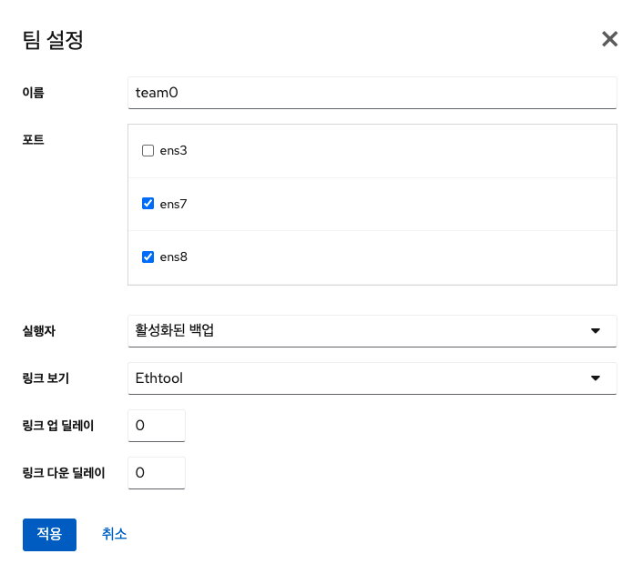

네트워킹 메뉴로 이동하여 인터페이스 테이블의 전송 및 수신 항목에 네트워크 활동이 표시되는지 확인합니다.


### 인터페이스 추가

네트워크 팀은 여러 인터페이스를 포함 할 수 있으며 언제든지 추가하거나 제거 할 수 있습니다. Cube의 웹 콘솔을 사용하여 기존 팀에 새 네트워크 인터페이스를 추가합니다.

팀에 인터페이스를 추가하려면 :

1. 네트워킹 메뉴를 클릭합니다.
2. 인터페이스를 추가할 팀을 클릭합니다.
3. 팀 설정 화면에서 '**+**' 아이콘을 클릭합니다.
4. 목록에서 팀에 추가 할 인터페이스를 선택합니다.

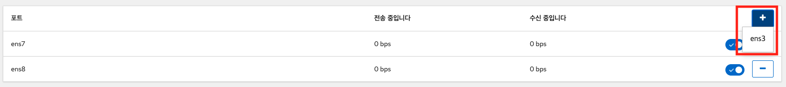

### 인터페이스 제거 또는 비활성화

네트워크 팀은 여러 인터페이스를 포함 할 수 있습니다. 장치를 변경해야하는 경우 네트워크 팀에서 특정 인터페이스를 제거하거나 비활성화하면 나머지 활성 인터페이스와 함께 작동합니다.

팀에 인터페이스를 제거하거나 비활성화 하려면 : 

1. 네트워킹 메뉴를 클릭합니다.
2. 구성하려는 팀을 클릭합니다.
3. 팀 설정 화면에서 인터페이스를 선택하고 제거하거나 비활성화합니다.
    - **ON/OFF** 스위치를 비활성화된 위치로 전환하여 인터페이스를 비활성화합니다.
    - '**-**' 아이콘을 클릭하여 인터페이스를 제거합니다.

    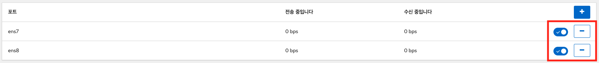

### 팀 제거 또는 비활성화

Cube의 웹 콘솔을 사용하여 네트워크 팀을 제거하거나 비활성화합니다. 팀만 비활성화하면 팀의 인터페이스는 그대로 유지되지만 팀은 네트워크 트래픽에 사용되지 않습니다.

팀을 제거하거나 비활성화 하려면 : 

1. 네트워킹 메뉴를 클릭합니다.
2. 제거하거나 비활성화하려는 팀을 클릭합니다.
3. 선택한 팀을 제거하거나 비활성화합니다.
    - **삭제** 버튼을 클릭하여 팀을 제거 할 수 있습니다. 
    - 팀을 비활성화 할 수 있습니다. **ON/OFF** 스위치를 비활성화된 위치로 전환하십시오.

    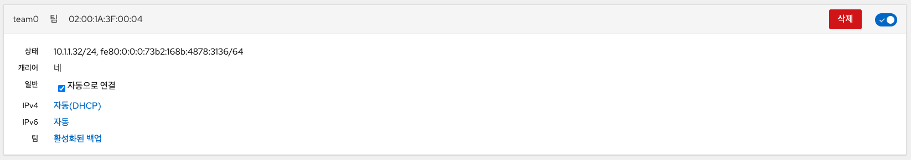

## 네트워크 브릿지 구성
네트워크 브릿지는 동일한 범위의 IP 주소를 사용하여 여러 인터페이스를 하나의 서브넷에 연결하는데 사용됩니다.

### 브릿지 추가

Cube의 웹 콘솔을 사용하여 여러 네트워크 인터페이스에 브릿지를 추가합니다.

브릿지를 추가하려면 : 

1. 네트워킹 메뉴를 클릭합니다.
2. **브릿지 추가** 버튼을 클릭하십시오.

    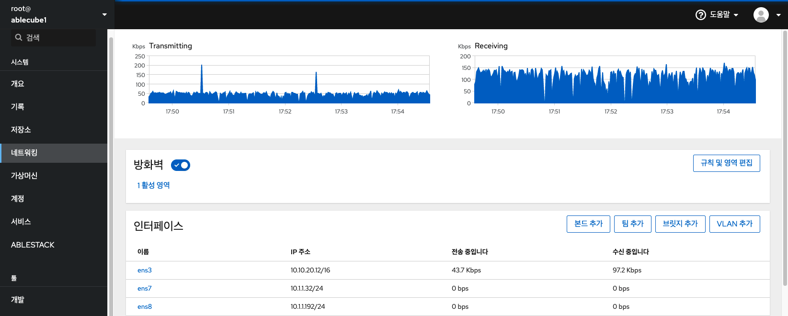

3. 브릿지 설정 화면에서 새 브릿지의 이름을 입력합니다.
4. 포트 항목에서 한 개의 서브넷에 넣어 원하는 인터페이스를 선택합니다.
5. 선택적으로 STP(Spanning Tree 프로토콜) 를 선택하여 브릿지 루프 및 브로드 캐스트 방사를 방지 할 수 있습니다.
    - 강한 선호도가 없는 경우 사전 정의 된 값을 그대로 두십시오.
6. **적용** 버튼을 클릭합니다.

    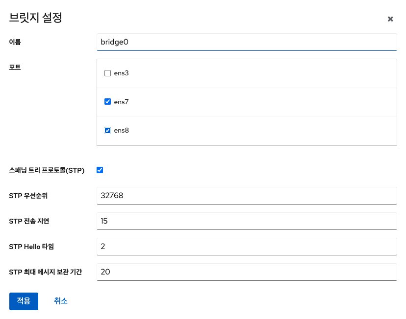

브릿지가 성공적으로 생성되면 웹 콘솔의 네트워킹 메뉴에 새 브릿지가 표시됩니다. 새 브릿지 행의 송신 및 수신 열에서 값을 확인하십시오.

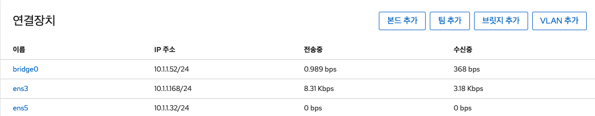

브릿지를 통해 0 바이트가 송수신된다면 연결이 제대로 작동하지 않는 것이므로 네트워크 설정을 조정해야합니다.

### 브릿지 편집

Cube의 웹 콘솔을 사용하여 브릿지를 편집합니다.

브릿지를 편집하려면 : 

1. 네트워킹 메뉴를 클릭합니다.
2. 편집하려는 인터페이스를 선택하고, 브릿지 항목의 **편집** 버튼을 클릭합니다.
3. 설정을 변경 한 후 **적용** 버튼을 클릭합니다.

    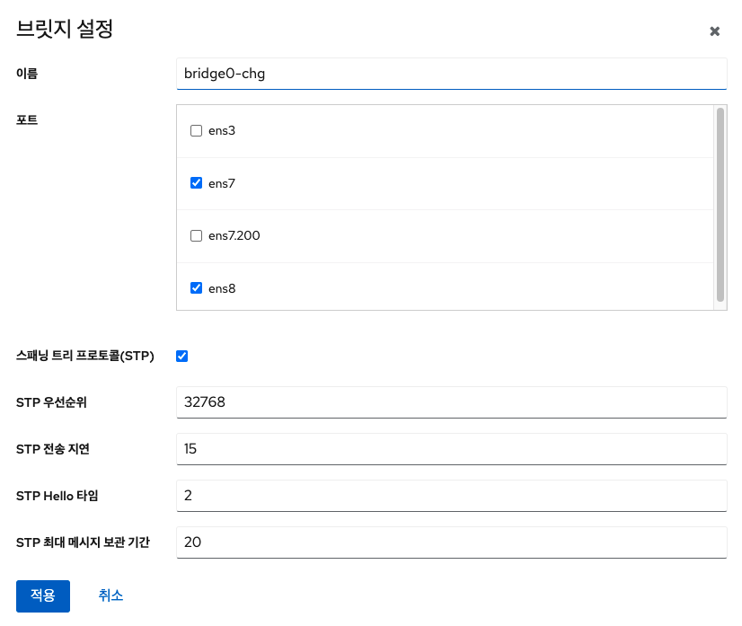

!!! warning

    브릿지 이름을 변경한 경우에는 별도의 작업이 필요합니다.

    1. 호스트에 접속하여 /etc/sysconfig/network-scripts/ 경로의 네트워크 인터페이스 설정 파일명을 변경해야합니다.
        예를 들어, 기존 브릿지(ifcfg-bridge0)를 변경한 브릿지(ifcfg-bridge0-chg)로 파일명을 변경합니다. 
    2. 아래의 명령어를 실행하여 네트워크 연결을 활성화합니다.
    ```
    # nmcli con up <변경한 브릿지 이름>
    ```
    3. 만약, 브릿지의 인터페이스 멤버가 존재하지 않는 경우 네트워크 인터페이스를 다시 추가해야 합니다. 

브릿지를 통해 0 바이트가 송수신된다면 연결이 제대로 작동하지 않는 것이므로 네트워크 설정을 조정해야합니다.

### 고정 IP 주소 구성

시스템의 IP 주소는 DHCP 서버가 풀에서 자동으로 할당하거나 IP 주소를 수동으로 구성 할 수 있습니다. IP 주소는 DHCP 서버 설정의 영향을 받지 않습니다.

브릿지에 고정 IP 주소를 구성하려면 : 

1. 네트워킹 메뉴를 클릭합니다.
2. 고정 IP 주소를 설정할 인터페이스를 클릭합니다.

    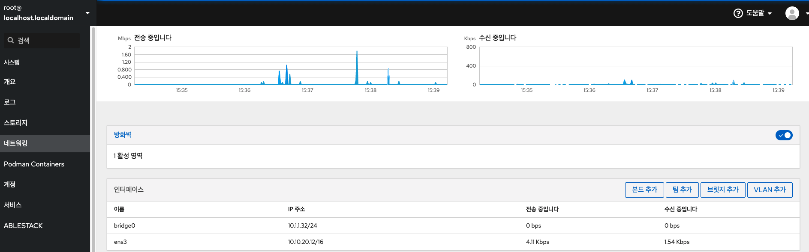

3. 인터페이스 세부 정보 화면에서 IPv4 항목의 **편집** 버튼을 클릭합니다.

    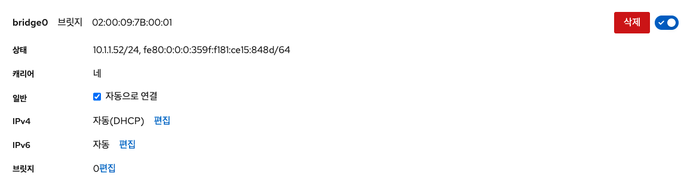

4. IPv4 설정 화면에서 주소 목록에서 수동을 선택합니다. 

    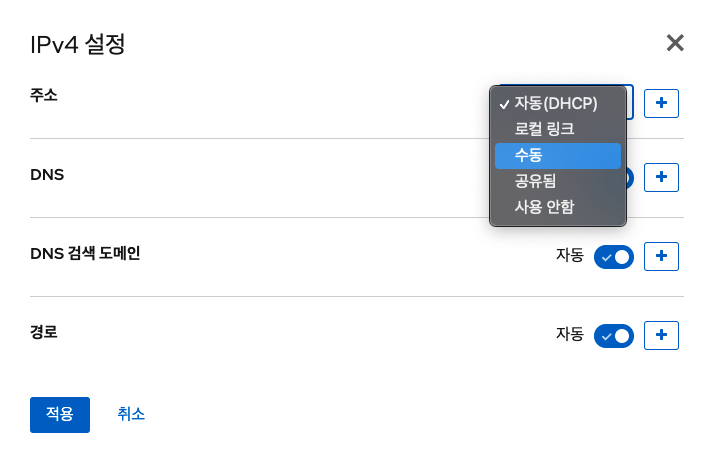

5. **적용** 버튼을 클릭합니다.
6. 주소 항목에서 원하는 IP 주소, 넷 마스크 및 게이트웨이를 입력합니다.

    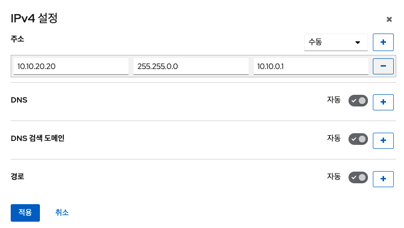

7. **적용** 버튼을 클릭합니다.

이 시점에서 IP 주소가 구성되었으며 인터페이스는 새 고정 IP 주소를 사용합니다.

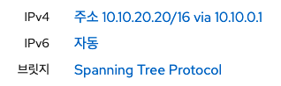

### 인터페이스 제거

네트워크 브릿지에는 여러 인터페이스가 포함될 수 있습니다. 브릿지에서 제거 할 수 있습니다. 제거된 각 인터페이스는 자동으로 독립형 인터페이스로 변경됩니다.

브릿지에 인터페이스를 제거하려면 : 

1. 네트워킹 메뉴를 클릭합니다.
2. 구성하려는 브릿지를 클릭합니다.

    

3. 브릿지 설정 화면에서 인터페이스를 선택하고 '**-**' 아이콘을 클릭 합니다.

    

### 브릿지 삭제

Cube의 웹 콘솔에서 소프트웨어 네트워크 브릿지를 삭제할 수 있습니다. 브릿지에 포함된 모든 네트워크 인터페이스는 독립형 인터페이스로 자동 변경됩니다.

브릿지를 삭제하려면 : 

1. 네트워킹 메뉴를 클릭합니다.
2. 구성하려는 브릿지를 클릭합니다.

    

3. 브릿지 설정 화면에서 **삭제** 버튼을 클릭 합니다.

    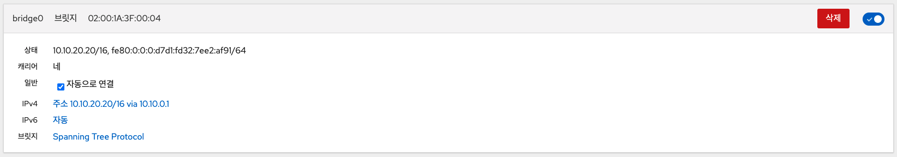

이 단계에서 네트워킹으로 돌아가 모든 네트워크 인터페이스가 인터페이스 탭에 표시되는지 확인합니다. 
브릿지의 일부였던 인터페이스는 이제 비활성화 될 수 있습니다. 따라서 이를 활성화하고 네트워크 매개변수를 수동으로 설정해야 할 수 있습니다.

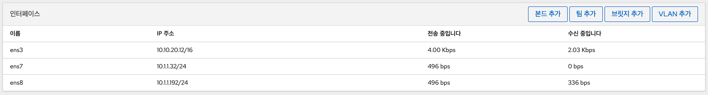


## VLAN 구성
VLAN(가상 LAN)은 단일 물리적 이더넷 인터페이스에서 생성된 가상 네트워크입니다. 각 VLAN은 고유 한 양의 정수를 나타내는 ID로 정의되며 독립형 인터페이스로 작동합니다.

### VLAN 추가

Cube의 웹 콘솔을 VLAN을 만드는 기능을 제공합니다.

VLAN을 추가하려면 :

1. 네트워킹 메뉴를 클릭합니다.
2. **VLAN 추가** 버튼을 클릭합니다.

    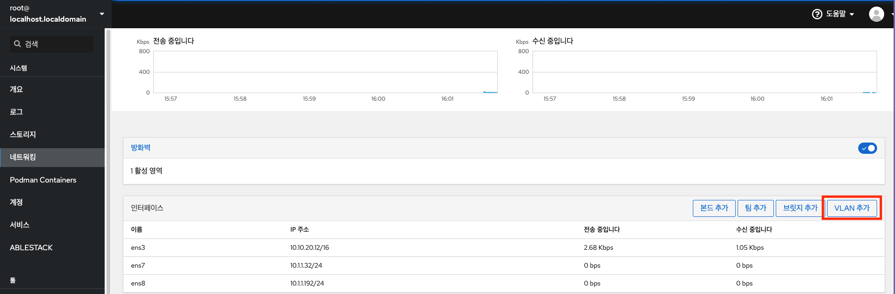

3. VLAN 설정 화면에서, VLAN을 추가하려는 물리적 인터페이스를 선택합니다.
4. VLAN ID를 입력하거나 미리 정의된 번호를 사용하십시오.
5. 이름 항목에서 미리 정의된 이름이 부모 인터페이스와 VLAN ID로 구성되어 볼 수 있습니다. 필요하지 않은 경우 이름을 그대로 둡니다.

    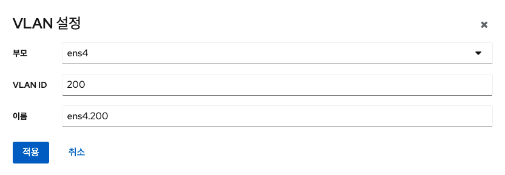

6. **적용** 버튼을 클릭 합니다.

새 VLAN이 생성되었으며 VLAN을 클릭하고 네트워크 설정을 구성해야 합니다.

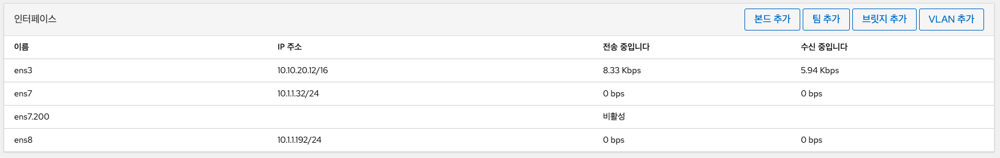


## 수신 포트 설정
Cube의 웹 콘솔에새 포트를 허용하거나 기존 포트를 변경합니다.

### SELinux 가 활성화된 시스템에서 새 포트 허용

새 포트 허용하려면 : 

1. SELinux의 다른 부분에서 정의하지 않은 포트의 경우 다음을 실행합니다.

    ```
    # sudo semanage port -a -t websm_port_t -p tcp PORT_NUMBER
    ```

2. SELinux의 다른 부분에서 이미 정의 된 포트의 경우 다음을 실행합니다.

    ```
    # sudo semanage port -m -t websm_port_t -p tcp PORT_NUMBER
    ```
    
변경 사항은 즉시 적용됩니다.

### firewalld 가 있는 시스템에 새 포트 허용

새 포트를 허용하려면 : 

1. 새 포트 번호를 추가하려면 다음 명령을 실행하십시오.

    ```
    # sudo firewall-cmd --permanent --service cockpit --add-port = PORT_NUMBER / tcp
    ```

2. Cube의 웹 콘솔 서비스에서 이전 포트 번호를 제거하려면 다음을 실행하십시오.

    ```
    # sudo firewall-cmd --permanent --service cockpit --remove-port = OLD_PORT_NUMBER / tcp
    ```
    
!!! info 
    firewall-cmd --service cockpit --add-port=PORT_NUMBER/tcp 로 '--permanent' 옵션 없이 실행하는 경우 다음에 firewalld 시스템을 다시 로드하거나 재부팅 하면 변경 사항이 취소됩니다.

### Cube의 웹 콘솔 포트 변경

Cube의 웹 콘솔 포트 9090의 기본 전송 제어 프로토콜(TCP)을 다른 프로토콜로 변경합니다.

!!! warning
    Cube의 웹 콘솔 포트는 고정되어 있으며 변경이 필요한 경우 엔지니어가 작업을 진행해야합니다. 관리자에게 문의하십시오. 
    
Cube의 웹 콘솔 포트를 변경하려면 : 

1. 다음 방법 중 하나로 수신 포트를 변경하십시오.
    - systemctl edit cockpit.socket 명령 사용
        - 다음 명령어를 실행하십시오.
        ```
        # sudo systemctl edit cockpit.socket
        ```
        - /etc/systemd/system/cockpit.socket.d/override.conf 파일이 열리면 다음 형식으로 내용을 수정하거나 새 내용를 추가하십시오.
        ```
        [Socket] 
        ListenStream = 
        ListenStream = PORT_NUMBER
        ```
    - 위에서 언급한 내용을 /etc/systemd/system/cockpit.socket.d/listen.conf 파일에 추가하십시오.   
        - cockpit.socket.d.디렉토리와 listen.conf 파일이 없는 경우 새로 생성합니다.

2. 변경 사항을 적용하려면 다음 명령을 실행하십시오.

    ```
    # sudo systemctl daemon-reload
    # sudo systemctl restart cockpit.socket
    ```

이전 단계에서 systemctl edit cockpit.socket 을 실행한 경우에는 systemctl daemon-reload 를 실행하지 않아도 됩니다.

## 방화벽 관리
방화벽은 외부에서 들어오는 원치 않는 트래픽으로부터 시스템을 보호하는 방법입니다. 이를 통해 사용자는 방화벽 규칙 집합을 정의하여 호스트 컴퓨터에서 들어오는 네트워크 트래픽을 제어 할 수 있습니다. 이러한 규칙은 들어오는 트래픽을 정렬하고 차단하거나 허용하는 데 사용됩니다.

### 방화벽 실행

Cube의 웹 콘솔에서 방화벽을 실행합니다.

방화벽을 실행하려면 : 

1. 네트워킹 메뉴를 클릭합니다.
2. 방화벽 항목 **ON** 클릭하여 방화벽을 실행합니다.

    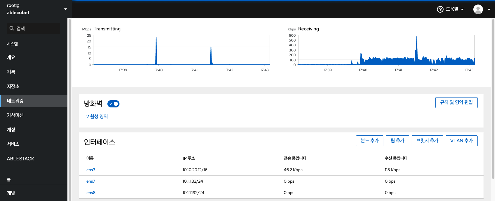

    - 방화벽 상자가 보이지 않으면 관리자 권한으로 Cube의 웹 콘솔에 로그인 하십시오.

### 방화벽 중지

Cube의 웹 콘솔에서 방화벽을 중지합니다.

방화벽을 중지하려면 : 

1. 네트워킹 메뉴를 클릭합니다 .
2. 방화벽 항목 **OFF** 클릭하여 방화벽을 중지할 수 있습니다.

    

     - 방화벽 상자가 보이지 않으면 관리 권한으로 Cube의 웹 콘솔에 로그인 하십시오.

### 방화벽 

firewalld D-Bus 인터페이스가 있는 동적 사용자 정의 가능한 호스트 기반 방화벽을 제공하는 방화벽 서비스 데몬입니다. 동적이기 때문에 규칙이 변경 될 때마다 방화벽 데몬을 다시 시작할 필요없이 규칙을 생성, 변경 및 삭제할 수 있습니다.

firewalld 트래픽 관리를 단순화하는 영역 및 서비스 개념을 사용합니다. 영역은 미리 정의 된 규칙 집합입니다. 네트워크 인터페이스 및 소스를 영역에 할당 할 수 있습니다. 허용되는 트래픽은 컴퓨터가 연결된 네트워크와이 네트워크에 할당된 보안 수준에 따라 다릅니다. 방화벽 서비스는 특정 서비스에 대한 수신 트래픽을 허용하는데 필요한 모든 설정을 포함하는 미리 정의 된 규칙이며 영역 내에서 적용됩니다.

서비스는 네트워크 통신을 위해 하나 이상의 포트 또는 주소를 사용합니다. 방화벽은 포트를 기반으로 통신을 필터링합니다. 서비스에 대한 네트워크 트래픽을 허용하려면 해당 포트가 열려 있어야합니다. firewalld 명시적으로 개방으로 설정되지 않은 포트의 모든 트래픽을 차단합니다. trusted 와 같은 일부 영역은 기본적으로 모든 트래픽을 허용합니다.

### 영역

⁠firewalld 을 사용하여 사용자가 해당 네트워크 내의 인터페이스 및 트래픽에 대해 결정한 신뢰 수준에 따라 네트워크를 다른 영역으로 분리 할 수 있습니다. 연결은 하나의 영역에만 속할 수 있지만 여러 네트워크 연결에 영역을 사용할 수 있습니다.

NetworkManager 는 firewalld 인터페이스 영역을 제공합니다. 다음을 사용하여 인터페이스에 영역을 할당 할 수 있습니다.

- NetworkManager
- firewall-config 수단
- firewall-cmd 명령 줄 도구
- RHEL Cockpit

NetworkManager 제외한 나머지 3가지는 NetworkManager 구성 파일만 편집 할 수 있습니다. 웹 콘솔 firewall-cmd 또는 firewall-config를 사용하여 인터페이스의 영역을 변경하면 NetworkManager로 요청이 전달되고 firewalld로 처리되지 않습니다. 

사전 정의된 영역은 /usr/lib/firewalld/zones/ 디렉토리에 저장되며 사용 가능한 모든 네트워크 인터페이스에 즉시 적용 할 수 있습니다. 이러한 파일은 수정 된 후에 만 /etc/firewalld/zones/ 디렉토리에 복사됩니다. 사전 정의된 영역의 기본 설정은 다음과 같습니다.

- **block** : 들어오는 모든 네트워크 연결은 IPv4 에 대한 icmp-host-prohibited 메시지 및 IPv6 에 대한 icmp6-adm-prohibited 메시지와 함께 거부됩니다. 시스템 내에서 시작된 네트워크 연결만 가능합니다.
- **dmz** : 내부 네트워크에 대한 제한된 액세스로 공개적으로 액세스 할 수있는 dmz에 있는 컴퓨터의 경우. 선택한 수신 연결만 허용됩니다.
- **drop** : 들어오는 네트워크 패킷은 알림 없이 삭제됩니다. 나가는 네트워크 연결만 가능합니다.
- **external** : Masquerading이 활성화 된 외부 네트워크, 특히 라우터에서 사용합니다. 컴퓨터에 해를 끼치지 않기 위해 네트워크의 다른 컴퓨터를 신뢰하지 않습니다. 선택한 수신 연결만 허용됩니다.
- **home** : 네트워크의 다른 컴퓨터를 대부분 신뢰할 때 home 에서 사용합니다. 선택한 수신 연결만 허용됩니다.
- **internal** : 네트워크의 다른 컴퓨터를 대부분 신뢰할 때 내부 네트워크에서 사용합니다. 선택한 수신 연결만 허용됩니다.
- **public** : 네트워크상의 다른 컴퓨터를 신뢰하지 않는 공공 장소에서 사용합니다. 선택한 수신 연결만 허용됩니다.
- **trusted** : 모든 네트워크 연결이 허용됩니다.
- **work** : 주로 네트워크의 다른 컴퓨터를 신뢰하는 직장에서 사용합니다. 선택한 수신 연결만 허용됩니다.

이러한 영역 중 하나가 기본 영역으로 설정됩니다. NetworkManager에 인터페이스 연결이 추가되면 기본 영역에 할당됩니다. 설치 시의 firewalld 기본 영역은 public 영역으로 설정됩니다. 기본 영역은 변경할 수 있습니다.

!!! info
    네트워크 영역 이름은 자명해야하며 사용자가 신속하게 합리적인 결정을 내릴 수 있도록해야합니다. 보안 문제를 방지하려면 기본 영역 구성을 검토하고 필요와 위험 평가에 따라 불필요한 서비스를 비활성화하십시오.

### Cube 웹 콘솔의 방화벽

Cube의 웹 콘솔은 firewalld 서비스의 주요 기능을 구현하며 다음을 수행 할 수 있습니다.

- 특정 인터페이스 또는 IP 주소 범위에 미리 정의된 방화벽 영역 추가
- 활성화된 서비스 목록에서 서비스를 선택하여 영역 구성
- 활성화된 서비스 목록에서이 서비스를 제거하여 서비스 비활성화
- 인터페이스에서 영역 제거

### 영역 활성화

Cube의 웹 콘솔을 사용하면 특정 인터페이스 또는 IP 주소 범위에 미리 정의된 기존 방화벽 영역을 적용 할 수 있습니다. 

방화벽 영역을 활성화 하려면 : 

1. 관리자 권한으로 Cube의 웹 콘솔에 로그인합니다.
2. 네트워킹 메뉴를 클릭합니다.
3. **방화벽** 을 클릭합니다.

    

    - 방화벽 상자가 보이지 않으면 관리자 권한으로 Cube의 웹 콘솔에 로그인하십시오.

4. **영역 추가** 버튼을 클릭합니다.
5. 영역 추가 화면에서 신뢰 레벨을 선택합니다.
    - 여기에서 firewalld 서비스에 사전 정의된 모든 영역을 볼 수 있습니다.
6. 인터페이스 부분에서 상기 선택된 영역이 적용되는 인터페이스 또는 인터페이스를 선택합니다.
7. 허용된 주소의 일부를 영역에 적용 여부를 선택할 수 있습니다.
    - 전체 서브넷
    - 범위 
        - 192.168.1.0
        - 192.168.1.0/24
        - 192.168.1.0/24, 192.168.1.0
8. **영역 추가** 버튼을 클릭합니다.

    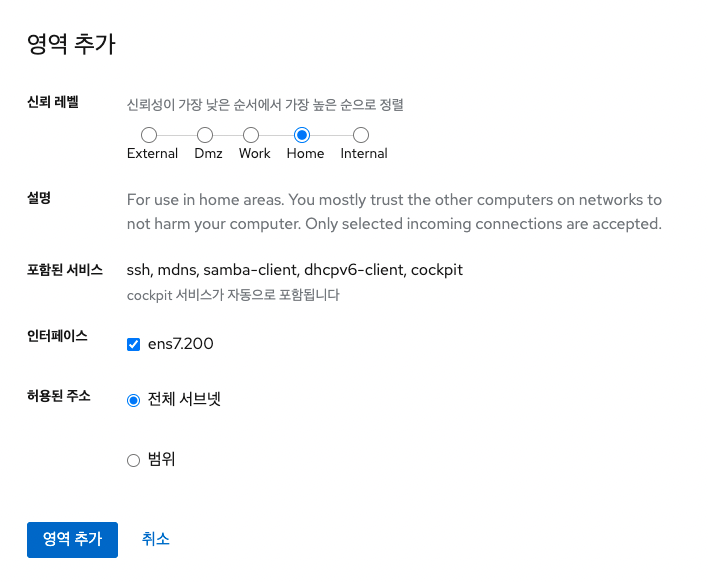

활성화된 영역의 구성 정보를 확인합니다.

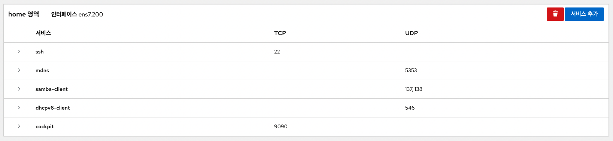

### 서비스 활성화

기본적으로 서비스는 기본 방화벽 영역에 추가됩니다. 더 많은 네트워크 인터페이스에서 더 많은 방화벽 영역을 사용하는 경우 먼저 영역을 선택한 다음 포트가 있는 서비스를 추가해야합니다. Cube의 웹 콘솔은 사전 정의된 firewalld 서비스를 표시하며 이를 활성화하여 방화벽 영역에 추가 할 수 있습니다.

방화벽 서비스를 활성화 하려면 : 

1. 관리자 권한으로 Cube의 웹 콘솔에 로그인합니다.
2. 네트워킹 메뉴를 클릭합니다.
3. **방화벽** 을 클릭합니다.

    

    - 방화벽 상자가 보이지 않으면 관리자 권한으로 Cube의 웹 콘솔에 로그인하십시오.

4. 방화벽 항목에서 **서비스 추가** 버튼을 클릭합니다.

    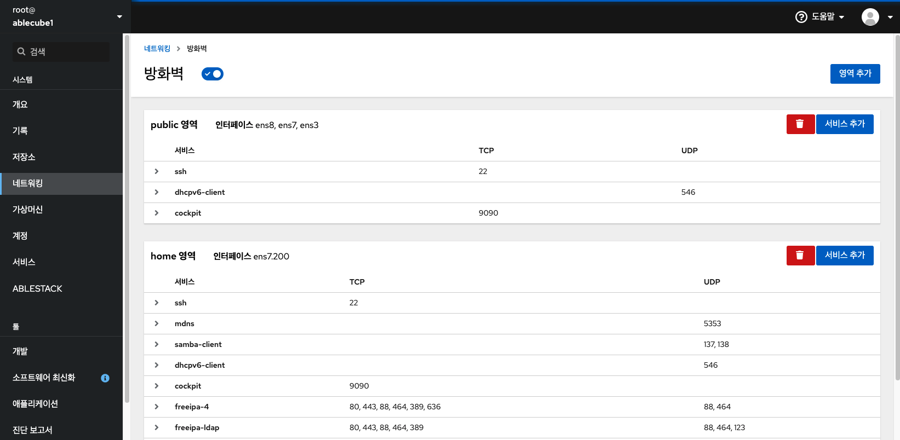

5. 서비스 추가 화면에서 서비스를 추가하고자 하는 영역을 선택합니다.
    - 서비스 추가 화면은 시스템이 여러 개의 활성 영역을 포함하는 경우에만 활성 방화벽 영역의 목록이 포함되어 있습니다.
    - 시스템에서 하나(기본) 영역만 사용하는 경우 영역 설정이 포함되지 않습니다.
6. 서비스 추가 화면에서 방화벽에 사용하려는 서비스를 찾을 수 있습니다.
7. 원하는 서비스를 활성화합니다.

    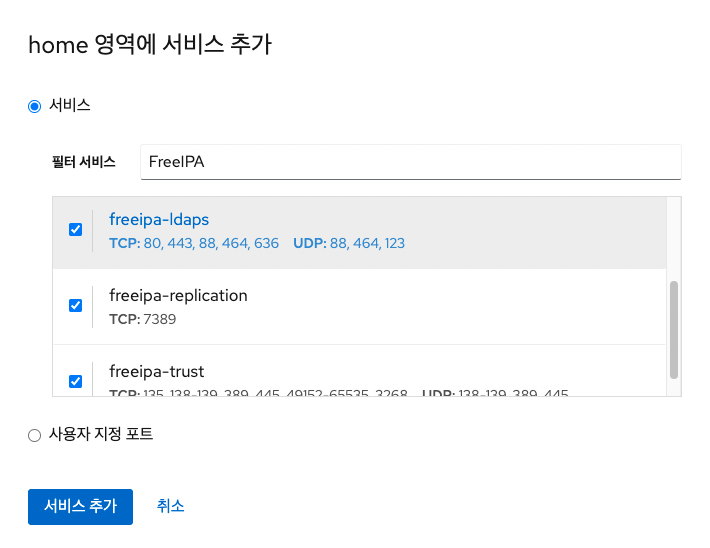

8. **서비스 추가** 버튼을 클릭합니다.

### 사용자 지정 포트 구성

Cube의 웹 콘솔을 사용하여 다음을 추가 할 수 있습니다.

- 표준 포트에서 수신하는 서비스 
- 사용자 지정 포트에서 수신하는 서비스

사용자 지정 포트가 구성된 방화벽 서비스를 추가하려면 : 

1. 관리자 권한으로 Cube의 웹 콘솔에 로그인합니다.
2. 네트워킹 메뉴를 클릭합니다.
3. **방화벽** 을 클릭합니다.

    

    - 방화벽 상자가 보이지 않으면 관리자 권한으로 Cube의 웹 콘솔에 로그인하십시오.

4. 방화벽 항목에서 **서비스 추가** 버튼을 클릭합니다.

    

5. 서비스 추가 화면에서 서비스를 추가하고자 하는 영역을 선택합니다.
    - 서비스 추가 화면은 시스템이 여러 개의 활성 영역을 포함하는 경우에만 활성 방화벽 영역의 목록이 포함되어 있습니다.
    - 시스템에서 하나(기본) 영역만 사용하는 경우 영역 설정이 포함되지 않습니다.
6. 포트 추가에서 사용자 정의 포트 라디오 버튼을 누릅니다.
7. TCP 및 UDP 항목에서 예제에 따라 포트를 추가하십시오. 다음 형식으로 포트를 추가 할 수 있습니다.
    - 22와 같은 포트 번호
    - 5900-5910과 같은 포트 번호 범위
    - nfs, rsync와 같은 별칭
    !!! info 
        각 항목에 여러 값을 추가 할 수 있습니다. 값은 공백없이 쉼표로 구분해야합니다 (예 : 8080,8081, http)
8. TCP 및 UDP 항목에 포트 번호를 추가 한 후 ID 항목에서 서비스 이름을 확인하십시오.
    - ID 항목은 예약된 포트의 서비스의 이름을 표시합니다. 이 포트를 자유롭게 사용할 수 있고 서버가 이 포트에서 통신 할 필요가 없는 경우 ID를 다시 쓸 수 있습니다.
9. ID 항목에 정의된 포트를 포함하여 서비스의 이름을 추가합니다.
10. **포트 추가** 버튼을 클릭합니다.

    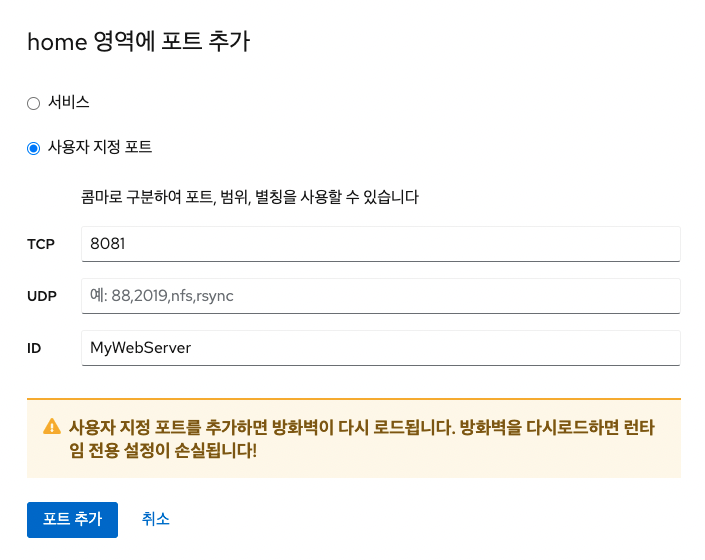

설정을 확인하려면 방화벽 페이지로 이동하여 허용된 서비스 목록에서 서비스를 찾으십시오.

 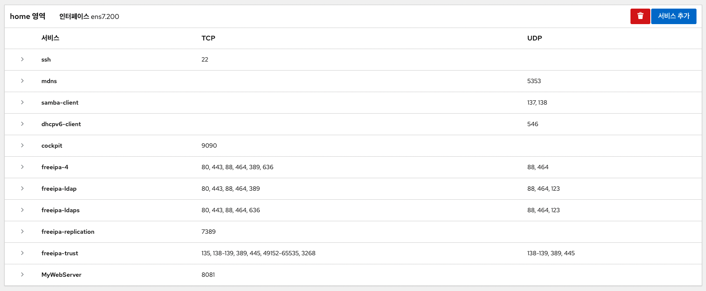

### 영역 비활성화

Cube의 웹 콘솔을 사용하여 방화벽 구성에서 방화벽 영역을 비활성화합니다.

방화벽 영역을 비활성화 하려면 : 

1. 관리자 권한으로 Cube의 웹 콘솔에 로그인합니다.
2. 네트워킹 메뉴를 클릭합니다.
3. **방화벽** 을 클릭합니다.

    

    - 방화벽 상자가 보이지 않으면 관리자 권한으로 Cube의 웹 콘솔에 로그인하십시오.

4. 활성 영역의 테이블의 제거할 영역의 **삭제** 아이콘을 선택합니다.

    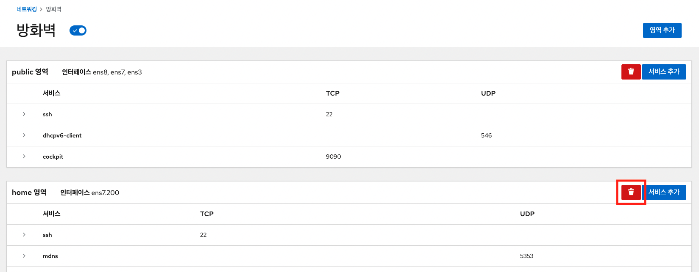

이제 영역이 비활성화되고 인터페이스에 영역에 구성된 열린 서비스 및 포트가 포함되지 않습니다.