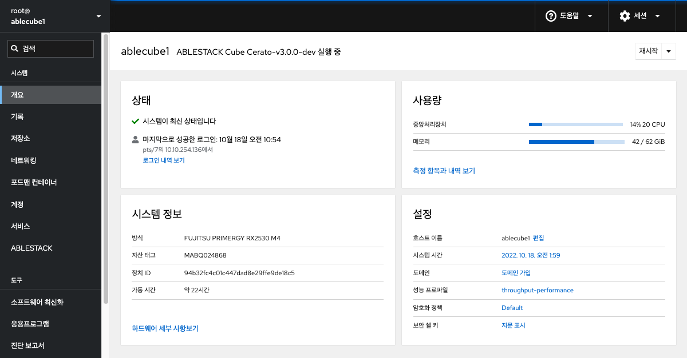
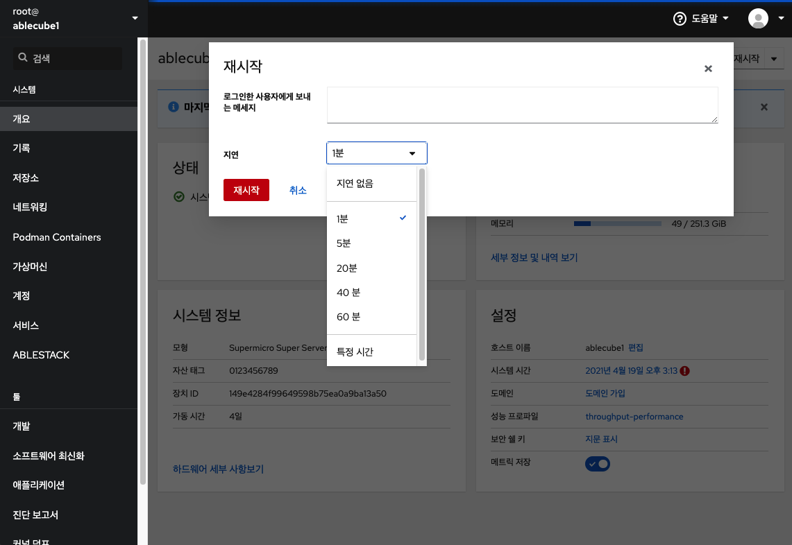
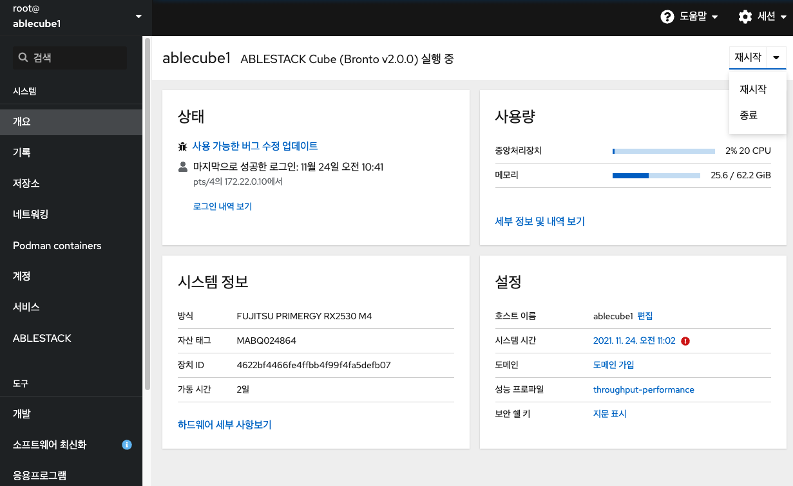
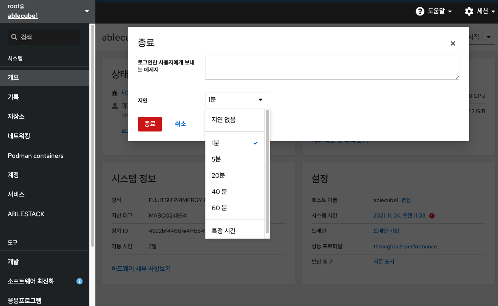
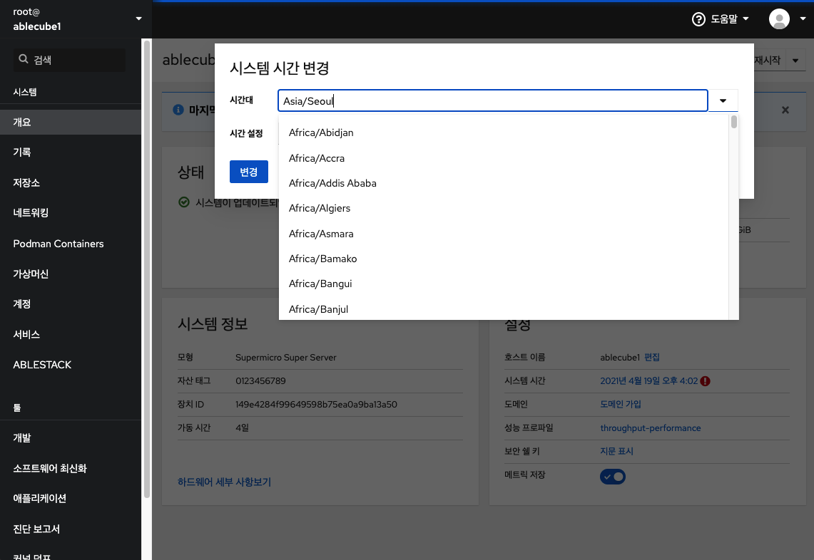
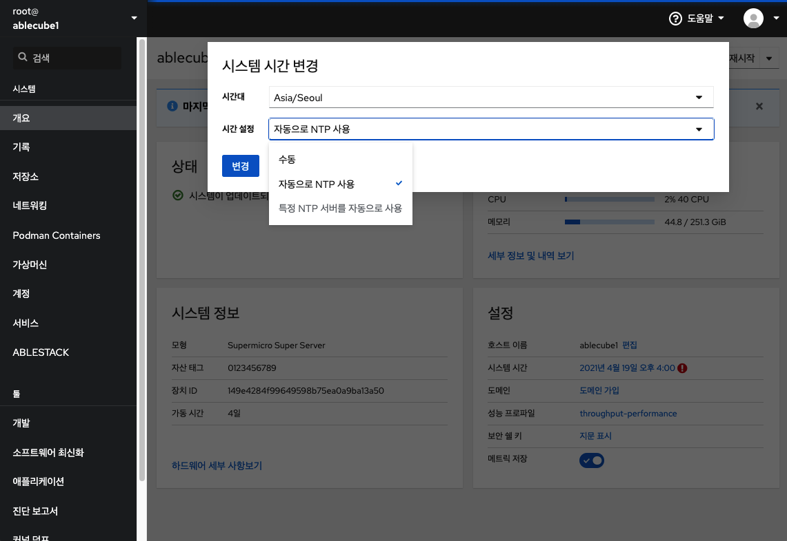
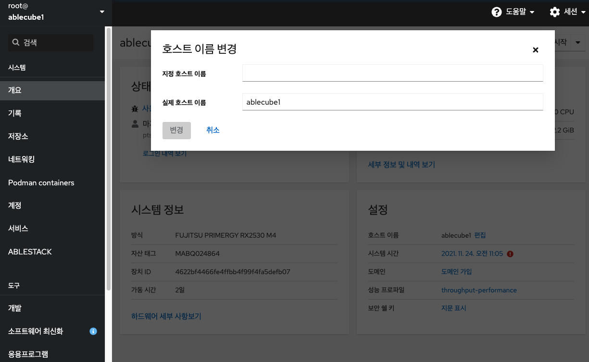
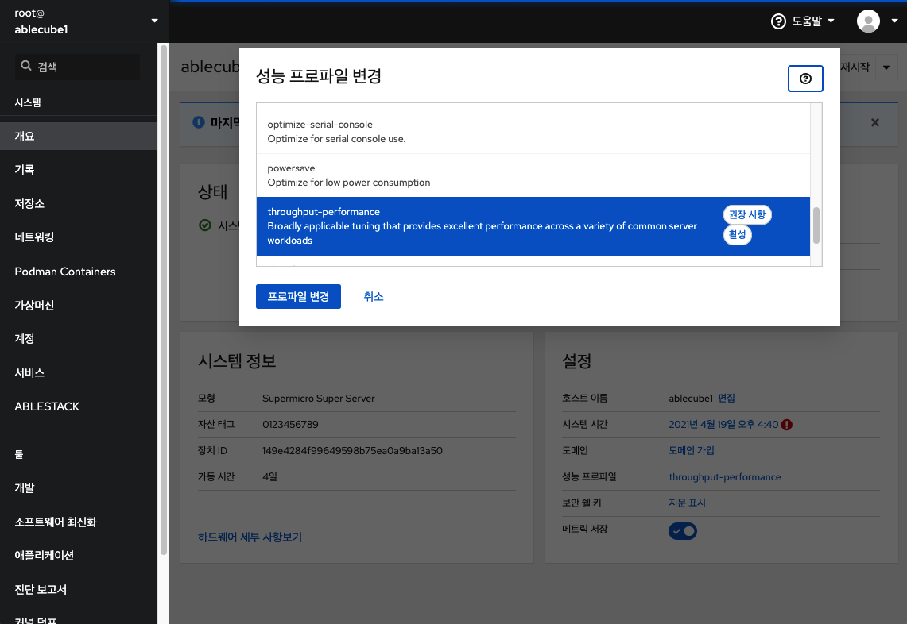

# 개요
Cube 웹 콘솔의 개요메뉴는 호스트의 상태, 자원사용량, 시스템정보, 기본적인 설정을 할 수 있는 기능을 제공합니다.

## 시스템 관리

**시스템 재시작**

Cube 웹 콘솔을 사용하여 연결된 시스템을 다시 시작할 수 있습니다.

!!! warning
    시스템 재시작 및 시스템 종료가 필요한 경우 사전에 해당 호스트의 운영중인 가상머신이 존재하는지 확인하여 다른 호스트로 마이그레이션 조치 후 진행하시기 바랍니다.
    확인이 어려우실 경우 기술지원 엔지니어를 통한 작업을 권고합니다.

시스템 재시작 하려면 : 

1. 재시작 버튼을 클릭 합니다.

2. 시스템에 로그인 한 사용자가 있으면 다시 시작 대화 상자에 다시 시작하는 이유를 작성하세요.
3. 선택 사항 : 지연 드롭 다운 목록에서 시간 간격을 선택합니다.

4. 재시작 버튼을 클릭 합니다.

**시스템 종료**

Cube 웹 콘솔을 사용하여 연결된 시스템을 종료 할 수 있습니다.

시스템 종료 하려면 : 

1. 드롭다운 목록에서 종료를 선택합니다.

2. 시스템에 로그인 한 사용자가 있는 경우 시스템 종료 대화 상자에 종료 이유를 작성하세요.
3. 선택 사항 : 지연 드롭 다운 목록에서 시간 간격을 선택합니다.

4. 종료를 클릭합니다.

**시스템 시간 설정**

시간대를 설정하고 시스템 시간을 NTP(Network Time Protocol) 서버와 동기화 할 수 있습니다.

시스템 시간 설정 하려면 : 

1. 시스템 시간의 현재 정보를 클릭합니다.

!!! info
    * 시간 동기화가 정상적이지 않을 경우 , 정상일 경우  아이콘이 표시됩니다.
    * NTP설정이 변경될 경우 모든 호스트 및 SCVM, CCVM에서도 동일한 설정이 필요합니다.

2. 시스템 시간 변경이 필요한 경우 대화 상자에서 시간대를 변경합니다.

3. 설정 시간 드롭다운 메뉴에서 다음 중 하나를 선택합니다.
    * 수동 : NTP 서버없이 수동으로 시간을 설정해야하는 경우 이 옵션을 사용합니다.
    * 자동으로 NTP 사용 : 미리 설정된 NTP 서버와 자동으로 동기화 하는 기본 옵션입니다.
    * 특정 NTP 서버를 자동으로 사용 : 시스템을 특정 NTP 서버와 동기화해야 하는 경우에만 이 옵션을 사용합니다. 서버의 DNS 이름 또는 IP 주소를 지정합니다.

4. 변경을 클릭 합니다.

**호스트 이름 구성**

Cube 웹 콘솔에서 실제 호스트 이름 또는 모양새를 갖춘 호스트 이름을 설정할 수 있습니다.

시스템 호스트 이름 변경하려면 : 

1. 호스트 이름의 편집을 클릭합니다 .

2. 호스트 이름 변경 대화상자에서 모양새를 갖춘 호스트 이름 필드에 호스트 이름을 입력합니다.
3.실제 호스트 이름 필드는 도메인 이름을 모양새를 갖춘 호스트 이름에 연결합니다. 실제 호스트 이름이 모양새를 갖춘 호스트 이름과 일치하지 않으면 수동으로 변경할 수 있습니다.

4. 변경을 클릭 합니다.

**시스템 성능 최적화**

Cube 웹 콘솔을 사용하여 선택한 작업에 대한 시스템 성능을 최적화합니다.

시스템 성능 최적화 하려면 : 

1. 성능 프로파일의 현재 정보를 클릭합니다.

2. 성능 프로파일 변경 대화상자에서 필요한 경우 프로파일을 변경합니다.

3. 프로파일 변경을 클릭 합니다.