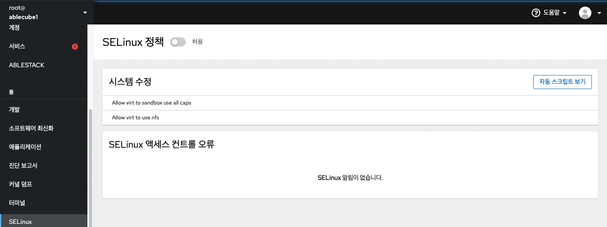

Cube의 웹 콘솔에서 SELinux 모드를 강제 또는 허용으로 설정할 수 있으며 오류, 제안된 솔루션 및 감사 로그에 대한 자세한 정보를 보려면 액세스 컨트롤 오류 항목에서 확인 할 수 있습니다.

## ANSIBLE 플레이북 적용
SELinux 관련 문제를 해결할 때 웹 콘솔은 쉘 스크립트 또는 Ansible 플레이북을 생성하여 더 많은 머신에 내보내고 적용하여 원격 시스템에 적용하고자 하는 정책이나 IT 프로세스하에 단계별로 설정 작업을 할 수 있습니다.

ANSIBLE 플레이북을 적용하려면 : 

1. SELinux를 메뉴를 클릭합니다.
2. 오른쪽 상단에서 **자동 스크립트보기** 버튼을 클릭합니다.
3. 스크립트 또는 Ansible 탭을 선택하고 **클립보드로 복사** 버튼을 선택합니다.

자동화 스크립트 보기 기능을 통해 복사하여 동일한 변경 사항을 다른 컴퓨터에 적용할 수 있습니다.
