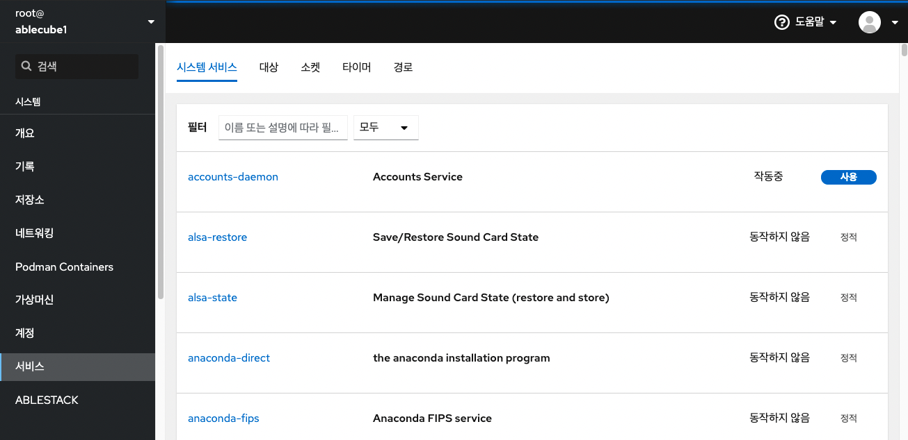
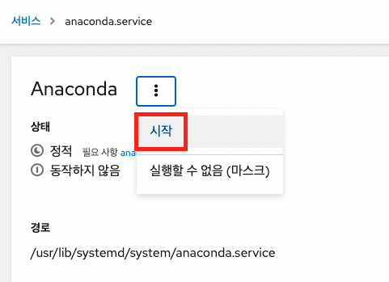
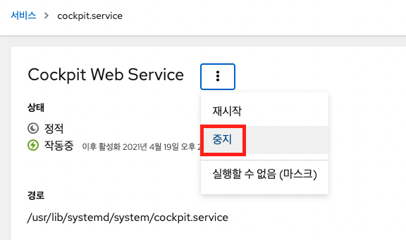
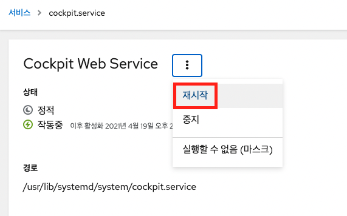

## 서비스 관리
Cube의 Cokckpit 인터페이스에서 시스템 서비스를 관리하는 기능을 제공합니다. 서비스를 활성화 또는 비활성화하고 다시 시작하거나 다시 로드하거나 자동 시작을 관리 할 수 ​​있습니다.

!!! info "Note"
        이름이나 설명 및 사용, 사용 안함 또는 정적 자동 시작으로 서비스를 필터링 할 수 있습니다. 인터페이스는 서비스의 현재 상태와 최근 로그를 보여줍니다.

### 시스템 서비스 활성화 또는 비활성화

이 절차는 Cube의 Cokckpit 인터페이스를 사용하여 시스템 서비스를 활성화 또는 비활성화합니다.

전제조건

- Cube의 Cokckpit이 설치되어있습니다.

순서

1. 관리자 권한으로 Cube의 Cockpit에 로그입합니다.
2. 서비스 메뉴를 클릭합니다.
3. 서비스의 기본 탭 은 시스템 서비스입니다. 대상, 소켓, 타이머 또는 경로를 관리하려면 상단 메뉴에서 해당 탭으로 전환합니다.

    

4. 서비스 설정을 열려면 목록에서 선택한 서비스를 선택합니다. 상태 항목을 확인하여 어떤 서비스가 활성 또는 비활성인지 알 수 있습니다.
5. 서비스 활성화 또는 비활성화 
    - 비활성 서비스를 활성화하려면 시작 버튼을 클릭합니다.

        

    - 활성 서비스를 비활성화하려면 중지 버튼을 클릭합니다.

        

### 시스템 서비스 다시 시작

이 절차는 Cube의 Cokckpit 인터페이스를 사용하여 시스템 서비스를 다시 시작합니다.

전제조건

- Cube의 Cokckpit이 설치되어있습니다.

순서

1. 관리자 권한으로 Cube의 Cockpit에 로그인합니다.
2. 서비스 메뉴를 클릭합니다.
3. 서비스의 기본 탭 은 시스템 서비스 입니다. 대상, 소켓, 타이머 또는 경로를 관리하려면 상단 메뉴에서 해당 탭으로 전환합니다.

    

4. 서비스 설정을 열려면 목록에서 선택한 서비스를 클릭합니다. 
5. 서비스를 다시 시작하려면 다시 시작 버튼을 클릭합니다.

    