# 저장소
Cube 웹 콘솔의 저장소메뉴는 사용하여 파일 시스템을 관리하는 기능을 제공합니다.

## 파티션 관리
파일 시스템 섹션에서 파일 시스템으로 포맷된 모든 사용 가능한 파티션, 파일 시스템의 이름, 크기 및 각 파티션에서 사용 가능한 공간 사이즈를 확인합니다.
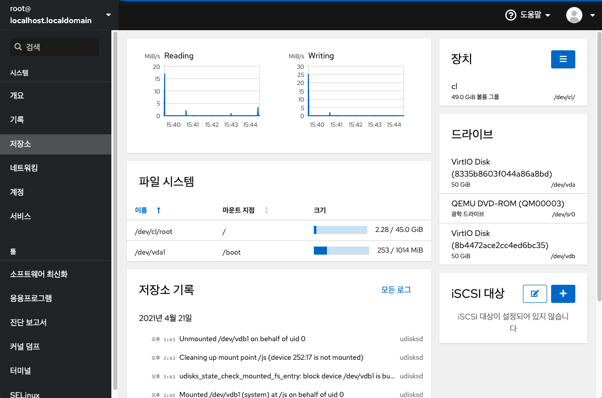

**파티션 생성**

* 디바이스 섹션에서 파티션을 생성 하고자 하는 볼륨을 클릭합니다.

* 컨텐츠 섹션에서 파티션 만들기 버튼을 클릭합니다.

* 파티션 생성 대화 상자에서 새 파티션의 크기를 선택합니다.
* 제거 드롭 다운 메뉴를 선택합니다
    * 기존 자료를 덮어쓰지 않습니다(디스크 헤더만 다시 작성합니다. 이 옵션의 장점은 포맷 속도입니다.)
    * 기존 데이터를 제로로 덮어쓰기(전체 디스크를 0으로 다시 씁니다. 이 옵션은 프로그램이 전체 디스크를 통과해야하므로 속도가 느리지만 보안성은 더 높습니다. 디스크에 데이터가 포함되어 있고 덮어쓰려면 이 옵션을 사용합니다.)
* 유형 드롭 다운 메뉴에서 파일 시스템을 선택합니다
    * XFS 파일 시스템은 대용량 논리 볼륨을 지원하고, 운영 중단 없이 물리적 드라이브를 온라인으로 전환하며, 기존 파일 시스템을 확장할 수 있습니다.<br>다른 강력한 기본 설정이 없는 경우 이 파일 시스템을 선택한 상태로 둡니다.
    * ext4 파일 시스템은 다음을 지원합니다.
        * 논리 볼륨
        * 중단없이 온라인으로 물리 드라이브 전환
        * 파일 시스템 확장
        * 파일 시스템 축소    

* 이름 필드에서 논리 볼륨 이름을 입력합니다.
* 마운트 지점 필드에 이 마운트 경로를 입력합니다.
* 파티션 만들기 버튼을 클릭 합니다.
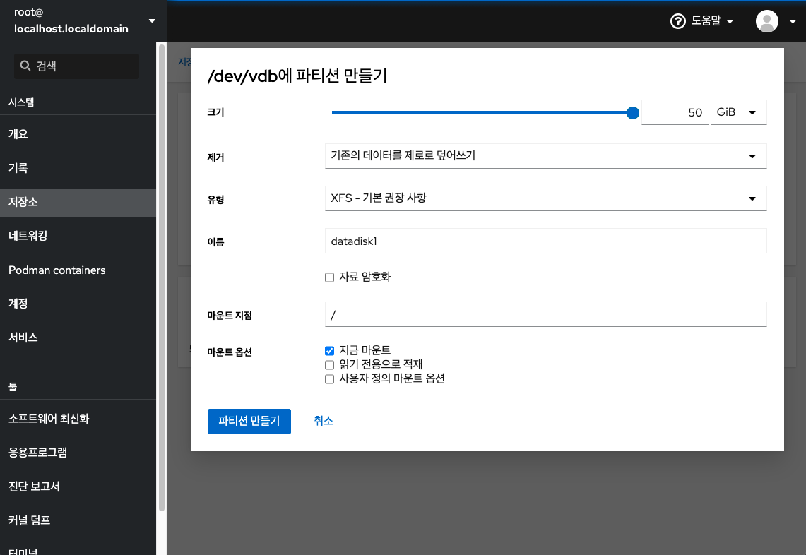
    포맷은 볼륨 크기 및 선택한 포맷 옵션에 따라 몇 분 정도 걸릴 수 있습니다.

    포맷이 성공적으로 완료되면 파일 시스템 섹션에서 포맷된 논리 볼륨의 세부 정보를 확인할 수 있습니다.


**파티션 삭제**

!!! info
    * 전제 조건 : 파티션의 파일 시스템을 마운트 해제합니다.    

* 저장소 메뉴에서 디바이스 섹션에서 삭제하고자 하는 파티션 볼륨을 클릭합니다.
* 컨텐츠 섹션에서 삭제할 파티션을 클릭합니다.
* 파티션이 롤 다운되고 삭제 버튼을 클릭할 수 있습니다.
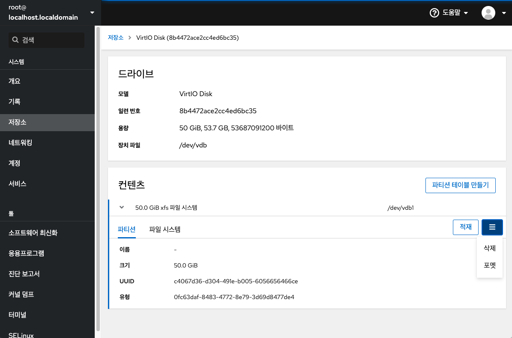

파티션이 성공적으로 제거되었는지 확인하려면 컨텐츠 섹션에서 확인할 수 있습니다.


**파일 시스템 마운트 및 마운트 해제**

파티션을 사용하려면 파티션을 파일 시스템을 장치로 마운트해야 합니다.

* 저장소 메뉴에서 디바이스 섹션에서 마운트하고자 하는 파티션 볼륨을 클릭합니다.
* 컨텐츠 섹션에서 파티션을 클릭하여 롤 다운합니다.
* 적재 버튼 클릭합니다.

* 대화상자에서 마운트 지점 및 옵션 선택 후 적재 버튼을 클릭합니다.

* 마운트 해제 버튼을 이용하여 해제 할수 있습니다.


## NFS 마운트 관리
NFS를 사용하면 네트워크에있는 원격 디렉토리에 도달하여 마운트 할 수 있으며 디렉토리가 실제 드라이브에있는 것처럼 파일에 대해 작업 할 수 있습니다.

**NFS 마운트 연결**

* NFS 마운트 섹션 에서 + 를 클릭 합니다.
* 새로운 NFS 적재 대화 상자에서 원격 서버의 서버 주소 또는 IP를 입력합니다.
* 서버상의 경로 필드에 탑재할 디렉토리의 경로를 입력합니다.
* 로컬 마운트 지점 필드에 로컬 시스템에서 디렉토리를 찾을 경로를 입력합니다.
* 재시작 시 적재를 선택합니다. 이렇게 하면 로컬 시스템을 다시 시작한 후에도 디렉토리에 연결할 수 있습니다.

* 추가를 클릭합니다.


**NFS 마운트 옵션 사용자 정의**

기존 NFS 마운트를 편집하고 사용자 지정 마운트 옵션을 추가합니다.

사용자 지정 마운트 옵션을 사용하면 NFS 마운트의 연결 문제를 해결하거나 시간 초과 제한을 변경하거나 인증을 구성하는 등의 매개 변수를 변경할 수 있습니다.

* NFS 마운트 섹션에서 변경할 NFS 마운트를 클릭합니다.
* 원격 디렉터리가 마운트된 경우 마운트 해제를 클릭합니다.
    * 사용자 지정 마운트 옵션 구성 중에는 디렉터리를 마운트하면 안 됩니다. 그렇지 않으면 웹 콘솔이 구성을 저장하지 않고 이로 인해 오류가 발생합니다.
* 편집을 클릭합니다.
* NFS 마운트 대화 상자에서 사용자 지정 마운트 옵션을 선택합니다.
    * nfsvers=4 — NFS 프로토콜 버전 번호
    * soft — NFS 요청 시간 초과 후 복구 유형
    * sec=krb5 — Kerberos 인증을 통해 NFS 서버의 파일을 보호할 수 있습니다. NFS 클라이언트와 서버는 모두 Kerberos 인증을 지원해야 합니다.
* 적용을 클릭합니다.

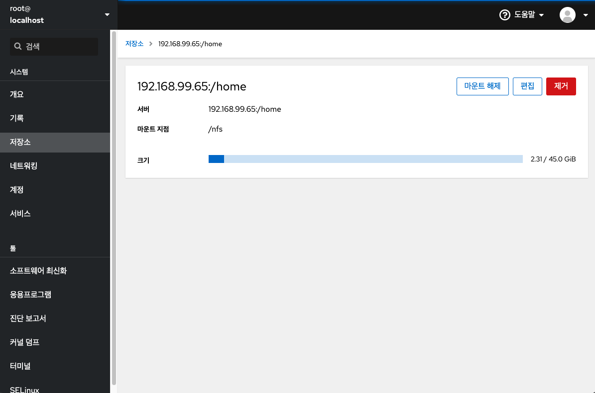


## 독립 디스크 중복 관리

RAID(Redundant Arrays of Independent Disks)는 더 많은 Disk를 하나의 스토리지로 정렬하는 방법을 나타냅니다. RAID는 Disk에 저장된 데이터를 Disk 장애로부터 보호합니다.

RAID는 다음과 같은 데이터 배포 전략을 사용합니다.

* 미러링 - 데이터가 서로 다른 두 위치에 복사됩니다. 디스크 하나에 장애가 발생하면 사본이 있고 데이터는 손실되지 않습니다.
* 스트라이핑 — 데이터가 디스크 간에 고르게 분산됩니다.

보호 수준은 RAID 수준에 따라 다릅니다.

Cube 웹 콘솔은 다음과 같은 RAID 수준을 지원합니다.

* RAID 0(스트라이프)
* RAID 1(미러)
* RAID 4(전용 패리티)
* RAID 5(분산 패리티)
* RAID 6(이중 분산 패리티)
* RAID 10(미러 스트라이프)

RAID에서 디스크를 사용하려면 먼저 다음을 수행해야 합니다.

* RAID를 생성합니다.
* 파일 시스템으로 포맷합니다.
* 서버에 RAID를 마운트합니다.

**RAID 생성**

시스템에 연결된 실제 디스크입니다. 각 RAID 수준에는 서로 다른 양의 디스크가 필요합니다.

* 장치 섹션에 버튼 드롭 다운의 레이드 장치 만들기 버튼을 클릭합니다.
  
* 레이드 장치 만들기 대화 상자에 새 RAID의 이름을 입력합니다.
* RAID 수준 드롭다운 목록에서 사용할 RAID 수준을 선택합니다.
* Chunk 크기 드롭다운 목록에서 미리 정의된 값을 그대로 둡니다.
* Chunk 크기 값은 데이터 쓰기에 사용할 각 블록의 크기를 지정합니다. Chunk 크기가 512KiB이면 시스템이 첫 번째 디스크에 첫 번째 512KiB를 쓰고, 두 번째 512KiB는 두 번째 디스크에 쓰이고, 세 번째 Chunk는 세 번째 디스크에 쓰입니다. RAID에 디스크가 3개 있는 경우, 네 번째 512KiB가 첫 번째 디스크에 다시 기록됩니다.
* RAID에 사용할 디스크를 선택하십시오.
  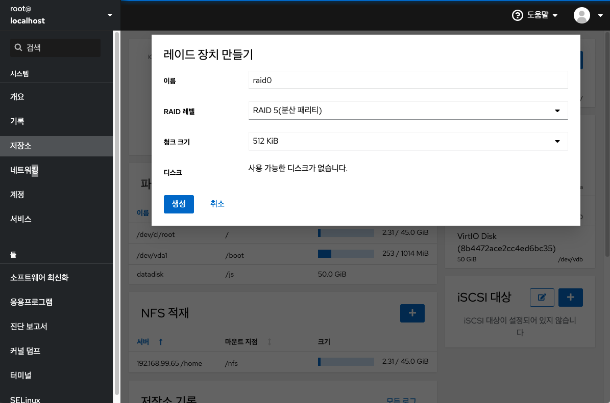
* 생성을 클릭합니다.

장치 섹션에서 새 RAID를 확인하고 포맷할 수 있습니다.


**RAID 포맷**

생성된 새 소프트웨어 RAID 장치 포맷합니다.

* 장치 섹션에서 포맷할 RAID를 클릭하여 선택합니다.
* RAID 세부 정보 화면에서 아래로 스크롤하여 내용 부분으로 이동합니다.
* 새로 생성된 RAID를 클릭합니다.
* 포멧 버튼을 클릭합니다.
* 지우기 드롭다운 목록에서 다음을 선택 : 
    * 기존 데이터를 덮어쓰지 마십시오. - 디스크 헤더만 다시 씁니다. 이 옵션의 장점은 포맷 속도입니다.
    * 기존 데이터를 0으로 덮어씁니다. - 전체 디스크를 0으로 다시 씁니다. 이 옵션은 프로그램이 전체 디스크를 통과해야 하므로 더 느립니다. RAID에 데이터가 포함되어 있고 데이터를 다시 작성해야 하는 경우 이 옵션을 사용합니다.
* 다른 강력한 기본 설정이 없는 경우 유형 드롭다운 목록에서 XFS 파일 시스템을 선택합니다.
* 파일 시스템 이름을 입력합니다.
* 마운트 드롭다운 목록에서 사용자 지정을 선택합니다. 기본 옵션은 파일 시스템이 다음 부팅 시 마운트되도록 보장하지 않습니다.
* 마운트 지점 필드에서 마운트 경로를 추가합니다.
* 재시작 시 적재를 선택합니다.
* 포멧 버튼을 클릭합니다.
    * 사용되는 포맷 옵션 및 RAID 크기에 따라 포맷에 몇 분 정도 걸릴 수 있습니다.
    * 완료 후 파일 시스템 탭에서 포맷된 RAID에 대한 세부 정보를 볼 수 있습니다.
* RAID를 사용하려면 마운트를 클릭합니다.
* 이 때 시스템은 마운트되고 포맷된 RAID를 사용합니다.

**RAID 파티션 테이블 생성**

생성된 새 소프트웨어 RAID 장치의 파티션 테이블을 사용하여 RAID를 포맷합니다.

RAID를 사용하려면 다른 스토리지 디바이스와 같은 포맷이 필요합니다. 두 가지 옵션이 있습니다.

* 파티션 없이 RAID 장치 포맷
* 파티션이 있는 파티션 테이블 만들기


* 장치 섹션에서 포맷할 RAID를 클릭하여 선택합니다.
* RAID 세부 정보 화면에서 아래로 스크롤하여 내용 부분으로 이동합니다.
* 새로 생성된 RAID를 클릭합니다.
* Create partition table 버튼을 클릭합니다.
* 지우기 드롭다운 목록에서 다음을 선택 : 
    * 기존 데이터를 덮어쓰지 마십시오. - 디스크 헤더만 다시 씁니다. 이 옵션의 장점은 포맷 속도입니다.
    * 기존 데이터를 0으로 덮어씁니다. - 전체 디스크를 0으로 다시 씁니다. 이 옵션은 프로그램이 전체 디스크를 통과해야 하므로 더 느립니다. RAID에 데이터가 포함되어 있고 데이터를 다시 작성해야 하는 경우 이 옵션을 사용합니다.
* 파티셔닝 드롭다운 목록에서 다음을 선택 :
    * 최신 시스템 및 하드 디스크와 호환 가능 > 2TB(GPT) - GUID 파티션 테이블은 4개 이상의 파티션을 가진 대형 RAID에 권장되는 현대식 파티션 시스템입니다.
    * 모든 시스템 및 장치(MBR)와 호환 - 마스터 부트 레코드는 최대 2TB 크기의 디스크에서 작동합니다. MBR은 또한 최대 4개의 기본 파티션을 지원합니다.
* 포멧 버튼을 클릭합니다.

이때 파티션 테이블이 생성되어 파티션을 만들 수 있습니다.

**RAID에 파티션 생성**

기존 파티션 테이블에 파티션을 생성합니다.

* 장치 섹션에서 편집할 RAID를 클릭합니다.
* RAID 세부 정보 화면에서 아래로 스크롤하여 내용 부분으로 이동합니다.
* 새로 생성된 RAID를 클릭합니다.
* 파티션 만들기를 클릭하세요.
* 파티션 생성 대화 상자에서 첫 번째 파티션의 크기를 설정하십시오.
* 지우기 드롭다운 목록에서 다음을 선택 : 
    * 기존 데이터를 덮어쓰지 마십시오. - 디스크 헤더만 다시 씁니다. 이 옵션의 장점은 포맷 속도입니다.
    * 기존 데이터를 0으로 덮어씁니다. - 전체 디스크를 0으로 다시 씁니다. 이 옵션은 프로그램이 전체 디스크를 통과해야 하므로 더 느립니다. RAID에 데이터가 포함되어 있고 데이터를 다시 작성해야 하는 경우 이 옵션을 사용합니다.
* 다른 강력한 기본 설정이 없는 경우 유형 드롭다운 목록에서 XFS 파일 시스템을 선택합니다.
* 파일 시스템의 이름을 입력합니다. 이름에 공백을 사용하지 마십시오.
* 마운트 드롭다운 목록에서 사용자 지정을 선택합니다.

* 기본 옵션은 파일 시스템이 다음 부팅 시 마운트되도록 보장하지 않습니다.

* 마운트 지점 필드에서 마운트 경로를 추가합니다.
* 재시작 시 적재를 선택합니다.
* 파티션 만들기를 클릭하세요.

사용되는 포맷 옵션 및 RAID 크기에 따라 포맷에 몇 분 정도 걸릴 수 있습니다.

완료 후 다른 파티션 만들기를 계속할 수 있습니다.

이 때 시스템은 마운트되고 포맷된 RAID를 사용합니다.

**RAID에 볼륨 그룹 생성**

소프트웨어 RAID로 볼륨 그룹을 구축합니다.

!!! info
    * 전제 조건 : 포맷되지 않고 마운트되지 않은 RAID 장치여야 합니다.


* 장치 섹션에 버튼 드롭 다운의 볼륨 그룹 만들기 버튼을 클릭합니다.
  
* 볼륨 그룹 생성 대화 상자에서 새 볼륨 그룹의 이름을 입력합니다.
* Disks 목록에서 RAID 디바이스를 선택합니다. 목록에 RAID가 없으면 시스템에서 RAID를 분리합니다.
* 생성을 클릭합니다.  

새 볼륨 그룹이 생성되었으며 논리 볼륨 생성을 계속할 수 있습니다.


## LVM 논리 볼륨 구성 
Cube웹 콘솔은 LVM 볼륨 그룹 및 논리적 볼륨을 생성하기 위한 그래픽 인터페이스를 제공합니다.

**논리 볼륨 관리**

볼륨 그룹은 물리적 볼륨과 논리적 볼륨 사이에 계층을 생성합니다. 이를 통해 논리적 볼륨 자체에 영향을 미치지 않고 물리적 볼륨을 추가하거나 제거할 수 있습니다. 볼륨 그룹은 그룹에 포함된 모든 물리적 드라이브의 용량으로 구성된 용량을 가진 하나의 드라이브로 나타납니다.

물리적 드라이브를 웹 콘솔의 볼륨 그룹에 결합할 수 있습니다.

논리 볼륨은 단일 물리적 드라이브 역할을 하며 시스템의 볼륨 그룹 위에 구축됩니다.

논리 볼륨의 주요 이점은 다음과 같습니다.

* 물리적 드라이브에 사용된 파티션 시스템보다 뛰어난 유연성
* 더 많은 물리적 드라이브를 하나의 볼륨에 연결할 수 있습니다.
* 재시작하지 않고 온라인으로 볼륨 용량을 확장(증가)하거나 축소(축소)할 수 있습니다.
* 스냅샷을 생성할 수 있습니다.


**볼륨 그룹 생성**

하나 이상의 물리적 드라이브 또는 다른 스토리지 장치에서 볼륨 그룹을 생성합니다.

논리 볼륨은 볼륨 그룹에서 생성됩니다. 각 볼륨 그룹에는 여러 논리 볼륨이 포함될 수 있습니다.

* 장치 섹션에 버튼 드롭 다운의 볼륨 그룹 만들기 버튼을 클릭합니다.
* 이름 필드에 공백이 없는 그룹의 이름을 입력합니다.
* 볼륨 그룹을 생성하기 위해 결합할 드라이브를 선택합니다.
 
 예상대로 장치를 볼 수 없을 수도 있습니다. RHEL 웹 콘솔에는 사용하지 않는 블록 장치만 표시됩니다. 사용된 장치는 예를 들어 다음을 의미합니다.

    * 파일 시스템으로 포맷된 장치
    * 다른 볼륨 그룹의 물리적 볼륨
    * 물리적 볼륨이 다른 소프트웨어 RAID 장치의 멤버<br>장치가 보이지 않으면 비어 있고 사용되지 않도록 포맷하십시오.

* 생성 버튼을 클릭합니다.

웹 콘솔은 볼륨 그룹 섹션에 볼륨 그룹을 추가합니다. 그룹을 클릭한 후 해당 볼륨 그룹에서 할당된 논리 볼륨을 생성할 수 있습니다.


**논리 볼륨 생성**

* 논리 볼륨을 생성할 볼륨 그룹을 클릭합니다.
* 새 논리 볼륨 만들기를 클릭합니다.
* 이름 필드에 공백 없이 새 논리 볼륨의 이름을 입력합니다.
* 목적 드롭다운 메뉴에서 파일 시스템의 블록 장치을 선택합니다.<br>이 구성을 사용하면 볼륨 그룹에 포함된 모든 드라이브의 용량 합계에 해당하는 최대 볼륨 크기를 가진 논리 볼륨을 생성할 수 있습니다.
  
* 논리 볼륨의 크기를 정의합니다. 고려 사항:

    * 이 논리 볼륨을 사용하는 시스템에 필요한 공간입니다.
    * 생성할 논리적 볼륨 수입니다.
  
전체 공간을 사용할 필요는 없습니다. 필요한 경우 나중에 논리 볼륨을 확장할 수 있습니다.

* 생성 버튼을 클릭합니다.


이 단계에서 논리 볼륨이 생성되었으며 포맷 프로세스를 사용하여 파일 시스템을 생성하고 마운트해야 합니다.

**논리 볼륨 포멧**

논리 볼륨은 물리적 드라이브 역할을 합니다. 파일을 사용하려면 파일 시스템으로 포맷해야 합니다.

!!! warning
    논리 볼륨을 포맷하면 볼륨의 모든 데이터가 삭제됩니다.

선택한 파일 시스템에 따라 논리 볼륨에 사용할 수 있는 구성 매개 변수가 결정됩니다.<br>
예를 들어 일부 XFS 파일 시스템은 볼륨 축소를 지원하지 않습니다. 자세한 내용은 웹 콘솔에서 논리 볼륨 크기 조정을 참조하십시오.

* 장치 섹션의 논리 볼륨이 배치된 볼륨 그룹을 클릭합니다.
* 논리 볼륨 섹션에서 인식되지 않은 데이터로 표시된 볼륨을 클릭합니다.
  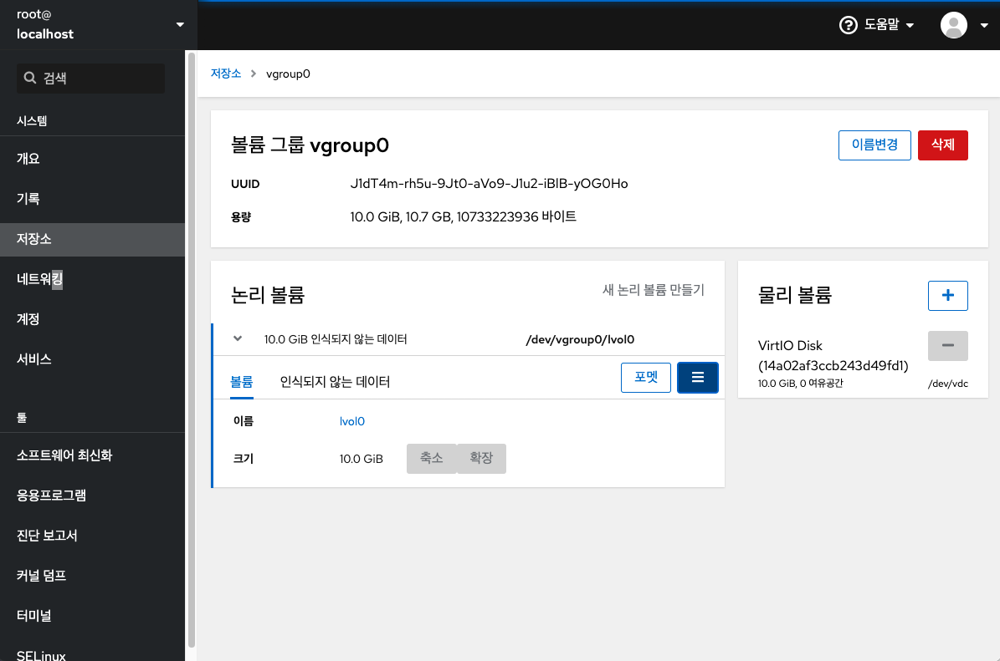
* 포멧 버튼을 클릭합니다.
* 지우기 드롭다운 목록에서 다음을 선택 : 
    * 기존 데이터를 덮어쓰지 마십시오. - 디스크 헤더만 다시 씁니다. 이 옵션의 장점은 포맷 속도입니다.
    * 기존 데이터를 0으로 덮어씁니다. - 전체 디스크를 0으로 다시 씁니다. 이 옵션은 프로그램이 전체 디스크를 통과해야 하므로 더 느립니다. RAID에 데이터가 포함되어 있고 데이터를 다시 작성해야 하는 경우 이 옵션을 사용합니다.
* 유형 드롭 다운 메뉴에서 파일 시스템을 선택합니다
    * XFS 파일 시스템은 대용량 논리 볼륨을 지원하고, 운영 중단 없이 물리적 드라이브를 온라인으로 전환하며, 기존 파일 시스템을 확장할 수 있습니다.<br>다른 강력한 기본 설정이 없는 경우 이 파일 시스템을 선택한 상태로 둡니다.
    * ext4 파일 시스템은 다음을 지원합니다.
        * 논리 볼륨
        * 중단없이 온라인으로 물리 드라이브 전환
        * 파일 시스템 확장
        * 파일 시스템 축소   
* 이름 필드에서 논리 볼륨 이름을 입력합니다.
* 마운트 지점 필드에 이 마운트 경로를 입력합니다.
* 재시작 시 적재를 선택합니다.
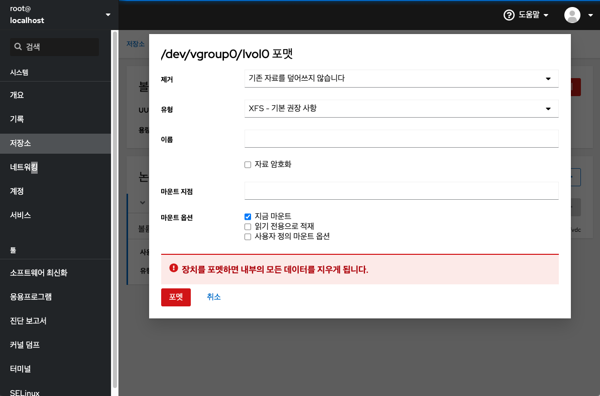
* 포멧 버튼을 클릭합니다.
    * 사용되는 포맷 옵션 및 RAID 크기에 따라 포맷에 몇 분 정도 걸릴 수 있습니다.
    * 완료 후 파일 시스템 탭에서 포맷된 논리 볼륨에 대한 세부 정보를 볼 수 있습니다.
    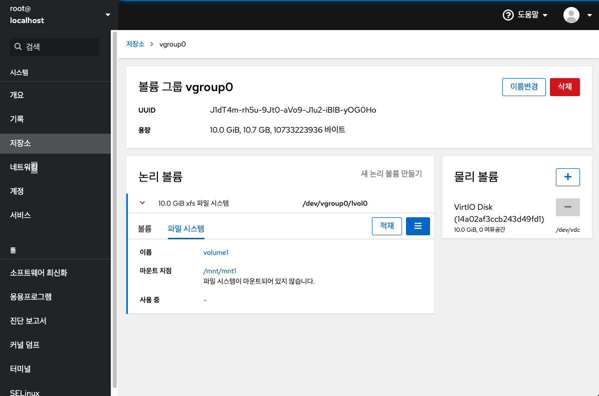

* 논리 볼륨을 사용하려면 마운트를 클릭합니다.

**논리 볼륨 리사이즈**

논리 볼륨의 크기를 조정할 수 있는지 여부는 사용 중인 파일 시스템에 따라 다릅니다. 대부분의 파일 시스템을 사용하면 중단 없이 온라인으로 볼륨을 확장(확대)할 수 있습니다.

또한 논리 볼륨에 축소를 지원하는 파일 시스템이 포함된 경우 논리 볼륨의 크기를 줄이거나 축소할 수 있습니다. 예를 들어 ext3/ext4 파일 시스템에서 사용할 수 있어야 합니다.

!!! warning
    GFS2 또는 XFS 파일 시스템이 포함된 볼륨은 줄일 수 없습니다.

* 논리 볼륨 섹션의 볼륨 탭에서 축소 버튼을 클릭합니다.
    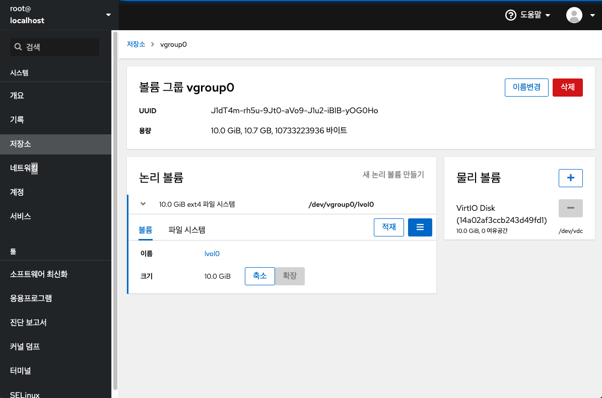
* 논리 볼륨 축소 대화상자에서 크기를 조절 후 축소 버튼을 클릭합니다.
    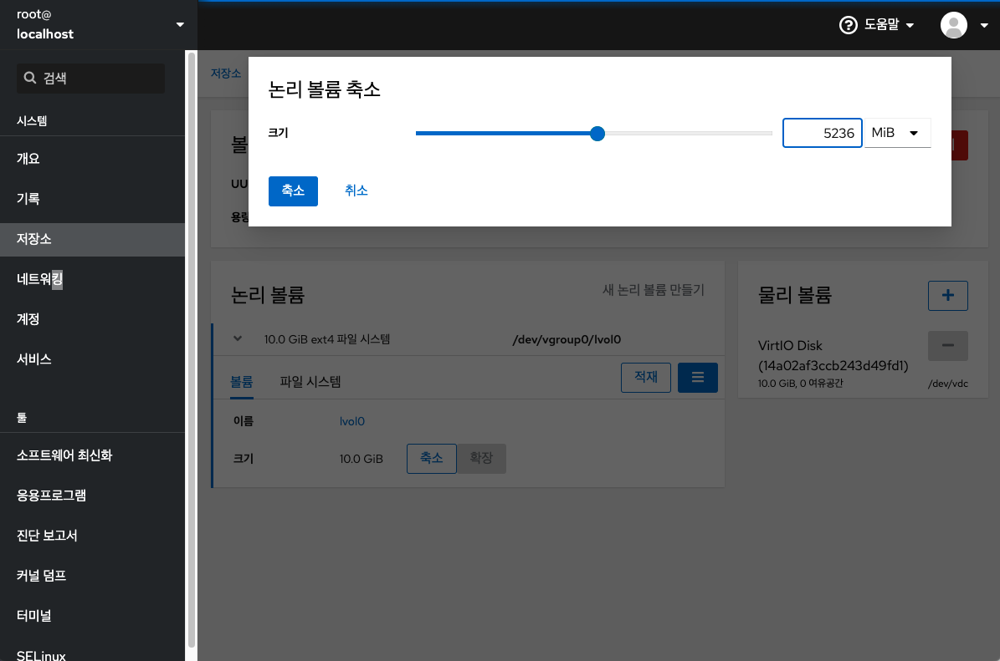
* 논리 볼륨 축소 대화상자에서 크기를 조절 후 축소 버튼을 클릭합니다.
  
변경된 볼륨 사이즈를 확인합니다.
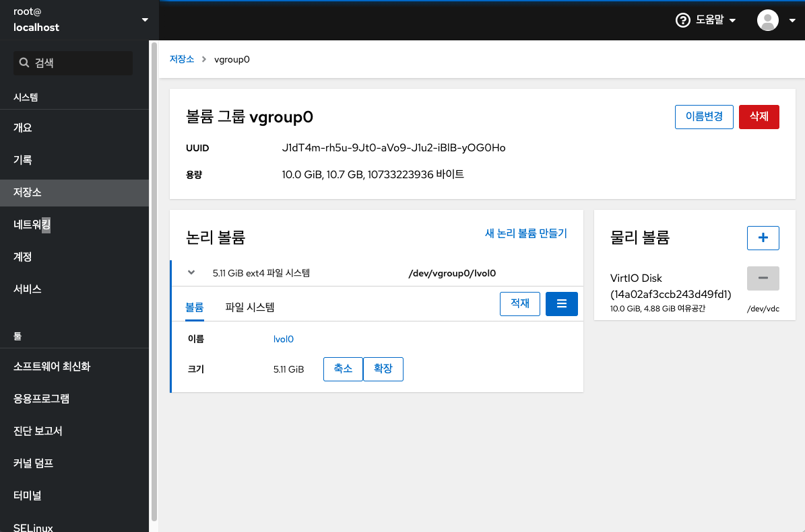


## thin 논리 볼륨 구성
씬 프로비저닝된 논리 볼륨을 사용하면 실제 논리 볼륨에 포함된 공간보다 지정된 애플리케이션 또는 서버에 더 많은 공간을 할당할 수 있습니다.

**thin 논리 볼륨 Pool 생성**

* 논리 볼륨을 생성할 볼륨 그룹을 클릭합니다.
* 논리 볼륨 섹션의 새 논리 볼륨 만들기를 클릭합니다.
* 새 논리 볼륨 대화상자에서 목적 필드에 thin 프로비저닝된 볼륨을 위한 풀을 선택합니다.

* 이름, 크기 입력 후 생성 버튼을 클릭합니다.

씬 볼륨에 대한 풀이 생성되었으며 씬 볼륨을 추가할 수 있습니다.


**thin 논리 볼륨 생성**

Pool에 thin 논리 볼륨을 만듭니다. Pool에는 여러 개의 thin 볼륨이 포함될 수 있으며 각 thin 볼륨은 thin 볼륨 자체의 Pool 크기만큼 커질 수 있습니다.
  
!!! info
    씬 볼륨을 사용하려면 논리적 볼륨의 실제 사용 가능한 물리적 공간을 정기적으로 확인해야 합니다.

* 논리 볼륨 섹션의 씬 볼륨을 위함 풀의 씬 볼륨 만들기 버튼을 클릭합니다
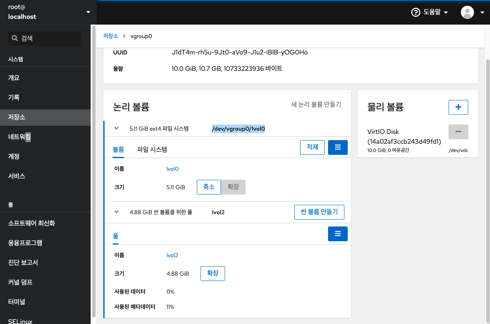
* 이름, 크기 설정 후 생성 버튼을 클릭합니다.
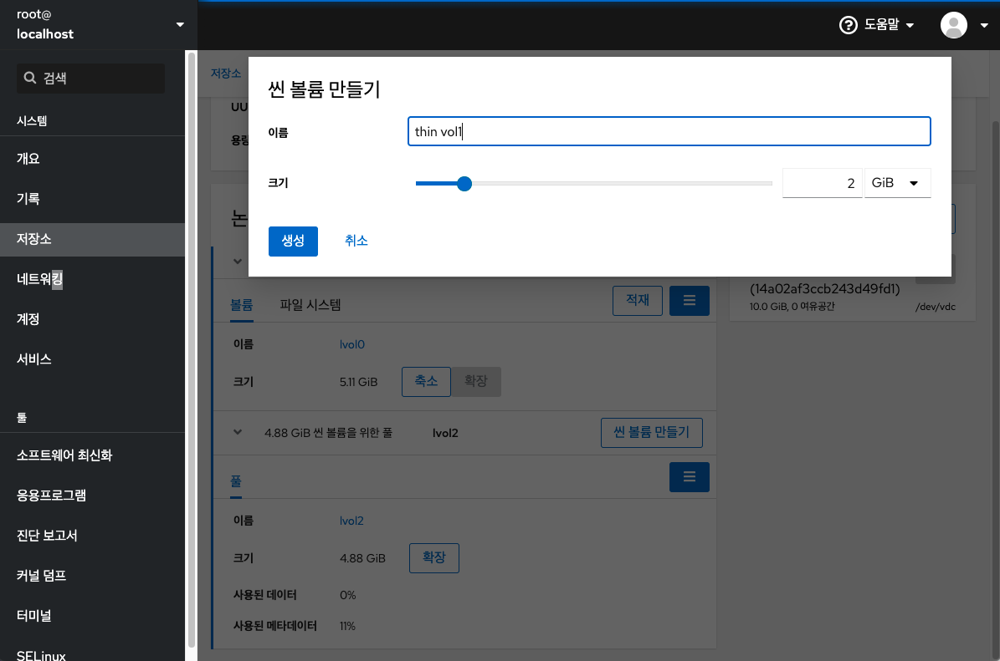


## 볼륨 그룹의 물리적 드라이브 변경 
새로운 물리적 드라이브 또는 다른 유형의 볼륨을 기존 논리 볼륨에 추가, 변경할 수 있습니다.

**볼륨 그룹에 물리적 드라이브 추가**

새로운 물리적 드라이브 또는 다른 유형의 볼륨을 기존 논리 볼륨에 추가할 수 있습니다.

* 장치 섹션에서 볼륨 그룹을 클릭합니다.
* 물리 볼륨 섹션에서 + 버튼을 클릭합니다.
  
* 디스크 추가 대화상자에서 추가할 디스크 목록을 선택합니다.
  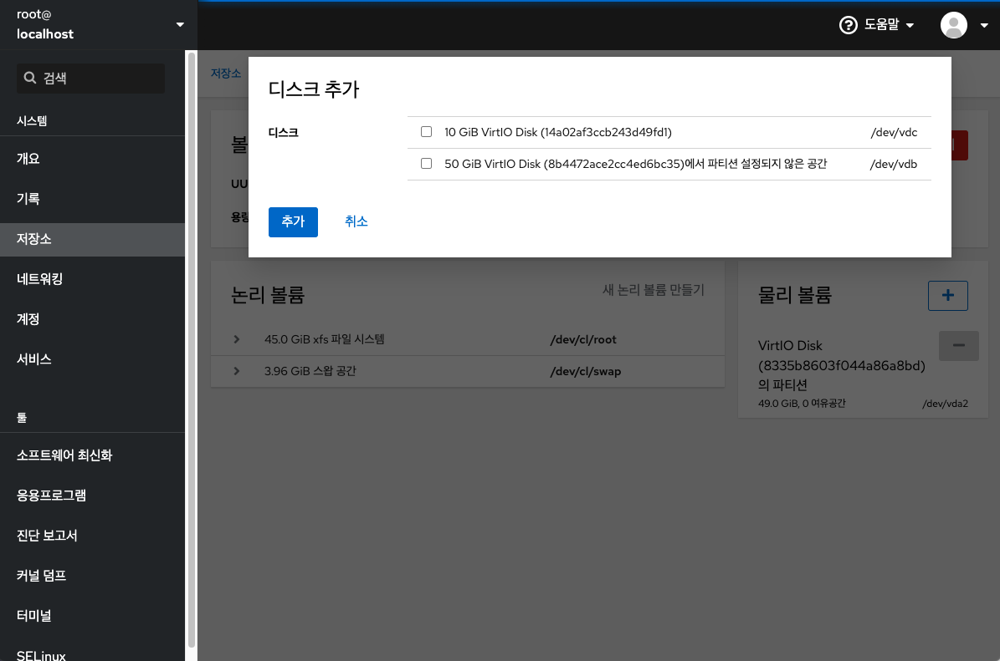
* 추가된 물리 볼륨을 확인합니다.
  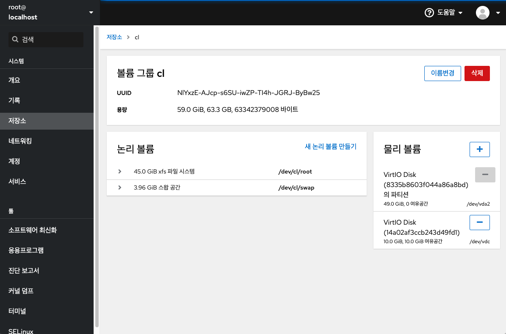

**볼륨 그룹에 물리적 드라이브 삭제**

논리 볼륨에 여러 물리적 드라이브가 포함된 경우 온라인에서 물리적 드라이브 중 하나를 제거할 수 있습니다.

시스템은 제거 프로세스 중에 제거할 드라이브의 모든 데이터를 다른 드라이브로 자동으로 이동합니다. 시간이 걸릴 수 있습니다.

또한 웹 콘솔은 물리적 드라이브를 제거할 공간이 충분한지 확인합니다.

* 물리 볼륨 섹션에서 - 버튼을 클릭합니다.  


## VDO(가상 데이터 최적화) 볼륨 관리

VDO는 다음과 같은 기술을 사용합니다.

* 인라인으로 스토리지 공간 절약
* 파일 압축
* 중복 제거
* 물리적 또는 논리적 스토리지가 제공하는 것보다 더 많은 가상 공간을 할당할 수 있습니다.
* 확장을 통해 가상 스토리지를 확장할 수 있습니다.
  
VDO는 다양한 유형의 스토리지를 기반으로 생성할 수 있습니다.

* LVM
* 물리 볼륨
* 소프트웨어 RAID


**VDO 볼륨 생성**

* 장치 섹션에서 VDO 볼륨 만들기를 클릭합니다.
* VDO 장치 만들기 대화상자에서 이름 필드에 공백없이 입력합니다.
* 디스크를 선택합니다.
* 논리 크기 표시줄에서 VDO 볼륨의 크기를 설정합니다. 10회 이상 확장할 수 있지만 VDO 볼륨을 생성하는 목적을 고려하십시오.
    * 활성 VM 또는 컨테이너 스토리지의 경우 볼륨 물리적 크기의 10배인 논리적 크기를 사용하십시오.
    * 개체 저장의 경우 볼륨 물리적 크기의 3배인 논리적 크기를 사용합니다.
* 인덱스 메모리 표시줄에서 VDO 볼륨에 대한 메모리를 할당합니다.
* 압축 옵션을 선택합니다.<br>이 옵션을 사용하면 다양한 파일 형식을 효율적으로 줄일 수 있습니다.
* 중복 옵션을 선택합니다.<br>이 옵션은 중복 블록의 복사본을 여러 개 제거하여 스토리지 리소스 사용을 줄입니다. 자세한 내용은 VDO에서 중복 제거 사용 또는 사용 안 함을 참조하십시오.
* [선택사항] 512바이트 블록 크기가 필요한 애플리케이션에서 VDO 볼륨을 사용하려면 512바이트 에뮬레이션 사용을 선택합니다. 따라서 VDO 볼륨의 성능이 저하되지만 필요한 경우는 거의 없습니다.
* 생성 버튼을 클릭합니다.


VDO 볼륨을 생성하는 프로세스가 성공하면 스토리지 섹션에서 새 VDO 볼륨을 보고 파일 시스템으로 포맷할 수 있습니다.

**VDO 볼륨 포멧**

VDO 볼륨은 물리적 드라이브 역할을 합니다. 파일을 사용하려면 파일 시스템으로 포맷해야 합니다.

!!! warning
    VDO를 포맷하면 볼륨의 모든 데이터가 지워집니다.

선택한 파일 시스템에 따라 논리 볼륨에 사용할 수 있는 구성 매개 변수가 결정됩니다.<br>
예를 들어 일부 XFS 파일 시스템은 볼륨 축소를 지원하지 않습니다. 자세한 내용은 웹 콘솔에서 논리 볼륨 크기 조정을 참조하십시오.

* 장치 섹션의 VDO 장치를 클릭합니다.
* 컨텐츠 섹션에서 인식되지 않은 데이터로 표시된 볼륨을 클릭합니다.
  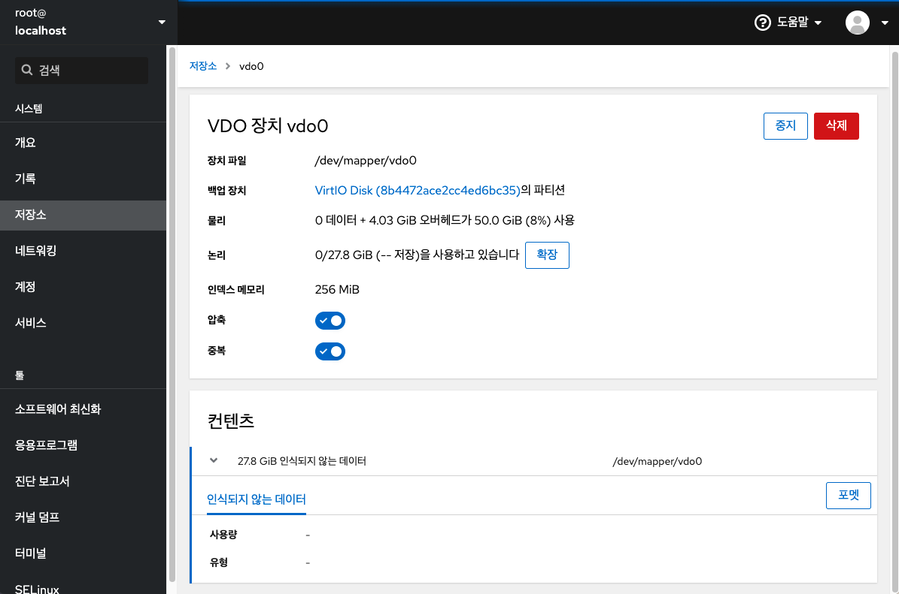
* 포멧 버튼을 클릭합니다.
* 지우기 드롭다운 목록에서 다음을 선택 : 
    * 기존 데이터를 덮어쓰지 마십시오. - 디스크 헤더만 다시 씁니다. 이 옵션의 장점은 포맷 속도입니다.
    * 기존 데이터를 0으로 덮어씁니다. - 전체 디스크를 0으로 다시 씁니다. 이 옵션은 프로그램이 전체 디스크를 통과해야 하므로 더 느립니다. RAID에 데이터가 포함되어 있고 데이터를 다시 작성해야 하는 경우 이 옵션을 사용합니다.
* 유형 드롭 다운 메뉴에서 파일 시스템을 선택합니다
    * XFS 파일 시스템은 대용량 논리 볼륨을 지원하고, 운영 중단 없이 물리적 드라이브를 온라인으로 전환하며, 기존 파일 시스템을 확장할 수 있습니다.<br>다른 강력한 기본 설정이 없는 경우 이 파일 시스템을 선택한 상태로 둡니다.
    * ext4 파일 시스템은 다음을 지원합니다.
        * 논리 볼륨
        * 중단없이 온라인으로 물리 드라이브 전환
        * 파일 시스템 확장
        * 파일 시스템 축소   
* 이름 필드에서 논리 볼륨 이름을 입력합니다.
* 마운트 지점 필드에 이 마운트 경로를 입력합니다.
* 재시작 시 적재를 선택합니다.
* 포멧 버튼을 클릭합니다.
    * 사용되는 포맷 옵션 및 RAID 크기에 따라 포맷에 몇 분 정도 걸릴 수 있습니다.
    * 성공적으로 완료되면 파일 시스템 탭에서 포맷된 VDO 볼륨에 대한 세부 정보를 볼 수 있습니다.

VDO 볼륨을 사용하려면 마운트를 클릭합니다.

**VDO 볼륨 확장**

* VDO 장치 상세 섹션에 확장 버튼을 클릭합니다.
* 논리 크기 확장 대화상자에서 논리 크기 사이즈를 변경합니다.
* 확장 버튼을 클릭합니다.


## Luks 비밀번호 데이터 잠금
Cube 웹 콘솔의 저장소 탭에서 LUKS(Linux Unified Key Setup) 버전2 형식을 사용하여 암호화된 장치를 생성, 잠금, 잠금 해제, 크기 조정 및 구성할 수 있습니다.

* 보다 유연한 잠금 해제 정책을 제공합니다.
* 보다 강력한 암호화 기능을 제공합니다.
* 향후 변경 사항과의 호환성 향상

**LUKS 디스크 암호화**

LUKS(Linux Unified Key Setup-on-Disk-format)를 사용하면 블록 장치를 암호화할 수 있으며 암호화된 장치 관리를 간소화하는 도구 집합을 제공합니다. LUKS를 사용하면 여러 사용자 키가 파티션의 대량 암호화에 사용되는 마스터 키를 해독할 수 있습니다.

RHEL은 LUKS를 사용하여 블록 장치 암호화를 수행합니다. 기본적으로 설치 중에 차단 장치를 암호화하는 옵션은 선택 해제되어 있습니다. 디스크를 암호화하는 옵션을 선택하면 시스템을 부팅할 때마다 암호를 입력하라는 메시지가 표시됩니다. 이 암호문은 파티션을 해독하는 대량 암호화 키를 "잠금 해제"합니다. 기본 파티션 테이블을 수정하도록 선택한 경우 암호화할 파티션을 선택할 수 있습니다. 파티션 테이블 설정에서 설정됩니다.

LUKS가 하는 작업 :

* LUKS는 전체 블록 장치를 암호화하므로 이동식 저장 미디어 또는 노트북 디스크 드라이브와 같은 모바일 장치의 콘텐츠를 보호하는 데 적합합니다.
* 암호화된 블록 장치의 기본 내용은 임의이므로 스왑 장치를 암호화하는 데 유용합니다. 이 기능은 데이터 저장에 특수하게 포맷된 블록 장치를 사용하는 특정 데이터베이스에서도 유용할 수 있습니다.
* LUKS는 기존 장치 매퍼 커널 하위 시스템을 사용합니다.
* LUKS는 사전 공격으로부터 보호하는 암호 강화 기능을 제공합니다.
* LUKS 장치에는 여러 키 슬롯이 포함되어 있어 사용자가 백업 키 또는 암호를 추가할 수 있습니다.

LUKS가 하지 않는 작업 :

* LUKS와 같은 디스크 암호화 솔루션은 시스템이 꺼져 있을 때만 데이터를 보호합니다. 시스템이 켜져 있고 LUKS가 디스크의 암호를 해독하면 해당 디스크의 파일은 일반적으로 해당 디스크에 액세스할 수 있는 모든 사용자가 사용할 수 있습니다.
* LUKS는 많은 사용자가 동일한 장치에 대한 고유한 액세스 키를 가져야 하는 시나리오에는 적합하지 않습니다. LUKS1 형식은 8개의 키 슬롯, 최대 32개의 키 슬롯을 제공합니다.
* LUKS는 파일 레벨 암호화를 필요로 하는 애플리케이션에는 적합하지 않습니다.

암호 :

LUKS에 사용되는 기본 암호는 aes-xts-plain64입니다. LUKS의 기본 키 크기는 512비트입니다. 아나콘다(XTS 모드)를 사용하는 LUKS의 기본 키 크기는 512비트입니다. 사용 가능한 암호는 다음과 같습니다.

* AES - Advanced Encryption Standard - FIPS PUB 197
* Twofish (a 128-bit block cipher)
* Serpent


**LUKS 암호 구성**

* 장치 섹션의 원하는 장치를 클릭합니다.
* 컨텐츠 섹션의 포맷 버튼을 클릭합니다.
* 자료 암호화 박스를 선택하고 스토리지 디바이스에서 암호화를 활성화합니다.
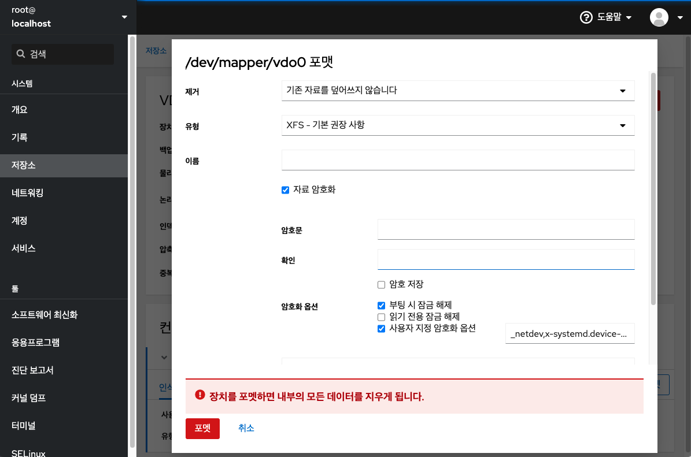

* 새 암호를 설정하고 확인합니다.
* [선택사항] 추가 암호화 선택사항을 수정합니다.
* 포멧 버튼을 클릭합니다.


**LUKS 암호 변경**

* 컨텐츠 섹션의 암호화 탭에서 암호변경 버튼을 클릭합니다.
  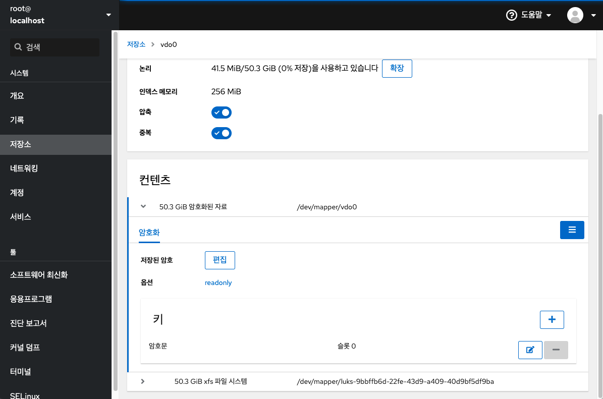
* 암호문 변경 대화상자에서 필드값을 입력하고 저장버튼을 클릭합니다.
  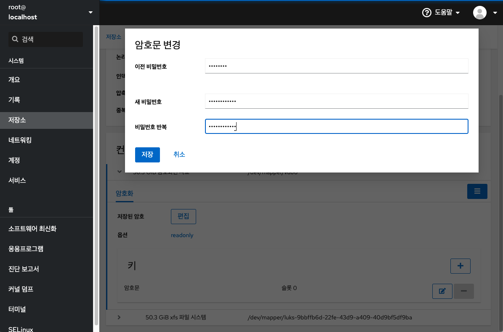

## tang키를 사용한 자동 잠금 해제 구성
Tang 서버에서 제공하는 키를 사용하여 LUKS 암호화 스토리지 장치의 자동 잠금 해제를 구성합니다.

* 장치 섹션의 원하는 장치를 클릭합니다.
* 컨텐츠 섹션의 파티션 선택하여 드릴 다운합니다.
* 암호화 탭에서 키 섹션의 + 버튼을 클릭합니다.
* 키 소스는 Tang 키 서버 로 선택합니다.
* 키 서버 주소 필드와 디스크 비밀번호 필드에 값을 입력합니다.
  
* 추가 버튼을 클릭합니다.
* 다음 대화 창에서는 키 해시가 일치하는지 확인하는 명령을 제공합니다. tang-show-keys 스크립트를 도입했으며 포트 80에서 실행되는 Tang 서버에서 다음 명령을 사용하여 키 해시를 가져올 수 있습니다.
```
# ssh localhost tang-show-keys 7500
fLbUfkfuIpUg4zEGVy6Y--KeJiY
```


* 키 섹션에 키 서버 설정을 확인합니다.


초기 부팅 시스템이 디스크 바인딩을 처리하려면 왼쪽 탐색 막대 하단의 터미널을 클릭하고 다음 명령을 입력하십시오.

```
# dnf -y install clevis-dracut
# dracut -fv --regenerate-all
```


