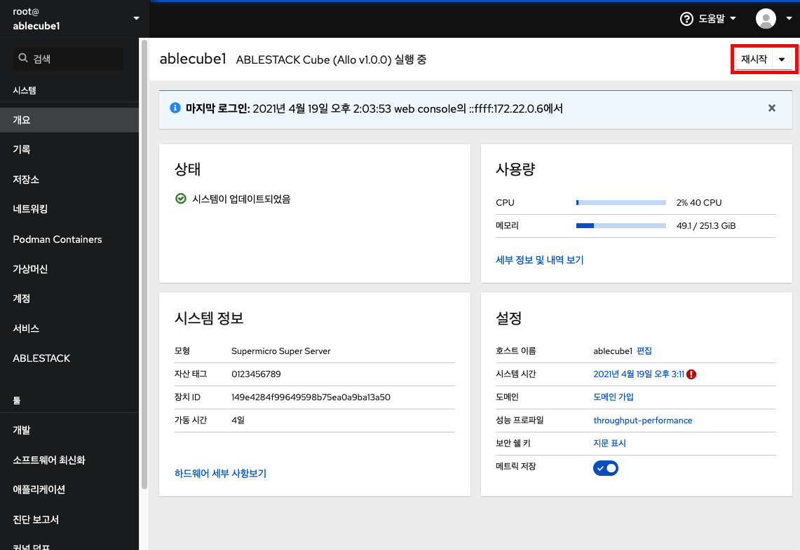
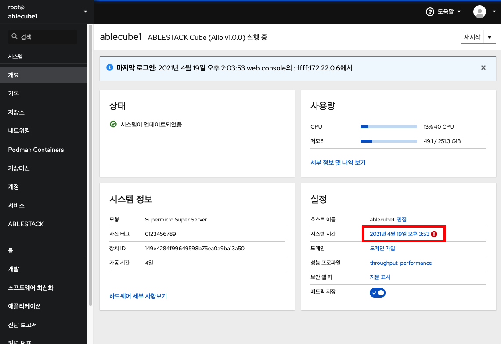
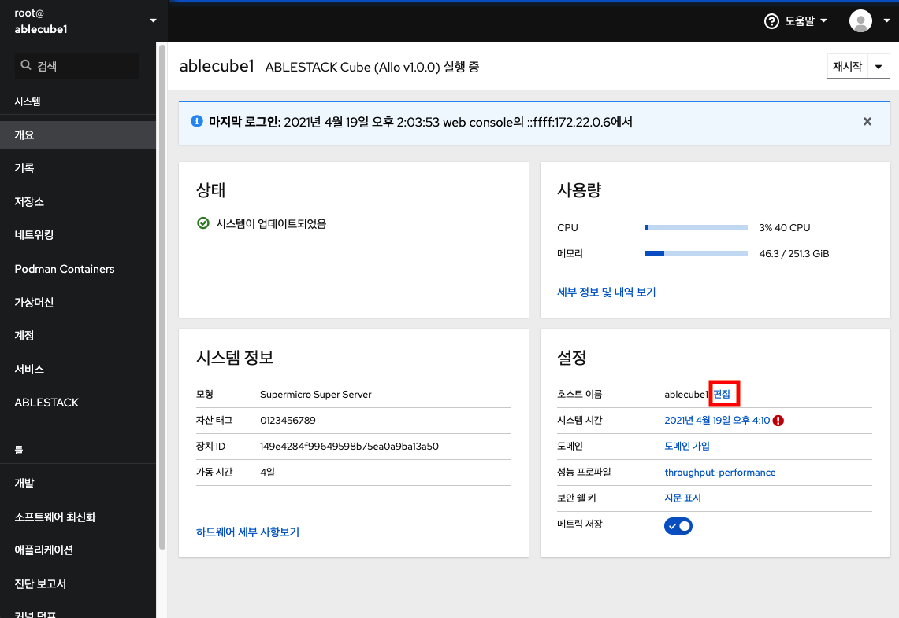
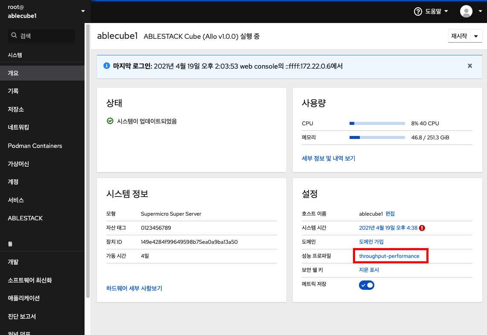

# 사용자 인터페이스
Cube는 관리자가 사용할 수있는 웹 기반 UI를 제공합니다.

## 개요
Cube 웹 콘솔의 주요 관리 기능을 알아보고 웹 기반 UI에서 시스템을 조작 및 모니터링 하는 방법을 설명합니다.

### 전제조건
* OS를 설치합니다.
* 네트워크를 활성화 합니다.

### Cube 웹 콘솔이란?
Cube 웹 콘솔은 로컬 시스템과 네트워크 환경에있는 Linux 서버를 관리하고 모니터링하기 위해 설계된 웹 기반 인터페이스입니다.


Cube 웹 콘솔을 사용하면 다음과 같은 광범위한 관리 작업을 수행 할 수 있습니다.

* 서비스 관리
* 사용자 계정 관리
* 시스템 서비스 관리 및 모니터링
* 네트워크 인터페이스 및 방화벽 구성
* 시스템 로그 검토
* 가상 머신 관리
* 진단 보고서 작성
* 커널 덤프 구성 설정
* SELinux 구성
* 소프트웨어 업데이트
* 시스템 구독 관리

Cube 웹 콘솔은 터미널에서와 동일한 시스템 API를 사용하며 터미널에서 수행된 작업은 Cube 웹 콘솔에 즉시 반영됩니다.

네트워크 환경에서 시스템의 로그와 성능을 그래프로 표시하여 모니터링 할 수 있습니다. 또한 웹 콘솔이나 터미널을 통해 직접 설정을 변경할 수 있습니다.


## 로그인
시스템 사용자 이름 및 비밀번호를 사용하여 RHEL 웹 콘솔에 처음 로그인하려면이 절차의 단계를 사용하십시오.

#### 전제조건
* Cube 웹 콘솔을 열려면 다음 브라우저 중 하나를 사용하십시오.
    * Mozilla Firefox 52 이상
    * Google Chrome 57 이상
    * Microsoft Edge 16 이상
* 시스템 사용자 계정 자격 증명
    * Cube 웹 콘솔은 /etc/pam.d/cockpit에 위치한 특정 PAM 스택을 사용합니다. PAM을 인증하면 시스템의 로컬 계정의 사용자 이름 및 암호로 로그인할 수 있습니다.

### 순서
1. 웹 콘솔에 접속합니다.
 ```
 https://Host IP:9090
 ```


2. 사용자 이름을 입력합니다.
3. 암호를 입력합니다.
4. 기타옵션(선택)
    * 연결대상 : (Host IP or Host Name)
5. 로그인을 클릭합니다.

## 시스템 재시작
Cube 웹 콘솔을 사용하여 웹 콘솔이 연결된 시스템을 다시 시작할 수 있습니다.

### 전제 조건
* Cube 웹 콘솔이 설치되고 액세스 가능합니다.

### 순서
1. 웹 콘솔에 로그인합니다.
2. 개요를 클릭 합니다.
3. 다시 시작 버튼을 클릭 합니다.

4. 시스템에 로그인 한 사용자가 있으면 다시 시작 대화 상자에 다시 시작하는 이유를 작성 하십시오.
5. 선택 사항 : 지연 드롭 다운 목록에서 시간 간격을 선택합니다.

6. 다시 시작을 클릭 합니다.


## 시스템 종료
Cube 웹 콘솔을 사용하여 웹 콘솔이 연결된 시스템을 종료 할 수 있습니다.

### 전제 조건
* Cube 웹 콘솔이 설치되고 액세스 가능합니다.

### 순서
1. Cube 웹 콘솔에 로그인합니다.
2. 개요를 클릭 합니다.
3. 드롭다운 목록에서 종료를 선택합니다.

4. 시스템에 로그인 한 사용자가 있는 경우 시스템 종료 대화 상자에 종료 이유를 기록하십시오.
5. 선택 사항 : 지연 드롭 다운 목록에서 시간 간격을 선택합니다.

6. 종료를 클릭합니다.


## 시스템 시간 설정
시간대를 설정하고 시스템 시간을 NTP (Network Time Protocol) 서버와 동기화 할 수 있습니다.

### 전제 조건
* Cube 웹 콘솔이 설치되고 액세스 가능합니다.

### 순서
1. Cube 웹 콘솔에 로그인합니다.
2. 개요에서 현재 시스템 시간을 클릭합니다 .

3. 시스템 시간 변경이 필요한 경우 대화 상자에서 시간대를 변경합니다.

4. 설정 시간 드롭다운 메뉴에서 다음 중 하나를 선택합니다.
    * 수동 : NTP 서버없이 수동으로 시간을 설정해야하는 경우 이 옵션을 사용합니다.
    * 자동으로 NTP 사용 : 미리 설정된 NTP 서버와 자동으로 동기화 하는 기본 옵션입니다.
    * 특정 NTP 서버를 자동으로 사용 : 시스템을 특정 NTP 서버와 동기화해야 하는 경우에만 이 옵션을 사용합니다. 서버의 DNS 이름 또는 IP 주소를 지정합니다.

5. 변경을 클릭 합니다.


## 호스트 이름 구성
Cube 웹 콘솔에서 실제 호스트 이름 또는 예쁜 호스트 이름을 설정합니다.

### 전제 조건
* Cube 웹 콘솔이 설치되고 액세스 가능합니다.

### 순서
1. Cube 웹 콘솔에 로그인합니다.
2. 개요에서 호스트 이름 편집을 클릭합니다 .

3. 호스트 이름 변경 대화상자에서 모양새를 갖춘 호스트 이름 필드에 호스트 이름을 입력합니다.
4. 실제 호스트 이름 필드는 도메인 이름을 모양새를 갖춘 호스트 이름에 첨부합니다. 실제 호스트 이름이 모양새를 갖춘 호스트 이름과 일치하지 않으면 수동으로 변경할 수 있습니다.

5. 변경을 클릭 합니다.


## 시스템 성능 최적화
Cube 웹 콘솔을 사용하여 선택한 작업에 대한 시스템 성능을 최적화합니다.

### 전제 조건
* Cube 웹 콘솔이 설치되고 액세스 가능합니다.

### 순서
1. Cube 웹 콘솔에 로그인합니다.
2. 개요에서  성능 프로파일을 클릭합니다 .

3. 성능 프로파일 변경 대화상자에서 필요한 경우 프로파일을 변경합니다.

4. 프로파일 변경을 클릭 합니다.