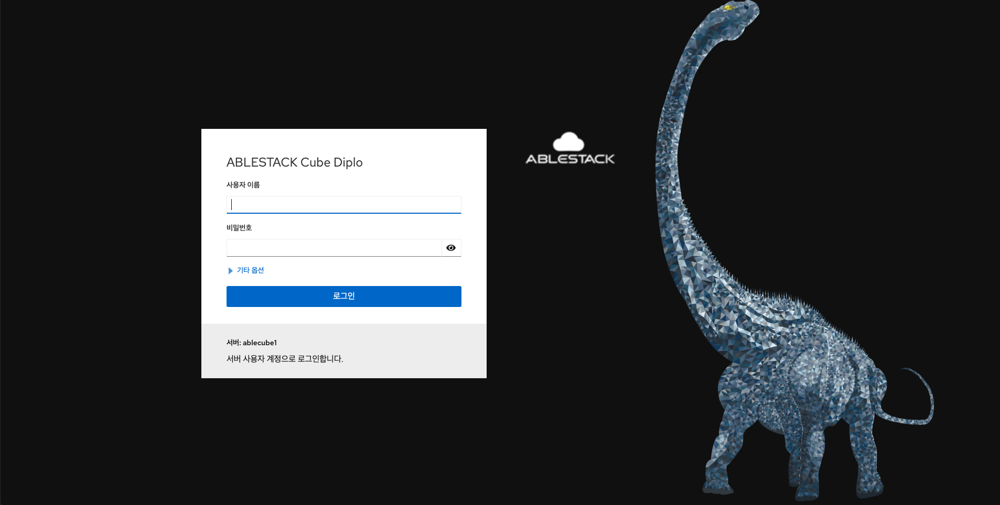

# 사용자 인터페이스
Cube 웹 콘솔은 로컬 시스템과 네트워크 환경에 있는 ABLESTACK 스토리지센터 가상머신, 클라우스센터 가상머신의 배포와 클러스터 관리를 위해 사용하는 웹 기반 인터페이스입니다.

Cube 웹 콘솔을 사용하면 다음과 같은 관리 작업을 수행 할 수 있습니다.

* 서비스 관리
* 사용자 계정 관리
* 시스템 서비스 관리 및 모니터링
* 네트워크 인터페이스 및 방화벽 구성
* 시스템 로그 검토
* 가상 머신 관리
* 진단 보고서 작성
* 커널 덤프 구성 설정
* SELinux 구성
* 소프트웨어 업데이트
* 시스템 구독 관리

Cube 웹 콘솔은 터미널에서와 동일한 시스템 API를 사용하며 터미널에서 수행된 작업은 Cube 웹 콘솔에 즉시 반영됩니다.

네트워크 환경에서 시스템의 로그와 성능을 그래프로 표시하여 모니터링 할 수 있습니다. Cube 웹 콘솔이나 터미널을 통해 직접 설정을 변경할 수 있습니다.


**로그인**

로그인 하려면 : 

1. 웹 콘솔에 접속합니다.
 ```
 https://<Host IP>:9090
 ```


2. 사용자 이름, 암호에 값을 입력합니다.
3. 기타옵션(선택)
    * 연결대상 : (Host IP or Host Name)
4. 로그인을 클릭합니다.
5. 로그인이 완료된 화면을 확인합니다.

