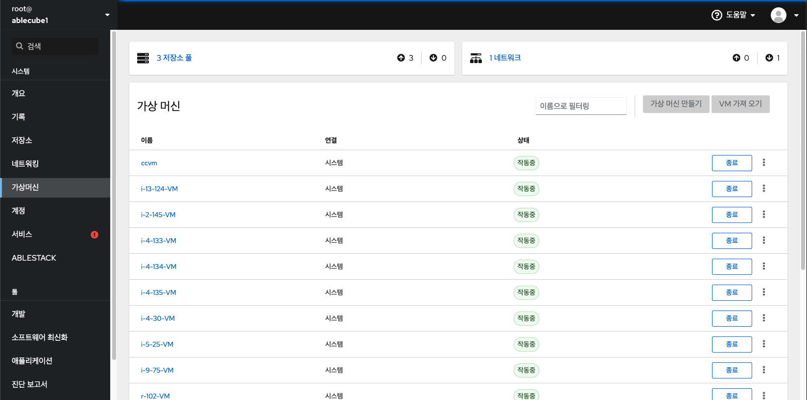
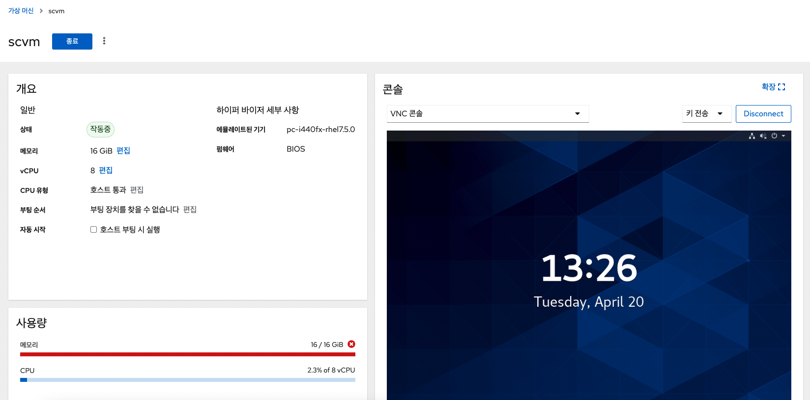

Cube의 웹 콘솔의 가상머신 메뉴를 통해 가상머신(VM)의 상태를 확인할 수 있고, 가상머신에 대한 다양한 작업을 수행할 수 있도록 하며 저장소 풀 이나 네트워크 정보도 확인이 가능합니다.

!!! info 
    관리 권한이 없는 사용자 계정의 경우 가상머신 데이터가 존재하지 않습니다.

## 가상머신 관리 기능

!!! danger
    유지보수 및 호스트 관리 목적을 위한 메뉴로 VM 상세 정보 확인을 제외한 VM 종료, 삭제 등 가상머신에 영향이 있는 작업은 기술지원 엔지니어가 아닌 사용자가 해당 작업을 진행한 경우 자원의 손실 또는 시스템 오류가 발생할 수 있습니다.

Cube의 웹 콘솔을 사용하여 다음 작업을 수행하여 시스템에서 가상머신(VM)을 관리 할 수 있습니다.

* Cube의 웹 콘솔에서 수행 할 수 있는 VM 작업                           
    - VM 상세 정보 확인  
    - 콘솔을 사용하여 VM에 연결                 
    - VM 일시정지, 시작, 종료 및 재시작                                                           
    - VM 네트워크 및 디스크 관리                                                                   

## 가상머신 상세 정보

Cube의 웹 콘솔에서 가상머신의 개요, 사용량, 콘솔, 디스크, 네트워크 등 가상머신에 대한 다양한 정보를 확인할 수 있습니다. 

가상머신 정보를 확인하려면 : 

1. 가상머신 메뉴를 클릭합니다.
2. 특정 가상머신을 선택하여 해당 가상머신에 대한 정보를 확인합니다.

