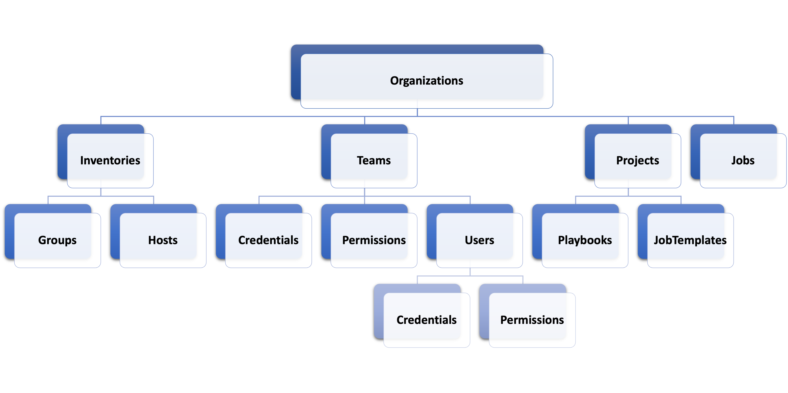
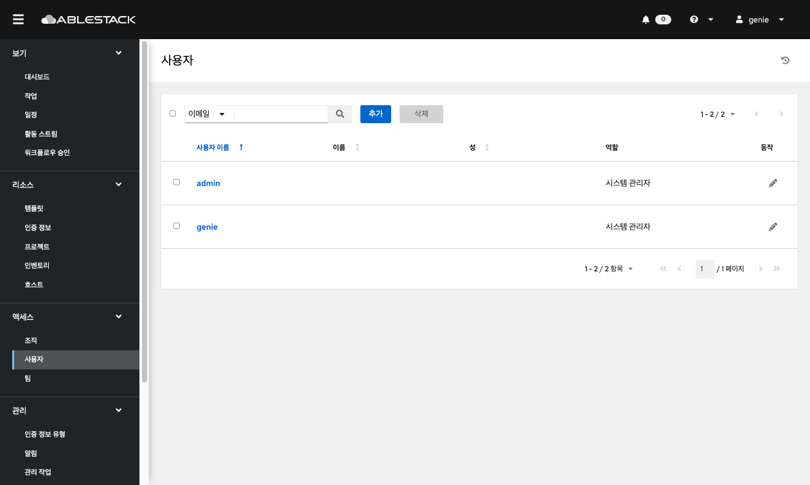
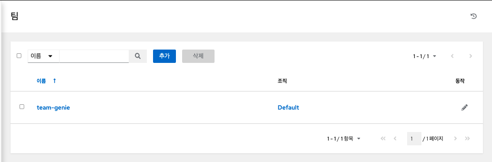

# Genie 액세스
## 조직
조직은 Users, Teams, Projects 및 Inventories 의 논리적 모음이며 자동화 컨트롤러 개체 계층에서 가장 높은 수준입니다.

왼쪽 메뉴에서 **조직** 을 클릭하여 페이지에 액세스합니다. 

생성된 조직 리스트가 표시되며 편집 및 삭제할 수 있습니다.

!!! info
    기본 조직이 자동으로 생성됩니다.

## 사용자
사용자는 관련 권한 및 인증 정보를 사용하여 오토메이션 컨트롤러에 액세스할 수 있는 유저입니다.

왼쪽 메뉴에서 **사용자** 을 클릭하여 페이지에 액세스합니다. 

생성된 사용자 리스트가 표시되며 편집 및 삭제할 수 있습니다.

!!! warning
    보안 강화를 위해 genie 사용자의 **초기 비밀번호** 를 **변경** 하는 것을 권장합니다.

!!! info
    자신의 비밀번호를 수정할 때는 로그아웃했다가 다시 로그인하면 적용됩니다.

### 사용자 생성
1. 사용자 리스트 화면에서 추가 버튼을 클릭합니다.
2. 새 사용자에 대한 적절한 세부 정보를 입력합니다.
세 가지 유형의 사용자를 할당할 수 있습니다.

*	일반 사용자 : 일반 사용자는 해당 사용자에게 적절한 역할 및 권한이 부여된 리소스(예: 인벤토리, 프로젝트 및 작업 템플릿)로 제한된 읽기 및 쓰기 액세스 권한을 가집니다.
*	시스템 감사 자: 감사자는 환경 내의 모든 개체에 대한 읽기 전용 기능을 암시적으로 상속합니다.
*	시스템 관리자 : 시스템 관리자(수퍼유저라고도 함)는 전체 시스템 관리 권한을 가집니다. 전체 설치에 대한 전체 읽기 및 쓰기 권한이 있습니다. 시스템 관리자는 일반적으로 자동화 컨트롤러의 모든 측면을 관리하고 일상 업무에 대한 책임을 다양한 사용자에게 위임합니다. 신중하게 할당하십시오!
3. 완료되면 저장을 클릭 합니다.

## 팀
팀 은 연결된 사용자, 프로젝트, 자격 증명 및 권한이 있는 조직의 하위 부문입니다 . 팀은 역할 기반 액세스 제어 체계를 구현하고 조직 전체에 책임을 위임하는 수단을 제공합니다. 예를 들어 팀의 각 사용자가 아닌 전체 팀에 권한을 부여할 수 있습니다.

조직에 필요한 만큼의 사용자 팀을 만들 수 있습니다. 사용자와 마찬가지로 각 팀에 권한을 할당할 수도 있습니다. 또한 팀은 자격 증명에 대한 소유권을 확장 가능하게 할당하여 여러 인터페이스를 클릭함으로써 동일한 인증 정보를 동일한 사용자에게 할당하는 것을 방지할 수 있습니다.

왼쪽 메뉴에서 **팀** 을 클릭하여 페이지에 액세스합니다. 

생성된 팀 리스트가 표시되며 편집 및 삭제할 수 있습니다.

