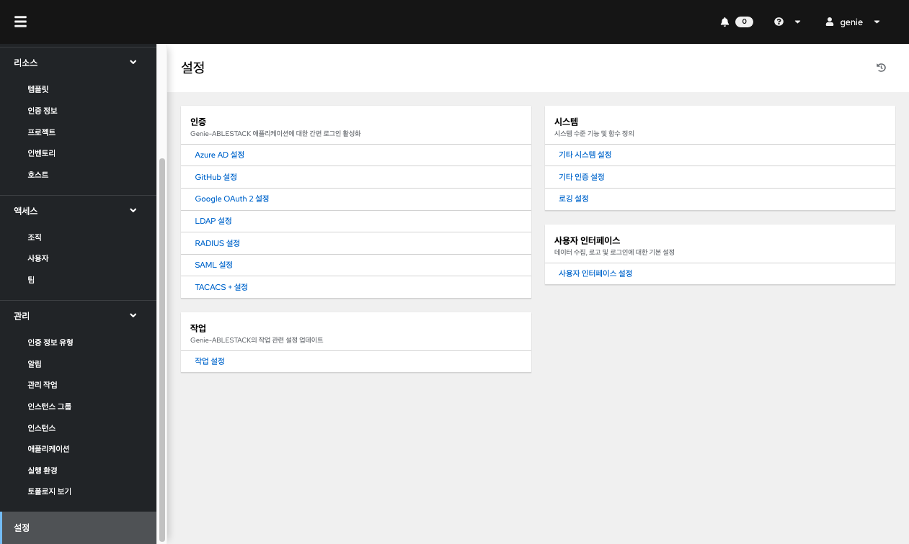
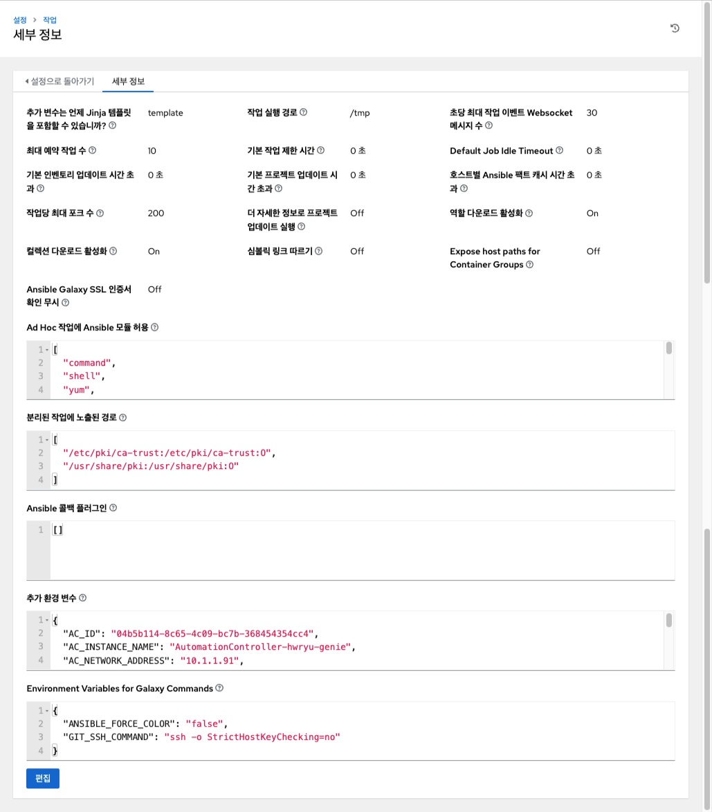

# Genie 설정
다음 설정 화면에서 다양한 컨트롤러 설정을 구성할 수 있습니다.

왼쪽 메뉴에서 **설정** 을 클릭하여 페이지에 액세스합니다.

## 인증
인터페이스를 통해 GitHub, Google, LDAP, RADIUS 및 SAML과 같은 다양한 인증 유형을 통해 간소화된 로그인을 설정할 수 있습니다. 애플리케이션을 만들고 적절한 서비스에 등록한 후 해당 서비스에 대한 권한을 설정할 수 있습니다.

다음 옵션 중에서 선택합니다.

*	Azure AD 설정
*	GitHub 설정
*	Google OAuth2 설정
*	LDAP 설정
*	RADIUS 설정
*	SAML 설정
*	TACACS+ 설정

## 작업
작업 설정에서는 작업과 관련된 기타 세부 사항을 정의할 수 있습니다.

* 추가 환경 변수
    *	플레이북 실행, 인벤토리 업데이트, 프로젝트 업데이트 및 알림 전송을 위해 설정된 추가 환경 변수입니다. ABLESTACK Genie에서 전역적으로 사용되는 변수가 자동으로 추가되어 있습니다.

!!! warning
    추가 환경 변수를 수정할 경우 Mold와의 정보와 일치하는 지 확인이 필요합니다. 잘못된 정보로 변경될 경우 Genie 서비스가 정상작동하지 않을 수 있습니다.

## 시스템
시스템 설정에서는 컨트롤러 호스트의 기본 URL을 정의하고, 경고 구성, 활동 캡처 활성화, 사용자 가시성 제어, 라이선스 파일을 통한 특정 컨트롤러 기능을 활성화하는 기능 그리고 로깅 집계 옵션을 구성할 수 있습니다.

다음 옵션 중에서 선택합니다.

* 기타 시스템 설정 : 컨트롤러 호스트의 기본 URL을 정의하고, 컨트롤러 관리 경고를 활성화하고, 모든 사용자가 조직 관리자에게 표시되도록 허용합니다.
* 활동 스트림 설정 : 활동 스트림을 활성화 또는 비활성화합니다.
* 로깅 설정 : 선택한 유형에 따라 로깅 옵션을 구성합니다.

## 사용자 인터페이스
사용자 인터페이스에서는 컨트롤러 분석 설정을 지정하고 사용자 정의 로고 및 로그인 메시지를 구성할 수 있습니다.

!!! info
    로그인 화면의 로고는 이 기능을 통해 변경할 수 없습니다.
