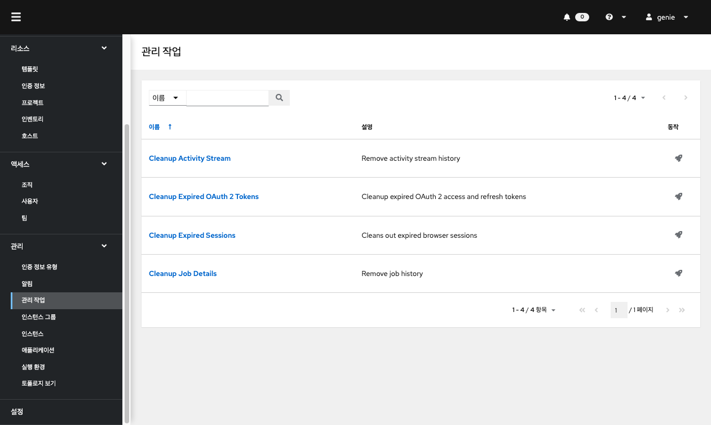

# Genie 관리
## 인증 정보 유형
수퍼유저 액세스 권한이 있는 관리자는 YAML/JSON과 유사한 정의를 사용하여 표준 형식으로 사용자 지정 인증 정보 유형을 정의하여 작업 및 인벤토리 업데이트에 새 인증 정보 유형을 할당할 수 있습니다.

사용자 지정 인증 정보은 인증 정보를 주입하는 다음 방법을 지원합니다.

* 환경 변수
* Ansible 추가 변수
* 파일 기반 템플릿(인증 정보 값을 포함하는 .ini 또는 .conf 파일 생성)

왼쪽 메뉴에서 **인증 정보 유형** 을 클릭하여 페이지에 액세스합니다.

## 알림
알림 기능을 통해 설정된 내용에 따라 알림을 전송하는 기능입니다.

왼쪽 메뉴에서 **알림** 을 클릭하여 페이지에 액세스합니다.

### 알림 유형
* 이메일
* 그라파나
* IRC
* Mattermost
* PagerDuty
* 로켓챗
* Slack
* 트윌리오
* 웹훅
    * 웹훅 페이로드

## 관리 작업
관리 작업은 시스템 추적 정보, 토큰, 작업 기록 및 활동 스트림을 포함하여 컨트롤러에서 오래된 데이터를 정리하는 데 도움이 됩니다. 특정 보존 정책이 있거나 컨트롤러 데이터베이스에서 사용하는 스토리지를 줄여야 하는 경우 사용할 수 있습니다.

왼쪽 메뉴에서 **관리 작업** 을 클릭하여 페이지에 액세스합니다.

다음과 같은 몇 가지 작업 유형을 예약하고 실행할 수 있습니다.

*   활동 스트림 정리 : 지정된 일 수보다 오래된 활동 스트림 기록 제거
*   만료된 OAuth 2 토큰 정리 : 만료된 OAuth 2 액세스 토큰을 제거하고 토큰을 새로 고칩니다.
*   만료된 세션 정리 : 데이터베이스에서 만료된 브라우저 세션을 제거합니다.
*   정리 작업 세부 정보 : 지정된 일 수보다 오래된 작업 기록 제거

## 인스턴스 그룹
인스턴스 그룹은 클러스터 환경에서 인스턴스를 그룹화하는 기능을 제공합니다 . 또한 정책은 인스턴스 그룹이 작동하는 방식과 작업이 실행되는 방식을 지정합니다.

왼쪽 메뉴에서 **인스턴스 그룹** 을 클릭하여 페이지에 액세스합니다. 

## 애플리케이션
외부 응용 프로그램에 대한 토큰 기반 인증을 만들고 구성할 수 있습니다. 이를 통해 ServiceNow 및 Jenkins와 같은 외부 응용 프로그램을 자동화 컨트롤러와 쉽게 통합할 수 있습니다.

왼쪽 메뉴에서 **애플리케이션** 을 클릭하여 페이지에 액세스합니다. 

## 실행 환경
레거시 가상 환경과 달리 실행 환경은 시스템 수준의 종속성과 컬렉션 기반 콘텐츠를 통합할 수 있는 컨테이너 이미지입니다.

왼쪽 메뉴에서 **실행 환경** 을 클릭하여 페이지에 액세스합니다. 

!!! info
    ABLESTACK Genie의 실행 환경 `AWX EE (genie_latest)` 가 기본 실행 환경으로 설정되어 있습니다.

## 토폴로지
토폴로지 뷰어를 사용하면 이미 메시 토폴로지가 배포된 경우 노드 유형, 노드 상태 및 각 노드에 대한 특정 세부 정보를 볼 수 있습니다.

왼쪽 메뉴에서 **토폴로지** 를 클릭합니다. 