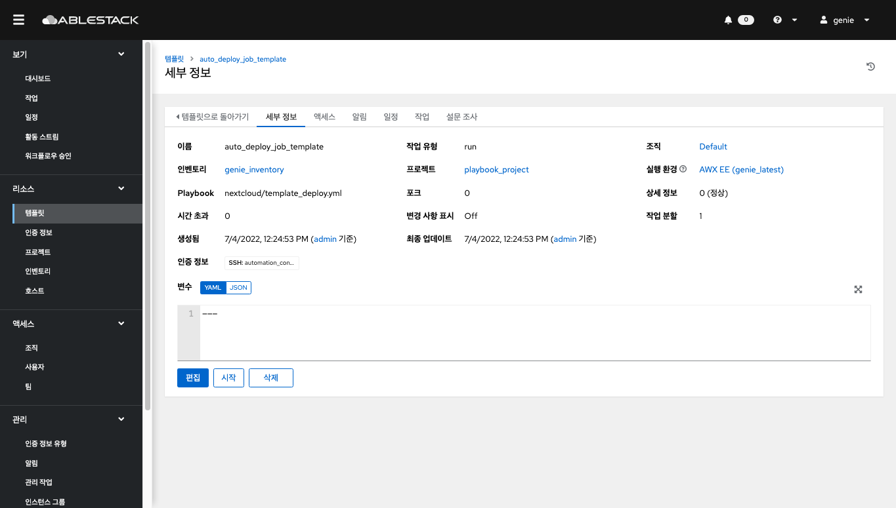
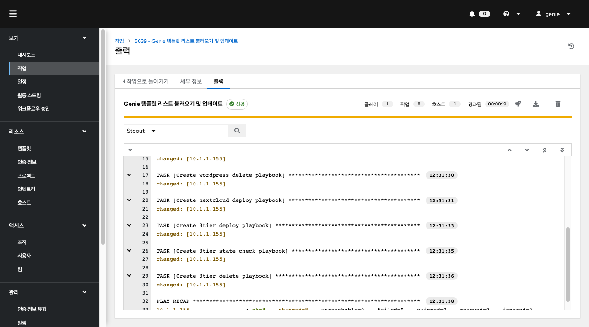
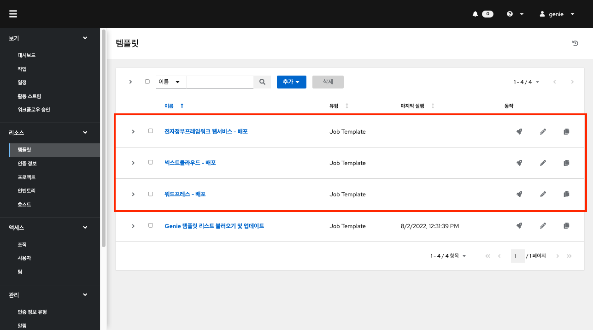
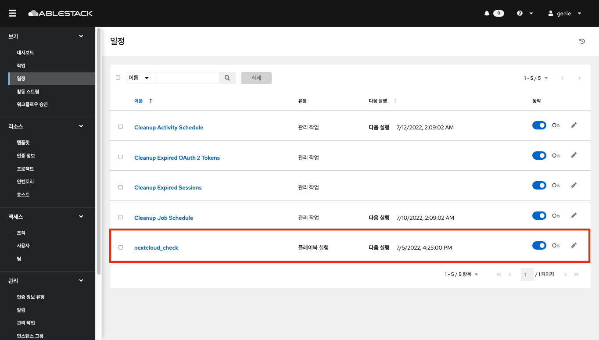
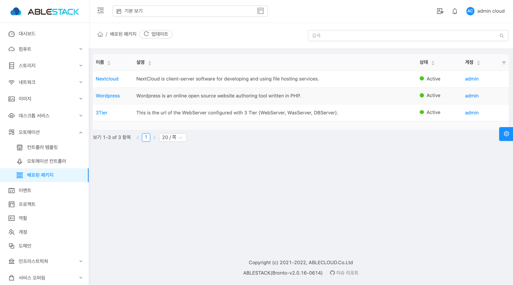
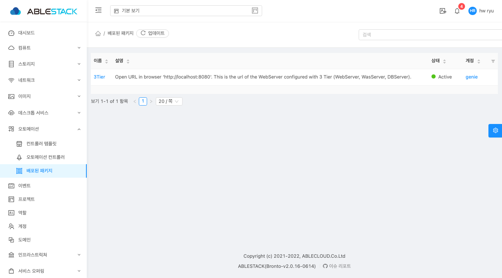

# Genie Quick Start

## Genie 템플릿 자동 생성
템플릿은 플레이북과 이를 실행하는데 필요한 리소스들의 집합입니다. 
템플릿을 생성하려면 인증 정보, 프로젝트, 인벤토리, 호스트를 사전에 생성해야 합니다.

ABLESTACK Genie에서는 이러한 구성요소들과 템플릿을 자동으로 생성할 수 있습니다.

왼쪽 메뉴에서 **템플릿** 을 클릭하여 페이지에 액세스합니다. 


 **"auto_deploy_job_template"** 템플릿을 시작합니다.


템플릿이 시작되면 **작업** 메뉴의 출력화면으로 전환되며 실행 중인 템플릿에 대한 실행 정보 및 로그를 실시간으로 확인할 수 있습니다. 


정상적으로 작업이 종료된 후 추가된 템플릿을 볼 수 있습니다. 또한 각 리소스 메뉴에서 인증 정보, 프로젝트, 인벤토리, 호스트를 확인할 수 있습니다.


### 생성된 Genie 템플릿 실행
ABLESTACK Genie에서 기본 제공되는 템플릿은 애플리케이션 배포를 기준으로  **배포, 체크, 파기** 3가지의 템플릿이 **하나의 세트** 로 구성되어 있습니다.

#### 서비스 배포
배포하고자 하는 서비스의 "배포 템플릿"을 선택하여 실행합니다.
!!! warnning
    배포 작업을 실행하기 전, Mold에 아래와 같은 이름으로 생성된 요소가 **반드시** 준비 되어야 합니다.

    **VM 탬플릿** : 
    ```
    이름: CentOS-8-5-2111-cloudinit
    OS: CentOS-8-5-2111
    기타 조건: cloud-init 설치 필요
    ```

    **VM 오퍼핑** :
    ```
    이름: 2C-4GB-RBD
    오퍼링: CPU(2Core), Memory(4GB)
    ```

#### 배포된 서비스 체크
배포 템플릿 작업이 정상적으로 종료될 경우 체크 템플릿이 자동으로 Genie 대시보드에서 일정(스케줄)으로 등록되어 일정한 간격으로 배포된 패키지 상태 정보를 Mold로 보내는 역할을 합니다.


배포된 패키지의 상태 정보는 Mold -> 오토메이션 메뉴 -> 배포된 패키지에서 확인할 수 있습니다.


!!! info
    배포된 패키지의 상태 체크 조건:

    - Genie 대시보드에서의 스케쥴러가 체크하는 부분
        1. 서비스 별 필수 패키지의 상태를 확인하여 **Active / Inactive** 로 상태를 표시합니다.
    - Mold Mysql Event가 체크하는 부분
        1. Automation Controller의 상태가 Running이 아니면 서비스 그룹 상태를 Disconnected로 변경합니다.
        2. 서비스 상태 확인 시간이 현재 시간과 **5분 이상** 차이가 나면 서비스 그룹 상태를 Disconnected로 변경합니다.
        3. 서비스 그룹 상태가 "Disconnected"인 Packages 세부 정보를 **삭제** 합니다.

#### 배포된 서비스 파기
배포된 서비스를 안전하게 파기하기 위해 "파기 템플릿"을 실행합니다.


실행한 "파기 템플릿"이 정상적으로 종료된 후 Mold에서 결과를 확인합니다.

파기 전 "next cloud" 항목이 존재하지만 파기 후에는 항목이 삭제된 것을 확인할 수 있습니다.



