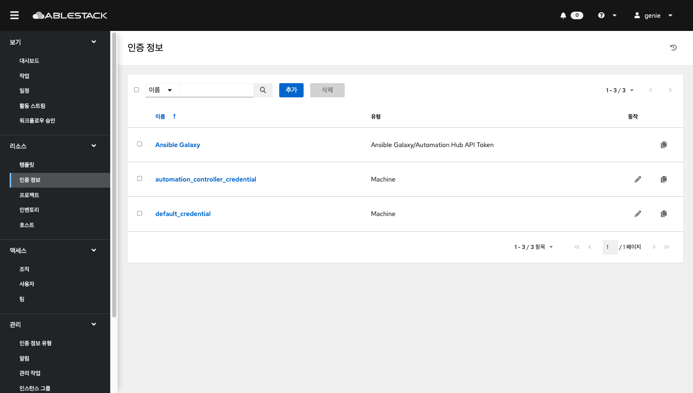
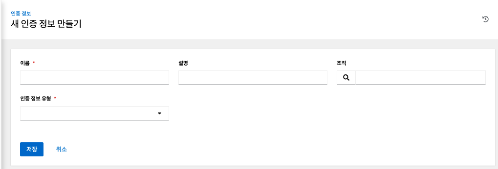
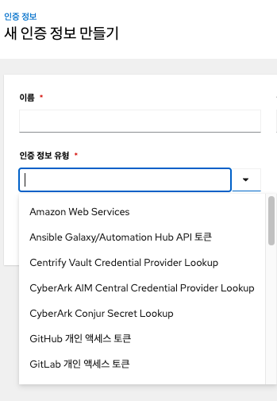
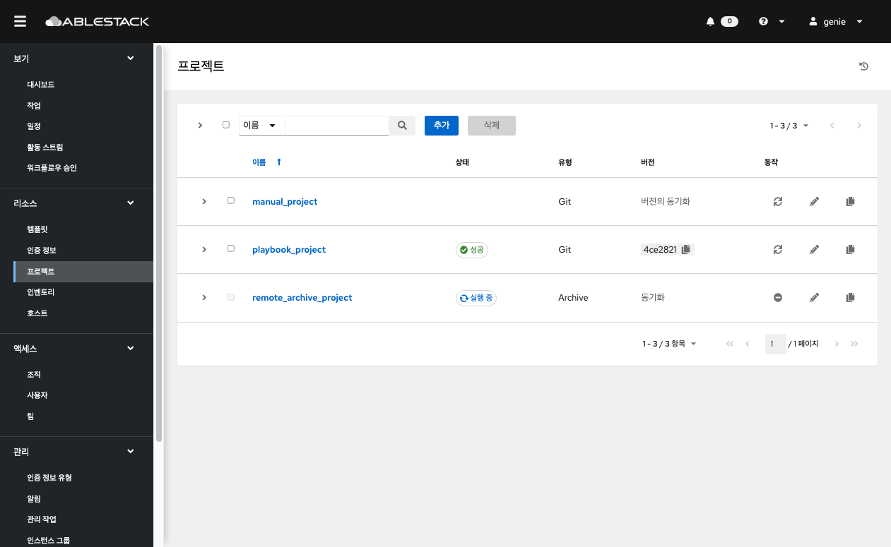
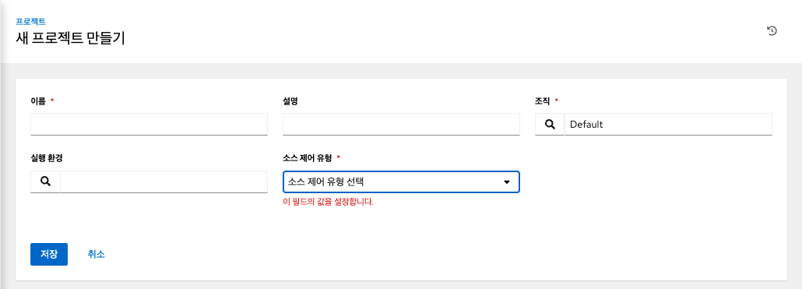
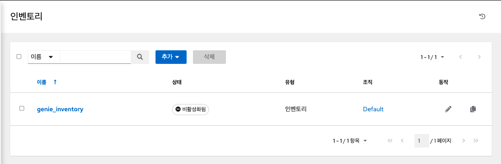
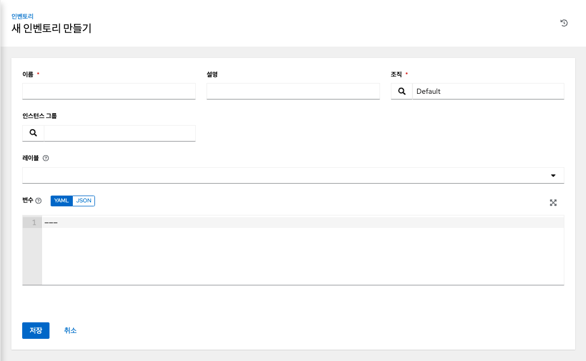
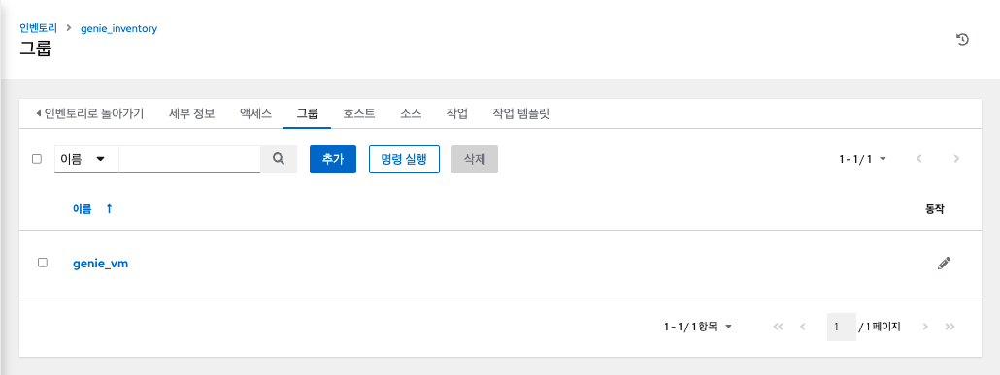

# Genie 리소스
## 템플릿 (작업 템플릿)
템플릿은 플레이북과 이를 실행하는데 필요한 리소스들의 집합입니다.
왼쪽 메뉴에서 **템플릿** 을 클릭하여 페이지에 액세스합니다. 생성된 템플릿 리스트가 표시되며 작업 템플릿을 시작, 편집 및 복사할 수 있습니다.

### 작업 템플릿 생성
새 작업 템플릿을 생성하려면:

1.	추가 버튼을 클릭 한 다음 메뉴 목록에서 작업 템플릿을 선택합니다.
2.	다음 필드에 적절한 세부 정보를 입력합니다.
    *	이름 : 작업 템플릿의 이름을 입력합니다.
    *	설명 : 작업 템플릿의 설명을 입력합니다.
    *	작업 유형 : 작업 유형을 선택합니다.
        *	실행 : 실행 시 플레이북을 실행하여 선택한 호스트에서 Ansible 작업을 실행합니다.
        *	확인 : 플레이북의 "테스트 실행"을 수행하고 실제로 변경하지 않고 변경 사항을 보고합니다. 확인 모드를 지원하지 않는 작업은 건너뛰고 잠재적인 변경 사항을 보고하지 않습니다.
    *	인벤토리 : 작업 템플릿과 함께 사용할 인벤토리를 선택합니다.
	    *	시작 시 프롬프트 : 이 옵션을 선택하면 기본값이 제공되더라도 시작 시 이 작업 템플릿을 실행할 인벤토리를 선택하라는 메시지가 표시됩니다.
	*	프로젝트 : 작업 템플릿과 함께 사용할 프로젝트를 선택합니다.
	*	플레이북 : 작업 템플릿으로 시작할 플레이북을 선택합니다. 유효하지 않은 파일 이름을 입력하면 템플릿에 오류가 표시되거나 작업이 실패합니다.
	*	자격 증명 : 작업 템플릿에 사용할 자격 증명을 선택합니다.
	*	포크 : 플레이북을 실행하는 동안 사용할 병렬 또는 동시 프로세스의 수입니다.
	*	제한 : 플레이북에 의해 관리되거나 영향을 받는 호스트 목록을 추가로 제한하는 호스트 패턴입니다.
	*	Verbosity : 플레이북이 실행될 때 Ansible이 생성하는 출력 레벨을 제어합니다. Normal에서 다양한 Verbose 또는 Debug 설정까지 자세한 정보 표시를 선택합니다.
    !!! warning
        4 (연결 디버그)를 사용하면 자동화 컨트롤러가 차단되어 작업이 완료되었다는 보고가 지연될 수 있으며 완료된 경우에도 브라우저 탭이 잠길 수 있습니다. 

    *	옵션 : 필요한 경우 이 템플릿을 시작하기 위한 옵션을 지정합니다.
        *	권한 상승 : 체크하면 이 플레이북을 관리자로 실행할 수 있습니다. 이는 명령 에 `--become`옵션을 전달하는 것과 같습니다.ansible-playbook
        *	콜백 프로비저닝 : 선택하면 호스트가 REST API를 통해 자동화 컨트롤러로 콜백하고 이 작업 템플릿에서 작업 시작을 호출할 수 있습니다. 추가 정보는 콜백 프로비저닝을 참조하십시오 .
        *	웹훅 활성화 : 작업 템플릿을 시작하는 데 사용되는 사전 정의된 SCM 시스템 웹 서비스와 인터페이스하는 기능을 켭니다. 현재 지원되는 SCM 시스템은 GitHub 및 GitLab입니다.
	*	동시 작업 : 선택하면 대기열의 작업이 서로 종속되지 않는 경우 동시에 실행되도록 허용합니다.
	*	Enable Fact Storage : 이 옵션을 선택하면 자동화 컨트롤러가 실행 중인 작업과 관련된 인벤토리의 모든 호스트에 대해 수집된 Fact를 저장합니다.
	*	추가 변수 :
        *	추가 명령줄 변수를 플레이북에 전달합니다. "-extra-vars" 명령과 같습니다.
        *	YAML 또는 JSON을 사용하여 키/값 쌍을 제공합니다. 이러한 변수는 최대 우선 순위 값을 가지며 다른 곳에서 지정된 다른 변수보다 우선합니다. 예시는 다음과 같습니다.

        !!! example
            git_branch: production
            
            release_version: 1.5

    !!! info
        추가 변수는 설문 조사(Servey)를 추가하거나 시작 시 프롬프트를 활성화하여 추가할 수 있습니다.

3. 작업 템플릿의 세부 정보 구성을 완료한 후 저장을 클릭 합니다.

## 인증 정보
왼쪽 메뉴에서 **인증 정보** 을 클릭하여 페이지에 액세스합니다. 자격 증명은 인벤토리 목록에 저장된 호스트에 대한 접근 권한을 얻거나 프로젝트 플레이북을 가져올 때 사용됩니다.

### 새 인증 정보 추가

1. 자격 증명 리스트 화면에서 추가 버튼을 클릭합니다.
2. 이름 필드에 새 자격 증명의 이름을 입력합니다.
3. 선택적으로 설명을 입력하고 자격 증명이 연결된 조직의 이름을 입력하거나 선택합니다.
4. 생성할 인증 정보 유형을 입력하거나 선택합니다.
    
    *   호스트에 대한 ID/Password 또는 SSH Key 인증에 대한 인증 정보를 추가하려면 머신(Machine) 타입을 선택합니다.
5. 선택한 인증 정보 유형에 따라 적절한 세부 정보를 입력합니다.
6. 작업완료되면 저장을 클릭합니다.

!!! info
    ABLESTACK Genie에서 기본적으로 사용되는 `Automation Controller Credential`은 오토메이션 컨트롤러의 SSH Key로 생성되어 배포된 VM에 액세스하기 위한 인증 정보입니다.

## 프로젝트
프로젝트는 Ansible 플레이북의 논리적 모음입니다.
플레이북과 플레이북 디렉토리를 Git과 같은 자동화 컨트롤러에서 지원하는 소스 코드 관리(SCM)이나 Remote Archive 방식으로 가져와 관리할 수 있습니다.
왼쪽 메뉴에서 **프로젝트** 를 클릭합니다. 설정된 모든 예약된 작업이 표시됩니다.

나열된 프로젝트에 대해 각 프로젝트 옆에 있는 동작 아이콘을 사용하여 새로고침하거나, 프로젝트를 편집하거나, 프로젝트 속성을 복사할 수 있습니다. 큰 프로젝트(약 10GB)가 있는 경우 디스크 공간 `/tmp`이 문제일 수 있습니다.

### 프로젝트 추가
새 프로젝트를 생성하려면:

1. 추가 버튼을 클릭하면 프로젝트 생성 창이 시작됩니다.

2. 다음 필드에 적절한 세부 정보를 입력합니다.
    *	소스 제어 자격 증명 유형 - 드롭다운 메뉴 목록에서 이 프로젝트와 연결된 SCM 유형을 선택합니다. 다음 섹션의 옵션은 선택한 유형에 따라 사용할 수 있습니다.
3. 업데이트 옵션 에서 선택적으로 시작 동작을 선택합니다. (해당되는 경우)
    *	정리 - 업데이트를 수행하기 전에 모든 로컬 수정 사항을 제거합니다.
    *	삭제 - 업데이트를 수행하기 전에 로컬 레포지토리 전체를 삭제합니다. 레포지토리의 크기에 따라 업데이트를 완료하는 데 필요한 시간이 크게 늘어날 수 있습니다.
    *	시작 시 버전 업데이트 - 프로젝트의 버전을 원격 소스 제어의 현재 버전으로 업데이트합니다.
    *	분기 덮어쓰기 허용 - 이 프로젝트를 사용하는 작업 템플릿이 프로젝트의 분기 또는 개정이 아닌 지정된 SCM 분기 또는 개정으로 시작하도록 허용합니다.
4. 저장을 클릭하여 프로젝트를 저장합니다.
!!! warnnaing
    프로젝트 옵션으로 **시작 시 버전 업데이트** 를 활성화하거나 **동기화 프로젝트** 버튼을 눌러 업데이트를 해야 변경된 플레이북 내용이 반영됩니다.

## 인벤토리
인벤토리는 Ansible 인벤토리 파일과 마찬가지로 작업 템플릿이 실행될 수 있는 호스트의 모음입니다. 인벤토리는 그룹으로 나뉘며 이러한 그룹에는 실제 호스트가 포함됩니다.
왼쪽 메뉴에서 **인벤토리** 를 클릭합니다. 

인벤토리 화면에는 현재 사용 가능한 인벤토리 목록이 표시됩니다. 인벤토리 목록은 이름 및 검색된 유형, 조직, 설명, 인벤토리의 소유자 및 수정자 또는 필요에 따라 추가 기준별로 정렬될 수 있습니다.

인벤토리 세부 정보 목록에는 다음이 포함됩니다.

*   이름 : 인벤토리 이름입니다. 인벤토리 이름을 클릭하면 인벤토리의 그룹과 호스트를 보여주는 선택한 인벤토리의 속성 화면으로 이동합니다.
*	상태
상태는 다음과 같습니다.
*   성공 : 인벤토리 소스 동기화가 성공적으로 완료된 경우
*	비활성화 됨: 인벤토리에 인벤토리 소스가 추가되지 않음
*	오류 : 인벤토리 소스 동기화가 오류와 함께 완료되었을 때

### 인벤토리 추가
새 인벤토리를 생성하려면:

1. 추가 버튼을 클릭하고 생성할 인벤토리 유형을 선택합니다.

2. 다음 필드에 적절한 세부 정보를 입력합니다.
3. 완료되면 저장을 클릭합니다.

#### 그룹 추가
인벤토리는 호스트 및 기타 그룹과 호스트를 포함할 수 있는 그룹으로 나뉩니다. 인벤토리를 생성한 후 그룹을 생성합니다.

인벤토리에 대한 새 그룹을 생성하려면:

1. 인벤토리를 선택한 후 그룹탭으로 이동하여 추가 버튼을 클릭합니다.

2. 다음 필드에 적절한 세부 정보를 입력합니다.
3. 완료되면 저장을 클릭합니다.

#### 호스트 추가
그룹을 생성한 후 호스트 탭으로 이동하여 호스트를 추가합니다.

1.	호스트 탭을 클릭합니다.
2.	추가 버튼을 클릭하고 구성에 이미 존재하는 호스트를 추가할지 아니면 새 호스트를 생성할지 선택합니다.
3.	새 호스트를 생성하는 경우버튼을 선택하여 작업을 실행하는 동안 이 호스트를 포함할지 여부를 지정합니다.
4.	필수 및 선택 필드에 적절한 세부 정보를 입력합니다.
    *	호스트 이름 : 필수
    *	설명 : 적절하게 임의의 설명을 입력합니다(선택 사항).
    *	변수 : 이 그룹의 모든 호스트에 적용할 정의와 값을 입력합니다. JSON 또는 YAML 구문을 사용하여 변수를 입력합니다. 라디오 버튼을 사용하여 둘 사이를 전환합니다.
5.	완료되면 저장을 클릭 합니다.
호스트 생성 창이 닫히고 새로 생성된 호스트가 생성된 그룹과 연결된 호스트 목록의 항목으로 표시됩니다.

기존 호스트를 추가하도록 선택한 경우 사용 가능한 호스트가 별도의 선택 창에 나타납니다.

선택한 후 저장을 클릭 합니다.
