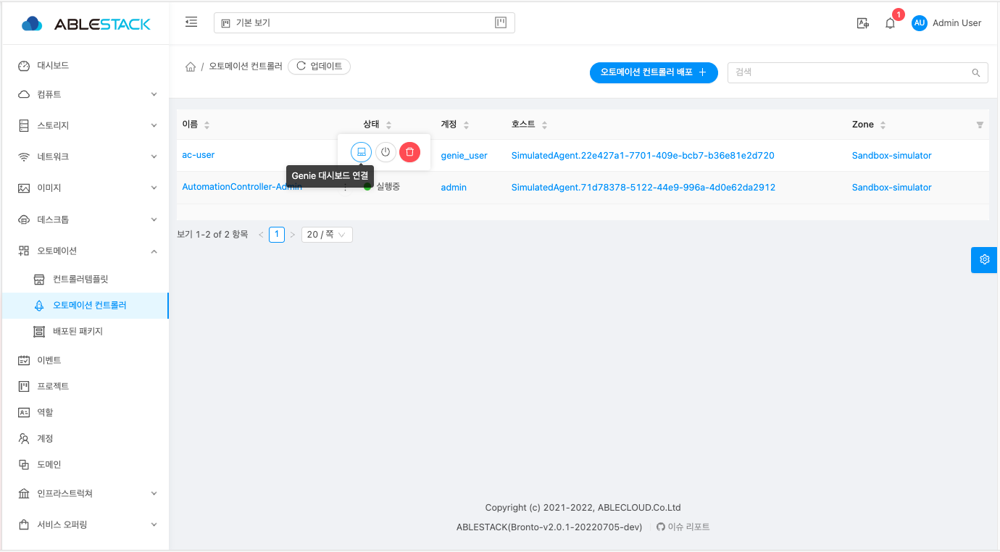

# Genie 
Genie는 개발형 하이브리드 클라우드 배포 자동화 플랫폼으로 관리자와 최종 사용자가 모두 사용할 수 있는 웹 기반 UI를 제공합니다. 관리자 및 최종 사용자는 Genie 대시보드에 로그인하여 미리 생성된 플레이북을 기반으로 가상머신, 컨테이너, 네트워크, 애플리케이션 등을 전사적으로 배포할 수 있습니다.

관리자 및 사용자는 URL 주소 `http://[오토메이션 컨트롤러 PUBLIC IP]:80` 를 입력하거나
생성된 오토메이션 컨트롤러의 해당 버튼을 눌러 로그인 페이지로 이동이 가능합니다.

## Genie 로그인

Genie 사용자는 해당 페이지에 **사용자 아이디** 및 **비밀번호** 를 입력하여 로그인을 할 수 있습니다.

!!! info
    Genie 대시보드의 **사용자 아이디** 및 **초기 비밀번호** 는 ID:genie / Password:password 입니다. Genie 대시보드 접속에 대한 자세한 정보는 오토메이션 컨트롤러 **액세스** 탭에서 확인할 수 있습니다.

!!! warning
    보안 강화를 위해 **초기 비밀번호** 를 **변경** 하는 것을 권장합니다.
    초기 비밀번호가 변경된 후에는 해당 비밀번호를 다시 사용할 수 없습니다.

로그인을 완료합니다.
