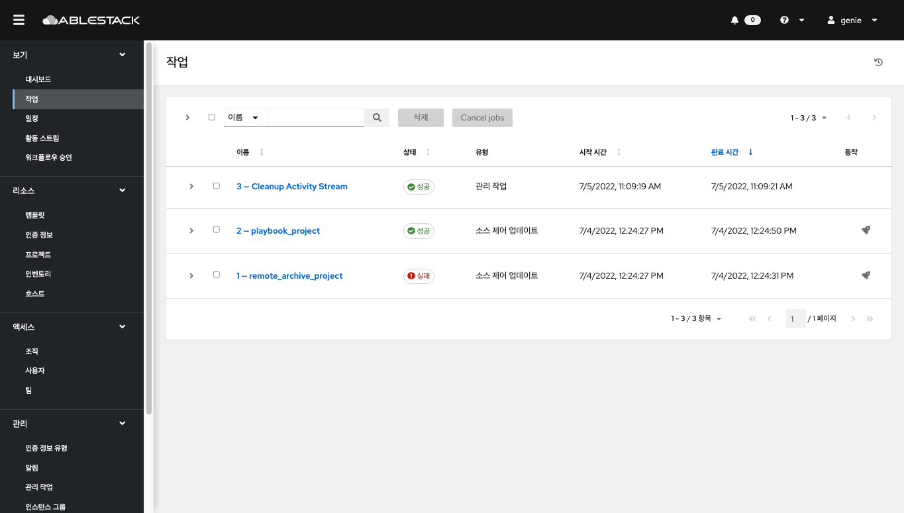
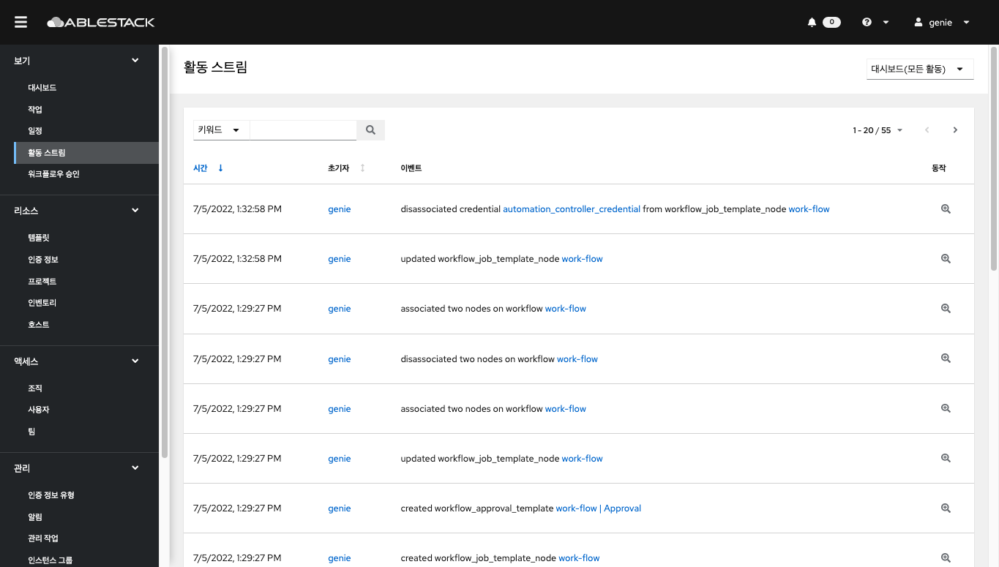

# Genie View
## 대시보드
Genie 의 각종 정보를 확인 할 수 있는 대시보드 입니다.
대시보드 상단에는 호스트, 인벤토리 및 프로젝트의 요약을 볼 수 있으며 하단에서는 작업 실행에 대한 시계열 그래프, 최근 작업에 대한 요약, 최근 사용한 템플릿에 대한 정보를 확인할 수 있습니다.

## 작업
왼쪽 메뉴에서 **작업** 을 클릭합니다. 작업 메뉴는 프로젝트, 템플릿, 관리 작업, SCM 업데이트, 플레이북 실행 등을 포함하여 Genie에서 실행된 모든 작업을 보여줍니다.

## 일정
왼쪽 메뉴에서 **일정** 을 클릭합니다. 설정된 모든 예약된 작업이 표시됩니다

## 활동 스트림
왼쪽 메뉴에서 **활동 스트림** 을 클릭합니다. 

활동 스트림은 특정 개체에 대한 모든 변경 사항을 보여줍니다. 각 변경 사항에 대해 활동 스트림은 이벤트 시간, 이벤트를 실행한 사용자 및 작업을 표시합니다. 표시되는 정보는 이벤트 유형에 따라 다릅니다. 검사(돋보기) 버튼을 클릭하면 변경 사항에 대한 이벤트 로그가 표시됩니다.