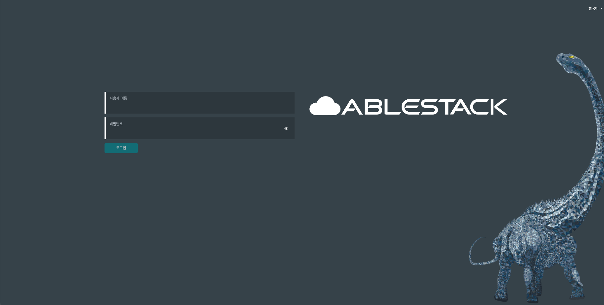

# GLUE 사용자 인터페이스
GLUE는 웹 기반 분산 스토리지 관리/모니터링 서비스입니다.

본 서비스는 CherryPy framework와 REST API를 백엔드로 사용하며, Angular/TypeScript를 사용하여 WebUI를 제작하였습니다.

접속하는 URL은 다음과 같습니다.

 ``` 
  https://<SCVM ip>:8443 
 ```
!!! tip
클러스터링된 모든 scvm의 ip를 통하여 접속할 수 있으며 /etc/hosts 파일을 참조하여 IP를 알 수 있습니다.




### 제공하는 기능

GLUE는 다음과 같은 기능을 제공합니다.

-   **다중 사용자 및 역할 관리**: GLUE는 여러 사용자에게 각기 다른 권한(역할)을 제공합니다.
    사용자 계정과 역할은 WebUI를 통해 관리 됩니다. GLUE는 암호 보안을 위해 여러가지 방식을 제공합니다. 암호 복잡성규칙, 초기 로그인후 암호변경, 암호의 기간제한등
    자세한 내용은 [사용자 및 역할 관리](account&role-guide.md#_1) 메뉴얼을 참조하세요.
-   **SSL/TLS 지원**: GLUE와 브라우저간의 모든 HTTP통신은 SSL을 통해 암호화됩니다. 기본적으로 자체 서명 인증서를 사용하지만, CA를 통해 서명된 인증서를
    불러올 수 있습니다. 자세한 내용은 [SSL-TLS지원](config-guide.md#ssltls)을 참조하세요
-   **감사**: GLUE는 모든 `PUT`, `POST`, `DELETE` API 요청에 대해 감사기록을 남길 수 있습니다.
    설정방법은 [`API 요청 감사`](api-request-audit-guide.md#api) 문서를 참고하세요.
-   **다국어화 (I18N)**: 실행중 GLUE의 언어를 변경할 수 있습니다.

GLUE는 다음과 같은 관리/모니터링 기능을 제공합니다.

-   **전체 클러스터의 상태**: 성능과 용량, 그리고 클러스터의 작동 상태에 대해 표시합니다.
-   **Grafana 대시보드**: `mgr-prometheus` 모듈을 사용해 외부 어플리케이션/웹페이지에 GLUE의 상태를 포함시킬 수 있습니다.
    자세한 내용은 [`GLUE-grafana`](under-construction.md)을 참고하세요.
-   **클러스터 로그**: 클러스터의 최근 활동과 감사이력을 기록합니다. 로그는 중요도, 날짜, 키워드로 필터링이 가능합니다.
-   **호스트**: 클러스터에 소속된 호스트와 디스크드라이브, 작동중인 서비스에 대한 정보를 표시합니다.
-   **성능통계**: 동작중인 각 서비스별 상세한 통계를 보여줍니다.
-   **모니터**: 모든 스토리지 모니터와 열린 세션, quorum(정족수) 상태를 보여줍니다.
-   **모니터링**: Prometheus를 사용하여 경고를 생성, 수정, 삭제등을 진행하고 발생한 경고를 표시합니다.
-   **설정 편집기**: 모든 사용가능한 설정과 그것에 대한 설명, 타입, 기본값 그리고 현재 설정된 값을 보여주고, 수정합니다.
-   **Pools**: 모든 스토리지풀의 목록과 상세내용을 보여줍니다. (배치그룹, 복제 크기, CRUSH 규칙, 할당량등)
-   **OSDs**: OSD의 목록과 상태, 사용통계와 상세 정보들을 보여줍니다. 상세정보에는 속성, 메타데이터, 성능통계, 읽기/쓰기 사용량 그래프등이 있습니다.
    또한, OSD를 up/down/out 시키거나 삭제, 가중치 변경, 정합성 검사등의 설정 작업도 가능합니다.
    OSD에 연결된 드라이브의 목록을 보거나, OSD의 클래스를 지정하고, 정렬해서 볼 수 있으며, 새로운 드라이브와 호스트를 배포할 수도 있습니다.
-   **장치 관리**: orchestrator에 알려진 모든 호스트와, 해당 호스트에 연결된 모든 드라이브를 표시합니다.
    각 드라이브의 SMART 데이터등의 성능상태를 확인하고, 디스크의 LED를 제어해 물리적인 드라이브를 찾을 수도 있습니다.,
-   **iSCSI**: TCMU runner 서비스가 동작하는 모든 호스트를 보여줍니다. 모든 iSCSI이미지와 그것의 성능(r/w ops, r/w bps)을 표시합니다.
    iSCSCI target을 `ceph-iscsi`를 통해 생성, 수정, 삭제합니다. iSCSI gateway의 상태와 활성화된 initiator의 정보를 표시합니다.
    이 기능에 대한 설정은 [`GLUE-iscsi-management`](under-construction.md)를 참고하세요.
-   **RBD**: 모든 RBD image의 목록과 속성(크기, 기능)을 보여주고, 생성, 복사, 수정, 삭제 기능과 RBD namespace기능을 제공합니다.
    전역, pool별, image별 I/O 또는 대역폭의 제한을 설정할 수 있습니다.
    선택된 이미지의 스냅샷을 생성, 삭제, 수정으로부터의 보호/해제, 스냅샷으로 복원기능을 제공하며
    스냅샷을 복제, 스냅샷으로부터 자식 이미지 생성, 스냅샷을 이미지에 적용(flatten)기능을 제공합니다.
-   **RBD mirroring**: 원격 GLUE 서버에 RBD mirroring 기능을 설정하고 구성합니다.
    활성화된 daemon의 상태와 pool, RBD image의 동기화 상태등을 보여줍니다.
-   **CephFS**: 구성된 CephFS와 사용중인 client, 연결된 pool, 사용자 통계를 보여줍니다.
    client의 연결을 해제하거나, 할당량지정, 스냅샷 생성, directory 구조 탐색등의 기능을 제공합니다.
-   **Object Gateway**: 활성화된 object gateway와 성능통계를 보여줍니다.
    object gateway의 사용자를 조회/추가/편집/삭제를 할 수 있으며 사용자의 할당량, bucket등의 상세내용도 조회 가능합니다.
    자세한 구성은 [`GLUE-enabling-object-gateway`](under-construction.md)을 참조하세요.
-   **NFS**: CephFS 파일시스템과 RGW S3 bucket을 사용하는 NFS-Ganesha 서비스를 설정할 수 있습니다. 자세한 내용은 [`GLUE-nfs-ganesha-management`](under-construction.md)을 참고해 주세요
-   **Ceph Manager Modules**: Ceph Manager modules을 활성화 및 비활성화, 그리고 모듈별 설정을 지정할 수 있습니다. GLUE dashboard의 설정도 이곳에서 수정할 수 있습니다.

### GLUE Landing Page 소개


전반적인 cluster의 상태, 성능, 용량을 보여줍니다. 실시간으로 정보를 보여주고 GLUE의 다른 페이지에 쉽게 접근이 가능합니다.

#### Status

-   **Cluster Status**: 전체 클러스터 상태에 대해 표시합니다. 만약 에러가 발생한다면, 간단한 에러에 대한 설명과 함께 log 페이지에 대한 링크를 제공합니다.
-   **Hosts**: 클러스터에 연결된 전체 호스트의 숫자를 보여주고, 상세정보가 있는 페이지로의 링크를 제공합니다.
-   **Monitors**: 모든 스토리지 모니터와 열린 세션, quorum(정족수) 상태를 보여주고, 상세정보가 있는 페이지로의 링크를 제공합니다.
-   **OSDs**: 모든 OSD(object storage daemon)의 숫자와 현재 동작중(up), 서비스중(in) 그리고 클러스터에 속하지 않은(out) 숫자를 보여줍니다. 상세정보가 있는 OSDs 페이지로의 링크를 제공합니다.
-   **Managers**: 모든 활성화되거나 대기중인 Manager 데몬의 숫자를 보여줍니다.
-   **Object Gateway**: 활성화된 object gateway(RGW)를 보여주고, 상세정보가 있는 페이지로의 링크를 제공합니다.
-   **Metadata Servers**: 모든 활성화되거나 대기중인 CephFS의 서비스 데몬을 보여줍니다.
-   **iSCSI Gateways**: iSCSI gateway의 전체 서비스 갯수와 활성화(up)/비활성화(down) 된 서비스의 갯수를 보여주고 상세정보가 있는 페이지로의 링크를 제공합니다.

#### Capacity

-   **Raw Capacity**: 스토리지노드(OSD)에서 제공하는 전체 물리적 용량을 표시합니다.
-   **Objects**: RADOS object의 전체 갯수와 상태(정상, 잘못놓여짐, 복제수미달, 분실)을 백분율로 보여줍니다.
-   **PG Status**: 전제 배치그룹의 숫자와 상태(정상, 작업중, 경고, 알수없음)을 백분율로 보여줍니다.
-   **Pools**: 스토리지 풀의 갯수를 보여주고 상세 정보가 있는 페이지로의 링크를 제공합니다.
-   **PGs per OSD**: 각 스토리지노드(OSD)에 등록된 배치그룹(PG)의 평균 갯수를 보여줍니다.

#### Performance

-   **Client READ/Write**: client의 초당 읽기/쓰기 작업의 양을 보여줍니다.
-   **Client Throughput**: client의 초당 읽기/쓰기 전송량을 보여줍니다.
-   **Recovery throughput**: 클러스터의 복원/복구 또는 벨런싱 작업의 전송량을 보여줍니다.
-   **Scrubbing**: 일반/고급 정합성 검사 상태를 보여줍니다.

### 지원하는 브라우저


GLUE는 다음과 같은 주요 브라우저에서 테스트 및 개발되었습니다.

|브라우저|버전|
|:---|:---|
|[Chrome](https://www.google.com/chrome/) 및 [Chromium](https://www.chromium.org/) 기반 브라우저        |최근 2개의 주요버전|
|[Firefox](https://www.mozilla.org/firefox/)                                                        |최근 2개의 주요버전|
|[Firefox ESR](https://www.mozilla.org/firefox/enterprise/)                                         |마지막 주요버전|


GLUE는 오래된 버전의 브라우저에서 동작하지 않을 수 있습니다. 또한 오래된 버전의 브라우저에서의 작동을 보장할 수 없기때문에 항상 최신의 브라우저를 사용하는것을 권장합니다.
 
