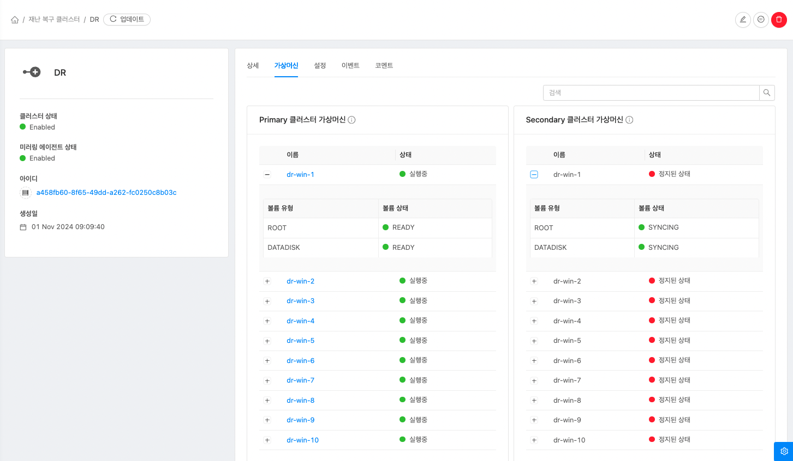
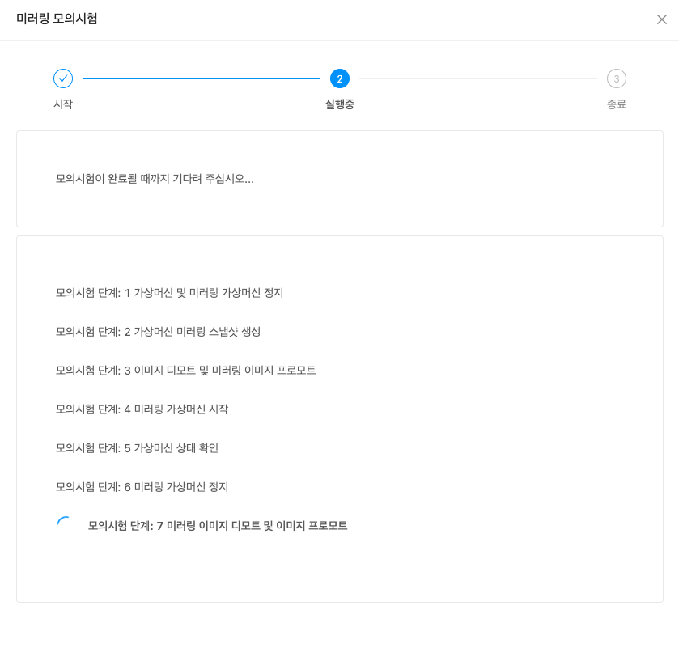

# 재난 복구(DR) 관리

## 장애 및 재해 관리

ABLESTACK의 가상 인프라 및 애플리케이션에서 발생할 수 있는 다양한 장애 및 재해 상황을 대응하기 위한 복구 관리 기능으로 모든 클러스터가 액티브 상태로 운영되면서 상호간 DR 구성을 지원하여 높은 가용성을 제공합니다.

UI를 통해 가상머신 단위로 DR 설정을 지원하여 효율적인 DR 관리가 가능하며, 가상머신 단위로 상태 모니터링을 지원하고, Mission Critical 애플리케이션이 무중단으로 운영되는 것을 보장하기 위한 서버 이중화를 지원합니다.

## DR 클러스터

관리 서버 UI의 재난 복구 클러스터 메뉴를 사용하여 DR 관리가 가능합니다.

이 메뉴는 Mold가 설치된 경우 기본적으로 표시되지 않으며, Mold > 구성 > 글로벌 설정 에서 cloud.dr.service.enabled 항목을 true 로 값을 변경 하고 ABLESTACK Mold 를 재시작 하면 재난 복구 클러스터 메뉴가 활성화 됩니다.

또한, 아래 절차에서 재난 복구를 구성할 클러스터를 Primary 클러스터, 연결할 클러스터를 Secondary 클러스터 용어로 사용합니다.

### DR 클러스터 추가
DR 클러스터를 추가하려면:

1. 인프라스트럭쳐 > 재난 복구 클러스터 메뉴로 이동하여 **재난복구 클러스터 추가** 버튼을 클릭합니다.
2. 재난 복구 클러스터 추가 모달에서 다음 필드에 적절한 세부 정보를 입력합니다.

    *	MOLD URL - Secondary 클러스터 Mold 의 URL로 포트까지 입력합니다.
    *   API 키, 비밀 키 - Secondary 클러스터 Mold 의 관리자 계정의 API 키, 비밀 키를 입력합니다.
    *   Glue URL - Secondary 클러스터 Glue 의 IP 를 입력합니다.
    *   Glue 개인키 - Secondary 클러스터 Glue 의 /root/.ssh/id_rsa 경로의 개인 키 파일을 입력합니다.
3. **연결 테스트** 버튼을 클릭하여 Secondary 클러스터의 Mold 와 Glue 상태를 확인하고, 정상인 경우 확인 버튼이 활성화되며 **확인** 버튼을 클릭하여 재난 복구 클러스터를 추가합니다.
!!! check
    연결 테스트에 실패한 경우 Mold 의 API 요청 상태 및 Glue 의 Health 상태를 확인해야 합니다.

### DR 클러스터 편집
DR 클러스터를 편집하려면:

1. 인프라스트럭쳐 > 재난 복구 클러스터 메뉴로 이동하여 더보기 툴팁 액션에 **재난복구 클러스터 편집** 버튼을 클릭합니다.
    * Primary 클러스터의 경우 설명, Secondary 클러스터 URL, Secondary Glue IP 항목을 변경할 수 있습니다.
    * Secondary 클러스터의 경우 설명, Primary 클러스터 URL 항목을 변경할 수 있습니다.

### DR 클러스터 설정 변경
DR 클러스터 설정을 변경하려면:

1. 인프라스트럭쳐 > 재난 복구 클러스터 메뉴로 이동하여 설정을 변경할 클러스터의 상세화면에서 **설정** 탭을 클릭합니다.
    * Primary 클러스터의 경우 Secondary 클러스터 Mold의 API 키 & 비밀 키, Glue의 개인키 와 미러링 스냅샷 스케줄 interval 항목을 변경할 수 있습니다.
    * Secondary 클러스터의 경우 Primary 클러스터 Mold의 API 키 & 비밀 키와 미러링 스냅샷 스케줄 interval 항목을 변경할 수 있습니다.
!!! info
    미러링 스냅샷 스케줄 interval 의 경우 m, h, d 형식만 입력이 가능하며 기본 1시간(1h)으로 설정되어 있습니다. 한 클러스터에서 해당 항목을 변경 한 경우 연결된 클러스터가 동기화되어 별도의 작업이 필요하지 않습니다.

### DR 클러스터 활성화
DR 클러스터를 활성화하려면:

1. Primary 클러스터에서 인프라스트럭쳐 > 재난 복구 클러스터 메뉴로 이동하여 더보기 툴팁 액션에 **재난복구 클러스터 활성화** 버튼을 클릭합니다.

### DR 클러스터 비활성화
DR 클러스터를 비활성화하려면:

1. Primary 클러스터에서 인프라스트럭쳐 > 재난 복구 클러스터 메뉴로 이동하여 더보기 툴팁 액션에 **재난복구 클러스터 비활성화** 버튼을 클릭합니다.
2. '비활성화하겠습니다' 문구를 정확하게 입력하고 **확인** 버튼을 클릭합니다.
!!! warning
    만약, 미러링 가상머신이 있는 경우 해당 이미지에 대한 미러링이 비활성화되며 DR 클러스터를 활성화 하더라도 기존에 생성된 미러링 가상머신이 삭제되어 미러링 가상머신을 다시 생성해야 합니다.

### DR 클러스터 삭제
DR 클러스터를 삭제하려면:

1. Primary 클러스터에서 인프라스트럭쳐 > 재난 복구 클러스터 메뉴로 이동하여 더보기 툴팁 액션에 **재난복구 클러스터 삭제** 버튼을 클릭합니다.

### DR 클러스터 미러링 가상머신 조회
DR 클러스터의 미러링 가상머신을 조회하려면:

1. Primary, Secondary 클러스터에서 인프라스트럭쳐 > 재난 복구 클러스터 메뉴로 이동하여 재난 복구 클러스터 상세화면의 **가상머신** 탭을 클릭합니다.
2. **+** 버튼을 클릭하여 Primary, Secondary 클러스터의 각 가상머신과 연결된 볼륨 상태를 확인합니다.

### 미러링 가상머신 생성
미러링 가상머신을 생성하려면:

1. Primary 클러스터에서 컴퓨트 > 가상머신 메뉴로 이동하여 미러링 할 가상머신의 상세화면의 **DR** 탭에서 **미러링 가상머신 생성** 버튼을 클릭합니다.
2. 미러링 가상머신 생성 모달에서 다음 필드에 적절한 세부 정보를 선택합니다.

3. 미러링 가상머신 생성이 완료되면 미러링된 가상머신과 볼륨 상태를 확인 할 수 있습니다.

!!! check
    1. 미러링 가상머신을 생성하기 위해 Secondary 클러스터의 Mold 에 사용자 지정 크기가 활성화되고, 공유 볼륨이 비활성화된 디스크 오퍼링이 존재해야 하며, 사용자 지정 크기가 활성화되지 않은 컴퓨트 오퍼링이 존재해야 합니다.
    2. 미러링 하려는 가상머신에 QEMU 게스트 에이전트가 설치되어 있어야 합니다.
!!! warning
    미러링 가상머신을 생성한 후 가상머신을 삭제하거나, 가상머신에 새로운 볼륨을 연결하거나 기존에 연결된 볼륨을 삭제하는 경우 미러링이 정상적으로 동작하지 않을 수 있으며, 해당 작업을 위해서는 미러링 가상머신을 해제한 후 작업을 진행해야 합니다.

### 미러링 가상머신 해제
미러링 가상머신을 해제하려면:

1. Primary 클러스터에서 컴퓨트 > 가상머신 메뉴로 이동하여 미러링을 해제 할 가상머신의 상세화면의 **DR** 탭에서 **미러링 해제** 버튼을 클릭합니다.
2. '삭제하겠습니다' 문구를 정확하게 입력하고 **확인** 버튼을 클릭합니다.
!!! warning
    미러링을 해제하는 경우, 미러링 가상머신이 삭제됩니다.

### 미러링 가상머신 모의시험
미러링 가상머신을 모의시험하려면:

1. Primary 클러스터에서 컴퓨트 > 가상머신 메뉴로 이동하여 모의시험을 할 가상머신의 상세화면의 **DR** 탭에서 **미러링 모의시험** 버튼을 클릭합니다.
2. 미러링 가상머신 모의시험 마법사 화면에서 **모의시험 시작** 버튼을 클릭하면, 각 모의시험 단계에 따른 절차가 진행됩니다.

3. 미러링 모의시험이 정상적으로 완료되면 **확인** 버튼을 클릭합니다.

## 재난 복구 시나리오

MOLD에서 제공하는 재난 복구(DR) 관리 기능을 실제 적용하고 테스트 하기 위한 참고문서입니다.

DR 상황 발생 시 :

1. DR 클러스터 강제 프로모트
    - Secondary 클러스터의 인프라스트럭쳐 > 재난 복구 클러스터 메뉴 이동
    - 더보기 툴팁 액션에 **재난 복구 클러스터 강제 프로모트** 버튼 클릭
    
    - 재난 복구 클러스터 강제 프로모트 모달에서 **확인** 버튼 클릭
    !!! warning
        강제 프로모트 시 특정 미러링 이미지에 대한 프로모트 작업이 실패한 경우, 강제 프로모트 버튼을 클릭하여 다시 실행해주십시오. 

2. 미러링 가상머신 구동
    - Secondary 클러스터의 컴퓨트 > 가상머신 메뉴 이동
    - 정지된 미러링 가상머신 구동
    !!! warning
        Linux 계열의 경우 간혹 부팅 시 Selinux 를 비활성화해야 정상적으로 구동이 가능한 경우가 있을 수 있습니다.

DR 상황 발생 후 Primary 클러스터를 복구한 경우 :

1. Primary 클러스터 사전 작업
    - Primary 클러스터의 Mold 와 Glue 상태가 정상인지 확인
    - Primary 클러스터의 Mold 에서 미러링한 가상머신 모두 정지

2. DR 클러스터 동기화
    - Secondary 클러스터의 인프라스트럭쳐 > 재난 복구 클러스터 메뉴 이동
    - 더보기 툴팁 액션에 **재난 복구 클러스터 동기화** 버튼 클릭
    
    - 재난 복구 클러스터 동기화 모달에서 **확인** 버튼 클릭
    !!! info
        Primary 클러스터를 복구한 경우 강제 디모트 작업 실행 전 복구된 Primary 클러스터의 이미지를 동기화하는 작업을 실행하며, 작업 완료까지 최소 3분 이상 시간이 소요될 수 있습니다.

3. DR 클러스터 강제 디모트
    - Secondary 클러스터의 인프라스트럭쳐 > 재난 복구 클러스터 메뉴 이동
    - 더보기 툴팁 액션에 **재난 복구 클러스터 강제 디모트** 버튼 클릭
    
    - 재난 복구 클러스터 강제 디모트 모달에서 **확인** 버튼 클릭
    !!! warning
        미러링 이미지의 용량마다 syncing 완료 시간이 다를 수 있으며, 정상적으로 sync 작업이 완료되기 전 강제 디모트 기능 실행 시 실패할 수 있습니다.
    !!! info
        강제 디모트 작업이 완료된 후에도 syncing 상태가 진행중인 경우에는 가상머신을 시작할 수 없습니다.

4. Primary 클러스터 확인
    - Primary 클러스터의 컴퓨트 > 가상머신 메뉴 이동
    - 미러링한 가상머신 구동
    !!! warning
        정상적으로 복구가 완료된 후 재난 복구 클러스터의 미러링 에이전트 상태가 Warning 이나 Error 인 경우 재난 복구 비활성화하여 미러링 이미지를 재생성하거나 재난 복구 클러스터 삭제하여 DR을 재구성해야 합니다. 

DR 상황 발생 후 Primary 클러스터를 복구하지 않는 경우 :

1. DR 클러스터 가비지 삭제
    - Secondary 클러스터의 인프라스트럭쳐 > 재난 복구 클러스터 메뉴 이동
    - 더보기 툴팁 액션에 **재난 복구 클러스터 가비지 삭제** 버튼 클릭
    
    - 재난 복구 클러스터 가비지 삭제 모달에서 **확인** 버튼 클릭

2. DR 클러스터 삭제
    - Secondary 클러스터의 인프라스트럭쳐 > 재난 복구 클러스터 메뉴 이동
    - 더보기 툴팁 액션에 **재난 복구 클러스터 삭제** 버튼 클릭
    
    - 재난 복구 클러스터 삭제 모달에서 **확인** 버튼 클릭
