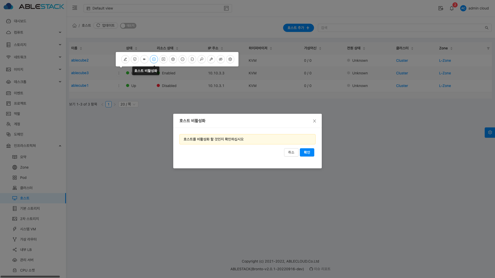

# Management IP 변경 절차
해당 절차는 ABLESTACK 서비스를 위해 구성된 가상 머신(SCVM, CCVM) 및 Cube가 설치된 Host의 Management IP 또는 Management
대역 변경 절차에 대하여 기술 하고 있습니다.

!!! Danger
    ABLESTACK 으로 구성된 HCI 에서는 Glue 에서 사용하는 PSN(Public Storage Network), CSN(Cluster Storage Network)
    두 대역은 초기 구성된 대역에서 변경을 하게 될 경우 HCI 구성이 깨질 수 있습니다.
    IP 또는 대역 변경은 Management 대역만 변경해야 합니다.

## 가상 머신 정지 및 Zone 비 활성화

### 사용가 가상머신 정지

!!! warning
    가상 머신을 정지 하기 전에 가상 머신에서 서비스 중인 애플리케이션은 개별적으로 종료 후 가상 머신을 정지 해야 합니다.

Mold 에 관리자 계정으로 접속 후 **컴퓨트 > 가상머신** 페이지로 이동하여 필터 선택에서 **실행중 VM** 으로 변경  왼쪽 상단의 전체 선택 체크 박스를 선택하여
**가상머신 정지** 버튼을 클릭하여 가상 머신을 정지 합니다.


모든 가상 머신이 종료된 후에 **인프라스트럭쳐 > Zone** 리스트 화면에서 Zone을 선택 후 **Zone 비활성** 화 버튼을 클릭하여
Zone 을 비활성화 합니다.


!!! info
    시스템 VM 은 Zone 을 비활성화 상태에서만 정지 할 수 있습니다. Zone 이 활성화 상태인 경우 시스템 VM 을 정지해도
    Mold 서비스에서 정지가 되여 있으면 자동으로 시작을 합니다.

**인프라스트럭쳐 > 시스템 VM** 메뉴로 이동하여 **Console Proxy VM** , **SecondaryStorage VM** 2개의 가상 머신을
**시스템 VM 정지** 버튼을 클릭하여 **시스템 VM** 을 정지 합니다.


## Mold 에서 호스트 제거

!!! info
    Mold 와 Cube 사이에는 IP를 이용하여 Agent 통신을 합니다. 그래서 기존의 Cube 정보를 삭제 후에 Management 대역 또는
    IP 를 변경 후에 Mold 에서 변경된 IP 로 호스트 추가를 진행해야 합니다.

Mold 에 관리자 계정으로 접속 후 **인프라스트럭쳐 > 호스트** 호스트 리스트 페이지로 이동하여 **호스트 비활성화** 버튼을
클릭하고 **확인** 버튼을 클릭하여 호스트를 비활성화 상태로 변경 합니다.



!!! info
    호스트를 비활성화 상태로 변경을 해야 호스트 삭제 버튼이 표시가 됩니다.

**호스트 삭제** 버튼을 클릭하고 **강제** 옵션을 선택 후에 **확인** 버튼을 클릭하여 호스트를 삭제 합니다.


## Mold 가상 머신 Management IP 변경 및 글로벌 설정 변경

!!! info
    해당 문서에서는 NetworkManager 를 이용하여 가상 머신의 Management IP 변경을 진행합니다. 

Mold 가상 머신에 SSH 접속 후 아래 명령어를 입력 하여 IP 변경 화면으로 이동합니다.

``` shell
nmtui
```

!!! info
    아래 이미지는 예시 이미지 입니다. 아래 이미지의 이더넷 이름 및 IP 는 참고만 하셔야 하며, 해당 구성에 맞는 이더넷 이름 및 IP 를 적용 하셔야 합니다.

**연결 편집** 버튼 을 선택 합니다.


**System ens20** 이더넷 이름을 선택 후 **<편집...>** 번튼을 선택 합니다.


!!! info
    대역이나 Gateway 가 변경할 경우 그에 맞는 입력 값을 입력 해야합니다. 해당 문서에서는 IP 변경에서만 예시로 작성되여 있습니다.

**IPv4 설정** 탭에 있는 **주소** 입력 창으로 이동 및 변경할 IP 주소를 입력 후 **확인** 을 선택 합니다.


**<뒤로>** 버튼을 선택 합니다.


**종료** 버튼을 클릭합니다.


아래 명령어를 CCVM에서 실행 하여 Mold 를 재기동 합니다.

```shell
systemctl restart cloudstack-management
```

!!! info
    아래 **Management IP 대역 변경 시 글로벌 설정 변경** 은 대역이 변경 된 경우에만 설정하면 됩니다. 
    단순히 IP 만 변경이 된 경우에는 아래 절차를 진행 하지 않으셔도 됩니다.

### Management IP 대역 변경 시 글로벌 설정 변경

변경된 IP 를 이용하여 Mold 포털에 관리자 계정으로 접속을 합니다.

구성 > 글로벌 설정 페이지로 이동하여 검색에 management.network.cidr 입력하여 Management Network 대역을 변경을 진행 후
아래 명령어를 입력하여 Mold 를 재기동 합니다.

```shell
systemctl restart cloudstack-management
```

## Host Management IP 변경 및 호스트 추가

!!! Warning
    **Host Management IP 변경 및 호스트 추가** 절차는 호스트의 수량 만큼 반복하여 진행이 되어야 합니다.
    한개의 호스트가 완료되면 다음 호스트를 진행해야 하며, 해당 절차 완료전에 다른 호스트에 해당 절차를 진행하면
    문제가 발생 할 수 있습니다.
    !!! example
        만약 3대의 호스트로 ABLESTACK 이 구성되어 있다면 **Host Management IP 변경 및 호스트 추가** 절차는 3회
        진행되어야 합니다.


### Host Management IP 변경

!!! info
    해당 문서에서는 NetworkManager 를 이용하여 가상 머신의 Management IP 변경을 진행합니다.

Host 에 SSH 접속 후 아래 명령어를 입력 하여 IP 변경 화면으로 이동합니다.

``` shell
nmtui
```

!!! info
아래 이미지는 예시 이미지 입니다. 아래 이미지의 이더넷 이름 및 IP 는 참고만 하셔야 하며, 해당 구성에 맞는 이더넷 이름 및 IP 를 적용 하셔야 합니다.

**연결 편집** 버튼 을 선택 합니다.


**System ens20** 이더넷 이름을 선택 후 **<편집...>** 번튼을 선택 합니다.


!!! info
대역이나 Gateway 가 변경할 경우 그에 맞는 입력 값을 입력 해야합니다. 해당 문서에서는 IP 변경에서만 예시로 작성되여 있습니다.

**IPv4 설정** 탭에 있는 **주소** 입력 창으로 이동 및 변경할 IP 주소를 입력 후 **확인** 을 선택 합니다.


**<뒤로>** 버튼을 선택 합니다.


**종료** 버튼을 클릭합니다.


### Hosts File 변경

!!! danger
    해당 절차에서 안내하는 호스트 명의 Management 대역의 IP가 아닌 다른 대역의 호스트 명의 IP는 변경 하시면 안됩니다.
    다른 대역의 IP나 호스트 명을 변경할 경우 ABLESTACK 구성에 심각한 손상을 초래 할 수 있습니다.

호스트에 관리자 계정으로 SSH 접속 후 아래 명령어를 이용하여 Hosts 파일을 오픈 합니다.

```shell
vi /etc/hosts
```

Management IP 대역 또는 IP 를 변경된 대역 또는 IP 로 변경 합니다.

!!! example
    **변경전**
    ```text
    127.0.0.1   localhost localhost.localdomain localhost4 localhost4.localdomain4
    ::1         localhost localhost.localdomain localhost6 localhost6.localdomain6
    
    10.10.1.10      ccvm-mngt       ccvm
    10.10.1.1       ablecube1       ablecube
    10.10.1.2       ablecube2
    10.10.1.3       ablecube3
    10.10.1.11      scvm1-mngt      scvm-mngt
    10.10.1.12      scvm2-mngt
    10.10.1.13      scvm3-mngt
    100.100.1.1     ablecube1-pn    ablecube-pn
    100.100.1.2     ablecube2-pn
    100.100.1.3     ablecube3-pn
    100.100.1.11    scvm1   scvm
    100.100.1.12    scvm2
    100.100.1.13    scvm3
    100.200.1.11    scvm1-cn        scvm-cn
    100.200.1.12    scvm2-cn
    100.200.1.13    scvm3-cn
    ```
    
    **변경후**
    ```text
    127.0.0.1   localhost localhost.localdomain localhost4 localhost4.localdomain4
    ::1         localhost localhost.localdomain localhost6 localhost6.localdomain6
    
    10.10.1.10      ccvm-mngt       ccvm
    10.10.1.21       ablecube1       ablecube
    10.10.1.22       ablecube2
    10.10.1.23       ablecube3
    10.10.1.31      scvm1-mngt      scvm-mngt
    10.10.1.32      scvm2-mngt
    10.10.1.33      scvm3-mngt
    100.100.1.1     ablecube1-pn    ablecube-pn
    100.100.1.2     ablecube2-pn
    100.100.1.3     ablecube3-pn
    100.100.1.11    scvm1   scvm
    100.100.1.12    scvm2
    100.100.1.13    scvm3
    100.200.1.11    scvm1-cn        scvm-cn
    100.200.1.12    scvm2-cn
    100.200.1.13    scvm3-cn
    ```

### Mold Agent 설정 변경 및 인증서 파일 삭제

아래 경로로 이동 후 해당 파일 삭제 및 Agent 내용 삭제

!!! warning
    아래 명령어를 실행 후 서버를 재기동 할 경우 하이퍼바이저가 정상 동작 하지 않을 수 있습니다.
    재기동이 꼭 필요한 경우에는 아래 명령어 실행전 또는 Mold 에 호스트 추가 완료 후 재기동 해야 합니다.

```shell
cd /etc/cloudstack/agent/
rm -rf cloud*
rm -rf agent.properties
touch agent.properties
```

### Host 추가

Mold 에 관리자로 로그인 후 **인프라스트럭쳐 > 호스트** 페이지로 이동 후 **호스트 추가** 버튼을 클릭하여 추가 페이지를 엽니다.

**Zone, Pod, 클러스터** 를 선택 후 **호스트 이름** 에 바뀐 IP 를 입력 후 **사용자 계정** , **비밀번호** 입력 후
**입력** 버튼을 클릭하여 Host 추가를 완료 합니다.


!!! Warning
    **Host Management IP 변경 및 호스트 추가** 절차는 호스트의 수량 만큼 반복하여 진행이 되어야 합니다.
    한개의 호스트가 완료되면 다음 호스트를 진행해야 하며, 해당 절차 완료전에 다른 호스트에 해당 절차를 진행하면
    문제가 발생 할 수 있습니다.

## Zone 활성화 및 가상 머신 기동

Mold 에 관리자로 로그인 후 **인프로스트럭쳐 > Zone** 화면으로 이동 후 활성화 할 Zone 을 선택 후 상세 화면으로 이동 합니다.
상세 화면에서 **Zone 활성화** 버튼을 클릭 후 **확인** 버튼을 클릭합니다.


## SCVM Management IP 변경

!!! warning
    SCVM IP 및 대역 변경은 Management 대역만 변경해야 합니다. 기존에 구성된 PSN, CSN 네트워크는 변경 및 수정하면 시스템에
    심각한 장애가 발생 할 수 있습니다.

### SCVM Management IP 변경

SCVM 에 SSH 접속 후 아래 명령어를 입력 하여 IP 변경 화면으로 이동합니다.

``` shell
nmtui
```

!!! info
아래 이미지는 예시 이미지 입니다. 아래 이미지의 이더넷 이름 및 IP 는 참고만 하셔야 하며, 해당 구성에 맞는 이더넷 이름 및 IP 를 적용 하셔야 합니다.

**연결 편집** 버튼 을 선택 합니다.


**System ens20** 이더넷 이름을 선택 후 **<편집...>** 번튼을 선택 합니다.


!!! info
대역이나 Gateway 가 변경할 경우 그에 맞는 입력 값을 입력 해야합니다. 해당 문서에서는 IP 변경에서만 예시로 작성되여 있습니다.

**IPv4 설정** 탭에 있는 **주소** 입력 창으로 이동 및 변경할 IP 주소를 입력 후 **확인** 을 선택 합니다.


**<뒤로>** 버튼을 선택 합니다.


**종료** 버튼을 클릭합니다.


### SCVM Hosts 파일 변경

!!! danger
    해당 절차에서 안내하는 호스트 명의 Management 대역의 IP가 아닌 다른 대역의 호스트 명의 IP는 변경 하시면 안됩니다.
    다른 대역의 IP나 호스트 명을 변경할 경우 ABLESTACK 구성에 심각한 손상을 초래 할 수 있습니다.

호스트에 관리자 계정으로 SSH 접속 후 아래 명령어를 이용하여 Hosts 파일을 오픈 합니다.

```shell
vi /etc/hosts
```

Management IP 대역 또는 IP 를 변경된 대역 또는 IP 로 변경 합니다.

!!! example
    **변경전**
    ```text
    127.0.0.1   localhost localhost.localdomain localhost4 localhost4.localdomain4
    ::1         localhost localhost.localdomain localhost6 localhost6.localdomain6

    10.10.1.10      ccvm-mngt       ccvm
    10.10.1.1       ablecube1       ablecube
    10.10.1.2       ablecube2
    10.10.1.3       ablecube3
    10.10.1.11      scvm1-mngt      scvm-mngt
    10.10.1.12      scvm2-mngt
    10.10.1.13      scvm3-mngt
    100.100.1.1     ablecube1-pn    ablecube-pn
    100.100.1.2     ablecube2-pn
    100.100.1.3     ablecube3-pn
    100.100.1.11    scvm1   scvm
    100.100.1.12    scvm2
    100.100.1.13    scvm3
    100.200.1.11    scvm1-cn        scvm-cn
    100.200.1.12    scvm2-cn
    100.200.1.13    scvm3-cn
    ```
    
    **변경후**
    ```text
    127.0.0.1   localhost localhost.localdomain localhost4 localhost4.localdomain4
    ::1         localhost localhost.localdomain localhost6 localhost6.localdomain6
    
    10.10.1.10      ccvm-mngt       ccvm
    10.10.1.21       ablecube1       ablecube
    10.10.1.22       ablecube2
    10.10.1.23       ablecube3
    10.10.1.31      scvm1-mngt      scvm-mngt
    10.10.1.32      scvm2-mngt
    10.10.1.33      scvm3-mngt
    100.100.1.1     ablecube1-pn    ablecube-pn
    100.100.1.2     ablecube2-pn
    100.100.1.3     ablecube3-pn
    100.100.1.11    scvm1   scvm
    100.100.1.12    scvm2
    100.100.1.13    scvm3
    100.200.1.11    scvm1-cn        scvm-cn
    100.200.1.12    scvm2-cn
    100.200.1.13    scvm3-cn
    ```