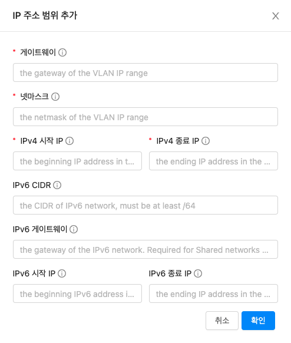
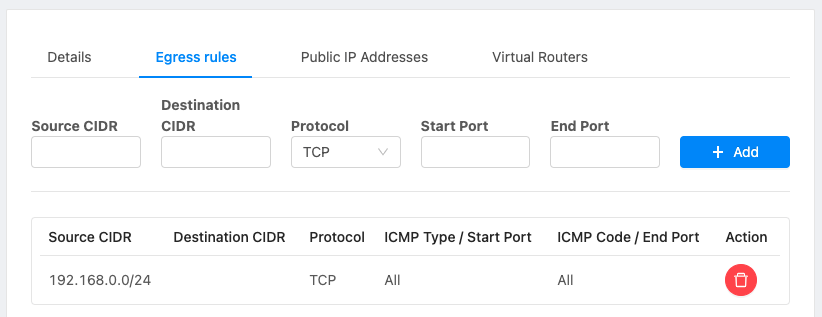
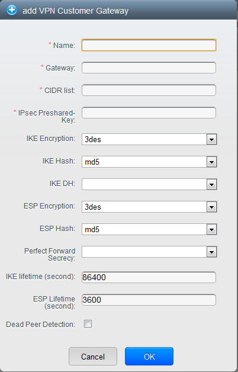
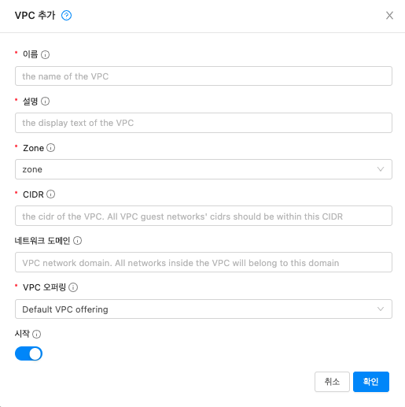
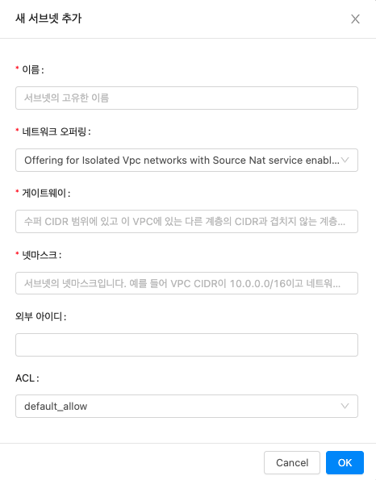
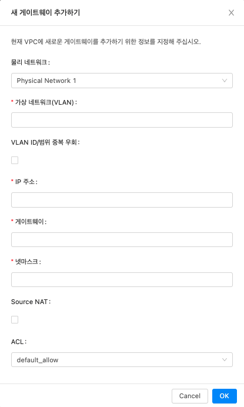

# 네트워크 및 트래픽 관리
CloudStack에서 게스트 VM은 게스트가 프라이빗 LAN을 가지고 있다는 보안 및 사용자 인식과 함께 공유 인프라를 사용하여 서로 통신 할 수 있습니다. CloudStack 가상 라우터는 게스트 트래픽에 대한 네트워킹 기능을 제공하는 주요 구성 요소입니다.

## 게스트 트래픽 
네트워크는 한 영역 내의 VM간에 만 게스트 트래픽을 전달할 수 있습니다. 서로 다른 영역에있는 가상 머신은 IP 주소를 사용하여 서로 통신 할 수 없습니다. 공용 IP 주소를 통해 라우팅하여 서로 통신해야합니다.

아래에 제공된 일반적인 게스트 트래픽 설정을 참조하십시오.


일반적으로 관리 서버는 각 네트워크에 대한 가상 라우터를 자동으로 만듭니다. 가상 라우터는 호스트에서 실행되는 특수한 가상 머신입니다. 격리 된 네트워크의 각 가상 라우터에는 세 개의 네트워크 인터페이스가 있습니다. 다중 공용 VLAN이 사용되는 경우 라우터에는 다중 공용 인터페이스가 있습니다. eth0 인터페이스는 게스트 트래픽의 게이트웨이 역할을하며 IP 주소는 10.1.1.1입니다. eth1 인터페이스는 시스템에서 가상 라우터를 구성하는 데 사용됩니다. eth2 인터페이스에는 공용 트래픽을위한 공용 IP 주소가 할당됩니다. 다중 공용 VLAN이 사용되는 경우 라우터에는 다중 공용 인터페이스가 있습니다.

가상 라우터는 DHCP를 제공하고 네트워크에 할당 된 IP 범위 내에서 각 게스트 VM에 대한 IP 주소를 자동으로 할당합니다. 사용자는 다른 IP 주소를 가정하도록 게스트 VM을 수동으로 재구성 할 수 있습니다.

소스 NAT는 모든 게스트 VM에 대한 아웃 바운드 트래픽을 전달하도록 가상 라우터에서 자동으로 구성됩니다.

## Pod에서의 네트워킹
아래 그림은 단일 포드 내의 네트워크 설정을 보여줍니다. 호스트는 포드 수준 스위치에 연결됩니다. 최소한 호스트에는 각 스위치에 대한 하나의 물리적 업 링크가 있어야합니다. 본딩 된 NIC도 지원됩니다. 포드 수준 스위치는 10G 업 링크가있는 중복 기가비트 스위치 쌍입니다.


서버는 다음과 같이 연결됩니다.

- 저장 장치는 관리 트래픽을 전달하는 네트워크에만 연결됩니다.
- 호스트는 관리 트래픽과 공용 트래픽 모두를 위해 네트워크에 연결됩니다.
- 호스트는 게스트 트래픽을 전달하는 하나 이상의 네트워크에도 연결됩니다.

처리량을 최대화하고 안정성을 향상시키기 위해 여러 개의 물리적 이더넷 카드를 사용하여 각 네트워크 인터페이스와 중복 스위치 패브릭을 구현하는 것이 좋습니다.

## Zone에서의 네트워킹
다음 그림은 단일 영역 내의 네트워크 설정을 보여줍니다.


관리 트래픽을위한 방화벽은 NAT 모드에서 작동합니다. 네트워크에는 일반적으로 192.168.0.0/16 클래스 B 개인 주소 공간에서 IP 주소가 할당됩니다. 각 포드에는 192.168. *. 0/24 클래스 C 개인 주소 공간에서 IP 주소가 할당됩니다.

각 영역에는 고유 한 공용 IP 주소 집합이 있습니다. 다른 영역의 공용 IP 주소는 겹치지 않습니다.

## 기본 영역 물리적 네트워크 구성
기본 네트워크에서 물리적 네트워크를 구성하는 것은 매우 간단합니다. 게스트 VM에서 생성 된 트래픽을 전달하려면 게스트 네트워크를 하나만 구성하면됩니다. CloudStack에 처음 영역을 추가 할 때 영역 추가 화면을 통해 게스트 네트워크를 설정합니다.

## 고급 영역 물리적 네트워크 구성
고급 네트워킹을 사용하는 영역 내에서 여러 종류의 트래픽을 격리 된 상태로 전달하도록 물리적 네트워크를 설정하는 방법을 Management Server에 알려야합니다.

### 고급 영역에서 게스트 트래픽 구성
이 단계에서는 이미 CloudStack UI에 로그인했다고 가정합니다. 기본 게스트 네트워크를 구성하려면 :

1. 왼쪽 탐색에서 인프라를 선택합니다. 영역에서 더보기를 클릭 한 다음 네트워크를 추가 할 영역을 클릭합니다.
2. 네트워크 탭을 클릭하십시오.
3. 게스트 네트워크 추가를 클릭합니다.
    
    게스트 네트워크 추가 창이 표시됩니다.


4. 다음 정보를 제공하십시오.

    - 이름 : 네트워크의 이름입니다. 사용자가 볼 수 있습니다.
    - 표시 텍스트 : 네트워크에 대한 설명입니다. 사용자가 볼 수 있습니다.
    - 영역 : 게스트 네트워크를 구성하는 영역입니다.
    - 네트워크 오퍼링 : 관리자가 여러 네트워크 오퍼링을 구성한 경우이 네트워크에 사용할 오퍼링을 선택하십시오.
    - 게스트 게이트웨이 : 게스트가 사용해야하는 게이트웨이
    - 게스트 넷 마스크 : 게스트가 사용할 서브넷에서 사용중인 넷 마스크

5. 확인 클릭

### 고급 Zone에서 공용 트래픽 구성
고급 네트워킹을 사용하는 영역에서는 인터넷 트래픽에 대해 하나 이상의 IP 주소 범위를 구성해야합니다.

### 공유 게스트 네트워크 구성

1. CloudStack UI에 관리자로 로그인하십시오.
2. 왼쪽 탐색에서 인프라를 선택합니다.
3. 영역에서 더보기를 클릭합니다.
4. 게스트 네트워크를 추가 할 영역을 클릭합니다.
5. 물리적 네트워크 탭을 클릭합니다.
6. 작업 할 물리적 네트워크를 클릭합니다.
7. 다이어그램의 게스트 노드에서 구성을 클릭합니다.
8. 네트워크 탭을 클릭하십시오.
9. 게스트 네트워크 추가를 클릭합니다.
   
    게스트 네트워크 추가 창이 표시됩니다.
   
10. 다음을 지정하십시오.
    
    - **이름** : 네트워크의 이름입니다. 이것은 사용자에게 표시됩니다.
    - **설명** : 사용자에게 표시 할 수있는 네트워크에 대한 간단한 설명입니다.
    - **VLAN ID** : VLAN 의 고유 ID입니다.
    - **격리 된 VLAN ID** : 보조 격리 된 VLAN의 고유 한 ID입니다.
    - **범위** : 사용 가능한 범위는 도메인, 계정, 프로젝트 및 모두입니다.
        - **도메인** : 도메인을 선택하면이 게스트 네트워크의 범위가 지정한 도메인으로 제한됩니다. 다른 도메인에서는 네트워크를 사용할 수 없습니다. 하위 도메인 액세스를 선택하면 선택한 도메인 내의 모든 하위 도메인에서 게스트 네트워크를 사용할 수 있습니다.
        - **계정** : 게스트 네트워크가 생성되는 계정입니다. 계정이 속한 도메인을 지정해야합니다.
        - **프로젝트** : 게스트 네트워크가 생성되는 프로젝트입니다. 프로젝트가 속한 도메인을 지정해야합니다.
        - **모두** : 선택한 영역 내의 모든 도메인, 계정, 프로젝트에 게스트 네트워크를 사용할 수 있습니다.
    - **네트워크 오퍼링** : 관리자가 여러 네트워크 오퍼링을 구성한 경우이 네트워크에 사용할 오퍼링을 선택하십시오.
    - **게이트웨이** : 게스트가 사용해야하는 게이트웨이입니다.
    - **넷 마스크** : 게스트가 사용할 서브넷에서 사용중인 넷 마스크입니다.
    - **IP 범위** : 인터넷에서 액세스 할 수 있고 게스트 VM에 할당 된 IP 주소 범위입니다.
      
        하나의 NIC를 사용하는 경우 이러한 IP는 IPv6의 경우 동일한 CIDR에 있어야합니다.
      
    - **IPv6 CIDR** : 게스트 네트워크 서브넷을 정의하는 네트워크 접두사입니다. 이 영역의 게스트 네트워크에서 사용중인 IPv6 주소를 설명하는 CIDR입니다. 특정 주소 블록 내에서 IP 주소를 할당하려면 CIDR을 입력합니다.
    - **네트워크 도메인** : 네트워크 수준의 사용자 지정 DNS 접미사입니다. 게스트 VM 네트워크에 특수 도메인 이름을 할당하려면 DNS 접미사를 지정합니다.

11. 확인을 클릭하여 확인합니다.

## 여러 게스트 네트워크 사용
고급 네트워킹을 사용하는 영역에서는 초기 설치 후 언제든지 게스트 트래픽에 대한 추가 네트워크를 추가 할 수 있습니다. 각 네트워크에 대해 DNS 접미사를 지정하여 네트워크와 연결된 도메인 이름을 사용자 지정할 수도 있습니다.

VM의 네트워크는 VM 생성시 정의됩니다. 사용자가 게스트로 이동하여 특정 네트워크의 NIC에서 IP 주소를 제거 할 수 있지만 VM이 생성 된 후에는 네트워크를 추가하거나 제거 할 수 없습니다.

각 VM에는 하나의 기본 네트워크 만 있습니다. 가상 라우터의 DHCP 응답은 게스트의 기본 게이트웨이를 기본 네트워크 용으로 설정합니다. 하나의 필수 기본 네트워크 외에 여러 비 기본 네트워크를 게스트에 추가 할 수 있습니다. 관리자는 기본 네트워크로 사용할 수있는 네트워크를 제어 할 수 있습니다.

추가 네트워크는 모든 계정에서 사용 가능하거나 특정 계정에 할당 될 수 있습니다. 모든 계정에서 사용할 수있는 네트워크는 영역 전체입니다. 영역에 대한 액세스 권한이있는 모든 사용자는 해당 네트워크에 대한 액세스 권한이있는 VM을 만들 수 있습니다. 이러한 영역 전체 네트워크는 게스트 간의 격리를 거의 또는 전혀 제공하지 않으며 특정 계정에 할당 된 네트워크는 강력한 격리를 제공합니다.

### 추가 게스트 네트워크 추가
1. 관리자 또는 최종 사용자로 CloudStack UI에 로그인합니다.
2. 왼쪽 탐색에서 네트워크를 선택합니다.
3. 게스트 네트워크 추가를 클릭합니다. 다음 정보를 제공하십시오.
    - 이름 : 네트워크의 이름입니다. 사용자가 볼 수 있습니다.
    - 표시 텍스트 : 네트워크에 대한 설명입니다. 사용자가 볼 수 있습니다.
    - 영역 . 이 네트워크가 적용되는 영역의 이름입니다. 각 영역은 브로드 캐스트 도메인이므로 각 영역은 게스트 네트워크에 대해 다른 IP 범위를 갖습니다. 관리자는 각 영역의 IP 범위를 구성해야합니다.
    - 네트워크 오퍼링 : 관리자가 여러 네트워크 오퍼링을 구성한 경우이 네트워크에 사용할 오퍼링을 선택하십시오.
    - 게스트 게이트웨이 : 게스트가 사용해야하는 게이트웨이입니다.
    - 게스트 넷 마스크 : 게스트가 사용할 서브넷에서 사용중인 넷 마스크입니다.
4. 생성을 클릭합니다.

### VM에서 네트워크 재구성
CloudStack은 네트워크간에 VM을 이동하고 VM의 네트워크를 재구성하는 기능을 제공합니다. 네트워크에서 VM을 제거하고 새 네트워크에 추가 할 수 있습니다. 가상 머신의 기본 네트워크를 변경할 수도 있습니다. 이 기능을 통해 하이브리드 또는 기존 서버로드를 쉽게 수용 할 수 있습니다.

이 기능은 XenServer, VMware 및 KVM 하이퍼 바이저에서 지원됩니다.

#### 전제 조건
VMware 하이퍼 바이저에서 작동하도록 네트워크를 추가하거나 제거하기 위해 vm-tools가 게스트 VM에서 실행 중인지 확인합니다.

#### 네트워크 추가
1. 관리자 또는 최종 사용자로 CloudStack UI에 로그인합니다.
2. 왼쪽 탐색에서 인스턴스를 클릭합니다.
3. 작업 할 VM을 선택합니다.
4. NIC 탭을 클릭합니다.
5. VM에 네트워크 추가를 클릭합니다.
   
    VM에 네트워크 추가 대화 상자가 표시됩니다.
6. 드롭 다운 목록에서이 VM을 추가 할 네트워크를 선택합니다.

    이 네트워크에 새 NIC가 추가되었습니다. NIC 페이지에서 다음 세부 정보를 볼 수 있습니다.

    - 신분증
    - 네트워크 이름
    - 유형
    - IP 주소
    - 게이트웨이
    - 넷 마스크
    - 기본값
    - CIDR (IPv6 용)

#### 네트워크 제거
1. 관리자 또는 최종 사용자로 CloudStack UI에 로그인합니다.
2. 왼쪽 탐색에서 인스턴스를 클릭합니다.
3. 작업 할 VM을 선택합니다.
4. NIC 탭을 클릭합니다.
5. 제거 할 NIC를 찾습니다.
6. NIC 제거 버튼을 클릭합니다. 
7. 예를 클릭하여 확인합니다.
   
#### 기본 네트워크 선택
1. 관리자 또는 최종 사용자로 CloudStack UI에 로그인합니다.
2. 왼쪽 탐색에서 인스턴스를 클릭합니다.
3. 작업 할 VM을 선택합니다.
4. NIC 탭을 클릭합니다.
5. 작업 할 NIC를 찾습니다.
6. 기본 NIC 설정 버튼을 클릭합니다. 버튼을 눌러 NIC를 기본으로 설정합니다. 
7. 예를 클릭하여 확인합니다.

### 게스트 네트워크에서 네트워크 오퍼링 변경
1. 사용자 또는 관리자는 기존 게스트 네트워크와 연관된 네트워크 오퍼링을 변경할 수 있습니다.
2. 관리자 또는 최종 사용자로 CloudStack UI에 로그인합니다.
3. CloudStack 가상 라우터를 사용하는 네트워크 제품에서 외부 장치를 네트워크 서비스 공급자로 사용하는 제품으로 변경하는 경우 먼저 네트워크의 모든 VM을 중지해야합니다.
4. 왼쪽 탐색에서 네트워크를 선택합니다.
5. 수정할 네트워크의 이름을 클릭하십시오. 
6. 세부 정보 탭에서 편집을 클릭합니다. 버튼을 눌러 편집하십시오.
    네트워크 오퍼링에서 새 네트워크 오퍼링을 선택한 다음 적용을 클릭하십시오.
    기존 CIDR을 유지할 것인지 묻는 프롬프트가 표시됩니다. 이는 네트워크 오퍼링을 변경하면 CIDR이 영향을 받게됨을 알려줍니다.
    가상 라우터를 제공자로, 외부 네트워크 장치를 제공자로 업그레이드하는 경우 CIDR 변경을 승인하여 계속하려면 예를 선택하십시오.
7. 업데이트가 완료 될 때까지 기다리십시오. 네트워크 변경이 완료 될 때까지 VM을 다시 시작하지 마십시오.
8. VM을 중지 한 경우 다시 시작합니다.

## 격리 된 게스트 네트워크에서 IP 예약
격리 된 게스트 네트워크에서 게스트 IP 주소 공간의 일부는 비 CloudStack VM 또는 물리적 서버용으로 예약 할 수 있습니다. 이를 위해 게스트 네트워크가 구현 됨 상태 일 때 CIDR을 지정하여 예약 된 IP 주소 범위를 구성합니다. 고객이 동일한 네트워크에서 CloudStack이 제어하지 않는 VM 또는 물리적 서버를 원하는 경우 주로 게스트 네트워크에 제공되는 IP 주소 공간의 일부를 공유 할 수 있습니다.

고급 영역에서는 네트워크가 정의 될 때 IP 주소 범위 또는 CIDR이 네트워크에 할당됩니다. CloudStack 가상 라우터는 DHCP 서버 역할을하며 게스트 VM에 IP 주소를 할당하기 위해 CIDR을 사용합니다. CloudStack 이외의 목적으로 CIDR을 예약하기로 결정한 경우 CloudStack에서 생성 된 게스트 VM에 가상 라우터의 DHCP 서비스에 의해서만 할당되어야하는 CIDR 또는 IP 주소 범위의 일부를 지정할 수 있습니다. 해당 네트워크의 나머지 IP를 예약 된 IP 범위라고합니다. IP 예약이 구성되면 관리자는 CloudStack의 일부가 아닌 추가 VM 또는 물리적 서버를 동일한 네트워크에 추가하고 예약 된 IP 주소를 할당 할 수 있습니다. CloudStack 게스트 VM은 예약 된 IP 범위에서 IP를 얻을 수 없습니다.

### IP 예약 고려 사항
Non-CloudStack 머신에 대한 IP 범위를 예약하기 전에 다음을 고려하십시오.
- IP 예약은 격리 된 네트워크에서만 지원됩니다.
- IP 예약은 네트워크가 구현 됨 상태 일 때만 적용 할 수 있습니다.
- 기본적으로 IP 예약은 수행되지 않습니다.
- 지정하는 게스트 VM CIDR은 네트워크 CIDR의 하위 집합이어야합니다.
- 유효한 게스트 VM CIDR을 지정하십시오. IP 예약은 게스트 VM CIDR 외부에 활성 IP가없는 경우에만 적용됩니다.
    게스트 VM CIDR 외부에있는 IP 주소로 VM이 할당 된 경우 IP 예약을 적용 할 수 없습니다.
- 기존 IP 예약을 재설정하려면 CIDR 필드에 네트워크 CIDR 값을 지정하여 IP 예약을 적용하십시오.
  
  예를 들어 다음 표에서는 게스트 네트워크 생성의 세 가지 시나리오를 설명합니다.

| 케이스 | CIDR | 네트워크 CIDR | Non-CloudStack VM에 대해 예약 된 IP 범위 | 기술 |
|:---|:---|:---|:---|:---|
| 1 | 10.1.1.0/24 | 없음 | 없음 | IP 예약이 없습니다. |
| 2 | 10.1.1.0/26 | 10.1.1.0/24 | 10.1.1.64 ~ 10.1.1.254 | guestvmcidr = 10.1.1.0 / 26을 사용하여 UpdateNetwork API에서 구성한 IP 예약 또는 UI의 CIDR 필드에 10.1.1.0/26을 입력합니다. |
| 3 | 10.1.1.0/24 | 없음 | 없음 | guestvmcidr = 10.1.1.0 / 24를 사용하여 UpdateNetwork API로 IP 예약을 제거하거나 UI의 CIDR 필드에 10.1.1.0/24를 입력합니다. |

### 한계
- 게스트 VM CIDR 외부에서 발견 된 활성 IP 인 경우 IP 예약이 지원되지 않습니다.
- CIDR을 변경하는 네트워크 오퍼링 업그레이드 (예 : 외부 장치가없는 오퍼링을 외부 디바이스가있는 오퍼링으로 업그레이드) IP 예약이있는 경우 무효화됩니다. 새로 단순화 된 네트워크에서 IP 예약을 재구성합니다.

### 모범 사례
네트워크 상태가 구현 됨으로 변경되는 즉시 게스트 네트워크에 IP 예약을 적용합니다. 첫 번째 게스트 VM이 배포 된 직후 예약을 적용하면 예약을 적용하는 동안 충돌이 덜 발생합니다.

### IP 범위 예약
1. 관리자 또는 최종 사용자로 CloudStack UI에 로그인합니다.
2. 왼쪽 탐색에서 네트워크를 선택합니다.
3. 수정할 네트워크의 이름을 클릭하십시오.
4. 세부 정보 탭에서 편집을 클릭합니다. 버튼을 눌러 편집하십시오.

    CIDR 필드가 편집 가능한 필드로 변경됩니다.

5. CIDR에서 게스트 VM CIDR을 지정합니다.
6. 적용을 클릭하십시오.

    업데이트가 완료 될 때까지 기다리십시오. 네트워크 CIDR 및 예약 된 IP 범위가 세부 정보 페이지에 표시됩니다.

## 계정에 대한 공용 IP 주소 및 VLAN 예약
CloudStack은 계정에 대해 독점적으로 공용 IP 주소 및 VLAN 세트를 예약 할 수있는 기능을 제공합니다. 영역을 만드는 동안 VLAN 집합과 여러 공용 IP 범위를 계속 정의 할 수 있습니다. 이 기능은 테넌트에 대해 고정 된 VLAN 및 게스트 IP 주소 세트를 전용 할 수 있도록 기능을 확장합니다.

계정이 전용 VLAN과 IP를 모두 사용했다면 계정은 시스템에서 두 개의 리소스를 더 얻을 수 있습니다. CloudStack은 루트 관리자에게이 기본 동작을 수정하는 두 가지 구성 매개 변수 인 use.system.public.ips 및 use.system.guest.vlans를 제공합니다. 이러한 전역 매개 변수를 사용하면 계정에 전용 리소스가 있고 이러한 전용 리소스가 모두 사용 된 경우 루트 관리자가 계정이 시스템에서 공용 IP 및 게스트 VLAN을 획득하지 못하도록 할 수 있습니다. 이 두 구성은 모두 계정 수준에서 구성 할 수 있습니다.

이 기능은 다음과 같은 기능을 제공합니다.

- 고급 영역에서 VLAN 범위 및 공용 IP 주소 범위를 예약하고 계정에 할당
- 계정에서 VLAN 및 공용 IP 주소 범위 연결 해제
- 계정에 할당 된 공용 IP 주소 수보기
- 필요한 범위가 사용 가능하고 계정 제한을 준수하는지 확인하십시오.
  
    계정 당 최대 IP 제한은 대체 할 수 없습니다.
  
### 계정에 전용 IP 주소 범위 지정
1. CloudStack UI에 관리자로 로그인하십시오.
2. 왼쪽 탐색 모음에서 인프라를 클릭합니다.
3. 영역에서 모두보기를 클릭합니다.
4. 작업 할 영역을 선택하십시오.
5. 물리적 네트워크 탭을 클릭합니다.
6. 다이어그램의 공용 노드에서 구성을 클릭합니다.
7. IP 범위 탭을 클릭합니다.

    기존 IP 범위를 계정에 할당하거나 새 IP 범위를 만들고 계정에 할당 할 수 있습니다.

8. 계정에 기존 IP 범위를 할당하려면 다음을 수행하십시오.
   
    1. 작업 할 IP 범위를 찾습니다.
    2. 계정 추가 버튼을 클릭 합니다.

        계정 추가 대화 상자가 표시됩니다.

    3. 다음을 지정하십시오.
        - 계정 : IP 주소 범위를 할당 할 계정입니다.
        - 도메인 : 계정과 관련된 도메인입니다.
    
        새 IP 범위를 만들고 계정을 할당하려면 다음을 수행하십시오.

        1. 다음을 지정하십시오.
            - 게이트웨이
            - 넷 마스크
            - VLAN
            - 시작 IP
            - 끝 IP
            - 계정 : 다음을 수행하십시오.
                - 계정을 클릭하십시오.
                - 계정 추가 페이지가 표시됩니다.
                - 다음을 지정하십시오.
                    - 계정 : IP 주소 범위를 할당하려는 계정입니다.
                    - 도메인 : 계정과 관련된 도메인입니다.
                - 확인 클릭
        2. 추가를 클릭하십시오.

### 계정에 VLAN 범위 지정
1. CloudStack 관리 서버가 설치된 후 CloudStack UI에 관리자로 로그인합니다.
2. 왼쪽 탐색 모음에서 인프라를 클릭합니다.
3. 영역에서 모두보기를 클릭합니다.
4. 작업 할 영역을 선택하십시오.
5. 물리적 네트워크 탭을 클릭합니다.
6. 다이어그램의 게스트 노드에서 구성을 클릭합니다.
7. Dedicated VLAN Ranges 탭을 선택합니다.
8. Dedicate VLAN Range를 클릭합니다.

    Dedicate VLAN Range 대화 상자가 표시됩니다.
   
9. 다음을 지정하십시오.

    - VLAN 범위 : 계정에 할당하려는 VLAN 범위입니다.
    - 계정 : 선택한 VLAN 범위를 할당하려는 계정입니다.
    - 도메인 : 계정과 관련된 도메인입니다.

## 단일 NIC에 여러 IP 주소 구성
CloudStack은 게스트 VM NIC 당 여러 개인 IP 주소를 연결할 수있는 기능을 제공합니다. 기본 IP 외에도 게스트 VM NIC에 추가 IP를 할당 할 수 있습니다. 이 기능은 기본, 고급 및 VPC와 같은 모든 네트워크 구성에서 지원됩니다. 보안 그룹, 정적 NAT 및 포트 전달 서비스는 이러한 추가 IP에서 지원됩니다.

항상 그렇듯이 게스트 서브넷에서 IP를 지정할 수 있습니다. 지정하지 않으면 게스트 VM 서브넷에서 IP가 자동으로 선택됩니다. UI에서 각 게스트 VM NIC에 연결된 IP를 볼 수 있습니다. CloudStack UI에서 네트워크 구성 옵션을 사용하여 이러한 추가 게스트 IP에 NAT를 적용 할 수 있습니다. IP를 연결해야하는 NIC를 지정해야합니다.

이 기능은 XenServer, KVM 및 VMware 하이퍼 바이저에서 지원됩니다. 기본 영역 보안 그룹은 VMware에서 지원되지 않습니다.

### 사용 사례
일부 사용 사례는 다음과 같습니다.

- 방화벽 및로드 밸런서와 같은 네트워크 장치는 일반적으로 네트워크 인터페이스에서 여러 IP 주소에 액세스 할 수있을 때 가장 잘 작동합니다.
- 인터페이스 또는 인스턴스간에 프라이빗 IP 주소 이동. 특정 IP 주소에 바인딩 된 애플리케이션은 인스턴스간에 이동할 수 있습니다.
- 단일 인스턴스에서 여러 SSL 웹 사이트 호스팅. 각각 고유 한 IP 주소와 연결된 단일 인스턴스에 여러 SSL 인증서를 설치할 수 있습니다.

### 지침
IP 충돌을 방지하려면 여러 네트워크가 동일한 VM에 연결된 경우 다른 서브넷을 구성하십시오.

### VM에 추가 IP 할당
1. CloudStack UI에 로그인합니다.
2. 왼쪽 탐색 모음에서 인스턴스를 클릭합니다.
3. 작업 할 인스턴스의 이름을 클릭하십시오.
4. 세부 정보 탭에서 NIC를 클릭합니다.
5. 보조 IP보기를 클릭합니다.
6. Acquire New Secondary IP를 클릭하고 확인 대화 상자에서 Yes를 클릭합니다.

    게스트 VM NIC에서 수동으로 IP를 구성해야합니다. CloudStack은 VM에서 획득 한 IP 주소를 자동으로 구성하지 않습니다. VM 재부팅시 IP 주소 구성이 유지되는지 확인합니다.
    잠시 후 새 IP 주소가 Allocated 상태로 나타나야합니다. 이제 포트 전달 또는 StaticNAT 규칙에서 IP 주소를 사용할 수 있습니다.

### 포트 포워딩 및 StaticNAT 서비스 변경
NIC 당 여러 IP를 연결할 수 있으므로 포트 포워딩 및 StaticNAT 서비스에 대해 원하는 IP를 선택할 수 있습니다. 기본값은 기본 IP입니다. 이 기능을 활성화하기 위해 추가 선택적 매개 변수 'vmguestip'이 포트 포워딩 및 StaticNAT API (enableStaticNat, createIpForwardingRule)에 추가되어 NAT를 구성해야하는 IP 주소를 나타냅니다. vmguestip이 전달되면 NAT가 VM의 지정된 개인 IP에 구성됩니다. 전달되지 않으면 NAT가 VM의 기본 IP에 구성됩니다.

## 여러 IP 범위 정보
!!! Note
    이 기능은 IPv4 주소에서만 구현할 수 있습니다.

CloudStack은 기본 영역 및 보안 그룹이 활성화 된 고급 영역의 다른 서브넷에서 게스트 IP 범위를 추가 할 수있는 유연성을 제공합니다. 보안 그룹이 활성화 된 고급 영역의 경우 동일한 VLAN에 여러 서브넷을 추가 할 수 있음을 의미합니다. 이 기능을 추가하면 동일한 서브넷 또는 IP 주소가 소진되었을 때 다른 서브넷의 IP 주소 범위를 추가 할 수 있습니다. 그러면 더 많은 수의 서브넷을 사용할 수 있으므로 주소 관리 오버 헤드를 줄일 수 있습니다. 이 기능을 지원하기 위해 createVlanIpRange API의 기능이 확장되어 다른 서브넷의 IP 범위도 추가됩니다.

IP 범위를 추가하기 전에 새 서브넷의 게이트웨이를 수동으로 구성해야합니다. CloudStack은 서브넷에 대해 하나의 게이트웨이 만 지원합니다. 중복 서브넷은 현재 지원되지 않습니다.

deleteVlanRangeAPI를 사용하여 IP 범위를 삭제합니다. 제거 범위의 IP가 사용 중이면이 작업이 실패합니다. 제거 범위에 DHCP 서버가 실행중인 IP 주소가 포함 된 경우 CloudStack은 동일한 서브넷에서 새 IP를 얻습니다. 서브넷에서 사용 가능한 IP가 없으면 제거 작업이 실패합니다.

이 기능은 KVM, xenServer 및 VMware 하이퍼 바이저에서 지원됩니다.

## 탄력적 IP 정보
탄력적 IP (EIP) 주소는 계정과 연결된 IP 주소이며 고정 IP 주소로 작동합니다. 계정 소유자는 계정에 속한 탄력적 IP 주소를 완전히 제어 할 수 있습니다. 계정 소유자는 계정의 EIP 풀에서 선택한 VM에 탄력적 IP를 할당 할 수 있습니다. 나중에 필요한 경우 IP 주소를 다른 VM에 다시 할당 할 수 있습니다. 이 기능은 VM 장애시 매우 유용합니다. 다운 된 VM을 교체하는 대신 계정의 새 VM에 IP 주소를 다시 할당 할 수 있습니다.

퍼블릭 IP 주소와 마찬가지로 탄력적 IP 주소는 StaticNAT를 사용하여 연결된 프라이빗 IP 주소에 매핑됩니다. EIP 서비스는 EIP 지원 기본 영역에서 StaticNAT (1 : 1) 서비스를 갖추고 있습니다. 기본 네트워크 제품인 DefaultSharedNetscalerEIP 및 ELBNetworkOffering은 NetScaler 장치가 영역에 배포 된 경우 네트워크에 EIP 및 ELB 네트워크 서비스를 제공합니다. 자세한 내용은 다음 그림을 참조하십시오.


그림에서 NetScaler 장비는 CloudStack 인스턴스의 기본 시작 또는 종료 지점이고 방화벽은 나머지 데이터 센터의 기본 시작 또는 종료 지점입니다. Netscaler는 게스트 네트워크에 LB 서비스 및 staticNAT 서비스를 제공합니다. 포드와 관리 서버의 게스트 트래픽은 서로 다른 서브넷 / VLAN에 있습니다. 데이터 센터 코어 스위치의 정책 기반 라우팅은 NetScaler를 통해 공용 트래픽을 보내는 반면 나머지 데이터 센터는 방화벽을 통과합니다.

EIP 작업 흐름은 다음과 같습니다.

- 사용자 VM이 배포되면 영역에 구성된 공용 IP 풀에서 공용 IP가 자동으로 획득됩니다. 이 IP는 VM의 계정이 소유합니다.
- 각 VM에는 자체 개인 IP가 있습니다. 사용자 VM이 시작되면 공용 IP와 개인 IP 사이의 인바운드 네트워크 주소 변환 (INAT) 및 역방향 NAT (RNAT) 규칙을 사용하여 NetScaler 디바이스에서 정적 NAT가 프로비저닝됩니다.

    !!! Note
        인바운드 NAT (INAT)는 NetScaler에서 지원하는 NAT 유형으로, 인터넷과 같은 공용 네트워크의 패킷에서 대상 IP 주소가 사설 네트워크에있는 VM의 사설 IP 주소로 대체됩니다. RNAT (Reverse NAT)는 NetScaler에서 지원하는 NAT 유형으로, 소스 IP 주소는 사설 네트워크에서 VM이 생성 한 패킷에서 공용 IP 주소로 대체됩니다.

- 이 기본 공용 IP는 두 가지 경우에 릴리스됩니다.

    - VM이 중지 된 경우. VM이 시작되면 퍼블릭 IP 풀에서 처음에 할당 된 것과 동일하지 않아도 새로운 퍼블릭 IP를 다시받습니다.
    - 사용자가 공인 IP (Elastic IP)를 획득합니다. 이 공용 IP는 계정과 연결되어 있지만 개인 IP에 매핑되지 않습니다. 그러나 사용자는 고정 NAT를 활성화하여이 IP를 계정에있는 VM의 개인 IP에 연결할 수 있습니다. 공용 IP에 대한 고정 NAT 규칙은 언제든지 비활성화 할 수 있습니다. 고정 NAT가 비활성화되면 풀에서 새 공용 IP가 할당되며, 이는 처음에 할당 된 것과 반드시 동일 할 필요는 없습니다.

공용 IP가 제한된 리소스 인 배포의 경우 기본적으로 공용 IP를 할당하지 않도록 선택할 수있는 유연성이 있습니다. 공용 IP 연결 옵션을 사용하여 EIP 사용 기본 영역에서 자동 공용 IP 할당을 켜거나 끌 수 있습니다. 네트워크 오퍼링을 생성하는 동안 자동 퍼블릭 IP 할당을 끄면 VM이 해당 네트워크 오퍼링과 함께 배포 될 때 VM에 프라이빗 IP 만 할당됩니다. 나중에 사용자는 VM에 대한 IP를 획득하고 정적 NAT를 활성화 할 수 있습니다.

공인 IP 연결 옵션에 대한 자세한 내용은 ["새 네트워크 오퍼링 생성"](http://docs.cloudstack.apache.org/en/latest/adminguide/networking.html#creating-a-new-network-offering) 을 참조하십시오 .

!!! Note
    공용 IP 연결 기능은 사용자 VM에서만 사용하도록 설계되었습니다. 시스템 VM은 네트워크 제공 구성에 관계없이 기본적으로 공용 IP와 개인용 IP를 모두 계속 가져옵니다.

기본 영역에서 공유 네트워크를 만들기 위해 EIP 및 ELB 서비스와 함께 기본 공유 네트워크 제품을 사용하는 새로운 배포는 각 사용자 VM에 계속해서 공용 IP를 할당합니다.

## 휴대용 IP
### 포터블 IP 정보
CloudStack의 포터블 IP는 지리적으로 분리 된 영역간에 전송할 수있는 본질적으로 탄력적 인 지역 수준 IP 풀입니다. 관리자는 지역 수준에서 포터블 공용 IP 풀을 프로비저닝 할 수 있으며 사용자가 사용할 수 있습니다. 관리자가 자신이 속한 지역 수준에서 포터블 IP를 프로비저닝 한 경우 사용자는 포터블 IP를 획득 할 수 있습니다. 이러한 IP는 고급 영역 내의 모든 서비스에 사용할 수 있습니다. 기본 영역에서 EIP 서비스에 휴대용 IP를 사용할 수도 있습니다.

Portable IP의 두드러진 특징은 다음과 같습니다.

- IP가 정적으로 할당 됨
- IP는 네트워크와 연결될 필요가 없습니다.
- IP 연결은 네트워크를 통해 전송 가능
- IP는 기본 및 고급 영역 모두에서 양도 가능
- IP는 VPC, 비 VPC 격리 및 공유 네트워크를 통해 전송 가능
- 포터블 IP 전송은 고정 NAT에서만 사용할 수 있습니다.

#### 지침
다른 네트워크로 전송하기 전에 해당 포터블 IP에 네트워크 규칙 (방화벽, 정적 NAT, 포트 전달 등)이 없는지 확인하십시오.

### 포터블 IP 구성
1. 관리자 또는 최종 사용자로 CloudStack UI에 로그인합니다.
2. 왼쪽 탐색 메뉴에서 지역을 클릭합니다.
3. 작업 할 지역을 선택하십시오.
4. 포터블 IP보기를 클릭합니다.
5. 포터블 IP 범위를 클릭합니다.
   
    휴대용 IP 범위 추가 창이 표시됩니다.
   
6. 다음을 지정하십시오.
    - 시작 IP / 종료 IP : 인터넷에서 액세스 할 수 있고 게스트 VM에 할당 될 IP 주소 범위입니다. CloudStack이 게스트 VM에 할당 할 수있는 범위를 정의하는 첫 번째 및 마지막 IP 주소를 입력합니다.
    - 게이트웨이 : 구성중인 포터블 IP 주소에 사용중인 게이트웨이입니다.
    - 넷 마스크 : 포터블 IP 범위와 관련된 넷 마스크입니다.
    - VLAN : 공용 트래픽에 사용될 VLAN입니다.
7. 확인 클릭

### 포터블 IP 획득
1. 관리자 또는 최종 사용자로 CloudStack UI에 로그인합니다.
2. 왼쪽 탐색에서 네트워크를 선택합니다.
3. 작업 할 네트워크 이름을 클릭하십시오.
4. IP 주소보기를 클릭합니다.
5. Acquire New IP를 클릭합니다.

    Acquire New IP 창이 표시됩니다.

6. 교차 영역 IP를 원하는지 여부를 지정하십시오.
7. 확인 대화 상자에서 예를 클릭하십시오.

    잠시 후 새 IP 주소가 Allocated 상태로 나타나야합니다. 이제 포트 전달 또는 고정 NAT 규칙에서 IP 주소를 사용할 수 있습니다.

### 포터블 IP 전송
고정 NAT가 활성화 된 경우에만 한 네트워크에서 다른 네트워크로 IP를 전송할 수 있습니다. 그러나 포터블 IP가 네트워크에 연결되어 있으면 네트워크의 모든 서비스에 사용할 수 있습니다.

네트워크를 통해 휴대용 IP를 전송하려면 다음 API를 실행하십시오.

````
http://localhost:8096/client/api?command=enableStaticNat&response=json&ipaddressid=a4bc37b2-4b4e-461d-9a62-b66414618e36&virtualmachineid=a242c476-ef37-441e-9c7b-b303e2a9cb4f&networkid=6e7cd8d1-d1ba-4c35-bdaf-333354cbd49810
````

UUID를 적절한 UUID로 바꿉니다. 예를 들어 포터블 IP를 네트워크의 네트워크 X 및 VM Y로 전송하려면 다음을 실행합니다.

````
http://localhost:8096/client/api?command=enableStaticNat&response=json&ipaddressid=a4bc37b2-4b4e-461d-9a62-b66414618e36&virtualmachineid=Y&networkid=X
````

## 공유 네트워크의 여러 서브넷
CloudStack은 기본 영역 및 보안 그룹이 활성화 된 고급 영역의 다른 서브넷에서 게스트 IP 범위를 추가 할 수있는 유연성을 제공합니다. 보안 그룹이 활성화 된 고급 영역의 경우 동일한 VLAN에 여러 서브넷을 추가 할 수 있음을 의미합니다. 이 기능을 추가하면 동일한 서브넷 또는 IP 주소가 소진되었을 때 다른 서브넷의 IP 주소 범위를 추가 할 수 있습니다. 그러면 더 많은 수의 서브넷을 사용할 수 있으므로 주소 관리 오버 헤드를 줄일 수 있습니다. 추가 한 IP 범위를 삭제할 수 있습니다.

### 전제 조건 및 지침
- 이 기능은 다음에서만 구현할 수 있습니다.
    - IPv4 주소
    - 가상 라우터가 DHCP 공급자 인 경우
    - KVM, xenServer 및 VMware 하이퍼 바이저에서
- IP 범위를 추가하기 전에 새 서브넷의 게이트웨이를 수동으로 구성하십시오.
- CloudStack은 서브넷에 대해 하나의 게이트웨이 만 지원합니다. 겹치는 서브넷은 현재 지원되지 않습니다.

### 공유 네트워크에 여러 서브넷 추가
1. 관리자 또는 최종 사용자로 CloudStack UI에 로그인합니다.
2. 왼쪽 탐색에서 인프라를 선택합니다.
3. 영역에서 더보기를 클릭 한 다음 작업 할 영역을 클릭합니다.
4. 물리적 네트워크를 클릭합니다.
5. 다이어그램의 게스트 노드에서 구성을 클릭합니다.
6. 네트워크를 클릭하십시오.
7. 작업 할 네트워크를 선택하십시오.
8. IP 범위보기를 클릭합니다.
9. IP 범위 추가를 클릭합니다.

    다음과 같이 IP 범위 추가 대화 상자가 표시됩니다.
   
    

10. 다음을 지정하십시오.

    모든 필드는 필수입니다.

    - 게이트웨이 : 생성 한 계층의 게이트웨이입니다. 게이트웨이가 VPC를 생성하는 동안 지정한 Super CIDR 범위 내에 있고 VPC 내 기존 계층의 CIDR과 겹치지 않는지 확인합니다.
    - 넷 마스크 : 생성 한 계층의 넷 마스크입니다.
    - 예를 들어 VPC CIDR이 10.0.0.0/16이고 네트워크 계층 CIDR이 10.0.1.0/24 인 경우 계층의 게이트웨이는 10.0.1.1이고 계층의 넷 마스크는 255.255.255.0입니다.
    - 시작 IP / 종료 IP : 인터넷에서 액세스 할 수 있고 게스트 VM에 할당 될 IP 주소 범위입니다. CloudStack이 게스트 VM에 할당 할 수있는 범위를 정의하는 첫 번째 및 마지막 IP 주소를 입력합니다.

11. 확인 클릭


## 사설 VLAN을 사용하여 고급 영역에서 격리
### PVLAN (보조 VLAN) 정보
PVLAN의 기본적인 사용 사례는 모든 사용자의 호스트가 백업 호스트와 통신 할 수 있지만 서로 통신 할 수 없도록하는 공유 백업 네트워크입니다.


추가 정보 :

- [사설 VLAN 이해](https://www.cisco.com/c/en/us/td/docs/switches/lan/catalyst3750/software/release/12-2_25_see/configuration/guide/scg/swpvlan.html#wp1038379)
- [Cisco Systems의 사설 VLAN : 다중 클라이언트 환경에서 확장 가능한 보안](https://tools.ietf.org/html/rfc5517)
- [vNetwork 분산 스위치의 사설 VLAN (PVLAN)-개념 개요 (1010691)](https://kb.vmware.com/s/)

### 지원되는 보조 VLAN 유형
세 가지 유형의 사설 VLAN (무차별, 커뮤니티 및 격리) 중에서 CloudStack은 기본 VLAN 당 하나의 무차별 PVLAN, 하나의 격리 된 PVLAN 및 여러 커뮤니티 PVLAN을 지원합니다 . PVLAN은 현재 공유 및 계층 2 네트워크에서 지원됩니다. PVLAN 개념은 KVM (OVS 사용시), XenServer (OVS 사용시) 및 VMware 하이퍼 바이저에서 지원됩니다.

!!! Note
    XenServer 및 KVM의 OVS는 기본적으로 PVLAN을 지원하지 않습니다. 따라서 CloudStack은 흐름 테이블을 수정하여 XenServer 및 KVM 용 OVS에서 PVLAN을 시뮬레이션 할 수있었습니다.

!!! Note
    커뮤니티 PVLAN은 현재 VMware 하이퍼 바이저에서만 지원됩니다.

### 전제 조건
- PVLAN 지원 스위치를 사용하십시오.

    자세한 내용은 [사설 VLAN Catalyst 스위치 지원 매트릭스](https://www.cisco.com/c/en/us/obsolete/switches/cisco-catalyst-2955-series-switches.html) 를 참조하십시오.

- PVLAN을 인식하는 모든 레이어 2 스위치는 서로 연결되고 그중 하나는 라우터에 연결됩니다. 호스트에 연결된 모든 포트는 트렁크 모드로 구성됩니다. 개방형 관리 VLAN, 1 차 VLAN (공용) 및 2 차 격리 VLAN 포트. PVLAN 무차별 트렁크 모드에서 라우터에 연결된 스위치 포트를 구성합니다. 그러면 격리 된 VLAN이 PVLAN 비 인식 라우터의 기본 VLAN으로 변환됩니다.

    Cisco Catalyst 4500에만 일반 VLAN과 PVLAN을 PVLAN 비 인식 스위치에 연결하는 PVLAN 무차별 트렁크 모드가 있습니다. 다른 Catalyst PVLAN 지원 스위치의 경우 PVLAN 쌍에 대해 각각 하나씩 케이블을 사용하여 스위치를 상단 스위치에 연결합니다.

- 대역 외 물리적 스위치에 사설 VLAN을 구성합니다.

- XenServer 및 KVM에서 PVLAN을 사용하기 전에 OVS (Open vSwitch)를 활성화합니다.


### PVLAN 지원 네트워크 생성
PVLAN 지원 네트워크는 공유 또는 계층 2 네트워크 일 수 있습니다.

공유 네트워크를 만드는 방법에 대한 일반적인 설명은 "공유 게스트 네트워크 구성"을 참조하십시오 .

일반 공유 또는 계층 2 네트워크 를 생성하는 데 필요한 매개 변수 외에 다음 매개 변수를 설정해야합니다.

- VLAN ID : 사용하려는 기본 VLAN의 고유 ID입니다.
- Secondary Isolated VLAN ID : 기본 VLAN 내에서 사용할 PVLAN ID입니다.
- PVLAN 유형 : 기본 VLAN 내에서 사용할 PVLAN ID에 해당하는 PVLAN 유형입니다.
    
PVLAN 지원 네트워크 생성은 PVLAN 유형에 따라 여러 가지 방법으로 수행 할 수 있습니다.

- 비규칙 PVLAN의 경우 :
    - 보조 VLAN ID를 비규칙 PVLAN이 내부에 있는 기본 VLAN과 동일한 VLAN ID로 설정합니다 (UI가 아닌 API를 통해서만 사용 가능).
    - PVLAN 유형을 "Promiscuous"로 설정하고 보조 VLAN ID를 설정하지 마십시오.
- 격리 된 PVLAN의 경우 :
    - 보조 VLAN ID를 기본 VLAN 내에서 사용하려는 PVLAN ID로 설정합니다 (UI가 아닌 API를 통해서만 사용 가능).
    - PVLAN 유형을 "Isolated"으로 설정하고 보조 VLAN ID를 기본 VLAN 내에서 사용하려는 PVLAN ID로 설정합니다.
- 커뮤니티 PVLAN의 경우 :
    - PVLAN 유형을 "Community"로 설정하고 보조 VLAN ID를 기본 VLAN 내에서 사용하려는 PVLAN ID로 설정합니다.

## 보안 그룹


### 보안 그룹 정보
보안 그룹은 트래픽을 VM으로 격리하는 방법을 제공합니다. 보안 그룹은 수신 및 송신 규칙이라는 규칙 집합에 따라 수신 및 발신 트래픽을 필터링하는 VM 그룹입니다. 이러한 규칙은 VM과 통신을 시도하는 IP 주소에 따라 네트워크 트래픽을 필터링합니다. 보안 그룹은 모든 게스트 VM에 대해 단일 게스트 네트워크가 있기 때문에 기본 네트워킹을 사용하는 영역에서 특히 유용합니다. 고급 영역에서 보안 그룹은 KVM 하이퍼 바이저에서만 지원됩니다.

!!! Note
    고급 네트워킹을 사용하는 영역에서는 대신 여러 게스트 네트워크를 정의하여 트래픽을 VM으로 격리 할 수 있습니다.

각 CloudStack 계정은 모든 인바운드 트래픽을 거부하고 모든 아웃 바운드 트래픽을 허용하는 기본 보안 그룹과 함께 제공됩니다. 모든 새 VM이 원하는 다른 규칙 집합을 상속하도록 기본 보안 그룹을 수정할 수 있습니다.

모든 CloudStack 사용자는 추가 보안 그룹을 원하는만큼 설정할 수 있습니다. 새 VM이 시작되면 다른 사용자 정의 보안 그룹이 지정되지 않는 한 기본 보안 그룹에 할당됩니다. VM은 여러 보안 그룹의 구성원이 될 수 있습니다. VM이 보안 그룹에 할당되면 전체 수명 동안 해당 그룹에 남아 있습니다. 실행중인 VM을 한 보안 그룹에서 다른 보안 그룹으로 이동할 수 없습니다.

임의의 수의 수신 및 송신 규칙을 삭제하거나 추가하여 보안 그룹을 수정할 수 있습니다. 이렇게하면 새 규칙이 실행 중이 든 중지 되었든 관계없이 그룹의 모든 VM에 적용됩니다.

수신 규칙이 지정되지 않은 경우 송신 규칙을 통해 허용 된 트래픽에 대한 응답을 제외하고 트래픽이 허용되지 않습니다.


### 보안 그룹 추가
사용자 또는 관리자는 새 보안 그룹을 정의 할 수 있습니다.

1. 관리자 또는 최종 사용자로 CloudStack UI에 로그인합니다.
2. 왼쪽 탐색에서 네트워크를 선택합니다.
3. 보기 선택에서 보안 그룹을 선택합니다.
4. 보안 그룹 추가를 클릭하십시오.
5. 이름과 설명을 제공하십시오.
6. 확인을 클릭하십시오.
    
    새 보안 그룹이 보안 그룹 세부 정보 탭에 나타납니다.

7. 보안 그룹을 유용하게 만들려면 보안 그룹에 수신 및 송신 규칙 추가를 계속하십시오.

### 고급 영역의 보안 그룹 (KVM 만 해당)
CloudStack은 보안 그룹을 사용하여 KVM이 하이퍼 바이저 인 고급 영역의 단일 공유 영역 전체 네트워크에서 게스트간에 격리를 제공하는 기능을 제공합니다. 여러 VLAN이 아닌 고급 영역에서 보안 그룹을 사용하면 클라우드에서 게스트 격리를 설정하기위한 다양한 옵션을 사용할 수 있습니다.

#### 한계
다음은 이 기능에 대해 지원되지 않습니다.

- 보안 그룹이 활성화 된 공유 네트워크에서 동일한 VLAN과 다른 게이트웨이 또는 넷 마스크가있는 두 개의 IP 범위.
- 계정 별 공유 네트워크에서 동일한 VLAN과 다른 게이트웨이 또는 넷 마스크를 사용하는 두 개의 IP 범위.
- 보안 그룹이 활성화 된 공유 네트워크의 여러 VLAN 범위.
- 계정 별 공유 네트워크의 여러 VLAN 범위.

이 기능을 사용하려면 영역에서 보안 그룹을 활성화해야합니다.

### 보안 그룹 활성화
보안 그룹이 영역에서 작동하려면 먼저 영역에 대해 보안 그룹 기능을 활성화해야합니다. 관리자는 보안 그룹이 포함 된 네트워크 오퍼링을 선택하여 새 영역을 생성 할 때이를 수행 할 수 있습니다. 절차는 고급 설치 안내서의 기본 영역 구성에 설명되어 있습니다. 관리자는 새 영역을 만들 때만 기존 영역에 대한 보안 그룹을 활성화 할 수 없습니다.

### 보안 그룹에 수신 및 송신 규칙 추가
1. 관리자 또는 최종 사용자로 CloudStack UI에 로그인합니다.
2. 왼쪽 탐색에서 네트워크를 선택합니다.
3. 보기 선택에서 보안 그룹을 선택한 다음 원하는 보안 그룹을 클릭합니다.
4. 수신 규칙을 추가하려면 수신 규칙 탭을 클릭하고 다음 필드를 작성하여이 보안 그룹의 VM 인스턴스에 허용되는 네트워크 트래픽을 지정합니다. 수신 규칙이 지정되지 않은 경우 송신 규칙을 통해 허용 된 트래픽에 대한 응답을 제외하고 트래픽이 허용되지 않습니다.
    - **CIDR / 계정으로 추가합니다.** 트래픽 소스가 IP 주소 (CIDR) 또는 CloudStack 계정 (계정)의 기존 보안 그룹으로 정의되는지 여부를 나타냅니다. 다른 보안 그룹의 모든 VM에서 들어오는 트래픽을 허용하려면 계정을 선택합니다.
    - **프로토콜.** 소스가 보안 그룹에 트래픽을 보내는 데 사용할 네트워킹 프로토콜입니다. TCP 및 UDP는 일반적으로 데이터 교환 및 최종 사용자 통신에 사용됩니다. ICMP는 일반적으로 오류 메시지 또는 네트워크 모니터링 데이터를 보내는 데 사용됩니다.
    - **시작 포트, 끝 포트.** (TCP, UDP 전용) 수신 트래픽의 대상인 수신 대기 포트 범위입니다. 단일 포트를 여는 경우 두 필드에 동일한 번호를 사용하십시오.
    - **ICMP 유형, ICMP 코드.** (ICMP 전용) 수락 할 메시지 유형 및 오류 코드입니다.
    - **CIDR.** (CIDR로만 추가) 특정 주소 블록 내의 IP 주소에서 오는 트래픽 만 허용하려면 CIDR 또는 쉼표로 구분 된 CIDR 목록을 입력합니다. CIDR은 수신 트래픽의 기본 IP 주소입니다. 예 : 192.168.0.0/22. 모든 CIDR을 허용하려면 0.0.0.0/0으로 설정합니다.
    - **계정, 보안 그룹.** (계정 별 추가 만 해당) 다른 보안 그룹의 트래픽 만 수락하려면 CloudStack 계정과 해당 계정에 이미 정의 된 보안 그룹의 이름을 입력합니다. 지금 편집중인 보안 그룹 내의 VM 간 트래픽을 허용하려면 7 단계에서 사용한 것과 동일한 이름을 입력합니다.
    
    다음 예에서는 어디서나 인바운드 HTTP 액세스를 허용합니다.
      


5.송신 규칙을 추가하려면 송신 규칙 탭을 클릭하고 다음 필드를 작성하여이 보안 그룹의 VM 인스턴스에서 전송이 허용되는 트래픽 유형을 지정하십시오. 송신 규칙이 지정되지 않은 경우 모든 트래픽이 허용됩니다. 송신 규칙이 지정되면 다음 유형의 트래픽이 허용됩니다. 송신 규칙에 지정된 트래픽; DNS 및 DHCP 서버에 대한 쿼리 수신 규칙을 통해 허용 된 모든 트래픽에 대한 응답

- **CIDR / 계정으로 추가합니다.** 트래픽 대상이 IP 주소 (CIDR) 또는 CloudStack 계정 (계정)의 기존 보안 그룹으로 정의되는지 여부를 나타냅니다. 다른 보안 그룹의 모든 VM으로 나가는 트래픽을 허용하려면 계정을 선택합니다.
- **프로토콜.** VM이 나가는 트래픽을 보내는 데 사용할 네트워킹 프로토콜입니다. TCP 및 UDP는 일반적으로 데이터 교환 및 최종 사용자 통신에 사용됩니다. ICMP는 일반적으로 오류 메시지 또는 네트워크 모니터링 데이터를 보내는 데 사용됩니다.
- **시작 포트, 끝 포트.** (TCP, UDP 만 해당) 나가는 트래픽의 대상인 수신 대기 포트 범위입니다. 단일 포트를 여는 경우 두 필드에 동일한 번호를 사용하십시오.
- **ICMP 유형, ICMP 코드.** (ICMP 전용) 전송할 메시지 유형 및 오류 코드
- **CIDR.** (CIDR로만 추가) 특정 주소 블록 내의 IP 주소로만 트래픽을 보내려면 CIDR 또는 쉼표로 구분 된 CIDR 목록을 입력합니다. CIDR은 대상의 기본 IP 주소입니다. 예 : 192.168.0.0/22. 모든 CIDR을 허용하려면 0.0.0.0/0으로 설정합니다.
- **계정, 보안 그룹.** (계정별로 만 추가) 트래픽이 다른 보안 그룹으로 전송되도록 허용하려면 CloudStack 계정과 해당 계정에 이미 정의 된 보안 그룹의 이름을 입력합니다. 지금 편집중인 보안 그룹 내에서 VM 간의 트래픽을 허용하려면 이름을 입력합니다.

6.추가를 클릭하십시오.

## 외부 방화벽 및로드 밸런서
CloudStack은 가상 라우터를 외부 Juniper SRX 장치와 게이트웨이 및로드 밸런싱 서비스를위한 선택적 외부 NetScaler 또는 F5로드 밸런서로 대체 할 수 있습니다. 이 경우 VM은 SRX를 게이트웨이로 사용합니다.

### NetScaler Load Balancer 사용 정보
Citrix NetScaler는 고급 영역에서 격리 된 네트워킹을 사용하는 영역의 부하 분산을위한 외부 네트워크 요소로 지원됩니다. CloudStack에서 제공하는 가상 라우터 이외의 수단을 통해로드 밸런싱을 제공하려면 외부로드 밸런서를 설정하십시오.

!!! Note
    기본 영역에서로드 밸런싱 서비스는 탄력적 IP 또는 탄력적 LB 서비스가 활성화 된 경우에만 지원됩니다.

NetScaler로드 밸런서를 사용하여 기본 영역에서 EIP 또는 ELB 서비스를 제공하는 경우 모든 게스트 VM 트래픽이 NetScaler 장치를 통해 들어오고 나가야합니다. 인바운드 트래픽이 NetScaler 장치를 통과 할 때 트래픽은 공용 IP에 구성된 EIP / ELB에 따라 NAT 프로토콜을 사용하여 개인 IP로 라우팅됩니다. 게스트 VM에서 시작된 트래픽은 일반적으로 계층 3 라우터를 통과합니다. 아웃 바운드 트래픽이 EIP / ELB를 제공하는 NetScaler 장치를 통과하도록하려면 레이어 3 라우터에 정책 기반 라우팅이 있어야합니다. 게스트 VM에서 시작된 모든 트래픽이 NetScaler 장치로 전달되도록 정책 기반 경로를 설정해야합니다. 이는 게스트 VM의 아웃 바운드 트래픽이 NAT를 사용하여 퍼블릭 IP로 라우팅되도록하는 데 필요합니다. 탄력적 IP에 대한 자세한 내용은 다음을 참조하십시오. “탄력적 IP 정보” .

NetScaler는 직접 (방화벽 외부) 모드로 설정할 수 있습니다. 부하 분산 규칙이 영역의 게스트 VM에 배포되기 전에 추가되어야합니다.

NetScaler with CloudStack의 기능적 동작은 F5 외부로드 밸런서를 사용하기위한 CloudStack 설명서에 설명 된 것과 동일합니다. 유일한 예외는 F5는 라우팅 도메인을 지원하지만 NetScaler는 지원하지 않는다는 것입니다. NetScaler는 아직 방화벽으로 사용할 수 없습니다.

CloudStack 관리를 위해 외부로드 밸런서를 설치하고 활성화하려면 설치 가이드의 외부 게스트로드 밸런서 통합을 참조하십시오.

Citrix NetScaler는 세 가지 종류로 제공됩니다. 다음은 이러한 변형이 CloudStack에서 처리되는 방식을 요약 한 것입니다.

**MPX**

- 물리적 어플라이언스. 심층 패킷 검사가 가능합니다. 애플리케이션 방화벽 및로드 밸런서 역할을 할 수 있습니다.
- 고급 영역에서로드 밸런서 기능은 제한없이 완벽하게 지원됩니다. 기본 영역에서는 정적 NAT, 탄력적 IP (EIP) 및 탄력적 부하 분산 (ELB)도 제공됩니다.

**VPX**

- 가상 어플라이언스. XenServer, ESXi 및 Hyper-V 하이퍼 바이저에서 VM으로 실행할 수 있습니다. MPX와 동일한 기능
- ESXi 및 XenServer에서 지원됩니다. MPX와 동일한 기능 지원. CloudStack은 VPX 및 MPX를 동일한 장치 유형으로 취급합니다.

**SDX**

- 물리적 어플라이언스. 다중 테넌트 사용을 지원하기 위해 단일 어플라이언스에서 완전히 격리 된 여러 VPX 인스턴스를 생성 할 수 있습니다.
- CloudStack은 SDX에서 VPX 인스턴스의 수명주기를 동적으로 프로비저닝, 구성 및 관리합니다. 프로비저닝 된 인스턴스는 CloudStack에 자동으로 추가되며 관리자가 수동으로 구성 할 필요가 없습니다. VPX 인스턴스가 CloudStack에 추가되면 ESXi 호스트의 VPX와 동일하게 처리됩니다.

### RHEL 서버에서 SNMP 커뮤니티 문자열 구성
SNMP 커뮤니티 문자열은 라우터와 같은 네트워크 장치에 대한 액세스를 제공하는 사용자 ID 또는 암호와 유사합니다. 이 문자열은 모든 SNMP 요청과 함께 전송됩니다. 커뮤니티 문자열이 올 바르면 장치가 요청 된 정보로 응답합니다. 커뮤니티 문자열이 올바르지 않으면 장치가 요청을 버리고 응답하지 않습니다.

NetScaler 장치는 SNMP를 사용하여 VM과 통신합니다. NetScaler 장치와 RHEL 시스템 간의 보안 통신을 위해 SNMP를 설치하고 SNMP 커뮤니티 문자열을 구성해야합니다.

1. RedHat에 SNMP를 설치했는지 확인하십시오. 그렇지 않은 경우 다음 명령을 실행하십시오.
    ````
    yum install net-snmp-utils
    ````
2. NetScaler 장치에서 SNMP 폴링을 허용하도록 /etc/snmp/snmpd.conf 파일을 편집합니다.

    1.커뮤니티 이름을 보안 이름 (요청의 출처에 따라 local 및 mynetwork)에 매핑합니다.
    
    !!! Note
        다음 표를 편집 할 때 public 대신 강력한 암호를 사용하십시오.

    ````
    #         sec.name   source        community
    com2sec   local      localhost     public
    com2sec   mynetwork  0.0.0.0       public
    ````

    !!! Note
    0.0.0.0으로 설정하면 모든 IP가 NetScaler 서버를 폴링 할 수 있습니다.

    2.보안 이름을 그룹 이름에 매핑합니다.
    ````
    #       group.name    sec.model  sec.name
    group   MyRWGroup     v1         local
    group   MyRWGroup     v2c        local
    group   MyROGroup     v1         mynetwork
    group   MyROGroup     v2c        mynetwork
    ````

    3.그룹이 다음에 대한 권한을 갖도록보기를 작성하십시오.
    ````
    incl/excl subtree mask view all included .1
    ````

    4.작성한 보기에 대해 두 그룹에 서로 다른 쓰기 권한으로 액세스 권한을 부여합니다.
    ````
    #       group.name    sec.model  sec.name
    group   MyRWGroup     v1         local
    group   MyRWGroup     v2c        local
    group   MyROGroup     v1         mynetwork
    group   MyROGroup     v2c        mynetwork
    ````
   
3. iptables에서 SNMP 차단을 해제합니다.
````
iptables -A INPUT -p udp --dport 161 -j ACCEPT
````
4. SNMP 서비스를 시작합니다.
````
service snmpd start
````
5. 시스템 시작 중에 SNMP 서비스가 자동으로 시작되는지 확인하십시오.
````
chkconfig snmpd on
````

### 외부 방화벽 및로드 밸런서의 초기 설정
새 계정에 대한 첫 번째 VM이 생성되면 CloudStack은 VM과 함께 작동하도록 외부 방화벽 및 부하 분산기를 프로그래밍합니다. 방화벽에 다음 개체가 생성됩니다.

- 계정의 사설 VLAN에 연결하기위한 새로운 논리적 인터페이스. 인터페이스 IP는 항상 계정의 프라이빗 서브넷 (예 : 10.1.1.1)의 첫 번째 IP입니다.
- 계정의 공용 IP 주소를 원본 주소로 사용하여 계정의 사설 VLAN에서 공용 인터넷으로 나가는 모든 트래픽을 전달하는 원본 NAT 규칙
- 계정에 대한 나가는 트래픽의 바이트 수를 측정하는 방화벽 필터 카운터

로드 밸런서에 다음 개체가 생성됩니다.

- 계정의 프로비저닝 된 영역 VLAN과 일치하는 새 VLAN
- VLAN에 대한 자체 IP. 이것은 항상 계정의 프라이빗 서브넷 (예 : 10.1.1.2)의 두 번째 IP입니다.

### 외부 방화벽 및로드 밸런서의 지속적인 구성
추가 사용자 작업 (예 : 포트 포워드 설정)은 방화벽 및로드 밸런서의 추가 프로그래밍을 유발합니다. 사용자는 추가 공용 IP 주소를 요청하고 이러한 IP에서 수신 된 트래픽을 특정 VM으로 전달할 수 있습니다. 이는 공용 IP 주소에 대해 고정 NAT를 활성화하고, IP를 VM에 할당하고, 열 프로토콜 및 포트 범위 집합을 지정하여 수행됩니다. 정적 NAT 규칙이 생성되면 CloudStack은 다음 개체를 사용하여 영역의 외부 방화벽을 프로그래밍합니다.

- 공용 IP 주소를 VM의 개인 IP 주소에 매핑하는 고정 NAT 규칙입니다.
- 지정된 프로토콜 및 포트 범위 집합 내에서 트래픽을 허용하는 보안 정책입니다.
- 공용 IP로 들어오는 트래픽의 바이트 수를 측정하는 방화벽 필터 카운터입니다.

소스 NAT, 정적 NAT 및 부하 분산 규칙을 통해 들어오고 나가는 바이트 수는 각 외부 요소에서 측정되고 저장됩니다. 이 데이터는 정기적으로 수집되어 CloudStack 데이터베이스에 저장됩니다.

### 로드 밸런서 규칙
CloudStack 사용자 또는 관리자는 공용 IP에서 수신 된 트래픽을 하나 이상의 VM에 분산시키는 부하 분산 규칙을 만들 수 있습니다. 사용자는 규칙을 만들고 알고리즘을 지정하며 VM 집합에 규칙을 할당합니다.

!!! Note
    NetScaler와 같은 외부로드 밸런서 장치를 포함하는 네트워크 서비스 오퍼링을 사용하는 동안로드 밸런싱 규칙을 생성하고 나중에 네트워크 서비스 오퍼링을 CloudStack 가상 라우터를 사용하는 것으로 변경하는 경우, 가상 라우터에 대한 방화벽 규칙을 생성해야합니다. 기존로드 밸런싱 규칙이 계속 작동하도록합니다.

#### 로드 밸런서 규칙 추가
1. 관리자 또는 최종 사용자로 CloudStack UI에 로그인합니다.
2. 왼쪽 탐색에서 네트워크를 선택합니다.
3. 트래픽 부하를 분산 할 네트워크 이름을 클릭합니다.
4. IP 주소보기를 클릭합니다.
5. 규칙을 만들려는 IP 주소를 클릭 한 다음 구성 탭을 클릭합니다.
6. 다이어그램의 부하 분산 노드에서 모두보기를 클릭합니다.

    기본 영역에서는 IP 주소를 얻거나 선택하지 않고 부하 분산 규칙을 만들 수도 있습니다. CloudStack은 규칙이 생성 될 때 IP 주소 페이지에 나열되는 부하 분산 규칙을 ​​생성 할 때 내부적으로 IP를 할당합니다.

    이를 수행하려면 네트워크 이름을 선택한 다음 Add Load Balancer 탭을 클릭합니다. # 7로 계속합니다.
   
7. 다음을 입력하십시오.

    - 이름 : 부하 분산기 규칙의 이름입니다.
    - 공용 포트 : 수신 트래픽을 수신하는 포트입니다.
    - Private Port : VM이 트래픽을 수신하는 데 사용할 포트입니다.
    - 알고리즘 : CloudStack에서 사용할 부하 분산 알고리즘을 선택합니다. CloudStack은 잘 알려진 다양한 알고리즘을 지원합니다. 이러한 선택에 익숙하지 않은 경우 인터넷에서 많은 정보를 찾을 수 있습니다.
    - 고정 : (선택 사항) 구성을 클릭하고 고정 정책에 대한 알고리즘을 선택합니다. 로드 밸런서 규칙에 대한 고정 세션 정책을 참조하십시오.
    - 오토 스케일 : 구성을 클릭 한 다음에 설명 된대로 오토 스케일 구성을 완료 구성 오토 스케일 .
    - 상태 확인 : (선택 사항, NetScaler로드 밸런서 만 해당) 구성을 클릭하고 상태 확인 정책의 특성을 입력합니다. 로드 밸런서 규칙에 대한 상태 확인을 참조하십시오 .
    - Ping 경로 (선택 사항) : 상태 확인 쿼리를 보낼 대상 시퀀스입니다. 기본값 : / (모두).
    - 응답 시간 (선택 사항) : 상태 확인의 응답을 기다리는 시간 (2-60 초). 기본값 : 5 초.
    - 간격 시간 (선택 사항) : 상태 확인 사이의 시간 (1 초-5 분). 기본값은 글로벌 구성 매개 변수 lbrule_health check_time_interval에 설정됩니다.
    - 정상 임계 값 (선택 사항) : 인스턴스를 정상 이라고 선언하기 전에 필요한 연속 상태 확인 성공 횟수입니다. 기본값 : 2.
    - 비정상 임계 값 (선택 사항) : 인스턴스를 비정상으로 선언하기 전에 필요한 연속 상태 확인 실패 수입니다. 기본값 : 10.
    
8. VM 추가를 클릭 한 다음 수신 트래픽의로드를 분할 할 두 개 이상의 VM을 선택하고 적용을 클릭합니다.

    새로드 밸런서 규칙이 목록에 나타납니다. 이 단계를 반복하여이 IP 주소에 대한 부하 분산기 규칙을 더 추가 할 수 있습니다.

#### 로드 밸런서 규칙에 대한 고정 세션 정책
고정 세션은 사용자 세션의 여러 요청에서 정보의 지속적인 가용성을 보장하기 위해 웹 기반 애플리케이션에서 사용됩니다. 예를 들어, 쇼핑객이 장바구니를 채우는 경우 지금까지 구매 한 항목을 기억해야합니다. "고 정성"의 개념은 지속성 또는 상태 유지라고도합니다.

CloudStack에 정의 된 모든로드 밸런서 규칙은 고정 정책을 가질 수 있습니다. 정책은 이름, 고정 방법 및 매개 변수로 구성됩니다. 매개 변수는로드 밸런서 공급 업체에서 정의한 이름-값 쌍 또는 플래그입니다. 고정 방법은로드 밸런서 생성 쿠키, 애플리케이션 생성 쿠키 또는 소스 기반 일 수 있습니다. 소스 기반 방법에서 소스 IP 주소는 사용자를 식별하고 사용자의 저장된 데이터를 찾는 데 사용됩니다. 다른 방법에서는 쿠키가 사용됩니다. 로드 밸런서 또는 애플리케이션에서 생성 된 쿠키는 요청 및 응답 URL에 포함되어 지속성을 생성합니다. 쿠키 이름은 관리자가 지정하거나 자동으로 생성 할 수 있습니다. 쿠키 생성 방법 및 캐시 여부와 같은 쿠키의 정확한 동작을 제어하기 위해 다양한 옵션이 제공됩니다.

사용 가능한 고정 메서드의 최신 목록은 CloudStack UI를 참조하거나 listNetworks를 호출하고 SupportedStickinessMethods 기능을 확인하십시오.

#### 로드 밸런서 규칙에 대한 상태 확인
(NetScaler로드 밸런서 만 해당, NetScaler 버전 10.0 필요)

로드 밸런싱 된 애플리케이션에서 상태 확인을 사용하여 요청이 실행중인 사용 가능한 서비스로만 전달되도록합니다. 로드 밸런서 규칙을 생성 할 때 상태 확인 정책을 지정할 수 있습니다. 이는 고정 정책, 알고리즘 및 기타로드 밸런서 규칙 옵션을 지정하는 것 외에 추가됩니다. 로드 밸런서 규칙 당 하나의 상태 확인 정책을 구성 할 수 있습니다.

CloudStack의 NetScaler로드 밸런서에 정의 된 모든로드 밸런서 규칙에는 상태 확인 정책이있을 수 있습니다. 정책은 ping 경로, "정상"및 "비정상"상태를 정의하는 임계 값, 상태 확인 빈도 및 시간 초과 대기 간격으로 구성됩니다.

상태 확인 정책이 적용되면로드 밸런서는 비정상으로 확인 된 모든 리소스에 대한 요청 전달을 중지합니다. 나중에 리소스를 다시 사용할 수있게되면 정기 상태 확인에서이를 검색하고 리소스가로드 밸런서에서 요청을 수신 할 수있는 리소스 풀에 다시 한 번 추가됩니다. 언제든지 상태 확인의 가장 최근 결과가 UI에 표시됩니다. 상태 확인이 구성된로드 밸런서 규칙에 연결된 모든 VM의 경우 상태는 가장 최근의 상태 확인 결과에 따라 UI에서 UP 또는 DOWN으로 표시됩니다.

기존 상태 확인 정책을 삭제하거나 수정할 수 있습니다.

기본적으로 상태 확인이 수행되는 빈도를 구성하려면 글로벌 구성 설정 healthcheck.update.interval (기본값은 600 초)을 사용하십시오. 개별 상태 확인 정책에 대해이 값을 재정의 할 수 있습니다.

UI를 사용하여 상태 확인 정책을 설정하는 방법에 대한 자세한 내용 은로드 밸런서 규칙 추가를 참조하십시오 .

### AutoScale 구성
AutoScaling을 사용하면 정의한 조건에 따라 백엔드 서비스 또는 애플리케이션 VM을 원활하고 자동으로 확장 또는 축소 할 수 있습니다. AutoScaling을 활성화하면 사용중인 VM 수가 수요가 증가하면 원활하게 확장되고 수요가 감소하면 자동으로 감소하도록 할 수 있습니다. 따라서 미사용 VM을 자동으로 종료하고 수동 개입없이 필요할 때 새 VM을 시작하여 컴퓨팅 비용을 절감 할 수 있습니다.

NetScaler AutoScaling은 사용자 정의 조건에 따라 VM을 원활하게 시작하거나 종료하도록 설계되었습니다. 확장 또는 축소 작업을 트리거하는 조건은 서버의 CPU 사용량 모니터링과 같은 간단한 사용 사례에서 서버의 응답 성과 CPU 사용량의 조합을 모니터링하는 복잡한 사용 사례까지 다양 할 수 있습니다. 예를 들어 CPU 사용량이 15 분 동안 80 %를 초과 할 때마다 추가 VM을 시작하거나 30 분 동안 CPU 사용량이 20 % 미만일 때마다 VM을 제거하도록 AutoScaling을 구성 할 수 있습니다.

CloudStack은 NetScaler로드 밸런서를 사용하여 시스템 상태의 모든 측면을 모니터링하고 CloudStack과 함께 작동하여 확장 또는 축소 작업을 시작합니다.

!!! Note
    AutoScale은 NetScaler 릴리스 10 빌드 74.4006.e 이상에서 지원됩니다.

#### 전제 조건
AutoScale 규칙을 구성하기 전에 다음 사항을 고려하십시오.

- AutoScale을 구성하기 전에 필요한 템플릿이 준비되었는지 확인하십시오. 템플릿을 사용하여 VM을 배포 할 때 응용 프로그램이 실행 중이어야합니다.

    !!! Note
        응용 프로그램이 실행되고 있지 않으면 NetScaler 장치는 VM을 비효율적 인 것으로 간주하고 리소스 제한이 소진 될 때까지 무조건 VM 프로비저닝을 계속합니다.

- 준비한 템플릿을 배포합니다. 애플리케이션이 처음 부팅 할 때 나타나고 트래픽을 처리 할 준비가되었는지 확인합니다. 템플릿을 배포하는 데 필요한 시간을 관찰하십시오. AutoScale을 구성하는 동안 조용한 시간을 지정할 때이 시간을 고려하십시오.
- AutoScale 기능은 확장 또는 축소 작업을 수행하기위한 조건을 정의하는 데 사용할 수있는 SNMP 카운터를 지원합니다. SNMP 기반 카운터를 모니터링하려면 AutoScale VM을 만드는 데 사용되는 템플릿에 SNMP 에이전트가 설치되어 있고 SNMP 작업이 표준 SNMP 관리자를 사용하여 구성된 SNMP 커뮤니티 및 포트에서 작동하는지 확인합니다. 예를 들어 RHEL 시스템에서 SNMP를 구성하려면 "RHELServer에서 SNMP 커뮤니티 문자열 구성"을 참조하십시오 .
- 글로벌 설정에있는 endpointe.url 매개 변수가 관리 서버 API URL로 설정되어 있는지 확인하십시오. 예 : **http://10.102.102.22:8080/client/api**. 다중 노드 관리 서버 배포에서 관리 서버의 클러스터에 대한로드 밸런서에 구성된 가상 IP 주소를 사용합니다. 또한 NetScaler 장치가 AutoScale 지원을 제공하기 위해이 IP 주소에 액세스 할 수 있는지 확인하십시오.
    
    endpointe.url을 업데이트하는 경우 시스템에서로드 밸런서 규칙의 AutoScale 기능을 비활성화 한 다음 다시 활성화하여 변경 사항을 반영합니다. 자세한 내용은 AutoScale 구성 업데이트를 참조하십시오 .

- AutoScale 사용자에 대해 API 키 및 비밀 키가 다시 생성 된 경우 사용자가 참여하는로드 밸런서의 AutoScale 기능이 비활성화 된 다음 활성화되어 NetScaler의 구성 변경 사항을 반영하는지 확인합니다.
- 고급 영역에서 AutoScale을 사용하여로드 밸런서 규칙을 구성하기 전에 하나 이상의 VM이 있어야합니다. 네트워크에 하나의 VM이 있으면 네트워크가 AutoScale 구성을 위해 구현 된 상태가됩니다.
    
#### 구성
다음을 지정하십시오.


- 템플릿 : 템플릿은 기본 OS 이미지와 애플리케이션으로 구성됩니다. 확장 작업에서 애플리케이션의 새 인스턴스를 프로비저닝하는 데 템플릿이 사용됩니다. VM이 템플릿에서 배포되면 VM은 관리자 개입없이로드 밸런서에서 트래픽 가져 오기를 시작할 수 있습니다. 예를 들어, VM이 웹 서비스 용으로 배포 된 경우 웹 서버가 실행되고 데이터베이스가 연결되어 있어야합니다.
- 컴퓨팅 오퍼링 : 사용자가 새 가상 머신 인스턴스를 만들 때 선택할 수있는 CPU 속도, CPU 수, RAM 크기를 포함하여 미리 정의 된 가상 하드웨어 속성 집합입니다. 확장 작업의 일부로 VM 인스턴스를 프로비저닝하는 동안 사용할 컴퓨팅 제품 중 하나를 선택합니다.
- 최소 인스턴스 : 부하 분산 규칙에 할당 된 최소 활성 VM 인스턴스 수입니다. 활성 VM 인스턴스는 작동 중이고 트래픽을 제공하며 부하 분산중인 애플리케이션 인스턴스입니다. 이 매개 변수를 사용하면 부하 분산 규칙에 트래픽을 제공하는 데 사용할 수있는 활성 VM 인스턴스 수가 최소한 구성된 수만큼 있습니다.

!!! Note
    어떤 이유로 VM 인스턴스에서 실행되는 SAP와 같은 애플리케이션이 다운 된 경우 VM은 최소 인스턴스 매개 변수의 일부로 계산되지 않으며 활성 VM 인스턴스 수가 다음보다 적 으면 자동 확장 기능이 확장 작업을 시작합니다. 구성된 값. 마찬가지로 애플리케이션 인스턴스가 이전 다운 상태에서 시작되면이 애플리케이션 인스턴스는 활성 인스턴스 수의 일부로 계산되고 활성 인스턴스 수가 Max 인스턴스 값을 위반하면 AutoScale 프로세스가 축소 작업을 시작합니다.

- 최대 인스턴스 : 부하 분산 규칙에 할당해야하는 최대 활성 VM 인스턴스 수입니다 . 이 매개 변수는 부하 분산 규칙에 할당 할 수있는 활성 VM 인스턴스의 상한을 정의합니다.
    
    최대 인스턴스 매개 변수에 큰 값을 지정하면 많은 수의 VM 인스턴스가 프로비저닝 될 수 있으며, 결과적으로 단일 부하 분산 규칙이 계정 또는 도메인 수준에서 지정된 VM 인스턴스 제한을 소진하게됩니다.

!!! Note
    어떤 이유로 VM 인스턴스에서 실행되는 SAP와 같은 애플리케이션이 다운되면 VM은 최대 인스턴스 매개 변수의 일부로 계산되지 않습니다. 따라서 확장 작업을 위해 프로비저닝 된 VM 수가 구성된 최대 인스턴스 값보다 많을 수있는 시나리오가있을 수 있습니다. VM의 애플리케이션 인스턴스가 이전 다운 상태에서 가동되면 AutoScale 기능이 구성된 최대 인스턴스 값에 맞춰 조정되기 시작합니다.

다음과 같은 확장 및 축소 정책을 지정합니다.

- 기간 : 확장 작업을 트리거하기 위해 지정한 조건이 true 여야하는 기간 (초)입니다. 정의 된 조건은 AutoScale 작업이 호출되도록 지정한 전체 기간 동안 참이어야합니다.
- 카운터 : 성능 카운터는 모니터링되는 인스턴스의 상태를 표시합니다. 기본적으로 CloudStack은 4 개의 성능 카운터 (SNMP 카운터 3 개 및 NetScaler 카운터 1 개)를 제공합니다. SNMP 카운터는 Linux 사용자 CPU, Linux 시스템 CPU 및 Linux CPU 유휴입니다. NetScaler 카운터는 ResponseTime입니다. 루트 관리자는 CloudStack API를 사용하여 CloudStack에 추가 카운터를 추가 할 수 있습니다.
- 연산자 : AutoScale 기능에서 지원되는 5 개의 관계 연산자는보다 큼,보다 작음, 작거나 같음,보다 크거나 같음 및 같음입니다.
- 임계 값 : 카운터에 사용할 임계 값입니다. 위에 정의 된 카운터가 임계 값을 위반하면 AutoScale 기능이 확장 또는 축소 작업을 시작합니다.
- 추가 : 추가를 클릭하여 조건을 추가합니다.

또한 고급 설정을 구성하려면 고급 설정 표시를 클릭하고 다음을 지정합니다.

- 폴링 간격 : 스케일 업 또는 다운 작업을 수행하기 전에 조건, 카운터 조합, 운영자 및 임계 값을 평가하는 빈도입니다. 기본 폴링 간격은 30 초입니다.
- Quiet Time : AutoScale 작업이 시작된 후 냉각 기간입니다. 이 시간에는 템플릿에서 VM 인스턴스 프로비저닝을 완료하는 데 걸린 시간과 애플리케이션이 트래픽을 제공 할 준비가되는 데 걸린 시간이 포함됩니다. 이 조용한 시간을 통해 어떤 조치를 취하기 전에 함대가 안정된 상태에 도달 할 수 있습니다. 기본값은 300 초입니다.
- VM 제거 유예 기간 : 축소 작업이 시작된 후 축소 작업의 일부로 VM이 제거되기 전에 대기하는 기간 (초)입니다. 이는 폐기로 표시된 VM에서 제공하는 보류중인 세션 또는 트랜잭션을 정상적으로 종료하기위한 것입니다. 기본값은 120 초입니다.
- 보안 그룹 : 보안 그룹은 VM 인스턴스에 대한 트래픽을 격리하는 방법을 제공합니다. 보안 그룹은 수신 및 송신 규칙이라는 규칙 집합에 따라 수신 및 발신 트래픽을 필터링하는 VM 그룹입니다. 이러한 규칙은 VM과 통신을 시도하는 IP 주소에 따라 네트워크 트래픽을 필터링합니다.
- 디스크 오퍼링 : 기본 데이터 스토리지 용으로 사전 정의 된 디스크 크기 세트입니다.
- SNMP 커뮤니티 : NetScaler 장치에서 프로비저닝 된 VM 인스턴스에서 구성된 카운터 값을 쿼리하는 데 사용할 SNMP 커뮤니티 문자열입니다. 기본값은 공개입니다.
- SNMP 포트 : 프로비저닝 된 VM에서 실행되는 SNMP 에이전트가 수신하는 포트 번호입니다. 기본 포트는 161입니다.
- 사용자 : NetScaler 장치가 클라우드에 대한 확장 및 축소 API 호출을 호출하는 데 사용하는 사용자입니다. 옵션을 지정하지 않으면 AutoScaling을 구성한 사용자가 적용됩니다. 대체 할 다른 사용자 이름을 지정하십시오.
- 적용 : 적용을 클릭하여 AutoScale 구성을 만듭니다.

#### AutoScale 구성 비활성화 및 활성화
AutoScale VM 인스턴스에서 유지 관리 작업을 수행하려면 AutoScale 구성을 사용 중지합니다. AutoScale 구성이 비활성화되면 확장 또는 축소 작업이 수행되지 않습니다. 유지 보수 활동에이 다운 타임을 사용할 수 있습니다. AutoScale 구성을 비활성화하려면 Disable AutoScale  버튼을 클릭 합니다.

이 버튼은 AutoScale의 현재 활성화 여부에 따라 활성화와 비활성화 사이를 전환합니다. 유지 관리 작업이 완료된 후 AutoScale 구성을 다시 활성화 할 수 있습니다. 활성화하려면 AutoScale 구성 페이지를 다시 연 다음 Enable AutoScale  버튼을 클릭 합니다.

#### AutoScale 구성 업데이트
다양한 매개 변수를 업데이트하고 확장 또는 축소 규칙에서 조건을 추가하거나 삭제할 수 있습니다. AutoScale 구성을 업데이트하기 전에 Disable AutoScale 버튼을 클릭하여 AutoScale로드 밸런서 규칙을 비활성화해야합니다.

필수 AutoScale 매개 변수를 수정 한 후 적용을 클릭합니다. 새로운 AutoScale 정책을 적용하려면 AutoScale 구성 페이지를 다시 연 다음 Enable AutoScale 버튼을 클릭합니다.

#### 런타임 고려 사항
- 관리자는 AutoScale에 대해 구성된 부하 분산 규칙에 VM을 할당하면 안됩니다.
- NetScaler가 종료되거나 다시 시작되는 경우 VM 프로비저닝이 완료되기 전에 프로비저닝 된 VM은 부하 분산 규칙에 할당하려는 의도 였지만 부하 분산 규칙의 일부가 될 수 없습니다. 이 문제를 해결하려면 언제든지 VM이 부하 분산 규칙에 맞게 조정될 수 있도록 규칙 이름 또는 ID를 기반으로 AutoScale 프로비저닝 된 VM의 이름을 바꿉니다.
- 자동 확장 된 VM에서 destroyVM과 같은 AutoScale의 컨텍스트 외부에서 API를 호출하면 부하 분산 구성이 일관성없는 상태가됩니다. VM이 부하 분산 장치 규칙에서 삭제 되더라도 NetScaler는 계속해서 VM을 규칙에 할당 된 서비스로 표시합니다.

## 글로벌 서버 부하 분산 지원
CloudStack은 GSLB (Global Server Load Balancing) 기능을 지원하여 비즈니스 연속성을 제공하고 CloudStack 환경 내에서 원활한 리소스 이동을 가능하게합니다. CloudStack은 재해 복구 및로드 밸런싱과 같은 다양한 GSLB 기능도 제공하는 NetScaler ADC (Application Delivery Controller)와의 통합 기능을 확장하여이를 달성합니다. DNS 리디렉션 기술은 CloudStack에서 GSLB를 달성하는 데 사용됩니다.

이 기능을 지원하기 위해 지역 수준 서비스와 서비스 제공 업체가 도입되었습니다. 새로운 서비스 'GSLB'가 지역 수준 서비스로 도입되었습니다. GSLB 서비스를 제공 할 GSLB 서비스 제공자가 도입되었습니다. 현재 NetScaler는 CloudStack에서 지원되는 GSLB 공급자입니다. GSLB 기능은 Active-Active 데이터 센터 환경에서 작동합니다.

### 글로벌 서버로드 균형 조정 정보
GSLB (Global Server Load Balancing)는로드 균형 조정 기능의 확장으로 가동 중지 시간을 방지하는 데 매우 효율적입니다. 배포의 특성에 따라 GSLB는 부하 공유, 재해 복구, 성능 및 법적 의무와 같은 다양한 목적으로 사용되는 일련의 기술을 나타냅니다. GSLB를 사용하면 지리적으로 분리 된 위치에 위치한 여러 데이터 센터에 워크로드를 분산 할 수 있습니다. GSLB는 또한 장애 발생시 리소스에 액세스 할 수있는 대체 위치를 제공하거나 유지 관리를 단순화하기 위해 트래픽을 쉽게 이동하는 수단을 제공하거나 둘 다 제공 할 수 있습니다.

#### GSLB의 구성 요소
일반적인 GSLB 환경은 다음 구성 요소로 구성됩니다.

- GSLB 사이트 : CloudStack 용어에서 GSLB 사이트는 데이터 센터에 매핑 된 영역으로 표시되며 각 영역에는 다양한 네트워크 어플라이언스가 있습니다. 각 GSLB 사이트는 해당 사이트에 로컬 인 NetScaler 장비에 의해 관리됩니다. 이러한 각 어플라이언스는 자체 사이트를 로컬 사이트로 취급하고 다른 어플라이언스에서 관리하는 다른 모든 사이트를 원격 사이트로 취급합니다. GSLB 배치의 중심 엔티티이며 이름과 IP 주소로 표시됩니다.
- GSLB 서비스 : GSLB 서비스는 일반적으로 부하 분산 또는 콘텐츠 전환 가상 서버로 표현됩니다. GSLB 환경에서는 로컬 및 원격 GSLB 서비스를 가질 수 있습니다. 로컬 GSLB 서비스는 로컬 부하 분산 또는 콘텐츠 전환 가상 서버를 나타냅니다. 원격 GSLB 서비스는 GSLB 설정의 다른 사이트 중 하나에서 구성된 서비스입니다. GSLB 설정의 각 사이트에서 하나의 로컬 GSLB 서비스와 여러 원격 GSLB 서비스를 작성할 수 있습니다.
- GSLB 가상 서버 : GSLB 가상 서버는 하나 이상의 GSLB 서비스를 나타내며 CloudStack 기능을 사용하여 여러 영역의 VM에서 트래픽 간의 트래픽 균형을 조정합니다. 구성된 GSLB 메소드 또는 알고리즘을 평가하여 클라이언트 요청을 보낼 GSLB 서비스를 선택합니다. 다른 구역의 하나 이상의 가상 서버가 GSLB 가상 서버에 바인드됩니다. GSLB 가상 서버에는 연결된 공용 IP가 없으며 대신 FQDN DNS 이름이 있습니다.
- 부하 분산 또는 콘텐츠 전환 가상 서버 : Citrix NetScaler 용어에 따르면 부하 분산 또는 콘텐츠 전환 가상 서버는 로컬 네트워크에있는 하나 이상의 서버를 나타냅니다. 클라이언트는로드 균형 조정 또는 콘텐츠 전환 가상 서버의 VIP (가상 IP) 주소로 요청을 보내고 가상 서버는 로컬 서버에서로드 균형을 조정합니다. GSLB 가상 서버가 로컬 또는 원격로드 균형 조정 또는 콘텐츠 스위칭 가상 서버를 나타내는 GSLB 서비스를 선택한 후 클라이언트는 해당 가상 서버의 VIP 주소로 요청을 보냅니다.
- DNS VIP : DNS 가상 IP는 GSLB 서비스 공급자의 부하 분산 DNS 가상 서버를 나타냅니다. GSLB 서비스 제공자가 권한이있는 도메인에 대한 DNS 요청은 DNS VIP로 전송 될 수 있습니다.
- Authoritative DNS : ADNS (Authoritative Domain Name Server)는 웹 사이트 IP 주소와 같은 DNS 쿼리에 대한 실제 답변을 제공하는 서비스입니다. GSLB 환경에서 ADNS 서비스는 GSLB 서비스 공급자가 권한이있는 도메인에 대한 DNS 요청에만 응답합니다. ADNS 서비스가 구성되면 서비스 공급자는 해당 IP 주소를 소유하고이를 알립니다. ADNS 서비스를 만들 때 NetScaler는 구성된 ADNS 서비스 IP 및 포트에서 DNS 쿼리에 응답합니다.

#### GSLB는 CloudStack에서 어떻게 작동합니까?
글로벌 서버로드 밸런싱은 이상적으로 서로 다른 지리적 위치에있는 두 개의 개별 영역에서 호스팅되는 웹 사이트로의 트래픽 흐름을 관리하는 데 사용됩니다. 다음은 CloudStack에서 GLSB 기능이 제공되는 방식에 대한 설명입니다. xyztelco 조직은 CloudStack에서 관리하는 지리적으로 분리 된 데이터 센터에서 Zone-1과 Zone-2의 두 영역에 걸쳐있는 퍼블릭 클라우드를 설정했습니다. 클라우드의 Tenant-A는 xyztelco 클라우드를 사용하여 고 가용성 솔루션을 시작합니다. 이를 위해 두 영역 모두에서 각각 2 개의 인스턴스 (Zone-1의 VM1 및 VM2와 Zone-2의 VM5 및 VM6)를 시작합니다. Tenant-A는 Zone-1에서 공용 IP, IP-1을 획득하고 VM1과 VM2 인스턴스 간의 트래픽 부하를 분산하도록 부하 분산기 규칙을 구성합니다. CloudStack은 Zone-1의 LB 서비스 공급자에서 가상 서버 설정을 조정합니다. Zone-1의 LB 서비스 공급자에 설정된 가상 서버 1은 클라이언트가 IP-1에 도달하는 공개적으로 액세스 가능한 가상 서버를 나타냅니다. IP-1의 가상 서버 1에 대한 클라이언트 트래픽은 VM1 및 VM2 인스턴스에서 부하 분산됩니다.

Tenant-A는 Zone-2에서 또 다른 공용 IP 인 IP-2를 획득하고 부하 분산기 규칙을 설정하여 VM5와 VM6 인스턴스 간의 트래픽 부하를 분산합니다. 마찬가지로 Zone-2에서 CloudStack은 LB 서비스 제공 업체에서 가상 서버 설정을 조정합니다. Zone-2의 LB 서비스 공급자에 설정된 가상 서버 2는 클라이언트가 IP-2에 도달하는 공개적으로 액세스 가능한 가상 서버를 나타냅니다. IP-2에서 가상 서버 2에 도달하는 클라이언트 트래픽은 VM5 및 VM6 인스턴스에서 부하 분산됩니다. 이 시점에서 Tenant-A는 두 영역 모두에서 서비스를 사용할 수 있지만 영역 중 하나가 실패 할 경우 재해 복구 계획을 설정할 방법이 없습니다. 또한 Tenant-A가 부하, 근접성 등에 따라 영역 중 하나에 트래픽을 지능적으로 부하 분산 할 수있는 방법이 없습니다. xyztelco의 클라우드 관리자는 두 영역 모두에 GSLB 서비스 공급자를 프로비저닝합니다. GSLB 공급자는 일반적으로 ADNS (Authoritative Domain Name Server) 역할을 할 수있는 ADC이며 로컬 및 원격 사이트 모두에서 가상 서버의 상태를 모니터링하는 메커니즘이 있습니다. 클라우드 관리자는 영역 1과 2를 사용하는 테넌트에 대해 GSLB를 서비스로 활성화합니다.


Tenant-A는 xyztelco 클라우드에서 제공하는 GSLB 서비스를 활용하고자합니다. Tenant-A는 Zone-1의 가상 서버 1과 Zone-2의 가상 서버 2에서 트래픽 부하를 분산하도록 GSLB 규칙을 구성합니다. 도메인 이름은 A.xyztelco.com으로 제공됩니다. CloudStack은 Zone-1의 GSLB 서비스 제공 업체에서 GSLB 가상 서버 1 설정을 조정합니다. CloudStack은 Zone-1의 가상 서버 1과 Zone-2의 가상 서버 2를 GLSB 가상 서버 1에 바인딩합니다. GSLB 가상 서버 1은 Zone-1에서 가상 서버 1과 2의 상태 모니터링을 시작하도록 구성됩니다. CloudStack은 또한 Zone-2의 GSLB 서비스 제공 업체에 GSLB 가상 서버 2 설정을 조정합니다. CloudStack은 Zone-1의 가상 서버 1과 Zone-2의 가상 서버 2를 GLSB 가상 서버 2에 바인딩합니다. GSLB 가상 서버 2는 가상 서버 1과 2의 상태 모니터링을 시작하도록 구성됩니다. CloudStack은 도메인 A.xyztelco.com을 GSLB 가상 서버 1과 2 모두에 바인딩합니다.이 시점에서 Tenant-A 서비스는 A.xyztelco.com에서 전 세계적으로 연결할 수 있습니다. 도메인 xyztelcom.com의 개인 DNS 서버는 도메인 A.xyztelco.com을 두 영역의 GSLB 공급자로 확인하기 위해 대역 외 관리자에 의해 구성되며 도메인 A.xyztelco에 대한 ADNS로 구성됩니다. com. A.xyztelcom.com을 확인하기 위해 DNS 요청을 보낼 때 클라이언트는 결국 영역 1과 2의 GSLB 공급자 주소로 DNS 위임을 받게됩니다. 클라이언트 DNS 요청은 GSLB 공급자에 의해 수신됩니다. 해결해야하는 도메인에 따라 GSLB 제공자는 도메인과 연관된 GSLB 가상 서버를 선택합니다. 부하 분산되는 가상 서버의 상태에 따라

### GSLB 구성
GSLB 배포를 구성하려면 먼저 각 영역에 대한 표준 부하 분산 설정을 구성해야합니다. 이를 통해 지역의 각 영역에있는 서로 다른 서버간에로드 균형을 조정할 수 있습니다. 그런 다음 NetScaler 측에서 각 영역에 ADNS (Authoritative DNS) 서버로 추가 할 두 NetScaler 장비를 모두 구성합니다. 다음으로 각 영역에 대한 GSLB 사이트를 만들고, 각 사이트에 대해 GSLB 가상 서버를 구성하고, GLSB 서비스를 만들고, GSLB 서비스를 GSLB 가상 서버에 바인딩합니다. 마지막으로 도메인을 GSLB 가상 서버에 바인드하십시오. 두 개의 서로 다른 영역에있는 두 어플라이언스의 GSLB 구성은 동일하지만 각 사이트로드 밸런싱 구성은 해당 사이트에 고유합니다.

클라우드 관리자로 다음을 수행하십시오. 위에 주어진 예에 따라 xyztelco의 관리자가 GSLB를 설정하는 사람입니다.

1. cloud.dns.name 전역 매개 변수에서 GSLB 서비스를 사용하는 테넌트 클라우드의 DNS 이름을 지정합니다.

2. NetScaler 측에서 GSLB (Global Server Load Balancing) 구성에 제공된대로 GSLB를 구성합니다 .
    
    1.표준 부하 분산 설정을 구성합니다.
    
    2.신뢰할 수있는 DNS 서비스 구성에 설명 된대로 신뢰할 수있는 DNS를 구성합니다 .
    
    3.도메인 이름 세부 사항에서 형성된 사이트 이름으로 GSLB 사이트를 구성하십시오.
        도메인 이름에서 형성된 사이트 이름으로 GSLB 사이트를 구성하십시오.
        위에 주어진 예에 따라 사이트 이름은 A.xyztelco.com 및 B.xyztelco.com입니다.
    
    4.GSLB 가상 서버를 구성하십시오.
    
    5.각 가상 서버에 대해 GSLB 서비스를 구성하십시오.
    
    6.GSLB 서비스를 GSLB 가상 서버에 바인드하십시오.
    
    7.도메인 이름을 GSLB 가상 서버에 바인드하십시오. 도메인 이름은 도메인 세부 정보에서 가져옵니다.
   
    !!! Info    
        [GSLB 구성에 대해 추가 정보를 얻으려면 해당 링크를 클릭하세요.](https://docs.citrix.com/en-us/legacy-archive/)
   
3. GSLB에 참여하는 각 영역에서 GSLB 지원 NetScaler 장치를 추가합니다.
자세한 내용 은 NetScaler에서 GSLB 활성화를 참조하십시오.
도메인 관리자 / 사용자로 다음을 수행하십시오.
두 사이트 모두에 GSLB 규칙을 추가하십시오.
“ GSLB 규칙 추가 ”를 참조하십시오.
부하 분산기 규칙을 할당합니다.
“ GSLB에로드 균형 조정 규칙 할당 ”을 참조하십시오.

도메인 관리자 / 사용자로 다음을 수행하십시오.

1. 두 사이트 모두에 GSLB 규칙을 추가하십시오.
    
    “GSLB 규칙 추가”를 참조하십시오.

2. 부하 분산기 규칙을 할당합니다.
    
    “GSLB에로드 균형 조정 규칙 할당”을 참조하십시오.

#### 전제 조건 및 지침
- GSLB 기능은 기본 및 고급 영역 모두에서 지원됩니다.
- GSLB가 새 네트워크 서비스로 추가되었습니다.
- GSLB 서비스 제공자는 구역의 물리적 네트워크에 추가 될 수 있습니다.
- 관리자는 지역 수준에서 GSLB 기능을 활성화 또는 비활성화 할 수 있습니다.
- 관리자는 영역을 GSLB 가능 또는 사용 가능으로 구성 할 수 있습니다.
    
    영역은 GSLB 서비스 제공자가 영역에 프로비저닝 된 경우에만 GSLB 가능으로 간주됩니다.

- 사용자가 GSLB를 사용하는 여러 가용성 영역에 VM을 배포 한 경우 GSLB 기능을 사용하여 여러 영역의 VM간에 트래픽 부하를 분산 할 수 있습니다.
- 사용자는 관리자가 해당 지역에서 GSLB를 사용하도록 설정 한 경우에만 GSLB를 사용하여 지역의 여러 영역에서 VM간에 부하를 분산 할 수 있습니다.
- 사용자는 동일한 지역 또는 다른 지역의 가용성 영역에서 트래픽 부하를 분산 할 수 있습니다.
- 관리자는 전체 클라우드에 대한 DNS 이름을 구성 할 수 있습니다.
- 사용자는 전역 적으로 부하 분산 된 서비스를 위해 클라우드에서 고유 한 이름을 지정할 수 있습니다. 제공된 이름은 클라우드와 연결된 DNS 이름 아래의 도메인 이름으로 사용됩니다.
  
    관리자가 제공 한 DNS 이름과 함께 사용자가 제공 한 이름은 사용자의 전역 부하 분산 서비스에 대해 전역 적으로 확인 가능한 FQDN을 생성하는 데 사용됩니다. 예를 들어 관리자가 xyztelco.com을 클라우드의 DNS 이름으로 구성하고 사용자가 GSLB 가상 서비스에 대해 'foo'를 지정한 경우 GSLB 가상 서비스의 FQDN 이름은 foo.xyztelco.com입니다.

- GSLB를 설정하는 동안 사용자는 GSLB의 일부인 영역에서 사용하기 위해 라운드 로빈과 같은로드 균형 조정 방법을 선택할 수 있습니다.
- 사용자는 영역 수준 가상 서버에 가중치를 설정할 수 있어야합니다. 트래픽 분산을위한 부하 분산 방식에서 가중치를 고려해야합니다.
- GSLB 기능은 특정 도메인 이름에 대한 일련의 클라이언트 요청이 동일한 영역의 가상 서버로 전송되는 세션 지속성을 지원해야합니다.

통계는 각 GSLB 가상 서버에서 수집됩니다.

#### NetScaler에서 GSLB 활성화
각 영역에서로드 균형 조정을 위해 GSLB 지원 NetScaler 장치를 추가합니다.

1. CloudStack UI에 관리자로 로그인하십시오.
2. 왼쪽 탐색 모음에서 인프라를 클릭합니다.
3. 영역에서 더보기를 클릭합니다.
4. 작업 할 영역을 선택하십시오.
5. 물리적 네트워크 탭을 클릭 한 다음 물리적 네트워크의 이름을 클릭합니다.
6. 다이어그램의 네트워크 서비스 공급자 노드에서 구성을 클릭합니다.

    이것을 보려면 아래로 스크롤해야 할 수도 있습니다.

7. NetScaler를 클릭합니다.

8. NetScaler 장치 추가를 클릭하고 다음을 제공합니다.

    NetScaler의 경우 :

    - IP 주소 : SDX의 IP 주소입니다.
    - 사용자 이름 / 비밀번호 : 장치에 액세스하기위한 인증 자격 증명입니다. CloudStack은 이러한 자격 증명을 사용하여 장치에 액세스합니다.
    - 유형 : 추가되는 장치의 유형입니다. F5 Big Ip Load Balancer, NetScaler VPX, NetScaler MPX 또는 NetScaler SDX 일 수 있습니다. NetScaler 유형의 비교는 CloudStack 관리 가이드를 참조하십시오.
    - 공용 인터페이스 : 공용 네트워크의 일부로 구성된 장치의 인터페이스입니다.
    - 사설 인터페이스 : 사설 네트워크의 일부로 구성된 장치의 인터페이스입니다.
    - GSLB 서비스 :이 옵션을 선택합니다.
    - GSLB 서비스 공용 IP : 사설 네트워크에있는 GSLB 서비스에 대한 NAT 변환기의 공용 IP 주소입니다.
    - GSLB 서비스 사설 IP : GSLB 서비스 의 사설 IP입니다.
    - 재시도 횟수 . 작업 실패를 고려하기 전에 장치에서 명령을 시도하는 횟수입니다. 기본값은 2입니다.
    - 용량 : 장치가 처리 할 수있는 네트워크 수입니다.
    - 전용 : 전용으로 표시되면이 장치는 단일 계정 전용입니다. Dedicated를 선택하면 Capacity 필드의 값은 암시 적으로 의미가 없으며 값은 1입니다.
    
9. 확인을 클릭하십시오.

#### GSLB 규칙 추가
1. CloudStack UI에 도메인 관리자 또는 사용자로 로그인합니다.
2. 왼쪽 탐색 창에서 지역을 클릭합니다.
3. GSLB 규칙을 작성할 지역을 선택하십시오.
4. 세부 정보 탭에서 GSLB보기를 클릭합니다.
5. GSLB 추가를 클릭하십시오.

    Add GSLB 페이지는 다음과 같이 표시됩니다.

   

6.다음을 지정하십시오.

- 이름 : GSLB 규칙의 이름입니다.
- 설명 : (선택 사항) 사용자에게 표시 할 수있는 GSLB 규칙에 대한 간단한 설명입니다.
- GSLB 도메인 이름 : 서비스에 대한 선호 도메인 이름입니다.
- Algorithm : (선택 사항) 영역간에 트래픽 부하를 분산하는 데 사용할 알고리즘입니다. 옵션은 Round Robin, Least Connection 및 Proximity입니다.
- 서비스 유형 : GSLB에 사용할 전송 프로토콜입니다. 옵션은 TCP 및 UDP입니다.
- 도메인 : (선택 사항) GSLB 규칙을 만들려는 도메인입니다.
- 계정 : (선택 사항) GSLB 규칙을 적용 할 계정입니다.
    
7.확인을 클릭하여 확인합니다.

#### GSLB에 부하 분산 규칙 할당
1. CloudStack UI에 도메인 관리자 또는 사용자로 로그인합니다.
2. 왼쪽 탐색 창에서 지역을 클릭합니다.
3. GSLB 규칙을 작성할 지역을 선택하십시오.
4. 세부 정보 탭에서 GSLB보기를 클릭합니다.
5. 원하는 GSLB를 선택하십시오.
6. 할당 된 부하 분산보기를 클릭합니다.
7. 더 많은 부하 분산 할당을 클릭합니다.
8. 영역에 대해 생성 한 부하 분산 규칙을 선택합니다.
9. 확인을 클릭하여 확인합니다.

### 알려진 제한
현재 CloudStack은 영역 전체에서 서비스 오케스트레이션을 지원하지 않습니다. 지역의 서비스 및 서비스 제공 업체에 대한 개념이 도입됩니다.

## 게스트 IP 범위
게스트 네트워크 트래픽의 IP 범위는 사용자가 계정별로 설정합니다. 이를 통해 사용자는 게스트 네트워크와 클라이언트 간의 VPN 연결을 가능하게하는 방식으로 네트워크를 구성 할 수 있습니다.

기본 영역 및 보안 그룹이 활성화 된 고급 네트워크의 공유 네트워크에서는 서로 다른 서브넷의 여러 게스트 IP 범위를 유연하게 추가 할 수 있습니다. 한 번에 하나의 IP 범위를 추가하거나 제거 할 수 있습니다. 자세한 내용은 "다중 IP 범위 정보"를 참조하십시오.

## 새 IP 주소 획득
1. 관리자 또는 최종 사용자로 CloudStack UI에 로그인합니다.
2. 왼쪽 탐색에서 네트워크를 선택합니다.
3. 작업 할 네트워크 이름을 클릭하십시오.
4. IP 주소보기를 클릭합니다.
5. Acquire New IP를 클릭합니다.

    Acquire New IP 창이 표시됩니다.
   
6. 교차 영역 IP를 원하는지 여부를 지정하십시오.

    포터블 IP를 원하면 확인 대화 상자에서 예를 클릭하십시오. 일반 공용 IP를 원하면 아니오를 클릭하십시오.
    
    포터블 IP에 대한 자세한 내용은 "포터블 IP"를 참조하십시오 .
    
    잠시 후 새 IP 주소가 Allocated 상태로 나타나야합니다. 이제 포트 전달 또는 고정 NAT 규칙에서 IP 주소를 사용할 수 있습니다.

## IP 주소 해제
IP 주소에 대한 마지막 규칙이 제거되면 해당 IP 주소를 해제 할 수 있습니다. IP 주소는 여전히 VPC에 속합니다. 그러나 모든 게스트 네트워크에 대해 다시 선택할 수 있습니다.

관리자 또는 최종 사용자로 CloudStack UI에 로그인합니다.
왼쪽 탐색에서 네트워크를 선택합니다.
작업 할 네트워크 이름을 클릭하십시오.
IP 주소보기를 클릭합니다.
해제하려는 IP 주소를 클릭하십시오.
Release IP 버튼을 클릭합니다. 


## 정적 NAT
고정 NAT 규칙은 인터넷 트래픽을 VM으로 허용하기 위해 공용 IP 주소를 VM의 개인 IP 주소에 매핑합니다. 공용 IP 주소는 항상 동일하게 유지되므로 고정 NAT라고합니다. 이 섹션에서는 특정 IP 주소에 대해 정적 NAT를 활성화 또는 비활성화하는 방법을 설명합니다.

### 정적 NAT 활성화 또는 비활성화
포트 전달 규칙이 이미 IP 주소에 적용되는 경우 해당 IP에 대해 고정 NAT를 활성화 할 수 없습니다.

게스트 VM이 둘 이상의 네트워크에 속하는 경우 정적 NAT 규칙은 기본 네트워크에 정의 된 경우에만 작동합니다.

1. 관리자 또는 최종 사용자로 CloudStack UI에 로그인합니다.
2. 왼쪽 탐색에서 네트워크를 선택합니다.
3. 작업 할 네트워크 이름을 클릭하십시오.
4. IP 주소보기를 클릭합니다.
5. 작업 할 IP 주소를 클릭하십시오.
6. Static NAT 버튼을 클릭 합니다.

    버튼은 현재 IP 주소에 대해 정적 NAT가 활성화되어 있는지 여부에 따라 활성화와 비활성화 사이를 전환합니다.

7. 정적 NAT를 사용하는 경우 대상 VM을 선택하고 적용을 클릭 할 수있는 대화 상자가 나타납니다.

## IP 전달 및 방화벽
기본적으로 공용 IP 주소로 들어오는 모든 트래픽이 거부됩니다. 게스트에서 나가는 모든 트래픽도 기본적으로 차단됩니다.

나가는 트래픽을 허용하려면 고급 영역의이 그레스 방화벽 규칙 의 절차를 따르십시오 .

들어오는 트래픽을 허용하기 위해 사용자는 방화벽 규칙 및 / 또는 포트 전달 규칙을 설정할 수 있습니다. 예를 들어 방화벽 규칙을 사용하여 공용 IP 주소 (예 : 33 ~ 44)의 포트 범위를 열 수 있습니다. 그런 다음 포트 전달 규칙을 사용하여 해당 범위 내의 개별 포트에서 사용자 VM의 특정 포트로 트래픽을 보냅니다. 예를 들어 한 포트 전달 규칙은 공용 IP의 포트 33에서 들어오는 트래픽을 한 사용자 VM의 개인 IP에있는 포트 100으로 라우팅 할 수 있습니다.

### 방화벽 규칙
기본적으로 공용 IP 주소로 들어오는 모든 트래픽은 방화벽에서 거부됩니다. 외부 트래픽을 허용하려면 방화벽 규칙을 지정하여 방화벽 포트를 열 수 있습니다. 선택적으로 하나 이상의 CIDR을 지정하여 소스 IP를 필터링 할 수 있습니다. 특정 IP 주소에서 들어오는 요청 만 허용하려는 경우 유용합니다.

방화벽 규칙을 사용하여 탄력적 IP 주소에 대한 포트를 열 수 없습니다. 탄력적 IP를 사용하는 경우 보안 그룹을 사용하여 외부 액세스를 제어합니다. “보안 그룹 추가”를 참조하십시오 .

고급 영역에서 가상 라우터를 사용하여 송신 방화벽 규칙을 만들 수도 있습니다. 자세한 내용은“ 고급 영역의이 그레스 방화벽 규칙 ”을 참조하십시오 .

관리 서버 UI의 방화벽 탭을 사용하여 방화벽 규칙을 만들 수 있습니다. 이 탭은 CloudStack이 설치된 경우 기본적으로 표시되지 않습니다. 방화벽 탭을 표시하려면 CloudStack 관리자는 전역 구성 매개 변수 firewall.rule.ui.enabled를 "true"로 설정해야합니다.

방화벽 규칙을 생성하려면 :

1. 관리자 또는 최종 사용자로 CloudStack UI에 로그인합니다.
2. 왼쪽 탐색에서 네트워크를 선택합니다.
3. 작업 할 네트워크 이름을 클릭하십시오.
4. IP 주소보기를 클릭합니다.
5. 작업 할 IP 주소를 클릭하십시오.
6. 구성 탭을 클릭하고 다음 값을 입력하십시오.
    - 소스 CIDR : (선택 사항) 특정 주소 블록 내 IP 주소의 트래픽 만 허용하려면 CIDR 또는 쉼표로 구분 된 CIDR 목록을 입력합니다. 예 : 192.168.0.0/22. 모든 CIDR을 허용하려면 비워 둡니다.
    - 프로토콜 : 열린 포트에서 사용중인 통신 프로토콜입니다.
    - 시작 포트 및 끝 포트 : 방화벽에서 열려는 포트입니다. 단일 포트를 여는 경우 두 필드에 동일한 번호를 사용하십시오.
    - ICMP 유형 및 ICMP 코드 : 프로토콜이 ICMP로 설정된 경우에만 사용됩니다. ICMP 헤더를 채우기 위해 ICMP 프로토콜에 필요한 유형과 코드를 제공합니다. 무엇을 입력해야하는지 확실하지 않은 경우 자세한 내용은 ICMP 문서를 참조하십시오.
7. 추가를 클릭하십시오.

### 고급 영역의 송신 방화벽 규칙
이 그레스 트래픽은 사설 네트워크에서 인터넷과 같은 공용 네트워크로 시작됩니다. 기본적으로 송신 트래픽은 기본 네트워크 제품에서 차단되므로 게스트 네트워크에서 인터넷으로 나가는 트래픽은 허용되지 않습니다. 그러나이 그레스 방화벽 규칙을 생성하여 고급 영역에서이 그레스 트래픽을 제어 할 수 있습니다. 송신 방화벽 규칙이 적용되면 규칙과 관련된 트래픽이 허용되고 나머지 트래픽은 차단됩니다. 모든 방화벽 규칙이 제거되면 기본 정책 인 차단이 적용됩니다.

#### 전제 조건 및 지침
송신 방화벽 규칙을 적용하려면 다음 시나리오를 고려하십시오.

- 이 그레스 방화벽 규칙은 Juniper SRX 및 가상 라우터에서 지원됩니다.
- 송신 방화벽 규칙은 공유 네트워크에서 지원되지 않습니다.
- 지정된 소스 CIDR의 송신 트래픽을 허용합니다. 소스 CIDR은 게스트 네트워크 CIDR의 일부입니다.
- 프로토콜 TCP, UDP, ICMP 또는 ALL을 사용하여 송신 트래픽을 허용합니다.
- 프로토콜 및 대상 포트 범위로 송신 트래픽을 허용합니다. 포트 범위는 TCP, UDP 또는 ICMP 유형 및 코드에 대해 지정됩니다.
- 기본 정책은 새 네트워크 제품에 대해 허용이지만 방화벽 서비스 공급자가있는 기존 네트워크 제품을 업그레이드하면 기본 송신 정책 거부가 적용됩니다.

#### 송신 방화벽 규칙 구성
1. 관리자 또는 최종 사용자로 CloudStack UI에 로그인합니다.
2. 왼쪽 탐색에서 네트워크를 선택합니다.
3. 보기 선택에서 게스트 네트워크를 선택한 다음 원하는 게스트 네트워크를 클릭합니다.
4. 이 그레스 규칙을 추가하려면이 그레스 규칙 탭을 클릭하고 다음 필드를 작성하여이 게스트 네트워크의 VM 인스턴스에서 전송할 수있는 트래픽 유형을 지정합니다.

    
    
    - CIDR : (CIDR로만 추가) 특정 주소 블록 내의 IP 주소로만 트래픽을 보내려면 CIDR 또는 쉼표로 구분 된 CIDR 목록을 입력합니다. CIDR은 대상의 기본 IP 주소입니다. 예 : 192.168.0.0/22. 모든 CIDR을 허용하려면 0.0.0.0/0으로 설정합니다.
    - 프로토콜 : VM이 나가는 트래픽을 보내는 데 사용하는 네트워킹 프로토콜입니다. TCP 및 UDP 프로토콜은 일반적으로 데이터 교환 및 최종 사용자 통신에 사용됩니다. ICMP 프로토콜은 일반적으로 오류 메시지 또는 네트워크 모니터링 데이터를 보내는 데 사용됩니다.
    - 시작 포트, 끝 포트 : (TCP, UDP 만 해당) 나가는 트래픽의 대상인 수신 대기 포트 범위입니다. 단일 포트를 여는 경우 두 필드에 동일한 번호를 사용하십시오.
    - ICMP 유형, ICMP 코드 : (ICMP 전용) 전송되는 메시지 유형 및 오류 코드입니다.
    
5. 추가를 클릭하십시오.
#### 기본 송신 정책 구성
격리 된 게스트 네트워크에 대한 기본 송신 정책은 네트워크 오퍼링을 사용하여 구성됩니다. 네트워크 오퍼링 생성 옵션을 사용하여 기본 정책이 게스트 네트워크에서 공용 네트워크로 들어오는 모든 트래픽을 차단할지 또는 허용할지 여부를 결정합니다. 이 네트워크 오퍼링을 사용하여 네트워크를 작성하십시오. 정책이 지정되지 않으면 기본적으로이 네트워크 오퍼링을 사용하여 생성 한 게스트 네트워크의 모든 트래픽이 허용됩니다.

허용 및 거부의 두 가지 옵션이 있습니다.

##### 허용
네트워크 오퍼링에 대해 허용을 선택하면 기본적으로 송신 트래픽이 허용됩니다. 그러나 게스트 네트워크에 대해 송신 규칙이 구성되면 지정된 트래픽을 차단하는 규칙이 적용되고 나머지는 허용됩니다. 네트워크에 대해 송신 규칙이 구성되지 않은 경우 송신 트래픽이 허용됩니다.

##### 거부
네트워크 오퍼링에 대해 거부를 선택하면 기본적으로 게스트 네트워크에 대한 송신 트래픽이 차단됩니다. 그러나 게스트 네트워크에 대해 송신 규칙이 구성되면 지정된 트래픽을 허용하는 규칙이 적용됩니다. 게스트 네트워크를 구현하는 동안 CloudStack은 게스트 네트워크의 기본 송신 정책에 특정한 방화벽 송신 규칙을 추가합니다.

이 기능은 가상 라우터 및 Juniper SRX에서만 지원됩니다.

1. 원하는 기본 송신 정책을 사용하여 네트워크 오퍼링을 만듭니다.

    1.CloudStack UI에 관리자 권한으로 로그인합니다.
    2.왼쪽 탐색 줄에서 서비스 제공을 클릭하십시오.
    3.Select Offering에서 Network Offering을 선택하십시오.
    4.네트워크 오퍼링 추가를 클릭하십시오.
    5.대화 상자에서 방화벽 공급자를 포함하여 필요한 항목을 선택합니다.
    6.기본 송신 정책 필드에서 동작을 지정하십시오.
    7.확인을 클릭하십시오.
   
2.이 네트워크 오퍼링을 사용하여 격리 된 네트워크를 만듭니다. 선택에 따라 네트워크는 송신 공용 트래픽을 차단하거나 허용합니다.

### 포트 포워딩
포트 전달 서비스는 정책을 정의하는 포트 전달 규칙 집합입니다. 그런 다음 포트 전달 서비스가 하나 이상의 게스트 VM에 적용됩니다. 그런 다음 게스트 VM은 포트 전달 서비스에서 정의한 정책에 따라 인바운드 네트워크 액세스를 관리합니다. 선택적으로 하나 이상의 CIDR을 지정하여 소스 IP를 필터링 할 수 있습니다. 이것은 특정 IP 주소에서 들어오는 요청 만 전달되도록 허용하려는 경우에 유용합니다.

게스트 VM은 여러 포트 전달 서비스에있을 수 있습니다. 포트 전달 서비스를 정의 할 수 있지만 구성원이 없습니다. 게스트 VM이 둘 이상의 네트워크에 속한 경우 포트 전달 규칙은 기본 네트워크에 정의 된 경우에만 작동합니다.

포트 전달을 사용하여 탄력적 IP 주소 용 포트를 열 수 없습니다. 탄력적 IP를 사용하는 경우 보안 그룹을 사용하여 외부 액세스를 제어합니다. 보안 그룹을 참조하십시오.

포트 전달을 설정하려면 :

1. 관리자 또는 최종 사용자로 CloudStack UI에 로그인합니다.
2. 아직 수행하지 않은 경우 CloudStack의 영역에 공용 IP 주소 범위를 추가합니다. 설치 안내서의 영역 및 포드 추가를 참조하십시오.
3. CloudStack에 하나 이상의 VM 인스턴스를 추가합니다.
4. 왼쪽 탐색 모음에서 네트워크를 클릭합니다.
5. VM이 실행중인 게스트 네트워크의 이름을 클릭합니다.
6. 기존 IP 주소를 선택하거나 새 IP 주소를 얻습니다. “새 IP 주소 획득”을 참조하십시오 . 목록에서 IP 주소의 이름을 클릭하십시오.
7. 구성 탭을 클릭하십시오.
8. 다이어그램의 포트 전달 노드에서 모두보기를 클릭합니다.
9. 다음을 입력하십시오.
    - 공용 포트 : 이전 단계에서 획득 한 IP 주소에서 공용 트래픽을 처리 할 포트입니다.
    - Private Port : 인스턴스가 전달 된 공용 트래픽을 수신하는 포트입니다.
    - 프로토콜 : 두 포트간에 사용중인 통신 프로토콜
10. 추가를 클릭하십시오.

## IP 부하 분산
사용자는 여러 게스트에 대해 동일한 공용 IP를 연결하도록 선택할 수 있습니다. CloudStack은 다음 정책을 사용하여 TCP 수준 부하 분산기를 구현합니다.

- 라운드 로빈
- 최소 연결
- 소스 IP

이는 포트 전달과 유사하지만 대상은 여러 IP 주소 일 수 있습니다.

## DNS 및 DHCP
가상 라우터는 게스트에게 DNS 및 DHCP 서비스를 제공합니다. 가용 영역에 구성된 DNS 서버로 DNS 요청을 프록시합니다.

## 원격 액세스 VPN
CloudStack 계정 소유자는 가상 사설망 (VPN)을 생성하여 가상 머신에 액세스 할 수 있습니다. 게스트 네트워크가 원격 액세스 VPN 서비스를 제공하는 네트워크 오퍼링에서 인스턴스화되면 가상 라우터 (시스템 VM 기반)가 서비스를 제공하는 데 사용됩니다. CloudStack은 게스트 가상 네트워크에 L2TP-over-IPsec 기반 원격 액세스 VPN 서비스를 제공합니다. 각 네트워크에는 자체 가상 라우터가 있으므로 VPN은 네트워크를 통해 공유되지 않습니다. Windows, Mac OS X에 고유 한 VPN 클라이언트및 iOS를 사용하여 게스트 네트워크에 연결할 수 있습니다. 계정 소유자는 VPN 사용자를 만들고 관리 할 수 ​​있습니다. CloudStack은 이러한 목적으로 계정 데이터베이스를 사용하지 않지만 별도의 테이블을 사용합니다. VPN 사용자 데이터베이스는 계정 소유자가 만든 모든 VPN에서 공유됩니다. 모든 VPN 사용자는 계정 소유자가 만든 모든 VPN에 액세스 할 수 있습니다.

!!! Note
    모든 트래픽이 VPN을 통과하지 않는지 확인하십시오. 즉, VPN에 의해 설치된 경로는 모든 트래픽이 아닌 게스트 네트워크 용이어야합니다.

- **로드 워리어 / 원격 액세스.** 사용자는 가정이나 사무실에서 클라우드의 사설 네트워크로 안전하게 연결할 수 있기를 원합니다. 일반적으로 연결 클라이언트의 IP 주소는 동적이며 VPN 서버에서 미리 구성 할 수 없습니다.
- **사이트 대 사이트.** 이 시나리오에서는 두 개의 프라이빗 서브넷이 보안 VPN 터널을 사용하여 공용 인터넷을 통해 연결됩니다. 클라우드 사용자의 서브넷 (예 : 사무실 네트워크)은 게이트웨이를 통해 클라우드의 네트워크에 연결됩니다. 사용자의 게이트웨이 주소는 클라우드의 VPN 서버에 미리 구성되어야합니다. L2TP-over-IPsec을 사용하여 Site-to-Site VPN을 설정할 수 있지만 이것이이 기능의 주요 의도는 아닙니다. 자세한 내용은“ 사이트 간 VPN 연결 설정 ”을 참조하십시오 .

### 원격 액세스 VPN 구성
클라우드 용 VPN을 설정하려면 :

1. 관리자 또는 최종 사용자로 CloudStack UI에 로그인합니다.
2. 왼쪽 탐색에서 전역 설정을 클릭합니다.
3. 다음 글로벌 구성 매개 변수를 설정하십시오.
    - remote.access.vpn.client.ip.range-원격 액세스 VPN 클라이언트에 할당 할 IP 주소 범위입니다. 범위의 첫 번째 IP는 VPN 서버에서 사용됩니다.
    - remote.access.vpn.psk.length-IPSec 키의 길이입니다.
    - remote.access.vpn.user.limit-계정 당 최대 VPN 사용자 수입니다.

특정 네트워크에 대해 VPN을 활성화하려면 :

1. CloudStack UI에 사용자 또는 관리자로 로그인하십시오.
2. 왼쪽 탐색 창에서 네트워크를 클릭합니다.
3. 작업 할 네트워크 이름을 클릭하십시오.
4. IP 주소보기를 클릭합니다.
5. 표시된 IP 주소 이름 중 하나를 클릭합니다.
6. VPN 사용 버튼을 클릭합니다. 
    
    IPsec 키가 팝업 창에 표시됩니다.

### VPC에서 원격 액세스 VPN 구성
VPC에서 원격 액세스 VPN을 활성화하면 VPC 외부에있는 모든 VPN 클라이언트는 원격 VPN 연결을 사용하여 VPC에있는 VM에 액세스 할 수 있습니다. VPN 클라이언트는 사용자가 원격 액세스 VPN 서비스를 활성화 한 VPC 내부를 제외하고 어디에나 존재할 수 있습니다.

VPC에 VPN을 활성화하려면 :

1. CloudStack UI에 사용자 또는 관리자로 로그인하십시오.
2. 왼쪽 탐색 창에서 네트워크를 클릭합니다.
3. 선택보기에서 VPC를 선택하십시오.

    계정에 대해 생성 한 모든 VPC가 페이지에 나열됩니다.

4. VPC의 구성 버튼을 클릭합니다.

    각 계층에 대해 다음 옵션이 표시됩니다.

    - 내부 LB
    - 공용 LB IP
    - 정적 NAT
    - 가상 머신
    - CIDR
    
    다음 라우터 정보가 표시됩니다.

    - 프라이빗 게이트웨이
    - 공용 IP 주소
    - Site-to-Site VPN
    - 네트워크 ACL 목록

5. 라우터 노드에서 공용 IP 주소를 선택합니다.

    IP 주소 페이지가 표시됩니다.

6. 소스 NAT IP 주소를 클릭합니다.

7. VPN 사용 버튼을 클릭합니다. vpn-icon.png

    확인을 클릭하여 확인합니다. IPsec 키가 팝업 창에 표시됩니다.

이제 VPN 사용자를 추가해야합니다.

1. 소스 NAT IP를 클릭합니다.
2. VPN 탭을 선택하십시오.
3. 추가하려는 사용자의 사용자 이름과 해당 비밀번호를 추가합니다.
4. 추가를 클릭하십시오.
5. VPN 사용자를 추가하려면 동일한 단계를 반복하십시오.

### Site-to-Site VPN 연결 설정
Site-to-Site VPN 연결은 엔터프라이즈 데이터 센터에서 클라우드 인프라로의 보안 연결을 설정하는 데 도움이됩니다. 이를 통해 사용자는 기업의 데이터 센터에있는 장치에서 계정의 가상 라우터에 대한 VPN 연결을 설정하여 게스트 VM에 액세스 할 수 있습니다. 환경에서 두 개의 VPC 설정 또는 고 가용성 영역간에 보안 연결을 설정할 수도 있습니다. 이 기능을 사용하면 개별 VM에 대한 VPN 연결을 설정할 필요가 없습니다.

원격 VPN과의 차이점은 사이트 간 VPN이 전체 네트워크를 서로 연결한다는 것입니다 (예 : 지점 네트워크를 회사 본사 네트워크에 연결). 사이트 간 VPN에서 호스트에는 VPN 클라이언트 소프트웨어가 없습니다. VPN 게이트웨이를 통해 정상적인 TCP / IP 트래픽을 보내고받습니다.

원격 데이터 센터에서 지원되는 끝점은 다음과 같습니다.

- IOS 12.4 이상의 Cisco ISR
- JunOS 9.5 이상이 설치된 Juniper J-Series 라우터
- CloudStack 가상 라우터

!!! Note
    위에 나열된 특정 Cisco 및 Juniper 장치 외에도 지원되는 운영 체제에서 실행되는 모든 Cisco 또는 Juniper 장치가 VPN 연결을 설정할 수 있습니다.

Site-to-Site VPN 연결을 설정하려면 다음을 수행하십시오.

1. Virtual Private Cloud (VPC)를 생성합니다.
2. VPN 고객 게이트웨이를 만듭니다.
3. 생성 한 VPC에 대한 VPN 게이트웨이를 생성합니다.
4. VPC VPN 게이트웨이에서 고객 VPN 게이트웨이로의 VPN 연결을 생성합니다.

#### VPN 고객 게이트웨이 생성 및 업데이트

!!! Note
    VPN 고객 게이트웨이는 한 번에 하나의 VPN 게이트웨이에만 연결할 수 있습니다.

VPN 고객 게이트웨이를 추가하려면 :

1. 관리자 또는 최종 사용자로 CloudStack UI에 로그인합니다.
2. 왼쪽 탐색에서 네트워크를 선택합니다.
3. 선택보기에서 VPN 고객 게이트웨이를 선택합니다.
4. VPN 고객 게이트웨이 추가를 클릭합니다.

    
    
    다음 정보를 제공하십시오.
    - 이름 : 생성 한 VPN 고객 게이트웨이의 고유 한 이름입니다.
    - 게이트웨이 : 원격 게이트웨이의 IP 주소입니다.
    - CIDR 목록 : 원격 서브넷의 게스트 CIDR 목록입니다. CIDR 또는 쉼표로 구분 된 CIDR 목록을 입력하십시오. 게스트 CIDR 목록이 VPC의 CIDR 또는 다른 게스트 CIDR과 겹치지 않는지 확인합니다. CIDR은 RFC1918을 준수해야합니다.
    - IPsec 사전 공유 키 : 사전 공유 키는 VPN의 끝 점이 비밀 키를 공유하는 방법입니다. 이 키 값은 고객 게이트웨이와 VPC VPN 게이트웨이를 서로 인증하는 데 사용됩니다. 시퀀스에는 줄 바꿈이나 큰 따옴표가 포함될 수 없습니다.
    
        !!! Note
            IKE 피어 (VPN 끝점)는 사전 공유 키를 포함하는 데이터의 키 해시를 계산하고 전송하여 서로를 인증합니다. 수신 피어가 사전 공유 키를 사용하여 동일한 해시를 독립적으로 생성 할 수있는 경우 두 피어가 동일한 암호를 공유해야하므로 고객 게이트웨이를 인증해야한다는 것을 알고 있습니다.

    - IKE 암호화 : 1 단계에 대한 IKE (Internet Key Exchange) 정책입니다. 지원되는 암호화 알고리즘은 AES128, AES192, AES256 및 3DES입니다. 인증은 미리 공유 한 키를 통해 수행됩니다.    

        !!! Note
            1 단계는 IKE 프로세스의 첫 번째 단계입니다. 이 초기 협상 단계에서 두 VPN 엔드 포인트는 기본 IP 트래픽에 대한 보안을 제공하는 데 사용할 방법에 동의합니다. 1 단계는 원격 게이트웨이에 일치하는 사전 공유 키가 있는지 확인하여 두 VPN 게이트웨이를 서로 인증합니다.

    - KE 해시 : 1 단계에 대한 IKE 해시입니다. 지원되는 해시 알고리즘은 SHA1 및 MD5입니다.
    - IKE DH : 두 당사자가 안전하지 않은 통신 채널을 통해 공유 비밀을 설정할 수있는 공개 키 암호화 프로토콜입니다. 1536 비트 Diffie-Hellman 그룹은 IKE 내에서 세션 키를 설정하는 데 사용됩니다. 지원되는 옵션은 없음, 그룹 -5 (1536 비트) 및 그룹 -2 (1024 비트)입니다.
    - ESP 암호화 : 2 단계 내 ESP (Encapsulating Security Payload) 알고리즘. 지원되는 암호화 알고리즘은 AES128, AES192, AES256 및 3DES입니다.

        !!! Note
            2 단계는 IKE 프로세스의 두 번째 단계입니다. IKE 2 단계의 목적은 IPSec 터널을 설정하기 위해 IPSec SA (보안 연결)를 협상하는 것입니다. 2 단계에서는 VPN 데이터 흐름을 보호하는 데 사용할 세션 키를 제공하기 위해 1 단계의 Diffie-Hellman 키 교환에서 새로운 키 자료가 추출됩니다.

    - ESP Hash : 2 단계에 대한 ESP (Encapsulating Security Payload) 해시. 지원되는 해시 알고리즘은 SHA1 및 MD5입니다.
    - Perfect Forward Secrecy : Perfect Forward Secrecy (또는 PFS)는 장기 공개 및 개인 키 집합에서 파생 된 세션 키가 손상되지 않도록하는 속성입니다. 이 속성은 새로운 Diffie-Hellman 키 교환을 시행합니다. 키 자료 수명이 더 길고 암호화 공격에 대한 저항력이 더 큰 키 자료를 제공합니다. 사용 가능한 옵션은 없음, 그룹 -5 (1536- 비트) 및 그룹 -2 (1024 비트)입니다. 키 교환의 보안은 교환 시간과 마찬가지로 DH 그룹이 커짐에 따라 증가합니다.

        !!! Note
            PFS가 켜지면 새로운 2 단계 SA의 모든 협상에 대해 두 게이트웨이가 새로운 1 단계 키 세트를 생성해야합니다. 이렇게하면 PFS가 추가하는 보호 계층이 추가되어 2 단계 SA가 만료 된 경우 새 2 단계 SA에 사용 된 키가 현재 1 단계 키 자료에서 생성되지 않습니다.

    - IKE 수명 (초) : 보안 연결의 1 단계 수명 (초) 입니다. 기본값은 86400 초 (1 일)입니다. 시간이 만료 될 때마다 새로운 1 단계 교환이 수행됩니다.
    - ESP 수명 (초) : 보안 연결의 2 단계 수명 (초) 입니다. 기본값은 3600 초 (1 시간)입니다. 값이 초과 될 때마다 새 IPsec 암호화 및 인증 세션 키를 제공하기 위해 키 다시 입력이 시작됩니다.
    - Dead Peer Detection : 사용할 수없는 IKE (Internet Key Exchange) 피어를 감지하는 방법입니다. 가상 라우터가 정기적으로 IKE 피어의 활성 상태를 쿼리하도록하려면이 옵션을 선택합니다. VPN 연결의 양쪽에서 동일한 DPD 구성을 사용하는 것이 좋습니다.

5. 확인을 클릭하십시오.

##### VPN 고객 게이트웨이 업데이트 및 제거
VPN 연결이 없거나 관련 VPN 연결이 오류 상태 인 고객 게이트웨이를 업데이트 할 수 있습니다.

1. 관리자 또는 최종 사용자로 CloudStack UI에 로그인합니다.
2. 왼쪽 탐색에서 네트워크를 선택합니다.
3. 선택보기에서 VPN 고객 게이트웨이를 선택합니다.
4. 작업 할 VPN 고객 게이트웨이를 선택하십시오.
5. 필수 매개 변수를 수정하려면 VPN 고객 게이트웨이 편집 버튼을 클릭합니다. 
6. VPN 고객 게이트웨이를 제거하려면 VPN 고객 게이트웨이 삭제 버튼을 클릭합니다. 버튼을 눌러 VPN 고객 게이트웨이를 제거합니다. 
7. 확인을 클릭하십시오.

#### VPC 용 VPN 게이트웨이 생성
1. 관리자 또는 최종 사용자로 CloudStack UI에 로그인합니다.
2. 왼쪽 탐색에서 네트워크를 선택합니다.
3. 선택보기에서 VPC를 선택하십시오.

    계정에 대해 생성 한 모든 VPC가 페이지에 나열됩니다.

4. VM을 배포 할 VPC의 구성 버튼을 클릭합니다.

    생성 한 모든 계층이 다이어그램에 나열되는 VPC 페이지가 표시됩니다.

    각 계층에 대해 다음 옵션이 표시됩니다.

- 내부 LB
- 공용 LB IP
- 정적 NAT
- 가상 머신
- CIDR

다음 라우터 정보가 표시됩니다.

- 프라이빗 게이트웨이
- 공용 IP 주소
-  Site-to-Site VPN
- 네트워크 ACL 목록

5. Site-to-Site VPN을 선택하십시오.

    VPN 게이트웨이를 처음 생성하는 경우 Site-to-Site VPN을 선택하면 VPN 게이트웨이를 생성하라는 메시지가 표시됩니다.

6. 확인 대화 상자에서 예를 클릭하여 확인합니다.

    잠시 후 VPN 게이트웨이가 생성됩니다. 생성 한 VPN 게이트웨이의 세부 정보를 확인하라는 메시지가 표시됩니다. 예를 클릭하여 확인합니다.

    VPN Gateway 페이지에 다음 세부 정보가 표시됩니다.

- IP 주소
- 계정
- 도메인

#### VPN 연결 생성
!!! Note
    CloudStack은 최대 8 개의 VPN 연결 생성을 지원합니다.

1. 관리자 또는 최종 사용자로 CloudStack UI에 로그인합니다.
2. 왼쪽 탐색에서 네트워크를 선택합니다.
3. 선택보기에서 VPC를 선택하십시오.

    계정에 대해 생성 한 모든 VPC가 페이지에 나열됩니다.

4. VM을 배포 할 VPC의 구성 버튼을 클릭합니다.

    생성 한 모든 계층이 다이어그램에 나열되는 VPC 페이지가 표시됩니다.

5. 설정 아이콘을 클릭하십시오.

    각 계층에 대해 다음 옵션이 표시됩니다.

    - 내부 LB
    - 공용 LB IP
    - 정적 NAT
    - 가상 머신
    - CIDR

    다음 라우터 정보가 표시됩니다.

    - 프라이빗 게이트웨이
    - 공용 IP 주소
    - Site-to-Site VPN
    - 네트워크 ACL 목록

6. Site-to-Site VPN을 선택하십시오.

    Site-to-Site VPN 페이지가 표시됩니다.

7. 보기 선택 드롭 다운에서 VPN 연결이 선택되어 있는지 확인합니다.
8. VPN 연결 만들기를 클릭합니다.

    VPN 연결 만들기 대화 상자가 표시됩니다.

    

9. 원하는 고객 게이트웨이를 선택하십시오.
10. 두 VPC 가상 라우터간에 연결을 설정하려면 수동을 선택합니다.

    두 VPC 가상 라우터간에 연결을 설정하려는 경우 VPC 가상 라우터 중 하나에서만 수동을 선택하여 다른 VPC 가상 라우터가 연결을 시작할 때까지 대기합니다. 연결을 시작하는 VPC 가상 라우터에서 수동을 선택하지 마십시오.

11. 확인을 클릭하여 확인합니다.

    잠시 후 VPN 연결이 표시됩니다.

    VPN 연결에 대한 다음 정보가 표시됩니다.

    - IP 주소
    - 게이트웨이
    - 상태
    - IPSec 사전 공유 키
    - IKE 정책
    - ESP 정책

#### VPC 네트워크 간 사이트 간 VPN 연결
CloudStack은 CloudStack 가상 라우터간에 사이트 간 VPN 연결을 설정하는 기능을 제공합니다. 이를 위해 수동 모드 Site-to-Site VPN을 추가하십시오. 이 기능을 통해 사용자는 안전한 Site-to-Site VPN 터널을 사용하여 서로 통신 할 수있는 여러 가용 영역 또는 VPC에 애플리케이션을 배포 할 수 있습니다.

이 기능은 모든 하이퍼 바이저에서 지원됩니다.

1. 두 개의 VPC를 생성합니다. 예를 들어 VPC A와 VPC B입니다.
2. 생성 한 두 VPC에 VPN 게이트웨이를 생성합니다.
3. 두 VPC에 대한 VPN 고객 게이트웨이를 생성합니다.
4.  수동 모드에서 VPC A에서 VPN 연결을 활성화합니다.

    고객 게이트웨이가 VPC B를 가리키고 있는지 확인합니다. VPN 연결이 연결 끊김 상태로 표시됩니다.

5. VPC B에서 VPN 연결을 활성화합니다.

    고객 게이트웨이가 VPC A를 가리켜 야합니다.이 경우 VPC A의 가상 라우터는 수동 모드이고 VPC B의 가상 라우터가 연결을 시작할 때까지 대기하므로 VPC B 가상 라우터는 수동 상태가 아니어야합니다. 방법.

    VPN 연결은 연결 끊김 상태로 표시됩니다.

    두 VPC 모두에서 VPN 연결을 생성하면 VPN 연결이 시작됩니다. 몇 초 동안 기다리십시오. 두 VPN 연결이 모두 연결됨 상태를 표시하는 데 기본값은 30 초입니다.

#### VPN 연결 다시 시작 및 제거
1. 관리자 또는 최종 사용자로 CloudStack UI에 로그인합니다.
2. 왼쪽 탐색에서 네트워크를 선택합니다.
3. 선택보기에서 VPC를 선택하십시오.

    계정에 대해 생성 한 모든 VPC가 페이지에 나열됩니다.

4. VM을 배포 할 VPC의 구성 버튼을 클릭합니다.

    생성 한 모든 계층이 다이어그램에 나열되는 VPC 페이지가 표시됩니다.

5. 설정 아이콘을 클릭하십시오.

    각 계층에 대해 다음 옵션이 표시됩니다.

    - 내부 LB
    - 공용 LB IP
    - 정적 NAT
    - 가상 머신
    - CIDR
    
    다음 라우터 정보가 표시됩니다.
    
    - 프라이빗 게이트웨이
    - 공용 IP 주소
    - Site-to-Site VPN
    - 네트워크 ACL 목록
    
6. Site-to-Site VPN을 선택하십시오.

    Site-to-Site VPN 페이지가 표시됩니다.

7. 보기 선택 드롭 다운에서 VPN 연결이 선택되어 있는지 확인합니다.

    생성 한 모든 VPN 연결이 표시됩니다.

8. 작업 할 VPN 연결을 선택하십시오.

    세부 정보 탭이 표시됩니다.

9. VPN 연결을 제거하려면 VPN 연결 삭제 버튼을 클릭합니다. 

    VPN 연결을 다시 시작하려면 세부 정보 탭에있는 VPN 연결 재설정 버튼을 클릭합니다. 

## Inter-VLAN 라우팅 (nTier 앱) 정보
Inter-VLAN 라우팅 (nTier Apps)은 VLAN간에 네트워크 트래픽을 라우팅하는 기능입니다. 이 기능을 사용하면 다중 계층 애플리케이션을 보유 할 수있는 클라우드의 격리 된 세그먼트 인 Virtual Private Cloud (VPC)를 구축 할 수 있습니다. 이러한 계층은 서로 통신 할 수있는 서로 다른 VLAN에 배포됩니다. 생성 한 계층에 VLAN을 프로비저닝하고 VM을 다른 계층에 배포 할 수 있습니다. VLAN은 가상 라우터에 연결되어 VM 간의 통신을 용이하게합니다. 실제로 VLAN을 통해 VM을 웹, 애플리케이션 또는 데이터베이스와 같은 다중 계층 애플리케이션을 호스팅 할 수있는 다른 네트워크로 분할 할 수 있습니다. VLAN을 통한 이러한 세분화는 더 높은 보안과 낮은 브로드 캐스트를 위해 논리적으로 애플리케이션 VM을 분리하는 동시에 동일한 장치에 물리적으로 연결되어 있습니다.

이 기능은 XenServer, KVM 및 VMware 하이퍼 바이저에서 지원됩니다.

주요 이점은 다음과 같습니다.

- 관리자는 일련의 VLAN을 배포하고 사용자가 이러한 VLAN에 VM을 배포하도록 허용 할 수 있습니다. 게스트 VLAN은 미리 지정된 게스트 VLAN 집합의 계정에 임의로 할당됩니다. 특정 계정 계층의 모든 VM은 해당 계정에 할당 된 게스트 VLAN에 상주합니다.
    
    !!! Note
        계정에 할당 된 VLAN은 여러 계정간에 공유 할 수 없습니다.

- 관리자는 사용자가 자신의 VPC를 생성하고 애플리케이션을 배포하도록 허용 할 수 있습니다. 이 시나리오에서 계정에 속한 VM은 해당 계정에 할당 된 VLAN에 배포됩니다.
- 관리자와 사용자 모두 여러 VPC를 만들 수 있습니다. 게스트 네트워크 NIC는 첫 번째 VM이 계층에 배포 될 때 VPC 가상 라우터에 연결됩니다.
- 관리자는 다음 게이트웨이를 만들어 VM에서 트래픽을 보내거나받을 수 있습니다.

    - VPN Gateway : 자세한 내용은 "VPC 용 VPN 게이트웨이 생성"을 참조하십시오 .
    - 퍼블릭 게이트웨이 : VPC 용 가상 라우터 생성시 VPC 용 퍼블릭 게이트웨이가 가상 라우터에 추가됩니다. 공용 게이트웨이는 최종 사용자에게 노출되지 않습니다. 나열 할 수 없으며 고정 경로를 만들 수 없습니다.
    - 프라이빗 게이트웨이 : 자세한 내용은“ VPC에 프라이빗 게이트웨이 추가 ”를 참조하십시오 .
    
- 관리자와 사용자 모두 가능한 다양한 대상-게이트웨이 조합을 만들 수 있습니다. 그러나 각 유형의 게이트웨이는 배포에 사용할 수 있습니다.

    예를 들면 :

    - VLAN 및 공용 게이트웨이 : 예를 들어 애플리케이션이 클라우드에 배포되고 웹 애플리케이션 VM이 인터넷과 통신합니다.
    - VLAN, VPN 게이트웨이 및 공용 게이트웨이 : 예를 들어 애플리케이션이 클라우드에 배포됩니다. 웹 애플리케이션 VM은 인터넷과 통신합니다. 데이터베이스 VM은 온-프레미스 장치와 통신합니다.

- 관리자는 가상 라우터에서 네트워크 액세스 제어 목록 (ACL)을 정의하여 VLAN 간 또는 인터넷과 VLAN 간의 트래픽을 필터링 할 수 있습니다. CIDR, 포트 범위, 프로토콜, 유형 코드 (ICMP 프로토콜이 선택된 경우) 및 수신 / 발신 유형을 기반으로 ACL을 정의 할 수 있습니다.

다음 그림은 Inter-VLAN 설정의 가능한 배포 시나리오를 보여줍니다.


다중 계층 Inter-VLAN 배포를 설정하려면 “가상 사설 클라우드 구성”을 참조하십시오.

## 가상 사설 클라우드 구성
### 가상 사설 클라우드 정보
CloudStack Virtual Private Cloud는 CloudStack의 분리 된 비공개 부분입니다. VPC는 기존의 물리적 네트워크와 유사한 자체 가상 네트워크 토폴로지를 가질 수 있습니다. 선택한 범위 (예 : 10.0.0.0/16)에 개인 주소를 포함 할 수있는 가상 네트워크에서 VM을 시작할 수 있습니다. VPC 네트워크 범위 내에서 네트워크 등급을 정의하면 IP 주소 범위에 따라 유사한 종류의 인스턴스를 그룹화 할 수 있습니다.

예를 들어 VPC에 비공개 범위 10.0.0.0/16이있는 경우 게스트 네트워크의 네트워크 범위는 10.0.1.0/24, 10.0.2.0/24, 10.0.3.0/24 등이 될 수 있습니다.

#### VPC의 주요 구성 요소
VPC는 다음 네트워크 구성 요소로 구성됩니다.

- VPC : VPC는 가상 라우터를 통해 서로 통신 할 수있는 여러 격리 된 네트워크의 컨테이너 역할을합니다.
- 네트워크 계층 : 각 계층은 고유 한 VLAN 및 CIDR 목록이있는 격리 된 네트워크 역할을하며 VM과 같은 리소스 그룹을 배치 할 수 있습니다. 계층은 VLAN을 통해 분할됩니다. 각 계층의 NIC는 게이트웨이 역할을합니다.
- 가상 라우터 : 가상 라우터는 VPC 생성시 자동으로 생성되고 시작됩니다. 가상 라우터는 계층을 연결하고 공용 게이트웨이, VPN 게이트웨이 및 NAT 인스턴스간에 트래픽을 전달합니다. 각 계층에 대해 해당 NIC 및 IP가 가상 라우터에 존재합니다. 가상 라우터는 IP를 통해 DNS 및 DHCP 서비스를 제공합니다.
- 퍼블릭 게이트웨이 : 퍼블릭 게이트웨이 를 통해 VPC로 라우팅되는 인터넷을 오가는 트래픽입니다. VPC에서 퍼블릭 게이트웨이는 최종 사용자에게 노출되지 않습니다. 따라서 정적 경로는 공용 게이트웨이를 지원하지 않습니다.
- 프라이빗 게이트웨이 : 프라이빗 게이트웨이 를 통해 VPC로 라우팅되는 프라이빗 네트워크에서 들어오고 나가는 모든 트래픽. 자세한 내용은“ VPC에 프라이빗 게이트웨이 추가 ”를 참조하십시오 .
- VPN Gateway : VPN 연결의 VPC 측.
- 사이트 간 VPN 연결 : VPC와 데이터 센터, 홈 네트워크 또는 코 로케이션 시설 간의 하드웨어 기반 VPN 연결입니다. 자세한 내용은“ 사이트 간 VPN 연결 설정 ”을 참조하십시오 .
- 고객 게이트웨이 : VPN 연결의 고객 측. 자세한 내용은 “VPN 고객 게이트웨이 생성 및 업데이트”를 참조하십시오 .
- NAT 인스턴스 : 인스턴스가 퍼블릭 게이트웨이를 통해 인터넷에 액세스 할 수 있도록 포트 주소 변환을 제공하는 인스턴스입니다. 자세한 내용은“ VPC에서 정적 NAT 활성화 또는 비활성화 ”를 참조하십시오 .
- 네트워크 ACL : 네트워크 ACL은 네트워크 ACL 항목의 그룹입니다. 네트워크 ACL 항목은 가장 낮은 번호가 매겨진 규칙부터 시작하여 순서대로 평가되는 번호 매기기 규칙 일뿐입니다. 이러한 규칙은 트래픽이 네트워크 ACL과 연결된 계층에서 허용되는지 여부를 결정합니다. 자세한 내용은“ 네트워크 액세스 제어 목록 구성 ”을 참조하십시오 .

#### VPC의 네트워크 아키텍처
VPC에는 다음 네 가지 기본 네트워크 아키텍처 옵션이 있습니다.

- 퍼블릭 게이트웨이 만있는 VPC
- 퍼블릭 및 프라이빗 게이트웨이가있는 VPC
- 퍼블릭 및 프라이빗 게이트웨이와 사이트 간 VPN 액세스가있는 VPC
- 프라이빗 게이트웨이 만 있고 사이트 간 VPN 액세스가있는 VPC

#### VPC에 대한 연결 옵션
VPC를 다음에 연결할 수 있습니다.

- 공용 게이트웨이를 통한 인터넷.
- VPN 게이트웨이를 통해 사이트 간 VPN 연결을 사용하는 기업 데이터 센터.
- 공용 게이트웨이와 VPN 게이트웨이를 모두 사용하여 인터넷과 회사 데이터 센터 모두.

#### VPC 네트워크 고려 사항
VPC를 생성하기 전에 다음 사항을 고려하십시오.

- 기본적으로 VPC는 활성화 된 상태로 생성됩니다.
- VPC는 고급 영역에서만 생성 할 수 있으며 한 번에 둘 이상의 영역에 속할 수 없습니다.
- 계정이 생성 할 수있는 기본 VPC 수는 20 개입니다. 그러나 max.account.vpcs 전역 매개 변수를 사용하여 변경할 수 있습니다.이 매개 변수는 계정이 생성 할 수있는 최대 VPC 수를 제어합니다.
- 계정이 VPC 내에서 생성 할 수있는 기본 계층 수는 3 개입니다. vpc.max.networks 파라미터를 사용하여이 수를 구성 할 수 있습니다.
- 각 계층에는 VPC에서 고유 한 CIDR이 있어야합니다. 계층의 CIDR이 VPC CIDR 범위 내에 있어야합니다.
- 티어는 하나의 VPC에만 속합니다.
- VPC 내부의 모든 네트워크 계층은 동일한 계정에 속해야합니다.
- VPC가 생성되면 기본적으로 SourceNAT IP가 할당됩니다. 소스 NAT IP는 VPC가 제거 된 경우에만 해제됩니다.
- 공용 IP는 한 번에 하나의 목적으로 만 사용할 수 있습니다. IP가 sourceNAT 인 경우 StaticNAT 또는 포트 전달에 사용할 수 없습니다.
- 인스턴스에는 사용자가 프로비저닝하는 프라이빗 IP 주소 만있을 수 있습니다. 인터넷과 통신하려면 VPC에서 시작하는 인스턴스에 대해 NAT를 활성화하십시오.
- 새 네트워크 만 VPC에 추가 할 수 있습니다. VPC 당 최대 네트워크 수는 vpc.max.networks 파라미터에 지정한 값으로 제한됩니다. 기본값은 3입니다.
- 부하 분산 서비스는 VPC 내부의 한 계층에서만 지원할 수 있습니다.
- IP 주소가 계층에 할당 된 경우 :
    - 해당 IP는 VPC에서 한 번에 둘 이상의 계층에서 사용할 수 없습니다. 예를 들어 계층 A 및 B와 공용 IP1이있는 경우 A 또는 B에 대해 IP를 사용하고 둘 다에 대해서는 사용하지 않음으로써 포트 전달 규칙을 만들 수 있습니다.
    - 해당 IP는 VPC 내부의 다른 게스트 네트워크에 대한 StaticNAT, 부하 분산 또는 포트 전달 규칙에 사용할 수 없습니다.
- 원격 액세스 VPN은 VPC 네트워크에서 지원되지 않습니다.

### 가상 사설 클라우드 추가
VPC를 만들 때 VPC 네트워크 주소 공간에 대한 영역과 IP 주소 집합을 제공하기 만하면됩니다. CIDR (Classless Inter-Domain Routing) 블록의 형태로이 주소 집합을 지정합니다.

1. 관리자 또는 최종 사용자로 CloudStack UI에 로그인합니다.
2. 왼쪽 탐색에서 네트워크를 선택합니다.
3. 선택보기에서 VPC를 선택하십시오.
4. VPC 추가를 클릭하십시오. Add VPC 페이지는 다음과 같이 표시됩니다.
   

    다음 정보를 제공하십시오.
    
    - 이름 : 생성중인 VPC의 짧은 이름입니다.
    - 설명 : VPC에 대한 간략한 설명입니다.
    - 영역 : VPC를 사용할 수있는 영역을 선택합니다.
    - 게스트 네트워크 용 슈퍼 CIDR : VPC 내의 모든 계층 (게스트 네트워크)에 대한 CIDR 범위를 정의합니다. 계층을 생성 할 때 CIDR이 입력 한 Super CIDR 값 내에 있는지 확인합니다. CIDR은 RFC1918을 준수해야합니다.
    - 게스트 네트워크 용 DNS 도메인 : 특수 도메인 이름을 할당하려면 DNS 접미사를 지정합니다. 이 매개 변수는 VPC 내의 모든 계층에 적용됩니다. 즉, VPC에서 생성 한 모든 계층이 동일한 DNS 도메인에 속합니다. 매개 변수를 지정하지 않으면 DNS 도메인 이름이 자동으로 생성됩니다.
    - 퍼블릭로드 밸런서 공급자 : VPC 가상 라우터와 Netscaler의 두 가지 옵션이 있습니다.

5.확인을 클릭하십시오.

### 계층 추가
계층은 기본적으로 다른 계층에 액세스 할 수없는 격리 된 네트워크 역할을하는 VPC 내의 고유 한 위치입니다. 계층은 가상 라우터를 사용하여 서로 통신 할 수있는 서로 다른 VLAN에 설정됩니다. 계층은 저렴하고 지연 시간이 짧은 네트워크 연결을 VPC 내의 다른 계층에 제공합니다.

1. 관리자 또는 최종 사용자로 CloudStack UI에 로그인합니다.
2. 왼쪽 탐색에서 네트워크를 선택합니다.
3. 선택보기에서 VPC를 선택하십시오.

    계정에 대해 생성 한 모든 VPC가 페이지에 나열됩니다.

    !!! Note 
        최종 사용자는 자신의 VPC를 볼 수 있으며 루트 및 도메인 관리자는 볼 권한이있는 모든 VPC를 볼 수 있습니다.

4. 티어를 설정하려는 VPC의 구성 버튼을 클릭합니다.
5. 네트워크 생성을 클릭합니다.

    다음과 같이 새 계층 추가 대화 상자가 표시됩니다.

    

    이미 티어를 생성 한 경우 VPC 다이어그램이 표시됩니다. 새 계층을 추가하려면 계층 생성을 클릭합니다.

6.다음을 지정하십시오.
    모든 필드는 필수입니다.

- 이름 : 생성 한 계층의 고유 한 이름입니다.
- 네트워크 오퍼링 : 다음 기본 네트워크 오퍼링이 나열됩니다. 내부 LB, DefaultIsolatedNetworkOfferingForVpcNetworksNoLB, DefaultIsolatedNetworkOfferingForVpcNetworks
    
    VPC에서는 LB 지원 네트워크 오퍼링을 사용하여 하나의 계층 만 생성 할 수 있습니다.

- 게이트웨이 : 생성 한 계층의 게이트웨이입니다. 게이트웨이가 VPC를 생성하는 동안 지정한 Super CIDR 범위 내에 있고 VPC 내 기존 계층의 CIDR과 겹치지 않는지 확인합니다.
- VLAN : 루트 관리자가 생성하는 계층의 VLAN ID입니다.

    이 옵션은 선택한 네트워크 제품이 VLAN이 활성화 된 경우에만 표시됩니다.

- 넷 마스크 : 생성 한 계층의 넷 마스크입니다.

    예를 들어 VPC CIDR이 10.0.0.0/16이고 네트워크 계층 CIDR이 10.0.1.0/24 인 경우 계층의 게이트웨이는 10.0.1.1이고 계층의 넷 마스크는 255.255.255.0입니다.

7.확인을 클릭하십시오.

8.계층에 대한 액세스 제어 목록 구성을 계속합니다.

### 네트워크 액세스 제어 목록 구성
VPC 가상 라우터에서 네트워크 액세스 제어 목록 (ACL)을 정의하여 VPC 계층과 계층 및 인터넷 간의 수신 (수신) 및 발신 (송신) 트래픽을 제어합니다. 기본적으로 게스트 네트워크로 들어오는 모든 트래픽이 차단되고 게스트 네트워크에서 나가는 모든 트래픽이 허용됩니다. 나가는 트래픽에 대한 ACL 규칙을 추가하면이 ACL 규칙에 지정된 나가는 트래픽 만 허용되고 나머지는 차단됩니다. 포트를 열려면 새 네트워크 ACL을 만들어야합니다. 네트워크 ACL은 NetworkACL 서비스가 지원되는 경우에만 계층에 대해 생성 할 수 있습니다.

#### 네트워크 ACL 목록 정보
CloudStack 용어에서 네트워크 ACL은 네트워크 ACL 항목의 그룹입니다. 네트워크 ACL 항목은 가장 낮은 번호가 매겨진 규칙부터 시작하여 순서대로 평가되는 번호 매기기 규칙 일뿐입니다. 이러한 규칙은 트래픽이 네트워크 ACL과 연결된 계층에서 허용되는지 여부를 결정합니다. 네트워크 ACL 항목을 네트워크 ACL에 추가 한 다음 네트워크 ACL을 계층과 연결해야합니다. 네트워크 ACL은 VPC와 연결되며 VPC 내의 여러 VPC 계층에 할당 될 수 있습니다. 계층은 항상 네트워크 ACL과 연결됩니다. 각 계층은 하나의 ACL에만 연결할 수 있습니다.

연결된 ACL이 없을 때 기본 네트워크 ACL이 사용됩니다. 기본 동작은 들어오는 모든 트래픽이 차단되고 계층에서 나가는 트래픽이 허용되는 것입니다. 기본 네트워크 ACL은 제거하거나 수정할 수 없습니다. 기본 네트워크 ACL의 내용은 다음과 같습니다.

| 규칙 | 실험 계획안 | 교통 유형 | 동작 | CIDR |
|:---|:---|:---|:---|:---|
| 1 | 모두 | 입구 | 거부 | 0.0.0.0/0 |
| 2 | 모두 | 출구 | 거부 | 0.0.0.0/0 |

#### ACL 목록 생성
1. 관리자 또는 최종 사용자로 CloudStack UI에 로그인합니다.
2. 왼쪽 탐색에서 네트워크를 선택합니다.
3. 선택보기에서 VPC를 선택하십시오.

    계정에 대해 생성 한 모든 VPC가 페이지에 나열됩니다.

4. VPC의 구성 버튼을 클릭합니다.

    각 계층에 대해 다음 옵션이 표시됩니다.

    - 내부 LB
    - 공용 LB IP
    - 정적 NAT
    - 가상 머신
    - CIDR
    
    다음 라우터 정보가 표시됩니다.
    
    - 프라이빗 게이트웨이
    - 공용 IP 주소
    - Site-to-Site VPN
    - 네트워크 ACL 목록

5. 네트워크 ACL 목록을 선택합니다.

    다음 기본 규칙이 네트워크 ACL 페이지에 표시됩니다 : default_allow, default_deny.

6. Add ACL Lists를 클릭하고 다음을 지정합니다.

    - ACL 목록 이름 : ACL 목록 의 이름입니다.
    - 설명 : 사용자에게 표시 할 수있는 ACL 목록에 대한 간단한 설명입니다.


#### ACL 규칙 생성
1. 관리자 또는 최종 사용자로 CloudStack UI에 로그인합니다.
2. 왼쪽 탐색에서 네트워크를 선택합니다.
3. 선택보기에서 VPC를 선택하십시오.

    계정에 대해 생성 한 모든 VPC가 페이지에 나열됩니다.

4. VPC의 구성 버튼을 클릭합니다.

5. 네트워크 ACL 목록을 선택합니다.

    생성 한 사용자 지정 ACL 목록 외에도 다음 기본 규칙이 네트워크 ACL 페이지에 표시됩니다. default_allow, default_deny.

6. 원하는 ACL 목록을 선택합니다.

7. ACL List Rules 탭을 선택합니다.

    ACL 규칙을 추가하려면 다음 필드를 입력하여 VPC에서 허용되는 네트워크 트래픽의 종류를 지정합니다.

    - 규칙 번호 : 규칙이 평가되는 순서입니다.
    - CIDR : CIDR은 수신 규칙에 대한 소스 CIDR 및 송신 규칙에 대한 대상 CIDR 역할을합니다. 특정 주소 블록 내의 IP 주소에서 들어오고 나가는 트래픽 만 허용하려면 CIDR 또는 쉼표로 구분 된 CIDR 목록을 입력합니다. CIDR은 수신 트래픽의 기본 IP 주소입니다. 예 : 192.168.0.0/22. 모든 CIDR을 허용하려면 0.0.0.0/0으로 설정합니다.
    - 조치 : 취해야 할 조치입니다. 트래픽을 허용하거나 차단합니다.
    - 프로토콜 : 소스가 계층으로 트래픽을 보내는 데 사용하는 네트워킹 프로토콜입니다. TCP 및 UDP 프로토콜은 일반적으로 데이터 교환 및 최종 사용자 통신에 사용됩니다. ICMP 프로토콜은 일반적으로 오류 메시지 또는 네트워크 모니터링 데이터를 보내는 데 사용됩니다. 모두 모든 트래픽을 지원합니다. 다른 옵션은 프로토콜 번호입니다.
    - 시작 포트 , 끝 포트 (TCP, UDP 전용) : 수신 트래픽의 대상인 수신 대기 포트 범위입니다. 단일 포트를 여는 경우 두 필드에 동일한 번호를 사용하십시오.
    - 프로토콜 번호 : IPv4 또는 IPv6과 관련된 프로토콜 번호입니다.
    - ICMP 유형 , ICMP 코드 (ICMP 만 해당) : 전송할 메시지 유형 및 오류 코드입니다.
    - 트래픽 유형 : 트래픽 유형 : 수신 또는 발신.

8. 추가를 클릭하십시오. ACL 규칙이 추가됩니다.

    ACL 규칙에 할당 된 태그를 편집하고 생성 한 ACL 규칙을 삭제할 수 있습니다. 세부 정보 탭에서 적절한 버튼을 클릭합니다.

#### 사용자 지정 ACL 목록을 사용하여 계층 생성
1. VPC를 생성합니다.
2. 사용자 지정 ACL 목록을 만듭니다.
3. ACL 목록에 ACL 규칙을 추가합니다.
4. VPC에서 계층을 생성합니다.

    계층을 생성하는 동안 원하는 ACL 목록을 선택합니다.

5. 확인을 클릭하십시오.

#### 사용자 지정 ACL 목록을 계층에 할당
1. VPC를 생성합니다.
2. VPC에서 계층을 생성합니다.
3. 계층을 기본 ACL 규칙과 연결합니다.
4. 사용자 지정 ACL 목록을 만듭니다.
5. ACL 목록에 ACL 규칙을 추가합니다.
6. 사용자 지정 ACL을 할당 할 계층을 선택합니다.
7. ACL 목록 바꾸기 아이콘을 클릭하십시오. 

    Replace ACL List 대화 상자가 표시됩니다.

8. 원하는 ACL 목록을 선택합니다.
9. 확인을 클릭하십시오.

### VPC에 프라이빗 게이트웨이 추가
프라이빗 게이트웨이는 루트 관리자 만 추가 할 수 있습니다. VPC 사설 네트워크는 물리적 네트워크의 NIC와 1 : 1 관계를 갖습니다. 단일 VPC에 여러 프라이빗 게이트웨이를 구성 할 수 있습니다. 중복 된 VLAN 및 IP가있는 게이트웨이는 동일한 데이터 센터에서 허용되지 않습니다.

1. 관리자 또는 최종 사용자로 CloudStack UI에 로그인합니다.
2. 왼쪽 탐색에서 네트워크를 선택합니다.
3. 선택보기에서 VPC를 선택하십시오.

    계정에 대해 생성 한 모든 VPC가 페이지에 나열됩니다.

4. 부하 분산 규칙을 구성하려는 VPC의 구성 버튼을 클릭합니다.

    생성 한 모든 계층이 다이어그램에 나열되는 VPC 페이지가 표시됩니다.

5. 설정 아이콘을 클릭하십시오.

    다음 옵션이 표시됩니다.

    - 내부 LB
    - 공용 LB IP
    - 정적 NAT
    - 가상 머신
    - CIDR
    
    다음 라우터 정보가 표시됩니다.

    - 프라이빗 게이트웨이
    - 공용 IP 주소
    - Site-to-Site VPN
    - 네트워크 ACL 목록
    
6. 프라이빗 게이트웨이를 선택합니다.

    게이트웨이 페이지가 표시됩니다.

7. 새 게이트웨이 추가를 클릭하십시오.

    

8. 다음을 지정하십시오.

    - 물리적 네트워크 : 영역에서 생성 한 물리적 네트워크입니다.
    - IP 주소 : VPC 게이트웨이와 연결된 IP 주소입니다.
    - 게이트웨이 : 트래픽이 VPC와주고받는 게이트웨이입니다.
    - 넷 마스크 : VPC 게이트웨이와 연결된 넷 마스크입니다.
    - VLAN : VPC 게이트웨이와 연결된 VLAN입니다.
    - 소스 NAT : VPC 프라이빗 게이트웨이에서 소스 NAT 서비스를 활성화하려면이 옵션을 선택합니다.
    - ACL : VPC 프라이빗 게이트웨이에서 수신 및 송신 트래픽을 모두 제어합니다. 기본적으로 모든 트래픽이 차단됩니다.

    새 게이트웨이가 목록에 나타납니다. 이 단계를 반복하여이 VPC에 대한 게이트웨이를 더 추가 할 수 있습니다.

#### 프라이빗 게이트웨이의 소스 NAT
동일한 수퍼 CIDR 및 게스트 계층 CIDR을 사용하여 여러 VPC를 배포 할 수 있습니다. 따라서 서로 다른 VPC의 여러 게스트 VM은 프라이빗 게이트웨이를 통해 엔터프라이즈 데이터 센터에 도달하기 위해 동일한 IP를 가질 수 있습니다. 이러한 경우 IP 충돌을 방지하기 위해 프라이빗 게이트웨이에서 NAT 서비스를 구성해야합니다. 소스 NAT가 활성화 된 경우 VPC의 게스트 VM은 NAT 서비스를 사용하여 프라이빗 게이트웨이 IP 주소를 통해 엔터프라이즈 네트워크에 도달합니다.

프라이빗 게이트웨이를 추가하는 동안 프라이빗 게이트웨이의 소스 NAT 서비스를 활성화 할 수 있습니다. 프라이빗 게이트웨이를 삭제하면 프라이빗 게이트웨이와 관련된 소스 NAT 규칙이 삭제됩니다.

기존 프라이빗 게이트웨이에서 소스 NAT를 활성화하려면 해당 게이트웨이를 삭제하고 소스 NAT로 새로 생성하십시오.

#### 프라이빗 게이트웨이의 ACL
VPC 프라이빗 게이트웨이의 트래픽은 수신 및 송신 네트워크 ACL 규칙을 모두 생성하여 제어됩니다. ACL에는 허용 및 거부 규칙이 모두 포함됩니다. 규칙에 따라 프라이빗 게이트웨이 인터페이스로의 모든 인 그레스 트래픽과 프라이빗 게이트웨이 인터페이스에서 나가는 모든이 그레스 트래픽이 차단됩니다.

프라이빗 게이트웨이를 생성하는 동안이 기본 동작을 변경할 수 있습니다. 또는 다음을 수행 할 수 있습니다.

1. VPC에서 작업 할 프라이빗 게이트웨이를 식별합니다.
2. 프라이빗 게이트웨이 페이지에서 다음 중 하나를 수행합니다.

    - Quickview를 사용하십시오. 3번 항목을 참조하십시오.
    - 세부 정보 탭을 사용합니다. 4번 항목을 참조하십시오.

3. 선택한 프라이빗 게이트웨이의 Quickview에서 Replace ACL을 클릭하고 ACL 규칙을 선택한 다음 OK를 클릭합니다.

4. 작업 할 프라이빗 게이트웨이의 IP 주소를 클릭합니다.

5. 세부 정보 탭에서 ACL 바꾸기 버튼을 클릭합니다. 

    Replace ACL 대화 상자가 표시됩니다.

6. ACL 규칙을 선택한 다음 확인을 클릭합니다.

    몇 초 동안 기다리십시오. 세부 정보 페이지에 새 ACL 규칙이 표시되는 것을 볼 수 있습니다.

#### 정적 경로 생성
CloudStack을 사용하면 생성 한 VPN 연결에 대한 라우팅을 지정할 수 있습니다. 게이트웨이로 다시 라우팅 될 트래픽을 나타 내기 위해 하나 또는 CIDR 주소를 입력 할 수 있습니다.

1. VPC에서 작업 할 프라이빗 게이트웨이를 식별합니다.
2. 프라이빗 게이트웨이 페이지에서 작업 할 프라이빗 게이트웨이의 IP 주소를 클릭합니다.
3. 정적 경로 탭을 선택합니다.
4. 대상 네트워크의 CIDR을 지정하십시오.
5. 추가를 클릭하십시오.

    새 경로가 생성 될 때까지 몇 초 동안 기다리십시오.

#### 블랙리스트 경로
CloudStack을 사용하면 경로 목록을 차단하여 VPC 프라이빗 게이트웨이에 할당되지 않도록 할 수 있습니다. **blacklisted.routes** 글로벌 매개 변수 에서 블랙리스트를 작성할 경로 목록을 지정하십시오 . 매개 변수 업데이트는 새로운 정적 경로 생성에만 영향을 미칩니다. 기존 고정 경로를 차단하면 그대로 유지되고 계속 작동합니다. 경로가 영역에 대해 블랙리스트에있는 경우 고정 경로를 추가 할 수 없습니다.

### 계층에 VM 배포
1. 관리자 또는 최종 사용자로 CloudStack UI에 로그인합니다.
2. 왼쪽 탐색에서 네트워크를 선택합니다.
3. 선택보기에서 VPC를 선택하십시오.
    
    계정에 대해 생성 한 모든 VPC가 페이지에 나열됩니다.

4. VM을 배포 할 VPC의 구성 버튼을 클릭합니다.

    생성 한 모든 계층이 나열된 VPC 페이지가 표시됩니다.

5. VM을 추가 할 계층의 Virtual Machines 탭을 클릭합니다.

    

    인스턴스 추가 페이지가 표시됩니다.

    화면의 지시에 따라 인스턴스를 추가하십시오. 인스턴스 추가에 대한 자세한 내용은 설치 안내서를 참조하십시오.

### VPC 계층 및 공유 네트워크에 VM 배포
CloudStack을 사용하면 VPC 계층과 하나 이상의 공유 네트워크에 VM을 배포 할 수 있습니다. 이 기능을 사용하면 다중 계층 애플리케이션에 배포 된 VM이 서비스 공급자가 제공하는 공유 네트워크를 통해 모니터링 서비스를받을 수 있습니다.

1. CloudStack UI에 관리자로 로그인하십시오.
2. 왼쪽 탐색에서 인스턴스를 선택합니다.
3. 인스턴스 추가를 클릭하십시오.
4. 구역을 선택하십시오.
5. 템플릿 또는 ISO를 선택한 다음 마법사의 단계를 따릅니다.
6. 보유한 하드웨어가 선택한 서비스 제공을 시작할 수 있는지 확인하십시오.
7. 네트워크에서 시작할 VM에 대해 원하는 네트워크를 선택합니다.

    VM을 VPC 계층 및 여러 공유 네트워크에 배포 할 수 있습니다.

    

8. 다음을 클릭하고 구성을 검토 한 후 시작을 클릭하십시오.

    VM이 선택한 VPC 계층 및 공유 네트워크에 배포됩니다.

### VPC에 대한 새 IP 주소 획득
IP 주소를 획득하면 모든 IP 주소가 VPC 내의 게스트 네트워크가 아닌 VPC에 할당됩니다. IP 또는 네트워크에 대해 첫 번째 포트 전달, 부하 분산 또는 정적 NAT 규칙이 생성 된 경우에만 IP가 게스트 네트워크에 연결됩니다. IP는 한 번에 두 개 이상의 네트워크에 연결할 수 없습니다.

1. 관리자 또는 최종 사용자로 CloudStack UI에 로그인합니다.
2. 왼쪽 탐색에서 네트워크를 선택합니다.
3. 선택보기에서 VPC를 선택하십시오.

    계정에 대해 생성 한 모든 VPC가 페이지에 나열됩니다.

4. VM을 배포 할 VPC의 구성 버튼을 클릭합니다.

    생성 한 모든 계층이 다이어그램에 나열되는 VPC 페이지가 표시됩니다.

    다음 옵션이 표시됩니다.

    - 내부 LB
    - 공용 LB IP
    - 정적 NAT
    - 가상 머신
    - CIDR
    
    다음 라우터 정보가 표시됩니다.
    
    - 프라이빗 게이트웨이
    - 공용 IP 주소
    - Site-to-Site VPN
    - 네트워크 ACL 목록
   
5. IP 주소를 선택합니다.

    공용 IP 주소 페이지가 표시됩니다.

6. Acquire New IP를 클릭하고 확인 대화 상자에서 Yes를 클릭합니다.

    일반적으로 IP 주소는 제한된 리소스이기 때문에 확인 메시지가 표시됩니다. 잠시 후 새 IP 주소가 Allocated 상태로 나타나야합니다. 이제 포트 전달, 부하 분산 및 고정 NAT 규칙에서 IP 주소를 사용할 수 있습니다.

### VPC에 할당 된 IP 주소 해제
IP 주소는 제한된 리소스입니다. 특정 IP가 더 이상 필요하지 않은 경우 VPC에서 연결을 해제하고 사용 가능한 주소 풀로 반환 할 수 있습니다. IP 주소는이 IP 주소에 대한 모든 네트워킹 (포트 전달, 부하 분산 또는 StaticNAT) 규칙이 제거 된 경우에만 해당 계층에서 해제 될 수 있습니다. 해제 된 IP 주소는 여전히 동일한 VPC에 속합니다.

1. 관리자 또는 최종 사용자로 CloudStack UI에 로그인합니다.
2. 왼쪽 탐색에서 네트워크를 선택합니다.
3. 선택보기에서 VPC를 선택하십시오.

    계정에 대해 생성 한 모든 VPC가 페이지에 나열됩니다.

4. IP를 해제하려는 VPC의 구성 버튼을 클릭합니다.
    
    생성 한 모든 계층이 다이어그램에 나열되는 VPC 페이지가 표시됩니다.

    다음 옵션이 표시됩니다.
    
    - 내부 LB
    - 공용 LB IP
    - 정적 NAT
    - 가상 머신
    - CIDR

    다음 라우터 정보가 표시됩니다.

    - 프라이빗 게이트웨이
    - 공용 IP 주소
    - Site-to-Site VPN
    - 네트워크 ACL 목록

5. 공용 IP 주소를 선택합니다.

    IP 주소 페이지가 표시됩니다.

6. 해제하려는 IP를 클릭하십시오.
7. 세부 정보 탭에서 IP 해제 버튼을 클릭합니다. 

### VPC에서 정적 NAT 활성화 또는 비활성화
정적 NAT 규칙은 인터넷 트래픽을 허용하기 위해 공용 IP 주소를 VPC에있는 VM의 사설 IP 주소에 매핑합니다. 이 섹션에서는 VPC의 특정 IP 주소에 대해 정적 NAT를 활성화 또는 비활성화하는 방법을 설명합니다.

포트 전달 규칙이 이미 IP 주소에 적용되는 경우 해당 IP에 대해 고정 NAT를 활성화 할 수 없습니다.

게스트 VM이 둘 이상의 네트워크에 속하는 경우 정적 NAT 규칙은 기본 네트워크에 정의 된 경우에만 작동합니다.

1. 관리자 또는 최종 사용자로 CloudStack UI에 로그인합니다.
2. 왼쪽 탐색에서 네트워크를 선택합니다.
3. 선택보기에서 VPC를 선택하십시오.

    계정에 대해 생성 한 모든 VPC가 페이지에 나열됩니다.

4. VM을 배포 할 VPC의 구성 버튼을 클릭합니다.

    생성 한 모든 계층이 다이어그램에 나열되는 VPC 페이지가 표시됩니다.

    각 계층에 대해 다음 옵션이 표시됩니다.

    - 내부 LB
    - 공용 LB IP
    - 정적 NAT
    - 가상 머신
    - CIDR
    
    다음 라우터 정보가 표시됩니다.
    
    - 프라이빗 게이트웨이
    - 공용 IP 주소
    - Site-to-Site VPN
    - 네트워크 ACL 목록

5. 라우터 노드에서 공용 IP 주소를 선택합니다.

    IP 주소 페이지가 표시됩니다.

6. 작업 할 IP를 클릭하십시오.
7. 세부 정보 탭에서 정적 NAT 버튼을 클릭합니다.  버튼은 현재 IP 주소에 대해 정적 NAT가 활성화되어 있는지 여부에 따라 활성화와 비활성화 사이를 전환합니다.
8. 정적 NAT를 활성화하는 경우 다음과 같은 대화 상자가 나타납니다.

    

9. 계층 및 대상 VM을 선택한 다음 적용을 클릭합니다.

### VPC에 로드 밸런싱 규칙 추가
VPC에서 외부 LB와 내부 LB의 두 가지 유형의 부하 분산을 구성 할 수 있습니다. 외부 LB는 VPC 가상 라우터의 공용 IP에서 수신 된 트래픽을 리디렉션하기 위해 생성 된 LB 규칙 일뿐입니다. 트래픽은 구성에 따라 계층 내에서 부하 분산됩니다. Citrix NetScaler 및 VPC 가상 라우터는 외부 LB에 대해 지원됩니다. 내부 LB 서비스를 사용하는 경우 계층에서 수신 된 트래픽은 해당 계층 내의 여러 VM간에 부하 분산됩니다. 예를 들어 웹 계층에 도달 한 트래픽은 해당 계층의 다른 VM으로 리디렉션됩니다. 내부 LB에는 외부 부하 분산 장치가 지원되지 않습니다. 서비스는 대상 계층에 구성된 내부 LB VM에서 제공됩니다.

#### 계층 내 부하 분산 (외부 LB)
CloudStack 사용자 또는 관리자는 공용 IP에서 수신 된 트래픽을 VPC에서 부하 분산 서비스를 제공하는 네트워크 계층에 속하는 하나 이상의 VM으로 분산하는 부하 분산 규칙을 ​​만들 수 있습니다. 사용자는 규칙을 만들고 알고리즘을 지정하고 계층 내의 VM 집합에 규칙을 할당합니다.

##### NetScaler를 VPC 계층에서 LB 공급자로 활성화
1. 전용 모드에서 Netscaler VPX를 추가하고 활성화합니다.

    Netscaler는 전용 모드 인 경우에만 VPC 환경에서 사용할 수 있습니다.

2. “외부 LB에 대한 네트워크 오퍼링 작성”에 제공된대로 네트워크 오퍼링을 작성하십시오 .
3. Netscaler를 공용 LB 공급자로 사용하여 VPC를 만듭니다.
4. VPC의 경우 IP를 확보하십시오.
5. 외부 LB 규칙 만들기에 나와있는대로 외부 부하 분산 규칙을 만들고 적용 합니다.

##### 외부 LB에 대한 네트워크 오퍼링 생성
VPC에서 외부 LB 지원을 받으려면 다음과 같이 네트워크 오퍼링을 작성하십시오.

1. 사용자 또는 관리자로 CloudStack UI에 로그인합니다.
2. 오퍼링 선택 드롭 다운에서 네트워크 오퍼링을 선택합니다.
3. 네트워크 오퍼링 추가를 클릭하십시오.
4. 대화 상자에서 다음을 선택합니다.
    - 이름 : 네트워크 오퍼링에 대해 원하는 이름입니다.
    - 설명 : 사용자에게 표시 할 수있는 오퍼링에 대한 간단한 설명입니다.
    - 네트워크 속도 : 허용 된 데이터 전송 속도 (초당 MB)입니다.
    - 트래픽 유형 : 네트워크에서 전송 될 네트워크 트래픽의 유형입니다.
    - 게스트 유형 : 게스트 네트워크를 격리할지 공유할지 선택합니다.
    - 영구 : 게스트 네트워크가 영구인지 여부를 나타냅니다. VM을 배포하지 않고도 프로비저닝 할 수있는 네트워크를 영구 네트워크라고합니다.
    - VPC :이 옵션은 게스트 네트워크가 Virtual Private Cloud를 사용하는지 여부를 나타냅니다. Virtual Private Cloud (VPC)는 CloudStack의 격리 된 비공개 부분입니다. VPC는 기존의 물리적 네트워크와 유사한 자체 가상 네트워크 토폴로지를 가질 수 있습니다. VPC에 대한 자세한 내용은 : ref : about-vpc를 참조하십시오 .
    - VLAN 지정 : (격리 된 게스트 네트워크 만 해당)이 오퍼링을 사용할 때 VLAN을 지정해야하는지 여부를 표시합니다.
    - 지원 서비스 : Load Balancer를 선택합니다. Netscaler 또는 VpcVirtualRouter를 사용하십시오.
    - 로드 밸런서 유형 : 드롭 다운에서 공용 LB를 선택합니다.
    - LB 격리 : Netscaler가 외부 LB 공급자로 사용되는 경우 전용을 선택합니다.
    - 시스템 오퍼링 :이 네트워크에서 가상 라우터를 사용할 시스템 서비스 오퍼링을 선택하십시오.
    - 절약 모드 : 절약 모드 사용 여부를 표시합니다. 이 모드에서 네트워크 리소스는 첫 번째 가상 머신이 네트워크에서 시작될 때만 할당됩니다.
5. 확인을 클릭하면 네트워크 오퍼링이 작성됩니다.

##### 외부 LB 규칙 생성
1. 관리자 또는 최종 사용자로 CloudStack UI에 로그인합니다.
2. 왼쪽 탐색에서 네트워크를 선택합니다.
3. 선택보기에서 VPC를 선택하십시오.

    계정에 대해 생성 한 모든 VPC가 페이지에 나열됩니다.

4. 부하 분산 규칙을 구성하려는 VPC의 구성 버튼을 클릭합니다.

    생성 한 모든 계층이 다이어그램에 나열된 VPC 페이지가 표시됩니다.

    각 계층에 대해 다음 옵션이 표시됩니다.

    - 내부 LB
    - 공용 LB IP
    - 정적 NAT
    - 가상 머신
    - CIDR
    
    다음 라우터 정보가 표시됩니다.

    - 프라이빗 게이트웨이
    - 공용 IP 주소
    - Site-to-Site VPN
    - 네트워크 ACL 목록
   
5. 라우터 노드에서 공용 IP 주소를 선택합니다.

    IP 주소 페이지가 표시됩니다.

6. 규칙을 만들려는 IP 주소를 클릭 한 다음 구성 탭을 클릭합니다.
7. 다이어그램의 부하 분산 노드에서 모두보기를 클릭합니다.
8. 규칙을 적용 할 계층을 선택하십시오.
9. 다음을 지정하십시오.

    - 이름 : 부하 분산기 규칙의 이름입니다.
    - 공용 포트 : 균형을 맞추기 위해 들어오는 트래픽을 수신하는 포트입니다.
    - Private Port : VM이 트래픽을 수신하는 데 사용할 포트입니다.
    - 알고리즘. CloudStack에서 사용할 부하 분산 알고리즘을 선택합니다. CloudStack은 다음과 같은 잘 알려진 알고리즘을 지원합니다.
        - 라운드 로빈
        - 최소 연결
        - 출처
    - 고정성. (선택 사항) 구성을 클릭하고 고정 정책에 대한 알고리즘을 선택합니다. 로드 밸런서 규칙에 대한 고정 세션 정책을 참조하십시오.
    - VM 추가 : VM 추가를 클릭 한 다음 수신 트래픽의로드를 분할 할 VM을 두 개 이상 선택하고 적용을 클릭합니다.

새 부하 분산 규칙이 목록에 나타납니다. 이 단계를 반복하여이 IP 주소에 대한 부하 분산 규칙을 더 추가 할 수 있습니다.

#### 계층 간 부하 분산
CloudStack은 VPC 내의 여러 계층에서 워크로드 공유를 지원합니다. 웹 계층 및 응용 프로그램 계층과 같은 여러 계층이 환경에 설정되어 있다고 가정합니다. 각 계층에 대한 트래픽은 “VPC에서로드 밸런싱 규칙 추가”에 설명 된대로 퍼블릭 측의 VPC 가상 라우터에서 밸런싱 됩니다. 웹 계층에서 애플리케이션 계층으로 들어오는 트래픽의 균형을 맞추려면 CloudStack에서 제공하는 내부 부하 분산 기능을 사용하십시오.

##### 내부 LB는 VPC에서 어떻게 작동합니까?
이 그림에서는 공용 포트 80 및 개인 포트 81을 사용하여 공용 IP 72.52.125.10에 대해 공용 LB 규칙이 생성되었습니다. VPC 가상 라우터에서 생성 된 LB 규칙은 인터넷에서 VM으로 들어오는 트래픽에 적용됩니다. 웹 계층. 애플리케이션 계층에서 두 개의 내부 부하 분산 규칙이 생성됩니다. 로드 밸런서 포트 23 및 인스턴스 포트 25가있는 게스트 IP 10.10.10.4에 대한 내부 LB 규칙이 VM, InternalLBVM1에 구성됩니다. 로드 밸런서 포트 45 및 인스턴스 포트 46이있는 게스트 IP 10.10.10.4에 대한 또 다른 내부 LB 규칙이 VM, InternalLBVM1에 구성됩니다. 로드 밸런서 포트 23 및 인스턴스 포트 25가있는 게스트 IP 10.10.10.6에 대한 또 다른 내부 LB 규칙이 VM, InternalLBVM2에 구성됩니다.


##### 지침
내부 LB 및 공용 LB는 계층에서 상호 배타적입니다. 티어에 공개 측에 LB가있는 경우 내부 LB를 가질 수 없습니다.
내부 LB는 CloudStack 4.2 릴리스의 VPC 네트워크에서만 지원됩니다.
내부 LB VM 만 CloudStack 4.2 릴리스에서 내부 LB 공급자 역할을 할 수 있습니다.
내부 LB가있는 네트워크 오퍼링에서 공용 LB가있는 네트워크 오퍼링으로의 네트워크 업그레이드는 지원되지 않습니다.
여러 계층은 VPC에서 내부 LB 지원을 가질 수 있습니다.
하나의 계층 만 VPC에서 퍼블릭 LB 지원을 가질 수 있습니다.


##### VPC 계층에서 내부 LB 활성화


##### 내부 LB를 위한 네트워크 오퍼링 생성


##### 내부 LB 규칙 생성


### VPC에 포트 전달 규칙 추가


### 계층 제거


### Virtual Private Cloud 편집, 다시 시작 및 제거


## 영구 네트워크


### 영구 네트워크 고려 사항


### 영구 게스트 네트워크 생성


## Palo Alto Networks 방화벽 설정


### 제공되는 기능


### 초기 Palo Alto Networks 방화벽 구성


#### Palo Alto Networks 방화벽의 구조


#### 방화벽에서 공용 / 사설 영역 구성


#### 방화벽에서 공용 / 개인 인터페이스 구성


#### 방화벽에서 가상 라우터 구성


#### 기본 공용 하위 인터페이스 구성


#### Palo Alto Networks 방화벽에서 구성 커밋


### CloudStack에서 Palo Alto Networks 방화벽 설정


#### Palo Alto Networks 방화벽을 서비스 제공 업체로 추가


#### 새 제공자를 사용하기 위해 네트워크 서비스 오퍼링 추가


### 추가 기능


#### Palo Alto Networks 위협 프로필


#### Palo Alto Networks 로그 전달 프로필


### 한계


## 원격 액세스 VPN 사용


#### 맥 OS X


#### 마이크로 소프트 윈도우 8