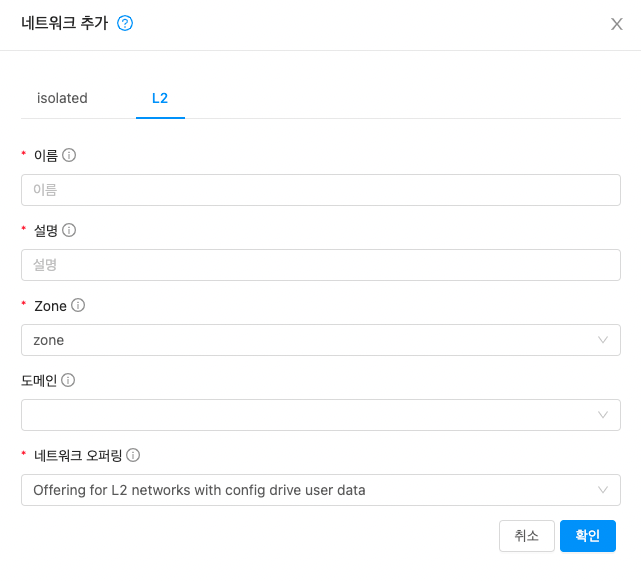
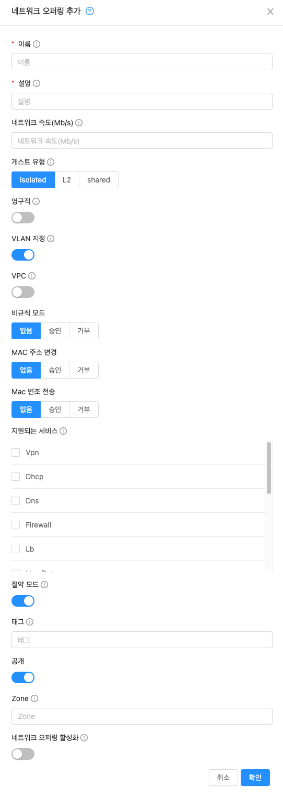

# 사용자 네트워크 관리
클라우드 인프라를 사용하는 사람들은 클라우드에서 제공하는 네트워킹 서비스와 관련하여 다양한 요구와 선호를 가지고 있습니다. Mold 관리자는 다음 작업을 수행하여 사용자를 위한 네트워킹을 설정할 수 있습니다.

* zone에 물리적 네트워크 설정
* 단일 물리적 네트워크 (예 : Cisco 및 Juniper 방화벽 모두)에서 동일한 서비스에 대해 여러 공급자를 설정합니다.
* 다양한 유형의 네트워크 서비스를 네트워크 오퍼링에 번들링하여 사용자가 주어진 가상 머신에 대해 원하는 네트워크 서비스를 선택할 수 있습니다.
* 시간이 지남에 따라 새로운 네트워크 제품을 추가하여 최종 사용자가 네트워크에서 더 나은 서비스 등급으로 업그레이드할 수 있습니다.
* 사용자가 구성원인 프로젝트를 통해 사용자가 네트워크에 액세스할 수 있는 더 많은 방법을 제공합니다.

## 가상 네트워크 정보
가상 네트워크는 단일 물리적 네트워크에서 다중 테넌시를 가능하게 하는 논리적 구조입니다. Mold에서 가상 네트워크는 공유되거나 격리될 수 있습니다.

<H3>Isolated 네트워크</H3>

격리된 네트워크는 단일 계정의 가상 머신에서만 액세스할 수 있습니다. 격리된 네트워크에는 다음과 같은 속성이 있습니다.

* VLAN과 같은 리소스는 동적으로 할당되고 가비지 수집됩니다.
* 전체 네트워크에 대해 하나의 네트워크 오퍼링이 있습니다.
* 네트워크 오퍼링은 업그레이드 또는 다운 그레이드할 수 있지만 전체 네트워크 용입니다.

자세한 내용은 "고급 zone에서 게스트 트래픽 구성"을 참조하십시오.

<H3>Public 네트워크</H3>
공유 네트워크는 여러 계정에 속한 가상 머신에서 액세스할 수 있습니다.

* 공유 네트워크는 관리자가 생성합니다.
* 공유 네트워크는 특정 도메인에 지정할 수 있습니다.
* VLAN 및 매핑되는 물리적 네트워크와 같은 공유 네트워크 리소스는 관리자가 지정합니다.
* 공유 네트워크는 보안 그룹으로 격리될 수 있습니다.
* 공용 네트워크는 최종 사용자에게 표시되지 않는 공유 네트워크입니다.
* 서비스 제공자가 가상 ​​라우터인 경우 공유 네트워크에서 zone당 소스 NAT가 지원되지 않습니다. 그러나 계정당 소스 NAT는 지원됩니다. 자세한 내용은 "공유 게스트 네트워크 구성"을 참조하십시오.

<H3>L2 네트워크</H3>
L2 네트워크는 다른 서비스 없이 네트워크 격리를 제공합니다. 이것은 가상 라우터가 없음을 의미합니다. 최종 사용자가 자신의 IPAM을 가지고 있거나 IP 주소를 정적으로 할당한다고 가정합니다.

* L2 네트워크는 최종 사용자가 만들 수 있지만 네트워크 생성자가 VLAN을 지정할 수 있는 네트워크 제품은 루트 관리자만 만들 수 있습니다.
* Mold은 VM에 IP 주소를 할당하지 않습니다.
* 사용자 데이터 및 메타 데이터는 구성 드라이브를 사용하여 VM에 전달할 수 있습니다 (네트워크 서비스 제공에서 활성화해야 함).

다음은 일반 사용자 계정의 GUI 대화 상자의 예입니다.

<H3>가상 네트워크 리소스의 런타임 할당</H3>
새 가상 네트워크를 정의하면 해당 네트워크에 대한 모든 설정이 Mold에 저장됩니다. 실제 네트워크 리소스는 첫 번째 가상 머신이 네트워크에서 시작될 때만 활성화됩니다. 모든 가상 머신이 가상 네트워크를 벗어나면 네트워크 리소스가 가비지 수집되어 다시 할당될 수 있습니다. 이는 네트워크 리소스를 절약하는 데 도움이 됩니다.

## 네트워크 서비스 제공 업체
!!! note
    지원되는 네트워크 서비스 공급자의 최신 목록은 Mold UI를 참조하거나 listNetworkServiceProviders를 호출 하십시오.

서비스 공급자(네트워크 요소라고도 함)는 네트워크 서비스를 가능하게 하는 하드웨어 또는 가상 어플라이언스입니다. 예를 들어 방화벽 서비스를 제공하기 위해 방화벽 어플라이언스를 클라우드에 설치할 수 있습니다. 단일 네트워크에서 여러 공급자가 동일한 네트워크 서비스를 제공할 수 있습니다. 예를 들어 동일한 물리적 네트워크에 있는 Cisco 또는 Juniper 장치에서 방화벽 서비스를 제공할 수 있습니다.

네트워크에 동일한 서비스 제공 업체의 여러 인스턴스가 있을 수 있습니다 (예 : 하나 이상의 Juniper SRX 디바이스).

다른 공급자가 네트워크에서 동일한 서비스를 제공하도록 설정된 경우 관리자는 네트워크 제품을 생성하여 사용자가 선호하는 네트워크 서비스 공급자를 지정할 수 있습니다 (네트워크 제품에서 제공되는 다른 선택 사항과 함께). 그렇지 않으면 Mold는 서비스가 호출될 때마다 사용할 공급자를 선택합니다.

지원되는 네트워크 서비스 제공 업체

Mold는 지원되는 서비스 제공 업체의 내부 목록과 함께 제공되며 네트워크 오퍼링을 생성할 때 이 목록에서 선택할 수 있습니다.

||
가상 라우터
|
Citrix NetScaler
|
Juniper SRX
|
F5 BigIP
|
호스트 기반 (KVM/Xen)
|
|:---|:---|:---|:---|:---|:---|
|Remote Access VPN|Yes|No|No|No|No|
|DNS/DHCP/User Data|Yes|No|No|No|No|
|Firewall|Yes|No|Yes|No|No|
|Load Balancing|Yes|Yes|No|Yes|No|
|Elastic IP|No|Yes|No|No|No|
|Elastic LB|No|Yes|No|No|No|
|Source NAT|Yes|No|Yes|No|No|
|Static NAT|Yes|Yes|Yes|No|No|
|Port Forwarding|Yes|No|Yes|No|No|

## 네트워크 제품
!!! note
    지원되는 네트워크 서비스의 최신 목록은 Mold UI를 참조하거나 listNetworkServices를 호출하십시오.

네트워크 오퍼링은 다음과 같은 명명된 네트워크 서비스 세트입니다.

* DHCP
* DNS
* 소스 NAT
* 정적 NAT
* 포트 포워딩
* 부하 분산
* 방화벽
* VPN
* (선택 사항) 방화벽 용 Juniper와 같이 특정 서비스에 사용할 수 있는 여러 공급자 중 하나를 지정합니다.
* (선택 사항) 사용할 물리적 네트워크를 지정하는 네트워크 태그

새 VM을 만들 때 사용자는 사용 가능한 네트워크 제품 중 하나를 선택하고 VM이 사용할 수 있는 네트워크 서비스를 결정합니다.

Mold 관리자는 Mold에서 제공하는 기본 네트워크 오퍼링 외에 원하는 수의 사용자 정의 네트워크 오퍼링을 생성할 수 있습니다. 여러 사용자 지정 네트워크 제품을 생성하여 단일 다중 테넌트 물리적 네트워크에서 다양한 서비스 클래스를 제공하도록 클라우드를 설정할 수 있습니다. 예를 들어 기본 물리적 배선은 두 테넌트에 대해 동일할 수 있지만 테넌트 A는 웹 사이트에 대한 간단한 방화벽 보호만 필요할 수 있지만 테넌트 B는 웹 서버 팜을 실행하고 확장 가능한 방화벽 솔루션, 로드 밸런싱 솔루션 및 데이터베이스 백엔드에 액세스하기 위한 대체 네트워크.

!!! note
    NetScaler와 같은 외부로드 밸런서 장치를 포함하는 네트워크 서비스 오퍼링을 사용하는 동안 로드 밸런싱 규칙을 생성하고 나중에 네트워크 서비스 오퍼링을 Mold 가상 라우터를 사용하는 것으로 변경하는 경우, 가상 라우터에 대한 방화벽 규칙을 생성해야 합니다. 기존로드 밸런싱 규칙이 계속 작동하도록합니다.

새 가상 네트워크를 생성할 때 Mold 관리자는 해당 네트워크에 사용할 네트워크 제품을 선택합니다. 각 가상 네트워크는 하나의 네트워크 제품과 연결됩니다. 가상 네트워크는 관련 네트워크 오퍼링을 변경하여 업그레이드하거나 다운 그레이드할 수 있습니다. 이렇게하면 일치하도록 물리적 네트워크를 다시 프로그래밍해야 합니다.

Mold에는 Mold 시스템 VM에서 사용할 수 있는 내부 네트워크 제품도 있습니다. 이러한 네트워크 오퍼링은 사용자에게 표시되지 않지만 관리자가 수정할 수 있습니다.

<H3>새로운 네트워크 오퍼링 생성</H3>

네트워크 오퍼링을 생성하려면 :

1. Mold UI에 관리자 권한으로 로그인합니다.
2. 왼쪽 탐색 줄에서 서비스 오퍼링을 클릭하십시오.
3. 네트워크 오퍼링을 선택하십시오.
4. 네트워크 오퍼링 추가를 클릭하십시오.
5. 대화 상자에서 다음을 선택합니다.
    * 이름 : 네트워크 오퍼링에 대해 원하는 이름입니다.
    * 설명 : 사용자에게 표시할 수 있는 오퍼링에 대한 간단한 설명입니다.
    * 네트워크 속도 (Mb/s) : 허용되는 데이터 전송률 (Mb/s) 입니다.
    * 게스트 유형 : 게스트 네트워크가 격리되는지 또는 공유되는지 선택합니다. 이 용어에 대한 설명은 "가상 네트워크 정보"를 참조하십시오.
    * 영구적 : 게스트 네트워크가 영구적인지 여부를 나타냅니다. VM을 배포하지 않고도 프로비저닝할 수 있는 네트워크를 영구 네트워크라고 합니다. 자세한 내용은 "영구 네트워크"를 참조하십시오.
    * VLAN을 지정 : (격리된 게스트 네트워크만 해당)이 오퍼링을 사용할 때 VLAN을 지정할 수 있는지 여부를 표시합니다. 이 옵션을 선택하고 나중에 VPC 계층 또는 격리된 네트워크를 생성하는 동안 이 네트워크 제품을 사용하는 경우 생성한 네트워크에 대한 VLAN ID를 지정할 수 있습니다.
    * VPC : 이 옵션은 게스트 네트워크가 Virtual Private Cloud를 사용하는지 여부를 나타냅니다. Virtual Private Cloud (VPC)는 Mold의 격리된 비공개 부분입니다. VPC는 기존의 물리적 네트워크와 유사한 자체 가상 네트워크 토폴로지를 가질 수 있습니다. VPC에 대한 자세한 내용은 "가상 사설 클라우드 정보"를 참조하십시오.
    * 비규칙 모드 : 비규칙 모드 (없음, 승인, 거부)
    * MAC 주소 변경 : MAC 주소 변경 (없음, 승인, 거부)
    * MAC 변조 전송 : MAC 변조 전송 (없음, 승인, 거부)
    * 지원되는 서비스 :가능한 네트워크 서비스 중 하나 이상을 선택하십시오. 일부 서비스의 경우 서비스 제공 업체도 선택해야합니다. 예를 들어, Load Balancer를 선택하면 Mold 가상 라우터 또는 클라우드에 구성된 다른로드 밸런서를 선택할 수 있습니다. 선택한 서비스에 따라 나머지 대화 상자에 추가 필드가 나타날 수 있습니다.
    선택한 게스트 네트워크 유형에 따라 다음과 같은 지원 서비스를 볼 수 있습니다.

    |
지원 서비스
|
기술
|
격리된
|
공유
|
    |:---|:---|:---|:---|
    |DHCP|자세한 내용은 "DNS 및 DHCP"를 참조하십시오.|지원|지원|
    |DNS|자세한 내용은 "DNS 및 DHCP"를 참조하십시오.|지원|지원|
    |Load Balancer|Load Balancer를 선택하면 Mold 가상 라우터 또는 클라우드에 구성된 다른로드 밸런서를 선택할 수 있습니다.|지원|지원|
    |Firewall|자세한 내용은 관리 안내서를 참조하십시오.|지원|지원|
    |Source NAT|소스 NAT를 선택하면 Mold 가상 라우터 또는 클라우드에 구성된 다른 소스 NAT 공급자를 선택할 수 있습니다.|지원|지원|
    |Static NAT|정적 NAT를 선택하면 Mold 가상 라우터 또는 클라우드에 구성된 다른 정적 NAT 공급자를 선택할 수 있습니다.|지원|지원|
    |Port Forwarding|포트 전달을 선택하면 Mold 가상 라우터 또는 클라우드에 구성된 다른 포트 전달 공급자를 선택할 수 있습니다.|지원|지원되지 않음|
    |VPN|자세한 내용은 "원격 액세스 VPN"을 참조하십시오.|지원|지원되지 않음|
    |User Data|자세한 내용은 "사용자 데이터 및 메타 데이터"를 참조하십시오.|지원되지 않음|지원|
    |Network ACL|자세한 내용은 "네트워크 액세스 제어 목록 구성"을 참조하십시오.|지원|지원되지 않음|
    |Security Groups|자세한 내용은 "보안 그룹 추가"를 참조하십시오.|지원되지 않음|지원|

    * 절약 모드 : 절약 모드 사용 여부를 표시합니다. 이 모드에서 네트워크 리소스는 첫 번째 가상 머신이 네트워크에서 시작될 때만 할당됩니다. 보수 모드가 꺼져 있으면 공용 IP는 단일 서비스에만 사용할 수 있습니다. 예를 들어 포트 전달 규칙에 사용되는 공용 IP는 StaticNAT 또는 부하 분산과 같은 다른 서비스를 정의하는 데 사용할 수 없습니다. 절약 모드가 켜져 있으면 동일한 공용 IP에 둘 이상의 서비스를 정의할 수 있습니다.
    * 태그 : 사용할 물리적 네트워크를 지정하는 네트워크 태그입니다.
    * 공개 : 네트워크 오퍼링을 모든 도메인에서 사용할 수 있는지 아니면 일부 도메인에서만 사용할 수 있는지 여부를 나타냅니다. 예를 선택하면 모든 도메인에서 사용할 수 있습니다. 범위를 하나 이상의 도메인으로 제한하려면 아니요를 선택합니다.
    * Zone : 네트워크 오퍼링을 사용할 수 있는 zone을 제어합니다. '모든 Zone'또는 특정 Zone만 선택할 수 있습니다.
    * 네트워크 오퍼링 활성화 : 생성 중에 오퍼링을 사용하려면 true로 설정하십시오. 기본값은 거짓입니다.
6. 확인을 클릭하십시오.

## NetScaler를 사용하지 않고 AutoScale 구성
<H3>AutoScaling이란 무엇입니까?</H3>
AutoScaling을 사용하면 정의한 조건에 따라 백엔드 서비스 또는 애플리케이션 VM을 원활하고 자동으로 확장 또는 축소할 수 있습니다. AutoScaling을 활성화하면 사용 중인 VM 수가 수요가 증가하면 원활하게 확장되고 수요가 감소하면 자동으로 감소하도록할 수 있습니다. 따라서 미사용 VM을 자동으로 종료하고 수동 개입 없이 필요할 때 새 VM을 시작하여 컴퓨팅 비용을 절약할 수 있습니다.

<H3>하이퍼 바이저 지원</H3>
NetScaler가 없는 AutoScaling은 Xenserver만 지원합니다. KVM도 지원하기 위해 노력하고 있습니다.
!!! warning
    하이퍼바이저가 Xenserver인 경우에만 AutoScaling 가능합니다.

<H3>전제 조건</H3>
AutoScale 규칙을 구성하기 전에 다음 사항을 고려하십시오.

* AutoScale을 구성하기 전에 필요한 템플릿이 준비되었는지 확인하십시오. 먼저 Xenserver가 성능 매개 변수 (CPU 및 메모리)를 VM에 수집하는 데 도움이 되는 PV 드라이버를 설치해야 합니다. 또한 템플릿을 사용하여 VM을 배포할 때 응용 프로그램이 실행 중이어야 합니다.

<H3>구성</H3>
* 템플릿 : 템플릿은 기본 OS 이미지와 애플리케이션으로 구성됩니다. 확장 작업에서 애플리케이션의 새 인스턴스를 프로비저닝하는 데 템플릿이 사용됩니다. VM이 템플릿에서 배포되면 VM은 관리자 개입 없이 로드 밸런서에서 트래픽 가져오기를 시작할 수 있습니다. 예를 들어, VM이 웹 서비스용으로 배포된 경우 웹 서버가 실행되고 데이터베이스가 연결되어 있어야 합니다.
* 컴퓨트 오퍼링 : 사용자가 새 가상 머신 인스턴스를 만들 때 선택할 수 있는 CPU 속도, CPU 수 및 RAM 크기를 포함하여 미리 정의된 가상 하드웨어 속성 집합입니다. 확장 작업의 일부로 VM 인스턴스를 프로비저닝하는 동안 사용할 컴퓨팅 제품 중 하나를 선택합니다.
* 최소 인스턴스 : 부하 분산 규칙에 할당된 최소 활성 VM 인스턴스 수입니다. 활성 VM 인스턴스는 작동 중이고 트래픽을 제공하며 부하 분산 중인 애플리케이션 인스턴스입니다. 이 매개 변수는 부하 분산 규칙에 트래픽을 제공하는 데 사용할 수 있는 활성 VM 인스턴스 수를 최소한 구성된 수 만큼 포함합니다.
* 최대 인스턴스 : 부하 분산 규칙에 할당해야 하는 최대 활성 VM 인스턴스 수입니다. 이 매개 변수는 부하 분산 규칙에 할당할 수 있는 활성 VM 인스턴스의 상한을 정의합니다. 최대 인스턴스 매개 변수에 큰 값을 지정하면 많은 수의 VM 인스턴스가 프로비저닝될 수 있으며, 결과적으로 단일 부하 분산 규칙이 계정 또는 도메인 수준에서 지정된 VM 인스턴스 제한을 소진하게 됩니다. 다음과 같은 확장 및 축소 정책을 지정합니다.
* 기간 : 확장 작업을 트리거하기 위해 지정한 조건이 참이어야 하는 기간 (초)입니다. 정의된 조건은 AutoScale 작업이 호출되도록 지정한 전체 기간 동안 참이어야 합니다.
* 카운터 : 성능 카운터는 모니터링되는 인스턴스의 상태를 노출합니다. 이 기능을 사용하기 위해 두 개의 새로운 카운터를 추가했습니다.
    * Linux 사용자 CPU [기본]-백분율
    * Linux 사용자 RAM [기본]-백분율
그들 중 하나를 선택하는 것을 잊지 마십시오. 다른 것을 선택하면 자동 확장이 작동하지 않습니다.
* 연산자 : AutoScale 기능에서는보다 큼, 보다 작음, 보다 작거나 같음, 보다 크거나 같음 및 같음의 다섯 가지 관계 연산자가 지원됩니다.
* 임계 값 : 카운터에 사용할 임계 값입니다. 위에 정의된 카운터가 임계 값을 위반하면 AutoScale 기능이 확장 또는 축소 작업을 시작합니다.
* 추가 : 추가를 클릭하여 조건을 추가합니다.
또한 고급 설정을 구성하려면 고급 설정 표시를 클릭하고 다음을 지정합니다.
* 폴링 간격 : 스케일 업 또는 다운 작업을 수행하기 전에 조건, 카운터 조합, 운영자 및 임계 값을 평가하는 빈도입니다. 기본 폴링 간격은 30초입니다.
* Quiet Time : AutoScale 작업이 시작된 후의 냉각 기간입니다. 이 시간에는 템플릿에서 VM 인스턴스 프로비저닝을 완료하는 데 걸린 시간과 애플리케이션이 트래픽을 제공할 준비가되는 데 걸린 시간이 포함됩니다. 이 조용한 시간을 통해 어떤 조치를 취하기 전에 함대가 안정된 상태에 도달 할수 있습니다. 기본값은 300초입니다.
* VM 제거 유예 기간 : 축소 작업이 시작된 후 축소 작업의 일부로 VM이 제거되기 전까지 대기하는 기간 (초)입니다. 이는 폐기로 표시된 VM에서 제공하는 보류 중인 세션 또는 트랜잭션을 정상적으로 종료하기 위한 것입니다. 기본값은 120초입니다.
* 적용 : 적용을 클릭하여 AutoScale 구성을 만듭니다.

<H3>AutoScale 구성 비활성화 및 활성화</H3>
AutoScale VM 인스턴스에서 유지 관리 작업을 수행하려면 AutoScale 구성을 사용 중지합니다. AutoScale 구성이 비활성화되면 확장 또는 축소 작업이 수행되지 않습니다. 유지 보수 활동에 이 다운 타임을 사용할 수 있습니다. AutoScale 구성을 비활성화하려면 Disable AutoScale 버튼을 클릭합니다.

이 버튼은 AutoScale의 현재 활성화 여부에 따라 활성화와 비활성화 사이를 전환합니다. 유지 관리 작업이 완료된 후 AutoScale 구성을 다시 활성화할 수 있습니다. 활성화하려면 AutoScale 구성 페이지를 다시 연 다음 Enable AutoScale 버튼을 클릭합니다.

<H3>AutoScale 구성 업데이트</H3>
다양한 매개 변수를 업데이트하고 확장 또는 축소 규칙에서 조건을 추가하거나 삭제할 수 있습니다. AutoScale 구성을 업데이트하기 전에 Disable AutoScale 버튼을 클릭하여 AutoScale로드 밸런서 규칙을 비활성화해야 합니다.

필수 AutoScale 매개 변수를 수정한 후 적용을 클릭합니다. 새로운 AutoScale 정책을 적용하려면 AutoScale 구성 페이지를 다시 연 다음 Enable AutoScale 버튼을 클릭합니다.

<H3>런타임 고려 사항</H3>
관리자는 AutoScale에 대해 구성된 부하 분산 규칙에 VM을 할당하면 안됩니다.

자동 확장된 VM에서 destroyVM과 같은 AutoScale의 컨텍스트 외부에서 API를 호출하면 부하 분산 구성이 일관성 없는 상태가 됩니다. VM은 로드 밸런서 규칙에서 제거되지만 AutoScale 컨텍스트 내에서 규칙에 할당된 서비스로 계속 표시됩니다.