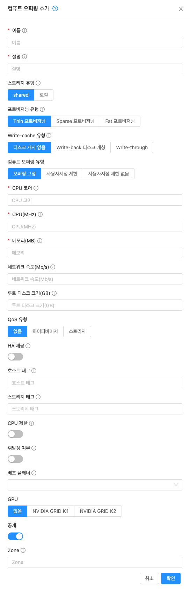

# 서비스오퍼링 관리
서비스오퍼링이란 사용자 UI뿐만 아니라 가상 머신, 디스크 스토리지 등을 생성하기 위한 템플릿과 같이 사용자가 선택할 수 있는 옵션 및 리소스 집합을 의미합니다. 
ABLESTACK를 상용 서비스를 실행하는 경우(Public Cloud) 사용자가 소비하는 서비스 및 리소스를 추적하고 해당 사용에 대해 비용을 청구할 수 있는 상품의 기본 베이스가 될 수 있습니다. 
Private Cloud와 같이 사용하는 데 비용을 청구하지 않더라도 사용하는 서비스와 어떤 서비스 오퍼링이 많은지를 추적할 수 있습니다.

## 서비스 제품, 디스크 제품, 네트워크 제품 및 템플릿
새 인스턴스를 만드는 사용자는 그 특성과 기능에 대해 다양한 선택을 할 수 있습니다. Mold는 새 인스턴스를 생성할 때 사용자에게 선택권을 제공하는 여러 가지 방법을 제공합니다.

* Mold 관리자가 정의한 서비스 오퍼링은 CPU 속도, CPU 수, RAM 크기, 루트 디스크의 태그 및 기타 선택 사항을 제공합니다. 새 컴퓨트 오퍼링 생성을 참조하십시오.
* Mold 관리자가 정의한 디스크 오퍼링은 기본 데이터 스토리지에 대한 디스크 크기 및 IOPS (서비스 품질)를 선택할 수 있습니다. 새 디스크 제공 생성을 참조하십시오.
* Mold 관리자가 정의한 네트워크 오퍼링은 주어진 게스트 네트워크의 가상 라우터 또는 외부 네트워킹 장치에서 최종 사용자가 사용할 수 있는 기능 세트를 설명합니다. 네트워크 오퍼링을 참조하십시오.
* Mold 관리자 또는 Mold 사용자가 정의한 템플릿은 사용자가 새 인스턴스를 만들 때 선택할 수 있는 기본 OS 이미지입니다. 예를 들어 Mold는 CentOS를 템플릿으로 포함합니다. 템플릿 작업을 참조하십시오.

사용자에게 제공되는 이러한 선택 사항 외에도 Mold 루트 관리자만 사용할 수 있고 가상 인프라 리소스를 구성하는 데 사용되는 다른 유형의 서비스 제공이 있습니다. 자세한 내용은 시스템 서비스 제공으로 가상 라우터 업그레이드를 참조하십시오.

<H3>범위</H3>
컴퓨트 오퍼링, 디스크 오퍼링, 네트워크 오퍼링 및 VPC 오퍼링은 특정 도메인과 zone의 조합 또는 모든 도메인과 zone으로 범위를 지정할 수 있습니다.

기존 오퍼링은 UI를 통해 또는 "domainid"및 "zoneid"매개 변수를 전달하여 updateServiceOffering, updateDiskOffering, updateNetworkOffering 및 updateVpcOffering API 호출을 통해 업데이트할 수 있습니다.

루트 관리자는 UI를 통해 또는 updateServiceOffering API 호출에서 "domainid=public"을 전달하여 도메인별 오퍼링을 공개 오퍼링으로 변경할 수 있습니다. 모든 zone에서 zone별 오퍼링을 사용할 수 있도록 하려면 루트 관리자가 API 호출에 "zoneid=all"을 포함하거나 UI를 통해 작업을 수행해야 합니다.

도메인 관리자는 서비스를 업데이트 하거나 오퍼링을 계산할 수 있는 제한된 범위를 갖습니다. 오퍼링을 사용할 수 있는 zone을 변경할 수 없으며 오퍼링의 이름, 표시 텍스트 또는 정렬 키를 변경할 수 없습니다. 오퍼링의 범위가 도메인 관리자가 관리자인 도메인 
둘 중 하나와 하위 도메인으로만 제한되는 경우 오퍼링을 사용할 수 있는 도메인을 변경할 수 있습니다.

## 컴퓨트 및 디스크 서비스 오퍼링
서비스 오퍼링은 CPU 코어 수 및 속도, 메모리 및 디스크 크기와 같은 가상 하드웨어 기능 세트입니다. Mold 관리자는 다양한 오퍼링을 설정할 수 있으며 최종 사용자는 새 VM을 생성할 때 사용 가능한 오퍼링 중에서 선택할 수 있습니다. 사용자가 선택한 제품에 따라 Mold는 청구 시스템과 통합할 수 있는 사용 기록을 내보냅니다.

컴퓨트 오퍼링은 "고정", "사용자 제한" 또는 "사용자 제한 없음"으로 설정할 수 있습니다.

고정 오퍼링에서 각 서비스 오퍼링의 CPU 수, 메모리 및 CPU frequecy는 Mold 관리자가 사전 정의하며, 사용자 지정 제한되지 않은 오퍼링에서는 최종 사용자가 게스트 인스턴스를 생성할 때 원하는 값을 입력할 수 있도록 정의되지 않은 상태로 유지됩니다. 사용자 지정 제한 제품이 도입되어 최종 사용자가 관리자가 설정한 제약 조건 내에서 필요한 CPU 및 메모리 수를 입력할 수 있습니다. 제약 조건은 사용자 지정 제약 제품에 따라 다를 수 있습니다. 사용자가 원할 수 있는 모든 상상할 수 있는 값 조합에 대해 컴퓨트 오퍼링을 정의하는 대신, 관리자는 사용자에게 약간의 유연성을 제공하고 다양한 VM 구성의 기반으로 사용할 수 있는 오퍼링을 정의할 수 있습니다.

서비스 오퍼링에는 다음 요소가 포함됩니다.

* CPU, 메모리 및 네트워크 리소스 보장
* 리소스 측정 방법
* 리소스 사용량이 청구되는 방법
* 요금이 생성되는 빈도

예를 들어, 하나의 서비스 오퍼링을 통해 사용자는 1GHz Intel® Core ™ 2 CPU와 동일한 가상 머신 인스턴스를 생성할 수 있습니다. 1GB 메모리는 시간당 $0.20/GB이고 네트워크 트래픽은 $0.10/GB로 측정됩니다.

Mold는 서비스 오퍼링을 컴퓨트 오퍼링과 디스크 오퍼링으로 분리합니다. 컴퓨팅 서비스 오퍼링은 다음을 지정합니다.

* 게스트 CPU (옵션). Mold 관리자가 정의하지 않은 경우 사용자는 CPU 속성을 선택할 수 있습니다.
* 게스트 RAM (선택 사항). Mold 관리자가 정의하지 않은 경우 사용자는 RAM을 선택할 수 있습니다.
* 게스트 네트워킹 유형 (가상 또는 직접)
* 루트 디스크 크기 (선택 사항). Mold 관리자가 정의하지 않은 경우 사용자는 사용자 지정 루트 디스크 크기를 설정할 수 있습니다.
* 루트 디스크의 태그

디스크 오퍼링은 다음을 지정합니다.

* 디스크 크기 (선택 사항). Mold 관리자가 정의하지 않은 경우 사용자는 디스크 크기를 선택할 수 있습니다.
* 데이터 디스크의 태그

사용자 정의 오퍼링을 지원하기 위해 사용 이벤트는 동적으로 할당된 자원에 대한 이벤트를 등록합니다. 사용 이벤트는 사용자 지정 컴퓨팅 제품에서 VM이 생성될 때와 중지되거나 실행 중인 VM의 컴퓨팅 제품을 변경할 때 등록됩니다. CPU, 속도, RAM과 같은 매개 변수 값이 기록됩니다.

<H3>새 컴퓨트 오퍼링 생성</H3>
<center></center>

1. Mold UI에 관리자 권한으로 로그인합니다.
2. 왼쪽 탐색 줄에서 서비스 오퍼링을 클릭하십시오.
3. 컴퓨트 오퍼링을 선택합니다.
4. 컴퓨트 오퍼링 추가를 클릭하십시오.
5. 대화 상자에서 다음을 선택합니다.
    * 이름 : 컴퓨트 오퍼링에 대해 원하는 이름입니다.
    * 설명 : 사용자에게 표시할 수 있는 오퍼링에 대한 간단한 설명
    * 스토리지 유형 : 할당해야 하는 디스크 유형입니다. 로컬은 시스템 VM이 실행 중인 호스트에 직접 연결된 스토리지에서 할당합니다. NFS를 통해 액세스할 수 있는 스토리지에서 공유 할당.
    * 프로비저닝 유형 : 할당해야 하는 디스크 유형입니다.
    * Write-cache 유형 : 이 디스크 오퍼링에 사용할 캐시 모드. (none, writeback, writethrough)
    * 컴퓨트 오퍼링 유형 : 최종 사용자가 이 컴퓨트 오퍼링을 사용할 때 인스턴스가 갖는 컴퓨팅 성능을 사용자 지정해야 하는 자유의 정도입니다. 옵션은 다음과 같습니다. 오퍼링 고정은 사용자가 사용자 정의할 수 없습니다. 사용자지정 제한은 사용자가 오퍼링에서 설정한 매개 변수 내에서 컴퓨팅을 사용자 정의할 수 있습니다. 사용자지정 제한 없음은 사용자가 '사용자지정 제한 없음'보다 '사용자지정 제한' 이 권장되는 값을 설정할 수 있습니다. 관리자가 몇 가지 경계를 설정할 수 있기 때문입니다.
    * CPU 코어 :이 오퍼링을 통해 시스템 VM에 할당해야 하는 코어 수입니다. '사용자지정 제한'을 선택하면 관리자에게 사용자가 요청할 수 있는 최소 및 최대 CPU 수를 입력하라는 메시지가 표시됩니다. '사용자지정 제한 없음'를 선택하면 게스트 인스턴스를 만들 때 값을 입력하라는 메시지가 사용자에게 표시되므로 이 필드가 나타나지 않습니다.
    * CPU (MHz) : 게스트 인스턴스가 할당된 코어의 CPU 속도입니다. 예를 들어 "2000"은 2GHz CPU 클럭 속도를 제공합니다. 이 설정은 CPU 캡이 선택된 경우에만 사용됩니다. 이 값은 하이퍼바이저 호스트가 오버 프로비저닝될 때 VM에 상대적 우선 순위를 부여하기 위해 공유 값으로 하이퍼바이저에 전달됩니다. '사용자지정 제한 없음'를 선택하면 게스트 인스턴스를 만들 때 사용자에게 값을 입력하라는 메시지가 표시되므로 이 필드가 나타나지 않습니다.
    * 메모리 (MB) : 시스템 VM에 할당해야 하는 메모리 양(MB) 입니다. 예를 들어 "2048"은 2GB RAM 할당을 제공합니다. '사용자 지정 제한'을 선택한 경우 관리자는 사용자가 요청할 수 있는 최소 및 최대 RAM 양을 입력하라는 메시지가 표시됩니다. '사용자지정 제한 없음'를 선택한 경우 게스트 인스턴스를 생성할 때 사용자에게 값을 입력하라는 메시지가 표시되므로 이 필드가 나타나지 않습니다.
    * 네트워크 속도 : 허용된 데이터 전송 속도 (초당 MB)입니다.
    * 루트 디스크 크기(GB) : 루트 디스크 크기 (GB)
    * QoS 유형: 세 가지 옵션 : 없음 (서비스 품질 없음), 하이퍼바이저 (하이퍼바이저 측에 적용되는 속도 제한) 및 스토리지 (스토리지 측에 적용되는 최소 및 최대 IOPS 보장). QoS를 활용하는 경우 하이퍼바이저 또는 스토리지 시스템이 이 기능을 지원하는지 확인하십시오.
    * HA 제공 : 관리자는 시스템 VM을 모니터링하고 고가용성을 제공하도록 선택할 수 있습니다.
    * 호스트 태그 : (선택 사항) 호스트를 구성하는 데 사용하는 모든 태그

    * 스토리지 태그 : 시스템 VM에서 사용하는 기본 스토리지와 연결되어야 하는 태그입니다.
    * CPU 제한 : 여유 용량이 있는 경우에도 CPU 사용량을 제한할지 여부입니다.
    * 휘발성 여부 : VM을 재부팅할 때마다 원래 루트 디스크가 분리된 다음 파괴되고 새로운 루트 디스크가 생성되어 VM에 연결되도록 가상 시스템이 휘발성이어야 하는 경우 true로 설정합니다.
    * 배포 플래너 : 이전 필드에서 ImplicitDedicationPlanner를 선택한 경우 사용됩니다. 플래너 모드는 단일 도메인 또는 계정 전용 개인 인프라에 VM을 배포하는 방법을 결정합니다.
        * 엄격 : 호스트는 여러 계정에서 공유되지 않습니다. 예를 들어, 엄격한 암시적 전용은 데스크톱과 같은 특정 유형의 응용 프로그램을 배포하는데 유용합니다. 데스크톱 소프트웨어의 라이선스 약관을 위반하지 않고 다른 계정간에 호스트를 공유할 수 없습니다.
        * 권장 : 가능하면 VM이 전용 인프라에 배포됩니다. 그렇지 않으면 VM을 공유 인프라에 배포할 수 있습니다.
    * GPU : 물리적 GPU (GPU-passthrough) 또는 물리적 GPU 카드 (vGPU)의 일부를 게스트 VM에 할당합니다. 그래픽 애플리케이션을 VM에서 실행할 수 있습니다. 지원되는 카드 목록에서 카드를 선택하십시오. 제공된 옵션은 NVIDIA GRID K1 및 NVIDIA GRID K2입니다. 단일 물리적 GPU에서 여러 vGPU를 허용하는 vGPU 지원 카드입니다.
    * 공개 : 컴퓨트 오퍼링을 모든 도메인에서 사용할 수 있는지 아니면 일부 도메인에서만 사용할 수 있는지 여부를 나타냅니다. 예를 선택하면 모든 도메인에서 사용할 수 있습니다. 범위를 하나 이상의 특정 도메인으로 제한하려면 아니요를 선택합니다.
    * zone : 컴퓨트 오퍼링을 사용할 수 있는 zone을 제어합니다. '모든 zone' 또는 특정 zone만 선택할 수 있습니다. 원하는 zone을 클릭하면 이 목록 상자에서 하나 이상의 zone을 선택할 수 있습니다.
6. 확인을 클릭하십시오.

<H3>새 디스크 오퍼링 생성</H3>
<center></center>

새 디스크 오퍼링을 생성하려면 :

1. Mold UI에 관리자 권한으로 로그인합니다.
2. 왼쪽 탐색 줄에서 서비스 오퍼링을 클릭하십시오.
3. 디스크 오퍼링을 선택합니다.
4. 디스크 오퍼링 추가를 클릭하십시오.
5. 대화 상자에서 다음을 선택합니다.
    * 이름 : 디스크 오퍼링에 대해 원하는 이름입니다.
    * 설명 : 사용자에게 표시할 수 있는 오퍼링에 대한 간단한 설명
    * 스토리지 유형 : 디스크 오퍼링의 스토리지 유형. 값은 로컬 또는 공유
    * 프로비저닝 유형 : 볼륨을 만드는 데 사용되는 프로비저닝 유형입니다. 유효한 값은 thin, sparse, fat
    * 사용자지정 디스크 크기 : 체크시 사용자가 자신의 디스크 크기를 설정할 수 있습니다. 선택하지 않으면 루트 관리자가 디스크 크기에 값을 정의해야 합니다.
    * QoS 유형 : 세 가지 옵션 : 없음 (서비스 품질 없음), 하이퍼바이저 (하이퍼바이저 측에 적용되는 속도 제한) 및 스토리지 (스토리지 측에 적용되는 최소 및 최대 IOPS 보장). QoS를 활용하는 경우하이퍼바이저 또는 스토리지 시스템이이 기능을 지원하는지 확인하십시오.
    * Write-cache 유형 : 이 디스크 오퍼링에 사용할 캐시 모드. (none, writeback, writethrough)
    * (선택 사항) 스토리지 태그 : 이 디스크의 기본 스토리지와 연결되어야 하는 태그입니다. 태그는 쉼표로 구분된 스토리지 속성 목록입니다. 예 : "ssd, blue". 태그는 기본 스토리지에도 추가됩니다. Mold는 디스크 오퍼링의 태그를 스토리지의 태그와 일치시킵니다. 디스크 오퍼링에 태그가 있는 경우 해당 태그 (또는 태그)가 볼륨을 프로비저닝하려면 기본 스토리지에도 있어야 합니다. 이러한 기본 스토리지가 없으면 디스크 오퍼링에서의 할당이 실패합니다.
    * 공개 : 컴퓨트 오퍼링을 모든 도메인에서 사용할 수 있는지 아니면 일부 도메인에서만 사용할 수 있는지 여부를 나타냅니다. 예를 선택하면 모든 도메인에서 사용할 수 있습니다. 범위를 하나 이상의 특정 도메인으로 제한하려면 아니요를 선택합니다.
    * zone : 컴퓨트 오퍼링을 사용할 수 있는 zone을 제어합니다. '모든 zone' 또는 특정 zone만 선택할 수 있습니다. 원하는 zone을 클릭하면 이 목록 상자에서 하나 이상의 zone을 선택할 수 있습니다.
6. 확인을 클릭하십시오.

<H3>서비스 오퍼링 수정 또는 삭제</H3>
서비스 오퍼링은 일단 생성되면 실질적으로 변경할 수 없습니다. 이는 컴퓨팅 제품과 디스크 제품 모두에 적용됩니다. 그러나 이름, 설명 및 범위는 수정할 수 있습니다. 이름 또는 설명을 편집하려면 서비스 제공의 세부 사항 페이지로 이동하여 편집 아이콘을 클릭하십시오. 오퍼링을 사용할 수 있는 범위 (zone 및 도메인)를 변경하려면 오퍼링 업데이트 액세스 버튼을 클릭하십시오.

서비스 오퍼링을 삭제할 수 있습니다. 더 이상 사용하지 않는 경우 즉시 영구적으로 삭제됩니다. 서비스 오퍼링이 아직 사용 중인 경우 이를 참조하는 모든 가상 머신이 삭제될 때까지 데이터베이스에 남아 있습니다. 관리자가 삭제한 후에는 새 인스턴스를 생성하는 최종 사용자가 서비스 제공을 사용할 수 없습니다.

## 시스템 서비스 오퍼링
시스템 서비스 오퍼링은 다른 서비스 오퍼링과 마찬가지로 CPU 속도, CPU 수, 태그 및 RAM 크기를 선택할 수 있습니다. 그러나 가상 머신 인스턴스에 사용되고 사용자에게 노출되는 대신 시스템 서비스 오퍼링은 가상 라우터, 콘솔 프록시 및 기타 시스템 VM의 기본 속성을 변경하는데 사용됩니다. 시스템 서비스 오퍼링은 Mold 루트 관리자 만 볼 수 있습니다. Mold는 기본 시스템 서비스 오퍼링을 제공합니다. Mold 루트 관리자는 추가 사용자 지정 시스템 서비스 제공을 생성할 수 있습니다.

Mold는 게스트 네트워크에 대한 가상 라우터를 생성할 때 네트워크 오퍼링과 관련된 시스템 서비스 오퍼링에 정의된 기본 설정을 사용합니다. 다른 시스템 서비스 오퍼링을 포함하는 새 네트워크 오퍼링을 적용하여 가상 라우터의 기능을 업그레이드할 수 있습니다. 해당 네트워크의 모든 가상 라우터는 새 서비스 제공의 설정을 사용하기 시작합니다.

<H3>새로운 시스템 오퍼링 생성</H3>
<center></center>

시스템 서비스 오퍼링을 생성하려면 :

1. Mold UI에 관리자 권한으로 로그인합니다.
2. 왼쪽 탐색 줄에서 서비스 오퍼링을 클릭하십시오.
3. 시스템 오퍼링을 선택하십시오.
4. 시스템 서비스 오퍼링 추가를 클릭하십시오.
5. 대화 상자에서 다음을 선택합니다.
    * 이름 : 시스템 오퍼링에 대해 원하는 이름입니다.
    * 설명 : 사용자에게 표시할 수 있는 오퍼링에 대한 간단한 설명
    * 시스템 VM 유형 :이 오퍼링이 지원할 시스템 가상 머신의 유형을 선택하십시오.
    * 스토리지 유형 : 할당해야 하는 디스크 유형입니다. 로컬은 시스템 VM이 실행 중인 호스트에 직접 연결된 스토리지에서 할당합니다. NFS를 통해 액세스할 수 있는 스토리지에서 공유 할당.
    * 프로비저닝 유형 : 할당해야 하는 디스크 유형입니다.
    * Write-cache 유형 : 이 디스크 오퍼링에 사용할 캐시 모드. (none, writeback, writethrough)
    * CPU 코어 : 이 오퍼링으로 시스템 VM에 할당해야 하는 코어 수
    * CPU (MHz) : 시스템 VM이 할당된 코어의 CPU 속도입니다. 예를 들어 "2000"은 2GHz 클럭을 제공합니다.
    * 메모리 (MB) : 시스템 VM에 할당해야 하는 메모리 양 (MB) 입니다. 예를 들어 "2048"은 2GB RAM 할당을 제공합니다.
    * 네트워크 속도 (Mb/s) : 허용된 데이터 전송 속도 (초당 MB)입니다.
    * 루트 디스크 크기(GB) : 루트 디스크 크기 (GB)
    * QoS 유형 : 세 가지 옵션 : 없음 (서비스 품질 없음), 하이퍼바이저 (하이퍼바이저 측에 적용되는 속도 제한) 및 스토리지 (스토리지 측에 적용되는 최소 및 최대 IOPS 보장). QoS를 활용하는 경우하이퍼바이저 또는 스토리지 시스템이 이 기능을 지원하는지 확인하십시오.
    * HA 제공 : 예인 경우 관리자는 시스템 VM을 모니터링하고 가능한 한 고가용성을 제공하도록 선택할 수 있습니다.
    * 호스트 태그 : (선택 사항) 호스트를 구성하는 데 사용하는 모든 태그
    * 스토리지 태그 : 시스템 VM에서 사용하는 기본 스토리지와 연결되어야 하는 태그입니다.
    * CPU 제한 : 여유 용량이 있는 경우에도 CPU 사용량을 제한할지 여부입니다.
    * 공개 : 서비스 제공을 모든 도메인에서 사용할 수 있는지 아니면 일부 도메인에서만 사용할 수 있는지 나타냅니다. 예를 선택하면 모든 도메인에서 사용할 수 있습니다. 범위를 하위 도메인으로 제한하려면 아니요를 선택합니다. 그러면 Mold에서 하위 도메인의 이름을 입력하라는 메시지가 표시됩니다.
6. 확인을 클릭하십시오.

## 네트워크 조절
네트워크 조절은 특정 규칙에 따라 네트워크 액세스 및 대역폭 사용을 제어하는 ​​프로세스입니다. Mold는 네트워크 속도 매개 변수를 사용하여 클라우드에서 게스트 네트워크의 이 동작을 제어합니다. 이 매개 변수는 게스트 네트워크에서 허용되는 기본 데이터 전송률 (Mbps)로 정의됩니다. 네트워크 사용률의 상한을 정의합니다. 현재 사용률이 허용된 상한 미만이면 액세스가 허용되고 그렇지 않으면 취소됩니다.

일부 계정에 대해 특정 한도 이상으로 사용량을 제어하거나 대규모 클라우드 환경에서 네트워크 정체를 제어하기 위해 네트워크 대역폭을 조절할 수 있습니다. 클라우드의 네트워크 속도는 다음에서 구성할 수 있습니다.

* 네트워크 오퍼링
* 서비스 오퍼링
* 글로벌 설정

서비스 오퍼링에서 네트워크 속도가 NULL로 설정된 경우 vm.network.throttling.rate 글로벌 매개 변수에 제공된 값이 적용됩니다. 네트워크 오퍼링에 대해 값이 NULL로 설정되면 network.throttling.rate 글로벌 매개 변수에 제공된 값이 고려됩니다.

기본 public, storage 및 management 네트워크의 경우 네트워크 속도는 0으로 설정됩니다. 이는 public, storage 및 management 네트워크에 기본적으로 무제한 대역폭이 있음을 의미합니다. 기본 게스트 네트워크의 경우 네트워크 속도가 NULL로 설정됩니다. 이 경우 네트워크 속도는 전역 매개 변수 값으로 기본 설정됩니다.

다음 표는 Mold의 다양한 네트워크 유형에 네트워크 속도가 적용되는 방식에 대한 개요를 제공합니다.

|<center>네트워크</center>|<center>네트워크 속도 조절 위치</center>|
|:---|:---|
|가상 라우터의 게스트 네트워크|게스트 네트워크 제공|
|가상 라우터의 공용 네트워크|게스트 네트워크 제공|
|Secondary Storage VM의 스토리지 네트워크|시스템 네트워크 제공|
|Secondary Storage VM의 관리 네트워크|시스템 네트워크 제공|
|콘솔 프록시 VM의 스토리지 네트워크|시스템 네트워크 제공|
|콘솔 프록시 VM의 관리 네트워크|시스템 네트워크 제공|
|가상 라우터의 스토리지 네트워크|시스템 네트워크 제공|
|가상 라우터의 관리 네트워크|시스템 네트워크 제공|
|보조 스토리지 VM의 공용 네트워크|시스템 네트워크 제공|
|콘솔 프록시 VM의 공용 네트워크|시스템 네트워크 제공|
|게스트 VM의 기본 네트워크|컴퓨트 오퍼링|
|게스트 VM의 추가 네트워크|해당 네트워크 제품|

게스트 VM에는 기본 네트워크가 있어야 하며 추가 네트워크가 많이 있을 수도 있습니다. 사용된 호스트 및 가상 스위치와 같은 다양한 매개 변수에 따라 클라우드에서 네트워크 속도의 차이를 관찰할 수 있습니다. 예를 들어 VMware 호스트에서 실제 네트워크 속도는 구성된 위치 (컴퓨트 오퍼링, 네트워크 오퍼링 또는 둘 다)에 따라 다릅니다. 네트워크 유형 (공유 또는 분리) 및 트래픽 방향 (수신 또는 송신).

Mold의 특정 네트워크에서 사용하는 네트워크 오퍼링에 설정된 네트워크 속도는 포트 그룹의 트래픽 조절 정책에 사용됩니다 (예 : 포트 그룹 A, 해당 네트워크의 경우 : 실제 네트워크의 특정 서브넷 또는 VLAN). 해당 네트워크의 가상 라우터는 포트 그룹 A에 연결되고 기본적으로 해당 네트워크의 인스턴스는 이 포트 그룹에 연결됩니다. 그러나 네트워크 속도가 설정된 컴퓨트 오퍼링과 함께 인스턴스가 배포되고 이 속도가 네트워크에 대한 다른 포트 그룹 (예 : 포트 그룹 B)의 트래픽 조절 정책에 사용되는 경우 이 컴퓨트 오퍼링을 사용하는 인스턴스가 연결됩니다. 포트 그룹 A에 연결하는 대신 포트 그룹 B에 연결합니다.

VMware의 표준 포트 그룹에 대한 트래픽 조절 정책은 송신 트래픽에만 적용되며 순 효과는 Mold에서 사용되는 네트워크 유형에 따라 다릅니다. 공유 네트워크에서 수신 트래픽은 Mold에 대해 무제한이며 송신 트래픽은 인스턴스에서 사용하는 포트 그룹이 있는 경우 적용되는 속도로 제한됩니다. 컴퓨트 오퍼링에 네트워크 속도가 구성된 경우 이 속도가 송신 트래픽에 적용되고 그렇지 않으면 네트워크 오퍼링에 설정된 네트워크 속도가 적용됩니다. 격리된 네트워크의 경우 네트워크 오퍼링에 설정된 네트워크 속도가 있는 경우 수신 트래픽에 효과적으로 적용됩니다. 이는 주로 네트워크 오퍼링에 설정된 네트워크 속도가 가상 라우터에서 인스턴스로의 송신 트래픽에 적용되기 때문입니다. 송신 트래픽은 인스턴스에서 사용하는 포트 그룹이 있는 경우 적용되는 속도로 제한됩니다.

예를 들면 :

네트워크 제공의 네트워크 속도 = 10Mbps 컴퓨팅 제공의 네트워크 속도 = 200Mbps

공유 네트워크에서 수신 트래픽은 Mold에 대해 제한되지 않고 송신 트래픽은 200Mbps로 제한됩니다. 격리된 네트워크에서 수신 트래픽은 10Mbps로 제한되고 송신 트래픽은 200Mbps로 제한됩니다.

## 시스템 VM에 대한 기본 시스템 제공 변경
특정 시스템 VM에 대한 시스템 오퍼링을 수동으로 변경할 수 있습니다. 또한 Mold 관리자는 시스템 VM에 사용되는 기본 시스템 오퍼링을 변경할 수도 있습니다.

1. 새 시스템 오퍼링을 작성하십시오.
    자세한 내용은 새 시스템 서비스 제공 생성을 참조하십시오.
2. 데이터베이스를 백업하십시오.

    ```
    mysqldump -u root -p cloud | bzip2 > cloud_backup.sql.bz2
    ```
3. MySQL 프롬프트를 엽니다.
    ```
    mysql -u cloud -p cloud
    ```

4. 클라우드 데이터베이스에서 다음 쿼리를 실행합니다.
    1. disk_offering 테이블에서 원래 기본 오퍼링과 기본적으로 사용하려는 새 오퍼링을 식별하십시오.
    ```
    mysql -u cloud -p cloud
    ```
    2. 원래 기본 오퍼링의 경우 unique_name 값을 NULL로 설정하십시오.
    ```
    # update disk_offering set unique_name = NULL where id = 10;
    ```
    ID에 올바른 값을 사용하고 있는지 확인하십시오.

    3. 기본적으로 사용하려는 새 오퍼링에 대해 다음과 같이 unique_name 값을 설정하십시오.
    기본 CPVM (콘솔 프록시 VM) 제품의 경우 unique_name을 'Cloud.com-ConsoleProxy'로 설정합니다. 기본 SSVM (Secondary Storage VM) 오퍼링의 경우 unique_name을 'Cloud.com-SecondaryStorage'로 설정하십시오.
    예를 들면 :
    ```
    update disk_offering set unique_name = 'Cloud.com-ConsoleProxy' where id = 16;
    ```

5. Mold 관리 서버를 다시 시작하십시오. 기본 오퍼링이 시작시 메모리에 로드되므로 다시 시작해야 합니다.
```
service cloudstack-management restart
```

6. 기존 CPVM 또는 SSVM 오퍼링을 제거하고 다시 생성될 때까지 기다립니다. 새 CPVM 또는 SSVM은 새 오퍼링으로 구성됩니다.