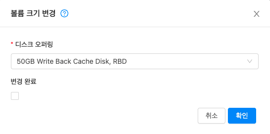

# 스토리지 관리
Mold는 기본(Primary) 및 2차(Secondary)의 두 가지 유형의 스토리지를 정의합니다. 기본 스토리지는 iSCSI 또는 NFS로 엑세스 하거나 직접 호스트에 연결된 스토리지를 기본 스토리지로 사용할 수 있습니다. 2차 스토리지는 항상 NFS를 사용하여 액세스됩니다.

## 기본(Primary) 스토리지
이 섹션에서는 Mold 기본 스토리지에 대한 기술적 세부 사항을 제공합니다. 기본 스토리지의 개념에 대한 자세한 내용은 "기본 스토리지 문서"를 참조하십시오. 또한 Mold UI를 통해 기본 스토리지를 설치하고 구성하는 방법에 대한 정보는 "설치 안내서"를 참조하십시오.

### 기본 스토리지에 대한 모범 사례
- 기본 스토리지의 속도는 게스트 성능에 영향을 미칩니다. 가능하면 더 작고 더 높은 RPM을 가진 드라이브 또는 SSD로 기본 스토리지를 구성하십시오.
- Mold가 기본 스토리지를 활용할 수 있는 두 가지 방법이 있습니다.

    정적 : 이것은 Mold의 전통적인 스토리지 처리 방법입니다. 이 모델에서는 사전 할당된 양의 스토리지 (예 : SAN의 볼륨)가 Mold에 제공됩니다. 그런 다음 Mold는 이 스토리지에 많은 볼륨을 생성하도록 허용합니다 (루트 또는 데이터 디스크일 수 있음). 이 기술을 사용하는 경우 저장소에 아무 것도 저장되어 있지 않은지 확인하십시오. Mold에 스토리지를 추가하면 기존 데이터가 모두 삭제됩니다.

    동적 : 이것은 Mold가 스토리지를 관리하는 새로운 방법입니다. 이 모델에서는 Mold에 사전 할당된 양의 스토리지가 아닌 스토리지 시스템이 제공됩니다. 스토리지 플러그인과 함께 작동하는 Mold는 스토리지 시스템에 볼륨을 동적으로 생성하고 스토리지 시스템의 각 볼륨은 단일 Mold 볼륨에 매핑됩니다. 이는 스토리지 QoS와 같은 기능에 매우 유용합니다. 현재 이 기능은 데이터 디스크 (디스크 오퍼링)에서 지원됩니다.

### 기본 스토리지의 런타임 동작
루트 볼륨은 가상 머신이 생성될 때 자동으로 생성됩니다. VM이 파기되면 루트 볼륨이 삭제됩니다. 데이터 볼륨을 생성하고 VM에 동적으로 연결할 수 있습니다. VM이 파기될 때 데이터 볼륨은 삭제되지 않습니다.

관리자는 기본 스토리지 장치의 용량을 모니터링하고 필요에 따라 추가 기본 스토리지를 추가해야 합니다. "고급 설치 안내서"를 참조하십시오.

관리자는 Mold 스토리지 풀을 생성하여 시스템에 기본 스토리지를 추가합니다. 각 스토리지 풀은 클러스터 또는 Zone과 연관됩니다.

데이터 디스크와 관련하여 사용자가 디스크 오퍼링을 실행하여 데이터 디스크를 생성할 때 정보는 처음에 Mold 데이터베이스에만 기록됩니다. 데이터 디스크를 VM에 연결하라는 첫 번째 요청에 따라 Mold는 볼륨을 배치할 스토리지와 해당 스토리지에서 차지하는 공간을 결정합니다. (기본 스토리지가 Mold에 추가된 방식에 따라 사전 할당된 스토리지 또는 스토리지 시스템 (예 : SAN)).

### 기본 스토리지에 대한 하이퍼 바이저 지원
다음 표는 다양한 하이퍼 바이저에 대한 스토리지 옵션 및 매개 변수를 보여줍니다.

| 스토리지 미디어 / 하이퍼 바이저 | VMware vSphere | Citrix XenServer | KVM | Hyper-V |
|:---|:---|:---|:---|:---|
| 디스크, 템플릿 및 스냅샷 형식 | VMDK | VHD | QCOW2 | VHD 스냅샷은 지원되지 않습니다. |
| iSCSI 지원 | VMFS | 클러스터링 된 LVM | 예, 공유 마운트 포인트를 통해 | 아니요 |
| 파이버 채널 지원 | VMFS | 예, 기존 SR을 통해 | 예, 공유 마운트 포인트를 통해 | 아니요 |
| NFS 지원 | 예 | 예 | 예 | 아니요 |
| 로컬 스토리지 지원 | 예 | 예 | 예 | 예 |
| 스토리지 과잉 프로비저닝 | NFS 및 iSCSI | NFS | NFS | 아니요 |
| SMB / CIFS | 아니요 | 아니요 | 아니요 | 예 |
| Ceph / RBD | 아니요 | 아니요 | 예 | 아니요 |

XenServer는 클러스터화된 LVM 시스템을 사용하여 VM 이미지를 iSCSI 및 파이버 채널 볼륨에 저장할 수 있지만 하이퍼바이저에서의 오버 프로비저닝은 지원하지 않습니다. 그러나 스토리지 서버 자체는 Thin 프로비저닝을 지원할 수 있습니다. 따라서 Mold는 Thin 프로비저닝된 스토리지 볼륨에서 실행하여 스토리지 오버 프로비저닝을 계속 지원할 수 있습니다.

KVM은 "Shared Mountpoint"스토리지를 지원합니다. 공유 마운트 포인트는 특정 클러스터 각 서버의 로컬 파일 시스템 경로입니다. 경로는 클러스터의 모든 호스트가 동일해야 합니다 (예 : /mnt/primary1). 이 공유 마운트 포인트는 OCFS2와 같은 클러스터 파일 시스템으로 간주됩니다. 이 경우 Mold는 NFS로 수행되는 것처럼 스토리지를 마운트하거나 마운트를 해제하지 않습니다. Mold를 사용하려면 관리자가 스토리지를 사용할 수 있는지 확인해야 합니다.

NFS 스토리지를 통해 Mold는 오버 프로비저닝을 관리합니다. 이 경우 전역 구성 매개 변수 storage.overprovisioning.factor는 오버 프로비저닝 정도를 제어합니다. 이것은 하이퍼 바이저 유형과 무관합니다.

로컬 스토리지는 vSphere, XenServer 및 KVM의 기본 스토리지 옵션입니다. 로컬 디스크 옵션이 활성화되면 로컬 디스크 스토리지 풀이 각 호스트에 자동으로 생성됩니다. 시스템 가상 머신 (예 : 가상 라우터)에 로컬 스토리지를 사용하려면 글로벌 구성에서 system.vm.use.local.storage를 true로 설정합니다.

Mold는 클러스터에서 여러 기본 스토리지 풀을 지원합니다. 예를 들어 기본 스토리지에 2개의 NFS 서버를 프로비저닝 할 수 있습니다. 또는 처음에 iSCSI LUN 1 개를 프로비저닝 한 다음 첫 번째 iSCSI LUN이 용량에 가까워지면 두 번째 iSCSI LUN을 추가할 수 있습니다.

### 스토리지 태그
스토리지는 "태그"를 추가할 수 있습니다. 태그는 기본 스토리지, 디스크 오퍼링 또는 서비스 오퍼링과 연관된 텍스트 문자열 속성입니다. 태그를 사용하면 관리자가 스토리지에 대한 추가 정보를 제공할 수 있습니다. (예: "SSD" 또는 "slow"). 태그는 Mold에서 해석되지 않으며 서비스 및 디스크 오퍼링에 배치된 태그와 일치합니다. Mold는 기본 스토리지에 루트 또는 데이터 디스크를 할당하기 전에 서비스 및 디스크 오퍼링의 모든 태그가 기본 스토리지에 있어야 합니다. 서비스 및 디스크 오퍼링 태그는 해당 오퍼링에있는 스토리지의 요구사항을 식별하는 데 사용됩니다. 예를 들어, 고급 서비스 오퍼링은 루트 디스크 볼륨에 대해 "fast" 태그가 필요할 수 있습니다.

클러스터와 팟 (Pod)에서 태그, 할당 및 볼륨 복사 간의 상호 작용은 복잡할 수 있습니다. 상황을 단순화하려면 Pod의 모든 클러스터에 대해 기본 스토리지에서 동일한 태그 세트를 사용하십시오. 이러한 태그를 표시하는 데 다른 장치를 사용하더라도 노출된 태그 세트는 동일할 수 있습니다.

### 기본 스토리지에 대한 유지 관리 모드
기본 스토리지는 유지 보수 모드로 전환될 수 있습니다. 예를 들어 저장 장치의 결함이 있는 RAM을 교체하는 데 유용합니다. 스토리지 장치의 유지 관리 모드는 먼저 새 게스트가 스토리지 장치에 프로비저닝되는 것을 중지합니다. 그런 다음 해당 저장 장치에 볼륨이 있는 모든 게스트를 중지합니다. 이러한 게스트가 모두 중지되면 저장 장치는 유지 관리 모드로 전환되며 종료 될 수 있습니다. 저장 장치가 다시 온라인 상태가 되면 장치의 유지 관리 모드를 취소할 수 있습니다. Mold는 장치를 다시 온라인 상태로 만들고 유지 관리 모드로 들어갈 때 실행 중이던 모든 게스트를 시작합니다.

## 2차(Secondary) 스토리지
이 섹션에서는 Mold의 2차 스토리지에 대한 개념 및 기술 세부 정보를 제공합니다. Mold UI를 통해 2차 스토리지를 설치하고 구성하는 방법에 대한 정보는 "고급 설치 안내서"를 참조하십시오.

이제 2차 스토리지 간의 데이터 마이그레이션이 지원됩니다. 적절한 마이그레이션 정책을 선택하여 저장소가 균형을 이루도록 데이터를 완전히 마이그레이션하거나 마이그레이션하도록 선택할 수 있습니다. 마이그레이션 부하 분산을 용이하게 하기 위해 파일 전송이 정의된 임계 값 이상을 차지하는 경우 SSVM이 생성됩니다. 다음은 마이그레이션 작업을 진행하기 전에 살펴볼 수 있는 전역 설정 값입니다

|구성 매개 변수|설명|
|:---|:---|
|image.store.imbalance.threshold|스토리지 사용률 지표에 대한 표준 편차 백분율과 비교되는 스토리지 불균형 임계 값입니다. 값은 10 진수 형식의 백분율입니다.|
|secstorage.max.migrate.sessions|	SSVM이 처리할 수 있는 동시 복사 명령 실행 세션의 최대 수|
|max.ssvm.count|	데이터 개체 마이그레이션을 동시에 처리할 추가 SSVM 수|
|max.data.migration.wait.time|	새 SSVM을 생성하기 전에 데이터 마이그레이션 작업을 위한 최대 대기 시간|

2차 스토리지는 추가 템플릿, 볼륨 및 스냅샷을 저장하는 데 사용되는 것을 차단하기 위해 읽기 전용으로 설정할 수도 있습니다.

## 볼륨 관리
볼륨은 게스트 VM에 스토리지를 제공합니다. 볼륨은 루트 디스크 또는 추가 데이터 디스크를 제공할 수 있습니다. Mold는 게스트 VM에 대한 추가 볼륨을 지원합니다.

특정 하이퍼 바이저 유형에 대해 볼륨이 생성됩니다. 하나의 하이퍼 바이저 유형 (예 : KVM)을 사용하여 게스트에 연결된 볼륨은 다른 하이퍼 바이저 유형 (예 : vSphere, Xenserver)을 사용하는 게스트에 연결할 수 없습니다. 이는 서로 다른 하이퍼 바이저가 서로 다른 디스크 이미지 형식을 사용하기 때문입니다.

Mold는 볼륨을 게스트 VM에서 사용할 수 있는 스토리지 단위로 정의합니다. 볼륨은 루트 디스크 또는 데이터 디스크입니다. 루트 디스크는 파일 시스템에 "/"가 있으며 일반적으로 부팅 장치입니다. 데이터 디스크는 "/ opt"또는 "D :"와 같은 추가 스토리지를 제공합니다. 모든 게스트 VM에는 루트 디스크가 있으며 VM에는 선택적으로 데이터 디스크가 있을 수도 있습니다. 최종 사용자는 게스트 VM에 여러 데이터 디스크를 탑재할 수 있습니다. 사용자는 관리자가 만든 디스크 오퍼링에서 데이터 디스크를 선택합니다. 사용자는 볼륨에서 템플릿을 만들 수도 있습니다. 이것은 개인 템플릿 생성을 위한 표준 절차입니다. 볼륨은 하이퍼 바이저별로 다릅니다. 한 하이퍼 바이저 유형의 볼륨은 다른 하이퍼 바이저 유형의 게스트에서 사용할 수 없습니다.

!!! Note
    Mold는 최대

    - XenServer 하이퍼 바이저 버전 6.0 이상 및 모든 버전의 VMware에 13개의 데이터 디스크.
    - Hyper-V의 64개 데이터 디스크.
    - 다른 하이퍼 바이저 유형의 데이터 디스크 6개를 생성할 수 있습니다.

### 볼륨생성
스토리지 용량 한도까지 언제든지 게스트 VM에 더 많은 데이터 디스크 볼륨을 추가할 수 있습니다. Mold 관리자와 사용자 모두 VM 가상머신에 볼륨을 추가할 수 있습니다. 새 볼륨을 생성하면 Mold에 엔티티로 저장되지만 실제 스토리지 리소스는 볼륨을 연결할 때까지 물리적 스토리지 장치에 할당되지 않습니다. 이 최적화를 통해 Mold는 첫 번째 연결이 만들어질 때 사용할 게스트에 가장 가까운 볼륨을 프로비저닝 할 수 있습니다.

기존 ROOT 볼륨 스냅샷에서 새 볼륨을 생성할 때 디스크 오퍼링을 명시적으로 정의해야합니다 (UI는 디스크 크기가 스냅샷 크기보다 크거나 같은 디스크 오퍼링만 제공함).

기존 DATA 볼륨 스냅샷에서 새 볼륨을 생성할 때 스냅샷과 연결된 디스크 오퍼링 (원래 볼륨에서 상속됨)이 새 볼륨에 할당됩니다.

**데이터 볼륨에 로컬 스토리지 사용**

로컬 스토리지에 데이터 볼륨을 생성할 수 있습니다 (XenServer, KVM 및 VMware에서 지원됨). 데이터 볼륨은 데이터 볼륨에 연결된 VM 가상머신와 동일한 호스트에 배치됩니다. 이러한 로컬 데이터 볼륨은 다른 유형의 데이터 볼륨과 마찬가지로 가상 머신에 연결, 분리, 다시 연결 및 삭제를 할 수 있습니다.

로컬 스토리지는 데이터 볼륨 및 HA의 지속성이 필요하지 않은 시나리오에 이상적입니다. 일부 이점에는 저렴한 로컬 디스크 사용으로 인한 디스크 I/O 대기 시간 감소 및 비용 절감이 포함됩니다.

로컬 볼륨을 사용하려면 영역에 대해 기능을 활성화해야합니다.

로컬 스토리지를위한 데이터 디스크 오퍼링을 생성할 수 있습니다. 사용자가 새 VM을 생성할 때 데이터 디스크 볼륨이 로컬 스토리지에 배치되도록하기 위해 이 디스크 오퍼링을 선택할 수 있습니다.

로컬 스토리지에 볼륨이 있는 VM을 다른 호스트로 마이그레이션하거나 볼륨 자체를 다른 호스트로 마이그레이션할 수 없습니다. 호스트를 유지 관리 모드로 전환하려면 먼저 해당 호스트에서 로컬 데이터 볼륨이 있는 모든 VM을 중지해야합니다.

**새 볼륨을 만들려면**

1. 사용자 또는 관리자로 Mold UI에 로그인합니다.
2. 왼쪽 메뉴에서 스토리지 > 볼륨을 클릭합니다.
3. 새 볼륨을 만들려면 볼륨 생성을 클릭하고 다음 세부 정보를 제공한 다음 확인을 클릭합니다.

    - 이름. 나중에 찾을 수 있도록 볼륨에 고유한 이름을 지정하십시오.
    - Zone. 스토리지가 위치할 Zone이며 볼륨을 사용할 VM과 가까워야합니다.
    - 디스크 오퍼링. 스토리지의 특성을 선택하십시오.
   
    새 볼륨이 "Allocated"상태로 볼륨 목록에 나타납니다. 볼륨 데이터는 Mold에 저장되지만 볼륨은 아직 사용할 준비가 되지 않았습니다.

4. 볼륨 사용을 시작하려면 볼륨을 선택하고 디스크 연결을 하십시오.

### VM에 기존 볼륨 업로드
가상 머신에서 기존 데이터에 액세스할 수 있습니다. 이를 VM에 볼륨 업로드라고합니다. 예를 들어 로컬 파일 시스템에서 데이터를 업로드하고이를 VM에 연결하는 데 유용합니다. 루트 관리자, 도메인 관리자 및 최종 사용자는 모두 기존 볼륨을 VM에 업로드 할 수 있습니다.

업로드는 HTTP를 사용하여 수행됩니다. 업로드 된 볼륨은 영역의 2차 스토리지에 배치됩니다.

미리 구성된 볼륨 제한에 이미 도달 한 경우 볼륨을 업로드 할 수 없습니다. 클라우드에 대한 기본 제한은 전역 구성 매개 변수 max.account.volumes에 설정되어 있지만 관리자는 전역 기본값과 다른 도메인 별 제한을 설정할 수도 있습니다. 사용 제한 설정을 참조하십시오.

볼륨을 업로드하려면 :

1. (선택 사항) 업로드 할 디스크 이미지 파일의 MD5 해시 (체크섬)를 만듭니다. 데이터 디스크를 업로드 한 후 Mold는 이 값을 사용하여 데이터 손상이 발생하지 않았는지 확인합니다.
2. 관리자 또는 사용자로 Mold UI에 로그인합니다.
3. 왼쪽 메뉴에서 스토리지 > 볼륨을 클릭합니다.
4. "로컬에서 볼륨 업로드" 또는 "URL에서 볼륨 업로드"를 클릭합니다.
5. 다음을 제공하십시오.
    - 이름. UI에 표시 할 수 있는 원하는 이름입니다.
    - Zone. 볼륨을 저장할 Zone을 선택하십시오. 이 영역의 호스트에서 실행되는 VM은 볼륨을 연결할 수 있습니다.
    - 형식. 다음 중 하나를 선택하여 볼륨의 디스크 이미지 형식을 나타냅니다.
    - 디스크 오퍼링. 스토리지의 특성을 선택하십시오.
    - MD5 체크섬. 볼륨 업로드 절차를 시작할 때 생성한 해시를 사용합니다.
    
        | 하이퍼 바이저 | 디스크 이미지 형식 |
        |:---|:---|
        |XenServer|VHD|
        |VMware|OVA|
        |KVM|QCOW2|

    - URL. Mold가 디스크에 액세스하는 데 사용할 수 있는 보안 HTTP 또는 HTTPS URL입니다. URL의 파일 유형은 형식에서 선택한 값과 일치해야합니다. 예를 들어 형식이 VHD 인 경우 URL은 다음과 같습니다.

        예: http://yourFileServerIP/userdata/myDataDisk.vhd

    - MD5 체크섬. (선택 사항) 1 단계에서 만든 해시를 사용합니다.

6. 볼륨 상태에 업로드가 완료되었다고 표시될 때까지 기다리십시오. 가상머신-볼륨을 클릭하고 5 단계에서 지정한 이름을 찾은 다음 상태가 "업로드 됨"인지 확인합니다.

### VM에 볼륨 연결
게스트 VM에 볼륨을 연결하여 추가 디스크 스토리지를 제공할 수 있습니다. 새 볼륨을 처음 만들 때, 기존 볼륨을 한 VM에서 다른 VM으로 이동할 때 또는 한 스토리지 풀에서 다른 스토리지 풀로 볼륨을 마이그레이션 한 후에 볼륨을 연결하십시오.

1. 사용자 또는 관리자로 Mold UI에 로그인합니다.
2. 왼쪽 메뉴에서 스토리지 > 볼륨을 클릭합니다.
3. 볼륨 목록에서 볼륨 이름을 클릭한 다음 디스크 연결 버튼을 클릭합니다.
4. 볼륨을 연결하려는 VM을 선택합니다. 볼륨을 연결할 수 있는 가상머신만 표시됩니다. 예를 들어 사용자는 해당 사용자가 만든 가상머신만 볼 수 있지만 관리자는 더 많은 선택권을 갖게됩니다.
5. 볼륨이 연결되면 VM 이름을 클릭하여 볼 수 있어야 합니다.

### 볼륨 연결 해제 및 다른 VM에 볼륨 연결
!!! Note
    이 절차는 한 스토리지 풀에서 다른 스토리지 풀로 볼륨을 이동하는 것과 다릅니다.

볼륨을 게스트 VM에서 분리하여 다른 게스트에 연결할 수 있습니다. Mold 관리자와 사용자 모두 VM에서 볼륨을 분리하고 다른 VM으로 이동할 수 있습니다.

두 VM이 서로 다른 클러스터에 있고 볼륨이 큰 경우 볼륨을 새 VM으로 이동하는 데 몇 분 정도 걸릴 수 있습니다.

1. 사용자 또는 관리자로 Mold UI에 로그인합니다.
2. 왼쪽 메뉴에서 스토리지를 클릭하고 보기 선택에서 볼륨을 선택합니다. 또는 볼륨이 연결된 VM을 알고 있는 경우 가상머신을 클릭하고 VM 이름을 클릭한 다음 볼륨보기를 클릭할 수 있습니다.
3. 분리하려는 볼륨의 이름을 클릭한 다음 디스크 분리 버튼을 클릭합니다. 
4. 볼륨을 다른 VM으로 이동하려면 "디스크 연결"의 단계를 따르십시오.

### 다른 스토리지로 볼륨 마이그레이션
XenServer, KVM 및 VMware에서 지원됩니다.

!!! Note
    이 절차는 한 VM에서 다른 VM으로 디스크 볼륨을 이동하는 것과 다릅니다 .

가상 머신의 루트 디스크 볼륨 또는 추가 데이터 디스크 볼륨을 한 스토리지 풀에서 동일한 영역의 다른 스토리지 풀로 마이그레이션할 수 있습니다.

스토리지 마이그레이션 기능을 사용하여 스토리지 풀의 로드 균형을 조정하고 문제가 발생한 스토리지 풀에서 가상 머신을 이동하여 가상 머신의 안정성을 높이는 등 일반적으로 원하는 관리 목표를 달성할 수 있습니다.

XenServer 및 VMware에서 VM 스토리지의 라이브 마이그레이션은 XenMotion 및 vMotion에 대한 Mold 지원을 통해 활성화됩니다. 라이브 스토리지 마이그레이션을 통해 VM을 한 호스트에서 다른 호스트로 이동할 수 있습니다. 여기서 VM은 두 호스트간에 공유되는 스토리지에는 없습니다. VM 자체와 함께 VM의 디스크를 라이브 마이그레이션하는 옵션을 제공합니다. VM이 실행되는 동안 한 XenServer 리소스 풀 / VMware 클러스터에서 다른 VM으로 VM을 마이그레이션하거나, 디스크가 로컬 스토리지에있는 VM을 마이그레이션하거나, 한 스토리지 저장소에서 다른 저장소로 VM의 디스크를 마이그레이션할 수 있습니다.

!!! Note
    VMware의 제한으로 인해 VM에 대한 스토리지의 라이브 마이그레이션은 소스 및 대상 스토리지 풀이 소스 호스트에 액세스할 수 있는 경우에만 허용됩니다. 즉, 실시간 마이그레이션 작업이 요청될 때 VM이 실행되는 호스트입니다.

**데이터 볼륨을 새 스토리지 풀로 볼륨 마이그레이션**

디스크를 마이그레이션하려는 두 가지 상황이 있습니다.

- 디스크를 새 저장소로 이동하되 실행 중인 동일한 VM에 연결된 상태로 두기 위한 목적.
- 현재 VM에서 디스크를 분리하고 새 저장소로 이동 한 다음 새 VM에 연결하기 위한 목적.

실행 중인 VM을 위한 스토리지 마이그레이션

(XenServer 및 VMware에서 지원됨)

1. 사용자 또는 관리자로 Mold UI에 로그인합니다.
2. 왼쪽 메뉴에서 가상머신을 클릭하고 VM 이름을 클릭한 다음 볼륨 탭을 클릭합니다.
3. 마이그레이션할 볼륨을 클릭합니다.
4. VM에서 디스크를 분리합니다. "디스크 분리 및 이동"을 참조 하되 마지막에 있는 "다시 연결"단계를 건너 뜁니다. 새 스토리지로 마이그레이션 한 후에 수행합니다.
5. "다른 기본 스토리지에 가상머신 마이그레이션" 버튼을 클릭하여 볼륨을 마이그레이션합니다. 드롭 다운 목록에서 대상을 선택합니다.
6. 볼륨 상태가 마이그레이션 중으로 변경된 다음 다시 준비로 변경되는지 확인합니다.

스토리지 마이그레이션 및 다른 VM에 연결

1. 사용자 또는 관리자로 Mold UI에 로그인합니다.
2. VM에서 디스크를 분리합니다. "디스크 분리 및 이동"을 참조 하되 마지막에 있는 "다시 연결"단계를 건너 뜁니다. 새 스토리지로 마이그레이션한 후에 수행합니다.
3. "다른 기본 스토리지에 가상머신 마이그레이션" 버튼을 클릭하여 볼륨을 마이그레이션합니다. 드롭 다운 목록에서 대상을 선택합니다.
4. 볼륨 상태가 마이그레이션 중으로 변경된 다음 다시 준비로 변경되는지 확인합니다. 왼쪽 메뉴에서 스토리지를 클릭하여 볼륨을 찾을 수 있습니다.
5. 새 스토리지 서버와 동일한 클러스터에서 실행 중인 원하는 VM에 볼륨을 연결합니다. “볼륨 연결”을 참조하십시오.

**VM 루트 볼륨을 새 스토리지 풀로 마이그레이션**

(XenServer, VMware) VM을 먼저 중지하지 않고 한 스토리지 풀에서 다른 스토리지 풀로 VM의 루트 디스크를 라이브 마이그레이션할 수 있습니다.

(KVM) 루트 디스크 볼륨을 마이그레이션할 때 먼저 VM을 중지해야하며 사용자는 VM에 액세스할 수 없습니다. 마이그레이션이 완료된 후 VM을 다시 시작할 수 있습니다.

1. 사용자 또는 관리자로 Mold UI에 로그인합니다.
2. 왼쪽 메뉴에서 가상머신을 클릭하고 VM 이름을 클릭합니다.
3. (KVM만 해당) VM을 중지합니다.
4. "다른 기본 스토리지에 가상머신 마이그레이션" 버튼을 클릭하여 볼륨을 마이그레이션합니다. 드롭 다운 목록에서 대상을 선택합니다.

    !!! Note
        VM의 스토리지를 VM과 함께 마이그레이션 해야하는 경우 호스트 목록에 표시됩니다. Mold가 스토리지 마이그레이션을 처리합니다.

5. 볼륨 상태가 마이그레이션 중으로 변경된 다음 다시 실행 중 (또는 KVM의 경우 중지됨)으로 변경되는지 확인하십시오. 이 작업에는 시간이 걸릴 수 있습니다.
6. (KVM만 해당) VM을 다시 시작합니다.

### 볼륨 크기 변경
Mold는 데이터 디스크의 크기를 조정할 수 있는 기능을 제공합니다. Mold는 디스크 오퍼링을 사용하여 볼륨 크기를 제어합니다. 이를 통해 Mold 관리자는 최종 사용자에게 제공할 공간을 유연하게 선택할 수 있습니다. 동일한 스토리지 태그가 있는 디스크 오퍼링 내의 볼륨 크기를 조정할 수 있습니다. 예를 들어 10GB, 50GB 및 100GB 제품만 제공하려는 경우 허용되는 크기 조정은 해당 제한 내에서 유지되어야합니다. 즉, 10GB, 50GB 및 100GB 디스크 오퍼링을 정의하면 사용자가 10GB에서 50GB로 또는 50GB에서 100GB로 업그레이드할 수 있습니다. 사용자 지정 크기의 디스크 오퍼링을 생성하는 경우 더 큰 새로운 크기를 지정하여 볼륨 크기를 조정할 수 있는 옵션이 있습니다.

또한 resizeVolume API를 사용하여 데이터 볼륨을 정적 디스크 오퍼링에서 지정된 크기의 사용자 정의 디스크 오퍼링으로 이동할 수 있습니다. 이 기능을 사용하면 특정 볼륨 크기 또는 디스크 오퍼링으로 비용을 청구 할 수 있는 사용자가 해당 모델을 고수하면서 필요한 사용자 지정 크기로 마이그레이션할 수 있는 유연성을 제공합니다.

이 기능은 KVM, XenServer 및 VMware 호스트에서 지원되지만 VMware 호스트 경우에는 볼륨 축소는 지원되지 않습니다.

볼륨 크기를 조정하기 전에 다음 사항을 고려하십시오.

- 볼륨과 연결된 VM이 중지됩니다.
- 볼륨과 연결된 데이터 디스크가 제거됩니다.
- 볼륨이 축소되면 연결된 디스크가 잘려 콘텐츠가 데이터 손실 위험에 처하게됩니다. 따라서 모든 데이터가 해당 디스크에서 이동되도록 데이터 디스크를 축소하기 전에 파티션 또는 파일 시스템의 크기를 조정하십시오.

볼륨 크기를 조정하려면 :

1. 사용자 또는 관리자로 Mold UI에 로그인합니다.
2. 왼쪽 메뉴에서 스토리지 > 볼륨을 클릭합니다.
3. 볼륨 목록에서 볼륨 이름을 선택한 다음 "볼륨 크기 변경" 버튼을 클릭합니다.
4. 볼륨 크기 변경 팝업에서 원하는 디스크 오퍼링을 선택합니다.

    

    1.사용자 정의 디스크를 선택한 경우 사용자 정의 크기를 지정하십시오.

    2.변경하려는 볼륨의 크기가 현재보다 작다면 "변경 완료"를 체크하여 볼륨 크기를 줄이는 것을 확인합니다.
    
    이 확인 작업은 데이터 손실 위험을 초래할 수 있는 부주의한 디스크 축소 작업을 방지합니다.

5.확인을 클릭하십시오.

### 디스크 오퍼링을 통한 루트 볼륨 크기 변경
디스크 오퍼링이 루트 디스크 크기로 생성된 경우 VM 디스크 오퍼링의 크기를 조정해야만 루트 볼륨의 크기를 조정할 수 있습니다.

루트 크기 조정을 제공하는 서비스는 다음을 제한합니다.

1. 사용자는 이러한 제품을 사용할 때 사용자 지정 루트 디스크 크기로 VM을 배포할 수 없습니다.
2. 사용자는 이러한 제품을 사용할 때 VM 루트 디스크 크기를 조정할 수 없습니다.
3. 이러한 VM의 루트 볼륨은 루트 디스크 크기가 현재 크기보다 크거나 같은 다른 디스크 오퍼링으로 변경하는 경우에만 크기를 조정할 수 있습니다.
4. 사용자는 루트 크기가 0GB (기본값) 인 서비스 제품으로 VM 제품을 변경한 다음 볼륨 크기를 사용자 지정할 수 있습니다.

다음 표는 오퍼링 루트 디스크 크기에 따라 크기 조정을 지원하는 서비스 오퍼링의 가능한 조합을 보여줍니다.

|#|	서비스 제공 루트 크기|	새로운 서비스 제공 루트|	크기 조정을 지원합니까?|
|:---|:---|:---|:---|
|1|	0GB (기본값)|	임의의 값|	예|
|2|	5GB|	5GB|	예|
|3|	5GB|	10GB|	예|
|4|	10GB|	5GB|	아니요|
|5| 임의의 값|  0GB|	예|

!!! Note
    루트 디스크 축소는 크기 조정 워크플로를 제공하는 서비스를 통해 지원되지 않습니다. 위의 모든 조합은 크기가 원본보다 크거나 같은 루트 디스크로 전환한다고 가정한 것입니다. 루트 크기가 0GB 인 디스크 오퍼링은 디스크 크기를 0으로 변경하지 않으며 오퍼링이 루트 디스크 크기를 적용하지 않음을 나타냅니다.

### 루트 볼륨 변경(VM 재부팅시)
특정 VM이 재부팅될 때마다 루트 디스크를 버리고 새 디스크를 만들도록 지정할 수 있습니다. 이는 부팅 할 때마다 새로 시작해야하는 보안 환경과 상태를 유지해서는 안되는 데스크톱에 유용합니다. 이 작업으로 인해 VM의 IP 주소는 변경되지 않습니다.

VM 재부팅시 루트 디스크 재설정을 활성화하려면 :

새 서비스 오퍼링을 작성할 때 isVolatile 매개 변수를 True로 설정하십시오. 이 서비스 오퍼링에서 생성된 VM은 재부팅시 디스크가 재설정됩니다. "새 컴퓨트 오퍼링 생성"을 참조하십시오 .

### 볼륨 삭제 및 볼륨 영구 삭제
볼륨을 삭제해도 볼륨에서 생성된 스냅샷은 삭제되지 않습니다.

VM이 파기 되어도 VM에 연결된 데이터 디스크 볼륨은 삭제되지 않습니다.

볼륨은 가비지 콜렉션 프로세스를 사용하여 영구적으로 파기됩니다. 전역 구성 변수 expunge.delay 및 expunge.interval은 볼륨의 물리적 삭제가 발생하는시기를 결정합니다.

- _expunge.delay_ : 볼륨이 소멸되기 전에 얼마나 오래되어야 하는지 초 단위로 결정합니다.
- _expunge.interval_ : 가비지 수집 검사를 실행하는 빈도를 결정합니다.

관리자는 데이터 보존과 관련된 사이트 정책에 따라 이러한 값을 조정해야 합니다.

## 볼륨 스냅샷 관리
Mold는 디스크 볼륨의 스냅샷을 지원합니다. 스냅샷은 가상 머신 디스크의 시점 캡처입니다. 메모리 및 CPU 상태는 캡처되지 않습니다. Oracle VM 하이퍼 바이저를 사용하는 경우 OVM에서 지원하지 않으므로 스냅샷을 만들 수 없습니다.
!!! note
    Mold는 다음의 하이퍼 바이저에 한하여 볼륨 스냅샷을 지원합니다.
    
    - KVM
    - VMware vSphere
    - Xenserver

루트 및 데이터 디스크를 포함하여 볼륨에 대해 스냅샷을 찍을 수 있습니다. 관리자는 사용자 당 저장되는 스냅샷 수를 제한할 수 있습니다. 사용자는 특정 파일의 복구를 위해 스냅샷에서 새 볼륨을 생성할 수 있으며 복원 된 디스크에서 부팅하기 위해 스냅샷에서 템플릿을 생성할 수 있습니다.

사용자는 수동으로 또는 스케쥴링 스냅샷 정책을 설정하여 스냅샷을 생성할 수 있습니다. 사용자는 다른 디스크 볼륨처럼 VM에 연결할 수 있는 스냅샷에서 디스크 볼륨을 만들 수도 있습니다. 루트 디스크와 데이터 디스크 모두의 스냅샷이 지원됩니다. 그러나 현재 복구 된 루트 디스크에서 VM 부팅을 지원하지 않습니다. 루트 디스크의 스냅샷에서 복구 된 디스크는 일반 데이터 디스크로 취급됩니다. 복구 된 디스크의 데이터는 디스크를 VM에 연결하여 액세스할 수 있습니다.

완료된 스냅샷은 기본 스토리지에서 2차 스토리지로 복사되며 새로운 스냅샷에 의해 삭제되거나 제거될 때까지 저장됩니다.

### 볼륨 스냅샷 생성
1. 사용자 또는 관리자로 Mold UI에 로그인하십시오.
2. 왼쪽 메뉴에서 스토리지 > 볼륨을 클릭합니다.
3. 스냅샷 할 볼륨의 이름을 클릭합니다.
4. 스냅샷 버튼을 클릭합니다.

### KVM 볼륨 스냅샷 특성
최근 Mold 버전에서는 특정 경우에 발생할 수 있는 볼륨 손상으로 인해 실행 중인 VM에 대한 볼륨 스냅샷 생성이 기본적으로 비활성화되어 있습니다. VM이 실행되는 동안 볼륨 스냅샷 생성을 활성화하려면 글로벌 설정 'kvm.snapshot.enabled'를 'True'로 설정해야합니다.

볼륨 스냅샷 생성이 최근 버전에서 변경되었습니다.

내부적으로는 먼저 전체 VM 스냅샷이 생성됩니다. 즉, VM 스냅샷을 생성하는 동안 VM이 "일시 중지"상태 (RAM 메모리가 QCOW2 파일에 기록되는 동안)에 있게됩니다. 즉, VM 네트워크 관점에서 사용할 수 없습니다. VM 스냅샷이 생성되면 VM이 일시 중지 / 재개되고 단일 볼륨 스냅샷이 2차 스토리지로 내보내진 다음 VM 스냅샷이 VM에서 제거됩니다.

### 자동 스냅샷 생성 및 보존
(다음 하이퍼 바이저에 대해 지원됨 : XenServer , VMware vSphere 및 KVM )

사용자는 반복 스냅샷 정책을 설정하여 정기적으로 디스크의 여러 스냅샷을 자동으로 생성할 수 있습니다. 스냅샷은 매시간, 매일, 매주 또는 매월 간격으로 생성할 수 있습니다. 디스크 볼륨 당 하나의 스냅샷 정책을 설정할 수 있습니다. 예를 들어 사용자는 02:30에 일일 스냅샷을 설정할 수 있습니다.

각 스냅샷 일정에서 사용자는 보존할 예약된 스냅샷의 수를 지정할 수도 있습니다. 보존 제한을 초과하게 되면 이전 스냅샷은 자동으로 삭제됩니다. 이 사용자 정의 제한은 Mold 관리자가 설정한 글로벌 제한보다 같거나 낮아야합니다. “전역적으로 구성된 제한”을 참조하십시오. 제한은 자동 반복 스냅샷 정책의 일부로 생성된 스냅샷에만 적용됩니다. 또한 추가 수동 스냅샷을 생성하고 유지할 수도 있습니다.

### 증분 스냅샷 및 백업
스냅샷은 디스크가있는 기본 스토리지에 생성됩니다. 스냅샷이 생성되면 즉시 2차 스토리지에 백업되고 기본 스토리지에서 최적의 공간 활용을 위해 기본 스토리지에서 제거됩니다.

Mold는 일부 하이퍼바이저의 증분백업을 실행합니다. 증분 백업이 지원될 경우 N개의 백업은 모두 풀 백업이 됩니다.

|   |VMware vSphere|    Citrix XenServer|   KVM|
|:---|:---|:---|:---|
|증분 백업 지원|	아니요|	예|	아니요|

### 볼륨 상태
반복되는 스냅샷 정책을 통해 스냅샷 작업이 트리거될 때 볼륨이 마지막 스냅샷이 생성된 이후 비활성 상태로 남아 있으면 스냅샷을 건너 뜁니다. 볼륨이 분리되었거나 실행 중이 아닌 VM에 연결된 경우 비활성 상태로 간주됩니다. Mold는 볼륨이 마지막으로 비활성화 된 이후 최소 하나의 스냅샷이 생성되도록 합니다.

스냅샷을 수동으로 생성하면 볼륨의 활성 여부에 관계없이 항상 스냅샷이 생성됩니다.

### 스냅샷 복원
스냅샷을 복원하는 두 가지 경로가 있습니다. 사용자는 스냅샷에서 볼륨을 생성할 수 있습니다. 그런 다음 볼륨을 VM에 마운트하고 필요에 따라 파일을 복구할 수 있습니다. 또는 루트 디스크의 스냅샷에서 템플릿을 만들 수도 있습니다. 그런 다음 사용자는 이 템플릿에서 VM을 부팅하여 루트 디스크를 복구할 수 있습니다.

### 스냅샷 작업 조절
가상 머신의 스냅샷이 요청되면 스냅샷 작업은 VM이 실행 중인 동일한 호스트 또는 중지된 VM의 경우 마지막으로 실행된 호스트에서 실행됩니다. 단일 호스트의 VM에 대해 많은 스냅샷이 요청되면 너무 많은 스냅샷 작업이 호스트의 리소스를 압도하는 문제가 발생할 수 있습니다.

이 상황을 해결하기 위해 클라우드의 루트 관리자는 글로벌 구성 설정에서 concurrent.snapshots.threshold.perhost를 사용하여 클라우드의 호스트에서 동시에 실행되는 스냅샷 작업 수를 조절할 수 있습니다. 이 설정을 사용하면 관리자는 스냅샷 작업이 시간 초과되지 않고 너무 많은 스냅샷 요청으로 인해 호스트가 오버로드되어 하이퍼 바이저 호스트에 성능 문제가 발생하지 않도록 할 수 있습니다.

concurrent.snapshots.threshold.perhost를 호스트의 현재 리소스와 호스트에서 실행 중인 VM 수를 고려하여 하이퍼 바이저 호스트가 한 번에 실행할 수 있는 스냅샷 작업 수에 대한 최상의 예측 값으로 설정합니다. 지정된 호스트에 더 많은 스냅샷 요청이 있는 경우 추가 요청은 대기열에 배치됩니다. 현재 실행 중인 스냅샷 작업 수가 설정된 값 아래로 떨어질 때까지 새 스냅샷 작업이 시작되지 않습니다.

관리자는 또한 job.expire.minutes를 설정하여 스냅샷 요청이 대기열에서 대기하는 최대 시간을 설정할 수 있습니다. 이 제한에 도달하면 스냅샷 요청이 실패하고 오류 메시지가 반환됩니다.

### VMware 볼륨 스냅샷 성능
VMware에서 데이터 또는 루트 볼륨의 스냅샷을 찍을 때 Mold는 효율적인 스토리지 기술을 사용하여 성능을 향상시킵니다.

스냅샷은 vCenter에서 마운트 된 NFS 공유로 즉시 내보내지지 않고 OVA 파일 형식으로 패키징됩니다. 이 작업은 시간과 리소스를 소비합니다. 대신 vCenter에서 제공하는 원본 파일 형식 (예 : VMDK)이 유지됩니다. OVA 파일은 필요할 때만 필요에 따라 생성됩니다. OVA를 생성하기 위해 Mold는 원본 스냅샷 데이터와 함께 저장 한 속성 파일 (* .ova.meta)의 정보를 사용합니다.

!!! Note
    이 프로세스는 Mold 4.2로 업그레이드한 후 새로 생성된 스냅샷에만 적용됩니다. 이미 완료되어 OVA 형식으로 저장된 스냅샷은 해당 형식으로 계속 존재하며 작동합니다.