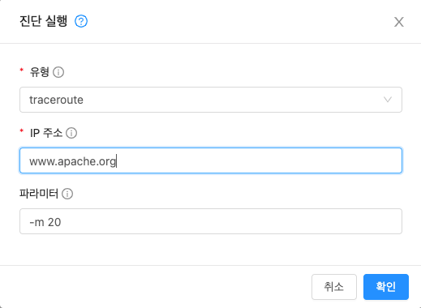

# 시스템 VM 관리
Mold는 여러 유형의 시스템 가상 머신을 사용하여 클라우드에서 작업을 수행합니다. 일반적으로 Mold는 이러한 시스템 VM을 관리하고 확장하며 즉각적인 요구사항에 따라 VM을 생성, 시작 및 중지합니다. 그러므  관리자는 문제를 디버깅하는데 도움이 되도록 이 기능과 역할을 알고 있어야 합니다.

## 시스템 VM 템플릿
시스템 VM은 단일 템플릿에서 제공됩니다. 시스템 VM에는 다음과 같은 특성이 있습니다.

- Debian 보안 APT 저장소의 최신 보안 패치가 포함된 Debian 7.8 ( "wheezy"), 3.2.0 커널
- 최소한의 패키지 세트를 설치하여 공격 표면을 줄입니다.
- Xen / VMWare에서 성능 향상을 위한 64 비트
- 모든 하이퍼 바이저에서 최적의 성능을 위해 Xen PV 드라이버, KVM virtio 드라이버 및 VMware 도구가 포함된 pvops 커널
- Xen 도구 포함으로 성능 모니터링 가능
- 데비안 저장소의 최신 버전의 HAProxy, iptables, IPsec 및 Apache는 향상된 보안과 속도를 보장합니다.
- Sun / Oracle의 최신 JRE 버전은 향상된 보안 및 속도를 보장합니다.

## 기본 시스템 VM 템플릿 변경
64 비트 템플릿을 사용하려면 최소 512MB 메모리의 시스템 오퍼링을 사용해야 합니다.

1. 사용하는 하이퍼 바이저에 따라 다음 위치에서 64비트 템플릿을 다운로드합니다.

    | 하이퍼 바이저 | 다운로드 위치 |
    |:---|:---|
    | XenServer | http://download.cloudstack.org/systemvm/4.15/systemvmtemplate-4.15.0-xen.vhd.bz2 |
    | KVM | http://download.cloudstack.org/systemvm/4.15/systemvmtemplate-4.15.0-kvm.qcow2.bz2 |
    | VMware | http://download.cloudstack.org/systemvm/4.15/systemvmtemplate-4.15.0-vmware.ova |
    | Hyper-V | http://download.cloudstack.org/systemvm/4.15/systemvmtemplate-4.15.0-hyperv.vhd.zip |

2. 관리자로 Mold UI에 로그인하십시오.

3. 시스템 템플릿을 등록합니다.

    예 : SystemVM Template (KVM)

4. 템플릿을 등록하는 동안 라우팅을 선택합니다.

5. 구성 > 글로벌 설정으로 이동합니다.

6. ``router.template.kvm``으로 전역 매개 변수 에서 템플릿의 이름인 SystemVM Template (KVM)을 설정합니다.

    XenServer 템플릿을 사용하는 경우 ``router.template.xen``으로 전역 매개 변수에 이름을 설정합니다.

    이 영역에서 생성된 모든 새 가상 라우터는 이 템플릿을 자동으로 선택합니다.

7. 관리 서버를 다시 시작하십시오.

## 시스템 VM 액세스
SSVM (Secondary Storage VM) 연결 문제가 발생하는 경우와 같이 특정 문제의 진단을 위해 시스템 VM에 액세스해야하는 경우가 있습니다. 실행 중인 시스템 VM의 SSH 콘솔에 연결하려면 아래 단계를 사용하십시오.

네트워크를 통해 시스템 VM에 액세스하려면 개인 키를 사용하고 포트 3922에서 시스템 VM SSH 데몬에 연결해야합니다. XenServer / KVM 하이퍼 바이저는이 키를 각 Mold 에이전트의 /root/.ssh/id_rsa.cloud에 저장합니다. ESXi에서 실행되는 시스템 VM에 액세스하기 위해 키는 /var/lib/cloudstack/management/.ssh/id_rsa의 관리 서버에 저장됩니다.

1. 시스템 VM에 대한 세부 정보 찾기

    1. Mold UI에 관리자 권한으로 로그인합니다.
    2. 인프라스트럭쳐, 시스템 VM을 차례로 클릭한 다음 실행 중인 VM의 이름을 클릭합니다.
    3. 액세스하려는 시스템 VM의 '호스트', '사설 IP 주소' 및 '링크 로컬 IP 주소'를 기록해 둡니다.

2. XenServer / KVM 하이퍼 바이저

    1. 시스템 VM이 실행 중인 호스트에 연결합니다.
    2. VM이 실행 중인 호스트에서 시스템 VM의 '링크 로컬 IP 주소'에 SSH를 사용합니다.
       
        형식 : ssh -i <path-to-private-key> <link-local-ip> -p 3922
       
        예 : root @ kvm01 : ~ # ssh -i /root/.ssh/id_rsa.cloud 169.254.3.93 -p 3922

3. ESXi 하이퍼 바이저

    1. Mold 관리 서버에 연결합니다.
    2. ESXi 사용자는 시스템 VM의 개인 IP 주소로 SSH를 수행해야합니다.
    
        형식 : ssh -i <path-to-private-key> <vm-private-ip> -p 3922
    
        예 : root @ management : ~ # ssh -i /var/lib/cloudstack/management/.ssh/id_rsa 172.16.0.250 -p 3922

## Console Proxy
콘솔 프록시는 웹 UI를 통해 콘솔보기를 표시하는 역할을하는 시스템 가상 머신의 유형입니다. 사용자의 브라우저를 게스트 콘솔용 하이퍼 바이저를 통해 사용할 수 있는 VNC 포트에 연결합니다. 관리자 및 최종 사용자 웹 UI는 모두 콘솔 연결을 제공합니다.

콘솔 아이콘을 클릭하면 새 창이 열립니다. 해당 창에 표시되는 콘솔 뷰어는 콘솔 프록시 VM의 Public IP 주소를 나타냅니다. 콘솔 프록시 VM 당 정확히 하나의 Public IP 주소가 할당됩니다. 뷰어 애플리케이션이 이 IP에 연결됩니다. 그런 다음 콘솔 프록시는 게스트를 호스팅하는 호스트에서 요청 된 VM에 대한 VNC 포트에 대한 연결을 프록시합니다.

4.15 이후 noVNC는 콘솔 프록시에 통합되었으며 기본 뷰어로 지정되었습니다. 기본적으로 게스트 가상 머신에 구성된 여러 키보드 레이아웃을 지원합니다. 또한 디스플레이의 크기를 조정할 수 있으며 콘솔에 텍스트를 붙여넣기를 할 수 있습니다.

noVNC는 "novnc.console.default"전역 구정을 통해 변경되는 기본 콘솔 뷰어로 설정되며 기본적으로 true로 설정됩니다.

!!! Note
    하이퍼 바이저에는 VNC 사용에 할당된 많은 포트가 있으므로 여러 VNC 세션이 동시에 발생할 수 있습니다.

### 콘솔 프록시에 SSL 인증서 사용
기본적으로 콘솔보기 기능은 일반 텍스트 HTTP를 사용합니다. 모든 프로덕션 환경에서 콘솔 프록시 연결은 최소한 SSL을 통해 암호화되어야합니다.

Mold 관리자는 SSL로 콘솔 프록시 통신을 보호하는 두 가지 방법이 있습니다.

- SSL 와일드 카드 인증서 및 도메인 이름 확인 설정
- 특정 FQDN에 대한 SSL 인증서 설정 및 부하 분산 장치 구성

### 콘솔 프록시 SSL 인증서 및 도메인 변경
관리자는 도메인을 선택하고 새 SSL 인증서와 개인 키를 업로드하여 SSL 암호화를 구성할 수 있습니다. 도메인은 aaa-bbb-ccc-ddd.your.domain 형식의 주소에 대한 쿼리를 aaa.bbb.ccc.ddd 형식의 IPv4 IP 주소로 확인할 수있는 DNS 서비스를 실행해야합니다.
    
예 : 202.8.44.1. 

콘솔 프록시 도메인, SSL 인증서 및 개인 키를 변경하려면 :

1. 동적 이름 확인을 설정하거나 Public IP 범위의 가능한 모든 DNS 이름을 aaa-bbb-ccc-ddd.consoleproxy.company.com-> aaa.bbb.ccc.ddd 형식으로 기존 DNS 서버에 채웁니다.
    
    !!! Note
        이 단계에서 consoleproxy.company.com을 확인할 수 있습니다 .- 보안 모범 사례를 위해 별도의 하위 도메인에 와일드 카드 SSL 인증서를 생성하는 것이 좋습니다. 따라서 인증서가 손상된 경우 악의적 인 사용자가 company.com 도메인을 가장 할 수 없습니다.

2. 개인 키 및 인증서 서명 요청 (CSR)을 생성하십시오. openssl을 사용하여 개인 / 공개 키 쌍 및 CSR을 생성하는 경우 Mold UI에 붙여 넣을 개인 키에 대해 PKCS#8 형식으로 변환해야합니다.
    
    1.새로운 2048 비트 개인 키 생성
    
    ````
    openssl genrsa -des3 -out yourprivate.key 2048
    ````
       
    2.새 인증서 CSR을 생성합니다. 와일드 카드 인증서 생성 확인, 예 :
 
    "*.consoleproxy.company.com
   
    ````
    openssl req -new -key yourprivate.key -out yourcertificate.csr
    ````  

    3.가장 신뢰할 수 있는 인증 기관의 웹 사이트로 이동하여 SSL 인증서를 구입하고 CSR을 제출하십시오. 반환 시 유효한 인증서를 받아야 합니다.

    4.개인 키 형식을 PKCS#8 암호화 형식으로 변환합니다.
    ````
    openssl pkcs8 -topk8 -in yourprivate.key -out yourprivate.pkcs8.encrypted.key
    ````
       
    5.PKCS#암호화된 개인 키를 Mold과 호환되는 PKCS#8 형식으로 변환합니다.
    ````
    openssl pkcs8 -in yourprivate.pkcs8.encrypted.key -out yourprivate.pkcs8.key
    ````
   
3. Mold UI의 SSL 인증서 업데이트 화면에서 다음을 붙여 넣습니다.
    - Certificate: 생성한 인증서.
    - PKCS#8 private Key: 생성한 개인 키.
    - DNS Domain Suffix: *.;로 시작하는 원하는 도메인 이름 
     
        예: *.consoleproxy.company.com
   
4. 이렇게 하면 현재 실행 중인 모든 콘솔 프록시 VM이 중지된 다음 새 인증서 및 키로 다시 시작됩니다. 사용자는 콘솔 가용성이 잠시 중단되는 것을 알 수 있습니다.

관리 서버는 이러한 변경이 수행 된 후 "aaa-bbb-ccc-ddd.consoleproxy.company.com"형식의 URL을 생성합니다. 새 콘솔 요청은 새 DNS 도메인 이름, 인증서 및 키와 함께 제공됩니다.

### ROOT CA 및 중간 CA 업로드
ROOT CA 및 중간 CA로 사용자 지정 인증서를 업로드 해야하는 경우는 다음 링크에서 자세한 내용을 확인할 수 있습니다.
https://cwiki.apache.org/confluence/display/CLOUDSTACK/Procedure+to+Replace+realhostip.com+with+Your+Own+Domain+Name, (2021. 04. 23)

중요 사항 :

사용자 지정 인증서를 업로드하는 동안 오류 및 문제를 방지하려면 다음을 확인하십시오.

1. ROOT CA 및 중간 CA의 URL 인코딩을 수행하는 동안 일부 URL / 문자열 인코딩 도구가 이를 수행하는 경향이 있으므로 인증서 내부의 더하기 기호 ("+")가 공백 ("")으로 대체되지 않도록하십시오.

2. 인증서를 갱신하는 경우 새 서버 인증서 및 키와 함께 새 ROOT CA 및 중간 CA를 업로드해야 할 수 있습니다. 이 경우 인증서 API 업로드 중 인증서에 동일한 이름을 사용해야 합니다. 
   
    예 :

    http://123.123.123.123:8080/client/api?command=uploadCustomCertificate&...&name=root1 ... http://123.123.123.123:8080/client/api?command=uploadCustomCertificate&...&name=intermed1 ...

여기에서 이름은 "root1"및 "intermed1"입니다. 이전에 다른 이름을 사용한 경우 사용된 이름을 얻으려면 cloud.keystore 테이블을 확인하십시오.

CPVM을 제거하는 동안 management.log에 여전히 문제가 있고 다음 오류가 발생하는 경우 :

- CertificateException으로 인해 CPVMCertificate에 대한 키 스토리지를 빌드할 수 없습니다.
- 콜드가 유효한 SSL 인증서를 찾아 구성하지 않음

    이는 여전히 일부 루트 / 중간 / 서버 인증서 또는 키가 올바른 형식이 아니거나 잘못 인코딩되거나 실수로 데이터베이스에있는 루트 CA / 중간 CA를 곱함을 의미합니다.

인증서 (루트, 중개, 서버 인증서 및 키)를 갱신하는 다른 방법은 권장되지 않지만 개인 키가 PKCS8로 인코딩되고 루트 CA, 중급이라는 주요 요구 사항을 준수하면서 데이터베이스를 직접 편집하는 것입니다. 서버 인증서는 여전히 기본 PEM 형식이어야 합니다 (여기에는 URL 인코딩이 필요하지 않음). 데이터베이스를 편집한 후 관리 서버를 다시 시작하고 그 후 SSVM 및 CPVM을 제거하면 새 인증서가있는 새 SSVM 및 CPVM이 생성됩니다.

### 로드 밸런싱 콘솔 프록시
동적 DNS를 사용하거나 마지막 섹션에서 설명한 대로 DNS 항목 범위를 생성하는 방법으로는 특정 도메인 이름에 대한 SSL 인증서를 생성하고, 특정 FQDN을 사용하도록 Mold를 구성한 다음, FQDN 뒤에서 콘솔 프록시의 IP 주소를 로드 밸런싱하도록 로드 밸런서를 구성하는 방법이 있습니다. 이 기능은 아직 새로운 기능이므로 자세한 내용은 다음 링크를 참조하십시오.
    https://cwiki.apache.org/confluence/display/CLOUDSTACK/Realhost+IP+changes, (2021. 04. 23)

## 가상 라우터
가상 라우터는 시스템 가상 머신의 한 유형입니다. 가상 라우터는 Mold에서 가장 자주 사용되는 서비스 제공 업체 중 하나입니다. 최종 사용자는 가상 라우터에 직접 액세스할 수 없습니다. 사용자는 가상 라우터를 ping하고 이에 영향을 미치는 작업 (예 : 포트 포워딩 설정)을 수행할 수 있지만 사용자는 가상 라우터에 대한 SSH 액세스 권한이 없습니다.

관리자가 가상 라우터에 로그인하는 메커니즘은 없습니다. 가상 라우터는 관리자가 다시 시작할 수 있지만 이로 인해 최종 사용자를위한 서비스용 네트워크 액세스 및 기타 서비스가 중단됩니다. 네트워킹 문제 디버깅의 기본 테스트는 게스트 VM에서 가상 라우터에 ping을 시도하는 것입니다. 가상 라우터의 일부 특성은 관련 시스템 서비스 제공에 의해 결정됩니다.

### 가상 라우터 구성
다음을 설정할 수 있습니다.

- IP 범위
- 지원되는 네트워크 서비스
- 가상 라우터가 서비스하는 네트워크의 기본 도메인 이름
- 게이트웨이 IP 주소
- Mold가 Mold 가상 라우터에서 네트워크 사용 통계를 가져오는 빈도입니다. 가상 라우터에서 트래픽 측정 데이터를 수집하려면 전역 구성 매개 변수 router.stats.interval을 설정합니다. 가상 라우터를 사용하여 네트워크 사용 통계를 수집하지 않는 경우 0으로 설정하십시오.

### 시스템 서비스 제공으로 가상 라우터 업그레이드
Mold는 가상 라우터를 생성할 때 기본 시스템 서비스 오퍼링에 정의된 기본 설정을 사용합니다. 단일 가상머신용 네트워크의 모든 가상 라우터는 동일한 시스템 서비스 오퍼링을 사용합니다. 사용자 정의 시스템 서비스 오퍼링을 작성하고 적용하여 가상 라우터의 기능을 업그레이드할 수 있습니다.

맞춤형 시스템 서비스 오퍼링을 정의하십시오. 시스템 VM 유형에서 도메인 라우터를 선택합니다.
시스템 서비스 오퍼링을 네트워크 오퍼링과 연관 시키십시오.
가상 라우터가 새 시스템 서비스 오퍼링을 사용하도록하려는 네트워크에 네트워크 오퍼링을 적용하십시오. 새 네트워크 인 경우 66 페이지의 추가 가상머신용 네트워크 추가의 단계를 따르십시오. 기존 가상 라우터에 대한 서비스 오퍼링 변경하려면 "가상머신용 네트워크에서 네트워크 오퍼링 변경"의 단계를 따라야합니다.

### 가상 라우터에 대한 모범 사례
- 경고 : 하이퍼 바이저 콘솔에서 가상 라우터를 다시 시작하면 모든 iptables 규칙이 삭제됩니다. 이 문제를 해결하려면 가상 라우터를 중지하고 Mold UI에서 시작하십시오.
    
    !!! Warning
        cleanup = false 매개 변수가있는 restartNetwork API는 나중에 다시 생성할 수 없으므로 네트워크에서 하나의 라우터 만 사용할 수 있는 경우 destroyRouter API를 사용하지 마십시오. 네트워크에서 사용 가능한 단일 라우터를 파괴하고 다시 생성하려면 cleanup = true 매개 변수와 함께 restartNetwork API를 사용하십시오.

### 가상 라우터 용 서비스 모니터링 도구
Mold 가상 라우터에서 실행되는 다양한 서비스는 서비스 모니터링 도구를 사용하여 모니터링할  수 있습니다. 이 도구는 Mold가 의도적으로 비활성화할 때까지 서비스가 성공적으로 실행되도록 합니다. 서비스가 중단되면 도구는 자동으로 서비스를 다시 시작하려고 시도하고 서비스를 시작하는 데 도움이 되지 않는 경우 오류를 나타내는 경고와 이벤트가 생성됩니다. 이 기능을 제어하기 위해 새로운 전역 매개 변수인 network.router.enableservicemonitoring이 도입되었습니다. 기본값은 false이며 모니터링이 사용되지 않음을 의미합니다. 활성화할 때 관리 서버와 라우터가 다시 시작되었는지 확인하십시오.

모니터링 도구는 예기치 않은 이유로 인해 충돌이 발생한 VR 서비스를 시작하는 데 도움이 될 수 있습니다. 

예를 들면 :

- 소스 코드의 결함으로 인해 서비스가 중단되었습니다.
- 메모리 또는 CPU가 서비스에 충분하지 않을 때 OS에 의해 종료되는 서비스입니다.

!!! Note
    데몬이있는 서비스 만 모니터링됩니다. 서비스 / 데몬 구성 파일의 오류로 인해 실패한 서비스는 모니터링 도구로 다시 시작할 수 없습니다. VPC 네트워크가 지원됩니다 (Mold 4.14부터).

VR에서 모니터링되는 서비스는 다음과 같습니다.

- DNS (dnsmasq)
- HAProxy (haproxy)
- SSH (sshd)
- Apache 웹 서버 (apache2)

다음 네트워크가 지원됩니다.

- 격리된 네트워크
- 고급 및 Basic zone의 공유 네트워크
- VPC

이 기능은 XenServer, VMware 및 KVM 하이퍼 바이저에서 지원됩니다.

로그 파일 /var/log/routerServiceMonitor.log에는 서비스 모니터링 스크립트가 수행 / 시도한 작업 (예 : 중지 된 서비스 다시 시작 시도)이 포함되어 있습니다.

서비스 모니터링 스크립트가 실행되는 간격은 더 이상 3분으로 하드 코딩되지 않고 대신 전역 구성 router.health.checks.basic.interval을 통해 제어됩니다.

### 가상 라우터의 상태 확인

서비스를 모니터링하는 것 외에도 Mold는 보다 광범위한 상태 확인을위한 프레임 워크를 추가합니다. 상태 확인은 기본 및 고급의 두 가지 범주로 나뉩니다. 두 범주에는 고유한 관리자 정의 간격이 있습니다. 고급 상태 확인이 훨씬 더 비싸기 때문에 이러한 방식으로 분할됩니다. 상태 확인은 예약된 것뿐만 아니라 API를 통해 주문형으로 제공됩니다.

다음 테스트를 다룹니다. · 관리 서버에서 가상 라우터로의 기본 연결

- 가상 라우터의 인터페이스 게이트웨이에 대한 기본 연결
- 가상 라우터 디스크의 여유 디스크 공간
- CPU 및 메모리 사용량
- 기본 VR Sanity 검사 :
    1. Ssh / dnsmasq / haproxy / httpd 서비스 실행 중
- 고급 VR Sanity 검사 :
    1. DHCP / DNS 구성이 관리 서버 DB와 일치 함
    2. IPtables 규칙이 관리 서버 레코드와 일치
    3. HAproxy 구성이 관리 서버 DB 레코드와 일치합니다.
    4. 현재 버전에 대한 VR 버전

이는 다음 단계에서 발생합니다.

1. 관리 서버는 일정 간격, 건너 뛸 테스트, LB, VM, 게이트웨이 등에 대한 일부 구성을 포함하여 실행 중인 각 가상 라우터에 주기적으로 데이터를 푸시합니다.

2. 관리 서버에서 보낸 데이터의 간격에 따라 예약된 기본 및 고급 테스트. 검사의 각 실행은 결과를 채우고 '/root/basic_monitor_results.json'및 '/root/advance_monitor_results.json'의 라우터 내에 저장합니다. 또한 각 검사 실행은 더 나은 이해를 위해 시작 시간, 종료 시간 및 테스트 실행 기간을 추적합니다.

3. 각 테스트는 패치와 함께 추가된 'getRouterHealthCheckResults'API를 통해 요청시 제공됩니다. API는 CLI 및 UI에서 실행할 수 있습니다. 새로 검사를 수행하면 비용이 많이 들고 관리 서버가 다음을 수행하게됩니다.

    - 확인을 위해 라우터의 관리 서버 레코드에서 데이터를 새로 고칩니다 (1 단계 반복).
    - 기본 및 고급 유형의 모든 검사를 실행하십시오.
    - 라우터에서 상태 확인 결과를 가져와 응답으로 다시 보냅니다.

4. 패치는 또한 사용자 지정 systemVM 템플릿을 사용하여 사용자 지정 상태 확인을 지원합니다. 이것은 다음과 같이 달성됩니다.
    - '/ root / health_scripts /'에있는 각 실행 스크립트는 독립적 인 상태 확인으로 간주되며 각 예약된 상태 또는 요청시 상태 확인 실행시 실행됩니다.
    - 상태 확인 스크립트는 '/ root / health_checks /'디렉토리 내에서 모든 언어로 실행 가능하지만 ( 'chmod a + x'사용) 실행할 수 있습니다. 배치 된 스크립트는 다음을 수행해야합니다.

        * 검사 유형 (기본 또는 고급)에 대한 명령 줄 매개 변수를 수락합니다.이 매개 변수는 VR (/etc/cron.d/process)의 내부 크론 작업에 의해 전송됩니다.
            1. 검사 유형 (기본 또는 고급)에 따라 진행 및 검사 수행 
        * 상태 확인으로 인식되고 상태 확인 결과 목록에 표시되기 위해서는 관리 서버에 메시지로 다시 전달되는 일부 메시지를 STDOUT에 인쇄해야합니다. 스크립트가 STDOUT에서 아무것도 반환하지 않으면 상태 확인으로 등록되지 않았거나 상태 확인 결과 목록에 표시되지 않습니다.
        * 확인이 성공하면 상태 0으로 종료하고 확인이 실패하면 상태 1로 종료
            ````
            #!/bin/bash if [$1 == ‘advanced’] { do advance checks and print any message to STDOUT }
            else if [$1 == ‘basic’] { do basic checks and print any message to STDOUT } exit(0) if pass or exit(1) if failure
            ````
        * 즉, 스크립트가 즉 기본 검사로 의도 된 경우 첫 번째 매개 변수로 '기본'이 있는지 확인하고 원하는 명령을 실행하고 일부 출력을 STDOUT에 인쇄해야합니다. 그렇지 않으면 첫 번째 매개 변수로 '고급'을 받으면 명령 / 로직을 실행하거나 STDOUT에 아무것도 인쇄하지 않아야합니다.

5. '/ root / health_checks /'폴더의 기본 systemvm 템플릿에 작성된 9 개의 상태 확인 스크립트가 있습니다. 이는 요약에 설명 된 상태 확인을 나타냅니다.
6. 관리 서버는 정기적으로 각 가상 라우터에 연결하여 검사가 예약된대로 실행되고 있는지 확인하고 검사 결과를 검색합니다. 검사에 실패 router.health.checks.failures.to.restart.vr 하면 VR이 다시 생성됩니다. 각 검사에서 관리 서버는 데이터베이스에 마지막으로 실행 된 검사 결과 만 유지합니다.
7. UI는 반환 된 상태 확인 결과를 구문 분석하고 모든 유형의 상태 확인 실패가있는 경우 'Failed'/ 'Passed'에 라우터 'Health Check'열을 표시합니다.

상태 확인을 구성하기 위해 다음 전역 구성이 추가되었습니다.

* router.health.checks.enabled -참이면 라우터 상태 확인이 허용됩니다.

    실행하고 읽을 수 있습니다. false 인 경우 예약된 모든 검사 및 주문형 검사에 대한 API 호출이 비활성화됩니다. 기본값은 true입니다.

* router.health.checks.basic.interval -기본 간격 (분)
    
    라우터 상태 검사가 수행됩니다. 0으로 설정하면 테스트가 예약되지 않습니다. 기본값은 4.14 이전 모니터 서비스에 따라 3 분입니다.

* router.health.checks.advanced.interval -간격 (분)
    
    고급 라우터 상태 검사가 수행됩니다. 0으로 설정하면 테스트가 예약되지 않습니다. 기본값은 10 분입니다.

* router.health.checks.config.refresh.interval -간격 (분)
    
    예약 간격, 제외 된 검사 등과 같은 라우터 상태 검사 구성은 관리 서버에 의해 가상 라우터에서 업데이트됩니다. 이 값은 전달 된 데이터에 대한 새 결과 생성 사이에 시간이 있도록 router.health.checks.basic.interval 및 router.health.checks.advanced.interval에서 충분히 높아야합니다 (예 : 2x). 기본값은 10 분입니다.

* router.health.checks.results.fetch.interval -간격 (분)
    
    라우터 상태 확인 결과는 관리 서버에서 가져옵니다. 각 결과 가져오기에서 관리 서버는 'router.health.checks.failures.to.recreate.vr'의 구성에 따라 VR을 다시 생성해야 하는지를 평가합니다. 이 값은 'router.health.checks.basic.interval'및 'router.health.checks.advanced.interval'에서 2x와 같이 충분히 높아야 새 결과 생성과 가져오기 사이에 시간이 있습니다.

* router.health.checks.failures.to.recreate.vr -정의된 상태 확인 실패
    
    이 구성은 라우터 재생성을 유발해야하는 검사입니다. 비어있는 경우 상태 확인 실패에 대해 재 작성이 시도되지 않습니다. 가능한 값은 systemvm의 / root / health_scripts /에서 쉼표로 구분된 스크립트 이름입니다 (즉-cpu_usage_check.py, dhcp_check.py, disk_space_check.py, dns_check.py, gateways_check.py, haproxy_check.py, iptables_check.py, memory_usage_check.py, router_version_check). .py), connectivity.test 또는 서비스 (즉-loadbalancing.service, webserver.service, dhcp.service)

* router.health.checks.to.exclude -다음에 제외해야 하는 상태 검사
    
    라우터에서 예약된 검사를 실행합니다. '/ root / health_checks /'폴더에있는 쉼표로 구분된 스크립트 이름 목록 일 수 있습니다. 현재 다음 스크립트는 기본 systemvm 템플릿에 있습니다-cpu_usage_check.py, disk_space_check.py, gateways_check.py, iptables_check.py, router_version_check.py, dhcp_check.py, dns_check.py, haproxy_check.py, memory_usage_check.py.

* router.health.checks.free.disk.space.threshold -여유 디스크 공간 임계 값
    
    확인이 실패로 간주되는 VR에서 (MB 단위). 기본값은 100MB입니다.

* router.health.checks.max.cpu.usage.threshold -최대 CPU 사용량 임계 값
    
    검사가 실패로 간주되는 %.

* router.health.checks.max.memory.usage.threshold -최대 메모리 사용량 임계 값

    % 이상이면 검사가 실패로 간주되는 값.

다음 상태 검사을 위한 스크립트는 '/root/health_checks/'에 제공됩니다. 이러한 방법은 완전하지 않으며, 다루지 않은 다른 시나리오를 다루기 위해 수정할 수 있습니다. 개별 검사 세부 정보:

1. 기본 검사:

    - 서비스 검사(ssh, dnsmasq, httpd, haproxy) – 이 검사는 기존 monitorServices.py 스크립트에 따라 계속 수행되며 실행되지 않는 서비스는 다시 시작됩니다.
    - 임계값에 대한 디스크 공간 검사 – python의 'statvfs'모듈은 통계를 검색하고 관리 서버에서 제공하는 구성된 임계 값과 비교하는 데 사용됩니다.
    - 임계값에 대한 CPU 사용량 검사 – '상위'유틸리티를 사용하여 유휴 CPU를 검색하고이를 관리 서버에서 제공하는 구성된 최대 CPU 사용량 임계 값과 비교합니다.
    - 임계값에 대한 메모리 사용량 검사 – 'free'유틸리티를 사용하여 사용된 메모리를 가져와 구성된 최대 메모리 사용량 임계 값과 비교합니다.
    - 라우터 템플릿 및 스크립트 버전 확인 – / etc / cloudstack-release'및 '/ var / cache / cloud / cloud-scripts-signature'의 내용을 관리 서버에서 제공한 데이터와 비교하여 수행됩니다.
    - 라우터에서 게이트웨이에 대한 연결 – 라우터에서 게이트웨이로 연결 – 이것은 관리 서버에서 제공한 게이트웨이 IP에 대한 ping의 성공 또는 실패를 분석하여 수행됩니다.

2. 고급 검사:

    - MS와의 DNS 구성 일치 – 관리 서버가 전달한 VR 및 VM 레코드의 '/ etc / hosts'항목을 비교하여 확인합니다.
    - MS와의 DHCP 구성 일치 – VR의 '/etc/dhcphosts.txt'항목을 관리 서버에서 전달한 VM 항목과 비교하여 확인합니다.
    - HA 프록시 구성이 MS(내부 LB 및 공용 LB)와 일치함 - MS (내부 LB 및 공용 LB)에 대한 HA 프록시 구성 일치- '/etc/haproxy/haproxy.cfg'파일의 각로드 균형 조정 규칙에 대한 최대 연결 및 항목을 확인하여 확인합니다. 우리는 아직 끈적임 속성을 확인하지 않았습니다.
    - iptables에서 MS에 대한 포트 포워딩 일치. -이것은 관리 서버에서 예상되는 항목 목록에 대해 'iptables-save'명령 출력의 IP 및 포트를 확인하여 확인합니다.

### 가상 라우터를 위한 향상된 업그레이드
VR 업그레이드가 더 유연 해졌습니다. Mold 관리자는 VR 업그레이드 순서를 제어할 수 있습니다. 시퀀싱은 클러스터, Pod 또는 영역과 같은 인프라 계층 구조와 테넌트 또는 도메인과 같은 관리 (계정) 계층 구조를 기반으로합니다. 관리자는 VR과 같은 특정 고객 서비스가 지정된 업그레이드 간격 내에 업그레이드되는 시기를 결정할 수도 있습니다. 업그레이드 작업은 가능한 한 많은 업그레이드 작업을 병렬로 허용하여 업그레이드 속도를 높이도록 향상되었습니다.

전체 업그레이드 기간 동안 사용자는 새 서비스를 시작하거나 기존 서비스를 변경할 수 없습니다.

또한 단일 가상머신에서 여러 버전의 VR을 사용할 수 있습니다. VR의 세부 정보 탭에서 버전과 업그레이드가 필요한지 여부를 볼 수 있습니다. Management Server 업그레이드 중에 Mold는 VR에서 작업을 수행하기 전에 VR이 최신 버전인지 확인합니다. 이를 지원하기 위해 새로운 전역 매개 변수 router.version.check가 추가되었습니다. 이 매개 변수는 기본적으로 true로 설정되며, 이는 작업을 수행하기 전에 필요한 최소 버전을 확인함을 의미합니다. VR이 필요한 버전이 아닌 경우 작업이 수행되지 않습니다. 이전 버전 VR의 서비스는 계속 사용할 수 있지만 최신 버전으로 업그레이드할 때까지 VR에서 더 이상 작업을 수행할 수 없습니다. VR이 업그레이드될 때까지 일시적인 상태가됩니다. 이렇게 하면 관리 서버 업그레이드로 인해 VR 서비스 및 VR 상태의 가용성이 영향을 받지 않습니다.

VR을 업그레이드하지 않아도 다음 서비스를 이용할 수 있습니다. 그러나 서비스에 대한 변경 사항은 업그레이드될 때까지 VR로 보낼 수 없습니다.

- 보안 그룹
- 사용자 데이터
- DHCP
- DNS
- LB
- 포트 포워딩
- VPN
- Static NAT
- Source NAT
- 방화벽
- 게이트웨이
- NetworkACL

**지원되는 가상 라우터**

- VR
- VPC VR
- 중복 VR

**가상 라우터 업그레이드**

1. 최신 시스템 VM 템플릿을 다운로드합니다.
2. 모든 기본 스토리지 풀에 최신 시스템 VM을 다운로드합니다.
3. 관리 서버를 업그레이드하십시오.
4. UI에서 또는 다음 스크립트를 사용하여 CPVM 및 SSVM을 업그레이드합니다.
   ````
   # cloudstack-sysvmadm -d <IP address> -u cloud -p -s
   ````
   VR이 여전히 이전 버전에있는 경우에도 기존 서비스를 VM에서 계속 사용할 수 있습니다. 관리 서버는 업그레이드될 때까지 VR에서 어떤 작업도 수행할 수 없습니다.

5. VR을 선택적으로 업그레이드 :
    1. Mold UI에 루트 관리자로 로그인하십시오.
    2. 왼쪽 메뉴에서 인프라스트럭쳐 선택합니다.
    3. 가상 라우터에서 더보기를 클릭합니다.
        모든 VR이 가상 라우터 페이지에 나열됩니다.
    4. 보기 선택 드롭 다운에서 요구 사항에 따라 원하는 그룹을 선택합니다.
       
        다음 중 하나를 사용할 수 있습니다.
       
        - 영역 별 그룹화
        - Pod별로 그룹화
        - 클러스터별로 그룹화
        - 계정별로 그룹화
       
    5. 업그레이드할 VR이있는 그룹을 클릭합니다.
        예를 들어 영역 별 그룹화를 선택한 경우 원하는 영역의 이름을 선택합니다.
    6. 모든 VR을 업그레이드하려면 업그레이드 버튼을 클릭하십시오.
    7. 확인을 클릭하여 확인합니다.

### 보조 스토리지 VM
호스트 외에도 Mold의 보조 스토리지 VM은 보조 스토리지에 마운트하고 씁니다.

보조 스토리지에 대한 제출은 보조 스토리지 VM을 통과합니다. 보조 저장소 VM은 다양한 프로토콜을 사용하여 URL에서 템플릿과 ISO 이미지를 검색 할 수 있습니다.

보조 스토리지 VM은 영역에 새 템플릿 다운로드, 영역 간 템플릿 복사 및 스냅샷 백업과 같은 다양한 보조 스토리지 활동을 처리하는 백그라운드 작업을 제공합니다.

관리자는 필요한 경우 보조 스토리지 VM에 로그인 할 수 있습니다.

### 시스템 VM에서 네트워크 문제 해결
Mold 호스팅 네트워크의 네트워크 문제 해결을 위해 Mold를 사용하면 관리자가 시스템 VM에서 네트워크 유틸리티 명령 (ping, traceroute 또는 arping)을 원격으로 실행할 수 있습니다.

Mold UI를 통해 ping, traceroute 또는 arping을 실행하려면 :

1. 관리자로 Mold UI에 로그인하십시오.
2. 인프라스트럭쳐 > 시스템 VM 또는 가상 라우터로 이동합니다.
3. 진단 실행 버튼을 클릭합니다. 
4. 이와 유사한 양식이 나타납니다.
   
    

5. 세부 정보를 입력하고 확인을 클릭합니다.

Extra Args 매개 변수는 터미널 또는 명령 줄에서 도구를 실행할 때처럼 명령 줄 선택적 매개 변수를 지정하기위한 것입니다.

시스템 VM은 동일한 Debian 9 기반 템플릿을 사용하여 빌드되므로 지원되는 버전은 Debian 9 기반입니다.

See:

- Traceroute(1): https://manpages.debian.org/stretch/traceroute/traceroute.1.en.html ,(2021. 04. 22.)
- Ping(8): https://manpages.debian.org/stretch/iputils-ping/ping.8.en.html ,(2021. 04. 22.)
- Arping(8): https://manpages.debian.org/stretch/arping/arping.8.en.html ,(2021. 04. 22.)

영숫자가 아닌 문자 (메타 문자)는 "-"및 "."를 제외하고 이 매개 변수에 허용되지 않습니다. 제공된 메타 문자는 즉시 명령을 즉시 종료하고 잘못된 문자가 전달되었음을 운영자에게 다시 보고합니다.


