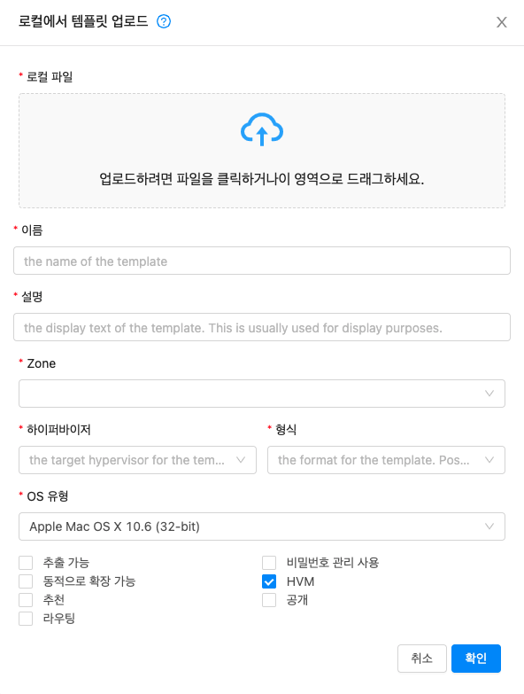
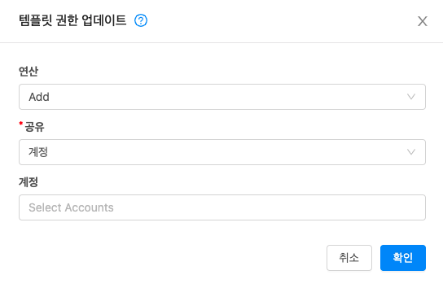
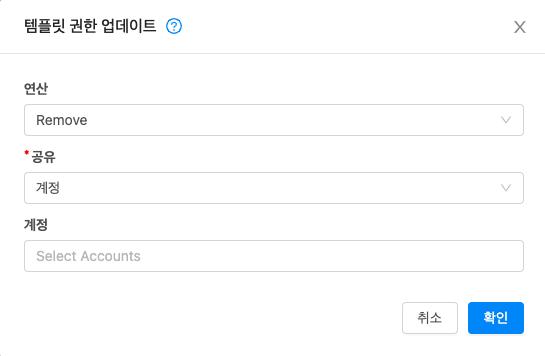
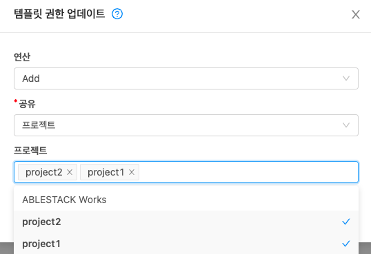
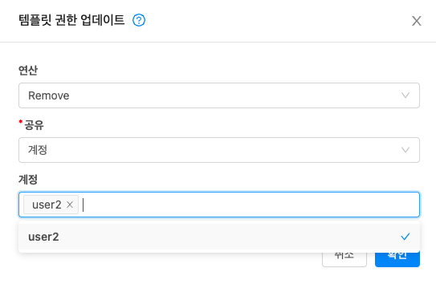
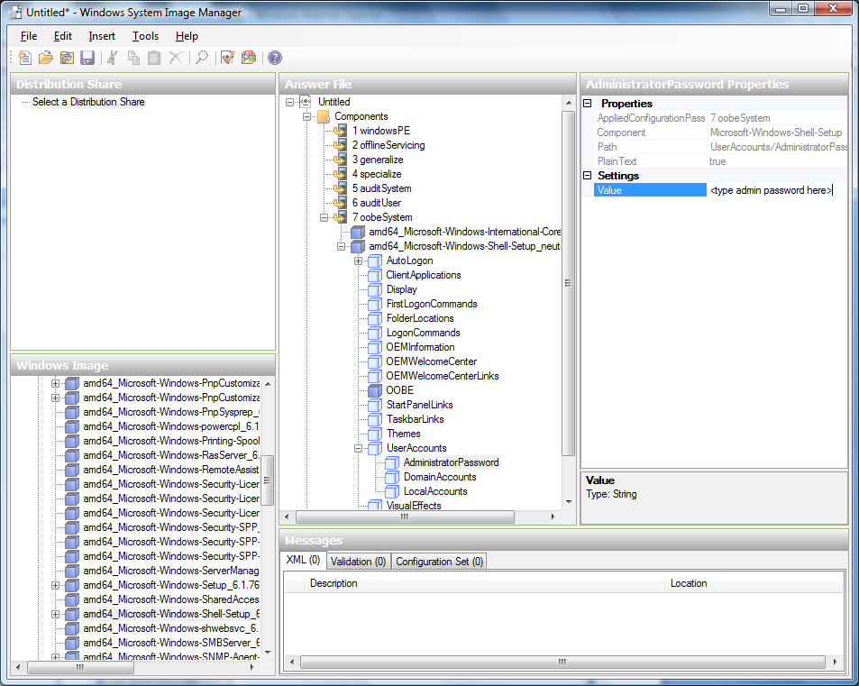

# 템플릿 및 ISO 관리
템플릿은 가상 머신에 재사용 가능한 구성입니다. 사용자가 VM을 시작할 때 Mold의 템플릿 목록에서 선택할 수 있습니다.

특히 템플릿은 다양한 운영 체제 중 하나, 사무실 응용 프로그램과 같은 선택적 추가 소프트웨어, 템플릿을 사용할 수 있는 사용자를 결정하는 액세스 제어와 같은 설정을 포함하는 가상 디스크 이미지입니다. 각 템플릿은 템플릿이 Mold에 추가될 때 지정되는 특정 유형의 하이퍼바이저와 연결됩니다.

Mold는 기본 템플릿과 함께 제공됩니다. 사용자에게 더 많은 선택 사항을 제공하기 위해 Mold 관리자와 사용자는 템플릿을 생성하고 이를 Mold에 추가할 수 있습니다.

## 템플릿 생성 : 개요
Mold는 CentOS 운영 체제용 기본 템플릿과 함께 제공됩니다. 더 많은 템플릿을 추가하는 다양한 방법이 있습니다. 관리자와 최종 사용자는 템플릿을 추가할 수 있습니다. 일반적인 이벤트 순서는 다음과 같습니다.

* 원하는 운영체제가 있는 VM 인스턴스를 시작합니다. VM에 대한 기타 원하는 구성 변경을 수행합니다.
* VM을 중지합니다.
* 볼륨을 템플릿으로 변환합니다.

Mold에 템플릿을 추가하는 다른 방법이 있습니다. 예를 들어 VM 볼륨의 스냅샷을 만들고 스냅샷에서 템플릿을 만들거나 다른 시스템에서 Mold로 VHD를 가져올 수 있습니다.

템플릿을 만드는 다양한 기술은 다음 몇 섹션에서 설명합니다.

## 템플릿 요구 사항
* XenServer의 경우 생성하는 각 템플릿에 PV 드라이버/Xen 도구를 설치합니다. 이렇게 하면 실시간 마이그레이션 및 게스트 종료가 가능합니다.
* vSphere의 경우 생성하는 각 템플릿에 VMware Tools를 설치합니다. 이렇게 하면 콘솔보기가 제대로 작동합니다.

## 템플릿 모범 사례
대형 템플릿 (100GB 이상)을 사용하려는 경우 대형 템플릿을 지원하는 10 기가비트 네트워크가 있는지 확인하십시오. 네트워크 속도가 느리면 큰 템플릿을 사용할 때 시간 초과 및 기타 오류가 발생할 수 있습니다.

## 기본 템플릿
Mold에는 CentOS 템플릿이 포함되어 있습니다. 이 템플릿은 기본 및 보조 스토리지가 구성된 후 보조 스토리지 VM에서 다운로드됩니다. 프로덕션 배포에서 이 템플릿을 사용하거나 이를 삭제하고 사용자 지정 템플릿을 사용할 수 있습니다.

기본 템플릿의 루트 암호는 "password"입니다.

XenServer, KVM 및 vSphere 각각에 대해 기본 템플릿이 제공됩니다. 다운로드되는 템플릿은 클라우드에서 사용 가능한 하이퍼바이저 유형에 따라 다릅니다. 각 템플릿의 실제 크기는 약 2.5GB입니다.

기본 템플릿에는 ssh를 제외한 템플릿에 대한 대부분의 액세스를 차단하는 표준 iptables 규칙이 포함됩니다.

```
# iptables --list
Chain INPUT (policy ACCEPT)
target     prot opt source               destination
RH-Firewall-1-INPUT  all  --  anywhere             anywhere

Chain FORWARD (policy ACCEPT)
target     prot opt source               destination
RH-Firewall-1-INPUT  all  --  anywhere             anywhere

Chain OUTPUT (policy ACCEPT)
target     prot opt source               destination

Chain RH-Firewall-1-INPUT (2 references)
target     prot opt source               destination
ACCEPT     all  --  anywhere             anywhere
ACCEPT     icmp --  anywhere        anywhere       icmp any
ACCEPT     esp  --  anywhere        anywhere
ACCEPT     ah   --  anywhere        anywhere
ACCEPT     udp  --  anywhere        224.0.0.251    udp dpt:mdns
ACCEPT     udp  --  anywhere        anywhere       udp dpt:ipp
ACCEPT     tcp  --  anywhere        anywhere       tcp dpt:ipp
ACCEPT     all  --  anywhere        anywhere       state RELATED,ESTABLISHED
ACCEPT     tcp  --  anywhere        anywhere       state NEW tcp dpt:ssh
REJECT     all  --  anywhere        anywhere       reject-with icmp-host-
```

<H3>개인 및 공용 템플릿</H3>
사용자가 템플릿을 만들 때 비공개 또는 공개로 지정할 수 있습니다.

개인 템플릿은 해당 템플릿을 만든 사용자만 사용할 수 있습니다. 기본적으로 업로드된 템플릿은 비공개입니다.

사용자가 템플릿을 "공개"로 표시하면 사용자 도메인의 모든 계정에 있는 모든 사용자와 템플릿이 저장된 zone에 액세스할 수 있는 다른 도메인의 사용자가 템플릿을 사용할 수 있습니다. 이는 Zone이 개인 또는 공용으로 정의되었는지 여부에 따라 다릅니다. 비공개 zone은 단일 도메인에 할당되고 공개 zone은 모든 도메인에 액세스할 수 있습니다. 공개 템플릿이 비공개 zone에 생성된 경우 해당 zone에 할당된 도메인의 사용자만 사용할 수 있습니다. 공용 zone에 공용 템플릿이 생성되면 모든 도메인의 모든 사용자가 사용할 수 있습니다.

<H3>기존 가상 머신에서 템플릿 생성</H3>
원하는 방식으로 하나 이상의 VM을 설정하면 다른 VM의 프로토 타입으로 사용할 수 있습니다.

1. "VM 만들기"에 제공된 기술 중 하나를 사용하여 가상 머신을 만들고 시작합니다.
2. 실행 중인 VM에서 원하는 구성을 변경한 다음 중지를 클릭합니다.
3. VM이 중지될 때까지 기다립니다. 상태가 중지됨으로 표시되면 다음 단계로 이동합니다.
4. "View Volumes"로 이동하여 "ROOT"유형의 볼륨을 선택합니다.
5. 템플릿 만들기를 클릭하고 다음을 제공합니다.

    * 이름 및 표시 텍스트. UI에 표시되므로 설명이 포함된 항목을 선택하세요.
    * OS 유형. (VMware 제외). 이는 Mold 및 하이퍼바이저가 특정 작업을 수행하고 게스트의 성능을 향상시키는 가정을 하는 데 도움이 됩니다. 다음 중 하나를 선택하십시오.
        * 중지된 VM의 운영 체제가 나열되면 선택합니다.
        * 중지된 VM의 OS 유형이 나열되지 않으면 기타를 선택합니다.
        * PV 모드에서 이 템플릿에서 부팅하려면 기타 PV (32 비트) 또는 기타 PV (64 비트)를 선택합니다. 이 선택 사항은 XenServere에서만 사용할 수 있습니다.

        !!! note
            일반적으로 이미지에 있는 버전보다 이전 버전의 OS를 선택해서는 안 됩니다. 예를 들어 CentOS 6.2 이미지를 지원하기 위해 CentOS 5.4를 선택하면 일반적으로 작동하지 않습니다. 이 경우 기타를 선택해야 합니다.
        !!! note
            VMware 템플릿은 사용자 또는 관리자가 템플릿을 등록할 때 OS 유형을 선택하는 것을 허용하지 않습니다. OS 유형은 등록된 후 템플릿에서 가져옵니다.

    * 공개. 예를 선택하여 이 Mold 설치의 모든 사용자가 이 템플릿에 액세스할 수 있도록 합니다. 템플릿이 커뮤니티 템플릿 목록에 나타납니다. “개인 및 공용 템플릿"을 참조하십시오.
    * 암호 사용. 템플릿에 Mold 비밀번호 변경 스크립트가 설치된 경우 예를 선택합니다. 템플릿에 암호 관리 추가를 참조하십시오.
6. 추가를 클릭하십시오.

템플릿 생성 프로세스가 완료되면 새 템플릿이 템플릿 섹션에 표시됩니다. 그러면 새 VM을 만들 때 템플릿을 사용할 수 있습니다.

!!! note
    템플릿 생성 프로세스가 완료되면 새 템플릿이 템플릿 섹션에 표시됩니다. 그러면 새 VM을 만들 때 템플릿을 사용할 수 있습니다.

<H3>스냅 샷에서 템플릿 생성</H3>
Create Template 메뉴 항목을 사용하기 위해 VM을 중지하지 않으려면 ( “기존 가상 머신에서 템플릿 생성"에 설명 된대로 ) Mold UI를 통해 스냅 샷에서 직접 템플릿을 생성할 수 있습니다.

<H3>원격 HTTP 서버에서 템플릿 업로드</H3>
<H4>vSphere 템플릿 및 ISO</H4>

!!! warning
    vSphere Client를 사용하여 생성한 템플릿을 업로드하는 경우 OVA 파일에 ISO가 포함되어 있지 않은지 확인하십시오. 그렇다면 템플릿에서 VM 배포가 실패합니다.

URL을 기반으로 템플릿이 업로드됩니다. HTTP는 지원되는 액세스 프로토콜입니다. 템플릿은 종종 큰 파일입니다. 선택적으로 gzip을 사용하여 업로드 시간을 줄일 수 있습니다.

템플릿을 업로드하려면 :

1. 왼쪽 탐색 모음에서 템플릿을 클릭합니다.
2. 템플릿 등록을 클릭합니다.
3. 다음을 제공하십시오.

    * 이름 및 설명. UI에 표시되므로 설명이 포함된 항목을 선택하세요.
    * URL. 관리 서버는 지정된 URL에서 파일을 다운로드합니다 http://my.web.server/filename.vhd.gz.
    * zone. 템플릿을 사용할 수 있는 zone을 선택하거나 Mold 전체에서 사용할 수 있도록 하려면 모든 zone을 선택합니다.
    * OS 유형 : (VMware 제외). 이는 Mold 및 하이퍼바이저가 특정 작업을 수행하고 게스트의 성능을 향상시키는 가정을 하는 데 도움이 됩니다. 다음 중 하나를 선택하십시오.
        * 중지된 VM의 운영 체제가 나열되면 선택합니다.
        * 중지된 VM의 OS 유형이 나열되지 않으면 기타를 선택합니다.
        !!! note
            이미지의 버전보다 이전 버전의 OS를 선택해서는 안됩니다. 예를 들어 CentOS 6.2 이미지를 지원하기 위해 CentOS 5.4를 선택하면 일반적으로 작동하지 않습니다. 이 경우 기타를 선택해야 합니다.
        !!! note
            VMware 템플릿은 사용자 또는 관리자가 템플릿을 등록할 때 OS 유형을 선택하는 것을 허용하지 않습니다. OS 유형은 등록된 후 템플릿에서 가져옵니다.

    * 하이퍼바이저 : 지원되는 하이퍼바이저가 나열됩니다. 원하는 것을 선택하십시오.
    * 형식. VHD 또는 OVA와 같은 템플릿 업로드 파일의 형식입니다.
    * 암호 사용. 템플릿에 Mold 비밀번호 변경 스크립트가 설치된 경우 예를 선택합니다. 템플릿에 암호 관리 추가를 참조하십시오.
    * 추출 가능. 템플릿을 추출할 수 있는 경우 예를 선택합니다. 이 옵션을 선택하면 최종 사용자가 템플릿의 전체 이미지를 다운로드할 수 있습니다.
    * 공개. 예를 선택하여 이 Mold 설치의 모든 사용자가 이 템플릿에 액세스할 수 있도록합니다. 템플릿이 커뮤니티 템플릿 목록에 나타납니다. “개인 및 공용 템플릿"을 참조하십시오.
    * 추천. 사용자가 선택할 수 있도록 이 템플릿을 더 눈에 띄게 하려면 예를 선택합니다. 템플릿이 추천 템플릿 목록에 나타납니다. 관리자 만 템플릿을 추천으로 만들 수 있습니다.

다중 디스크 템플릿 업로드도 지원됩니다.
    !!! note
        VMware에만 해당 : 선택한 템플릿에 OVF 속성, 다른 배포 옵션 또는 구성, 여러 NIC 또는 최종 사용자 라이센스 계약이 포함된 경우 마법사에 이러한 속성이 표시됩니다. "가상 어플라이언스 지원"을 참조하십시오.

## KVM 템플릿 용 보조 스토리지 우회
Mold는 KVM에서 템플릿을 등록하고 사용하는 추가 방법을 제공합니다.

템플릿을 등록하고 보조 스토리지에 저장하는 대신 사용자는 템플릿 등록 시 KVM 용 보조 스토리지에 템플릿 다운로드를 건너뛰도록 선택할 수 있습니다. 배포 시 템플릿은 보조 스토리지에서 복사되는 대신 등록된 소스에서 기본 스토리지로 직접 다운로드됩니다.

지원되는 프로토콜 : HTTP/HTTPS, NFS 및 메탈 링크. 프로토콜은 템플릿 URL에서 가져옵니다.

템플릿에 대해 이 옵션을 활성화하려면 :

1. 왼쪽 탐색 모음에서 템플릿을 클릭합니다.
2. 템플릿 등록을 클릭합니다.
3. 하이퍼바이저로 KVM을 선택하십시오.
    <center></center>
    직접 다운로드. 이 옵션은 KVM이 하이퍼바이저로 선택될 때 UI에 표시됩니다. 예를 선택하여 보조 스토리지 우회 옵션을 활성화합니다.

템플릿이 등록되면 VM 배포에 자동으로 사용할 수 있습니다.

시스템 VM 템플릿은 직접 다운로드도 지원합니다. 관리자는 직접 다운로드 플래그를 사용하여 새 시스템 VM 템플릿을 ROUTING 또는 USER 유형으로 등록할 수 있으며, 업그레이드 중 또는 대역 외 데이터베이스 변경을 통해 SYSTEM 유형으로 변경할 수 있습니다. 새로 등록된 템플릿의 유형은 다음과 유사한 SQL 쿼리를 사용하여 데이터베이스에서 SYSTEM으로 변경할 수 있습니다.

```
UPDATE cloud.vm_template SET type='SYSTEM' WHERE uuid='UUID_OF_NEW_TEMPLATE';
```

HTTPS를 통한 직접 다운로드의 경우 KVM 호스트에 유효한 인증서가 있어야 합니다. 이러한 인증서는 자체 서명되거나 서명될 수 있으며 KVM 호스트가 템플릿/ISO에 액세스하여 다운로드할 수 있도록합니다.

Mold는 직접 다운로드를 위한 인증서를 처리하는 몇 가지 API를 제공합니다.

* id = ZONE_ID 인 zone에서 'Up' 상태의 호스트에 인증서를 업로드합니다.
    ```
    upload templatedirectdownloadcertificate hypervisor=KVM name=CERTIFICATE_ALIAS zoneid=ZONE_ID certificate=CERTIFICATE_FORMATTED
    ```

    어디 :
        * CERTIFICATE_FORMATTED는 X509 인증서의 문자열 형식입니다.
        * CERTIFICATE_ALIAS는 각 KVM 호스트에서 인증서를 가져오는 데 사용될 별칭입니다.

    참고 : 이러한 인증서는 각 KVM 호스트의 /etc/cloudstack/agent/cloud.jks 키 저장소로 가져옵니다.

* id = ZONE_ID 인 zone에서 'Up' 상태의 모든 호스트에서 인증서를 취소합니다.
    ```
    revoke templatedirectdownloadcertificate hypervisor=KVM name=CERTIFICATE_ALIAS zoneid=ZONE_ID
    ```

* zone 내의 특정 호스트에서 인증서를 취소할 수도 있습니다.
    ```
    revoke templatedirectdownloadcertificate hypervisor=KVM name=CERTIFICATE_ALIAS zoneid=ZONE_ID hostid=HOST_ID
    ```

* zone 내의 호스트에서 인증서가 해지된 후 호스트에 다시 업로드할 수 있습니다.
    ```
    upload templatedirectdownloadcertificate hypervisor=KVM name=CERTIFICATE_ALIAS zoneid=ZONE_ID certificate=CERTIFICATE_FORMATTED hostid=HOST_ID
    ```

이전에 기존 호스트에 업로드된 인증서를 포함하지 않는 zone에 새 호스트를 추가할 수 있습니다.

Mold는 각 zone의 연결된 모든 호스트에서 인증서를 동기화하는 방법을 제공합니다. 글로벌 설정 'direct.download.certificate.background.task.interval'은 동기화 작업이 실행되는 간격을 정의합니다. 이 작업은 다음을 수행합니다.

* 활성화된 각 zone을 반복합니다.
* zone에서 연결된 호스트 열거
* 이미 다른 호스트에 업로드된 인증서가 누락된 호스트를 확인하십시오.
* 누락된 인증서를 호스트에 업로드

템플릿을 직접 다운로드하기 위해 다른 시간 제한 값을 구성하는 기능이 추가되었습니다. 이를 위해 세 가지 새로운 글로벌 설정이 추가되었습니다.

* direct.download.connect.timeout - 직접 다운로드를 위한 연결 설정 제한 시간 (밀리 초)입니다. 기본값 : 5000 밀리 초.
* direct.download.socket.timeout - 직접 다운로드를 위한 소켓 제한 시간 (SO_TIMEOUT) (밀리 초). 기본값 : 5000 밀리 초.
* direct.download.connection.request.timeout - 직접 다운로드를 위해 연결 관리자 제한 시간 (밀리 초)에서 연결 요청. 기본값 : 5000 밀리 초. 이 설정은 숨겨져 있으며 UI에 표시되지 않습니다.

## 로컬 컴퓨터에서 템플릿 및 ISO 업로드
이미 준비된 템플릿이나 로컬 컴퓨터에서 ISO를 업로드할 수도 있습니다. 단계는 PC에서 로컬 템플릿/ISO 파일을 선택해야 한다는 점을 제외하면 원격 HTTP 서버에서 템플릿/ISO를 업로드할 때와 유사합니다. 이 기능이 작동하려면 SSVM이 HTTPS를 지원해야합니다 (자세한 내용은 "콘솔 프록시에 SSL 인증서 사용"참조 ).

!!! note
    VMware 템플릿은 사용자 또는 관리자가 템플릿을 업로드할 때 OS 유형을 선택하는 것을 허용하지 않습니다. OS 유형은 업로드 후 템플릿에서 가져옵니다.

로컬 (브라우저)에서 템플릿/ISO를 업로드하는 GUI 대화 상자의 예는 다음과 같습니다.
<center></center>

<center></center>

다중 디스크 템플릿 업로드도 지원됩니다.

<H3>다른 계정 / 프로젝트와 템플릿 및 ISO 공유</H3>
템플릿/ISO를 추가할 때 소유자는 템플릿/ISO를 공개하거나 비공개로 유지하도록 선택할 수 있습니다. 템플릿/ISO가 생성되면 소유자는 다른 계정/프로젝트도 템플릿/ISO를 사용할 수 있도록 이 템플릿/ISO를 공유하도록 선택할 수 있습니다.

현재 소유자는 자신의 템플릿/ISO를 다음과 공유할 수 있습니다.

* 자신의 도메인 내의 다른 계정 (즉, 자신의 도메인 또는 다른 도메인의 하위 도메인에 있는 다른 계정과 템플릿 / ISO를 공유할 수 없음)
그가 속한 프로젝트 (예 : 그가 소유자 / 창작자인 프로젝트 또는 그가 참여한 다른 프로젝트)
* 그가 속한 프로젝트 (예 : 그가 소유자 / 창작자인 프로젝트 또는 그가 참여한 다른 프로젝트)

템플릿/ISO 권한은 updateTemplatePermissions / updateIsoPermissions API 호출 또는 GUI를 통해 변경할 수 있습니다. 템플릿/ISO 권한을 추가, 제거 또는 재설정 (모두 제거)할 수 있습니다.

템플릿/ISO에서 권한을 추가하거나 제거할 때 템플릿/ISO 권한에서 추가/제거되는 계정/프로젝트 이름을 지정해야 합니다.

글로벌 설정 "allow.user.view.all.domain.accounts"의 기본값은 "false"입니다. 이렇게 하면 일반 사용자가 GUI를 통해 템플릿/ISO를 공유하려고 할 때 도메인의 모든 계정 목록이 표시되지 않으며 대상의 이름을 알아야 합니다. 템플릿/ISO를 공유하는 계정입니다. 이는 단일 도메인의 각 계정이 서로 다른 테넌트/고객이고 개인 정보 보호가 필수적인 퍼블릭 클라우드에서 의미가 있습니다. 이 경우 아래 이미지와 같이 사용자에게 계정 이름을 입력할 수 있는 입력 필드가 표시됩니다.

!!! note
    아래에 표시된 이미지는 템플릿 권한을 참조하지만, ISO 권한에도 동일하게 적용됩니다.

<center></center>
선택한 계정과 템플릿 공유 (다중 선택 가능)

<center></center>
선택한 계정과 템플릿 공유 취소

그러나 도메인 내의 개인 정보가 문제가되지 않는 환경에서 "allow.user.view.all.domain.accounts" 설정을 "true"로 설정하면 템플릿을 공유하는 사용자에게 더 많은 정보가 표시됩니다. 자신의 도메인에있는 모든 계정을 나열하는 사용자 친화적인 다중 선택 목록. 이것은 아래 이미지에 나와 있습니다.

<center></center>
"user2"계정으로 만 템플릿 공유

<center></center>
2 개의 특정 프로젝트와 템플릿 공유

<center></center>
"user2"계정에서 권한 취소

<center></center>
이전에 추가된 두 프로젝트 모두에서 권한 취소

마지막으로 템플릿 권한을 재설정할 수 있습니다.
<center></center>
권한 재설정 (모두 제거)

!!! warning
    프로젝트 소유 템플릿은 프로젝트 외부에서 공유할 수 없으며 그렇게 하려고하면 적절한 오류 메시지가 표시됩니다.

## 템플릿 내보내기
최종 사용자와 관리자는 Mold에서 템플릿을 내보낼 수 있습니다. UI에서 템플릿으로 이동하고 작업 메뉴에서 다운로드 기능을 선택합니다.

## Linux 템플릿 생성
템플릿 배포를 위해 Linux VM을 준비하려면 이 설명서를 사용하여 Linux 템플릿을 준비해야 합니다. 문서화의 편의를 위해 템플릿을 구성하는 VM을 "템플릿 마스터"라고 합니다. 이 가이드는 현재 UserData 및 cloud-init를 활용하지 않는 레거시 설정을 다루며 설치 중에 openssh-server가 설치되었다고 가정합니다.

절차의 개요는 다음과 같습니다.

1. Linux ISO를 업로드하십시오. 자세한 내용은 "ISO 추가"를 참조하십시오.
2. 이 ISO로 VM 인스턴스를 만듭니다. 자세한 내용은 “VM 만들기"를 참조하십시오.
3. Linux VM 준비
4. VM에서 템플릿을 만듭니다. 자세한 내용은 "기존 가상 머신에서 템플릿 생성"을 참조하십시오.

다음 단계에서는 템플릿을 위한 기본 Linux 설치를 준비합니다.

1. 설치

설치 중에 VM의 이름을 일반적인 이름으로 지정하는 것이 좋습니다. 이렇게 하면 LVM과 같은 구성 요소가 컴퓨터에 고유하게 표시되지 않습니다. 설치에는 "localhost" 이름을 사용하는 것이 좋습니다.

!!! warning
    CentOS의 경우 인터페이스 구성 파일에서 고유한 ID를 가져와야 합니다. 이 편집은 /etc/sysconfig/network-scripts/ifcfg-eth0 이고 내용을 다음과 같이 변경합니다.

```
DEVICE=eth0
TYPE=Ethernet
BOOTPROTO=dhcp
ONBOOT=yes
```

다음 단계는 템플릿 마스터의 패키지를 업데이트합니다.

* Ubuntu
    ```
    sudo -i
    apt-get update
    apt-get upgrade -y
    apt-get install -y acpid ntp
    reboot
    ```

* CentOS
    ```
    ifup eth0
    yum update -y
    reboot
    ```

2. 비밀번호 관리
!!! note
    원하는 경우 사용자 정의 사용자 (예 : Ubuntu 설치 중에 생성된 사용자)를 제거해야합니다. 먼저 암호를 제공하여 루트 사용자 계정이 활성화되었는지 확인한 다음 계속하려면 루트로 로그인하십시오.

```
sudo passwd root
logout
```

루트 권한으로 설치 프로세스 중에 생성된 모든 사용자 지정 사용자 계정을 제거합니다.

```
deluser myuser --remove-home
```

암호 관리 스크립트를 설정하는 방법은 템플릿에 암호 관리 추가를 참조하십시오. 그러면 Mold 웹 인터페이스에서 루트 암호를 변경할 수 있습니다.

3. 호스트 이름 관리
CentOS는 부팅 시 기본적으로 호스트 이름을 구성합니다. 불행히도 Ubuntu에는 이 기능이 없으므로 Ubuntu 설치의 경우 다음 단계를 사용하십시오.

* Ubuntu
템플릿 기반 VM의 호스트 이름은 /etc/dhcp/dhclient-exit-hooks.d의 사용자 지정 스크립트에 의해 설정됩니다. 이 스크립트는 먼저 현재 호스트 이름이 localhost인지 확인하고 true이면 호스트 이름, domain-name을 가져옵니다. DHCP 임대 파일에서 name 및 fixed-ip를 사용하고 해당 값을 사용하여 호스트 이름을 설정하고 로컬 호스트 이름 확인을 위해 /etc/hosts 파일을 추가합니다. 이 스크립트 또는 사용자가 localhost에서 호스트 이름을 변경하면 새 호스트 이름에 관계없이 더 이상 시스템 파일을 조정하지 않습니다. 스크립트는 또한 템플릿 작성 전에 삭제해야 하는 openssh-server 키를 다시 만듭니다 (아래 참조). 다음 스크립트를 /etc/dhcp/dhclient-exit-hooks.d/sethostname에 저장하고 권한을 조정합니다.
```
#!/bin/sh
# dhclient change hostname script for Ubuntu
oldhostname=$(hostname -s)
if [ $oldhostname = 'localhost' ]
then
    sleep 10 # Wait for configuration to be written to disk
    hostname=$(cat /var/lib/dhcp/dhclient.eth0.leases  |  awk ' /host-name/ { host = $3 }  END { printf host } ' | sed     's/[";]//g' )
    fqdn="$hostname.$(cat /var/lib/dhcp/dhclient.eth0.leases  |  awk ' /domain-name/ { domain = $3 }  END { printf     domain } ' | sed 's/[";]//g')"
    ip=$(cat /var/lib/dhcp/dhclient.eth0.leases  |  awk ' /fixed-address/ { lease = $2 }  END { printf lease } ' | sed     's/[";]//g')
    echo "cloudstack-hostname: Hostname _localhost_ detected. Changing hostname and adding hosts."
    printf " Hostname: $hostname\n FQDN: $fqdn\n IP: $ip"
    # Update /etc/hosts
    awk -v i="$ip" -v f="$fqdn" -v h="$hostname" "/^127/{x=1} !/^127/ && x { x=0; print i,f,h; } { print $0; }" /etc/hosts > /etc/hosts.dhcp.tmp
    mv /etc/hosts /etc/hosts.dhcp.bak
    mv /etc/hosts.dhcp.tmp /etc/hosts
    # Rename Host
    echo $hostname > /etc/hostname
    hostname -b -F /etc/hostname
    echo $hostname > /proc/sys/kernel/hostname
    # Recreate SSH2
    export DEBIAN_FRONTEND=noninteractive
    dpkg-reconfigure openssh-server
fi
### End of Script ###

chmod 774  /etc/dhcp/dhclient-exit-hooks.d/sethostname
```

!!! note
    템플릿 마스터를 템플릿할 준비가되면 다음 단계를 실행해야합니다. 이 단계에서 템플릿 마스터가 재부팅되면 모든 단계를 다시 실행해야합니다. 이 프로세스가 끝나면 템플릿 마스터를 종료하고 템플릿을 생성하여 최종 템플릿을 만들고 배포해야합니다.

4. udev 영구 장치 규칙 제거
이 단계는 네트워크 MAC 주소, 임대 파일 및 CD 블록 장치와 같은 템플릿 마스터에 고유 한 정보를 제거하고 다음 부팅 시 파일이 자동으로 생성됩니다.

* Ubuntu
```
rm -f /etc/udev/rules.d/70*
rm -f /var/lib/dhcp/dhclient.*
```

* CentOS
```
rm -f /etc/udev/rules.d/70*
rm -f /var/lib/dhclient/*
```

5. SSH 키 제거
이 단계는 모든 템플릿 VM에 동일한 SSH 키가 없어서 시스템의 보안이 크게 저하되지 않도록하는 것입니다.
```
rm -f /etc/ssh/*key*
```

6. 로그 파일 정리
템플릿 마스터에서 오래된 로그를 제거하는 것이 좋습니다.
```
cat /dev/null > /var/log/audit/audit.log 2>/dev/null
cat /dev/null > /var/log/wtmp 2>/dev/null
logrotate -f /etc/logrotate.conf 2>/dev/null
rm -f /var/log/*-* /var/log/*.gz 2>/dev/null.
```

7. 호스트 이름 설정
Ubuntu DHCP 스크립트가 작동하고 CentOS dhclient가 VM 호스트 이름을 설정하려면 둘 다 템플릿 마스터의 호스트 이름이 "localhost"여야합니다. 다음 명령을 실행하여 호스트 이름을 변경합니다.
```
hostname localhost
echo "localhost" > /etc/hostname
```

8. 만료할 사용자 암호 설정
이 단계에서는 템플릿이 배포된 후 사용자가 VM의 암호를 변경해야합니다.
```
passwd --expire root
```

9. 사용자 기록 지우기
다음 단계에서는 방금 실행 한 bash 명령을 지 웁니다.
```
history -c
unset HISTFILE
```

10. VM 종료
이제 템플릿 마스터를 종료하고 템플릿을 만들 준비가되었습니다!
```
halt -p
```

11. 템플릿을 만드세요!
이제 템플릿을 생성할 준비가되었습니다. 자세한 내용은 "기존 가상 머신에서 템플릿 생성"을 참조하십시오.

!!! note
    Ubuntu 및 CentOS 모두에 대한 템플릿화된 VM은 호스트 이름을 가져 오기 위해 프로비저닝 후 재부팅해야할 수 있습니다.

## Windows 템플릿 만들기
Windows 템플릿은 여러 시스템에서 프로비저닝하기 전에 Sysprep을 사용하여 준비해야 합니다. Sysprep을 사용하면 일반 Windows 템플릿을 만들고 가능한 SID 충돌을 방지할 수 있습니다.

!!! note
    (XenServer) XenServer에서 실행되는 Windows VM에는 템플릿에 제공되거나 VM이 생성된 후에 추가될 수 있는 PV 드라이버가 필요합니다. PV 드라이버는 추가 볼륨 및 ISO 이미지 마운트, 라이브 마이그레이션 및 정상 종료와 같은 필수 관리 기능에 필요합니다.

절차의 개요는 다음과 같습니다.

1. Windows ISO를 업로드하십시오.
2. 자세한 내용은 "ISO 추가"를 참조하십시오. 이 ISO로 VM 인스턴스를 만듭니다.
3. 자세한 내용은 “VM 만들기"를 참조하십시오. Windows Server 버전에 따라 Windows Server 2008 R2 용 Sysprep (아래) 또는 Windows Server 2003 R2 용 Sysprep의 단계를 따릅니다.
4. 준비 단계가 완료되었습니다. 이제 Windows 템플릿 만들기에 설명된 대로 실제로 템플릿을 만들 수 있습니다.

Windows 2008 R2의 경우 Windows 시스템 이미지 관리자를 실행하여 사용자 지정 sysprep 응답 XML 파일을 만듭니다. Windows 시스템 이미지 관리자는 Windows AIK (자동 설치 키트)의 일부로 설치됩니다. Windows AIK는 Microsoft 다운로드 센터에서 다운로드할 수 있습니다.

다음 단계를 사용하여 Windows 2008 R2 용 sysprep을 실행하십시오.

!!! note
    여기에 설명된 단계는 원래 Windows Server 2008 Sysprep Mini-Setup에 게시된 Charity Shelbourne의 훌륭한 가이드에서 파생되었습니다.

1. Windows AIK 다운로드 및 설치
!!! note
    방금 만든 Windows 2008 R2 VM에 Windows AIK를 설치하면 안 됩니다. Windows AIK는 사용자가 만든 템플릿의 일부가 아니어야 합니다. sysprep 응답 파일을 만드는 데만 사용됩니다.

2. Windows 2008 R2 설치 DVD의 \sources 디렉터리에 있는 install.wim 파일을 하드 디스크에 복사합니다. 이것은 매우 큰 파일이며 복사하는 데 시간이 오래 걸릴 수 있습니다. Windows AIK를 사용하려면 WIM 파일이 쓰기 가능해야 합니다.
3. Windows AIK의 일부인 Windows 시스템 이미지 관리자를 시작합니다.
4. Windows 이미지 창에서 Windows 이미지 또는 카탈로그 파일 선택 옵션을 마우스 오른쪽 단추로 클릭하여 방금 복사한 install.wim 파일을로드합니다.
5. Windows 2008 R2 Edition을 선택합니다. 카탈로그 파일을 열 수 없다는 경고 메시지가 표시될 수 있습니다. 예를 클릭하여 새 카탈로그 파일을 만듭니다.
6. 응답 파일 창에서 마우스 오른쪽 단추를 클릭하여 새 응답 파일을 만듭니다.
7. 다음 단계를 사용하여 Windows 시스템 이미지 관리자에서 응답 파일을 생성합니다.
    1. 자동화해야하는 첫 번째 페이지는 언어 및 국가 또는 지역 선택 페이지입니다. 이를 자동화하려면 Windows 이미지 창에서 구성 요소를 확장하고 마우스 오른쪽 단추를 클릭한 다음 Microsoft-Windows-International-Core 설정을 Pass 7 oobeSystem에 추가합니다. 응답 파일 창에서 언어와 국가 또는 지역에 대한 적절한 설정을 사용하여 InputLocale, SystemLocale, UILanguage 및 UserLocale을 구성합니다. 이러한 설정에 대한 질문이 있는 경우 특정 설정을 마우스 오른쪽 단추로 클릭하고 도움말을 선택할 수 있습니다. 구성하려는 설정에 대한 예를 포함하여 자세한 정보가 포함된 적절한 CHM 도움말 파일이 열립니다.
    <center></center>

    2. EULA (최종 사용자 사용권 계약)이라고도 하는 소프트웨어 사용 조건 선택 페이지를 자동화해야 합니다. 이렇게 하려면 Microsoft-Windows-Shell-Setup 구성 요소를 확장합니다. OOBE 설정을 강조 표시하고 설정을 Pass 7 oobeSystem에 추가합니다. 설정에서 HideEULAPage를 true로 설정하십시오.
    <center></center>

    3. 라이센스 키가 올바르게 설정되었는지 확인하십시오. MAK 키를 사용하는 경우 Windows 2008 R2 VM에 MAK 키를 입력하기만 하면 됩니다. Windows 시스템 이미지 관리자에 MAK를 입력할 필요가 없습니다. 정품 인증에 KMS 호스트를 사용하는 경우 제품 키를 입력할 필요가 없습니다. Windows 볼륨 정품 인증에 대한 자세한 내용은 http://technet.microsoft.com/en-us/library/bb892849.aspx 에서 찾을 수 있습니다.

    4. 자동화해야 할 것은 Change Administrator Password 페이지입니다. Microsoft-Windows-Shell-Setup 구성 요소 (아직 확장되지 않은 경우)를 확장하고 UserAccounts를 확장한 다음 AdministratorPassword를 마우스 오른쪽 단추로 클릭하고 응답 파일의 Pass 7 oobeSystem 구성 단계에 설정을 추가합니다. 설정에서 값 옆에 암호를 지정합니다.
    <center></center>

    AIK 설명서를 읽고 배포에 적합한 더 많은 옵션을 설정할 수 있습니다. 위의 단계는 Windows 무인 설치 작업에 필요한 최소한의 단계입니다.

8. 응답 파일을 unattend.xml로 저장합니다. 유효성 검사 창에 나타나는 경고 메시지는 무시할 수 있습니다.

9. unattend.xml 파일을 Windows 2008 R2 가상 머신의 c:\windows\system32\sysprep 디렉터리에 복사합니다.

10. unattend.xml 파일을 c:\windows\system32\sysprep 디렉터리에 배치하면 다음과 같이 sysprep 도구를 실행합니다.
```
cd c:\Windows\System32\sysprep
sysprep.exe /oobe/generalize/shutdown
```
Windows 2008 R2 VM은 sysprep이 완료된 후 자동으로 종료됩니다.

이전 버전의 Windows에는 다른 sysprep 도구가 있습니다. Windows Server 2003 R2의 경우 다음 단계를 따르십시오.

1. Windows 설치 CD에 있는 \support\tools\deploy.cab의 내용을 Windows 2003 R2 VM의 c:\sysprep 디렉터리에 추출합니다.
2. c:\sysprep\setupmgr.exe를 실행하여 sysprep.inf 파일을 만듭니다.

    1. 새 응답 파일을 만들려면 새로 만들기를 선택합니다.
    2. Type of Setup으로“Sysprep setup"을 입력합니다.
    3. 적절한 OS 버전과 에디션을 선택하십시오.
    4. 라이센스 계약 화면에서 "Yes fully automate the installation"를 선택하십시오.
    5. 귀하의 이름과 조직을 제공하십시오.
    6. 디스플레이 설정을 기본값으로 둡니다.
    7. 적절한 시간대를 설정하십시오.
    8. 제품 키를 제공하십시오.
    9. 배포에 적합한 라이센스 모드를 선택하십시오.
    10. "컴퓨터 이름 자동 생성"을 선택합니다.
    11. 기본 관리자 암호를 입력하십시오. 암호 재설정 기능을 활성화하면 사용자는 실제로 이 암호를 사용하지 않습니다. 이 비밀번호는 게스트가 부팅된 후 인스턴스 관리자에 의해 재설정됩니다.
    12. 네트워크 구성 요소는 "일반 설정"으로 둡니다.
    13. “WORKGROUP"옵션을 선택합니다.
    14. 전화 통신 옵션은 기본값으로 둡니다.
    15. 적절한 지역 설정을 선택합니다.
    16. 적절한 언어 설정을 선택하십시오.
    17. 프린터를 설치하지 마십시오.
    18. "한 번 실행 명령"을 지정하지 마십시오.
    19. 식별 문자열을 지정할 필요가 없습니다.
    20. 응답 파일을 c:\sysprep\sysprep.inf로 저장합니다.

3. 다음 명령을 실행하여 이미지를 sysprep합니다.
```
c:\sysprep\sysprep.exe -reseal -mini -activated
```
이 단계가 끝나면 기계가 자동으로 종료됩니다.

## Amazon 머신 이미지 가져 오기
다음 절차에서는 XenServer 하이퍼바이저를 사용할 때 Amazon 머신 이미지 (AMI)를 Mold로 가져오는 방법을 설명합니다.

AMI 파일이 있고 이 파일을 CentOS_6.2_x64라고 가정합니다. CentOS 호스트에서 작업하고 있다고 가정하십시오. AMI가 Fedora 이미지인 경우 처음에 Fedora 호스트에서 작업해야 합니다.

이미지 파일이 Centos/Fedora 호스트에서 사용자 지정되면 VHD로 변환하려면 파일 기반 저장소 (로컬 ext3 SR 또는 NFS SR)가 있는 XenServer 호스트가 있어야 합니다.
!!! note
    명령을 복사하여 붙여 넣을 때 실행하기 전에 명령을 한 줄로 붙여 넣었는지 확인하십시오. 일부 문서 뷰어는 복사된 텍스트에 원하지 않는 줄 바꿈을 도입할 수 있습니다.

1. 이미지 파일에 대한 루프백 설정 :
```
# mkdir -p /mnt/loop/centos62
# mount -o loop  CentOS_6.2_x64 /mnt/loop/centos54
```

2. kernel-xen 패키지를 이미지에 설치합니다. 이렇게 하면 PV 커널과 ramdisk가 이미지로 다운로드됩니다.
```
# yum -c /mnt/loop/centos54/etc/yum.conf --installroot=/mnt/loop/centos62/ -y install kernel-xen
```

3. /boot/grub/grub.conf에 grub 항목을 만듭니다.
```
# mkdir -p /mnt/loop/centos62/boot/grub
# touch /mnt/loop/centos62/boot/grub/grub.conf
# echo "" > /mnt/loop/centos62/boot/grub/grub.conf
```

4. 이미지에 설치된 PV 커널의 이름을 확인합니다.
```
# cd /mnt/loop/centos62
# ls lib/modules/
2.6.16.33-xenU  2.6.16-xenU  2.6.18-164.15.1.el5xen  2.6.18-164.6.1.el5.centos.plus  2.6.18-xenU-ec2-v1.0  2.6.21.7-2.fc8xen  2.6.31-302-ec2
# ls boot/initrd*
boot/initrd-2.6.18-164.6.1.el5.centos.plus.img boot/initrd-2.6.18-164.15.1.el5xen.img
# ls boot/vmlinuz*
boot/vmlinuz-2.6.18-164.15.1.el5xen  boot/vmlinuz-2.6.18-164.6.1.el5.centos.plus  boot/vmlinuz-2.6.18-xenU-ec2-v1.0  boot/vmlinuz-2.6.21-2952.fc8xen
```
Xen 커널/ramdisk는 항상 "xen"으로 끝납니다. 선택한 커널 버전의 경우 lib/modules 아래에 해당 버전에 대한 항목이 있어야하며 이에 해당하는 initrd 및 vmlinuz가 있어야 합니다. 위에서 이 조건을 만족하는 유일한 커널은 2.6.18-164.15.1.el5xen입니다.

5. 찾은 결과에 따라 grub.conf 파일에 항목을 만듭니다. 아래는 예제 항목입니다.
```
default=0
timeout=5
hiddenmenu
title CentOS (2.6.18-164.15.1.el5xen)
   root (hd0,0)
   kernel /boot/vmlinuz-2.6.18-164.15.1.el5xen ro root=/dev/xvda
   initrd /boot/initrd-2.6.18-164.15.1.el5xen.img
```

6. etc/fstab을 편집하여 "sda1"을 "xvda"로 변경하고 "sdb"를 "xvdb"로 변경합니다.
```
# cat etc/fstab
/dev/xvda  /         ext3    defaults        1 1
/dev/xvdb  /mnt      ext3    defaults        0 0
none       /dev/pts  devpts  gid=5,mode=620  0 0
none       /proc     proc    defaults        0 0
none       /sys      sysfs   defaults        0 0
```

7. 콘솔을 통해 로그인을 활성화합니다. XenServer 시스템의 기본 콘솔 장치는 xvc0입니다. etc/inittab 및 etc/securetty에 각각 다음 행이 있는지 확인하십시오.
```
# grep xvc0 etc/inittab
co:2345:respawn:/sbin/agetty xvc0 9600 vt100-nav
# grep xvc0 etc/securetty
xvc0
```

8. ramdisk가 PV 디스크 및 PV 네트워크를 지원하는지 확인하십시오. 위에서 결정한 커널 버전에 맞게 사용자 정의하십시오.
```
# chroot /mnt/loop/centos54
# cd /boot/
# mv initrd-2.6.18-164.15.1.el5xen.img initrd-2.6.18-164.15.1.el5xen.img.bak
# mkinitrd -f /boot/initrd-2.6.18-164.15.1.el5xen.img --with=xennet --preload=xenblk --omit-scsi-modules 2.6.18-164.15.1.el5xen
```

9. 비밀번호를 변경하십시오.
```
# passwd
Changing password for user root.
New UNIX password:
Retype new UNIX password:
passwd: all authentication tokens updated successfully.
```

10. chroot를 종료합니다.
```
# exit
```

11. etc/ssh/sshd_config 에서 비밀번호를 사용하여 ssh 로그인을 허용하는 행을 확인하십시오.
```
# egrep "PermitRootLogin|PasswordAuthentication" /mnt/loop/centos54/etc/ssh/sshd_config
PermitRootLogin yes
PasswordAuthentication yes
```

12. Mold UI 또는 API에서 비밀번호를 재설정하기 위해 템플릿을 활성화해야하는 경우 이 시점에서 비밀번호 변경 스크립트를 이미지에 설치합니다. 템플릿에 암호 관리 추가를 참조하십시오.

13. 루프백 마운트를 마운트 해제하고 삭제합니다.
```
# umount /mnt/loop/centos54
# losetup -d /dev/loop0
```

14. 이미지 파일을 XenServer 호스트의 파일 기반 저장소 저장소에 복사합니다. 아래 예에서 Xenserver는 "xenhost"입니다. 이 XenServer에는 uuid가 a9c5b8c8-536b-a193-a6dc-51af3e5ff799 인 NFS 리포지토리가 있습니다.
```
# scp CentOS_6.2_x64 xenhost:/var/run/sr-mount/a9c5b8c8-536b-a193-a6dc-51af3e5ff799/
```

15. Xenserver에 로그인하고 이미지와 동일한 크기의 VDI를 만듭니다.
```
[root@xenhost ~]# cd /var/run/sr-mount/a9c5b8c8-536b-a193-a6dc-51af3e5ff799
[root@xenhost a9c5b8c8-536b-a193-a6dc-51af3e5ff799]#  ls -lh CentOS_6.2_x64
-rw-r--r-- 1 root root 10G Mar 16 16:49 CentOS_6.2_x64
[root@xenhost a9c5b8c8-536b-a193-a6dc-51af3e5ff799]# xe vdi-create virtual-size=10GiB sr-uuid=a9c5b8c8-536b-a193-a6dc-51af3e5ff799 type=user name-label="Centos 6.2 x86_64"
cad7317c-258b-4ef7-b207-cdf0283a7923
```

16. 이미지 파일을 VDI로 가져옵니다. 이 과정은 10-20 분 정도 소요됩니다.
```
[root@xenhost a9c5b8c8-536b-a193-a6dc-51af3e5ff799]# xe vdi-import filename=CentOS_6.2_x64 uuid=cad7317c-258b-4ef7-b207-cdf0283a7923
```

17. VHD 파일을 찾습니다. 이름이 VDI의 UUID 인 파일입니다. 그것을 압축하고 웹 서버에 업로드하십시오.
```
[root@xenhost a9c5b8c8-536b-a193-a6dc-51af3e5ff799]# bzip2 -c cad7317c-258b-4ef7-b207-cdf0283a7923.vhd > CentOS_6.2_x64.vhd.bz2
[root@xenhost a9c5b8c8-536b-a193-a6dc-51af3e5ff799]# scp CentOS_6.2_x64.vhd.bz2 webserver:/var/www/html/templates/
```

## Hyper-V VM을 템플릿으로 변환
Hyper-V VM을 XenServer 호환 Mold 템플릿으로 변환하려면 NFS VHD SR이 연결된 독립 실행형 XenServer 호스트가 필요합니다. Mold와 함께 사용 중인 XenServer 버전을 사용하되 XenCenter 5.6 FP1 또는 SP2를 사용합니다 (5.6과 역 호환됨) 또한 NFS ISO SR을 연결하면 도움이 될 수 있습니다.

Linux VM의 경우 VM이 XenServer에서 작동하도록 하기 전에 Hyper-V에서 몇 가지 준비 작업을 수행해야 할 수 있습니다. Hyper-V에서 VM을 계속 사용하려는 경우 VM을 복제하고 복제 작업을 수행합니다. Hyper-V 통합 구성 요소를 제거하고 /etc/fstab에서 장치 이름에 대한 참조를 확인합니다.

1. linux_ic/drivers/dist 디렉터리에서 make uninstall을 실행합니다 (여기서 "linux_ic"는 복사된 Hyper-V 통합 구성 요소 파일의 경로임)
2. /boot/ 의 백업에서 원래 initrd를 복원합니다 (백업 이름은 *.backup0).
3. /boot/grub/menu.lst에서 "hdX = noprobe"항목을 제거합니다.
4. /etc/fstab에서 장치 이름으로 마운트된 파티션을 확인하십시오. 해당 항목 (있는 경우)을 LABEL 또는 UUID로 마운트하도록 변경하십시오. blkid 명령으로 해당 정보를 얻을 수 있습니다.

다음 단계는 VM이 ​​Hyper-V에서 실행되고 있지 않은지 확인한 다음 VHD를 XenServer로 가져오는 것입니다. 이를 위한 두 가지 옵션이 있습니다.

옵션 1 :

1. XenCenter를 사용하여 VHD를 가져옵니다. XenCenter에서 Tools> Virtual Appliance Tools> Disk Image Import로 이동합니다.
2. VHD를 선택하고 다음을 클릭합니다.
3. VM의 이름을 지정하고 스토리지에서 NFS VHD SR을 선택하고 "운영 체제 수정 실행"을 활성화하고 NFS ISO SR을 선택합니다.
4. 다음을 클릭한 후 완료를 클릭하십시오. VM을 만들어야 합니다.

옵션 2 :

1. XenConvert를 실행하고 From choose VHD, To choose XenServer에서. 다음을 클릭하십시오.
2. VHD를 선택하고 다음을 클릭합니다.
3. XenServer 호스트 정보를 입력하고 다음을 클릭합니다.
4. VM의 이름을 지정하고 다음, 변환을 차례로 클릭합니다. VM을 만들어야 합니다.

Hyper-V VHD에서 만든 VM이 있으면 다음 단계를 사용하여 준비합니다.

1. VM을 부팅하고 Hyper-V 통합 서비스를 제거한 다음 재부팅합니다.
2. XenServer Tools를 설치 한 다음 재부팅합니다.
3. 원하는대로 VM을 준비합니다. 예를 들어 Windows VM에서 sysprep를 실행합니다. “Windows 템플릿 만들기"를 참조하십시오.

위의 옵션 중 하나는 HVM 모드에서 VM을 생성합니다. Windows VM에는 문제가 없지만 Linux VM은 최적으로 작동하지 않을 수 있습니다. Linux VM을 PV 모드로 변환하려면 추가 단계가 필요하며 배포에 따라 다릅니다.

1. VM을 종료하고 NFS 스토리지에서 웹 서버로 VHD를 복사합니다. 예를 들어 웹 서버에 NFS 공유를 마운트하고 복사하거나 XenServer 호스트에서 sftp 또는 scp를 사용하여 웹 서버에 업로드합니다.
2. Mold에서 다음 값을 사용하여 새 템플릿을 만듭니다.
    * URL. VHD에 대한 URL 제공
    * OS 유형. 적절한 OS를 사용하십시오. CentOS의 PV 모드의 경우 기타 PV (32 비트) 또는 기타 PV (64 비트)를 선택합니다. 이 선택은 XenServer에서만 사용할 수 있습니다.
    * 하이퍼바이저. XenServer
    * 체재. VHD

템플릿이 생성되고 여기에서 인스턴스를 생성할 수 있습니다.

## 템플릿에 암호 관리 추가
Mold는 사용자가 임시 관리자 또는 루트 비밀번호를 설정하고 Mold UI에서 기존 관리자 또는 루트 비밀번호를 재설정할 수 있는 선택적 비밀번호 재설정 기능을 제공합니다.

비밀번호 재설정 기능을 활성화하려면 템플릿을 패치할 추가 스크립트를 다운로드해야 합니다. 나중에 템플릿을 Mold에 업로드할 때 이 템플릿에 대해 관리자/루트 비밀번호 재설정 기능을 활성화할지 여부를 지정할 수 있습니다.

암호 관리 기능은 항상 인스턴스 부팅 시 계정 암호를 재설정합니다. 스크립트는 설정해야 하는 계정 암호를 검색하기 위해 가상 라우터에 대한 HTTP 호출을 수행합니다. 가상 라우터에 액세스할 수 있는 한 게스트는 사용해야 하는 계정 암호에 액세스할 수 있습니다. 사용자가 암호 재설정을 요청하면 관리 서버가 계정의 가상 라우터에 새 암호를 생성하여 보냅니다. 따라서 암호 변경을 적용하려면 인스턴스 재부팅이 필요합니다.

인스턴스 부팅 중에 스크립트가 가상 라우터에 연결할 수없는 경우 비밀번호를 설정하지 않지만, 부팅은 정상적으로 계속됩니다.

다음 단계를 사용하여 Linux OS 설치를 시작하십시오.

1. 저장소에서 최신 버전의 cloud-set-guest-password 스크립트를 다운로드합니다.
    * https://github.com/apache/cloudstack/blob/master/setup/bindir/cloud-set-guest-password.in
2. 파일 이름 변경 :
```
mv cloud-set-guest-password.in cloud-set-guest-password
```

3. 이 파일을 /etc/init.d에 복사하십시오. <br/>일부 Linux 배포에서는 파일을 /etc/rc.d/init.d에 복사합니다.
4. 다음 명령을 실행하여 스크립트를 실행 가능하게 만듭니다.
```
chmod +x /etc/init.d/cloud-set-guest-password
```
5. Linux 배포에 따라 적절한 단계를 계속합니다.<br/>Fedora, CentOS / RHEL 및 Debian에서 다음을 실행합니다.
```
chkconfig --add cloud-set-guest-password
```

다운로드 페이지 에서 설치 프로그램 CloudInstanceManager.msi를 다운로드 하고 새로 생성된 Windows VM에서 설치 프로그램을 실행합니다.

## 템플릿 삭제
템플릿이 삭제될 수 있습니다. 일반적으로 템플릿이 여러 zone에 걸쳐 있는 경우 삭제를 위해 선택한 복사본만 삭제됩니다. 다른 Zone에 있는 동일한 템플릿은 삭제되지 않습니다. 제공된 CentOS 템플릿은 예외입니다. 제공된 CentOS 템플릿이 삭제되면 모든 Zone에서 삭제됩니다.

템플릿이 삭제되면 템플릿에서 인스턴스화된 VM이 계속 실행됩니다. 그러나 삭제된 템플릿을 기반으로 새 VM을 만들 수 없습니다.

## ISO 작업
Mold는 ISO 및 게스트 VM에 대한 연결을 지원합니다. ISO는 ISO/CD-ROM 스타일 파일 시스템이 있는 읽기 전용 파일입니다. 사용자는 자신의 ISO를 업로드하고 게스트 VM에 마운트할 수 있습니다.

ISO는 URL을 기반으로 업로드됩니다. HTTP는 지원되는 프로토콜입니다. HTTP를 통해 ISO를 사용할 수 있게 되면 http://my.web.server/filename.iso 와 같은 업로드 URL을 지정합니다.

ISO는 템플릿처럼 공개 또는 비공개 일 수 있으며, 하이퍼바이저와 관련이 없습니다. 즉, vSphere의 게스트는 KVM의 게스트가 마운트할 수 있는 것과 동일한 이미지를 마운트할 수 있습니다.

ISO 이미지는 시스템에 저장될 수 있으며 템플릿과 유사한 개인 정보 보호 수준으로 사용할 수 있습니다. ISO 이미지는 부팅 가능 또는 부팅 불가능으로 분류됩니다. 부팅 가능한 ISO 이미지는 OS 이미지가 포함된 이미지입니다. Mold를 사용하면 사용자가 ISO 이미지에서 게스트 VM을 부팅할 수 있습니다. 사용자는 게스트 VM에 ISO 이미지를 연결할 수도 있습니다. 예를 들어 Windows에 PV 드라이버를 설치할 수 있습니다. ISO 이미지는 하이퍼바이저와 관련이 없습니다.

<H3>ISO 추가</H3>
게스트 VM에서 사용할 수 있는 추가 운영 체제 또는 기타 소프트웨어를 만들기 위해 ISO를 추가할 수 있습니다. ISO는 일반적으로 운영 체제 이미지로 간주되지만, 템플릿의 일부로 설치하려는 데스크톱 응용 프로그램과 같은 다른 유형의 소프트웨어에 대해 ISO를 추가할 수도 있습니다.

1. 관리자 또는 최종 사용자로 Mold UI에 로그인합니다.
2. 왼쪽 탐색 모음에서 템플릿을 클릭합니다.
3. 보기 선택에서 ISO를 선택합니다.
4. ISO 추가를 클릭합니다.
5. ISO 추가 화면에서 다음을 제공하십시오.
    * 이름 : ISO 이미지의 짧은 이름입니다. 예 : CentOS 6.2 64 비트.
    * 설명 : ISO 이미지에 대한 디스플레이 테스트입니다. 예 : CentOS 6.2 64 비트.
    * URL : ISO 이미지를 호스팅하는 URL입니다. 관리 서버는 HTTP를 통해 이 위치에 액세스할 수 있어야 합니다. 필요한 경우 관리 서버에 직접 ISO 이미지를 배치할 수 있습니다.
    * zone : ISO를 사용할 수 있는 zone을 선택하거나 Mold 전체에서 사용할 수 있도록 하려면 모든 zone을 선택합니다.
    * 부팅 가능 : 게스트가 이 ISO 이미지를 부팅할 수 있는지 여부입니다. 예를 들어 CentOS ISO는 부팅 가능하고 Microsoft Office ISO는 부팅할 수 없습니다.
    * OS 유형 : Mold 및 하이퍼바이저가 특정 작업을 수행하고 게스트의 성능을 향상시키는 가정을 하는 데 도움이 됩니다. 다음 중 하나를 선택하십시오.
        * 원하는 ISO 이미지의 운영 체제가 나열되면 선택합니다.
        * ISO의 OS 유형이 나열되지 않거나 ISO를 부팅할 수없는 경우 기타를 선택합니다.
        * (XenServer 만 해당) PV 모드에서 이 ISO에서 부팅하려면 기타 PV (32 비트) 또는 기타 PV (64 비트)를 선택합니다.
        * (KVM 만 해당) PV 지원 OS를 선택하는 경우 이 ISO에서 생성된 VM에는 SCSI (virtio) 루트 디스크가 있습니다. OS가 PV를 지원하지 않는 경우 VM에는 IDE 루트 디스크가 있습니다. PV 지원 유형은 다음과 같습니다.
            * Fedora 13
            * Fedora 12
            * Fedora 11
            * Fedora 10
            * Fedora 9
            * Other PV
            * Debian GNU/linux
            * CentOS 5.3
            * CentOS 5.4
            * CentOS 5.5
            * Red Hat Enterprise Linux 5.3
            * Red Hat Enterprise Linux 5.4
            * Red Hat Enterprise Linux 5.5
            * Red Hat Enterprise Linux 6
        !!! note
            이미지의 버전보다 이전 버전의 OS를 선택하지 않는 것이 좋습니다. 예를 들어 CentOS 6.2 이미지를 지원하기 위해 CentOS 5.4를 선택하면 일반적으로 작동하지 않습니다. 이 경우 기타를 선택합니다.
    추출 가능 : ISO를 추출에 사용할 수 있어야 하는 경우 예를 선택합니다.
    공개 : 이 ISO를 다른 사용자에게 제공하려면 예를 선택합니다.
    추천 : 사용자가 이 ISO를 더 눈에 띄게 하려면 예를 선택합니다. ISO는 주요 ISO 목록에 나타납니다. 관리자 만 ISO 추천을 만들 수 있습니다.
6. 확인을 클릭하십시오.<br/>관리 서버가 ISO를 다운로드합니다. ISO 크기에 따라 시간이 오래 걸릴 수 있습니다. 보조 스토리지로 성공적으로 다운로드되면 ISO 상태 열에 준비가 표시됩니다. 새로 고침을 클릭하면 다운로드 비율이 업데이트됩니다.
7. 중요 : ISO 다운로드가 완료될 때까지 기다리십시오. 다음 작업으로 이동하여 즉시 ISO를 사용하려고 하면 실패한 것처럼 보입니다. Mold에서 작업하려면 전체 ISO를 사용할 수 있어야 합니다.

<H3>VM에 ISO 연결</H3>
1. 왼쪽 탐색에서 인스턴스를 클릭합니다.
2. 작업할 가상 머신을 선택하십시오.
3. ISO 첨부 버튼을 클릭합니다. |iso.png|
4. ISO 첨부 대화 상자에서 원하는 ISO를 선택합니다.
5. 확인을 클릭하십시오.
