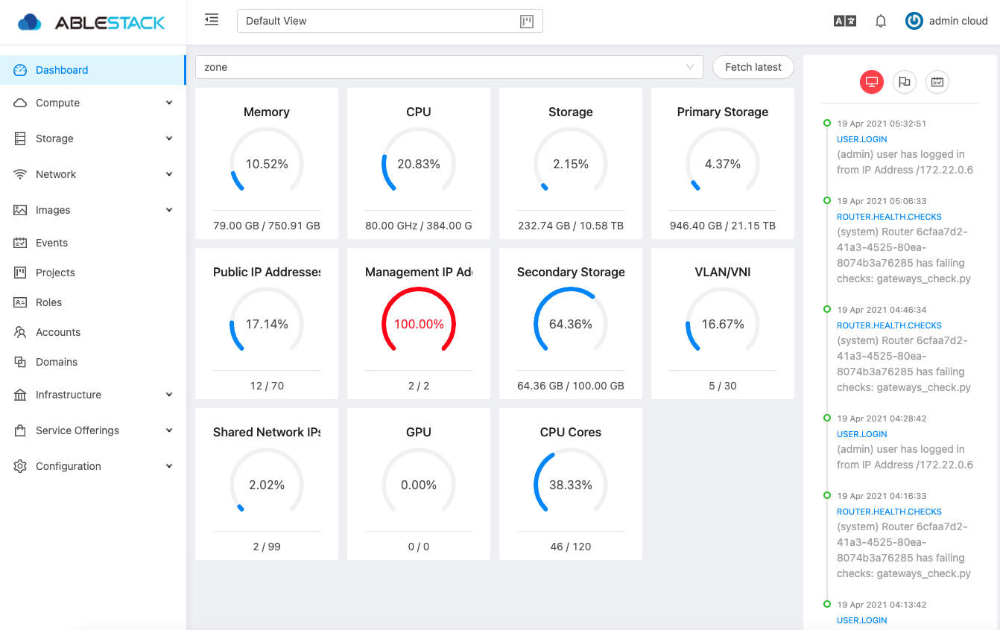

# 사용자 인터페이스

## UI 로그인
Mold는 관리자와 최종 사용자가 모두 사용할 수 있는 웹 기반 UI를 제공합니다. 로그인에 사용된 자격 증명에 따라 적절한 UI가 표시됩니다. UI는 Chrome, Firefox, Edge 및 Safari를 포함한 모든 최신 인기 브라우저에서 사용할 수 있습니다. UI는 API 자동 검색을 사용하여 로그인한 사용자에게 허용된 메뉴 및 기능을 제공합니다.

접속하는 URL은 다음과 같습니다.

 `http://ccvm-mngt-ip:8080`


사용자 명 : 계정의 사용자 ID입니다. 최초 기본 사용자 이름은 admin입니다

암호 : 사용자 ID에 대한 암호. 최초 기본 사용자에 대한 암호는 password입니다
!!! info
    초기 로그인 후 Zone 구성 시에 admin 계정에 대한 비밀번호 변경을 해야 합니다

도메인 : 계정이 소속된 도메인 전체 경로를 입력합니다. 
!!! tip
    예를 들어 ablecloud라는 도메인이 있고 그 하위에 dev1, dev2와 같이 여러 수준의 도메인이 만들어 져 있다고 할 경우 ablecloud라는 도메인의 사용자는 도메인 항목에 ablecloud 라고 입력하고 dev1 도메인 사용자는 ablecloud/dev1 이라고 입력해야 합니다
    
    만일, 루트 사용자인 경우는 입력하지 않아도 됩니다.

## 최종 사용자 UI 개요
Mold UI는 클라우드 인프라 사용자가 가상 머신, 템플릿 및 ISO, 데이터 볼륨 및 스냅 샷, 게스트 네트워크 및 IP 주소를 포함한 클라우드 리소스를 보고 사용할 수 있도록 도와줍니다. 

## 루트 관리자 UI 개요

Mold UI는 Mold 관리자가 클라우드 인프라, 도메인, 사용자 계정, 프로젝트 및 구성 설정을 프로비저닝, 보기 및 관리하는 데 도움이 됩니다. 관리 서버를 새로 설치한 후 처음으로 UI를 시작할 때 가이드 투어를 따라 클라우드 인프라를 프로비저닝하도록 선택할 수 있습니다. 이후 로그인 시 로그인한 사용자의 대시 보드가 나타납니다. 이 화면의 다양한 링크와 왼쪽의 탐색 모음을 통해 다양한 관리 기능에 액세스할 수 있습니다. 루트 관리자는 UI를 사용하여 최종 사용자의 UI에 있는 모든 동일한 작업을 수행할 수도 있습니다.

## 루트 관리자로 로그인
Cube를 이용하여 ccvm을 구성 및 배포하고 Mold 관리 소프트웨어를 실행한 후 Mold 사용자 인터페이스를 실행할 수 있습니다. 이 UI는 클라우드 인프라를 프로비저닝, 보기 및 관리하는 데 도움이 됩니다.

1. 즐겨 찾는 웹 브라우저를 열고 이 URL로 이동하십시오. 자신의 관리 서버의 IP 주소로 대체하십시오.
 `http://ccvm-mngt-ip:8080/client`
 처음 Management Server 설치에 로그인하면 둘러보기 시작 화면이 나타납니다. 다음번에 방문하면 대시 보드로 바로 이동합니다.
2. 처음 시작 화면이 표시되면 다음 중 하나를 선택합니다.
    * 기본 설정을 계속합니다. Mold를 사용하는 중이고 바로 시작할 수 있도록 가능한 가장 간단한 구성에 대한 안내가 필요한 경우 이 옵션을 선택하십시오. 다음 기능으로 클라우드를 설정하는 데 도움을 드립니다. nfs를 제공하는 스토리지; XenServer 또는 KVM 하이퍼바이저에서 VM을 실행하는 단일 서버; 공유된 공용 네트워크.

    * 전에 Mold를 사용했습니다. 이미 설계 단계를 거쳐보다 정교한 배포를 계획했거나 기본 설정 화면을 사용하여 이전에 설정한 Mold 클라우드를 확장할 준비가된 경우 이 옵션을 선택하십시오. 관리자 UI에서 고급 VLAN 네트워킹, 고가용성, 로드 밸런서 및 방화벽과 같은 추가 네트워크 요소, Citrix XenServer, KVM 및 VMware vSphere를 포함한 여러 하이퍼바이저 지원과 같은 Mold의 보다 강력한 기능을 사용할 수 있습니다. 
    
        루트 관리자 대시 보드가 나타납니다.


3. 새 루트 관리자 암호를 설정해야 합니다. 기본 설정을 선택한 경우 즉시 새 비밀번호를 생성하라는 메시지가 표시됩니다. 숙련된 사용자를 선택한 경우 루트 비밀번호 변경의 단계를 사용하십시오.

!!! warning
    루트 관리자로 로그인하고 있습니다. 이 계정은 물리적 인프라를 포함하여 Mold 배포를 관리합니다. 루트 관리자는 구성 설정을 수정하여 기본 기능을 변경하고 사용자 계정을 생성 또는 삭제하며 권한이 있는 사람만 수행해야 하는 많은 작업을 수행할 수 있습니다. 기본 암호를 새 고유 암호로 변경하십시오.

## 루트 암호 변경
설치 및 지속적인 클라우드 관리를 하려면 루트 관리자로 UI에 로그인해야 합니다. 루트 관리자 계정은 물리적 인프라를 포함하여 Mold 배포를 관리합니다. 루트 관리자는 구성 설정을 수정하여 기본 기능을 변경하고 사용자 계정을 생성 또는 삭제하며 권한이 있는 사람만 수행해야 하는 많은 작업을 수행할 수 있습니다. Mold 처음 설치할 때 기본 암호를 새 고윳값으로 변경해야 합니다.

1. 즐겨 찾는 웹 브라우저를 열고 이 URL로 이동하십시오. 자신의 관리 서버의 IP 주소로 대체하십시오.
 `http://ccvm-mngt-ip:8080/client`
2. 현재 루트 사용자 ID 및 비밀번호를 사용하여 UI에 로그인하십시오. 기본값은 admin, password입니다.
3. 계정을 클릭하십시오.
4. 관리자 계정 이름을 클릭하십시오.
5. 사용자 보기를 클릭합니다.
6. 관리자 이름을 클릭합니다.
7. 비밀번호 변경 버튼을 클릭합니다.
8. 새 암호를 입력하고 확인을 클릭합니다.

## 기본 UI 사용자 정의
이제 사용자는 /usr/share/cloudstack-management/webapp/config.json에 있는 구성 파일을 통해 Mold의 사용자 인터페이스를 사용자 정의할 수 있습니다. 이 파일은 테마, 로고 등을 자신의 요구 사항에 맞게 수정하는 데 사용할 수 있습니다.

로고, 로그인 배너, 오류 페이지 아이콘 등을 변경하려면 config.json에서 다음 세부 정보를 편집할 수 있습니다.

```
"logo": "assets/logo.svg",
"banner": "assets/banner.svg",
"error": {
    "404": "assets/404.png",
    "403": "assets/403.png",
    "500": "assets/500.png"
}
```

위치,

* 로고 : 로고 왼쪽 상단 이미지를 변경합니다.
* 배너 : 로그인 배너 이미지를 변경합니다.
* error.404 : 페이지를 찾을 수 없는 오류의 이미지를 변경합니다.
* error.403 : 접근 금지 오류의 이미지를 변경합니다.
* error.500 : 내부 서버 오류의 이미지를 변경합니다.

배너 너비, 일반 색상 등을 수정하는 등의 테마 사용자 지정도 가능합니다. 이는 config.json 파일의 "theme" 섹션을 편집하여 수행할 수 있습니다.

```
"theme": {
    "@logo-background-color": "#ffffff",
    "@project-nav-text-color": "#001529",
    "@navigation-text-color": "rgba(255, 255, 255, 0.65)",
    "@navigation-background-color": "#ffffff",
    "@navigation-text-color": "rgba(0, 0, 0, 0.65)",
    "@primary-color": "#1890ff",
    "@link-color": "#1890ff",
    "@link-hover-color": "#40a9ff",
    "@loading-color": "#1890ff",
    "@processing-color": "#1890ff",
    "@success-color": "#52c41a",
    "@warning-color": "#faad14",
    "@error-color": "#f5222d",
    "@font-size-base": "14px",
    "@heading-color": "rgba(0, 0, 0, 0.85)",
    "@text-color": "rgba(0, 0, 0, 0.65)",
    "@text-color-secondary": "rgba(0, 0, 0, 0.45)",
    "@disabled-color": "rgba(0, 0, 0, 0.25)",
    "@border-color-base": "#d9d9d9",
    "@border-radius-base": "4px",
    "@box-shadow-base": "0 2px 8px rgba(0, 0, 0, 0.15)",
    "@logo-width": "256px",
    "@logo-height": "64px",
    "@banner-width": "700px",
    "@banner-height": "110px",
    "@error-width": "256px",
    "@error-height": "256px"
}
```

위치,

* @ logo-background-color는 로고 배경색을 변경합니다.
* @ project-nav-background-color는 프로젝트의 탐색 메뉴 배경색을 변경합니다.
* @ project-nav-text-color는 프로젝트보기의 탐색 메뉴 배경색을 변경합니다.
* @ navigation-background-color는 탐색 메뉴 배경색을 변경합니다.
* @ navigation-text-color는 탐색 텍스트 색상을 변경합니다.
* @ primary-color : 페이지의 주요 배경색을 변경합니다 (배경 버튼, 아이콘 호버 등).
* @ link-color는 링크 색상을 변경합니다.
* @ link-hover-color는 링크 호버 색상을 변경합니다.
* @ loading-color는 상단 페이지의 메시지 로딩 색상과 페이지 로딩 바를 변경합니다.
* @ success-color : 성공 상태 색상을 변경합니다.
* @ processing-color : 처리 상태 색상을 변경합니다. Exp : 진행 상태.
* @ warning-color : 경고 상태 색상을 변경합니다.
* @ error-color : 오류 상태 색상을 변경합니다.
* @ heading-color : 테이블 헤더 색상을 변경합니다.
* @ text-color : 주요 텍스트 색상 변경.
* @ text-color-secondary : 보조 텍스트 색상 변경 (탐색 경로 아이콘).
* @ disabled-color : 상태 색상 비활성화 (비활성화된 버튼, 스위치 등).
* @ border-color-base : 주요 테두리 색상 변경.
* @ logo-width : 로고 왼쪽 상단의 너비를 변경합니다.
* @ logo-height : 로고 왼쪽 상단의 높이를 변경합니다.
* @ banner-width : 로그인 배너의 너비를 변경합니다.
* @ banner-height : 로그인 배너의 높이를 변경합니다.
* @ error-width : 오류 이미지의 너비를 변경합니다.
* @ error-height : 오류 이미지의 높이를 변경합니다.

여러 가지 기본 테마 색상 :

* 파란색 : # 1890FF
* 빨간색 : # F5222D
* 노란색 : # FAAD14
* 청록색 : # 13C2C2
* 녹색 : # 52C41A
* 퍼플 : # 722ED1