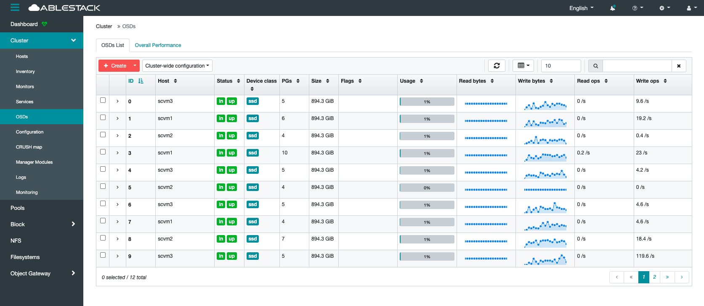

# ABLESTACK 시스템 점검
 ABLESTACK HCI를 안정적으로 운영을 하기 위하서는 시스템에 대한 점검이 필요합니다.
 정기 혹은 비정기적인 점검을 통하여 시스템의 상태를 확인하여 장애를 미리 예방할 수 있으며, 자원에 대한 사용율을 확인하여 증설 혹은 재배치 계획등을 통하여 서비스의 연속성을 확보 할 수 있습니다
 점검대상 및 방법은 다음과 같습니다. 

## 점검대상
ABLESTACK은 다음과 같이 크게 5가지의 구성요소로 이루어져 있습니다.

* Cube
* Cell
* Glue
* Mold
* Wall

각각의 구성요소들이 모두 정상적으로 동작을 하고 있어야 하며 각각 요소들의 점검방법은 다음과 같습니다.

### Cube
!!! info "Cube"
    Cube는 x86 기반의 서버에 Linux Kernel을 제공하고, 호스트 관리 환경을 제공하는 서버 OS 입니다.
    해당 구성요소를 점검하기 위해서는 물리적인 하드웨어와 Process들이 정상적인지 확인을 해야 합니다.

#### 호스트 서버 외관 점검

  - 호스트 전면 혹은 후면의 LED 램프 이상 점등이 있는지 육안으로 점검
  - 전원 및 네크워크 케이블의 연결 상태 및 점등 여부를 육안으로 점검
#### IPMI 원격 콘솔 접속을 통한 상태 점검

  - 대시보드의 하드웨어 상태 점검 
!!! tip
    IPMI 원격 콘솔은 하드웨어 벤더사 별로 제공되는 UI 및 정보는 상이 할 수 있습니다.

!!! result "상태확인"
    호스트 서버의 외관 혹은 IPMI 콘솔상의 문제가 있을 경우에는 벤더사를 통하여 기술지원을 받아 조치를 해야합니다.

#### ABLESTACK 시스템 상태 점검
호스트 및 ABLESTACK의 전체적인 상태를 Cube는 웹 UI를 통하여 점검할 수 있습니다 

!!! info
    각 호스트별 Cube 웹 UI 접속 URL은 다음과 같습니다
    https://[호스트IP]:9090


!!! result
    상단 ABLESTACK 리본의 상태가 정상이면 모든 클러스터 및 관련 가상머신들의 상태가 정상입니다
    각 클러스터 및 관련 가상머신들의 문제가 있을 경우 경고 혹은 에러 상태가 되며 각 구성요소별로 점검이 필요합니다

#### 호스트 OS 점검
호스트 OS의 상태를 점검하기 위해서는 호스트 OS에 접속하여 다음과 같은 요소들을 점검하여야 합니다
호스트 가상며신에 접속하여 명령어를 통해서 확인 할 수 있습니다.

- root(/) 영역 디스크 사용량 점검

``` shell
df -h
```
```
[root@ablecube1 ~]# df -h
Filesystem                            Size  Used Avail Use% Mounted on
devtmpfs                               32G     0   32G   0% /dev
tmpfs                                  32G   47M   32G   1% /dev/shm
tmpfs                                  32G   28M   32G   1% /run
tmpfs                                  32G     0   32G   0% /sys/fs/cgroup
/dev/mapper/ablestack_ablecube1-root  862G   20G  842G   3% /
/dev/sda2                            1014M  235M  780M  24% /boot
/dev/sda1                             599M  6.9M  592M   2% /boot/efi
tmpfs                                 6.3G   32K  6.3G   1% /run/user/976
tmpfs                                 6.3G   48K  6.3G   1% /run/user/1000
/dev/sde                              9.1G  9.1G     0 100% /run/media/ablecloud/CentOS-8-3-2011-x86_64-dvd
```
!!! result "상태확인"
    루트(/) 영역의 사용량(Use%)가 70% 이하이면 정상이며, 이상일 경우에는 파일정리 혹은 증설등을 통하여 공간을 확보하여야 합니다.

    루트(/) 영역이 100%가 되면 프로세스들의 로깅등이 동작하지 못하게되여 장애가 발생할 수 있습니다.

- 네트워크 통신상태 확인
관리네트워크 및 스토리지 네트워크에 대한 네트워크 통신 상태를 점검해야 합니다

  - 관리네트워크 통신 상태 점검
  ``` shell
  ping [관리네트워크 대역 IPs]
  ```
  - 스토리지 네트워크 통신 상태 점검
  ``` shell
  ping -M d0 -s 8972 [스토리지 네트워크 대역 IPs]
  ```
!!! tip
    클러스터링된 모든 호스트 혹은 SCVM간의 통신을 점검해야하며 /etc/hosts 파일을 참조할 수 있습니다.

!!! result "상태확인"
    각 구간의 네트워크 ping 통신이 정상적이어야 하며 이상이 있을 경우 해당 네트워크 구간을 점검하여야 합니다.


### Cell
!!! info "Cell"
    Cell은 서버 가상화를 지원하는 가상화 하이퍼바이저 입니다.
    해당 구성 요소를 점검하기 위해서는 하이퍼바이저 상태 및 Process들이 정상인지 확인을 해야 합니다.
#### 


### Glue
!!! info "Glue"
    Glue는 소프트웨어 정의 스토리지를 통해 통합 스토리지를 제공하고, 다양한 게이트웨이를 제공하는 스토리지 플랫폼 입니다.
    해당 구성 요소를 점검하기 위해서는 Glue 가상머신의 상태와 Storage 및 Clustering 상태가 정상인지 확인을 해야 합니다.
#### 스토리지 클러스터 상태 점검
스토리지 상태를 확인하기 위해서는 스토리지 클러스터의 Health를 점검하여야 합니다.
웹 UI를 통하여 상태를 확인하는 방법과 Glue 가상머신에 접속하여 명령어를 통해서 확인하는 방법이 있습니다
`웹 UI를 통하여 확인 하는 방법`
: 웹 UI에 접속하여 login을 합니다.
!!! tip "웹 UI 주소는 일반적으로 Glue 가상머신의 management 대역의 IP의 8443포트입니다(ex. https://[IP]:8443)"


!!! result "상태확인"
    대시보드의 Cluster Status가 HEALTH_OK이면 클러스터의 전체 상태가 정상이라는 뜻이며 문제가 있을 경우에는 HEALTH_Warning 혹은 HEALTH_ERR라고 출력됩니다.
    
`CLI를 통하여 확인 하는 방법`
: SCVM 가상머신에 접속 후 다음과 같이 명령어를 입력합니다

``` shell
ceph -s 
```
``` 
[root@scvm1 ~]# ceph -s
  cluster:
    id:     b9c88c1e-92ad-11eb-8a92-00248158f481
    health: HEALTH_OK

  services:
    mon: 2 daemons, quorum scvm2,scvm3 (age 3d)
    mgr: scvm2.qkurlf(active, since 3d), standbys: scvm1.vpxqxm
    osd: 9 osds: 9 up (since 3d), 9 in (since 3d)

  data:
    pools:   2 pools, 33 pgs
    objects: 2.69k objects, 10 GiB
    usage:   26 GiB used, 7.8 TiB / 7.9 TiB avail
    pgs:     33 active+clean

  io:
    client:   4.4 KiB/s wr, 0 op/s rd, 0 op/s wr
``` 
!!! result "상태확인"
    출력 결과에서 health의 값이 HEALTH_OK이면 클러스터의 전체 상태가 정상이라는 뜻이며 문제가 있을 경우에는 HEALTH_Warning 혹은 HEALTH_ERR라고 출력됩니다.

#### OSD 상태 점검
  
OSD는 스토리지 클러스터를 구성하는 Disk로 각 OSD의 상태 및 사용율을 점검해야 합니다.
확인하는 방법으로는 웹 UI를 통하여 상태를 확인하는 방법과 Glue 가상머신에 접속하여 명령어를 통해서 확인하는 방법이 있습니다
웹 UI를 통하여 확인 하는 방법
: 웹 UI에 접속하여 login을 합니다.
!!! tip "웹 UI 주소는 일반적으로 Glue 가상머신의 management 대역의 IP의 8443포트입니다(ex. https://[IP]:8443)"


!!! result "상태확인"
    각 OSD별 Status가  상태이고 Usage가 80% 이하일 경우 정상

!!! warning "Usgae가 80% 이상일 경우 반드시 확인 필요"
    OSD Usage가 85%가 될 경우 'near full' 경고가 발생하게 되고, 90%를 넘을 경우 'full'이 발생하여 해당 OSD가 Lock이 발생하게 되여 반드시 확인이 필요합니다.

`CLI를 통하여 확인 하는 방법`
: SCVM 가상머신에 접속 후 다음과 같이 명령어를 입력합니다

``` shell
ceph osd tree 
``` 
``` 
[root@scvm1 ~]# ceph osd tree
ID  CLASS  WEIGHT    TYPE NAME       STATUS  REWEIGHT  PRI-AFF
-1         10.47949  root default
-3          3.49316      host scvm1
 1    ssd   0.87329          osd.1       up   1.00000  1.00000
 3    ssd   0.87329          osd.3       up   1.00000  1.00000
 7    ssd   0.87329          osd.7       up   1.00000  1.00000
10    ssd   0.87329          osd.10      up   1.00000  1.00000
-7          3.49316      host scvm2
 2    ssd   0.87329          osd.2       up   1.00000  1.00000
 5    ssd   0.87329          osd.5       up   1.00000  1.00000
 8    ssd   0.87329          osd.8       up   1.00000  1.00000
11    ssd   0.87329          osd.11      up   1.00000  1.00000
-5          3.49316      host scvm3
 0    ssd   0.87329          osd.0       up   1.00000  1.00000
 4    ssd   0.87329          osd.4       up   1.00000  1.00000
 6    ssd   0.87329          osd.6       up   1.00000  1.00000
 9    ssd   0.87329          osd.9       up   1.00000  1.00000
```
!!! result "상태확인"
    각 OSD별 Status가 `up` 상태이고 REWEIGHT가 `1.0` 일 경우 정상
``` shell
ceph osd df 
```
```
[root@scvm1 ~]# ceph osd df
ID  CLASS  WEIGHT   REWEIGHT  SIZE     RAW USE  DATA     OMAP  META     AVAIL    %USE  VAR   PGS  STATUS
 1    ssd  0.87329   1.00000  894 GiB   10 GiB  9.8 GiB   0 B  117 MiB  884 GiB  1.11  1.14    6      up
 3    ssd  0.87329   1.00000  894 GiB   15 GiB   15 GiB   0 B  160 MiB  879 GiB  1.66  1.69   10      up
 7    ssd  0.87329   1.00000  894 GiB  6.7 GiB  6.4 GiB   0 B  290 MiB  888 GiB  0.75  0.77    4      up
10    ssd  0.87329   1.00000  894 GiB  8.1 GiB  8.0 GiB   0 B   92 MiB  886 GiB  0.90  0.92    5      up
 2    ssd  0.87329   1.00000  894 GiB  6.4 GiB  6.3 GiB   0 B   84 MiB  888 GiB  0.72  0.73    4      up
 5    ssd  0.87329   1.00000  894 GiB  5.0 GiB  4.9 GiB   0 B   59 MiB  889 GiB  0.56  0.57    4      up
 8    ssd  0.87329   1.00000  894 GiB   11 GiB   11 GiB   0 B  346 MiB  883 GiB  1.28  1.31    7      up
11    ssd  0.87329   1.00000  894 GiB   12 GiB   12 GiB   0 B  132 MiB  883 GiB  1.31  1.34    7      up
 0    ssd  0.87329   1.00000  894 GiB  8.3 GiB  8.2 GiB   0 B   90 MiB  886 GiB  0.93  0.95    5      up
 4    ssd  0.87329   1.00000  894 GiB  8.1 GiB  8.0 GiB   0 B   94 MiB  886 GiB  0.91  0.93    5      up
 6    ssd  0.87329   1.00000  894 GiB  6.2 GiB  6.1 GiB   0 B   72 MiB  888 GiB  0.69  0.71    5      up
 9    ssd  0.87329   1.00000  894 GiB  8.3 GiB  8.2 GiB   0 B  104 MiB  886 GiB  0.93  0.95    5      up
                       TOTAL   10 TiB  105 GiB  104 GiB   0 B  1.6 GiB   10 TiB  0.98
MIN/MAX VAR: 0.57/1.69  STDDEV: 0.30
```
!!! result "상태확인"
    각 OSD별 %USE가 85.00 이하일 경우 정상

#### 전체 Pool 사용량 점검
Pool은 데이터 저장을 위한 논리적인 파티션 입니다. 1개이상의 Pool로 구성되어 있으며 각각의 Pool에 대한 사용량을 점검해야 합니다. 확인하는 방법으로는 웹 UI를 통하여 상태를 확인하는 방법과 Glue 가상머신에 접속하여 명령어를 통해서 확인하는 방법이 있습니다

`웹 UI를 통하여 확인 하는 방법`
: 웹 UI에 접속하여 login을 합니다.
!!! tip "웹 UI 주소는 일반적으로 Glue 가상머신의 management 대역의 IP의 8443포트입니다(ex. https://[IP]:8443)"


!!! result "상태확인"
   Pool 별 Usage의 용량을 확인하여 80% 이상 사용 중일경우 증설 혹은 데이터 정리가 필요합니다

CLI를 통하여 확인 하는 방법
SCVM 가상머신에 접속 후 다음과 같이 명령어를 입력합니다

``` shell
ceph df detail 
``` 
```
[root@scvm1 ~]# ceph df detail
--- RAW STORAGE ---
CLASS    SIZE   AVAIL     USED  RAW USED  %RAW USED
ssd    10 TiB  10 TiB  322 GiB   322 GiB       3.00
TOTAL  10 TiB  10 TiB  322 GiB   322 GiB       3.00

--- POOLS ---
POOL                   ID  PGS   STORED   (DATA)   (OMAP)  OBJECTS     USED   (DATA)   (OMAP)  %USED  MAX AVAIL  QUOTA OBJECTS  QUOTA BYTES   DIRTY  USED COMPR  UNDER COMPR
device_health_metrics   1    1  376 KiB      0 B  376 KiB       12  1.1 MiB      0 B  1.1 MiB      0    3.1 TiB            N/A          N/A      12         0 B          0 B
rbd                     2   32  155 GiB  155 GiB   34 KiB   41.25k  311 GiB  311 GiB   68 KiB   3.12    4.7 TiB            N/A        1 TiB  41.25k         0 B          0 B
```
!!! result "상태확인"
    Pool 별 %USED의 용량을 확인하여 80% 이상 사용 중일경우 증설 혹은 데이터 정리가 필요합니다

#### 네트워크 통신 상태 점검
스토리지 클러스터의 네트워크 통신에 대한 점검이 필요하며 일반적인 Ping 체크 이외에 Jumbo Frame Ping 체크가 필요합니다. 확인 하는 방법은 Glue 가상머신에 접속하여 클러스터링된 호스트 및 SCVM과 네트워크 트래픽별 Jumbo Frame Ping 통신 상태를 확인합니다

SCVM 가상머신에 접속 후 다음과 같이 명령어를 입력 합니다.
``` shell
ping -M do -s 8972 scvm2 
``` 
```
[root@scvm1 ~]# ping -M do -s 8972 scvm2
PING scvm2 (***.***.***.***) 8972(9000) bytes of data.
8980 bytes from scvm2 (***.***.***.***): icmp_seq=1 ttl=64 time=0.395 ms
8980 bytes from scvm2 (***.***.***.***): icmp_seq=2 ttl=64 time=0.334 ms
8980 bytes from scvm2 (***.***.***.***): icmp_seq=3 ttl=64 time=0.767 ms
8980 bytes from scvm2 (***.***.***.***): icmp_seq=4 ttl=64 time=0.371 ms
8980 bytes from scvm2 (***.***.***.***): icmp_seq=5 ttl=64 time=0.172 ms
8980 bytes from scvm2 (***.***.***.***): icmp_seq=6 ttl=64 time=0.794 ms
8980 bytes from scvm2 (***.***.***.***): icmp_seq=7 ttl=64 time=0.154 ms
8980 bytes from scvm2 (***.***.***.***): icmp_seq=8 ttl=64 time=0.202 ms
8980 bytes from scvm2 (***.***.***.***): icmp_seq=9 ttl=64 time=0.318 ms
8980 bytes from scvm2 (***.***.***.***): icmp_seq=10 ttl=64 time=0.437 ms
^C
--- scvm2 ping statistics ---
10 packets transmitted, 10 received, 0% packet loss, time 238ms
rtt min/avg/max/mdev = 0.154/0.394/0.794/0.213 ms
```
!!! result "상태확인"
    모든 통신 구간의 네트워크 통신상태가 응답시간이 0.5 ms 이상이면 정상이며 ping이 빠지는 구간이 있거나 응답시간이 0.5ms 이상일 경우에는 통신구간을 점검해야 합니다

!!! tip
    /etc/host 파일을 참조하면 클러스터링된 대상과 IP정보를 얻을 수 있습니다.

#### NTP 점검
클러스터링 되어 있는 스토리지에서 시간동기화는 매우 중요합니다. 클러스터링된 모든 호스트 및 SCVM에 대한 NTP 설정 및 동기화 여부를 확인해야 합니다. 확인하는 방법은 Glue 가상머신에 접속하여 명령어를 통해서 확인하는 방법이 있습니다

!!! warning
    시간 동기화가 되지 않은 상태일 경우에는 스토리지의 상태가 warning 상태가 되며 다음과 같은 메시지가 출력됩니다.
    ``` shell
     health HEALTH_WARN

            clock skew detected on scvm1, scvm2, scvm3

            Monitor clock skew detected 
    ```
    이와 같은 상태가 일정시간 지속이 되면 클러스터에 장애가 생길 수 있으며, NTP등의 설정을 확인하여 정상화 시켜야 합니다

호스트 및 SCVM에 접속 후 다음과 같이 명령어를 입력합니다
``` shell
timedatectl 
``` 
```
[root@scvm1 ~]# timedatectl
               Local time: 수 2021-04-07 16:12:49 KST
           Universal time: 수 2021-04-07 07:12:49 UTC
                 RTC time: 수 2021-04-07 07:12:49
                Time zone: Asia/Seoul (KST, +0900)
System clock synchronized: yes
              NTP service: active
          RTC in local TZ: no
```
!!! result "상태확인"
    NTP service 가 'active' 상태이고 System clock synchronized 가 'yes' 이면 정상입니다

!!! info "NTP 구성"
    NTP는 기본적으로 인터넷을 통한 공인 NTP 서버를 사용하거나 별도로 구축된 내부 NTP를 사용합니다. 경우에 따라서 외부 통신과 단절되어있거나 내부 NTP 서버가 없을 경우 ABLECLOUD 자체에 NTP 서버를 구성하여 NTP 동기화를 구성합니다

#### root(/) 영역 디스크 사용량 점검
Glue 가상머신의 root(/) 디스트 영역에는 프로세스들의 로그등이 기록 됩니다. 해당 영역에 사용공간이 있어야 프로세스들이 정상적으로 동작 됩니다 
!!! warning
    디스크 사용량이 70% 이상일 경우 클러스터의 상태가 warning 상태가 되며 다음과 같은 메시지가 출력됩니다.
    ``` shell
     health HEALTH_WARN

            scvm1, scvm2, scvm3  is low on available space 
    ```
    이와 같은 상태가 계속되어 사용량이 100%에 도달할 경우 클러스터에 장애가 발생 할 수 있으며, 데이터를 확인하여 공간을 확보하여야 합니다.

다음과 같이 root(/)영역의 사용량을 확인하여 점검 할 수 있습니다 
``` shell
df -h
```
```
[root@ablecube1 ~]# df -h
Filesystem                            Size  Used Avail Use% Mounted on
devtmpfs                               32G     0   32G   0% /dev
tmpfs                                  32G   47M   32G   1% /dev/shm
tmpfs                                  32G   28M   32G   1% /run
tmpfs                                  32G     0   32G   0% /sys/fs/cgroup
/dev/mapper/ablestack_ablecube1-root  862G   20G  842G   3% /
/dev/sda2                            1014M  235M  780M  24% /boot
/dev/sda1                             599M  6.9M  592M   2% /boot/efi
tmpfs                                 6.3G   32K  6.3G   1% /run/user/976
tmpfs                                 6.3G   48K  6.3G   1% /run/user/1000
/dev/sde                              9.1G  9.1G     0 100% /run/media/ablecloud/CentOS-8-3-2011-x86_64-dvd
```
!!! result "상태확인"
    루트(/) 영역의 사용량(Use%)가 70% 이하이면 정상이며, 이상일 경우에는 파일정리 혹은 증설등을 통하여 공간을 확보하여야 합니다.

    루트(/) 영역이 100%가 되면 프로세스들의 로깅등이 동작하지 못하게되여 장애가 발생할 수 있습니다.

!!! tip
    ``` du -h --max-depth=1 ``` 

    명령어를 통하여 각 디렉토리별 사용량을 확인하고 데이터를 정리할 수 있습니다.

 
### Mold
!!! info "Mold"
    Mold는 가상머신 관리 및 소프트웨어 정의 네트워크, 오케스트레이션 및 오토메이션을 제공하는 클라우드 플랫폼 입니다.
    해당 구성 요소를 점검하기 위해서는 Mold 가상머신의 상태와 Cloud 관리 플랫폼 및 PCS Clustering 상태가 정상인지 확인을 해야합니다.
#### 클라우드센터 클러스터 상태 점검
클라우드센터 클러스터는 Mold를 서비스 하기 위한 가상머신 및 호스트 장애 시 HA를 위한 구성입니다. Cube UI 및 터미널을 통하여 점검할 수 있습니다

Cube 웹 UI에 접속하여 AblecStack 클러스터 상태를 확인합니다.
!!! info
    각 호스트별 Cube 웹 UI 접속 URL은 다음과 같습니다
    https://[호스트IP]:9090


!!! result
    클라우드센터 클러스터 상태가 'Health_ok'이고 클라우드 가상머신 상태가 'Running' 상태이면 정상입니다

### Wall
!!! info "Wall"
    Wall은 인프라 전체에 대한 모니터링, 알람 등을 위한 통합 모니터링 플랫폼 입니다.
    해당 구성 요소를 점검하기 위해서는 Wall 가상머신의 상태와 Process들이 정상인지 확인을 해야합니다.


