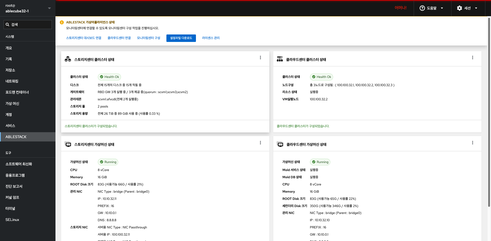
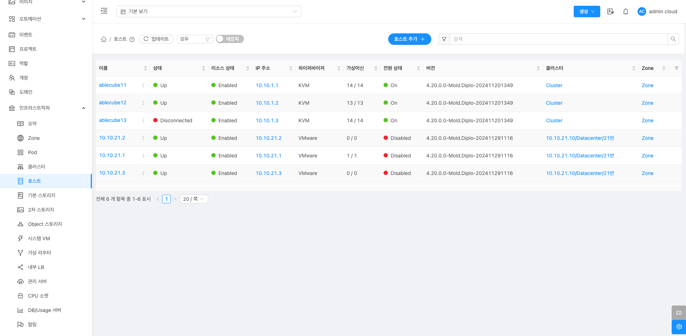
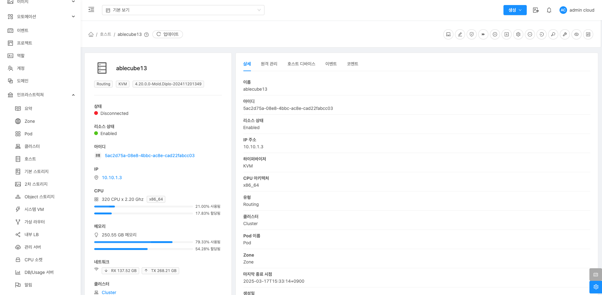
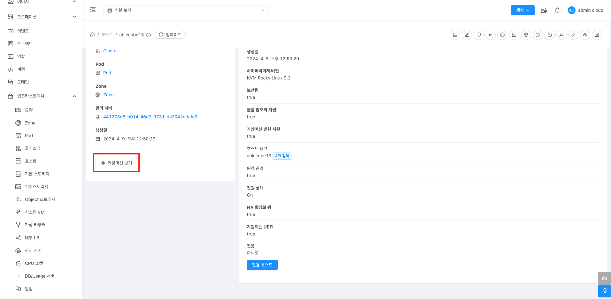
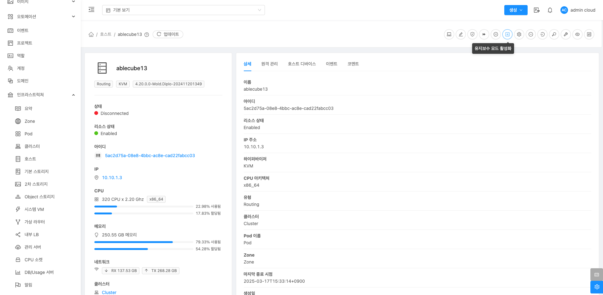
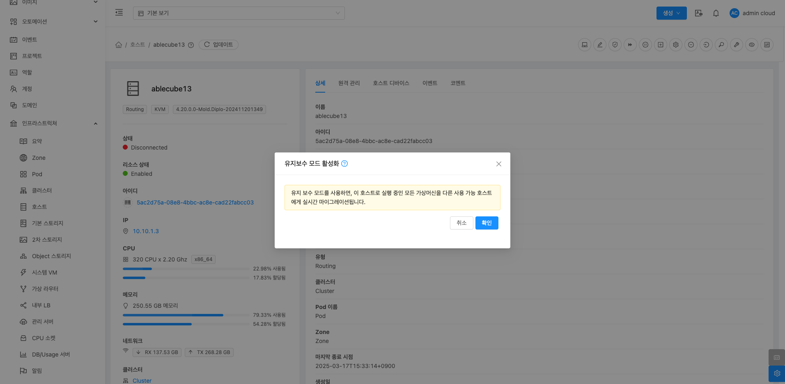
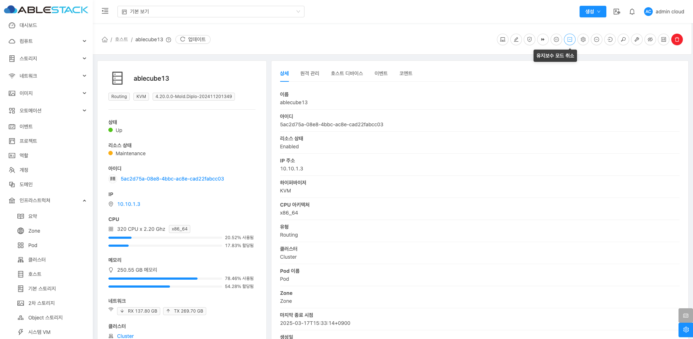

# ABLESTACK HCI 시스템 재기동
 ABLESTACK HCI의 전체시스템을 안정적으로 재기동하기 위해서는 규정된 절차에 따라 시행되어야 합니다.
 재기동 절차 및 방법은 다음과 같습니다.

### 재기동 절차 대상
ABLESTACK 재기동에 필요한 설정 대상은 다음과 같습니다.

* Mold
* Cube

재기동 방법은 다음과 같습니다.

## 종료 절차

#### Mold
  1. HA를 비활성화합니다.
  
  

  2. 모든 가상머신을 종료합니다.
     1. HA 용도의 가상머신 종료
     2. 사용자 가상머신 종료

  3. Zone을 비활성화합니다.
  

  4. 시스템 VM을 종료합니다.
  
  
  

  5. 기본스토리지를 유지보수 모드로 설정합니다.
     1. 기본 스토리지 (ha) 유지보수 모드 설정
     

  6. 호스트를 유지보수 모드로 설정합니다.
  
  

    !!! info
        유지보수 모드 설정한 호스트가 변경 완료 되었을 때 다음 호스트 유지보수 모드 설정을 진행해야 합니다.

#### Cube

  7. "전체 시스템 자동종료" 기능으로 전체 시스템을 종료합니다.
  전체 시스템을 종료합니다. 이 기능에는 아래의 절차가 자동으로 실행됩니다.
     1. 클라우드센터 가상머신 정지
     2. 모든 스토리지센터 클러스터 유지보수 모드 설정
     3. 모든 스토리지센터 가상머신 정지
     4. 모든 호스트 종료

    !!! warning
        해당기능을 실행하기 전 반드시 각 호스트에 Mount된 볼륨을 작업 수행자가 직접 해제해야 합니다.

    ```shell
    # 각 호스트에서 아래 명령어를 실행하여 'nfs' 타입으로 마운트된 볼륨을 검색합니다.
    $ {경로} = findmnt | awk '{print $2}' | sort -u | grep 'nfs'

    # 위 명령어 실행 결과에 따라 볼륨 해제를 합니다.
    $ umount {경로}
    ```

  
  

## 재시작 절차
  1. 종료된 호스트의 전원을 다시 킵니다.

#### Cube

  2. 스토리지센터 가상머신을 확인합니다.
     1. 모든 스토리지센터의 가상머신 시작 상태를 확인합니다.
    !!! info
        만약 가상머신 상태가 정지 상태이면 시작 버튼을 클릭하여 가상머신 시작합니다.
  3. 스토리지센터 클러스터 유지보수 모드를 해제합니다.
  

  4. 클라우드센터 가상머신을 시작합니다.
     1. 클라우드센터 가상머신을 시작한 후 클라우드센터에 연결하여 Mold 서비스가 정상적으로 시작되었는지 확인합니다.
     

#### Mold

  5. 호스트 유지보수 모드를 해제합니다.
  

  6. 기본 스토리지 유지보수 모드를 해제합니다.
  

  7. Zone을 활성화합니다.
  

  8. 시스템 VM을 시작합니다.

    !!! info
        시스템 VM은 별도로 시작하지 않아도 Zone 활성화 후 자동으로 시작됩니다.
  

  9. 가상머신을 시작합니다.
     1. HA 용도의 가상머신을 시작합니다.
     2. 사용자 가상머신 시작합니다.

  10.	HA 기능을 활성화합니다.
  

  11. 사용자 가상머신 및 서비스 상태를 확인합니다.


## HCI 구성에서 1개 호스트 재기동 절차

### Cube
호스트를 재기동하기 위해 먼저 Cube 웹 UI를 통하여 스토리지 클러스터 상태가 정상 작동 중임을 확인해야 합니다.

1. Cube 웹 UI에 접속합니다.

    !!! info
        각 호스트별 Cube 웹 UI 접속 URL은 다음과 같습니다.
        https://[호스트IP]:9090

    

2. 스토리지 클러스터 상태가 "Health Ok" 인지 확인합니다.
    * 표시: Health Ok
        * 클러스터가 정상적으로 작동 중임을 의미합니다.
    * Warning, Error 등의 상태일 경우 즉각적인 점검 필요합니다.

### Mold

1. HA 상태 확인
    * Mold에 접속하여 메뉴 '인프라스트럭처' > '호스트'로 이동합니다.
      
    * 장애가 발생한 호스트를 클릭하여 상세정보 탭에서 HA 상태 및 호스트 상태를 확인합니다.
      
2. 장애 발생 호스트의 VM 재배치 여부 확인하기
    * 좌측 '가상머신 보기' 버튼을 클릭하여 VM이 정상적으로 다른 호스트로 이동 완료되었는지 확인합니다.
      
3. 유지보수 모드 전환
    * 장애 해결 이후, 호스트 상태가 "다운(Down)" 또는 "경고(Alert)"인 경우 아래 단계를 따라 진행합니다.
    * 호스트가 현재 "다운(Down)" 상태라면, 즉시 유지보수 모드로 전환이 불가능하므로, 먼저 다음 단계(4번)로 진행하여 장애 호스트를 복구합니다.
    * 만약 호스트 상태가 부분적으로 정상화되었다면, 유지보수 모드로 전환합니다.
      
      
        * 호스트 > 장애 호스트 선택 > "유지보수 모드 활성화" 버튼을 클릭합니다.
4. 장애 호스트 문제 해결 및 복구
    * 실제 장애가 발생했던 물리 호스트에서 복구 작업을 수행합니다.
5. 호스트 정상화 후 Mold 연결 확인
    * 복구된 호스트가 정상 상태가 되면, Mold에서 자동으로 호스트 상태가 업데이트될 수 있습니다.
    * 자동으로 복구되지 않을 경우, 다음 방법으로 강제로 재연결을 시도합니다.
        1. 장애 발생했던 호스트에 SSH로 접속한 뒤, Mold 에이전트의 상태를 확인합니다.
           ```title="bash"
              systemctl status mold-agent
           ```
        2. Mold 에이전트를 재기동합니다.
           ```title="bash"
              systemctl restart mold-agent
           ```
6. 유지보수 모드에서 해제 및 호스트 활성화
    * 호스트가 정상적으로 연결되었고 상태가 "UP"이라면, 유지보수 모드로 설정했던 경우 다음 절차를 통해 해제합니다
      
    * "유지보수 모드 취소" 버튼을 클릭하여 호스트 유지보수 모드를 해제합니다.


## Cube 서비스 재기동 절차
네트워크 단절, 설정 변경 또는 예기치 않은 오류로 인해 Cube 서비스가 비정상적으로 작동할 경우, 아래 절차에 따라 서비스를 재기동할 수 있습니다.

1. Cube 작동 상태 확인
    * SSH를 통해 해당 호스트(서버)에 접속한 뒤, Cube 서비스가 정상적으로 작동 중인지 확인합니다.
   ```title="bash"
      systemctl status cockpit.soket
   ```
    * active (running) 상태인 경우: 서비스는 정상 작동 중입니다.
    * inactive, failed, dead 등으로 표시되는 경우: 서비스가 중지되었거나 오류가 발생한 것입니다.

2. Cube 서비스를 재기동
    * Cube 서비스에 이상이 발견되었거나, 설정 변경 후 적용이 필요한 경우에는 아래 명령어로 서비스를 재기동합니다.
   ```title="bash"
      systemctl restart cockpit.soket
   ```
    * 재기동 시 약 2~5초간 일시적인 중단이 있을 수 있습니다.
    * restart는 내부적으로 stop → start 순으로 실행됩니다.
    * active (running) 상태로 복귀했는지 확인합니다.
