# ABLESTACK VM 시스템 재기동

ABLESTACK VM 전체 시스템을 안정적으로 재기동하기 위해서는 규정된 절차에 따라 시행해야 합니다.

* **목적/범위**: ABLESTACK VM의 계획·비상 재기동 절차와 대상 구성요소를 정의합니다.
* **사전 점검**: 알림 사일런스, 클러스터·스토리지 상태, 시간 동기화, DNS를 점검합니다.
* **종료 순서**: 업무용 VM → 시스템 VM(CPVM/SSVM) → 관리 서버(CCVM)  → 호스트(ablecube)입니다.
* **기동 순서**: 호스트(ablecube) → 관리 서버(CCVM) → 시스템 VM → 업무용 VM입니다.
* **사후 검증/보고**: 모니터링 확인 및 서비스 기능 점검을 수행하고 결과를 기록·공유합니다.

## 전체 시스템 종료 및 재기동 절차

### 전체 시스템 종료 절차
1. **사전 조치**: 점검 공지, Wall 알림 사일런스, 중요 VM 백업/스냅샷, 시간 동기화·DNS·스토리지 상태 확인을 수행합니다.
2. **업무용 VM 종료**: 애플리케이션 → 미들웨어/WAS → DB 순서로 정상 종료합니다.
3. **시스템 VM 종료**: CPVM 및 SSVM 안전 종료합니다.
4. **관리 서버 종료**: CCVM의 관리 서비스를 중지 후 CCVM을 종료합니다.
5. **호스트 종료**: ablecube 호스트들을 순차 종료합니다.

!!! info
    종료 절차는 클라우드센터 웹 콘솔(Mold)에서 선행 작업을 수행한 뒤, 웹 기반 관리 기능(Cube)에서 후속 작업을 완료합니다.

#### 클라우드센터 웹 콘솔(Mold)
!!! info
    본 작업은 클라우드센터 웹 콘솔(Mold)에서 수행합니다.

1. HA 비활성화
    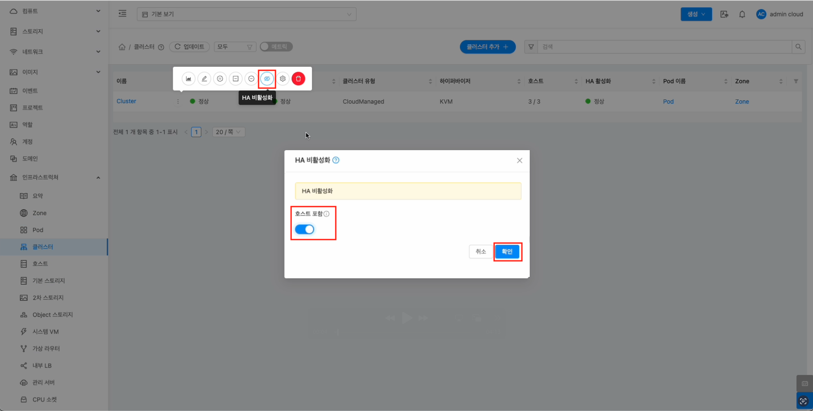{ .imgCenter .imgBorder }
    - Mold 좌측 메뉴에서 **인프라스트럭쳐 -> 클러스터** 로 이동한 뒤, 대상 클러스터의 HA 비활성화를 실행합니다.
    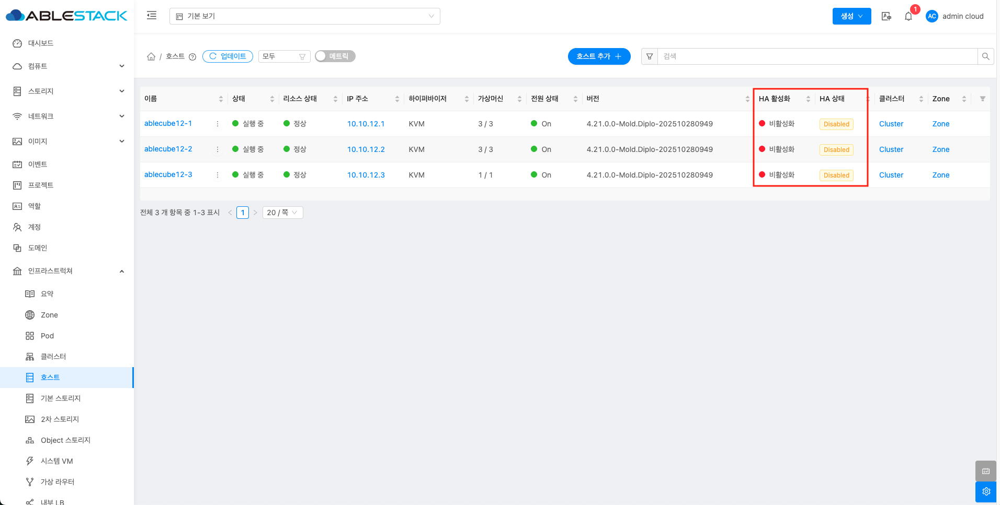{ .imgCenter .imgBorder }
    - 이어서 **인프라스트럭쳐 -> 호스트** 로 이동하여 각 호스트의 HA 상태가 **비활성화 및 Disabled** 로 표시되는지 확인합니다.
    !!! warning
        업무용 가상머신 정지 시 서비스 영향 최소화를 위해 **애플리케이션 -> 미들웨어/WAS -> DB** 순으로 정상 종료하시기 바랍니다. 해당 이미지는 예시이며, 실제 환경의 서비스 의존관계에 따라 조정 후 진행하시기 바랍니다.
2. 업무용 가상머신 종료
    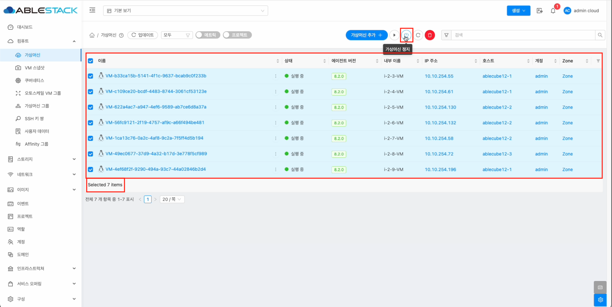{ .imgCenter .imgBorder }
    - Mold 좌측 메뉴에서 **컴퓨트 -> 가상머신** 로 이동한 뒤, 업무용 가상머신을 정지합니다.
    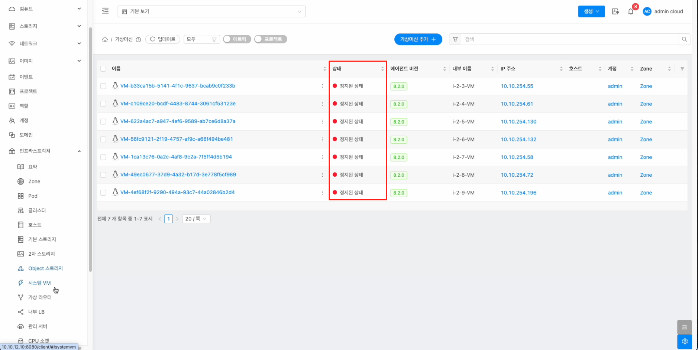{ .imgCenter .imgBorder }
    - 업무용 가상머신 상태가 **정지된 상태** 가 맞는지 확인합니다.
3. Zone 비활성화
    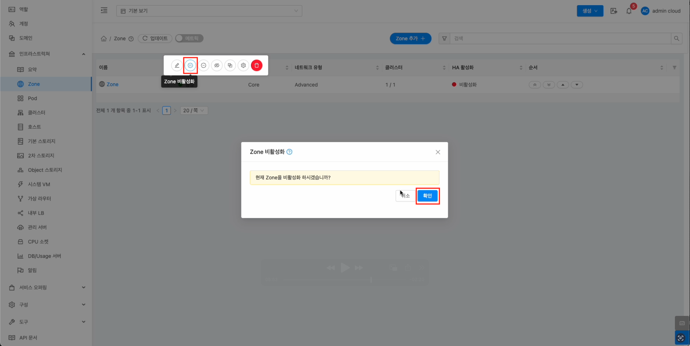{ .imgCenter .imgBorder }
    - Mold 좌측 메뉴에서 **인프라스트럭쳐 -> Zone** 으로 이동한 뒤, Zone을 비활성화 합니다.
    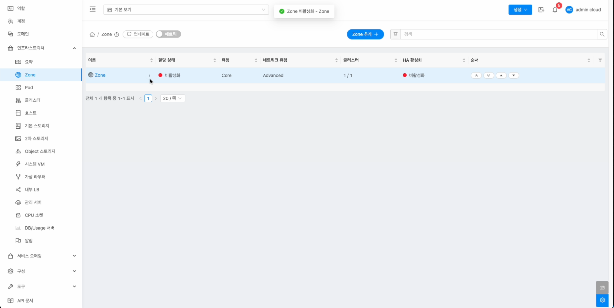{ .imgCenter .imgBorder }
    - Zone 할당 상태가 **비활성화** 가 맞는지 확인합니다.
4. 시스템 VM 종료
    { .imgCenter .imgBorder }
    - Mold 좌측 메뉴에서 **인프라스트럭쳐 -> 시스템 VM** 로 이동한 뒤, 시스템 가상머신을 정지합니다.
    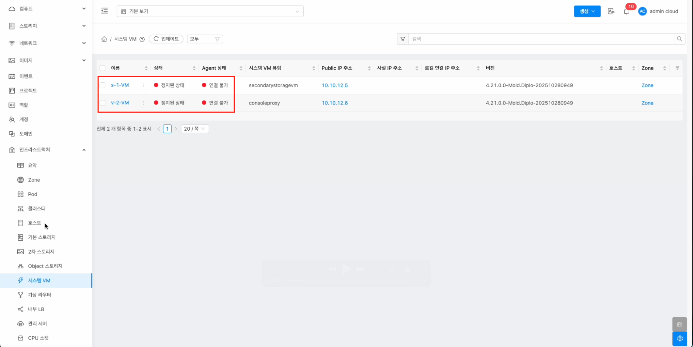{ .imgCenter .imgBorder }
    - 시스템 가상머신 상태가 **정지된 상태** 가 맞는지 확인합니다.
5. 호스트 유지보수 모드 활성화
    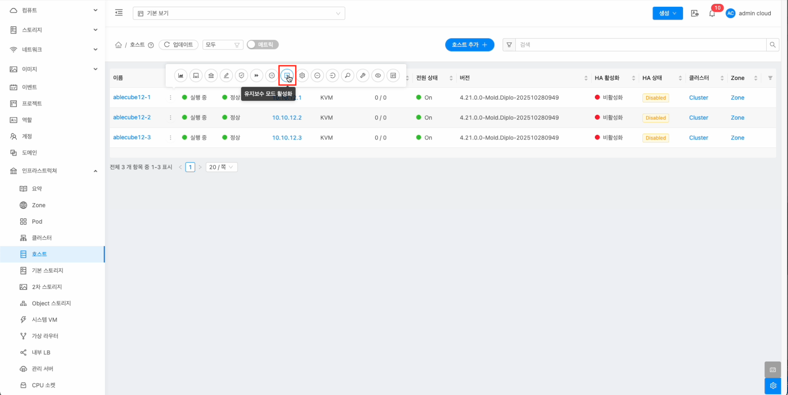{ .imgCenter .imgBorder }
    - Mold 좌측 메뉴에서 **인프라스트럭쳐 -> 호스트** 로 이동한 뒤, 호스트 유지보수 모드를 활성화합니다.
    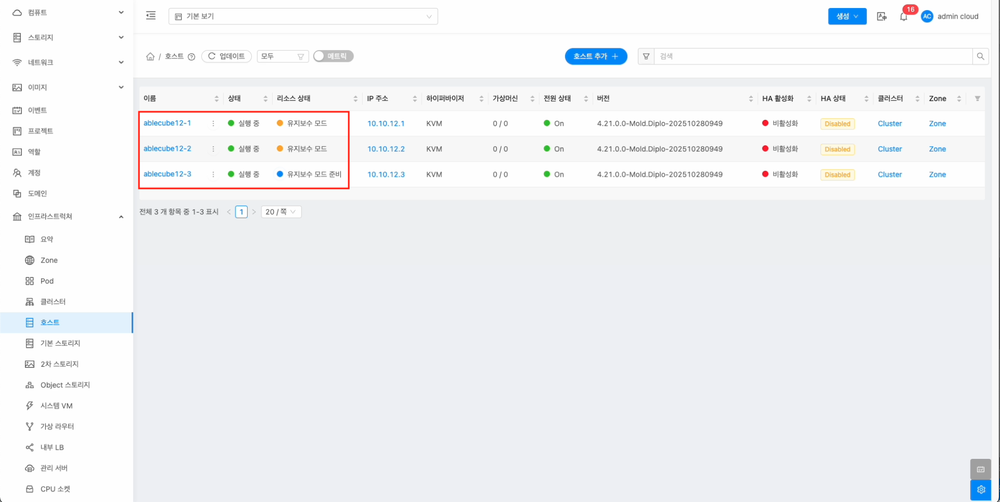{ .imgCenter .imgBorder }
    - 호스트 리소스 상태가 **유지보수 모드** 가 맞는지 확인합니다.

#### 웹 기반 관리 기능(Cube)
!!! info
    본 작업은 웹 기반 관리 기능(Cube)에서 수행합니다.

1. 펜스 장치 유지보수 설정
    { .imgCenter .imgBorder }
    - Cube 좌측 메뉴에서 **ABLESTACK** 로 이동한 뒤, 펜스 장치 유지보수 설정을 클릭합니다.
    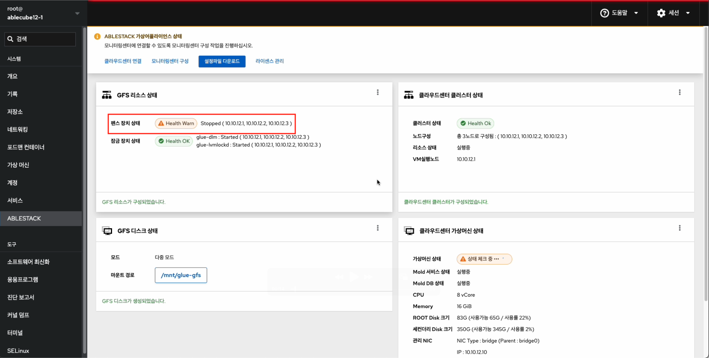{ .imgCenter .imgBorder }
    - GFS 리소스 상태의 펜스 장치 상태에서 **Stopped** 가 맞는지 확인합니다.
2. 클라우드센터 가상머신(CCVM) 정지
    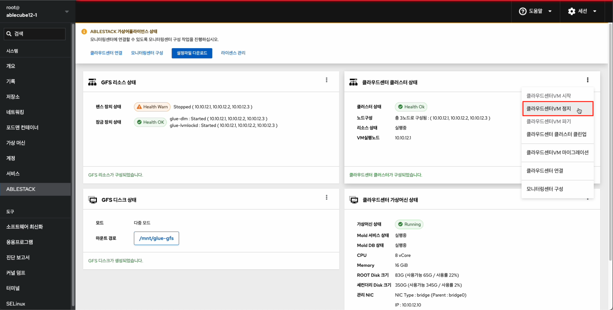{ .imgCenter .imgBorder }
    - Cube 좌측 메뉴에서 **ABLESTACK** 로 이동한 뒤, 클라우드센터VM을 정지합니다.
    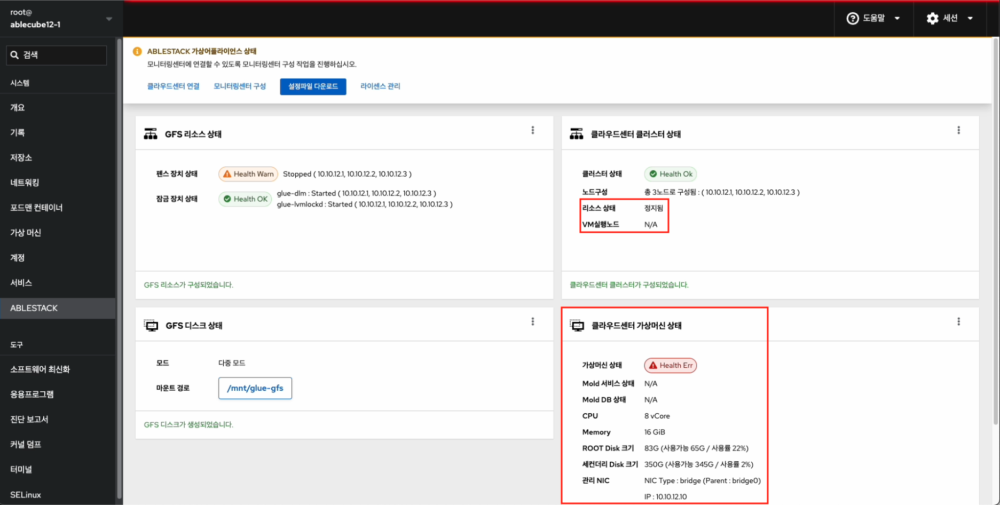{ .imgCenter .imgBorder }
    - 클라우드센터 클러스터 상태의 **리소스 상태(정지됨), VM실행노드(N/A)** 가 맞는지 확인합니다.
    - 클라우드센터 가상머신 상태에서 **Health Err** 가 맞는지 확인합니다.
3. 전체 호스트 재기동
    ```
    - CLI : reboot 또는 shutdown -r now 명령으로 호스트를 재기동합니다.
    - 물리 : BMC 콘솔(IPMI/iDRAC/iLO)에서 정상 종료 후 전원을 다시 넣어 재기동합니다.
    ```

### 전체 시스템 재기동 절차
1. **사전 조치**: 클러스터 상태, 시간 동기화·DNS·스토리지 상태 확인을 수행합니다.
2. **호스트 시작** : ablecube 호스트들을 기동합니다.
3. **관리 서버 시작** : CCVM을 시작합니다.
4. **시스템 VM 시작** : Zone 활성화 및 CPVM 및 SSVM을 시작합니다.
5. **업무용 VM 시작** : DB -> 미들웨어/WAS -> 애플리케이션 순서로 정상 시작합니다.

!!! info
    재기동 절차는 웹 기반 관리 기능(Cube)에서 선행 작업을 수행한 뒤, 클라우드센터 웹 콘솔(Mold)에서 후속 작업을 완료합니다.

#### 웹 기반 관리 기능(Cube)
!!! info
    본 작업은 웹 기반 관리 기능(Cube)에서 수행합니다.

1. 클러스터 상태 조회 및 외부 스토리지 확인
    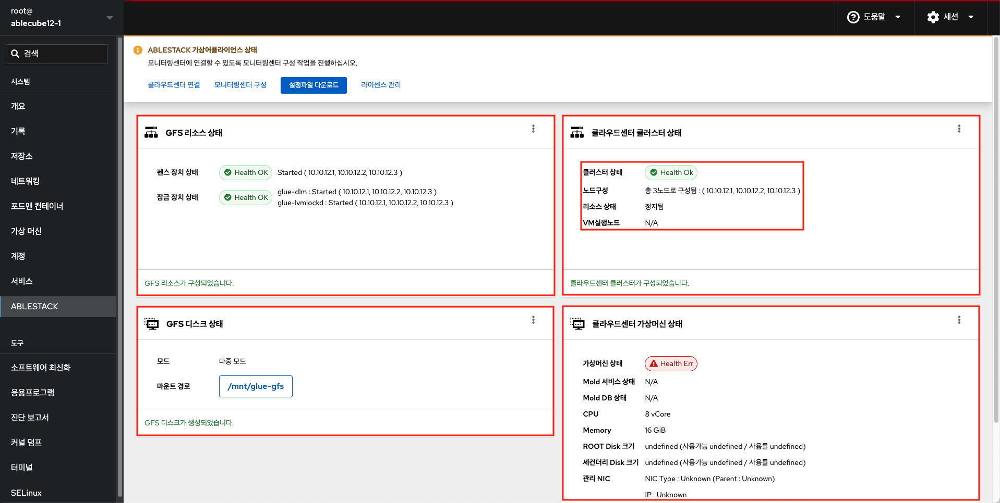{ .imgCenter .imgBorder }
    - Cube 좌측 메뉴에서 **ABLESTACK** 로 이동한 뒤, GFS 리소스 상태 및 클라우드센터 클러스터 상태(클러스터 상태, 노드구성)이 정상인지 확인합니다.
    - 호스트 재기동 후, 현재 클라우드센터 가상머신 상태는 **Health Err** 상태가 정상입니다.
2. 클라우드센터 가상머신(CCVM) 시작
    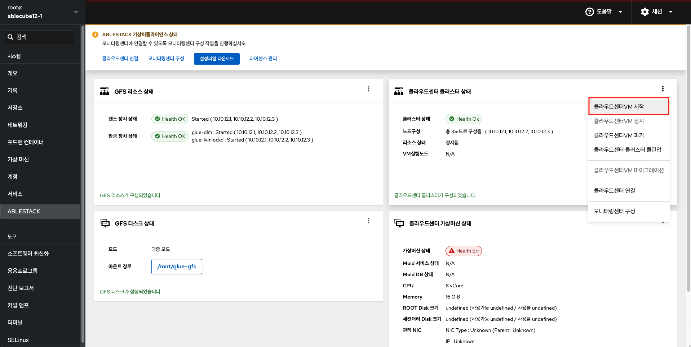{ .imgCenter .imgBorder }
    - Cube 좌측 메뉴에서 **ABLESTACK** 로 이동한 뒤, 클라우드센터VM 시작 작업을 실행합니다.
    !!! check
        펜스 장치 상태가 **Started** 라면 펜스 장치 유지보수 해제 단계는 건너뛰어도 됩니다. **Stopped** 인 경우에는 유지보수 해제를 수행한 후 다음 단계로 진행합니다.
3. 펜스 장치 유지보수 해제
    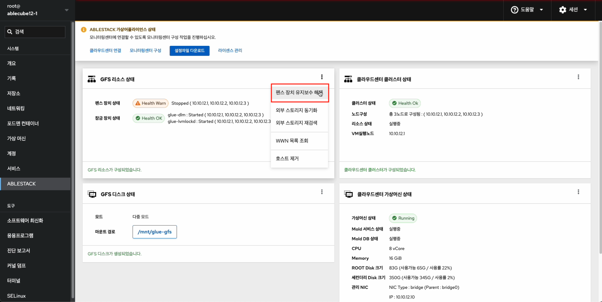{ .imgCenter .imgBorder }
    - Cube 좌측 메뉴에서 **ABLESTACK** 로 이동한 뒤, 펜스 장치 유지보수 해제를 클릭합니다.
    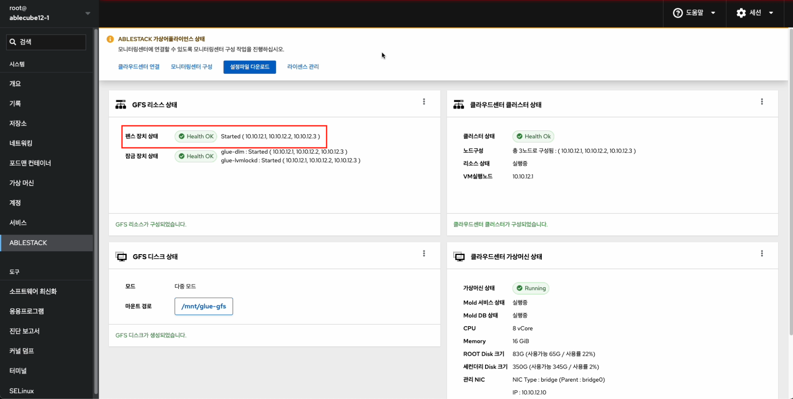{ .imgCenter .imgBorder }
    - GFS 리소스 상태의 펜스 장치 상태에서 **Started** 가 맞는지 확인합니다.

#### 클라우드센터 웹 콘솔(Mold)
!!! info
    본 작업은 클라우드센터 웹 콘솔(Mold)에서 수행합니다.

1. 호스트 유지보수 모드 비활성화
    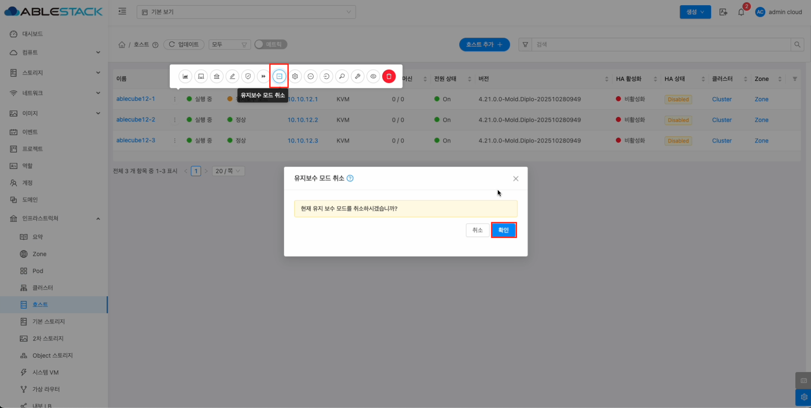{ .imgCenter .imgBorder }
    - Mold 좌측 메뉴에서 **인프라스트럭쳐 -> 호스트** 로 이동한 뒤, 호스트 유지보수 모드를 비활성화합니다.
    { .imgCenter .imgBorder }
    - 호스트 리소스 상태가 **정상** 이 맞는지 확인합니다.
2. Zone 활성화
    { .imgCenter .imgBorder }
    - Mold 좌측 메뉴에서 **인프라스트럭쳐 -> Zone** 으로 이동한 뒤, Zone을 활성화 합니다.
    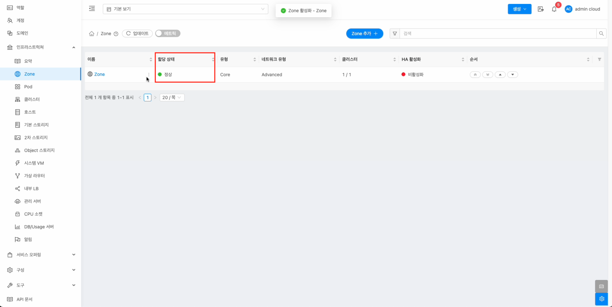{ .imgCenter .imgBorder }
    - Zone 할당 상태가 **활성화** 가 맞는지 확인합니다.
3. 시스템 VM 시작
    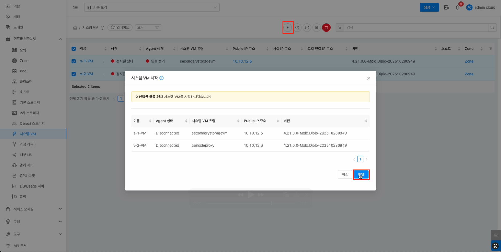{ .imgCenter .imgBorder }
    - Mold 좌측 메뉴에서 **인프라스트럭쳐 -> 시스템 VM** 로 이동한 뒤, 시스템 가상머신을 시작합니다.
    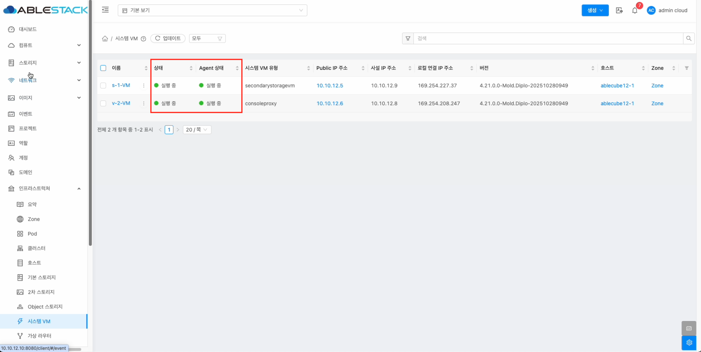{ .imgCenter .imgBorder }
    - 시스템 가상머신 상태가 **실행 중** 이 맞는지 확인합니다.
    !!! warning
        업무용 가상머신 시작 시 서비스 영향 최소화를 위해 **DB -> 미들웨어/WAS -> 애플리케이션** 순으로 정상 시작하시기 바랍니다. 해당 이미지는 예시이며, 실제 환경의 서비스 의존관계에 따라 조정 후 진행하시기 바랍니다.
4. 업무용 가상머신 시작
    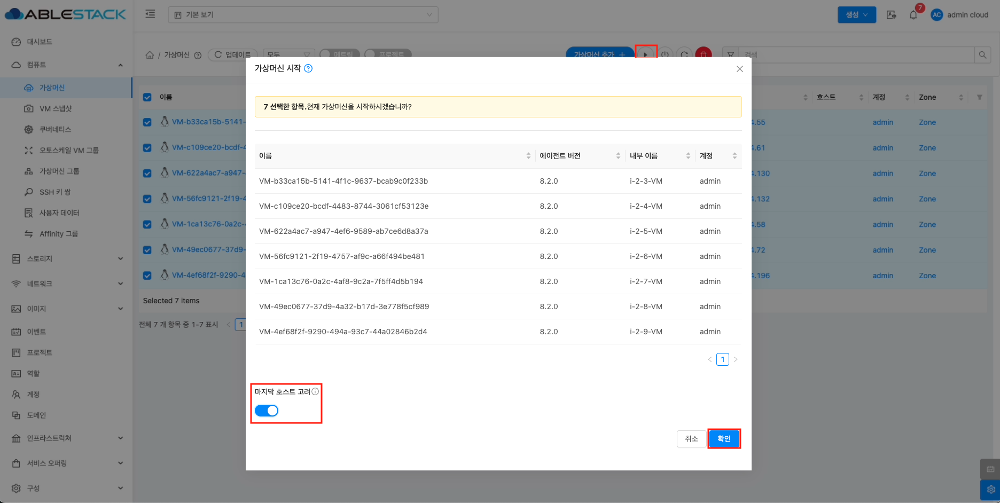{ .imgCenter .imgBorder }
    - Mold 좌측 메뉴에서 **컴퓨트 -> 가상머신** 로 이동한 뒤, 업무용 가상머신을 시작합니다.
    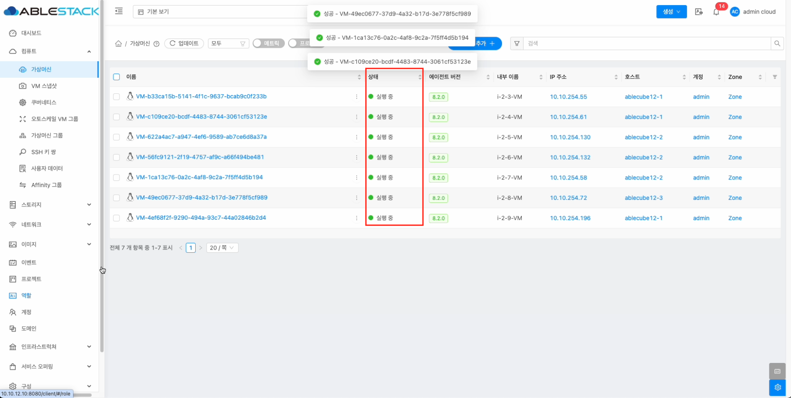{ .imgCenter .imgBorder }
    - 업무용 가상머신 상태가 **실행 중** 가 맞는지 확인합니다.
    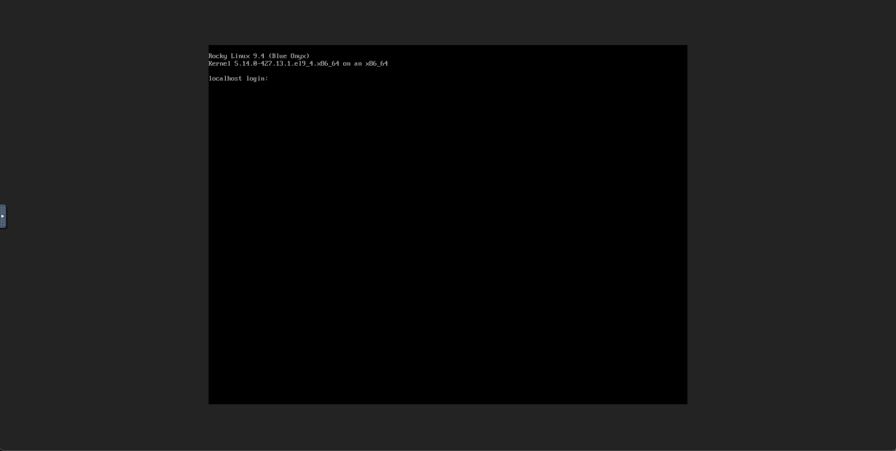{ .imgCenter .imgBorder }
    - 가상머신의 **콘솔 보기** 를 열어 부팅 상태와 로그인 화면을 확인합니다.
    - 업무용 가상머신 콘솔을 확인하여 OS 및 데이터가 정상인지 확인합니다.
5. HA 활성화
    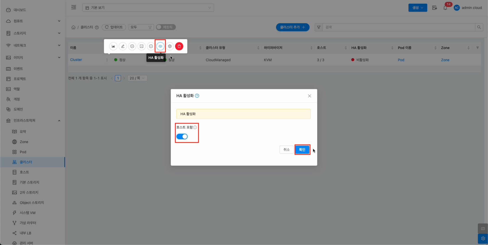{ .imgCenter .imgBorder }
    - Mold 좌측 메뉴에서 **인프라스트럭쳐 -> 클러스터** 로 이동한 뒤, 대상 클러스터의 HA 활성화를 실행합니다.
    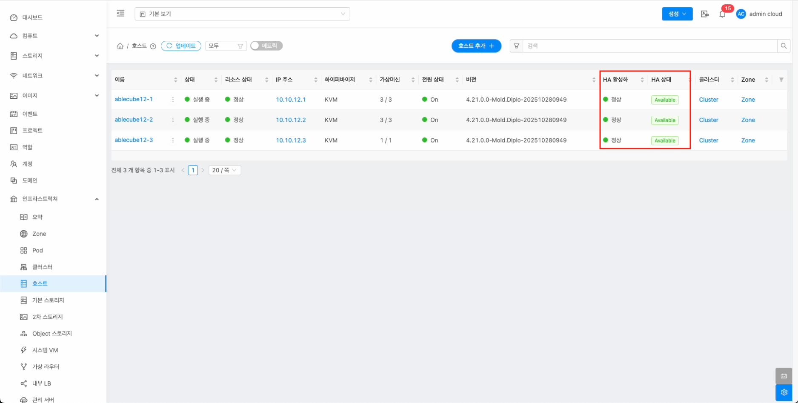{ .imgCenter .imgBorder }
    - 이어서 **인프라스트럭쳐 -> 호스트** 로 이동하여 각 호스트의 HA 상태가 **활성화 및 Availiable** 로 표시되는지 확인합니다.

## 한 대 시스템(호스트) 종료 및 재기동 절차

### 한 대 시스템(호스트) 종료 절차

1. **사전 조치**: 점검 공지, 알림 사일런스, 대상 호스트의 멀티패스·네트워크 상태를 확인합니다.
2. **유지보수 모드**: 대상 ablecube 호스트를 유지보수 모드로 전환하여 신규 스케줄링을 차단합니다.
3. **VM 대피**: 해당 호스트에 존재하는 **업무용 VM 및 시스템 VM(CPVM/SSVM) 및 관리 서버(CCVM)** 을 타 호스트로 라이브 마이그레이션하고, 불가 시 순차 정상 종료합니다.
4. **클러스터 설정 및 상태 확인** : 클러스터에 대한 펜스 장치 유지보수를 설정한 후, 상태를 확인합니다.
5. **호스트 종료/재부팅**: 에이전트 로그에 이상이 없는지 확인 후 호스트를 종료 또는 재부팅합니다.

!!! info
    종료 절차는 클라우드센터 웹 콘솔(Mold)에서 선행 작업을 수행한 뒤, 웹 기반 관리 기능(Cube)에서 후속 작업을 완료합니다.

#### 클라우드센터 웹 콘솔(Mold)
!!! info
    본 작업은 클라우드센터 웹 콘솔(Mold)에서 수행합니다.

1. HA 비활성화
    { .imgCenter .imgBorder }
    - Mold 좌측 메뉴에서 **인프라스트럭쳐 -> 클러스터** 로 이동한 뒤, 대상 클러스터의 HA 비활성화를 실행합니다.
    { .imgCenter .imgBorder }
    - 이어서 **인프라스트럭쳐 -> 호스트** 로 이동하여 각 호스트의 HA 상태가 **비활성화 및 Disabled** 로 표시되는지 확인합니다.
2. 업무용 가상머신 라이브 마이그레이션
    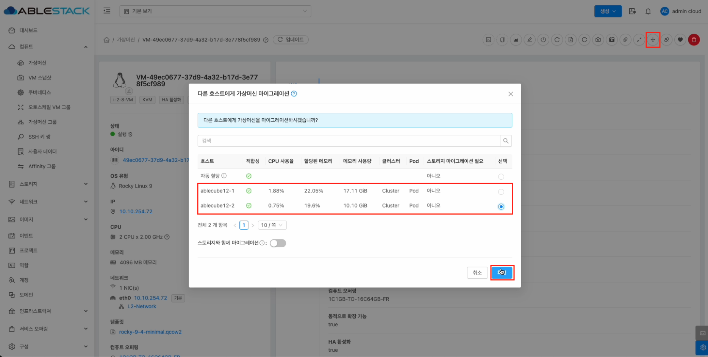{ .imgCenter .imgBorder }
    - Mold 좌측 메뉴에서 **컴퓨트 -> 가상머신** 로 이동한 뒤, 업무용 가상머신을 라이브 마이그레이션 작업을 합니다.
    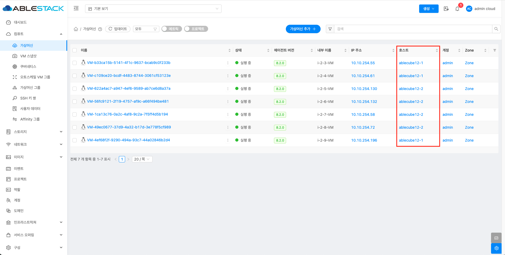{ .imgCenter .imgBorder }
    - 업무용 가상머신의 호스트 위치가 **타 호스트** 가 맞는지 확인합니다.
    - 재기동 대상 호스트에 실행 중인 가상머신이 존재하는지 최종 확인합니다.
    !!! check
        재기동 대상 호스트에 시스템 가상머신(CPVM, SSVM)이 존재하는 경우, 다른 호스트로 마이그레이션을 수행합니다.
3. 시스템 VM 라이브 마이그레이션
    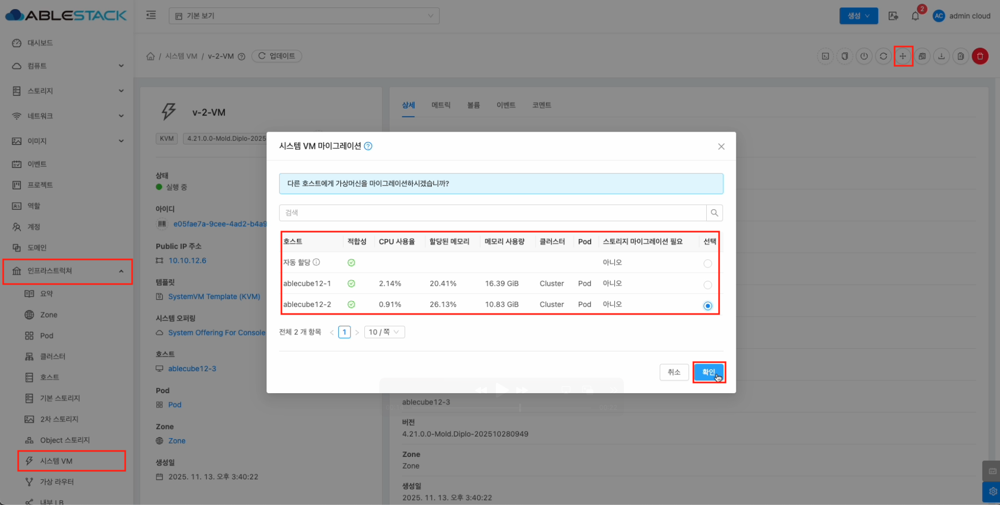{ .imgCenter .imgBorder }
    - Mold 좌측 메뉴에서 **인프라스트럭쳐 -> 시스템 VM** 로 이동한 뒤, 시스템 가상머신을 라이브 마이그레이션 작업을합니다.
    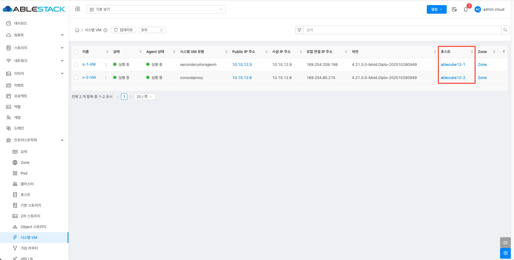{ .imgCenter .imgBorder }
    - 시스템 가상머신의 호스트 위치가 **타 호스트** 가 맞는지 확인합니다.
4. 해당 호스트 유지보수 모드 활성화
    { .imgCenter .imgBorder }
    - Mold 좌측 메뉴에서 **인프라스트럭쳐 -> 호스트** 로 이동한 뒤, 재기동 대상 호스트의 유지보수 모드를 활성화합니다.
    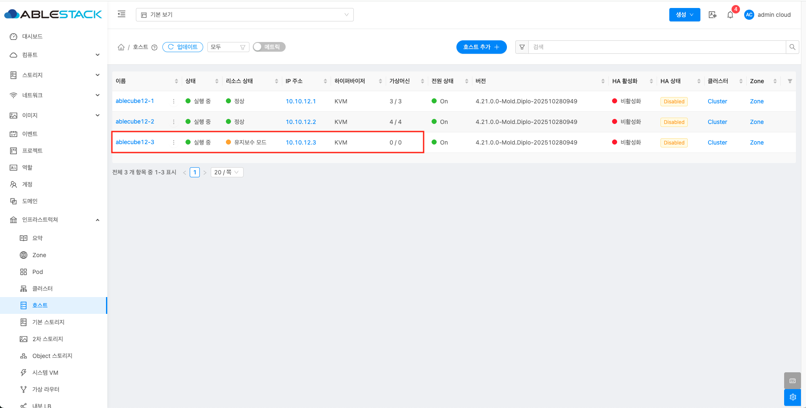{ .imgCenter .imgBorder }
    - 재기동 대상 호스트의 리소스 상태가 **유지보수 모드** 가 맞는지 확인합니다.
    - 재기동 대상 호스트의 가상머신이 존재하는 지 확인합니다.

#### 웹 기반 관리 기능(Cube)
1. 펜스 장치 유지보수 설정
    { .imgCenter .imgBorder }
    - Cube 좌측 메뉴에서 **ABLESTACK** 로 이동한 뒤, 펜스 장치 유지보수 설정을 클릭합니다.
    { .imgCenter .imgBorder }
    - GFS 리소스 상태의 펜스 장치 상태에서 **Stopped** 가 맞는지 확인합니다.
    !!! check
        재기동 대상 호스트에 클라우드센터 가상머신(CCVM)이 존재하는 경우, 다른 호스트로 마이그레이션을 수행합니다.
2. 클라우드센터 가상머신(CCVM) 마이그레이션 작업
    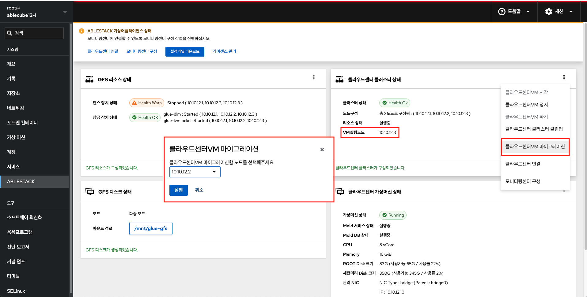{ .imgCenter .imgBorder }
    - Cube 좌측 메뉴에서 **ABLESTACK** 로 이동한 뒤, 클라우드센터VM을 타 호스트로 마이그레이션 합니다.
    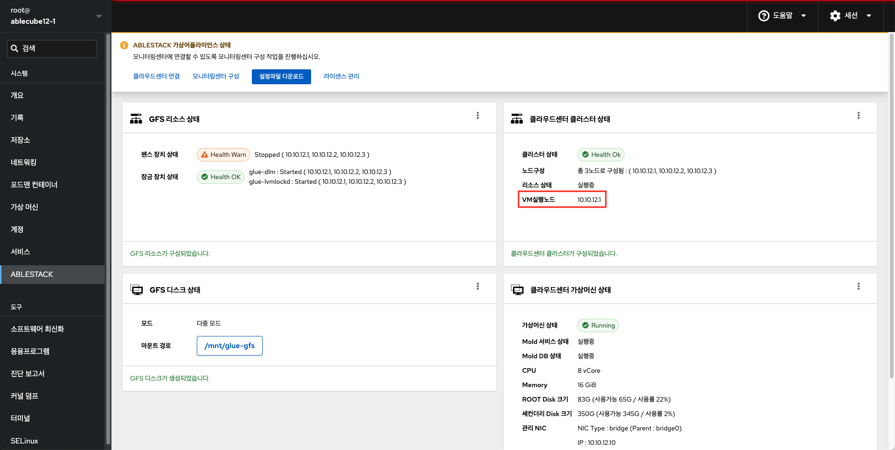{ .imgCenter .imgBorder }
    - 클라우드센터 클러스터 상태의 **VM실행노드** 가 타 호스트로 이관되었는지 확인합니다.
    - 클라우드센터 가상머신 상태에서 **Health OK** 가 맞는지 확인합니다.
3. 대상 호스트 재기동
    ```
    - CLI : reboot 또는 shutdown -r now 명령으로 호스트를 재기동합니다.
    - 물리 : BMC 콘솔(IPMI/iDRAC/iLO)에서 정상 종료 후 전원을 다시 넣어 재기동합니다.
    ```

### 한 대 시스템(호스트) 재기동 절차

1. **호스트 기동 및 에이전트 확인**: 호스트 전원을 올리고 에이전트/로그 이상 여부를 확인합니다.
2. **클러스터 복구**: 펜스 장치 유지보수를 해제하고 클러스터 상태가 정상인지 확인합니다.
3. **유지보수 모드 해제**: 대상 ablecube 호스트의 유지보수 모드를 하제합니다.
4. **VM 복귀/기동**: 타 호스트로 마이그레이션된 업무용 VM을 순차적으로 해당 호스트로 라이브 마이그레이션합니다.
5. **사후 점검**: 해당 호스트에 대한 멀티패스, 네트워크, 스토리지 상태 확인, 모니터링 지표와 서비스 기능 점검을 수행합니다.

!!! info
    재기동 절차는 반대로 웹 기반 관리 기능(Cube)에서 선행 작업을 수행한 뒤, 클라우드센터 웹 콘솔(Mold)에서 후속 작업을 완료합니다.
#### 웹 기반 관리 기능(Cube)
!!! info
    본 작업은 웹 기반 관리 기능(Cube)에서 수행합니다.

1. 클러스터 상태 조회 및 외부 스토리지 확인
    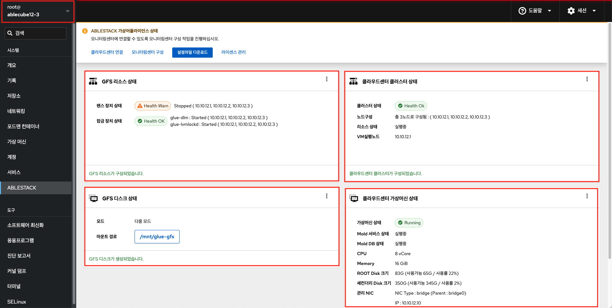{ .imgCenter .imgBorder }
    - 해당 호스트의 Cube 좌측 메뉴에서 **ABLESTACK** 로 이동한 뒤, GFS 리소스 상태 및 클라우드센터 클러스터 상태(클러스터 상태, 노드구성)이 정상인지 확인합니다.
2. 펜스 장치 유지보수 해제
    { .imgCenter .imgBorder }
    - Cube 좌측 메뉴에서 **ABLESTACK** 로 이동한 뒤, 펜스 장치 유지보수 해제를 클릭합니다.
    { .imgCenter .imgBorder }
    - GFS 리소스 상태의 펜스 장치 상태에서 **Started** 가 맞는지 확인합니다.

#### 클라우드센터 웹 콘솔(Mold)
!!! info
    본 작업은 클라우드센터 웹 콘솔(Mold)에서 수행합니다.

1. 호스트 유지보수 모드 비활성화
    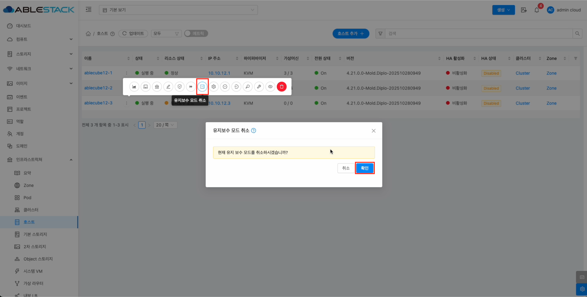{ .imgCenter .imgBorder }
    - Mold 좌측 메뉴에서 **인프라스트럭쳐 -> 호스트** 로 이동한 뒤, 호스트 유지보수 모드를 비활성화합니다.
    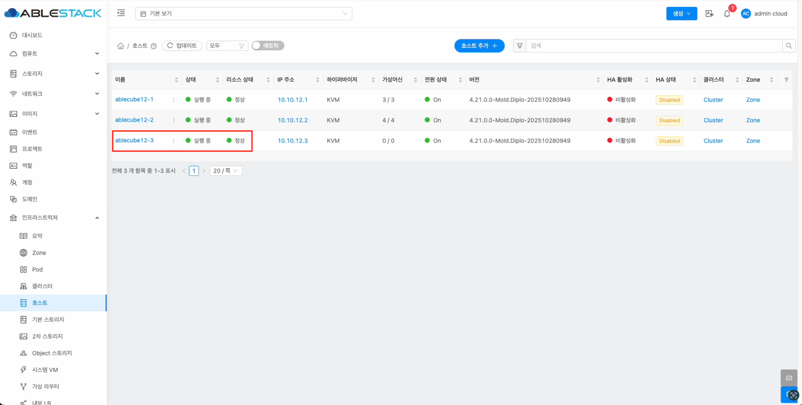{ .imgCenter .imgBorder }
    - 호스트 리소스 상태가 **정상** 이 맞는지 확인합니다.
2. 업무용 가상머신 마이그레이션
    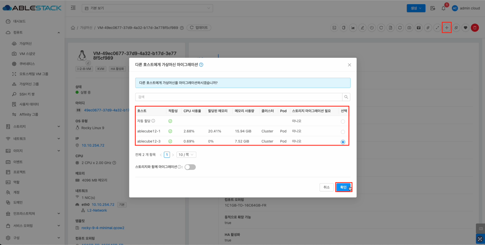{ .imgCenter .imgBorder }
    - Mold 좌측 메뉴에서 **컴퓨트 -> 가상머신** 로 이동한 뒤, 타 호스트로 이전했던 업무용 가상머신을 재기동이 완료된 호스트로 다시 마이그레이션합니다.
    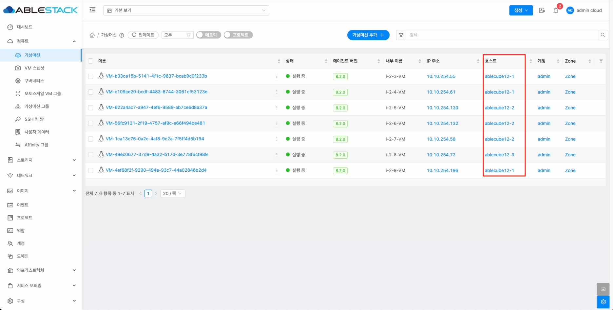{ .imgCenter .imgBorder }
    - 업무용 가상머신의 호스트 위치가 **재기동이 완료된 호스트** 가 맞는지 확인합니다.
    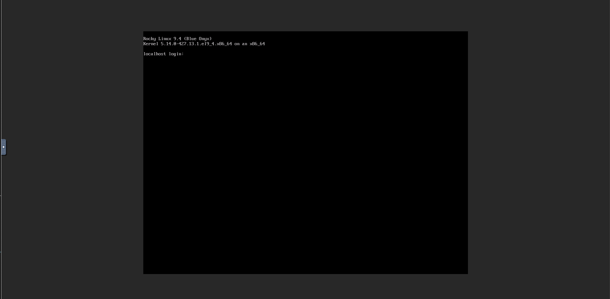{ .imgCenter .imgBorder }
    - 마이그레이션된 가상머신의 **콘솔 보기** 를 열어 부팅 상태와 로그인 화면을 확인합니다.
    - 업무용 가상머신 콘솔을 확인하여 OS 및 데이터가 정상인지 확인합니다.
3. HA 활성화
    { .imgCenter .imgBorder }
    - Mold 좌측 메뉴에서 **인프라스트럭쳐 -> 클러스터** 로 이동한 뒤, 대상 클러스터의 HA 활성화를 실행합니다.
    { .imgCenter .imgBorder }
    - 이어서 **인프라스트럭쳐 -> 호스트** 로 이동하여 각 호스트의 HA 상태가 **활성화 및 Availiable** 로 표시되는지 확인합니다.
