# ABLESTACK 재기동
 ABLESTACK HCI의 전체시스템을 안정적으로 재기동하기 위해서는 규정된 절차에 따라 시행되어야 합니다.
 재기동 절차 및 방법은 다음과 같습니다. 

### 재기동 절차 대상
ABLESTACK 재기동에 필요한 설정 대상은 다음과 같습니다.

* Mold
* Cube

재기동 방법은 다음과 같습니다.

## 종료 절차

#### Mold
  1. HA를 비활성화합니다.
  
  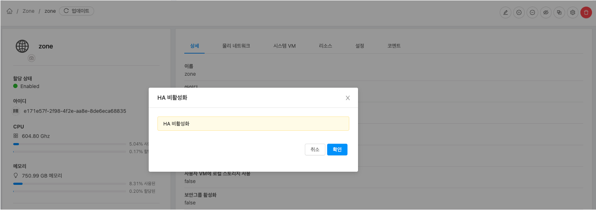

  2. 모든 가상머신을 종료합니다.
     1. HA 용도의 가상머신 종료
     2. 사용자 가상머신 종료

  3. Zone을 비활성화합니다.
  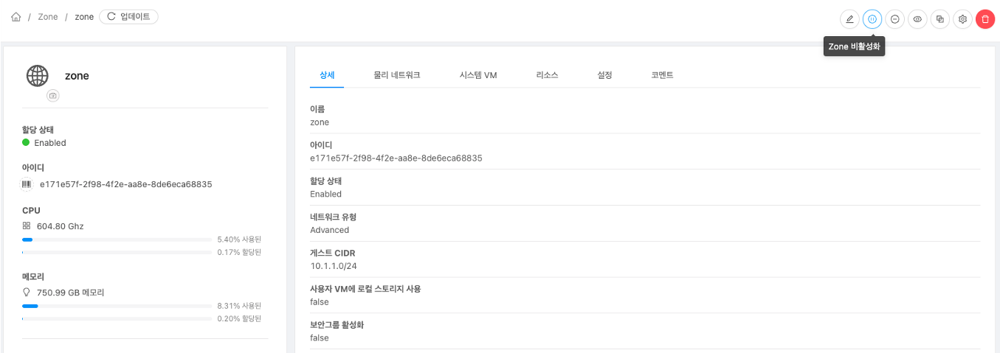

  4. 시스템 VM을 종료합니다.
  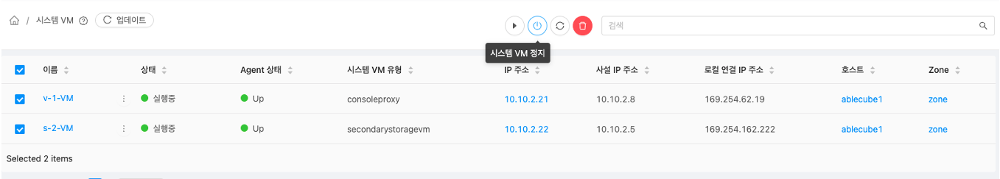
  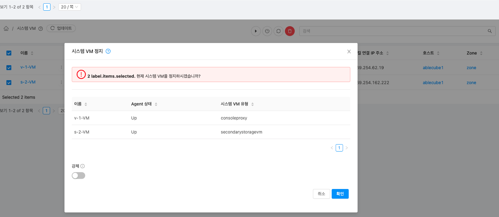
  

  5. 기본스토리지를 유지보수 모드로 설정합니다.
     1. 기본 스토리지 (ha) 유지보수 모드 설정
     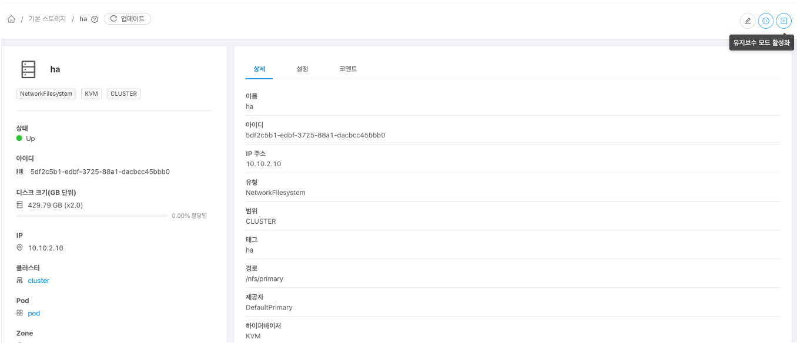
    
  6. 호스트를 유지보수 모드로 설정합니다.
  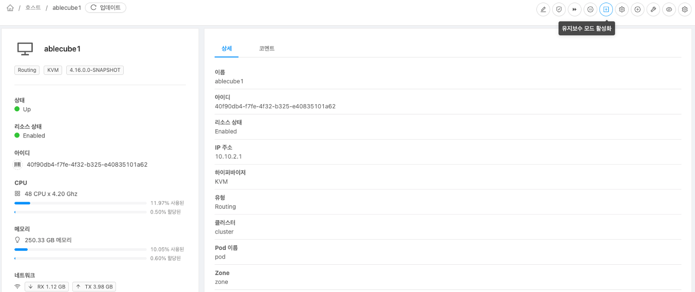
  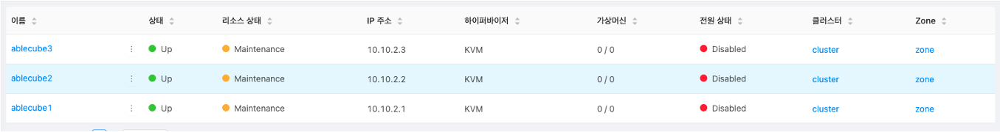
    
    !!! info
        유지보수 모드 설정한 호스트가 변경 완료 되었을 때 다음 호스트 유지보수 모드 설정을 진행해야 합니다.

#### Cube

  7. "전체 시스템 자동종료" 기능으로 전체 시스템을 종료합니다. 
  전체 시스템을 종료합니다. 이 기능에는 아래의 절차가 자동으로 실행됩니다.
     1. 클라우드센터 가상머신 정지
     2. 모든 스토리지센터 클러스터 유지보수 모드 설정
     3. 모든 스토리지센터 가상머신 정지
     4. 모든 호스트 종료
  
    !!! warning
        해당기능을 실행하기 전 반드시 각 호스트에 Mount된 볼륨을 작업 수행자가 직접 해제해야 합니다.

    ```shell
    # 각 호스트에서 아래 명령어를 실행하여 'nfs' 타입으로 마운트된 볼륨을 검색합니다.
    $ {경로} = findmnt | awk '{print $2}' | sort -u | grep 'nfs' 

    # 위 명령어 실행 결과에 따라 볼륨 해제를 합니다.
    $ umount {경로}
    ```

  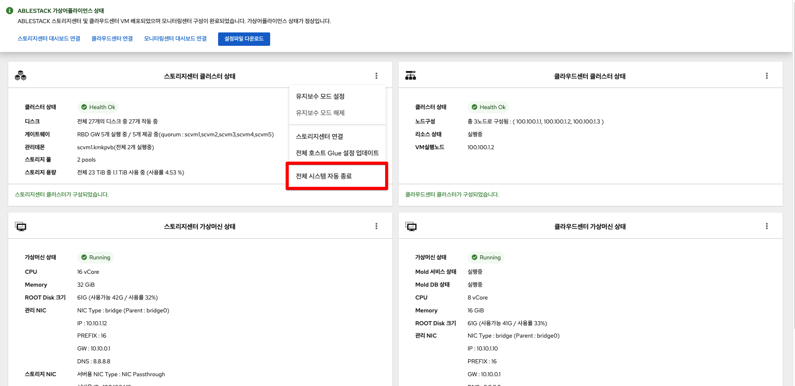
  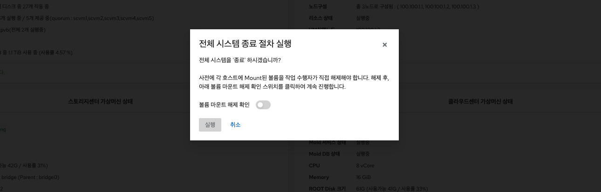

## 재시작 절차
  1. 종료된 호스트의 전원을 다시 킵니다.

#### Cube

  2. 스토리지센터 가상머신을 확인합니다.
     1. 모든 스토리지센터의 가상머신 시작 상태를 확인합니다.
    !!! info
        만약 가상머신 상태가 정지 상태이면 시작 버튼을 클릭하여 가상머신 시작합니다.
  3. 스토리지센터 클러스터 유지보수 모드를 해제합니다.
  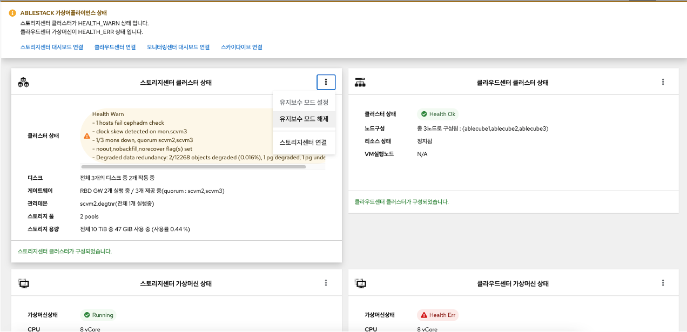

  4. 클라우드센터 가상머신을 시작합니다.
     1. 클라우드센터 가상머신을 시작한 후 클라우드센터에 연결하여 Mold 서비스가 정상적으로 시작되었는지 확인합니다.
     

#### Mold

  5. 호스트 유지보수 모드를 해제합니다.
  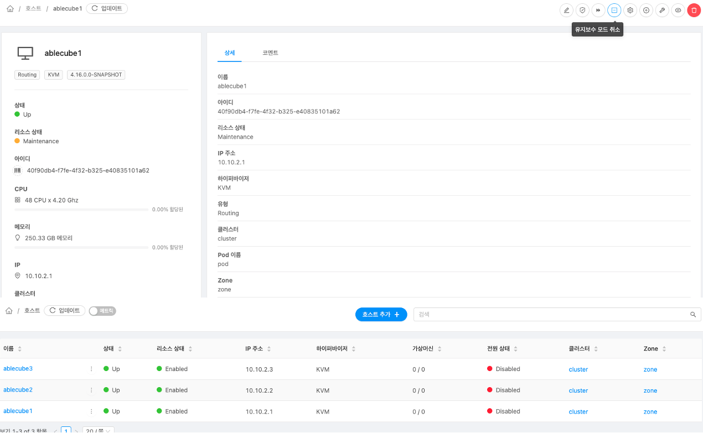

  6. 기본 스토리지 유지보수 모드를 해제합니다.
  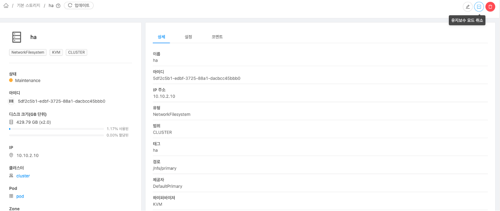

  7. Zone을 활성화합니다.
  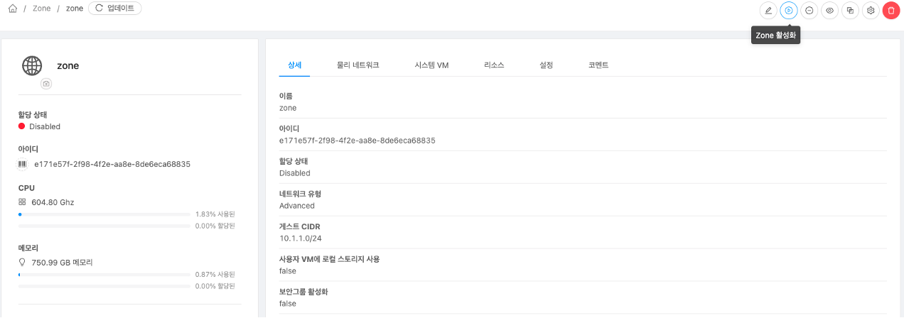

  8. 시스템 VM을 시작합니다.

    !!! info
        시스템 VM은 별도로 시작하지 않아도 Zone 활성화 후 자동으로 시작됩니다.
  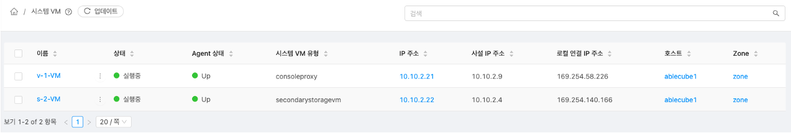

  9. 가상머신을 시작합니다.
     1. HA 용도의 가상머신을 시작합니다.
     2. 사용자 가상머신 시작합니다.

  10.	HA 기능을 활성화합니다.
  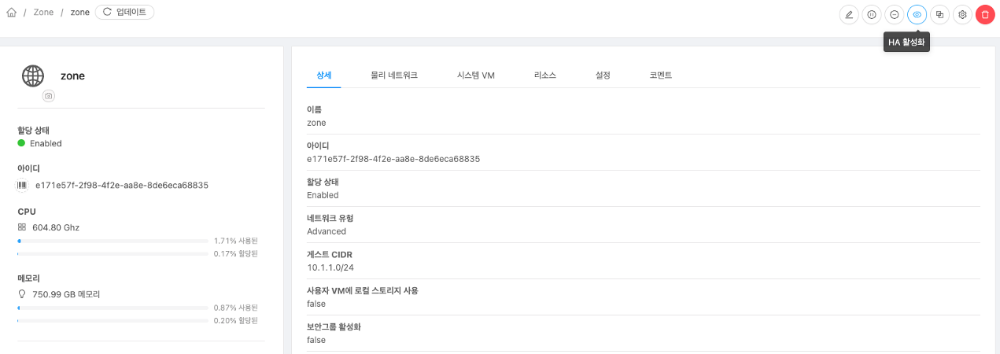

  11. 사용자 가상머신 및 서비스 상태를 확인합니다.
  