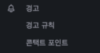
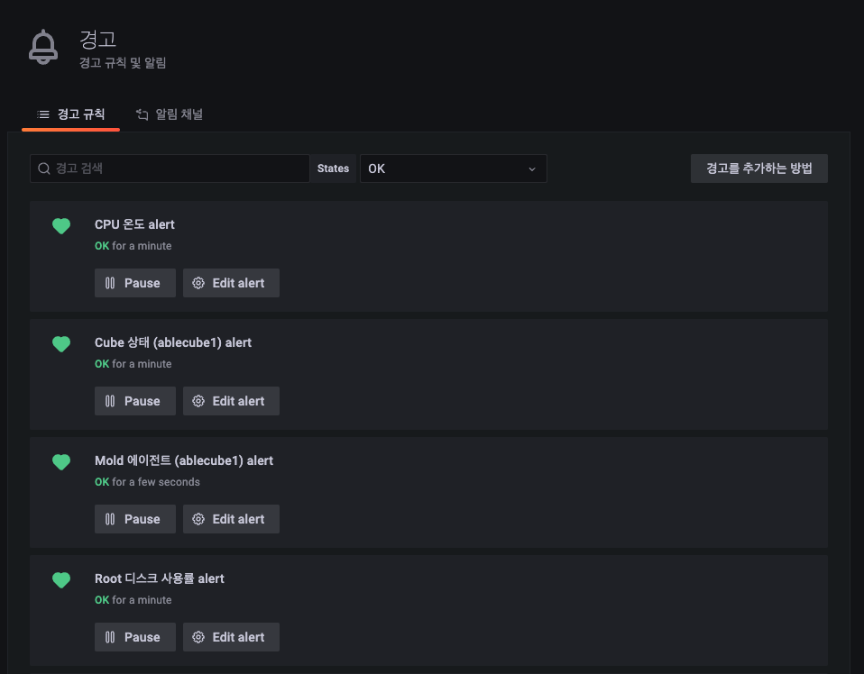
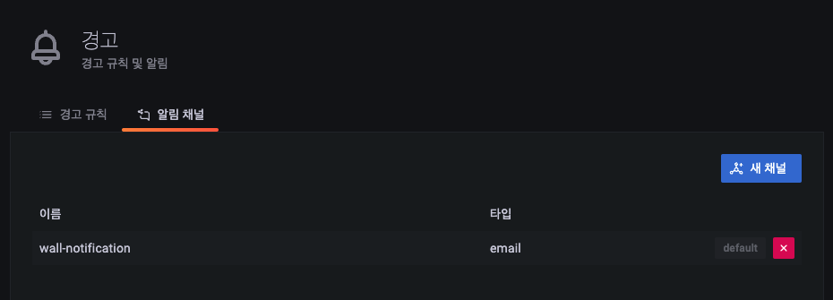
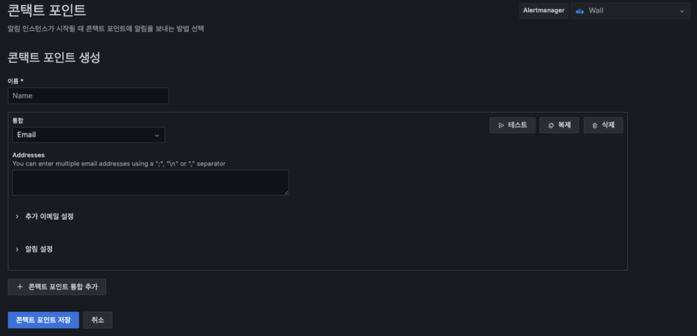

# 경고
경고를 통해 시스템 문제가 발생한 직후 문제에 대해 알 수 있습니다. 강력하고 실행 가능한 경고를 통해 문제를 신속하게 식별하고 해결하여 서비스 중단을 최소화할 수 있습니다.

메뉴 구조는 경고 규칙을 확인할 수 있는 "경고 규칙", 경고 알림 서비스를 설정할 수 있는 "알림 채널" 기능으로 구성되어 있습니다.

## 경고 규칙

경고 규칙은 Wall에 기존 설정된 Alert 폴더에 있는 "사용자 VM 알람 대시보드", "스토리지 센터 알람 대시보드", "클라우드 센터 알람 대시보드", "호스트 알람 대시보드"에 설정되어 있는 알람 패널에 대한 알람 정보를 확인할 수 있습니다.

* 경고 검색 : 경고 이름으로 목록을 조회
* States : 경고 상태에 따라 조회

**States 유형**  
    - All : 모든 알람 조회  
    - OK : 정상 상태인 알람 조회  
    - Not OK : 비정상 상태인 알람 조회  
    - Alerting : 경고 상태인 알람 조회  
    - No data : 데이터가 조회되지 않는 알람 조회  
    - Paused : 일시중지된 알람 조회  
    - Pending : 보류 중인 알람 조회  

## 알림 채널

알림 채널을 등록하고 등록된 알림 채널의 목록을 확인할 수 있습니다. 

* 새 채널 : 신규 알림 서비스를 받을 채널을 등록할 수 있습니다.
* x 버튼 : 등록된 알림 채널을 삭제할 수 있습니다.

!!! info
    Wall의 기본 알람 채널은 Email 방식입니다.

### 새 채널

새 알림 채널을 등록하는 화면입니다.

1) Name : 알림 채널 이름  
2) Type : 기본 알람 채널은 Email 이며 Discord, DingDing, Kafka 등 다양한 채널이 존재 합니다.  
3) Addresses : 수신 받을 이메일 ( ; 로 구분하여 다수의 이메일 입력 가능)  
4) Optional Email settings : 선택적으로 설정할 수 있는 옵션 정보  
5) 알림 설정 : 알림에 포함할 정보를 선택  
6) 저장 : 설정된 정보를 저장  
7) 테스트 : 정상적으로 채널이 생성되었는지 테스트  
8) 돌아가기 : 설정 정보를 저장하지 않음  
