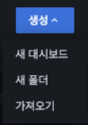
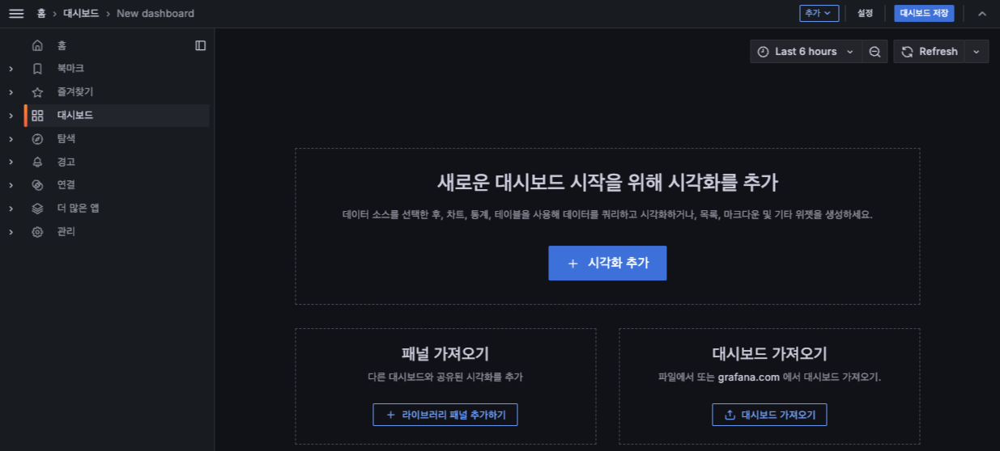

# 생성
생성 메뉴는 사용자가 필요한 대시보드와 폴더를 추가할 때 사용 가능합니다.

메뉴 구조는 대시보드를 생성할 수 있는 "대시보드", 폴더를 생성하는 "폴더", 만들어진 템플릿의 대시보드를 적용하는 "가져오기"로 구성되어 있습니다.

## 대시보드 생성

* 시각화 추가 : 대시보드에 패널 단위의 모니터링 정보를 추가할 수 있습니다.
* 패널 가져오기 : 사용자가 등록한 패널을 라이브러리에 등록하여 필요한 부분에 공통적으로 적용할 때 사용합니다.
* 대시보드 가져오기 : 대시보드 탬플릿 파일 또는 grafana.com 에서 대시보드를 가져올 수 있습니다.
