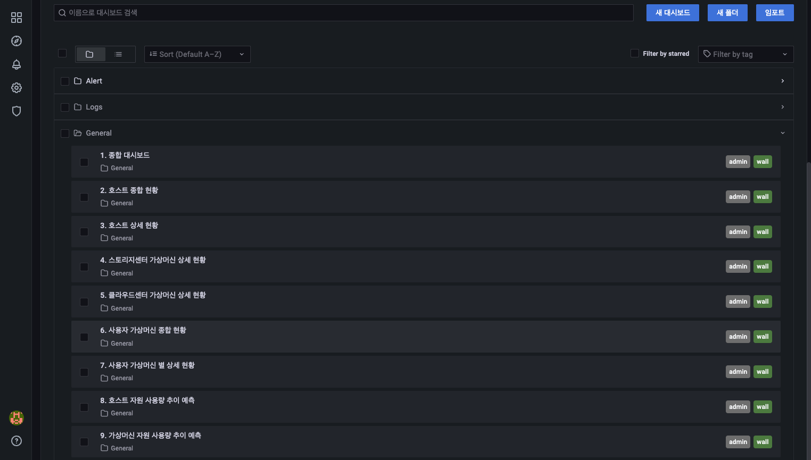

# 대시보드 검색
대시보드 검색 메뉴는 최근 본 대시보드, Alert 대시보드 4종, General 대시보드 7종에 대한 검색을 할 수 있는 기능을 제공합니다.

메뉴 구조는 전체 대시보드를 검색으로 찾을수 있는 "대시보드 검색"으로 구성되어 있습니다.

"이름으로 대시보드 검색" 입력 박스에 검색 하고자 하는 대시보드 명을 입력하여 검색할 수 있습니다.

Sort 기능을 이용하여 대시보드 목록을 알파벳 순으로 오름차순, 내림차순 조회 가능합니다.