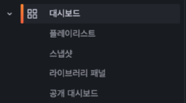
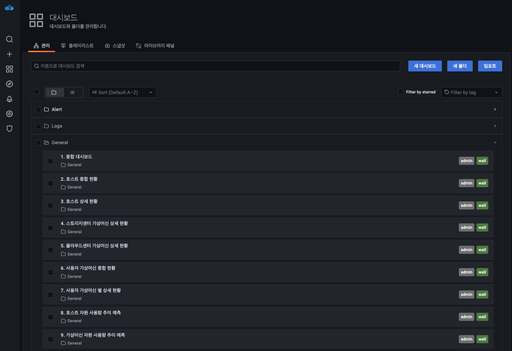
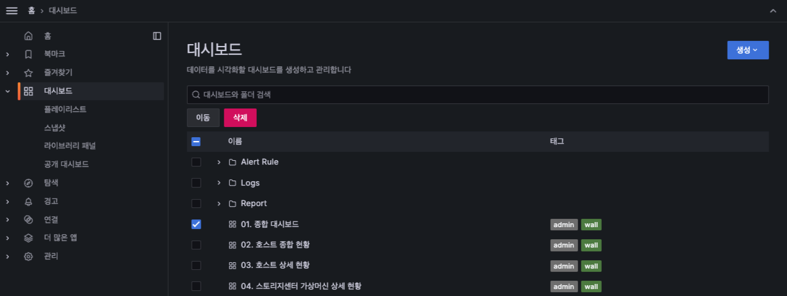
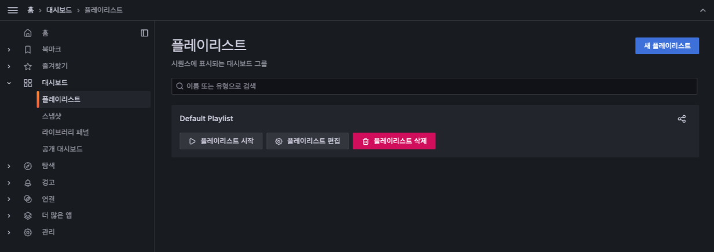
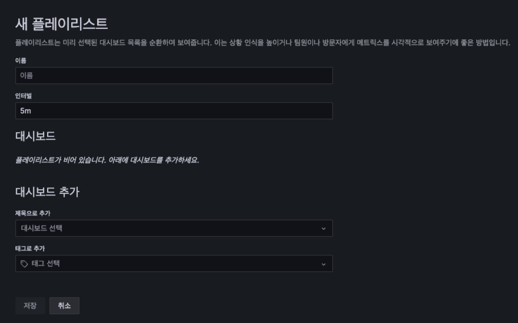
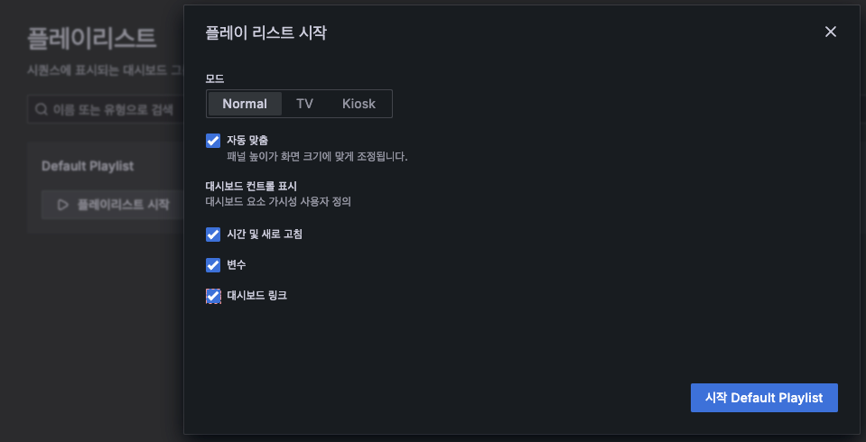
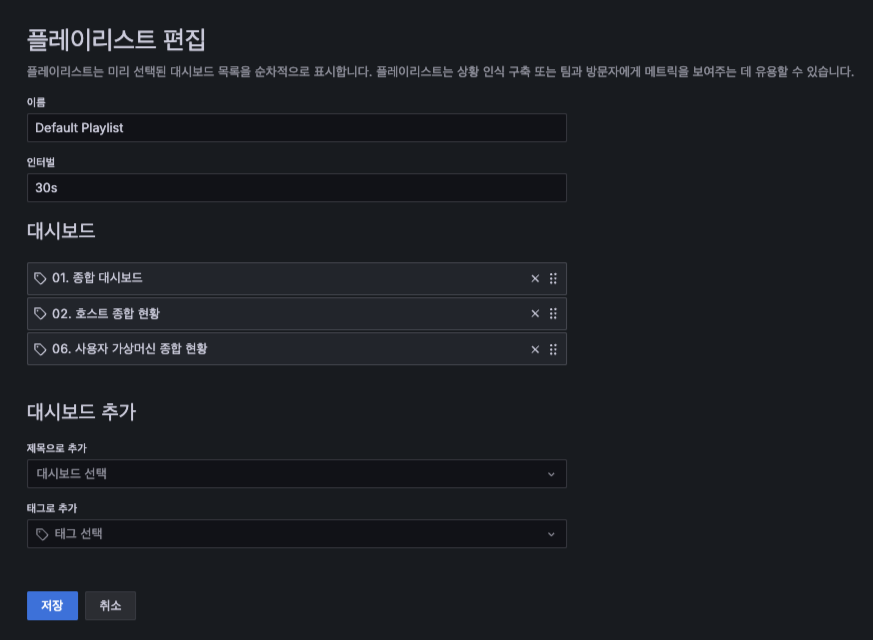
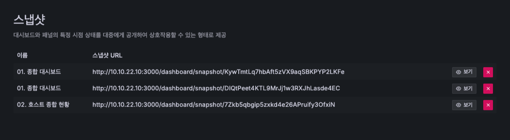
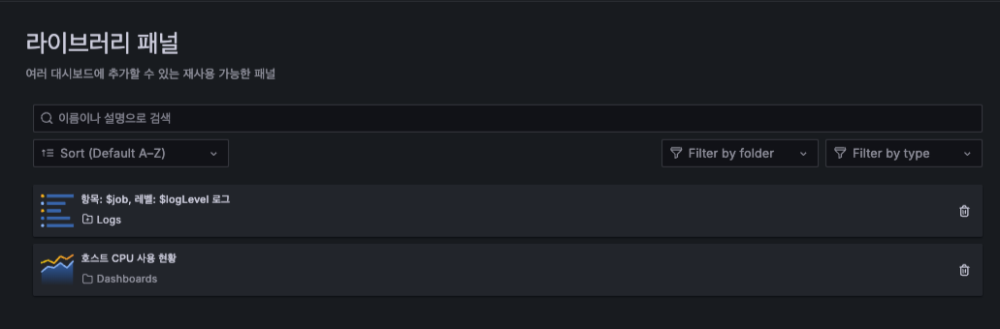

# 대시보드
대시보드 메뉴는 대시보드의 폴더나 위치를 관리할 수 있으며, 플레이리스트를 통해 여러 대시보드를 순환하며 모니터링 가능합니다. 또한 스냅샷 기능을 통해 조회한 대시보드의 형상을 유지할 수 있습니다. 라이브러리 패널은 등록된 라이브러리 패널을 목록을 확인하거나 삭제할 수 있습니다.

메뉴 구조는 대시보드와 폴더를 관리할 수 있는 "관리", 여러 대시보드를 순환하며 재생하여 모니터링 할 수 있는 "플레이리스트", 대시보드의 현재 형상을 저장할 수 있는 "스냅샷", 여러 대시보드에 공통 적용할 수 있는 "라이브러리 패널" 관리 기능으로 구성되어 있습니다.

## 관리

관리 기능은 대시보드 및 폴더를 목록으로 확인 가능합니다.

* 새 대시보드 : 신규 대시보드를 생성할 수 있습니다.
* 새 폴더 : 신규 폴더를 추가할 수 있습니다.
* 임포트 : 만들어진 템플릿을 바로 적용할 수 있는 기능을 제공합니다.

작업할 대시보드를 체크하여 다른 폴더로 이동하거나 삭제할 수 있습니다.

!!! info
    대시보드 삭제 시 되돌릴 수 없으니 신중하시기 바랍니다.

## 플레이리스트

플레이리스트 기능은 여러 대시보드를 순환하며 재생하며 모니터링할 수 있도록 기능을 제공합니다.

* 새 플레이리스트 : 신규 플레이리스트를 생성할 수 있습니다.

1) 이름 : 플레이리스트의 이름을 입력  
2) 인터벌 : 순환 주기를 입력 ( ex : 30초 = 30s, 5분 = 5m, 1시간 1h)  
3) 이름으로 추가 : 대시보드 선택 목록에서 대시보드를 선택하여 플레이리스트에 추가  
4) 태그로 추가 : 대시보드에 달린 태그를 통해 플레이리스트에 추가  
5) 저장 : 저장 버튼을 클릭하여 새 플레이리스트 등록  
6) 취소 : 취소 버튼을 클릭하면 새 플레이리스트 등록 취소  

* 플레이리스트 시작 : 등록한 플레이리스트를 순환 재생할 수 있습니다.

1) 모드 : 플레이리스트를 실행할 모드를 선택합니다. (Normal : 평범한 화면 출력 모드, TV : TV에서 출력할 때 최적화, Kiosk : 대시보드 패널 영역만 표출 되도록 설정)  
2) 자동 맞춤 : 화면 해상도에 맞춰 패널의 크기를 자동 조정합니다.  
3) 시작 : 시작 버튼을 클릭하면 플레이리스트가 실행됩니다.  

* 플레이리스트 편집 : 만들어진 템플릿을 바로 적용할 수 있는 기능을 제공합니다.

1) 이름 : 플레이리스트의 이름을 수정  
2) 인터벌 : 순환 주기를 수정 ( ex : 30초 = 30s, 5분 = 5m, 1시간 1h)  
3) Dashboards : 대시보드를 추가하거나 삭제, 순서를 변경
4) 이름으로 추가 : 대시보드 선택 목록에서 대시보드를 선택하여 플레이리스트에 추가  
5) 태그로 추가 : 대시보드에 달린 태그를 통해 플레이리스트에 추가  
6) 저장 : 저장 버튼을 클릭하여 새 플레이리스트 수정  
7) 취소 : 취소 버튼을 클릭하면 새 플레이리스트 수정 취소  

## 스냅샷

스냅샷은 대화형 대시보드를 공개적으로 공유하는 즉각적인 방법입니다. 생성 시 쿼리(메트릭, 템플릿 및 주석) 및 패널 링크와 같은 민감한 데이터를 제거하고 대시보드에 포함된 가시적인 메트릭 데이터 및 시리즈 이름만 남깁니다. 대시보드 스냅샷을 생성한 목록을 확인 가능합니다.

1) View : 버튼을 클릭하여 스냅샷 대시보드를 확인  
2) x 버튼 : x 버튼을 클릭하여 스냅샷을 삭제  

## 라이브러리 패널

라이브러리 패널은 현재 등록된 라이브러리 목록을 확인 가능합니다. 또한 휴지통 버튼을 클릭하여 라이브러리 패널을 삭제할 수 있습니다.

!!! info
    라이브러리 패널 삭제는 연결된 패널이 없을 경우에만 가능합니다.