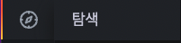
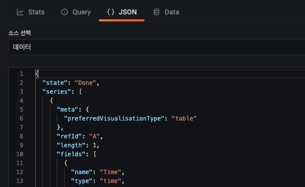
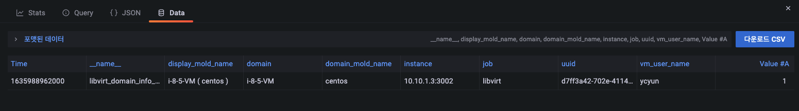

# 탐색
탐색 메뉴는 원천 데이터소스로 부터 사용자가 직접 쿼리를 작성하여 데이터를 확인하는 기능을 제공합니다. 

메뉴 구조는 데이터소스에 직접 쿼리를 조회하는 "탐색" 기능으로 구성되어 있습니다.

1) 데이터소스를 선택  
2) Split : 검색 결과 화면을 분할  
3) Clear all : 모든 검색 결과를 초기화  
4) Run query : 쿼리 실행  
5) Add query : 실행 쿼리를 추가  
6) Query history : 쿼리 실행 이력 출력  
7) Inspector : 쿼리 결과 (Stats, Query, JSON, Data) 정보 조사  

## 쿼리 실행

쿼리 실행 결과를 "Graph" 형식과 "Table" 형식 두 가지 방식으로 정보를 제공합니다.

## 쿼리 히스토리

쿼리 실행 이력을 제공합니다. 재실행, 이력 삭제, 이력 즐겨찾기 등 작업을 수행할 수 있습니다.

## 조사관

쿼리 실행 결과에 대해 추가적 조사 정보를 제공합니다.

### 통계

쿼리 실행 결과에 대한 통계정보를 제공합니다.

* 전체 요청 시간 : 쿼리가 실행되는데 걸리는 시간 표시
* 쿼리 수 : 쿼리 개수
* 전체 행 수 : 쿼리가 실행되어 출력된 행의 개수

### 쿼리 검사기

쿼리 검사기를 이용하면 원시 요청 및 응답 정보를 확인할 수 있습니다.

* 새로고침 : 쿼리 결과를 새로고침
* 모든 항목 확장 : "request", "response" 결과를 확장하여 표출
* 클립 보드에 복사 : "request", "response" 결과를 클립보드에 복사

### JSON

쿼리 조회 결과를 json 형식으로 확인 가능합니다.

### Data

쿼리 조회 결과를 테이블 형식으로 표현하고, csv 형식으로 다운로드할 수 있습니다.

