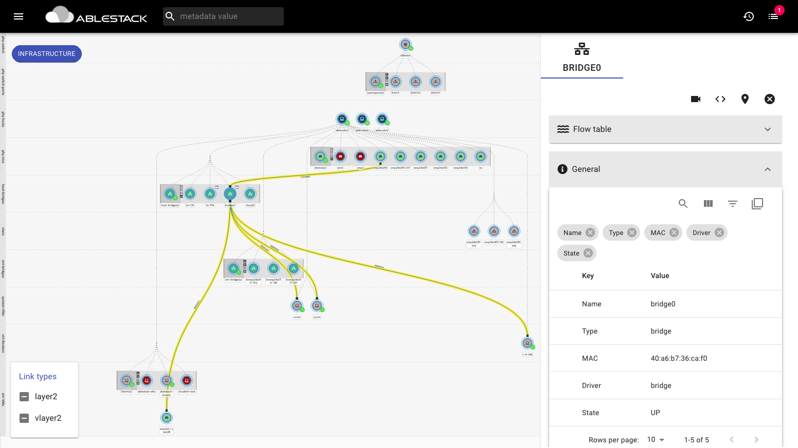
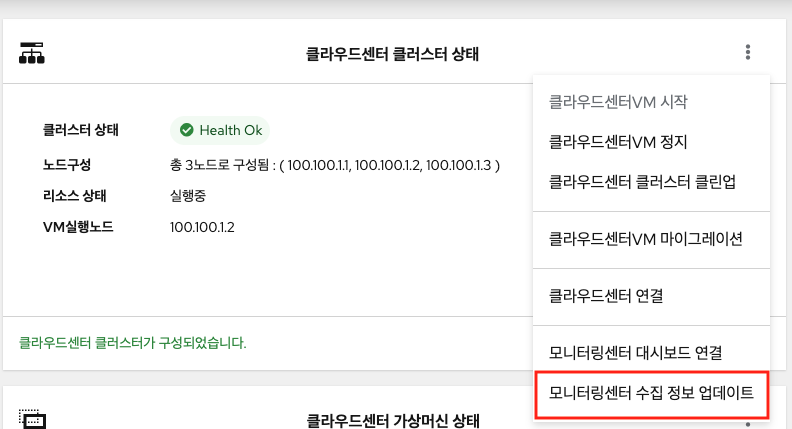

# Netdive

## Netdive 소개
Netdive는 실시간 네트워크 토폴로지 및 프로토콜 분석기로써 네트워크 인프라에서 일어나는 일을 포괄적으로 이해할 수 있도록 정보를 제공하는 것을 목표로 합니다.

Netdive Analyzer는 Agent로부터 네트워크 이벤트를 수신하여 아래와 같은 네트워크 토폴로지를 표시합니다.

### 주요 기능
* 네트워크 토폴로지 및 flows 캡처
* VM 인프라 지원
* 스위치 정보 수집
* 메타데이터 검색을 통한 하이라이트 기능

### Tutorials
  - 시작하기
    - 웹 UI
        - Netdive의 설치가 완료된 후 포트 8082를 통해 Web UI를 사용할 수 있습니다. 웹 브라우저에서 http://{mold의 ipv4 주소}:8082에 접속하면 토폴로지가 나타납니다.
    - 토폴로지 화면 구성
        - 토폴로지는 계층으로 구분되어 있으며 각 노드(Node)들은 해당되는 계층에 그룹형태로 위치해 있습니다.
        - 노드(Node)들의 관계는 엣지(Edge)로 표시되며 Parent-Child 관계를 표현하거나 데이터 의 흐름을 나타냅니다.
        - 구성요소의 메타데이터를 확인하는 방법은 노드 및 엣지를 클릭하여 나타나는 토폴로지의 우측 에서 확인할 수 있습니다.
    - 네트워크 정보 수신
        - Netdive Agent는 각 네트워크 정보를 수집하는 여러 Probe로 이루어져 있으며 기본적으로 NetLINK, LibVirt, LLDP, Socket Information Probe가 활성화 되어있습니다.
        - NetLINK Probe를 통한 네트워크 정보의 업데이트 주기는 30초입니다.
        - 스위치의 정보는 LLDP Probe를 통해 수집되는데 먼저 스위치에서 LLDP 기능을 활성화 하여야 합니다. 스위치가 LLDP 정보를 송신하면 Netdive의 Probe와 각 Host에 설치된 "lldpd 패키지"를 활용하여 정보를 수신하여 사용자에게 제공합니다.

  - 스위치 정보 수집
    - Netdive는 LLDP를 사용하여 스위치 정보를 수집하고 분석할 수 있습니다. 스위치 정보가 나타나지 않을 경우 이를 해결하기 위해 추가 설정이 필요합니다.
    - 제조사 별 스위치의 LLDP(Link Layer Discovery Protocol) 활성화
        - Mellanox
          ~~~
          admin [standalone: master] > enable
          admin [standalone: master] # configure terminal
          admin [standalone: master] (config) # lldp				## lldp 활성화
          admin [standalone: master] (config) # show lldp local	## lldp 활성화 확인
          ~~~
        - Cisco
          ~~~
          switch# configure terminal
          switch(config)# lldp run								## lldp 활성화
          switch(config)# show lldp								## lldp 활성화 확인
          ~~~
    - lldpd 서비스 실행
      - Netdive Agent가 설치된 각 호스트에서 lldpd 서비스를 재시작 합니다.
        ~~~
        systemctl restart lldpd.service
        ~~~

 - 트래픽 캡처
    - 캡처가 시작되면 캡처된 인터페이스에 캡처가 활성 상태임을 나타내는 '카메라 모양'이 표시됩니다.
         

    - 캡처를 설정하기 위해서는 해당 노드를 오른쪽 마우스로 클릭하여 "Capture"를 선택하거나 우측 상단에 위치한 "카메라 모양"을 클릭하여 설정합니다.
    
      

    - 캡처를 할 수 있는 대상에는 제한이 있습니다. Node의 타입이 device, bridge, vlan일 경우 캡처 기능을 활성화 할 수 있습니다.
    - 캡처 삭제는 캡처가 활성화된 노드를 오른쪽 마우스로 클릭하여 "Delete Captures"를 선택하거나 UI 우측에 있는 아코디언 메뉴 중 "Captures"를 클릭한 후 삭제할 캡처를 선택하여 삭제합니다.
    !!! info
        캡처를 삭제하지 않고 네트워크 정보가 변경되어 서비스를 재시작할 경우 Error 메시지가 발생할 수 있으므로 사용하지 않는 캡처는 사전에 삭제되어야 합니다.

  - Flow table
    - 캡처가 정상적으로 활성화되면 우측 아코디언 메뉴에 Flow table이 나타납니다.
    - Flow table 메뉴 상단에 "View Columns"를 클릭하면 테이블에 표시할 컬럼을 선택할 수 있습니다.
    - Flow table의 사용 예로 Flow table을 통해 캡처가 활성화된 네트워크(Network A)에서 Network B 사이의 연결성 확인 또는 데이터 이동량 등을 확인할 수 있습니다.  
    
    !!! info
        Flow table이 로딩되는 데 정보량에 따라 10초 이상의 시간이 걸리는 경우도 있습니다.

## 이슈 해결
  - 스위치 정보 및 토폴로지 오류
    - 스위치 정보가 정상적으로 나타나지 않을 때, 또는 Netdive의 설정을 변경하거나 정상적으로 토폴로지가 표현되지 않을 경우 서비스를 재시작해야 합니다.
      - Cube ABLESTACK에 접속합니다.
        - 클라우드센터 클러스터 상태 카드의 메뉴에서 "모니터링센터 수집 정보 업데이트"를 실행합니다.
        
        
