# 데이터 소스

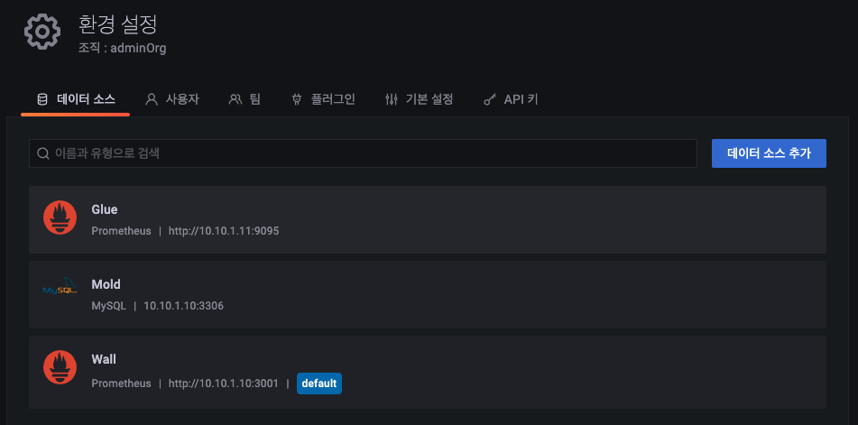

데이터 소스 항목에서 등록되어 있는 데이터 소스의 목록을 확인 가능합니다. 또한 "이름과 유형으로 검색" 기능은 검색하고자 하는 데이터 소스의 이름 또는 유형으로 검색이 가능합니다.

* 데이터 소스 추가 : 기본적으로 Wall에서는 "Glue", "Mold", "Wall", "Loki", "yesoreyeram-infinity" 데이터 소스가 설정되어 있으며 "Glue", "Wall"의 데이터 소스는 Prometheus이며 "Mold"의 데이터 소스는 Mysql을 사용합니다.

# 관리
Wall 모니터링에 필요한 환경 설정 정보를 관리할 수 있습니다.

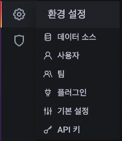

Wall 전역 기본 환경설정 및 설정 관리하는 "일반", 패널을 플러그인으로 추가할 수 있는 "플러그인 및 데이터", Wall 사용자(팀) 및 액세스를 관리하는 "사용자 및 액세스" 기능으로 구성되어 있습니다.

## 사용자

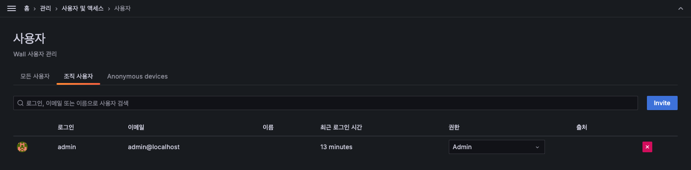

사용자 항목에서 등록되어 있는 사용자의 목록을 확인 가능합니다. 또한 "이메일과 이름으로 사용자 검색" 기능은 검색하고자 하는 사용자의의 이메일 또는 사용자로 검색이 가능합니다.

* 초대 : 사용자를 초대하는 기능을 제공합니다.
* 권한 : 권한을 변경합니다.
* x 버튼 : x 버튼을 클릭하여 사용자를 삭제합니다.

### 사용자 권한

사용자는 하나 이상의 조직에 속할 수 있습니다. 사용자의 조직 구성원 자격은 해당 조직에서 사용자가 수행할 수 있는 작업을 정의하는 역할에 연결됩니다.

**역할 비교**

||admin|editor|viewer|
|----|----|----|----|
|대시보드 보기|NS|NS|NS|
|대시보드 추가, 편집, 삭제|NS|NS||
|폴더 추가, 편집, 삭제|NS|NS||
|재생목록 보기|NS|NS|NS|
|재생 목록 생성, 업데이트, 삭제|NS|NS||
|액세스 탐색|NS|NS||
|데이터 소스 추가, 편집, 삭제|NS|||
|사용자 추가 및 수정|NS|||
|팀 추가 및 편집|NS|||
|조직 설정 변경|NS|||
|팀 설정 변경|NS|||
|앱 플러그인 구성|NS|||

## 팀

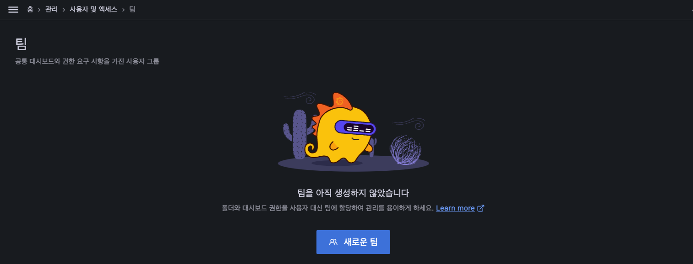

팀은 Wall 서버에 조직에 할당된 사용자의 그룹입니다. 각 사용자는 둘 이상의 조직과 둘 이상의 팀에 속할 수 있습니다. 팀은 일반적으로 조직 관리자가 관리하지만 editors_can_admin 서버 설정을 true로 설정하면 편집자도 관리할 수 있습니다. 자세한 내용은 역할 비교를 참조하십시오.

* 새로운 팀 : 새 팀을 추가합니다.

### 팀 추가
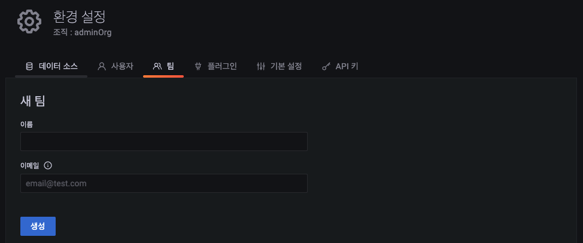

1) 이름 : 생성할 팀 이름 입력
2) 이메일 : 팀 이메일 입력
3) 생성 버튼 : 클릭하여 팀 생성

### 팀원 추가
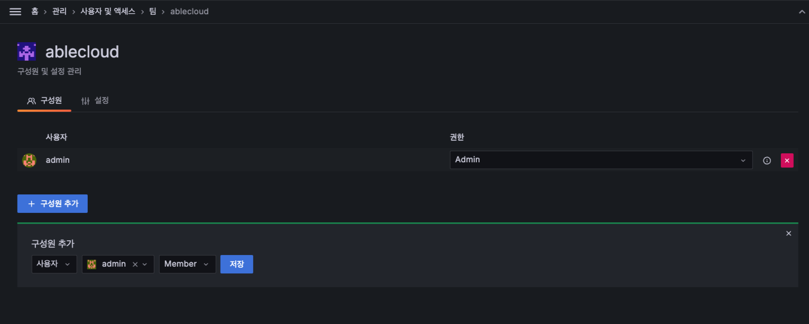
생성된 팀에 팀원을 추가하는 화면입니다.

* 구성원 추가 : 멤버 추가를 클릭하여 팀원 추가 영역 활성화합니다.

### 팀 목록
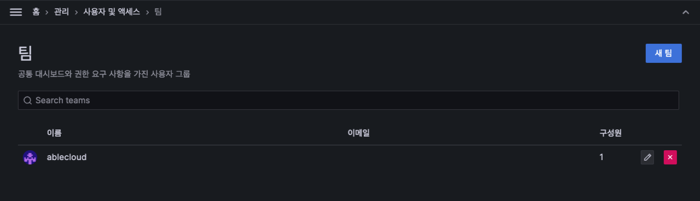
등록된 팀 목록을 보여주고 새로운 팀을 추가하거나 팀 삭제, 수정 등의 작업을 수행할 수 있습니다.

* 팀 검색 : 검색하고자 하는 팀 이름 입력합니다.
* 새 팀 : 새 팀을 추가합니다.
* x 버튼 : x 버튼을 클릭하여 팀 삭제합니다.

## 플러그인
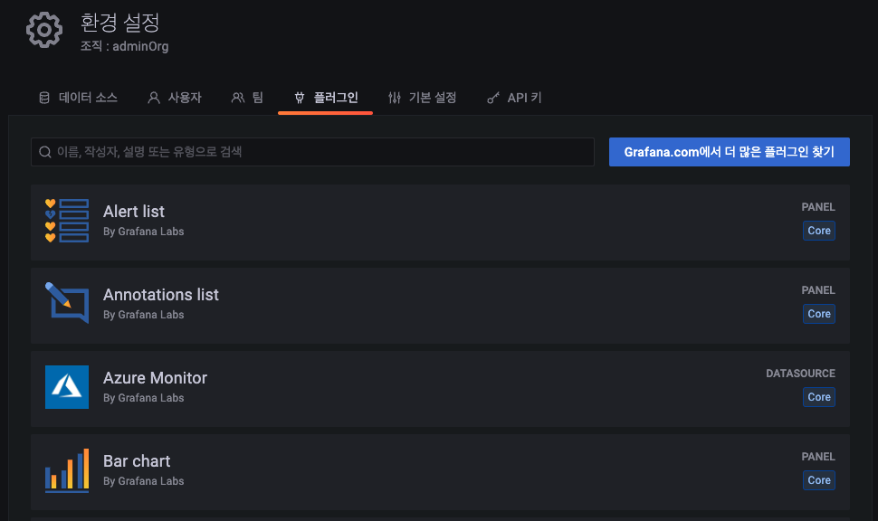
Wall은 기본적으로 제공하는 다양한 시각화 및 데이터 소스 외에도 플러그인을 사용할 수 있습니다.

**패널 플러그인**
Worldmap Panel, Clock 및 Pie Chart 와 같은 패널 플러그인을 사용하여 대시보드에 새로운 시각화를 추가할 수 있습니다.

**데이터 소스 플러그인**
데이터 소스 플러그인은 Google BigQuery 와 같은 새 데이터베이스에 대한 지원을 추가합니다.

## 기본 설정
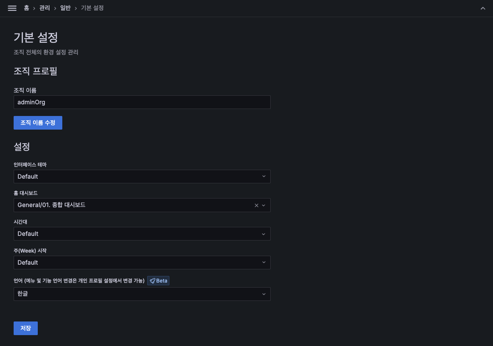

조직의 기본 설정을 할 수 있는 화면을 제공합니다. 조직 프로필 영역에서 조직 이름을 수정 가능합니다. 기존 설정 영역에서 UI 테마를 설정할 수 있고 홈 화면 대시보드와 시간대를 설정할 수 있습니다.

1) 조직 이름 : 해당 조직의 이름
2) 조직 이름 수정 : 조직 이름 수정 버튼을 클릭하여 조직 이름 변경
3) UI 테마 : Default는 Dark 모드, Dark 모드는 어두운 배경의 UI, Light 모드는 밝은 배경의 UI

!!! info
    Wall은 기본적으로 외부에서 접근 가능한 조직 "viewerOrg"와 관리자 전용 조직 "adminOrg"로 구성되어 있으며 해당 2개의 조직은 변경되면 모니터링에 문제가 발생할 수 있으니, 해당 2개의 조직을 변경 및 삭제는 관리자에게 문의바랍니다.

## 토큰
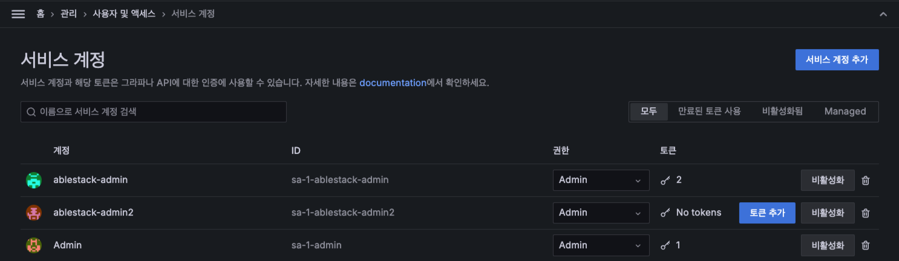

Wall에서 제공하는 API를 사용하기 위한 토큰을 생성하고 관리하는 기능을 제공합니다. 서비스 계정 화면에서 토큰을 생성 및 관리합니다.

* 토큰 추가 : 새로운 토큰을 추가합니다.

### 토큰 추가
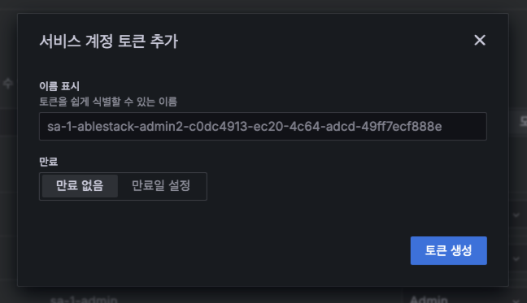

1) 이름 표시 : 쉽게 식별할 수 있는 키의 이름을 입력하거나 기본 값으로 입력하지 않음
2) 만료 : 키의 사용 가능 기간 입력 ( 입력하지 않으면 : 만료일 없음)
3) 토큰 생성 : 토큰 생성 버튼을 클릭하여 토큰 생성

**토큰 생성 완료 화면**
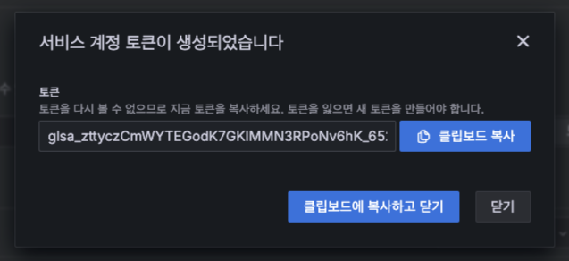

성공적으로 토큰이 생성되면 위와 같은 화면을 호출합니다.

### 토큰 목록
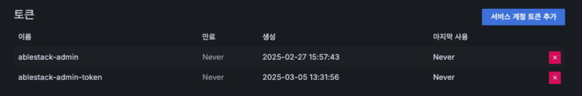
등록된 토큰 목록을 보여주고 새로운 토큰을 추가하거나 삭제, 수정 등의 작업을 수행할 수 있습니다.

1) 토큰 추가 : 새 토큰을 추가
2) x 버튼 : x 버튼을 클릭하여 토큰 삭제
