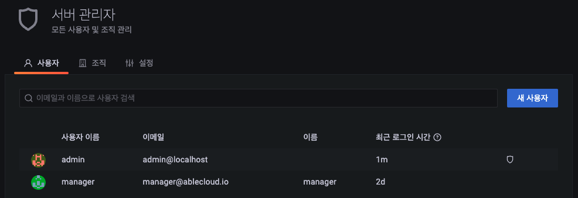
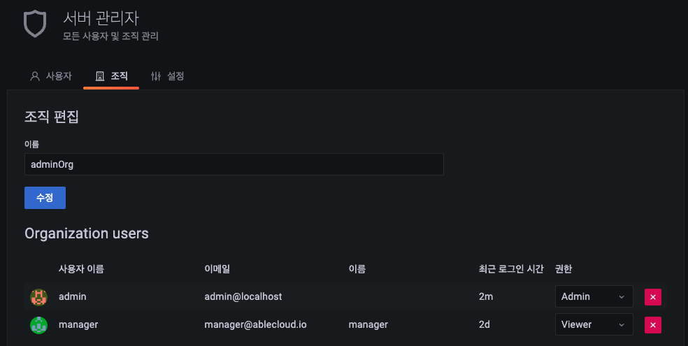
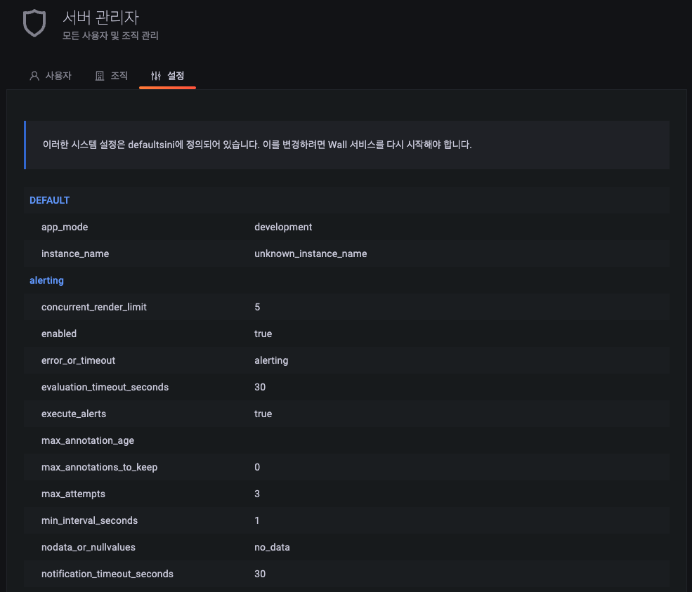

# 서버 관리자
Wall 서버 관리자 정보를 관리하는 기능을 제공합니다. 해당 메뉴에서는 사용자와 조직을 관리할수 있으며 Wall 서버 설정 정보를 확인 가능합니다. 조직 단위로 대시보드 공유가 가능합니다.

메뉴 구조는 사용자를 관리할 수 있는 "사용자", 조직을 관리할 수 있는 "조직", Wall 설정정보를 확인할 수 있는 "설정"으로 구성되어 있습니다.

!!! info
    조직관리를 하시려면 "Wall Admin" 권한의 계정으로 로그인해야 합니다.

## 사용자

사용자 조회 화면에서는 등록된 사용자의 목록을 보여주고 "새 사용자" 등록 및 현재 사용자 정보를 수정할 수 있습니다.

1) 이메일과 이름으로 사용자 검색 : 이메일과 이름을 이용하여 사용자를 검색
2) 새 사용자 : 새로운 사용자를 등록
3) 등록된 사용자 클릭 : 사용자 정보 수정 페이지로 이동

### 새 사용자 등록

새로운 사용자를 등록할 수 있는 기능을 제공합니다.

1) 이름 : 등록할 사용자 이름
2) 이메일 : 사용자 이메일
3) 사용자명 : 사용자 이름
4) 비밀번호 : 사용자 비밀번호
5) 사용자 생성 버튼 : 사용자 생성 버튼을 클릭하여 사용자 등록

!!! info
    등록기능에서는 사용자 기본 정보만 추가하고, 상세한 정보는 수정 페이지에서 입력 가능합니다.

### 사용자 정보 수정

등록된 사용자의 정보를 추가입력 하는 기능을 제공합니다.

1) 이름 > 편집 : 이름 변경 UI 제공
2) 이메일 > 편집 : 이메일 편집 UI 제공
3) 사용자 이름 > 편집 : 사용자 이름 변경 UI 제공
4) 비밀번호 > 편집 : 비밀번호 변경 UI 제공
5) 사용자 삭제 : 사용자를 삭제
6) 사용자 비활성화 : 사용자 비활성화 처리
7) 권한 > 변경 : 사용자 권한 변경
8) 조직 > 권한변경 : 권한 변경 UI 제공 (Admin, Editor, Viewer  중 선택 가능)
9) 조직 > 조직에서 제거 : 선택한 조직에서 사용자 제거
10) 조직에 사용자 추가 : 다른 조직에 사용자 등록 UI 제공

**사용자 조직 추가**

사용자를 조직에 포함 시킬 수 있습니다.

1) 조직 : 등록된 조직을 선택
2) 권한 : 권한 선택  (Admin, Editor, Viewer  중 선택 가능)

## 조직

조직 조회 화면에서는 등록된 조직의 목록을 보여주고 "새 조직" 등록 및 현재 조직 정보를 수정할 수 있습니다.

1)새 조직 : 새로운 조직을 등록
2) 등록된 조직 클릭 : 등록된 조직 정보를 수정

### 새 조직 등록

새로운 조직을 등록할 수 있는 기능을 제공합니다.

1) 조직 이름 : 조직 이름 입력
2) 생성 버튼 : 조직 생성

### 조직 정보 수정

등록된 조직의 정보를 수정하는 기능을 제공합니다.

1) 이름 : 조직 이름 입력
2) 수정 버튼 : 조직 이름 수정하여 반영
3) 권한 : 권한 변경
4: x 버튼 : 해당 사용자를 조직에서 삭제

## 설정

!!! info
    설정정보는 defaults.ini에 정의 되어있으, 변경시 서버 재시작하여 반영할 수 있습니다.

현재 설정된 Wall 서버의 설정 정보를 리스트로 조회 가능합니다.
