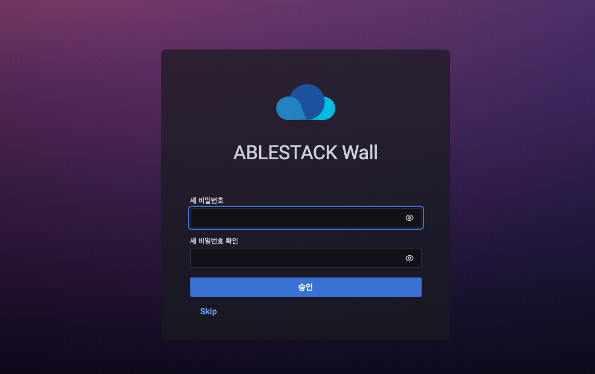
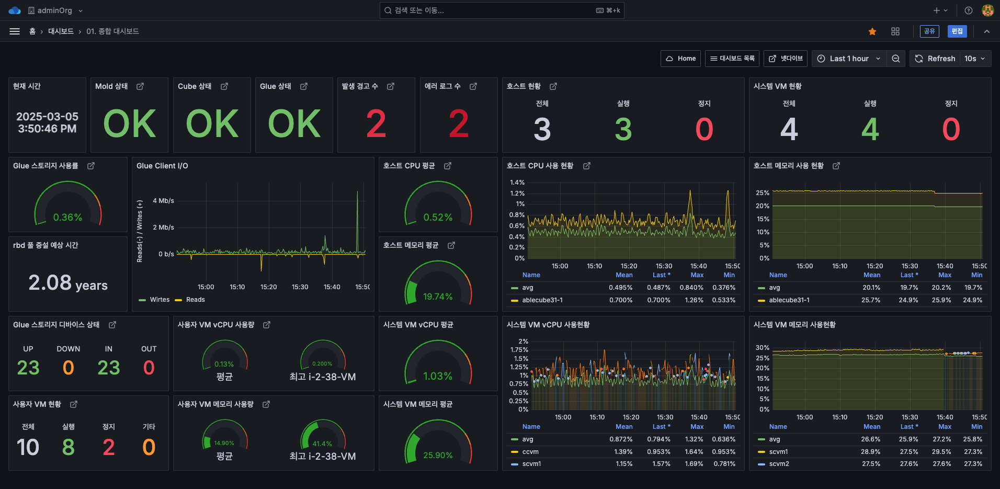
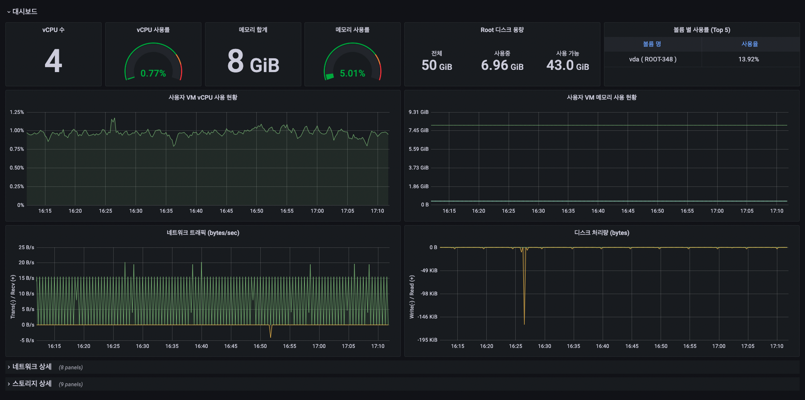

# 사용자 인터페이스

## UI 로그인
Wall은 관리자와 최종 사용자가 모두 사용할 수 있는 웹 기반 UI를 제공합니다. 관리자는 Wall에 로그인하여 ABLESTACK 모니터링에 필요한 다양한 대시보드를 확인할 수 있으며 장애 이메일 알림서비스를 통해 ABLESTACK 장애상황을 조기에 대처할 수 있습니다. 최종 사용자는 Mold UI를 통해 자신이 소유한 가상머신의 모니터링 정보를 확인할 수 있습니다.

관리자 접속하는 URL은 다음과 같습니다.

 `http://ccvm-mngt-ip:3000/login`

이메일 또는 사용자 이름 : 계정의 사용자의 이메일 또는 사용자 이름입니다. 최초 기본 사용자 이름은 admin입니다.
암호 : 사용자에 대한 암호. 최초 기본 사용자에 대한 암호는 admin입니다.

최초 로그인 성공화면 입니다.

!!! info
    초기 로그인 후 admin 계정에 대한 비밀번호 변경을 해야 합니다.

## 관리자 계정 Wall UI 개요
관리자 계정으로 로그인하면 메인 페이지인 "1. 종합 대시보드" 화면이 나타납니다.

ABLESTACK Wall 메뉴에 대한 간략한 설명은 다음과 같습니다. 

* 대시보드 검색 : 최근 본 대시보드, Wall 대시보드, 알람 대시보드를 볼 수 있습니다. 
* 생성 : 새로운 대시보드 생성, 폴더 생성, 대시보드 임포트할 수 있습니다. 
* 대시보드 : 대시보드와 폴더 및 플레이리스트를 관리합니다. 
* 탐색 : 데이터 소스를 쿼리로 조회할 수 있습니다. 
* 경고 : 경고 규칙 및 알림 채널을 설정할 수 있습니다. 
* 환경 설정 : 데이터 소스, 사용자, 팀, 플러그인, 기본 설정, API 키를 관리합니다. 
* 서버 관리 : 사용자, 조직, 설정을 관리합니다. 
* 기본설정 : 기본 설정, 비밀번호 변경을 관리합니다. 

## 관리자 계정 Mold UI에서 Wall UI 접속 방법
admin 권한의 게정으로 Mold UI로 로그인 하고  버튼 클릭하면 아래 모달창이 나타납니다.

"Monitoring Dashboard" 버튼을 클릭하여 Wall UI 로그인 페이지로 접근 가능 합니다.

## 최종 사용자 계정 Mold UI에서 Wall UI 접속 방법
최종 사용자 권한의 게정으로 Mold UI로 로그인 하고 (컴퓨트 > 가상머신) 메뉴에서 가상머신을 선택합니다.  
선택 후  버튼을 클릭하면 해당 가상머신의 모니터링을 확인할 수 있는 Wall UI 대시보드 페이지로 접근 합니다.

!!! info
    최종 사용자는 별도의 로그인 필요 없이 접근 가능합니다.