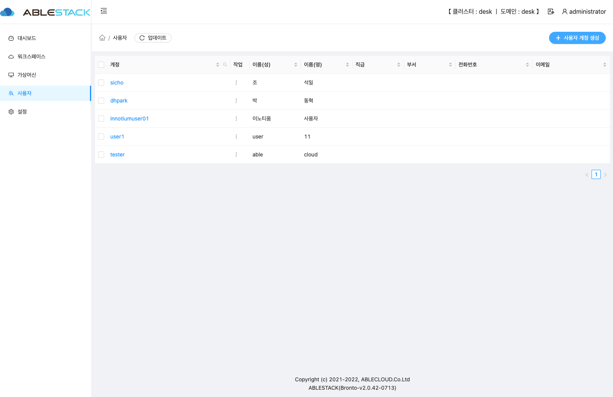
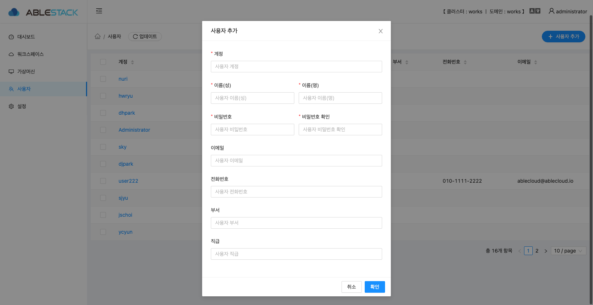
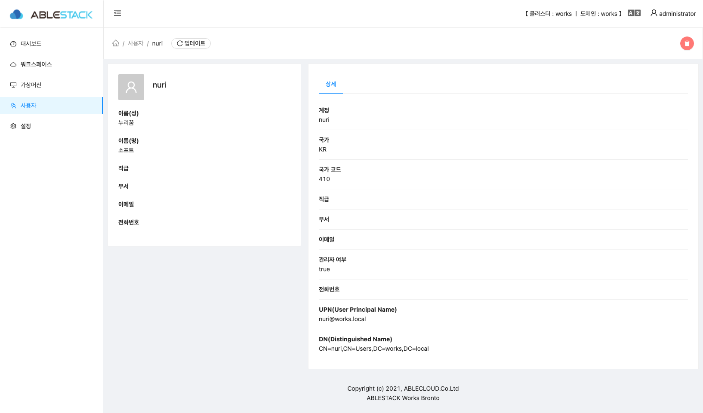
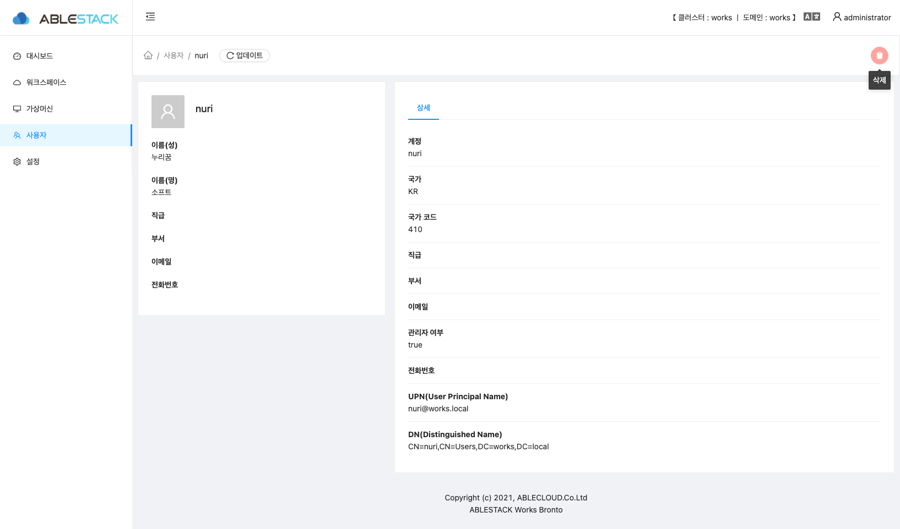
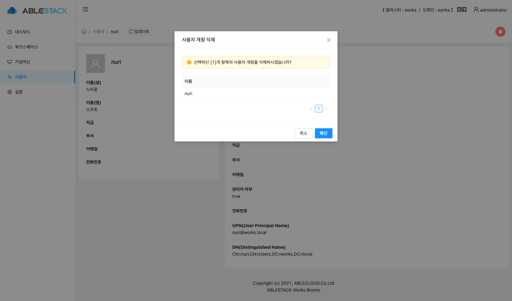

# Works 사용자

Works 의 사용자 리스트 정보 및 각종 액션을 할 수 있는 페이지 입니다.

## 사용자 리스트

해당 데스크톱 클러스터에서 생성된 사용자 리스트를 확인 할 수 있습니다.
- **계정** : 사용자 계정의 정보를 보여 줍니다.  
- **이름(성)** : 사용자 계정의 이름(성) 정보를 보여 줍니다.  
- **이름(명)** : 사용자 계정의 이름(명) 정보를 보여 줍니다.
- **직급** : 사용자 계정의 직급 정보를 보여 줍니다.
- **부서** : 사용자 계정의 부서 정보를 보여 줍니다.
- **전화번호** : 사용자 계정의 전화번호 정보를 보여 줍니다.
- **이메일** : 사용자 계정의 이메일 정보를 보여 줍니다.
- **+ 사용자추가** : 사용자 계정을 추가 할 수 있는 화면으로 이동 됩니다.

## 사용자 추가

데스크톱 클러스터에 사용자를 추가하는 모달 화면입니다.

- **계정** : 사용자의 계정을 입력합니다.
- **이름(성)** : 사용자의 이름(성)을 입력 합니다.
- **이름(명)** : 사용자의 이름(명)을 입력 합니다.
- **비밀번호** : 사용자의 비밀번호를 입력 합니다.
- **비밀번호 확인** : 사용자의 비민번호 확인을 위한 입력을 합니다.
- **이메일** : 사용자의 이메일을 입력 합니다.
- **전화번호** : 사용자의 전화번호를 입력 합니다.
- **부서** : 사용자의 부서 정보를 입력 합니다.
- **직급** : 사용자의 직급 정보를 입력 합니다.
- 입력한 정보를 확인 후에 **확인** 버튼을 클릭하면 해당 정보로 유저가 생성이 됩니다.

## 가상머신 기본 정보

유저의 기본 정보를 확인 할 수 있습니다. 기본 정보는 화면의 왼쪽에 위치하고 있습니다.  

- **계정** : 사용자 계정의 정보를 보여 줍니다.
- **이름(성)** : 사용자 계정의 이름(성) 정보를 보여 줍니다.
- **이름(명)** : 사용자 계정의 이름(명) 정보를 보여 줍니다.
- **직급** : 사용자 계정의 직급 정보를 보여 줍니다.
- **부서** : 사용자 계정의 부서 정보를 보여 줍니다.
- **전화번호** : 사용자 계정의 전화번호 정보를 보여 줍니다.
- **이메일** : 사용자 계정의 이메일 정보를 보여 줍니다.

## 사용자 상세 정보

유저의 기본 정보를 확인 할 수 있습니다. 상세 정보는 화면의 오른쪽에 위치하고 있습니다.

- **계정** : 사용자 계정의 정보를 보여 줍니다.
- **국가** : 사용자 계정의 국가 정보를 보여 줍니다.
- **국가코드** : 사용자 계정의 국가코드 정보를 보여 줍니다.
- **직급** : 사용자 계정의 직급 정보를 보여 줍니다.
- **부서** : 사용자 계정의 부서 정보를 보여 줍니다.
- **이메일** : 사용자 계정의 부서 정보를 보여 줍니다.
- **관리자 여부** : 사용자 계정의 관리자 여부 정보를 보여 줍니다.
- **전화번호** : 사용자 계정의 전화번호 정보를 보여 줍니다.
- **UPN(User Principal Name)** : 사용자 계정의 UPN 정보를 보여 줍니다.
- **DN(Distinguished Name)** : 사용자 계정의 DN 정보를 보여 줍니다.

## 사용자 상세 정보

유저의 기본 정보를 확인 할 수 있습니다. 상세 정보는 화면의 오른쪽에 위치하고 있습니다.

- **계정** : 사용자 계정의 정보를 보여 줍니다.
- **국가** : 사용자 계정의 국가 정보를 보여 줍니다.
- **국가코드** : 사용자 계정의 국가코드 정보를 보여 줍니다.
- **직급** : 사용자 계정의 직급 정보를 보여 줍니다.
- **부서** : 사용자 계정의 부서 정보를 보여 줍니다.
- **이메일** : 사용자 계정의 부서 정보를 보여 줍니다.
- **관리자 여부** : 사용자 계정의 관리자 여부 정보를 보여 줍니다.
- **전화번호** : 사용자 계정의 전화번호 정보를 보여 줍니다.
- **UPN(User Principal Name)** : 사용자 계정의 UPN 정보를 보여 줍니다.
- **DN(Distinguished Name)** : 사용자 계정의 DN 정보를 보여 줍니다.

## 사용자 액션

### 사용자 삭제

- 삭제 할려는 사용자 정보에서 오른쪽 상단의 삭 버튼을 클릭 합니다.
- 유저의 이름을 확인 후에 **확인** 버튼을 클릭하면 사용자가 삭제 됩니다.