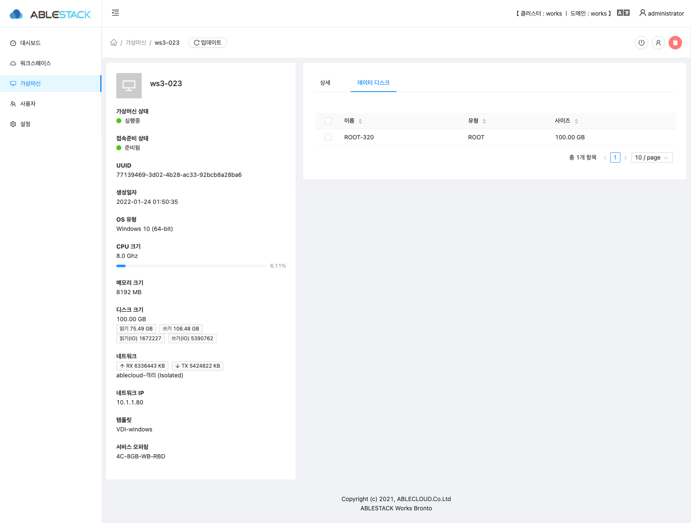
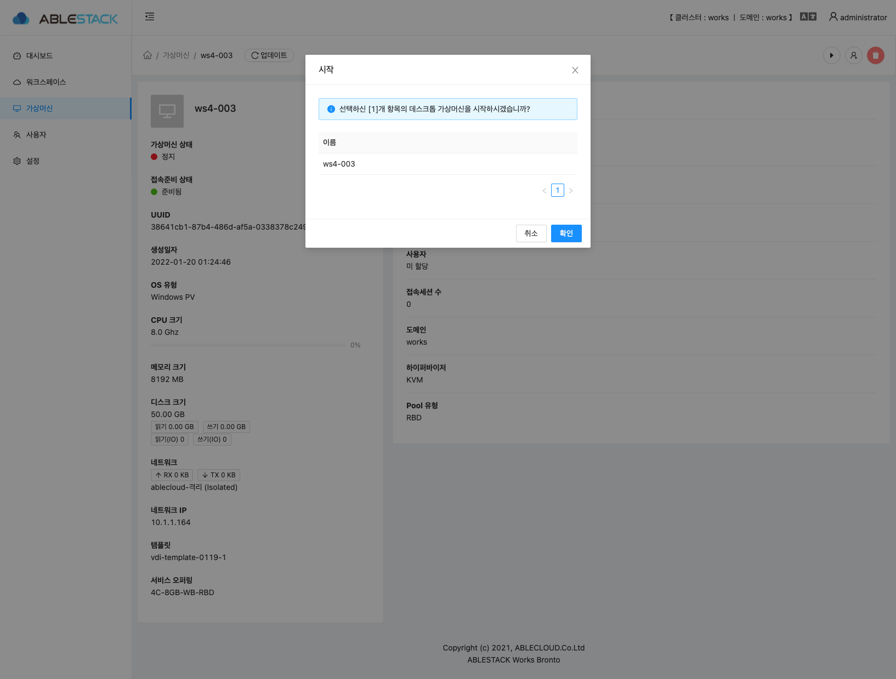
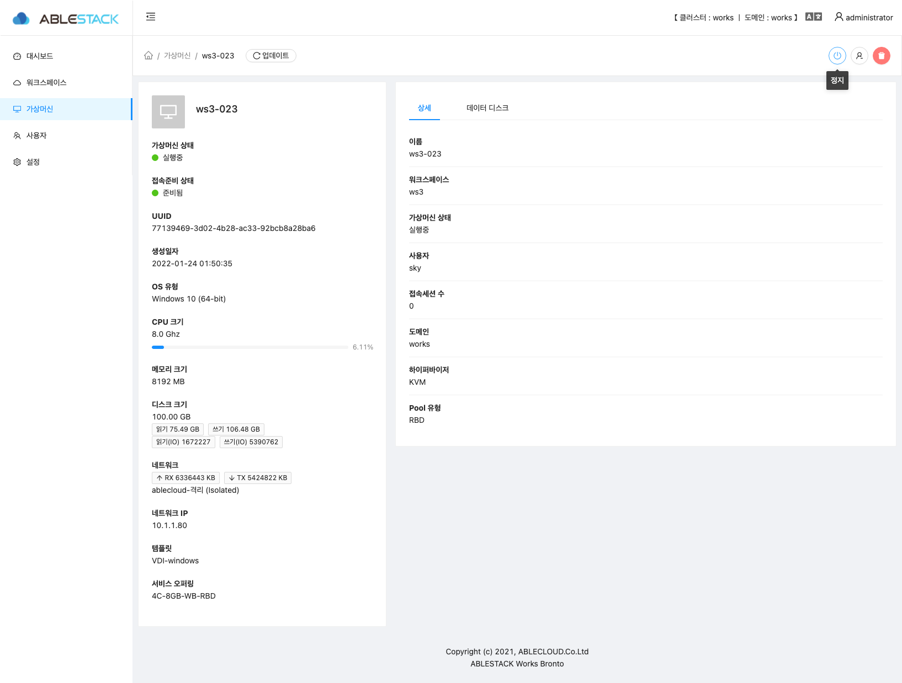
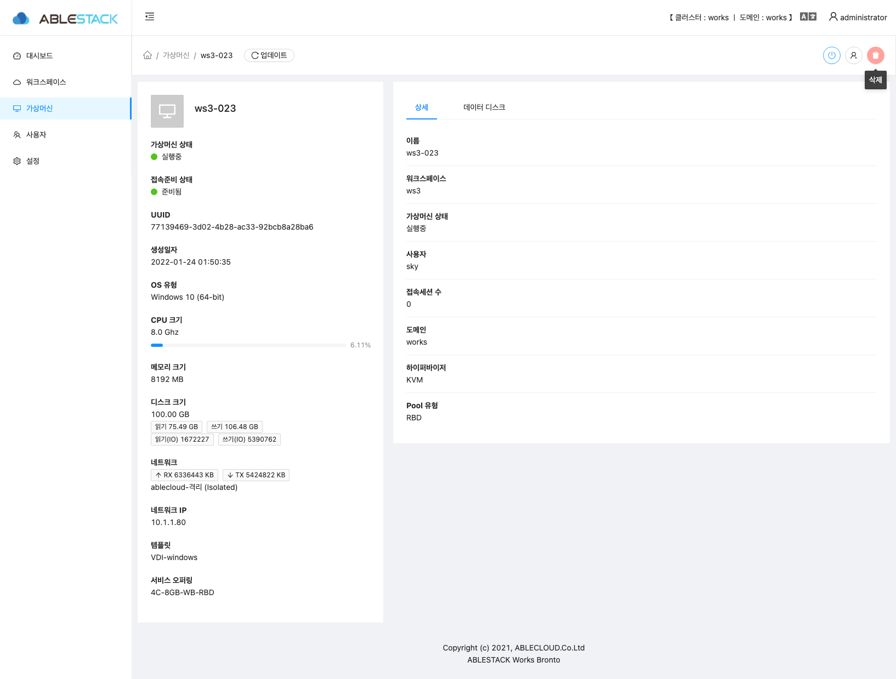
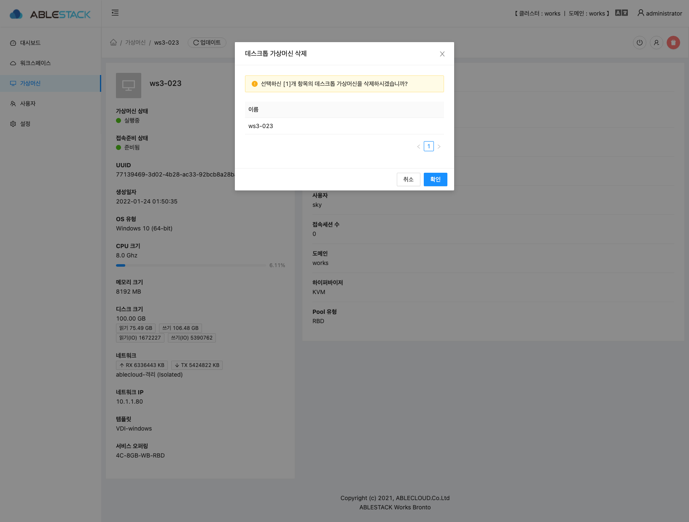

# Works 가상머신

Works 의 가상머신 리스트 정보 및 각종 액션을 할 수 있는 페이지 입니다.

## 가상머신 리스트

해당 데스크톱 클러스터에서 생성된 가상머신 리스트를 확인 할 수 있습니다.
- **이름** : 가상머신 이름 정보를 보여 줍니다.  
- **워크스페이스** : 가상머신이 생성된 워크스페이스의 이름을 보여 줍니다.  
- **워크스페이스 유형** : 가상머신이 생성된 워크스페이스의 유형 정보를 보여 줍니다.  
- **사용자** : 가상머신이 할당된 사용자 정보를 보여줍니다.
- **가상머신 상태** : 가상머신의 상태 정보를 보여 줍니다.
- **접속준비 상태** : 가상머신의 접속준비 상태 정보를 보여 줍니다.
- **네트워크 IP** : 가상머신의 네트워크 IP 정보를 보여 줍니다.
- **접속세션 수** : 가상머신에 사용자가 접속 여부 정보를 보여 줍니다.

## 가상머신 기본 정보

가상머신의 기본 정보를 확인 할 수 있습니다. 기본 정보는 화면의 왼쪽에 위치하고 있습니다.  

- **이름** : 해당 가상머신의 이름 정보를 보여 줍니다.  
- **가상머신 상태** : 해당 가상머신의 상태 정보를 보여 줍니다.  
- **접속준비 상태** : 해당 가상머신의 접속준비 상태 정보를 보여 줍니다.  
- **UUID** : 해당 가상머신의 UUID 정보를 보여 줍니다.  
- **생성일자** : 해당 가상머신의 생성일자 정보를 보여 줍니다.  
- **OS 유형** : 해당 가상머신의 유형 정보를 보여 줍니다.  
- **CPU 크기** : 해당 가상머신에 할당된 CPU 크기 정보를 보여 줍니다.  
- **메모리 크기** : 해당 가상머신에 할당된 메모리 크기 정보를 보여 줍니다.  
- **디스크 크기** : 해당 가상머신에 할당된 디스크 크기 정보를 보여 줍니다.  
- **네트워크 IP** : 해당 가상머신에 할당된 네트워크 정보를 보여 줍니다.  
- **템플릿** : 해당 가상머신이 생성된 템플릿 정보를 보여 줍니다.  
- **서비스 오퍼링** : 해당 가상머신이 생성된 서비스 오퍼링 정보를 보여 줍니다.  

## 가상머신 상세 정보

가상머신의 상세 정보를 확인 할 수 있습니다. 상세 정보는 화면의 오른쪽에 위치하고 있습니다.

- **이름** : 가상머신의 이름을 보여 줍니다.
- **워크스페이스** : 가상머신이 생성된 워크스페이스 이름의 정보를 보여 줍니다.
- **가상머신 상태** : 가상머신의 상태 정보를 보여 줍니다.
- **사용자** : 가상머신에 할당된 사용자 정보를 보여 줍니다.
- **접속세션 수** : 가상머신에 접속된 사용자 수량을 보여 줍니다.
- **도메인** : 가상머신의 도메인 정보를 보여 줍니다.
- **하이퍼바이저** : 가상머신이 생성된 서버의 하이퍼바이저 정보를 보여 줍니다.
- **Pool 유형** : 가상머신의 Disk 의 Pool 유형 정보를 보여 줍니다.

## 가상머신 데이터 디스크 정보

가상머신에 할당된 데이터 디스크 정보를 확인 할 수 있습니다.

- **이름** : 가상머신에 할당된 디스크 이름 정보를 보여 줍니다.
- **유형** : 가상머신에 할당된 디스크 유형 정보를 보여 줍니다.
- **사이즈** : 가상머신에 할당된 디스크 사이즈 정보를 보여 줍니다.

## 가상머신 액션

### 가상머신 시작

!!! info
    정지된 가상머신에서만 시작 버튼이 보여집니다.
- 시작 할려는 가상머신 정보에서 오른쪽 상단의 시작 버튼을 클릭 합니다.
- 가상머신의 이름을 확인 후에 **확인** 버튼을 클릭하면 정지된 가상머신이 시작 됩니다.

### 가상머신 정지

!!! info
    시작된 가상머신에서만 정지 버튼이 보여집니다.
- 정지 할려는 가상머신 정보에서 오른쪽 상단의 정지 버튼을 클릭 합니다.
- 가상머신의 이름을 확인 후에 **확인** 버튼을 클릭하면 시작된 가상머신이 정지 됩니다.

### 가상머신 삭제

- 삭제 할려는 가상머신 정보에서 오른쪽 상단의 삭제 버튼을 클릭 합니다.
- 가상머신의 이름을 확인 후에 **확인** 버튼을 클릭하면 시작된 가상머신이 삭제 됩니다.