# Works 워크스페이스
Works 의 워크스페이스 리스트 정보, 워크스페이스 생성 및 삭제등 각종 액션을 할 수 있는 안내페이지 입니다.

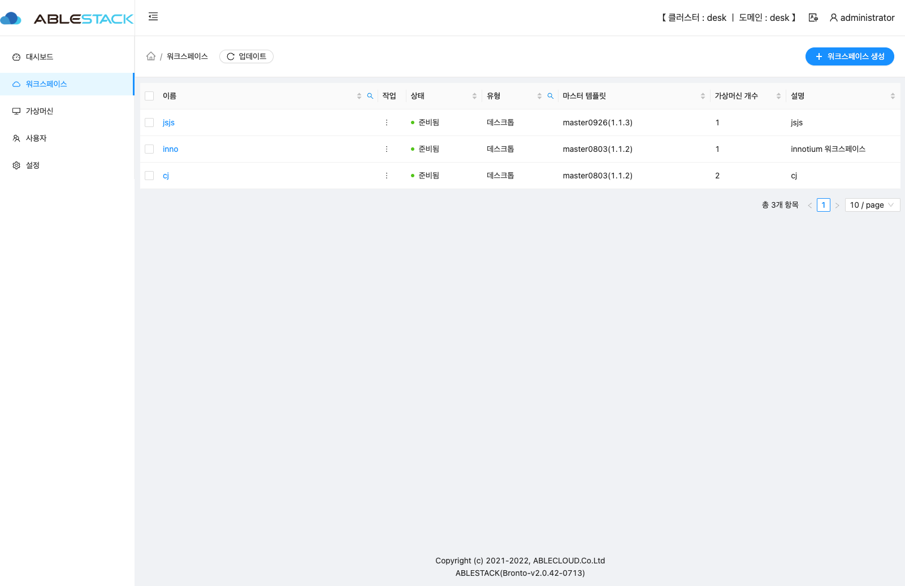

## 워크스페이스 목록

해당 데스크톱 클러스터에서 생성된 워크스페이스 목록을 확인 할 수 있습니다.

- **이름** : 워크스페이스 이름 정보를 보여줍니다.
- **상태** : 워크스페이스의 상태 정보를 보여줍니다.
- **유형** : 워크스페이스의 유형 정보를 보여줍니다.
- **마스터템플릿** : 워크스페이스의 마스터템플릿 정보를 보여 줍니다.
- **가상머신 개수** : 워크스페이스에 생성된 데스크톱 수량을 보여줍니다.
- **설명** : 워크스페이스의 상세 설명을 보여줍니다.

### 워크스페이스 생성
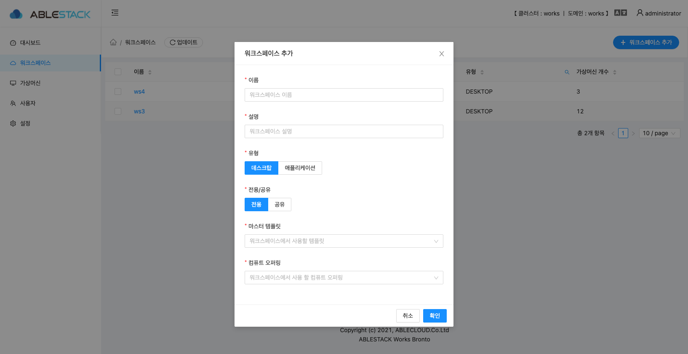

워크스페이스 신규 생성을 위한 모달 화면입니다.

- **이름** : 워크스페이스의 이름을 입력 합니다.
- **설명** : 워크스페이스의 설명을 입력 합니다.
- **마스터 템플릿** : Mold 에서 등록한 마스터 템플릿을 선택 합니다.
- **컴퓨트 오퍼링** : 사용자 데스크톱의 오퍼링을 선택합니다.

!!! info
    - 사용자 데스크톱 오퍼링은 Mold 에서 미리 생성되어 있어야 하며 해당 오퍼링을 지정하면 해당 워크스페이스에서 생성된 모든 데스크톱은 동일한 오퍼링으로 생성됩니다.
    - 만약에 오퍼링 변경이 필요한 경우 Mold 관리자에게 해당 데스크톱 오퍼링 변경을 요청하여야 합니다.
    - 입력한 정보 및 선택한 정보를 확인 후에 **확인** 버튼을 클릭하면 해당 정보로 워크스페이스가 생성이 됩니다.
!!! info
    - 워크스페이스 생성시 선택된 마스터 템플릿에서 필요한 서비스가 정상적으로 설치 되어 있는지 확인절차를 진행 합니다. 진행 시간은 환경에 따라 다르지만 10분~15분정도 소요됩니다.
    - 마스터 템플릿이 정상적이면 워크스페이스의 **상태** 정보가 **준비됨 : [Ready]** 로 변경 됩니다.

## 워크스페이스 상세 정보

워크스페이스 상세 기본 정보를 확인하는 화면입니다.

- **이름** : 해당 워크스페이스의 이름 정보를 보여 줍니다.
- **설명** : 해당 워크스페이스의 설명 정보를 보여 줍니다.
- **상태** : 해당 워크스페이스의 상태 정보를 보여 줍니다.
- **ID** : 해당 워크스페이스의 UUID 정보를 보여 줍니다.
- **생성일자** : 해당 워크스페이스의 생성일자 정보를 보여 줍니다.
- **유형** : 해당 워크스페이스의 유형 정보를 보여 줍니다.
- **전용/공유** : 해당 워크스페이의 사용 형태 정보를 보여 줍니다.
- **가상머신 개수** : 해당 워크스페이스에서 생성된 데스크톱 수량을 보여 줍니다.
- **마스터 템플릿** : 해당 워크스페이스의 마스터 템플릿 정보를 보여 줍니다.
- **컴퓨트 오퍼링** : 해당 워크스페이스의 컴퓨트 오퍼링 정보를 보여줍니다.

## 워크스페이스 가상데스크톱 탭

워크스페이스에서 생성된 가상데스크톱 리스트를 보여줍니다.

- **이름** : 가상데스크톱의 이름을 보여 줍니다.
- **사용자** : 가상데스크톱에 할당된 사용자 정보를 보여 줍니다.
- **가상머신 상태** : 가상데스크톱의 상태 정보를 보여 줍니다.
- **접속준비 상태** : 가상데스크톱 접속 준비 상태를 보여 줍니다.
- **+ 데스크톱 VM 추가** : 해당 버튼을 클릭하여 해당 워크스페이스의 데스크톱을 추가 할 수 있습니다.

### 워크스페이스 가상데스크톱 추가

해당 워크스페이에 가상데스크톱을 추가하는 모달 화면입니다.

- 추가할려는 수량을 입력 후 **확인** 버튼을 클릭하면 해당 수량 만큼 데스크탑이 추가됩니다.

### 워크스페이스 가상데스크톱 사용자 할당
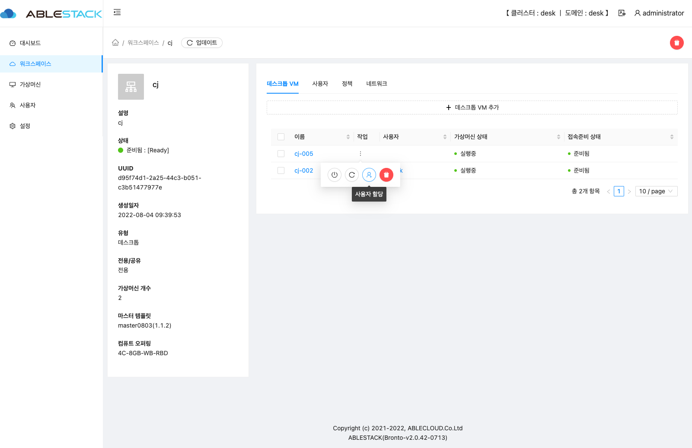
생성된 가상데스크톱에 사용자를 할당하는 화면입니다.

- 사용자추가 대상인 가상데스크톱의 **사용자할당** 버튼을 클릭합니다.

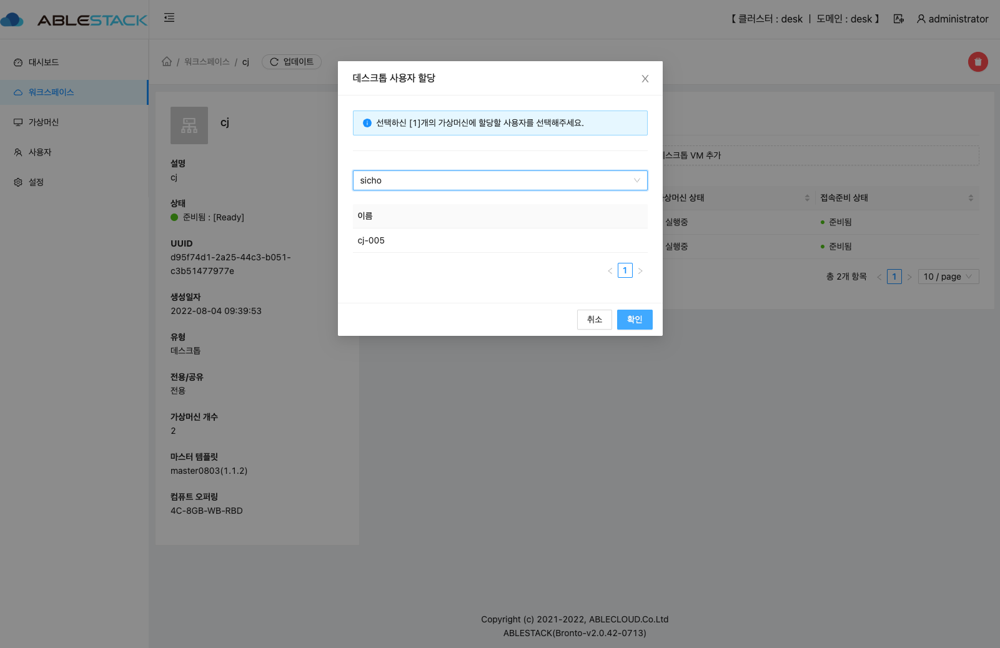

- 사용자를 선택한 후 **확인** 버튼을 클릭하면 가상데스크톱에 사용자가 할당됩니다.

## 사용자 탭

워크스페이스에 추가된 사용자 리스트를 보여줍니다.

- **이름** : 사용자 이름을 보여 줍니다.
- **이름(성)** : 사용자 성을 보여 줍니다.
- **이름(명)** : 사용자 명을 보여 줍니다.
- **직급** : 사용자 직급을 보여 줍니다.
- **부서** : 사용자 부서를 보여 줍니다.
- **전화번호** : 사용자 전화번호를 보여 줍니다.

### 워크스페이스 사용자 추가
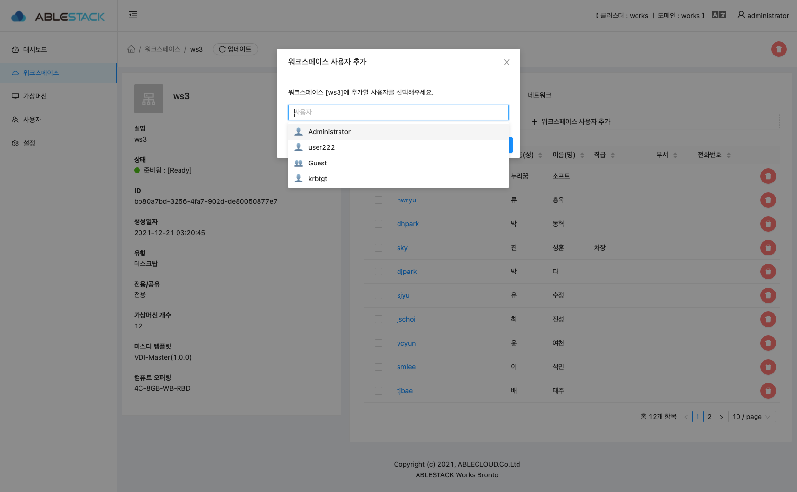
워크스페이스에 사용자를 추가하는 모달 화면입니다.

- 사용자 생성은 **사용자** 메뉴에서 생성이 가능하며 해당 화면에서는 생성된 사용자를 워크스페이스 그룹에 추가하는 기능입니다.

### 워크스페이스 사용자 삭제
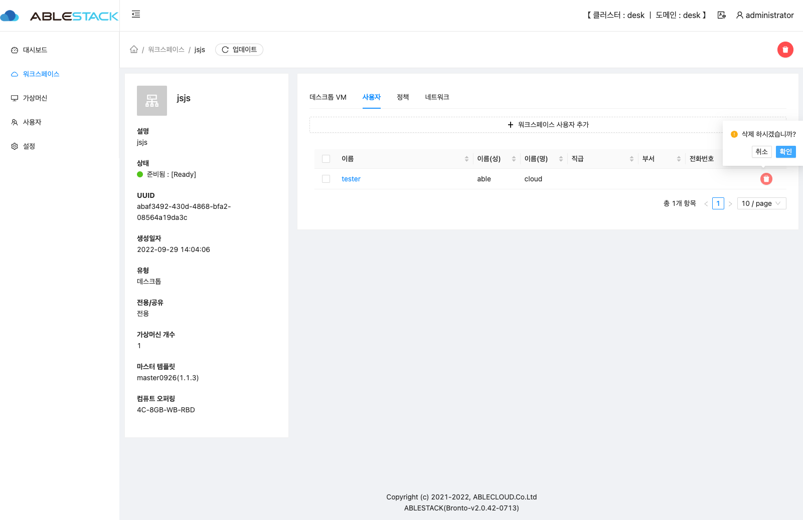
워크스페이스에 추가된 사용자를 삭제하는 화면입니다.

- 사용자 삭제는 **사용자** 메뉴에서 삭제가 가능하며 해당 화면에서는 생성된 사용자를 워크스페이스 그룹에 삭제하는 기능입니다.

## 워크스페이스 정책 탭
워크스페이스에 적용된 정책 정보를 보여주는 화면입니다.

### 그룹 정책 탭
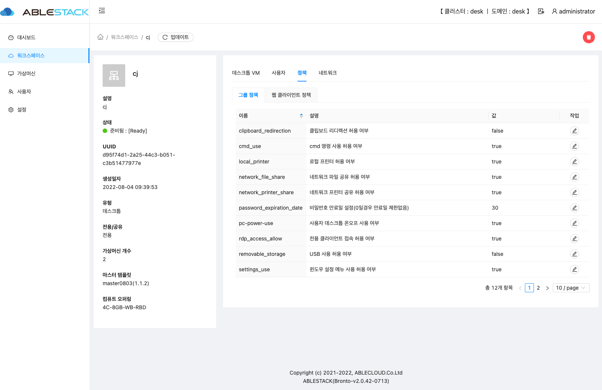
워크스페이스에 적용된 그룹정책 정보를 보여주는 화면입니다.

- **이름** : 그룹정책의 이름을 보여 줍니다.
- **설명** : 그룹정책의 설명을 보여 줍니다.
- **값** : 그룹정책의 설정 값을 보여 줍니다.

### 웹 클라이언트 정책 탭
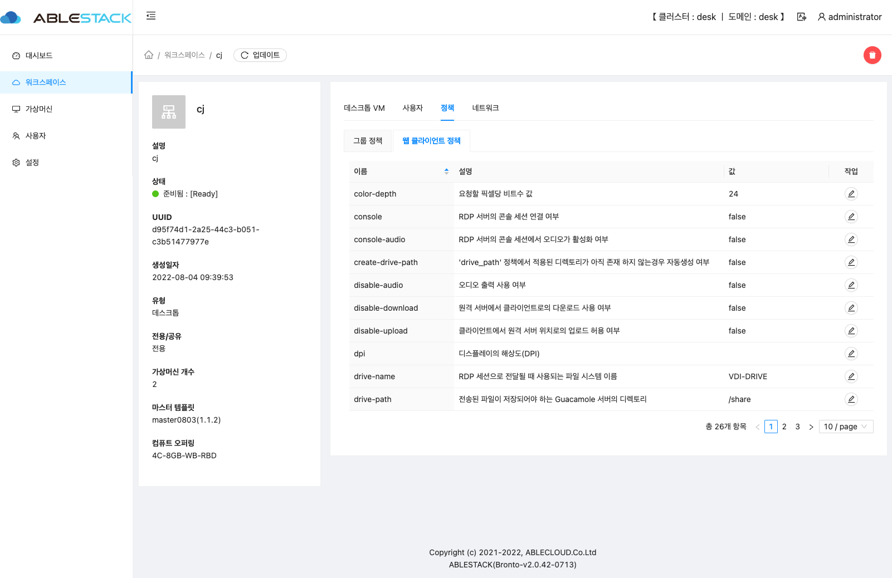
워크스페이스에 적용된 웹 클라이언트 정책 정보를 보여주는 화면입니다.

- **이름** : 웹 클라이언트 정책의 이름을 보여 줍니다.
- **설명** : 웹 클라이언트 정책의 설명을 보여 줍니다.
- **값** : 웹 클라이언트 정책의 설정 값을 보여 줍니다.

### 정책 수정

워크스페이스에 적용된 정책정보를 수정하는 화면입니다.

- **편집** 버튼을 클릭 후 값을 선택하고 **저장** 버튼을 클릭하면 값이 반영됩니다.

## 워크스페이스 네트워크 탭
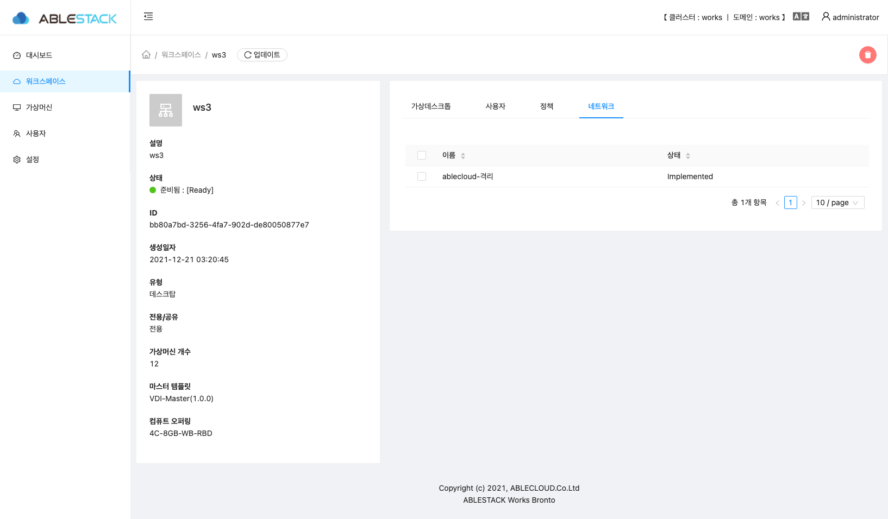
워크스페이스가 생성된 네트워크 정보를 보여 주는 화면 입니다. 

- **이름** : 네트워크 이름을 보여 줍니다.
- **상태** : 네트워크 상태를 보여 줍니다.

## 워크스페이스 삭제

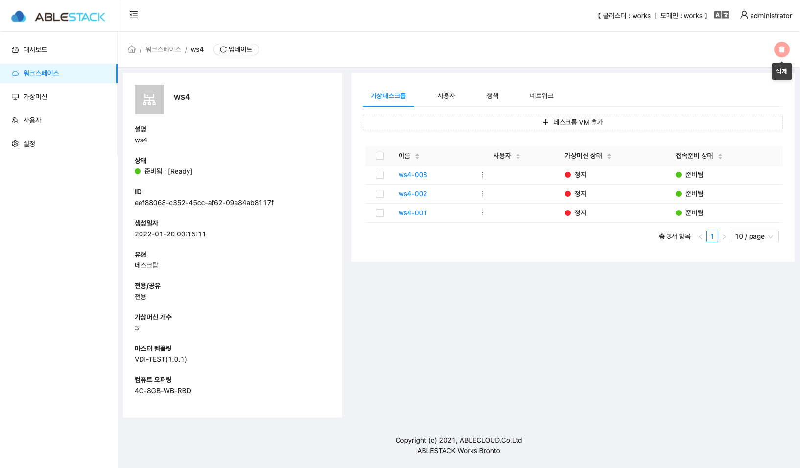
워크스페이스 삭제를 위한 화면입니다.

- 삭제 할려는 워크스페이스 정보에서 오른쪽 상단의 삭제 버튼을 클릭 합니다.

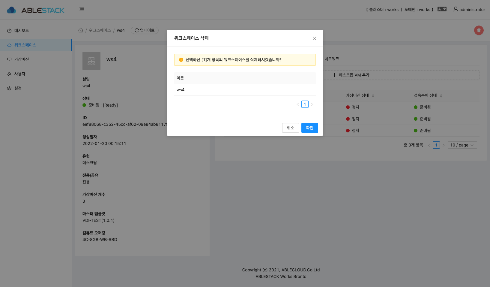
- 워크스페이스 이름을 확인 후에 **확인** 버튼을 클릭하면 워크스페이스가 삭제 됩니다.